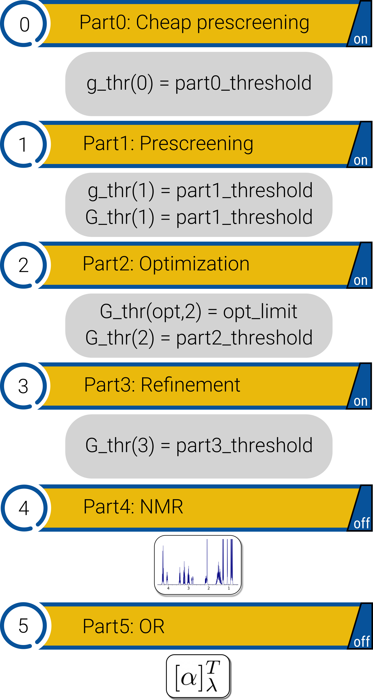

.. _CENSO:

=====================
Introduction to CENSO
=====================

General information
-------------------

**C**\ommandline **E**\nergetic **SO**\rting (**CENSO**) is a sorting algorithm 
for efficient evaluation of **S**\tructure **E**\nsembles (**SE**). 
The input ensemble (or single structure) originating from a CREST[SQM/FF] run 
can be ranked by free energy at DFT level and/or geometries can be optimized using DFT.
CENSO has a modular structure, enabling efficient sorting at different 
levels of theory and targeting individual error sources, e.g., energy or solvation. 
Sorting is based on (free) energy windows or thresholds, within which all 
conformers/structures are considered. By choosing appropriate thresholds, the 
following "properties"/results can be obtained:

* lowest lying conformer and corresponding free energy
* fully optimized SE and averaged ensemble free energy
* Boltzmann populated SE at a given temperature

Apart from the refinement/sorting of SE, CENSO offers an automated approach to 
calculate NMR properties (shielding and coupling constants) or optical rotatory 
(OR) dispersion.

To perform fast calculations ``censo`` interfaces with QM codes like ``xtb``, ``crest``, 
TURBOMOLE and ORCA. The results are read by ``censo`` and evaluated in the sorting 
algorithm.

**CENSO is the enhanced and more efficient successor of the ENSO program.**

The main publication for the CENSO program can be found at 
`J. Phys. Chem. A 2021 <https://pubs.acs.org/doi/10.1021/acs.jpca.1c00971>`_.

.. important::

    ``censo`` always keeps the conformer order of the input ensemble. E.g. CONF35 will 
    correspond to the 35th conformer of the input ensemble.

CENSO is structured into several parts, which can all be turned on or off by 
the user. These parts are presented in their intended order:

1. Part0: Cheap prescreening
2. Part1: Prescreening
3. Part2: Optimization (and free energy calculation)
4. Part3: Refinement   (optional at higher hybrid-DFA level)
5. Part4: NMR-Mode
6. Part5: OR-Mode

Nomenclature: Free energies (G) are not available in each sorting step, due 
to the computational cost involved. Sorting-thresholds based on incomplete free 
energies e.g., without thermostatistical contribution (G_mRRRHO) are denoted by 
lower case **g\_thr** and full free energies by upper case **G\_thr**.

Parts 0-3 are concerned with efficient SE sorting, optimization and calculation 
of Boltzmann-weigths for populated structures. The parts are described in the 
following:

Part0 - Cheap prescreening:
---------------------------

Flexible and/or large molecules can have many conformers (i.e., several hundred) 
and sorting out truly high lying conformers fast is crucial for efficiency. 
This is the goal of part0. Here the electronic energy description is improved 
upon the initial SQM/FF energy by performing very fast B97-D3(0)/def2-SV(P)+gcp 
single-point calculations. If the molecule is in solution phase, solvation is 
treated at GFN2-xTB[ALPB] level. Sorting is based on g\_thr(0) which has to be 
rather large, e.g. 4 kcal/mol or above.

Part1 - Prescreening:
---------------------

Accurate electronic and solvation energies are calculated in part1. To be efficient
COSMO-RS solvation contributions are calculated at r2SCAN-3c level, whereby both 
the gas phase electronic energy and solvation contribution is obtained and no 
additional calculations are necessary. Conformers above the threshold g\_thr(1) 
are discarded. After sorting, thermostatistical contributions (G\_mRRHO) are 
calculated at GFN2-xTB\[ALPB\] level using single-point hessian (:ref:`SPH`) calculations.
Full free energies are calculated and sorting is performed based on G\_thr(1). 
The threshold can be automatically increased (fuzzy-threshold) as a function of 
the standard deviation of G\_mRRHO, which is the case for flexible or diverse SE.
Up to now all calculations have been performed on the SQM/FF input geometries!

Part2 - Optimization:
---------------------

The relevant conformers/structures have to be optimized at DFT (r2SCAN-3c) level
in implicit solvation (DCOSMO-RS). An efficient ensemble optimizer has been 
implemented, where all conformers are optimized for 8 iterations. 
Then a spearman correlation coefficient is calculated to check for parallel potential
energy surfaces. If parallellity can be assumed, the sorting threshold G\_thr(2) 
is decreased and conformers above the threshold are discarded, if their gradient 
norm is below a predefined threshold. For large ensembles, this decreases the 
number of high lying conformers fast. The batch wise optimization is repeated 
until all confomers within the energy window G\_thr(2) are fully optimized. 
On the DFT optimized geometries free energies are calculated like in part1, with
COSMO-RS(r2SCAN-3c) for E, dG\_solv and GFN2-xTB[ALPB]-SPH for G\_mRRHO. 
Boltzmann weights are calculated and an ensemble averaged free energy can be 
obtained. The conformers for use in parts 3-5 are considered up to a Boltzmann 
sum threshold, e.g., all conformers up to 90 % population are further considered.

Part3 - Refinement:
-------------------

If it is necessary to refine the calculated Boltzmann weights at a higher 
(hybrid) DFT level, this can be performed in part3. Also it has to be noted, that
Boltzmann weights calculated from rather accurate r2SCAN-3c energies are reliable
enough for most applications. Like in part2 free energy contributions are calculated
on DFT optimized geometries, although using a higher (hybrid) DFT level. 
Conformers below a Boltzmann sum threshold are considered further (e.g. in part4 
or part5).

Optional property related parts (part4 and part5) are described below:

Part4 - NMR-Mode:
-----------------

In part4 NMR properties can be calculated for the populated conformers. 
The Boltzmann weights are taken from either part1, part2 or part3 if they are 
available. All populated conformers up to the population part2_threshold or 
part3_threshold are considered. Coupling and shielding constants are calculated 
separately and can be calculated for the elements H, C, F, Si, P, or all elements.
Files for further processing with ANMR are created. After the CENSO run, NMR 
spectra can be calculated using the ANMR code.

Part5 - OR-Mode:
----------------

In part5 optical rotatory (OR) dispersion of the populated structure ensemble 
can be calculated (TURBOMOLE only!). Boltzmann weights can be taken from part1, part2 or part3.
