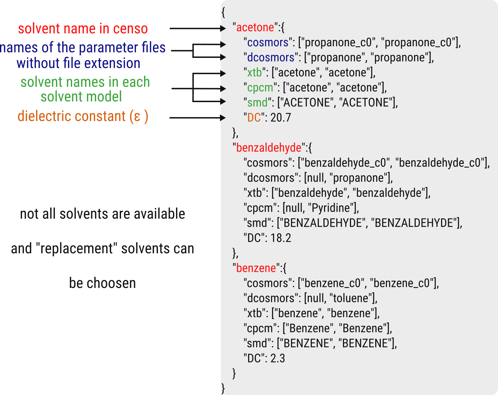

.. _censo_solvation:

Solvation
---------

CENSO uses several QM-packages and not all solvents are available for all solvation
models throughout the QM-codes. For this reason a user editable file is created 
in the folder *~/.censo_assets*:

.. tabbed:: -->

        .. code:: sh

            $  ~/.censo_assets/censo_solvents.json

.. tabbed:: censo_solvents.json

        .. code:: sh

            {
                "acetone":{
                    "cosmors": ["propanone_c0", "propanone_c0"],
                    "dcosmors": ["propanone", "propanone"],
                    "xtb": ["acetone", "acetone"],
                    "cpcm": ["acetone", "acetone"],
                    "smd": ["ACETONE", "ACETONE"],
                    "DC": 20.7
                },
                "chcl3":{
                    "cosmors": ["chcl3_c0", "chcl3_c0"],
                    "dcosmors": ["chcl3", "chcl3"],
                    "xtb": ["chcl3", "chcl3"],
                    "cpcm": ["chloroform","chloroform"],
                    "smd": ["CHLOROFORM", "CHLOROFORM"],
                    "DC": 4.8
                },
                "acetonitrile":{
                    "cosmors": ["acetonitrile_c0", "acetonitrile_c0"],
                    "dcosmors": ["acetonitrile", "acetonitrile"],
                    "xtb": ["acetonitrile", "acetonitrile"],
                    "cpcm": ["acetonitrile", "acetonitrile"],
                    "smd": ["ACETONITRILE", "ACETONITRILE"],
                    "DC": 36.6
                },
                "ch2cl2":{
                    "cosmors": ["ch2cl2_c0", "ch2cl2_c0"],
                    "dcosmors": [null, "chcl3"],
                    "xtb": ["ch2cl2", "ch2cl2"],
                    "cpcm": ["CH2Cl2", "CH2Cl2"],
                    "smd": ["DICHLOROMETHANE", "DICHLOROMETHANE"],
                    "DC": 9.1
                },
                "dmso":{
                    "cosmors": ["dimethylsulfoxide_c0", "dimethylsulfoxide_c0"],
                    "dcosmors": ["dimethylsulfoxide", "dimethylsulfoxide"],
                    "xtb": ["dmso", "dmso"],
                    "cpcm": ["DMSO", "DMSO"],
                    "smd": ["DIMETHYLSULFOXIDE", "DIMETHYLSULFOXIDE"],
                    "DC": 47.2
                },
                "h2o":{
                    "cosmors": ["h2o_c0", "h2o_c0"],
                    "dcosmors": ["h2o", "h2o"],
                    "xtb": ["h2o", "h2o"],
                    "cpcm": ["Water", "Water"],
                    "smd": ["WATER", "WATER"],
                    "DC": 80.1
                },
                "methanol":{
                    "cosmors": ["methanol_c0", "methanol_c0"],
                    "dcosmors": ["methanol", "methanol"],
                    "xtb": ["methanol", "methanol"],
                    "cpcm": ["Methanol", "Methanol"],
                    "smd": ["METHANOL", "METHANOL"],
                    "DC": 32.7
                },
                "thf":{
                    "cosmors": ["thf_c0", "thf_c0"],
                    "dcosmors": ["thf", "thf"],
                    "xtb": ["thf", "thf"],
                    "cpcm": ["THF", "THF"],
                    "smd": ["TETRAHYDROFURAN", "TETRAHYDROFURAN"],
                    "DC": 7.6
                },
                "toluene":{
                    "cosmors": ["toluene_c0", "toluene_c0"],
                    "dcosmors": ["toluene", "toluene"],
                    "xtb": ["toluene", "toluene"],
                    "cpcm": ["Toluene", "Toluene"],
                    "smd": ["TOLUENE", "TOLUENE"],
                    "DC": 2.4
                },
                "octanol":{
                    "cosmors": ["1-octanol_c0", "1-octanol_c0"],
                    "dcosmors": ["octanol", "octanol"],
                    "xtb": ["octanol", "octanol"],
                    "cpcm": ["Octanol", "Octanol"],
                    "smd": ["1-OCTANOL", "1-OCTANOL"],
                    "DC": 9.9
                },
                "woctanol":{
                    "cosmors": [null, "woctanol"],
                    "dcosmors": ["wet-otcanol", "wet-octanol"],
                    "xtb": ["woctanol", "woctanol"],
                    "cpcm": [null, "Octanol"],
                    "smd": [null, "1-OCTANOL"],
                    "DC": 8.1
                },
                "hexadecane":{
                    "cosmors": ["n-hexadecane_c0", "n-hexadecane_c0"],
                    "dcosmors": ["hexadecane", "hexadecane"],
                    "xtb": ["hexadecane", "hexadecane"],
                    "cpcm": [null, "Hexane"],
                    "smd": ["N-HEXADECANE", "N-HEXADECANE"],
                    "DC": 2.1
                },
                "dmf":{
                    "cosmors": ["dimethylformamide_c0","dimethylformamide_c0"],
                    "dcosmors": [null, "dimethylsulfoxide"],
                    "xtb": ["dmf", "dmf"],
                    "cpcm": ["DMF", "DMF"],
                    "smd": ["N,N-DIMETHYLFORMAMIDE", "N,N-DIMETHYLFORMAMIDE"],
                    "DC": 38.3
                },
                "aniline":{
                    "cosmors": ["aniline_c0", "aniline_c0"],
                    "dcosmors": ["aniline", "aniline"],
                    "xtb": ["aniline", "aniline"],
                    "cpcm": [null,"Pyridine"],
                    "smd": ["ANILINE", "ANILINE"],
                    "DC": 6.9
                },
                "cyclohexane":{
                    "cosmors": ["cyclohexane_c0", "cyclohexane_c0"],
                    "dcosmors": ["cyclohexane", "cyclohexane"],
                    "xtb": [null, "hexane"],
                    "cpcm": ["Cyclohexane", "Cyclohexane"],
                    "smd": ["CYCLOHEXANE", "CYCLOHEXANE"],
                    "DC": 2.0
                },
                "ccl4":{
                    "cosmors": ["ccl4_c0", "ccl4_c0"],
                    "dcosmors": ["ccl4", "ccl4"],
                    "xtb": ["ccl4", "ccl4"],
                    "cpcm": ["CCl4", "CCl4"],
                    "smd": ["CARBON TETRACHLORIDE", "CARBON TETRACHLORIDE"],
                    "DC": 2.2
                },
                "diethylether":{
                    "cosmors": ["diethylether_c0", "diethylether_c0"],
                    "dcosmors": ["diethylether", "diethylether"],
                    "xtb": ["ether", "ether"],
                    "cpcm": [null, "THF"],
                    "smd": ["DIETHYL ETHER", "DIETHYL ETHER"],
                    "DC": 4.4
                },
                "ethanol":{
                    "cosmors": ["ethanol_c0", "ethanol_c0"],
                    "dcosmors": ["ethanol", "ethanol"],
                    "xtb": ["ethanol", "ethanol"],
                    "cpcm": [null, "Methanol"],
                    "smd": ["ETHANOL", "ETHANOL"],
                    "DC": 24.6
                },
                "hexane":{
                    "cosmors": ["hexane_c0", "hexane_c0"],
                    "dcosmors": ["hexane", "hexane"],
                    "xtb": ["hexane", "hexane"],
                    "cpcm": ["Hexane", "Hexane"],
                    "smd": ["N-HEXANE", "N-HEXANE"],
                    "DC": 1.9
                },
                "nitromethane":{
                    "cosmors": ["nitromethane_c0", "nitromethane_c0"],
                    "dcosmors": ["nitromethane", "nitromethane"],
                    "xtb": ["nitromethane", "nitromethane"],
                    "cpcm": [null, "methanol"],
                    "smd": "",
                    "DC": 38.2
                },
                "benzaldehyde":{
                    "cosmors": ["benzaldehyde_c0", "benzaldehyde_c0"],
                    "dcosmors": [null, "propanone"],
                    "xtb": ["benzaldehyde", "benzaldehyde"],
                    "cpcm": [null, "Pyridine"],
                    "smd": ["BENZALDEHYDE", "BENZALDEHYDE"],
                    "DC": 18.2
                },
                "benzene":{
                    "cosmors": ["benzene_c0", "benzene_c0"],
                    "dcosmors": [null, "toluene"],
                    "xtb": ["benzene", "benzene"],
                    "cpcm": ["Benzene", "Benzene"],
                    "smd": ["BENZENE", "BENZENE"],
                    "DC": 2.3
                },
                "cs2":{
                    "cosmors": ["cs2_c0", "cs2_c0"],
                    "dcosmors": [null, "ccl4"],
                    "xtb": ["cs2", "cs2"],
                    "cpcm": [null, "CCl4"],
                    "smd": ["CARBON DISULFIDE", "CARBON DISULFIDE"],
                    "DC": 2.6
                },
                "dioxane":{
                    "cosmors": ["dioxane_c0", "dioxane_c0"],
                    "dcosmors": [null, "diethylether"],
                    "xtb": ["dioxane", "dioxane"],
                    "cpcm": [null, "Cyclohexane"],
                    "smd": ["1,4-DIOXANE", "1,4-DIOXANE"],
                    "DC": 2.2
                },
                "ethylacetate":{
                    "cosmors": ["ethylacetate_c0", "ethylacetate_c0"],
                    "dcosmors": [null, "diethylether"],
                    "xtb": ["ethylacetate", "ethylacetate"],
                    "cpcm": [null, "THF"],
                    "smd": ["ETHYL ETHANOATE", "ETHYL ETHANOATE"],
                    "DC": 5.9
                },
                "furan":{
                    "cosmors": ["furane_c0", "furane_c0"],
                    "dcosmors": [null, "diethylether"],
                    "xtb": ["furane", "furane"],
                    "cpcm": [null, "THF"],
                    "smd": [null, "THF"],
                    "DC": 3.0
                },
                "phenol":{
                    "cosmors": ["phenol_c0", "phenol_c0"],
                    "dcosmors": [null, "thf"],
                    "xtb": ["phenol", "phenol"],
                    "cpcm": [null, "THF"],
                    "smd": [null, "THIOPHENOL"],
                    "DC": 8.0
                }
            }

The file contains a dictionary of all available solvent models and solvents. If a 
solvent is not available with a certain solvent model, the user can then choose 
a replacement solvent within the same solvation model. E.g. if benzene is not 
available in DCOSMO-RS choose toluene in DCOSMO-RS.

.. code:: sh

    {   # EXAMPLE
        "solvent-name-in-CENSO":{
            "solvent-model1": ["solvent-name in solvent model","solvent-name USED in solvent model"],
            "solvent-model2": ["null = solvent not found"," replacement solvent USED"],
            "xtb represents ALPB or GBSA" : ["solvent", "solvent],
            "DC = Dielectric Constant: Used for COSMO and DCOSMO-RS
        },
        # END EXAMPLE
        "acetonitrile":{
            "cosmors": ["acetonitrile_c0", "acetonitrile_c0"],
            "dcosmors": ["acetonitrile", "acetonitrile"],
            "xtb": ["acetonitrile", "acetonitrile"],
            "cpcm": ["acetonitrile", "acetonitrile"],
            "smd": ["ACETONITRILE", "ACETONITRILE"],
            "DC": 36.6
        },
        "ch2cl2":{
            "cosmors": ["ch2cl2_c0", "ch2cl2_c0"],
            "dcosmors": [null, "chcl3"],
            "xtb": ["ch2cl2", "ch2cl2"],
            "cpcm": ["CH2Cl2", "CH2Cl2"],
            "smd": ["DICHLOROMETHANE", "DICHLOROMETHANE"],
            "DC": 9.1
        },
    }

.. warning:: 

    The solvent file is directly used in `censo` and typos will cause the 
    calculations to crash! 

Adding a new solvent is as easy as adding a new dictionary entry to the file.

In CENSO several solvent models can be applied. The intention is either a good 
description of the free energy (keyword: `smgsolv`) or an implicit effect on a 
property or geometry (keyword: `sm`).

(`sm`) implicit solvation for properties:

* COSMO                 [TM]
* CPCM                  [ORCA]
* DCOSMO-RS             [TM]
* ALPB                  [xtb]
* GBSA                  [xtb]
* SMD                   [ORCA]

(`smgsolv`) implicit solvation for free energies:

* COSMO-RS      [COSMO-RS]
* SMD_Gsolv      [ORCA]
* ALPB_Gsolv     [xtb]
* GBSA_Gsolv     [xtb]