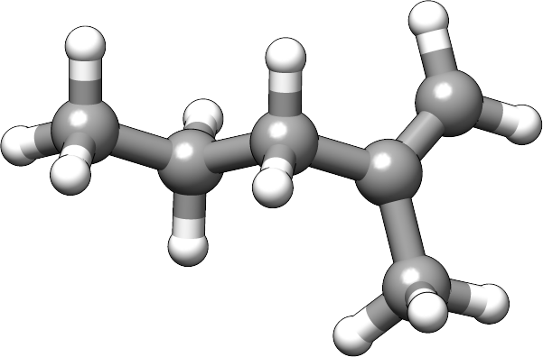

.. _usage_examples:

Usage examples
==============

CENSO can be used for several applications / target quantities. Some are listed below:

.. contents::

.. hint::

    CENSO has sorting "parts" which can be turned *on* and *off*. The parts are run 
    in sequence and the sorting-results are influenced by the choice of 
    sorting-parts employed. 
    If for example the optimization part (part2) is not performed, then all subsequent 
    parts will calculate free energies or properties on the input SQM/FF geometries 
    (not DFT optimized geometries)!
    Each part contains thresholds (see :ref:`Threshold <censo_thresholds>`) and choosing 
    to low (free) energy windows (in the early sorting parts) will affect your 
    final ensemble / averaged free energy / property. 

.. note::

    For the demonstration purpose it is assumed that all parts are turned *off* in 
    the global configuration file of the user!

Calculate fast DFT\(B97-D3(0)/def2-SV(P)+gcp) single-point energies on GFN\ *n*\ -xTB input geometries
""""""""""""""""""""""""""""""""""""""""""""""""""""""""""""""""""""""""""""""""""""""""""""""""""""""

.. hint::
    Useful in case of large structure ensembles (SE). Very efficient (fast) 
    improvement on the electronic energy description compared to the initial 
    SQM/FF energies. High lying conformers are quickly sorted out.

.. tabbed:: input

    .. code:: sh

        $ censo -inp ensemble.xyz -part0 on -chrg 1 -solvent h2o > censo.out &

.. tabbed:: output

    .. code:: sh

                     ______________________________________________________________
                    |                                                              |
                    |                                                              |
                    |                   CENSO - Commandline ENSO                   |
                    |                           v 1.0.3                            |
                    |    energetic sorting of CREST Conformer Rotamer Ensembles    |
                    |                    University of Bonn, MCTC                  |
                    |                           Feb 2021                           |
                    |                 based on ENSO version 2.0.1                  |
                    |                     F. Bohle and S. Grimme                   |
                    |                                                              |
                    |______________________________________________________________|

                    This program is distributed in the hope that it will be useful,
                    but WITHOUT ANY WARRANTY; without even the implied warranty of
                    MERCHANTABILITY or FITNESS FOR A PARTICULAR PURPOSE.

            ----------------------------------------------------------------------------------------------------
                                                         PARAMETERS                                             
            ----------------------------------------------------------------------------------------------------

            The configuration file .censorc is read from /home/bohle/1projects/from_tmp1/CENSO/documentation-calcs/1-part0/.censorc.
            Reading conformer rotamer ensemble from: /home/bohle/1projects/from_tmp1/CENSO/documentation-calcs/1-part0/ensemble.xyz.
            Reading file: censo_solvents.json

            --------------------------------------------------
                           CRE SORTING SETTINGS               
            --------------------------------------------------

            number of atoms in system:                                     25
            number of considered conformers:                               22
            number of all conformers from input:                           22
            charge:                                                        1
            unpaired:                                                      0
            solvent:                                                       h2o
            temperature:                                                   298.15
            evaluate at different temperatures:                            on
            temperature range:                                             273.15, 278.15, 283.15, 288.15, ...
            calculate mRRHO contribution:                                  on
            consider symmetry for mRRHO contribution:                      off
            cautious checking for error and failed calculations:           on
            checking the DFT-ensemble using CREST:                         off
            maxthreads:                                                    2
            omp:                                                           2

            --------------------------------------------------
                      CRE CHEAP-PRESCREENING - PART0          
            --------------------------------------------------
            part0:                                                         on
            starting number of considered conformers:                      22
            program for part0:                                             tm
            functional for fast single-point:                              b97-d
            basis set for fast single-point:                               def2-SV(P)
            threshold g_thr(0) for sorting in part0:                       4.0
            Solvent model used with xTB:                                   alpb

            short-notation:
            b97-d-D3/def2-SV(P) // GFNn-xTB (Input geometry)
            END of parameters

            ------------------------------------------------------------
                           PATHS of external QM programs                
            ------------------------------------------------------------

            The following program paths are used:
                xTB:          /home/abt-grimme/AK-bin/xtb
                TURBOMOLE:    /home/abt-grimme/TURBOMOLE.7.5.1/bin/em64t-unknown-linux-gnu_smp

                Using cefine from /home/bohle/bin/cefine
                PARNODES for TM or COSMO-RS calculation was set to 2

            ----------------------------------------------------------------------------------------------------
                                        Processing data from previous run (enso.json)                           
            ----------------------------------------------------------------------------------------------------

            INFORMATION: No restart information exists and is created during this run!

            ----------------------------------------------------------------------------------------------------
                                               CRE CHEAP-PRESCREENING - PART0                                   
            ----------------------------------------------------------------------------------------------------

            program:                                                       tm
            functional for part0:                                          b97-d
            basis set for part0:                                           def2-SV(P)
            threshold g_thr(0):                                            4.0
            starting number of considered conformers:                      22

            Calculating efficient gas-phase single-point energies:
            The efficient gas-phase single-point is calculated for:
             CONF1,  CONF2,  CONF3,  CONF4,  CONF5,  CONF6,  CONF7,  CONF8,  CONF9, CONF10, CONF11
            CONF12, CONF13, CONF14, CONF15, CONF16, CONF17, CONF18, CONF19, CONF20, CONF21, CONF22
            Constructed folders!

            Starting 22 ALPB-Gsolv calculations
            Running single-point in CONF1/part0_sp    
            Running single-point in CONF2/part0_sp    
            Running ALPB_GSOLV calculation in 1-part0/CONF1/part0_sp
            Running ALPB_GSOLV calculation in 1-part0/CONF2/part0_sp
            Running single-point in CONF3/part0_sp    
            Running single-point in CONF4/part0_sp    
            Running ALPB_GSOLV calculation in 1-part0/CONF3/part0_sp
            Running ALPB_GSOLV calculation in 1-part0/CONF4/part0_sp
            Running single-point in CONF5/part0_sp    
            Running single-point in CONF6/part0_sp    
            Running ALPB_GSOLV calculation in 1-part0/CONF5/part0_sp
            Running ALPB_GSOLV calculation in 1-part0/CONF6/part0_sp
            Running single-point in CONF7/part0_sp    
            Running single-point in CONF8/part0_sp    
            Running ALPB_GSOLV calculation in 1-part0/CONF7/part0_sp
            Running ALPB_GSOLV calculation in 1-part0/CONF8/part0_sp
            Running single-point in CONF9/part0_sp    
            Running single-point in CONF10/part0_sp   
            Running ALPB_GSOLV calculation in 1-part0/CONF9/part0_sp
            Running ALPB_GSOLV calculation in 1-part0/CONF10/part0_sp
            Running single-point in CONF11/part0_sp   
            Running single-point in CONF12/part0_sp   
            Running ALPB_GSOLV calculation in 1-part0/CONF11/part0_sp
            Running ALPB_GSOLV calculation in 1-part0/CONF12/part0_sp
            Running single-point in CONF13/part0_sp   
            Running single-point in CONF14/part0_sp   
            Running ALPB_GSOLV calculation in 1-part0/CONF13/part0_sp
            Running ALPB_GSOLV calculation in 1-part0/CONF14/part0_sp
            Running single-point in CONF15/part0_sp   
            Running single-point in CONF16/part0_sp   
            Running ALPB_GSOLV calculation in 1-part0/CONF15/part0_sp
            Running ALPB_GSOLV calculation in 1-part0/CONF16/part0_sp
            Running single-point in CONF17/part0_sp   
            Running single-point in CONF18/part0_sp   
            Running ALPB_GSOLV calculation in 1-part0/CONF17/part0_sp
            Running ALPB_GSOLV calculation in 1-part0/CONF18/part0_sp
            Running single-point in CONF19/part0_sp   
            Running single-point in CONF20/part0_sp   
            Running ALPB_GSOLV calculation in 1-part0/CONF19/part0_sp
            Running ALPB_GSOLV calculation in 1-part0/CONF20/part0_sp
            Running single-point in CONF21/part0_sp   
            Running single-point in CONF22/part0_sp   
            Running ALPB_GSOLV calculation in 1-part0/CONF21/part0_sp
            Running ALPB_GSOLV calculation in 1-part0/CONF22/part0_sp
            Tasks completed!

            The efficient gas-phase single-point was successful for  CONF1/part0_sp: E(DFT) = -496.55110270 Gsolv = -0.12279245
            The efficient gas-phase single-point was successful for  CONF2/part0_sp: E(DFT) = -496.55473079 Gsolv = -0.12241044
            The efficient gas-phase single-point was successful for  CONF3/part0_sp: E(DFT) = -496.55551554 Gsolv = -0.12099969
            The efficient gas-phase single-point was successful for  CONF4/part0_sp: E(DFT) = -496.55384665 Gsolv = -0.12156811
            The efficient gas-phase single-point was successful for  CONF5/part0_sp: E(DFT) = -496.55341065 Gsolv = -0.12251050
            The efficient gas-phase single-point was successful for  CONF6/part0_sp: E(DFT) = -496.55368828 Gsolv = -0.12175678
            The efficient gas-phase single-point was successful for  CONF7/part0_sp: E(DFT) = -496.54759208 Gsolv = -0.12365913
            The efficient gas-phase single-point was successful for  CONF8/part0_sp: E(DFT) = -496.55118920 Gsolv = -0.12200372
            The efficient gas-phase single-point was successful for  CONF9/part0_sp: E(DFT) = -496.54970422 Gsolv = -0.12167549
            The efficient gas-phase single-point was successful for CONF10/part0_sp: E(DFT) = -496.55157272 Gsolv = -0.12001541
            The efficient gas-phase single-point was successful for CONF11/part0_sp: E(DFT) = -496.54991969 Gsolv = -0.12296934
            The efficient gas-phase single-point was successful for CONF12/part0_sp: E(DFT) = -496.55212770 Gsolv = -0.11751864
            The efficient gas-phase single-point was successful for CONF13/part0_sp: E(DFT) = -496.55077718 Gsolv = -0.11854291
            The efficient gas-phase single-point was successful for CONF14/part0_sp: E(DFT) = -496.55028792 Gsolv = -0.12090071
            The efficient gas-phase single-point was successful for CONF15/part0_sp: E(DFT) = -496.54987374 Gsolv = -0.12311773
            The efficient gas-phase single-point was successful for CONF16/part0_sp: E(DFT) = -496.55360018 Gsolv = -0.11274054
            The efficient gas-phase single-point was successful for CONF17/part0_sp: E(DFT) = -496.55289531 Gsolv = -0.11378052
            The efficient gas-phase single-point was successful for CONF18/part0_sp: E(DFT) = -496.50423172 Gsolv = -0.16468285
            The efficient gas-phase single-point was successful for CONF19/part0_sp: E(DFT) = -496.52384365 Gsolv = -0.14390846
            The efficient gas-phase single-point was successful for CONF20/part0_sp: E(DFT) = -496.50481476 Gsolv = -0.16519450
            The efficient gas-phase single-point was successful for CONF21/part0_sp: E(DFT) = -496.53860751 Gsolv = -0.13212346
            The efficient gas-phase single-point was successful for CONF22/part0_sp: E(DFT) = -496.50938650 Gsolv = -0.15826546

            ----------------------------------------------------------------------------------------------------
                               Removing high lying conformers by improved energy description                    
            ----------------------------------------------------------------------------------------------------

             CONF#       G [Eh] ΔG [kcal/mol]                 E [Eh]   Gsolv [Eh]         Gtot    ΔE(DFT)     ΔGsolv      ΔGtot
                       GFN2-xTB      GFN2-xTB b97-d-D3(0)/def2-SV(P)         alpb         [Eh] [kcal/mol] [kcal/mol] [kcal/mol]
                         [ALPB]        [ALPB]                              [gfn2]                                              
            CONF1   -34.1746819          0.00           -496.5511027   -0.1227924 -496.6738951       2.28      -0.24       2.04
            CONF2   -34.1743917          0.18           -496.5547308   -0.1224104 -496.6771412       0.00       0.00       0.00     <------
            CONF3   -34.1742792          0.25           -496.5555155   -0.1209997 -496.6765152      -0.49       0.89       0.39
            CONF4   -34.1739821          0.44           -496.5538467   -0.1215681 -496.6754148       0.55       0.53       1.08
            CONF5   -34.1740224          0.41           -496.5534106   -0.1225105 -496.6759212       0.83      -0.06       0.77
            CONF6   -34.1736309          0.66           -496.5536883   -0.1217568 -496.6754451       0.65       0.41       1.06
            CONF7   -34.1725555          1.33           -496.5475921   -0.1236591 -496.6712512       4.48      -0.78       3.70
            CONF8   -34.1721876          1.57           -496.5511892   -0.1220037 -496.6731929       2.22       0.26       2.48
            CONF9   -34.1719439          1.72           -496.5497042   -0.1216755 -496.6713797       3.15       0.46       3.62
            CONF10  -34.1714765          2.01           -496.5515727   -0.1200154 -496.6715881       1.98       1.50       3.48
            CONF11  -34.1712638          2.14           -496.5499197   -0.1229693 -496.6728890       3.02      -0.35       2.67
            CONF12  -34.1704841          2.63           -496.5521277   -0.1175186 -496.6696463       1.63       3.07       4.70
            CONF13  -34.1703687          2.71           -496.5507772   -0.1185429 -496.6693201       2.48       2.43       4.91
            CONF14  -34.1694191          3.30           -496.5502879   -0.1209007 -496.6711886       2.79       0.95       3.74
            CONF15  -34.1691431          3.48           -496.5498737   -0.1231177 -496.6729915       3.05      -0.44       2.60
            CONF16  -34.1664418          5.17           -496.5536002   -0.1127405 -496.6663407       0.71       6.07       6.78
            CONF17  -34.1661652          5.34           -496.5528953   -0.1137805 -496.6666758       1.15       5.42       6.57
            CONF18  -34.1660003          5.45           -496.5042317   -0.1646828 -496.6689146      31.69     -26.53       5.16
            CONF19  -34.1664801          5.15           -496.5238437   -0.1439085 -496.6677521      19.38     -13.49       5.89
            CONF20  -34.1658387          5.55           -496.5048148   -0.1651945 -496.6700093      31.32     -26.85       4.48
            CONF21  -34.1670164          4.81           -496.5386075   -0.1321235 -496.6707310      10.12      -6.10       4.02
            CONF22  -34.1656180          5.69           -496.5093865   -0.1582655 -496.6676520      28.45     -22.50       5.95
            ----------------------------------------------------------------------------------------------------

            --------------------------------------------------
                      Conformers considered further           
            --------------------------------------------------

            These conformers are below the 4.000 kcal/mol g_thr(0) threshold.

             CONF1,  CONF2,  CONF3,  CONF4,  CONF5,  CONF6,  CONF7,  CONF8,  CONF9, CONF10, CONF11
            CONF14, CONF15

            Calculating Boltzmann averaged (free) energy of ensemble on input geometries (not DFT optimized)!

            temperature /K:   avE(T) /a.u.   avG(T) /a.u. 
            ----------------------------------------------------------------------------------------------------
                298.15        -496.5544580    -496.6764445     <<==part0==
            ----------------------------------------------------------------------------------------------------

            >>>>>>>>>>>>>>>>>>>>>>>>>>>>>>>>>>>>>>>>>>>>END of Part0<<<<<<<<<<<<<<<<<<<<<<<<<<<<<<<<<<<<<<<<<<<<
            Ran part0 in 32.8727 seconds

            Part                : #conf    time
            --------------------------------------------------
            Input               :    22    -
            Part0_all           :    13    32.87s
            --------------------------------------------------
            All parts           :          32.87s

            CENSO all done!

.. tabbed:: .censorc

    .. code:: sh

            $CENSO global configuration file: .censorc
            $VERSION:1.0.3 

            ORCA: /home/$USER/orca_4_2_1_linux_x86-64_openmpi216
            ORCA version: 4.2.1
            GFN-xTB: /home/$USER/bin/xtb
            CREST: /home/$USER/bin/crest
            mpshift: /home/$USER/TURBOMOLE.7.5/bin/em64t-unknown-linux-gnu/mpshift
            escf: /home/$USER/TURBOMOLE.7.5/bin/em64t-unknown-linux-gnu/escf

            #COSMO-RS
            ctd = BP_TZVPD_FINE_C30_1601.ctd  cdir = "/home/USER/COSMOlogic/COSMOthermX19/COSMOtherm/CTDATA-FILES" ldir = "/home/$USER/COSMOlogic/COSMOthermX19/COSMOtherm/CTDATA-FILES"
            cosmothermversion: 19
            $ENDPROGRAMS

            $CRE SORTING SETTINGS:
            $GENERAL SETTINGS:
            nconf: all                       # ['all', 'number e.g. 10 up to all conformers'] 
            charge: 0                        # ['number e.g. 0'] 
            unpaired: 0                      # ['number e.g. 0'] 
            solvent: gas                     # ['gas', 'acetone', 'chcl3', 'acetonitrile', 'ch2cl2', 'dmso', 'h2o', 'methanol', 'thf', '...'] 
            prog_rrho: xtb                   # ['xtb', 'prog'] 
            temperature: 298.15              # ['temperature in K e.g. 298.15'] 
            trange: [273.15, 378.15, 5]      # ['temperature range [start, end, step]'] 
            multitemp: on                    # ['on', 'off'] 
            evaluate_rrho: on                # ['on', 'off'] 
            consider_sym: off                # ['on', 'off'] 
            bhess: on                        # ['on', 'off'] 
            imagthr: automatic               # ['automatic or e.g., -100    # in cm-1'] 
            sthr: automatic                  # ['automatic or e.g., 50     # in cm-1'] 
            scale: automatic                 # ['automatic or e.g., 1.0 '] 
            rmsdbias: off                    # ['on', 'off'] 
            sm_rrho: alpb                    # ['alpb', 'gbsa'] 
            check: on                        # ['on', 'off'] 
            prog: tm                         # ['tm', 'orca'] 
            func: r2scan-3c                  # ['pbe', 'b97-d', 'pbeh-3c', 'tpss', 'b97-d3', 'r2scan-3c', 'b97-3c'] 
            basis: automatic                 # ['automatic', 'def2-mSVP', 'def2-mTZVP', 'def2-mTZVP', 'def2-TZVP', '...'] 
            maxthreads: 2                    # ['number of threads e.g. 2'] 
            omp: 2                           # ['number cores per thread e.g. 4'] 
            cosmorsparam: automatic          # ['automatic', '12-fine', '12-normal', '13-fine', '13-normal', '14-fine', '...']

            $PART0 - CHEAP-PRESCREENING - SETTINGS:
            part0: off                        # ['on', 'off'] 
            func0: b97-d                     # ['pbeh-3c', 'b97-3c', 'b97-d3', 'pbe', 'r2scan-3c', 'tpss', 'b97-d'] 
            basis0: def2-SV(P)               # ['automatic', 'def2-mSVP', 'def2-mTZVP', 'def2-mTZVP', 'def2-TZVP', '...'] 
            part0_gfnv: gfn2                 # ['gfn1', 'gfn2', 'gfnff'] 
            part0_threshold: 4.0             # ['number e.g. 4.0'] 

            $PART1 - PRESCREENING - SETTINGS:
            # func and basis is set under GENERAL SETTINGS
            part1: off                        # ['on', 'off'] 
            smgsolv1: cosmors                # ['alpb_gsolv', 'dcosmors', 'cosmo', 'smd', 'cosmors-fine', 'cpcm', 'gbsa_gsolv', '...'] 
            part1_gfnv: gfn2                 # ['gfn1', 'gfn2', 'gfnff'] 
            part1_threshold: 3.5             # ['number e.g. 5.0'] 

            $PART2 - OPTIMIZATION - SETTINGS:
            # func and basis is set under GENERAL SETTINGS
            part2: off                        # ['on', 'off'] 
            opt_limit: 2.5                   # ['number e.g. 4.0'] 
            sm2: dcosmors                    # ['cosmo', 'cpcm', 'default', 'smd', 'dcosmors'] 
            smgsolv2: cosmors                # ['cosmors-fine', 'gbsa_gsolv', 'cosmo', 'cpcm', 'smd_gsolv', 'alpb_gsolv', 'smd', '...'] 
            part2_gfnv: gfn2                 # ['gfn1', 'gfn2', 'gfnff'] 
            ancopt: on                       # ['on'] 
            hlow: 0.01                       # ['lowest force constant in ANC generation, e.g. 0.01'] 
            opt_spearman: on                 # ['on', 'off'] 
            part2_threshold: 99              # ['Boltzmann sum threshold in %. e.g. 95 (between 1 and 100)'] 
            optlevel2: automatic             # ['crude', 'sloppy', 'loose', 'lax', 'normal', 'tight', 'vtight', 'extreme', '...'] 
            optcycles: 8                     # ['number e.g. 5 or 10'] 
            spearmanthr: -4.0                # ['value between -1 and 1, if outside set automatically'] 
            radsize: 10                      # ['number e.g. 8 or 10'] 
            crestcheck: off                  # ['on', 'off'] 

            $PART3 - REFINEMENT - SETTINGS:
            part3: off                       # ['on', 'off'] 
            prog3: prog                      # ['tm', 'orca', 'prog'] 
            func3: pw6b95                    # ['dsd-blyp', 'pw6b95', 'b97-d3', 'r2scan-3c', 'pbe0', 'wb97x'] 
            basis3: def2-TZVPD               # ['SVP', 'SV(P)', 'TZVP', 'TZVPP', 'QZVP', 'QZVPP', 'def2-SV(P)', 'def2-mSVP', '...'] 
            smgsolv3: cosmors                # ['alpb_gsolv', 'dcosmors', 'cosmo', 'smd', 'cosmors-fine', 'cpcm', 'gbsa_gsolv', '...'] 
            part3_gfnv: gfn2                 # ['gfn1', 'gfn2', 'gfnff'] 
            part3_threshold: 99              # ['Boltzmann sum threshold in %. e.g. 95 (between 1 and 100)'] 

            $NMR PROPERTY SETTINGS:
            $PART4 SETTINGS:
            part4: off                       # ['on', 'off'] 
            couplings: on                    # ['on', 'off'] 
            progJ: prog                      # ['tm', 'orca', 'adf', 'prog'] 
            funcJ: pbe0                      # ['tpss', 'pbe0', 'pbeh-3c'] 
            basisJ: def2-TZVP                # ['SVP', 'SV(P)', 'TZVP', 'TZVPP', 'QZVP', 'QZVPP', 'def2-SV(P)', 'def2-mSVP', '...'] 
            sm4J: default                    # ['dcosmors', 'smd', 'cosmo', 'cpcm'] 
            shieldings: on                   # ['on', 'off'] 
            progS: prog                      # ['tm', 'orca', 'adf', 'prog'] 
            funcS: pbe0                      # ['dsd-blyp', 'pbeh-3c', 'tpss', 'pbe0', 'kt2'] 
            basisS: def2-TZVP                # ['SVP', 'SV(P)', 'TZVP', 'TZVPP', 'QZVP', 'QZVPP', 'def2-SV(P)', 'def2-mSVP', '...'] 
            sm4S: default                    # ['dcosmors', 'smd', 'cosmo', 'cpcm'] 
            reference_1H: TMS                # ['TMS'] 
            reference_13C: TMS               # ['TMS'] 
            reference_19F: CFCl3             # ['CFCl3'] 
            reference_29Si: TMS              # ['TMS'] 
            reference_31P: TMP               # ['TMP', 'PH3'] 
            1H_active: on                    # ['on', 'off'] 
            13C_active: on                   # ['on', 'off'] 
            19F_active: off                  # ['on', 'off'] 
            29Si_active: off                 # ['on', 'off'] 
            31P_active: off                  # ['on', 'off'] 
            resonance_frequency: 300.0       # ['MHz number of your experimental spectrometer setup'] 

            $OPTICAL ROTATION PROPERTY SETTINGS:
            $PART5 SETTINGS:
            optical_rotation: off            # ['on', 'off'] 
            funcOR: pbe                      # ['functional for opt_rot e.g. pbe'] 
            funcOR_SCF: r2scan-3c            # ['functional for SCF in opt_rot e.g. r2scan-3c'] 
            basisOR: def2-SVPD               # ['basis set for opt_rot e.g. def2-SVPD'] 
            frequency_optical_rot: [589.0]   # ['list of freq in nm to evaluate opt rot at e.g. [589, 700]'] 
            $END CENSORC

.. tabbed:: input-ensemble.xyz

    .. code:: sh

              25
                    -34.15995484
             O         -2.7404108553       -0.9210263756        0.0505546155
             O         -0.6532148483       -1.7303331963        0.1381884568
             N         -2.1811530948        1.4662136641       -0.3280604715
             N          1.9999042791       -1.6115147219       -0.1737452561
             C          1.2832974514        1.7494376339        0.2478643443
             C          0.0382242755        1.0547713107        0.8044626435
             C          2.1972182535        0.8461961224       -0.5852172042
             C         -0.9624505804        0.6276788621       -0.2713633850
             C          2.7304045776       -0.3664138808        0.1827513585
             C         -1.5037598584       -0.8390454546        0.0048901917
             H          1.8561477225        2.1402514306        1.0892838382
             H          0.9852377848        2.6009114549       -0.3642611073
             H         -0.4518270956        1.7282098745        1.5089809935
             H          0.3322545004        0.1775252924        1.3825123935
             H          1.6820235078        0.5059218506       -1.4832357051
             H          3.0380251642        1.4546200515       -0.9165284484
             H         -0.4868586610        0.6089411942       -1.2530945560
             H          2.6388482788       -0.2021893439        1.2562535001
             H          3.7853986884       -0.5188774904       -0.0473087348
             H         -2.2380899515        2.1426216511        0.4407329422
             H         -2.3218532286        1.9466721688       -1.2205963738
             H          2.3394829642       -2.3992859458        0.3882351555
             H          0.9350292280       -1.5547588441       -0.0165809300
             H          2.1475890354       -1.8368760327       -1.1636223077
             H         -2.9328940343        0.6971914121       -0.1921053926
              25
                    -34.15944839
             O         -2.5910945174       -0.7526707388        0.4737473250
             O         -0.5258609320       -1.6055473558        0.4259946366
             N         -2.1883047577        1.2429283468       -0.9276187078
             N          2.0221224751       -1.5482527990       -0.3635876013
             C          1.0959612422        0.9269941773        1.0928268792
             C         -0.1118183900        1.5287127427        0.3646185610
             C          2.3883955950        0.8232150730        0.2771806877
             C         -0.9137052232        0.5859776609       -0.5447048684
             C          2.3984857923       -0.1999516224       -0.8542391926
             C         -1.3796771114       -0.7342464594        0.2052799197
             H          0.8202702309       -0.0346561349        1.5230052762
             H          1.3150554091        1.5881707649        1.9329336393
             H          0.2252898792        2.3837647705       -0.2251981715
             H         -0.7970460540        1.8894152433        1.1356879771
             H          2.6174364896        1.7989347868       -0.1517789136
             H          3.1942064704        0.5825472961        0.9724285437
             H         -0.3499369029        0.3059081761       -1.4335569624
             H          3.4048136146       -0.2402683769       -1.2749539435
             H          1.7122153210        0.0852818535       -1.6492945642
             H         -2.2438155060        2.2226460139       -0.6308218074
             H         -2.4094139539        1.1700691932       -1.9248068681
             H          0.9927667520       -1.5675551657       -0.0428313977
             H          2.1377830502       -2.2542373686       -1.0973459319
             H          2.6054467969       -1.8083924261        0.4393088723
             H         -2.8796747565        0.6310313638       -0.3580585669
              25
                    -34.15925304
             O         -2.6152400314       -1.0465052003        0.2378304729
             O         -0.5362082855       -1.4663149505       -0.4593671015
             N         -2.4557715395        1.4039918868        0.4362491058
             N          2.1447268012       -1.5911295291       -0.0908488427
             C          1.1849792140        1.1291603967       -0.7123125066
             C          0.0549239500        1.3190958463        0.3109988160
             C          2.5516538580        0.8614163999       -0.0796419105
             C         -1.2770304521        0.8481909298       -0.2699298296
             C          2.6278492228       -0.4408272994        0.7143702153
             C         -1.4798499370       -0.7275247362       -0.1594413730
             H          1.2638776944        2.0288103522       -1.3231621409
             H          0.9216680773        0.3153070715       -1.3864974308
             H         -0.0132519646        2.3752873127        0.5749134480
             H          0.2604586805        0.7576942571        1.2223482952
             H          3.2969117377        0.8423750312       -0.8755852689
             H          2.8115908685        1.6810094994        0.5898815386
             H         -1.3353089850        1.1014685130       -1.3310936133
             H          2.0240292821       -0.3842292575        1.6193674755
             H          3.6638250279       -0.6160286136        1.0070988283
             H         -2.2160156909        1.7709567167        1.3631094761
             H         -2.9723151833        2.1102297821       -0.0929227069
             H          2.6253531272       -1.6216026098       -0.9974699479
             H          2.3064470721       -2.4761725884        0.4009650983
             H          1.0998172314       -1.5111491960       -0.2664030290
             H         -3.0342449423        0.4895941432        0.5473101358
              25
                    -34.15909539
             O         -2.5859531813       -0.8098009525        0.4685129327
             O         -0.4816245052       -1.5436026390        0.3102868940
             N         -2.3339104715        1.3007756781       -0.7836622820
             N          2.0492564794       -1.5871472251       -0.5900906398
             C          1.1052196056        0.9870949301        0.9271737021
             C         -0.2140772115        1.5925038037        0.4451868362
             C          2.1667497593        0.8464686753       -0.1771749747
             C         -1.0154302176        0.6861215046       -0.4984780600
             C          2.9073785151       -0.4823039670       -0.0859386105
             C         -1.3840762559       -0.7076318190        0.1707141950
             H          0.8920163207        0.0201435075        1.3815317896
             H          1.4930774855        1.6249540613        1.7213050551
             H         -0.0067258320        2.5368714102       -0.0630175124
             H         -0.8282372023        1.7972548662        1.3249938991
             H          1.7135886317        0.9350726379       -1.1636100949
             H          2.8915967677        1.6540129472       -0.0882838850
             H         -0.4677225963        0.5007855037       -1.4227063242
             H          3.1688824777       -0.6847294678        0.9524589517
             H          3.8237876908       -0.4492687854       -0.6762385697
             H         -2.5870605138        1.3036833133       -1.7755142934
             H         -2.9689761577        0.6014426661       -0.2449843511
             H          1.9723283573       -1.5417442554       -1.6118847971
             H          2.4360322309       -2.5007606995       -0.3327999527
             H          1.0548817542       -1.5294780724       -0.1881461707
             H         -2.4296444696        2.2452869585       -0.3976639893
              25
                    -34.15892503
             O         -2.4565204045       -0.8423454324        0.7070928712
             O         -0.5980888346       -1.6084799899       -0.2741310513
             N         -2.2081439307        1.5499049911        0.0797136762
             N          2.0665657616       -1.5738488309        0.1665385721
             C          0.8489992162        1.1021214800        0.5754910780
             C          0.1319038004        1.1643519245       -0.7806607655
             C          2.3611287197        0.8895018711        0.4504901307
             C         -1.3084663819        0.6750096988       -0.7114456668
             C          2.7727042231       -0.3622083435       -0.3226992137
             C         -1.4583757981       -0.7537800183       -0.0274928276
             H          0.4155006230        0.3036523983        1.1797441237
             H          0.7020515096        2.0340597672        1.1228295970
             H          0.6304477123        0.5210588124       -1.5026223849
             H          0.1602968624        2.1778026423       -1.1819014190
             H          2.8058653217        1.7473421346       -0.0537220547
             H          2.7810957945        0.8489865537        1.4562868383
             H         -1.7106345304        0.5638398621       -1.7216356404
             H          3.8478441803       -0.5048945341       -0.2050768697
             H          2.5630334022       -0.2516058916       -1.3860041489
             H         -2.8269415029        2.1396743466       -0.4823076953
             H         -2.7642911303        0.7978509993        0.6164252281
             H          2.4375926491       -2.4160896797       -0.2859521821
             H          2.1793786728       -1.6693140839        1.1823811296
             H          1.0245787819       -1.5392035408       -0.0507409777
             H         -1.6858363886        2.1297513428        0.7452520673
              25
                    -34.15874648
             O         -2.3605981473       -0.8116042758        0.8659409274
             O         -0.5843274484       -1.6230194998       -0.2244865945
             N         -2.2109877661        1.5364887021        0.0742080589
             N          2.0757147084       -1.4672125485       -0.4830865528
             C          0.8597549995        1.2262238823        0.4517476395
             C          0.0874032105        1.1513231513       -0.8771132949
             C          2.3512317789        0.8985689618        0.2982329522
             C         -1.3361657088        0.6347191585       -0.7132778341
             C          2.6824356905       -0.5712975375        0.5355813092
             C         -1.4234260659       -0.7566236862        0.0528412632
             H          0.4221004807        0.5356789162        1.1753502177
             H          0.7733707657        2.2309740830        0.8650565898
             H          0.5827203837        0.4802075195       -1.5756071724
             H          0.0631682297        2.1335262804       -1.3514203271
             H          2.7003072358        1.2129278451       -0.6855204577
             H          2.9172351560        1.4667500260        1.0360745366
             H         -1.7833398578        0.4616073570       -1.6955611361
             H          2.3142140534       -0.8770131145        1.5154931358
             H          3.7656889000       -0.7005750162        0.5151167425
             H         -1.6671444199        2.1735125324        0.6661186569
             H         -2.8827343086        2.0695764162       -0.4835506438
             H          2.3643871815       -1.1879653946       -1.4273853498
             H          2.3725094498       -2.4360036549       -0.3237631449
             H          1.0071911744       -1.4659435853       -0.4227446705
             H         -2.7090441201        0.8070062032        0.6949537917
              25
                    -34.15780648
             O         -0.6998712600       -1.7595821198        0.3315266042
             O         -2.7564980797       -0.8922468771        0.1127087169
             N         -2.0912345729        1.3897515697       -0.6207661035
             N          1.9218668343       -1.5538051846       -0.0911139226
             C          1.2724611881        1.7665596691        0.2614262584
             C         -0.0126245071        1.0963347719        0.7686474620
             C          2.5091659413        0.8642624497        0.2746224048
             C         -0.9098130242        0.5407794733       -0.3415020783
             C          2.4929985644       -0.3196472927       -0.6935656161
             C         -1.5185682699       -0.8616584773        0.0830057999
             H          1.4961397665        2.6156227165        0.9073501428
             H          1.1219744652        2.1603919352       -0.7434483203
             H         -0.5894557289        1.8123867185        1.3552290309
             H          0.2456564204        0.2915541326        1.4587568868
             H          3.3629575544        1.4905499194        0.0148013745
             H          2.6790096911        0.5030846620        1.2896168914
             H         -0.3423105707        0.3842564461       -1.2596402044
             H          3.5203242755       -0.5424656780       -0.9864282797
             H          1.9321769951       -0.0751719518       -1.5947809502
             H         -2.8797605313        0.6907420298       -0.3760235139
             H         -2.1503924665        2.2120232522       -0.0104200923
             H          2.3803263882       -1.7503210865        0.8055549093
             H          0.8561607870       -1.5268128372        0.0892049642
             H          2.0800598725       -2.3543999415       -0.7123089418
             H         -2.1774862389        1.6805852373       -1.5986092278
              25
                    -34.15712409
             O         -0.5169415866       -1.4677953372       -0.4155166026
             O         -2.6718105717       -1.1029442546        0.0532698902
             N         -2.5041882719        1.3222450456        0.5356135683
             N          2.0547500815       -1.4660199090        0.3952674841
             C          1.1460672076        1.2350620947       -0.5905524477
             C          0.0199991306        1.2471137062        0.4571994904
             C          2.5324119546        0.9449216441        0.0010319703
             C         -1.3028765754        0.8219664596       -0.1753086903
             C          2.9759584940       -0.4928036507       -0.2449354813
             C         -1.5027299259       -0.7570468322       -0.1889883845
             H          1.1567284127        2.2014747982       -1.0932584224
             H          0.9206483903        0.4869950226       -1.3509226784
             H         -0.0730555237        2.2557886152        0.8619704582
             H          0.2503077610        0.5750867956        1.2847618985
             H          3.2724883861        1.5930094341       -0.4660504111
             H          2.5411017268        1.1667575642        1.0680525607
             H         -1.3439398378        1.1490834108       -1.2170635960
             H          3.9809942022       -0.6416689206        0.1522940223
             H          2.9906906878       -0.6917352586       -1.3167852841
             H         -3.1147358709        0.4302326474        0.4978236161
             H         -2.3055244586        1.5552316017        1.5147727778
             H          1.0589542040       -1.3722826387        0.0237179616
             H          2.3537713222       -2.4274392985        0.2004063016
             H          2.0384435533       -1.3281897829        1.4119124615
             H         -2.9671283162        2.1123945703        0.0792841186
              25
                    -34.15703719
             O         -0.4840204654       -1.5908390855       -0.1977054306
             O         -2.6424172363       -1.0172969494       -0.2313294170
             N         -2.3824391815        1.4118161237        0.1129756179
             N          2.0591606020       -1.4080559447        0.6444993748
             C          1.3255949204        1.5932768744        0.1316443482
             C          0.0292286137        1.1405631347        0.8180158808
             C          1.9611296764        0.5914767293       -0.8382657525
             C         -1.0774245534        0.7702791240       -0.1744053472
             C          2.8498636045       -0.4645206094       -0.1922799795
             C         -1.4218007565       -0.7850501416       -0.2021503198
             H          2.0511714191        1.8626404605        0.8996124027
             H          1.1017826165        2.5033885185       -0.4265728164
             H         -0.3083479528        1.9763847128        1.4332069953
             H          0.2033356421        0.3027453082        1.4918974312
             H          1.1939462785        0.0852292002       -1.4240400771
             H          2.5871303840        1.1474547523       -1.5362113415
             H         -0.7775416723        1.0312499156       -1.1919311777
             H          3.6205966803        0.0055444316        0.4194317100
             H          3.3361661233       -1.0318279746       -0.9856062704
             H         -2.6284628403        2.1753990573       -0.5216811303
             H         -3.0325627338        0.5540981187       -0.0284710758
             H          2.4910941867       -2.3367192092        0.6680136974
             H          1.9781398838       -1.0663385144        1.6071566991
             H          1.0702227114       -1.5059322479        0.2455456256
             H         -2.4592842029        1.7302943098        1.0848423546
              25
                    -34.15632171
             O         -0.6377330316       -1.5602972801       -0.5925407457
             O         -1.9438226066       -0.8962122015        1.0968963302
             N         -2.0691310397        1.5115608178        0.5520085904
             N          2.0161394685       -1.6864701960       -0.6808935380
             C          1.0245208700        1.5678424724        0.3114580637
             C          0.0268814843        1.3822638313       -0.8376423667
             C          1.7125418505        0.2918072015        0.8062089597
             C         -1.3255436976        0.7602094261       -0.4861917907
             C          2.5798867778       -0.3735189736       -0.2699515146
             C         -1.2821941821       -0.7269243894        0.0579815663
             H          0.5483025277        2.0449086772        1.1692286093
             H          1.7966540418        2.2561425086       -0.0359536522
             H          0.4649670843        0.7632830938       -1.6196837604
             H         -0.1661732017        2.3619672870       -1.2796881790
             H          2.3322565126        0.5621906956        1.6605054657
             H          0.9655697921       -0.4140620317        1.1690705974
             H         -1.9201614836        0.7061105980       -1.4020292431
             H          3.5936748701       -0.5312821922        0.0979019662
             H          2.6369135707        0.2686143194       -1.1490685384
             H         -2.9086496435        1.9840429736        0.2094100180
             H         -2.3313717130        0.6888337551        1.2084854943
             H          2.1820919942       -2.3913736082        0.0460188498
             H          0.9581287874       -1.6201065231       -0.7926007692
             H          2.4297604389       -2.0163864988       -1.5591512145
             H         -1.4715716162        2.1835379113        1.0453989384
              25
                    -34.15592507
             O         -2.1033969149       -0.8344078612        0.9487088877
             O         -0.5699612374       -1.6680274471       -0.4517081377
             N         -1.9569275917        1.5465619838        0.2627686808
             N          2.0837337252       -1.3633283870       -0.5773762363
             C          1.1075416509        1.5419562581       -0.0103918263
             C          0.1209945172        1.1686244794       -1.1251953409
             C          1.4352918321        0.4570859531        1.0214669735
             C         -1.2503428799        0.6557309102       -0.6867527508
             C          2.5057372966       -0.5407868185        0.5902823997
             C         -1.2948162683       -0.7745608298        0.0075959523
             H          0.7274518351        2.4141375453        0.5251162579
             H          2.0330446007        1.8691474761       -0.4864359338
             H          0.5312965142        0.4086384701       -1.7869917742
             H         -0.0324587227        2.0621064981       -1.7347668750
             H          1.8169519144        0.9463147999        1.9183948838
             H          0.5367641743       -0.0848292604        1.3149274400
             H         -1.8634330878        0.5270669166       -1.5839659846
             H          2.7015999487       -1.2099014501        1.4282318085
             H          3.4296803314       -0.0167769980        0.3414844052
             H         -1.2992225514        2.1272618717        0.7958603647
             H         -2.6755557698        2.1370116562       -0.1630903688
             H          2.2813676133       -0.8782194673       -1.4586367594
             H          2.5735263109       -2.2635096262       -0.5875520766
             H          1.0325521121       -1.5556317222       -0.5353874345
             H         -2.3935764356        0.8063761382        0.9145561672
              25
                    -34.15547499
             O         -2.3288681540       -0.9689367039        0.5974852723
             O         -0.4008216845       -1.3559960891       -0.4559450313
             N         -2.6333104330        1.3901145964        0.0148791472
             N          2.2688734235       -1.7836122490       -0.3135245436
             C          1.2045970266        1.2147830910       -0.3207104722
             C         -0.1766849998        1.7049883679        0.1388725454
             C          1.9421007389        0.4104322018        0.7578355455
             C         -1.3241367595        0.8966054975       -0.4749078790
             C          2.9601024995       -0.5430248114        0.1410496733
             C         -1.3285933693       -0.6410895869       -0.0712604222
             H          1.8194085679        2.0702167267       -0.5988277282
             H          1.0710671602        0.6065579215       -1.2146344993
             H         -0.3076575365        2.7461839050       -0.1612866699
             H         -0.2378627475        1.6551531995        1.2275331138
             H          2.4468113264        1.0960018700        1.4370167059
             H          1.2297127637       -0.1683684162        1.3468389979
             H         -1.2704988015        0.9491259299       -1.5640455987
             H          3.7310656000       -0.8072491298        0.8640696447
             H          3.4371256948       -0.0632845904       -0.7133472266
             H         -2.5432643621        2.1520849835        0.6930123940
             H         -3.2834926874        1.6599628672       -0.7262042831
             H          2.7178100064       -2.1982719631       -1.1361624210
             H          2.2482990815       -2.4828183187        0.4368503414
             H          1.2567750610       -1.5723871751       -0.5319861416
             H         -2.9757946227        0.4721100866        0.5082732629
              25
                    -34.15545846
             O         -2.3777023451       -0.9177733836        0.6489622803
             O         -0.4009151018       -1.4460423055       -0.2363506290
             N         -2.5928675119        1.3702602408       -0.1958788709
             N          2.2705863538       -1.5552728060       -0.6959671399
             C          1.2626408325        1.2650767695       -0.1999508619
             C         -0.1676900608        1.6997857440        0.1433859727
             C          1.8576282855        0.3222355626        0.8537184709
             C         -1.2484356318        0.8255651567       -0.5054674146
             C          2.9084111559       -0.6168744122        0.2764230940
             C         -1.3258577703       -0.6732783629        0.0271901706
             H          1.8935551201        2.1501893106       -0.2772016053
             H          1.2458750287        0.7908735642       -1.1798122422
             H         -0.3171466901        2.7186794233       -0.2201486160
             H         -0.2967658760        1.7007241110        1.2272150872
             H          2.3089550370        0.9081814099        1.6535209776
             H          1.0686425282       -0.2818531316        1.3016188748
             H         -1.0876822336        0.7817119785       -1.5847014431
             H          3.3524799930       -1.1924945383        1.0873745985
             H          3.6963304583       -0.0519426265       -0.2212122945
             H         -2.9913275573        0.5162412164        0.3615908966
             H         -2.5589278358        2.2025641690        0.3999047288
             H          2.6187881911       -2.5117770389       -0.5815509942
             H          1.2217357961       -1.5619680721       -0.5321789754
             H          2.4345460024       -1.2660811775       -1.6650051770
             H         -3.1696789754        1.5558016135       -1.0193997348
              25
                    -34.15372845
             O         -0.8759513206       -1.0507714945        0.7395130487
             O         -1.0471783147       -1.2210634731       -1.4857197061
             N         -2.0100713682        1.1638582833        0.9733772433
             N          1.7020599065       -1.7447966827        0.8365171560
             C          0.9224701988        1.3977552196        0.1299066020
             C         -0.3034955554        1.7474745141       -0.7290850754
             C          1.8313865205        0.3371413309       -0.5152183962
             C         -1.5397536849        0.8954837973       -0.4124258872
             C          2.5286316072       -0.5462459399        0.5204181162
             C         -1.1337894558       -0.6241211220       -0.4224393440
             H          0.5999134506        1.0447379113        1.1088504940
             H          1.5075448530        2.3032957331        0.2891927248
             H         -0.0603736240        1.6138572758       -1.7832639404
             H         -0.5689030950        2.7975685720       -0.5933476217
             H          1.2520636483       -0.2949117808       -1.1892484363
             H          2.5821478388        0.8362393886       -1.1261103610
             H         -2.3194229349        1.0797505602       -1.1497937252
             H          2.6951475316        0.0179430508        1.4383444706
             H          3.4942793529       -0.8824584649        0.1428332329
             H         -1.6366862386        2.0406897131        1.3566364027
             H         -3.0319635647        1.1643591957        1.0502533535
             H          2.0123953855       -2.1956055335        1.7033301803
             H          0.6617699349       -1.4988916853        0.9180060433
             H          1.7620357216       -2.4244612968        0.0700935319
             H         -1.6155014744        0.3110635636        1.4848864268
              25
                    -34.15296366
             O         -0.9806508876       -0.9847570656        0.9016095316
             O         -1.0342961735       -1.4975369515       -1.2790158618
             N         -2.0600699488        1.3003330160        0.6598555012
             N          1.6483681534       -1.4770759046        1.0193012553
             C          0.8930197778        1.4409262402        0.3162871289
             C         -0.1018287155        1.4892580056       -0.8622608316
             C          2.2127299908        0.7309357778       -0.0043863659
             C         -1.4370888955        0.7837090011       -0.5889439421
             C          2.1074033787       -0.7768274559       -0.2134156979
             C         -1.1447588094       -0.7374998177       -0.3265126418
             H          0.4424872625        0.9591479756        1.1822965353
             H          1.1476108940        2.4604379775        0.6056686014
             H          0.3344753521        1.0203527521       -1.7446629435
             H         -0.3104542151        2.5259312846       -1.1308040482
             H          2.6400205950        1.1617275571       -0.9101356051
             H          2.9157320587        0.9267783500        0.8074716570
             H         -2.0965188879        0.8923814409       -1.4486238017
             H          3.0903725751       -1.1592546293       -0.4905246456
             H          1.4081882505       -1.0149227036       -1.0156071158
             H         -3.0831759004        1.3363322990        0.6000761811
             H         -1.7780292676        0.5566802205        1.3629478428
             H          0.5935972201       -1.3552723672        1.1310943683
             H          1.8230458958       -2.4842696303        0.9418471118
             H          2.1352867113       -1.1124232113        1.8467861942
             H         -1.6994055067        2.2241075607        0.9291898687
              25
                    -34.15141381
             O         -1.3943785432       -1.0307567325        0.9025777408
             O         -0.4225106153       -1.2766835982       -1.0942963862
             N         -2.1382332497        1.3072100696        0.6820859684
             N          1.8303685962       -1.9710495392        0.0707587666
             C          0.9607624662        1.6168605590        0.1707894371
             C         -0.1959862014        1.7114505222       -0.8393306352
             C          1.9799050629        0.5013843169       -0.1348429740
             C         -1.4247901716        0.8500833461       -0.5368218294
             C          1.9371661639       -0.6960029627        0.8273160062
             C         -1.0467465663       -0.6453837331       -0.2300826075
             H          0.5821582777        1.4936196592        1.1855414824
             H          1.4853467761        2.5717069600        0.1437592453
             H          0.1684852019        1.4328271659       -1.8279890567
             H         -0.5295558410        2.7487716363       -0.9068101296
             H          1.7990108513        0.1423863706       -1.1479579769
             H          2.9805578856        0.9303497506       -0.1217137710
             H         -2.0885910031        0.8601550715       -1.4024758281
             H          1.0694995988       -0.6377417602        1.4853144468
             H          2.8334350246       -0.7245407799        1.4470296049
             H         -1.6564311817        2.0816802979        1.1506799283
             H         -3.1156981590        1.5603768219        0.5197984898
             H          2.6238854975       -2.0888513426       -0.5678832194
             H          1.7803639034       -2.7755595157        0.7040003308
             H          0.9218328585       -1.9204346441       -0.4990801476
             H         -2.0745975566        0.3957317695        1.2728068192
              25
                    -34.15122546
             O         -1.4776298354       -0.9779162840        0.9689911790
             O         -0.4925234496       -1.3628551244       -1.0036507954
             N         -2.1639329473        1.3683833598        0.5828976748
             N          1.8796097534       -1.9018199765       -0.0324662357
             C          0.9212842989        1.5787487906        0.2022882964
             C         -0.1575522111        1.5949891498       -0.8983466380
             C          2.0807266384        0.5903317386       -0.0312863938
             C         -1.4336452672        0.8124987799       -0.5833640723
             C          2.0372506913       -0.6914975753        0.8153963432
             C         -1.1077721831       -0.6712596326       -0.1784565029
             H          0.4772061571        1.3762504059        1.1769048440
             H          1.3491352329        2.5796760629        0.2516191005
             H          0.2519128515        1.1866703660       -1.8221067218
             H         -0.4443786804        2.6264492546       -1.1098247151
             H          2.1069094344        0.3214704229       -1.0870338715
             H          3.0133169149        1.1098047495        0.1839278312
             H         -2.0690635873        0.7917157945       -1.4696202320
             H          1.1994207751       -0.6693189818        1.5132782369
             H          2.9569334194       -0.7921592267        1.3922309558
             H         -1.6800036187        2.1679532791        1.0053931771
             H         -3.1334683512        1.6233161070        0.3791665015
             H          2.6232513605       -1.9579134554       -0.7362257317
             H          1.8912989959       -2.7525757838        0.5392212719
             H          0.9273933706       -1.8444066710       -0.5257136187
             H         -2.1333692549        0.5050567581        1.2388793063
              25
                    -34.15102491
             O         -2.7007099152       -1.6852260154       -0.4665848832
             O         -3.5578446821        0.0350414384        0.6950996250
             N         -1.7249631955        1.6316108345        0.4298941943
             N          4.8503432460       -0.2765578553        0.0049566510
             C          1.1047501969        0.4501828237       -0.3379055216
             C         -0.1445140391       -0.2886936630        0.1459845288
             C          2.3741940866       -0.2828979224        0.0965187068
             C         -1.4339016427        0.3793165613       -0.3028003047
             C          3.6160850376        0.4539254738       -0.3951671902
             C         -2.6934727541       -0.5488189533       -0.0039847520
             H          1.1202182595        1.4641232269        0.0631636060
             H          1.0744507790        0.5160807326       -1.4261342120
             H         -0.1466884742       -0.3764861277        1.2347858649
             H         -0.1614173698       -1.3033571375       -0.2567289346
             H          2.3826839006       -0.3550960319        1.1849100754
             H          2.3458274825       -1.2937888279       -0.3120785959
             H         -1.4193517541        0.5529473168       -1.3796978179
             H          3.6476836700        1.4575725004        0.0303995802
             H          3.5908364898        0.5356651831       -1.4823627548
             H         -1.7888195298        2.4639789876       -0.1581990321
             H         -2.7206446817        1.3385249836        0.8116492773
             H          5.6915565940        0.2174183391       -0.3259194480
             H          4.8962264202       -0.3605243899        1.0314916029
             H          4.8443782262       -1.2261178281       -0.3963638456
             H         -1.0847775954        1.7904079765        1.2125175138
              25
                    -34.15096274
             O         -3.0664396656       -0.6811514259        0.4732552569
             O         -1.1830540829       -1.6357953168       -0.2743493731
             N         -2.5677177347        1.6455787239       -0.0357930901
             N          3.4161836207       -1.4947231742        0.0043983586
             C          1.0526738400        0.4198619079       -0.3271341828
             C         -0.1392962419        1.1756334823        0.2601668795
             C          2.3301787116        0.6870764296        0.4694516416
             C         -1.4374925629        0.7826136622       -0.4432938226
             C          3.5433351448       -0.0155439223       -0.1263696890
             C         -1.9232732343       -0.6849210780       -0.0466890927
             H          1.1914397265        0.7321338619       -1.3635085567
             H          0.7858921189       -0.6373779302       -0.3204311762
             H          0.0218209785        2.2505182304        0.1468292069
             H         -0.2266241551        0.9455046686        1.3247226359
             H          2.5278796928        1.7590277621        0.4727119199
             H          2.1882724928        0.3782271446        1.5058219746
             H         -1.3025118280        0.8032883597       -1.5259809861
             H          4.4479425383        0.3027435209        0.3921583620
             H          3.6346463266        0.2349775607       -1.1836334244
             H         -3.0211573542        2.1410074345       -0.8045922540
             H         -3.2218629847        0.8371482423        0.3587042034
             H          4.2253281871       -1.9726822174       -0.4155872948
             H          3.3489651634       -1.7581308116        0.9983748528
             H          2.5570336567       -1.8144640232       -0.4679619280
             H         -2.3203269015        2.3008181314        0.7098687755
              25
                    -34.15085064
             O         -3.5353488917        0.0322108098        0.4084906022
             O         -2.4254579214       -1.9084093375        0.6284254091
             N         -1.7744403653        1.3652775888       -0.6438663864
             N          4.1843308757       -0.1227935311       -1.0149931633
             C          1.2054477125        0.3338345853       -0.2573250215
             C         -0.0723683835       -0.0922253390        0.4701395235
             C          2.4067626747        0.2476116899        0.6871054133
             C         -1.3095998224       -0.0201188789       -0.4106994862
             C          3.6989393857        0.7735207317        0.0732627710
             C         -2.5481677099       -0.7347193516        0.2919952398
             H          1.1039179513        1.3593179418       -0.6150772671
             H          1.3305507433       -0.3269971917       -1.1156830038
             H         -0.2323641779        0.5179203592        1.3619095074
             H          0.0148258366       -1.1272987239        0.8068454593
             H          2.1939049448        0.8432977651        1.5748900270
             H          2.5356727482       -0.7824695024        1.0211816116
             H         -1.1430786561       -0.5391980852       -1.3555500184
             H          4.4681954117        0.8303339300        0.8434799998
             H          3.5410323285        1.7707403176       -0.3387001734
             H         -2.7959421798        1.2370421526       -0.2418926774
             H         -1.2663143192        2.0543977636       -0.0827359543
             H          4.3101055621       -1.0795234870       -0.6518667702
             H          3.4997443822       -0.1538144186       -1.7841531054
             H          5.0842467659        0.2120203831       -1.3873716549
             H         -1.8037773550        1.6476905491       -1.6249441216
              25
                    -34.15048917
             O         -1.9774584219       -0.8822136242       -1.3447844876
             O         -0.7353222350       -1.3040874260        0.4712779300
             N         -1.2018711229        0.8204001109        1.6759883927
             N          1.9464051556       -1.6923491374        0.3496868798
             C          0.8058411616        1.0462579377       -0.9468506072
             C         -0.4754178942        1.7785998054       -0.5275051890
             C          1.8226970853        0.7789686777        0.1752315710
             C         -1.5019161161        0.9155320919        0.2220611780
             C          2.6576744598       -0.4659344426       -0.1177787426
             C         -1.4255171488       -0.5796126398       -0.2987743324
             H          1.2927227489        1.6467822241       -1.7161034319
             H          0.5115436171        0.1136959367       -1.4299162738
             H         -0.9626535770        2.1244807715       -1.4395462399
             H         -0.2313854006        2.6631384020        0.0636669169
             H          2.4836824282        1.6401220787        0.2631946203
             H          1.3379895832        0.6415415675        1.1385387246
             H         -2.5044279955        1.3042479639        0.0511624497
             H          3.6220420553       -0.4105315490        0.3870533340
             H          2.8346807725       -0.5412209492       -1.1903941633
             H         -0.5537202797        1.5469435382        2.0029686770
             H         -2.0510266978        0.8448716653        2.2497725116
             H          0.8939724574       -1.6086997720        0.2334441992
             H          2.2630899289       -2.5235198565       -0.1606712473
             H          2.1155048181       -1.8450780227        1.3513380594
             H         -0.7798223195       -0.1709536166        1.7101046448
              25
                    -34.15043307
             O         -3.3078583007       -0.3518099727        0.5480566241
             O         -1.8441149941       -2.0073969491        0.1397595703
             N         -1.9672328473        1.5403727742       -0.2372000800
             N          3.6044925126       -0.8358440764       -0.6659647320
             C          1.1684565146        1.0446332415       -0.4943940738
             C          0.1082467096        0.2177955398        0.2395309885
             C          2.4785715426        1.1657908669        0.2896724500
             C         -1.2458520269        0.2676289576       -0.4513144135
             C          3.1696429470       -0.1592315605        0.5890169973
             C         -2.2263428078       -0.8414226742        0.1422529421
             H          0.7932826990        2.0569151989       -0.6482792542
             H          1.3354698371        0.6191303209       -1.4843783659
             H         -0.0031461344        0.5661490514        1.2686433794
             H          0.3791631733       -0.8378892566        0.2841197320
             H          3.1579098277        1.8188328559       -0.2597110183
             H          2.2713923792        1.6478155935        1.2450536588
             H         -1.1432114953        0.0569418065       -1.5170262136
             H          2.5004236326       -0.8240708177        1.1341470919
             H          4.0493855213        0.0280822082        1.2049984895
             H         -1.5070190112        2.1488324010        0.4454597884
             H         -2.1837208522        2.0584218679       -1.0901715209
             H          4.2094106392       -0.2068158824       -1.2153183037
             H          4.1256865653       -1.6973771969       -0.4514692989
             H          2.7834959501       -1.0854874671       -1.2358687369
             H         -2.8845837684        1.1083956166        0.2016053653

Calculate free energies in solution phase \(CHCl\ :sub:`3`\) on GFN\ *n*\-xTB geometries
""""""""""""""""""""""""""""""""""""""""""""""""""""""""""""""""""""""""""""""""""""""""

.. note::

    There are two options available:
    
    * Using part1 (prescreening) or 
    * only using part3 and do not calculate part2 (optimization)
    
    The difference between the two approaches is that Part3 applies tighter 
    thresholds in the SCF.

.. tabbed:: input

    .. code:: sh

        $ censo -inp ensemble.xyz -part1 on -chrg 1 -solvent chcl3 -smgsolv1 cosmors -func r2scan-3c -basis automatic -P 4 -O 2  > censo.out &

.. tabbed:: output

    .. code:: sh

                     ______________________________________________________________
                    |                                                              |
                    |                                                              |
                    |                   CENSO - Commandline ENSO                   |
                    |                           v 1.0.3                            |
                    |    energetic sorting of CREST Conformer Rotamer Ensembles    |
                    |                    University of Bonn, MCTC                  |
                    |                           Feb 2021                           |
                    |                 based on ENSO version 2.0.1                  |
                    |                     F. Bohle and S. Grimme                   |
                    |                                                              |
                    |______________________________________________________________|

                    This program is distributed in the hope that it will be useful,
                    but WITHOUT ANY WARRANTY; without even the implied warranty of
                    MERCHANTABILITY or FITNESS FOR A PARTICULAR PURPOSE.

            ----------------------------------------------------------------------------------------------------
                                                         PARAMETERS                                             
            ----------------------------------------------------------------------------------------------------

            The configuration file .censorc is read from /home/bohle/1projects/from_tmp1/CENSO/documentation-calcs/2-part1/.censorc.
            Reading conformer rotamer ensemble from: /home/bohle/1projects/from_tmp1/CENSO/documentation-calcs/2-part1/ensemble.xyz.
            Reading file: censo_solvents.json

            --------------------------------------------------
                           CRE SORTING SETTINGS               
            --------------------------------------------------

            number of atoms in system:                                     25
            number of considered conformers:                               22
            number of all conformers from input:                           22
            charge:                                                        1
            unpaired:                                                      0
            solvent:                                                       chcl3
            temperature:                                                   298.15
            evaluate at different temperatures:                            on
            temperature range:                                             273.15, 278.15, 283.15, 288.15, ...
            calculate mRRHO contribution:                                  on
            consider symmetry for mRRHO contribution:                      off
            cautious checking for error and failed calculations:           on
            checking the DFT-ensemble using CREST:                         off
            maxthreads:                                                    4
            omp:                                                           2

            --------------------------------------------------
                         CRE PRESCREENING - PART1             
            --------------------------------------------------
            part1:                                                         on
            starting number of considered conformers:                      22
            program for part1:                                             tm
            functional for initial evaluation:                             r2scan-3c
            basis set for initial evaluation:                              def2-mTZVPP
            calculate mRRHO contribution:                                  on
            program for mRRHO contribution:                                xtb
            GFN version for mRRHO and/or GBSA_Gsolv:                       gfn2
            Apply constraint to input geometry during mRRHO calculation:   on
            solvent model applied with xTB:                                alpb
            evaluate at different temperatures:                            off
            threshold g_thr(1) and G_thr(1) for sorting in part1:          3.5
            solvent model for Gsolv contribution of part1:                 cosmors

            short-notation:
            r2scan-3c + COSMORS[chcl3] + GmRRHO(GFN2[alpb]-bhess) // GFNn-xTB (Input geometry)
            END of parameters

            ------------------------------------------------------------
                           PATHS of external QM programs                
            ------------------------------------------------------------

            The following program paths are used:
                xTB:          /home/abt-grimme/AK-bin/xtb
                TURBOMOLE:    /home/abt-grimme/TURBOMOLE.7.5.1/bin/em64t-unknown-linux-gnu_smp
                Setup of COSMO-RS:
                    ctd = BP_TZVPD_FINE_C30_1601.ctd
                    cdir = "/home/bohle/COSMOlogic/COSMOthermX19/COSMOtherm/CTDATA-FILES"
                    ldir = "/home/bohle/COSMOlogic/COSMOthermX19/COSMOtherm/CTDATA-FILES"
                Using /home/bohle/COSMOlogic/COSMOthermX19/COSMOtherm/DATABASE-COSMO/BP-TZVP-COSMO
                as path to the COSMO-RS NORMAL DATABASE.

                Using cefine from /home/bohle/bin/cefine
                PARNODES for TM or COSMO-RS calculation was set to 2
                Using COSMOtherm from /home/bohle/COSMOlogic/COSMOthermX19/COSMOtherm/BIN-LINUX/cosmotherm

            ----------------------------------------------------------------------------------------------------
                                        Processing data from previous run (enso.json)                           
            ----------------------------------------------------------------------------------------------------

            INFORMATION: No restart information exists and is created during this run!

            ----------------------------------------------------------------------------------------------------
                                                  CRE PRESCREENING - PART1                                      
            ----------------------------------------------------------------------------------------------------

            program:                                                       tm
            functional for part1 and 2:                                    r2scan-3c
            basis set for part1 and 2:                                     def2-mTZVPP
            Solvent:                                                       chcl3
            solvent model for Gsolv contribution:                          cosmors
            threshold g_thr(1) and G_thr(1):                               3.5
            starting number of considered conformers:                      22
            calculate mRRHO contribution:                                  on
            program for mRRHO contribution:                                xtb
            GFN version for mRRHO and/or GBSA_Gsolv:                       gfn2
            Apply constraint to input geometry during mRRHO calculation:   on
            temperature:                                                   298.15

            Calculating single-point energies and solvation contribution (G_solv):
            The prescreening COSMO-RS is calculated for:
             CONF1,  CONF2,  CONF3,  CONF4,  CONF5,  CONF6,  CONF7,  CONF8,  CONF9, CONF10, CONF11
            CONF12, CONF13, CONF14, CONF15, CONF16, CONF17, CONF18, CONF19, CONF20, CONF21, CONF22
            Constructed folders!
            Constructed folders!

            Starting 22 COSMO-RS-Gsolv calculations.
            Running COSMO-RS calculation in CONF1/r2scan-3c/COSMO
            Running COSMO-RS calculation in CONF2/r2scan-3c/COSMO
            Running COSMO-RS calculation in CONF3/r2scan-3c/COSMO
            Running COSMO-RS calculation in CONF4/r2scan-3c/COSMO
            Running COSMO-RS calculation in CONF5/r2scan-3c/COSMO
            Running COSMO-RS calculation in CONF6/r2scan-3c/COSMO
            Running COSMO-RS calculation in CONF7/r2scan-3c/COSMO
            Running COSMO-RS calculation in CONF8/r2scan-3c/COSMO
            Running COSMO-RS calculation in CONF9/r2scan-3c/COSMO
            Running COSMO-RS calculation in CONF10/r2scan-3c/COSMO
            Running COSMO-RS calculation in CONF11/r2scan-3c/COSMO
            Running COSMO-RS calculation in CONF12/r2scan-3c/COSMO
            Running COSMO-RS calculation in CONF13/r2scan-3c/COSMO
            Running COSMO-RS calculation in CONF14/r2scan-3c/COSMO
            Running COSMO-RS calculation in CONF15/r2scan-3c/COSMO
            Running COSMO-RS calculation in CONF16/r2scan-3c/COSMO
            Running COSMO-RS calculation in CONF17/r2scan-3c/COSMO
            Running COSMO-RS calculation in CONF18/r2scan-3c/COSMO
            Running COSMO-RS calculation in CONF19/r2scan-3c/COSMO
            Running COSMO-RS calculation in CONF20/r2scan-3c/COSMO
            Running COSMO-RS calculation in CONF21/r2scan-3c/COSMO
            Running COSMO-RS calculation in CONF22/r2scan-3c/COSMO
            Tasks completed!

            prescreening COSMO-RS calculation was successful for CONF1/r2scan-3c/COSMO: -0.09391084
            prescreening COSMO-RS calculation was successful for CONF2/r2scan-3c/COSMO: -0.09344716
            prescreening COSMO-RS calculation was successful for CONF3/r2scan-3c/COSMO: -0.09189166
            prescreening COSMO-RS calculation was successful for CONF4/r2scan-3c/COSMO: -0.09269361
            prescreening COSMO-RS calculation was successful for CONF5/r2scan-3c/COSMO: -0.09328873
            prescreening COSMO-RS calculation was successful for CONF6/r2scan-3c/COSMO: -0.09278491
            prescreening COSMO-RS calculation was successful for CONF7/r2scan-3c/COSMO: -0.09457155
            prescreening COSMO-RS calculation was successful for CONF8/r2scan-3c/COSMO: -0.09275254
            prescreening COSMO-RS calculation was successful for CONF9/r2scan-3c/COSMO: -0.09316162
            prescreening COSMO-RS calculation was successful for CONF10/r2scan-3c/COSMO: -0.09116989
            prescreening COSMO-RS calculation was successful for CONF11/r2scan-3c/COSMO: -0.09348580
            prescreening COSMO-RS calculation was successful for CONF12/r2scan-3c/COSMO: -0.08900263
            prescreening COSMO-RS calculation was successful for CONF13/r2scan-3c/COSMO: -0.08998048
            prescreening COSMO-RS calculation was successful for CONF14/r2scan-3c/COSMO: -0.09122770
            prescreening COSMO-RS calculation was successful for CONF15/r2scan-3c/COSMO: -0.09272288
            prescreening COSMO-RS calculation was successful for CONF16/r2scan-3c/COSMO: -0.08509833
            prescreening COSMO-RS calculation was successful for CONF17/r2scan-3c/COSMO: -0.08598277
            prescreening COSMO-RS calculation was successful for CONF18/r2scan-3c/COSMO: -0.13224220
            prescreening COSMO-RS calculation was successful for CONF19/r2scan-3c/COSMO: -0.11057302
            prescreening COSMO-RS calculation was successful for CONF20/r2scan-3c/COSMO: -0.13223689
            prescreening COSMO-RS calculation was successful for CONF21/r2scan-3c/COSMO: -0.09915029
            prescreening COSMO-RS calculation was successful for CONF22/r2scan-3c/COSMO: -0.12536341

            --------------------------------------------------
                      Removing high lying conformers          
            --------------------------------------------------

             CONF#  E(GFNn-xTB) ΔE(GFNn-xTB)       E [Eh]      Gsolv [Eh]         Gtot      ΔGtot
                         [a.u.]   [kcal/mol]    r2scan-3c COSMO-RS-normal         [Eh] [kcal/mol]
                                                              [r2scan-3c]                        
            CONF1   -34.1599548         0.00 -497.3021467      -0.0939108 -497.3960575       1.82
            CONF2   -34.1594484         0.32 -497.3049956      -0.0934472 -497.3984428       0.33
            CONF3   -34.1592530         0.44 -497.3064930      -0.0918917 -497.3983847       0.36
            CONF4   -34.1590954         0.54 -497.3049058      -0.0926936 -497.3975994       0.86
            CONF5   -34.1589250         0.65 -497.3056747      -0.0932887 -497.3989634       0.00     <------
            CONF6   -34.1587465         0.76 -497.3049670      -0.0927849 -497.3977519       0.76
            CONF7   -34.1578065         1.35 -497.2983644      -0.0945716 -497.3929360       3.78
            CONF8   -34.1571241         1.78 -497.3029570      -0.0927525 -497.3957096       2.04
            CONF9   -34.1570372         1.83 -497.3008248      -0.0931616 -497.3939864       3.12
            CONF10  -34.1563217         2.28 -497.3038986      -0.0911699 -497.3950685       2.44
            CONF11  -34.1559251         2.53 -497.3008250      -0.0934858 -497.3943108       2.92
            CONF12  -34.1554750         2.81 -497.3045828      -0.0890026 -497.3935854       3.37
            CONF13  -34.1554585         2.82 -497.3036749      -0.0899805 -497.3936554       3.33
            CONF14  -34.1537285         3.91 -497.3022176      -0.0912277 -497.3934453       3.46
            CONF15  -34.1529637         4.39 -497.3009381      -0.0927229 -497.3936610       3.33
            CONF16  -34.1514138         5.36 -497.3063638      -0.0850983 -497.3914621       4.71
            CONF17  -34.1512255         5.48 -497.3047147      -0.0859828 -497.3906975       5.19
            CONF18  -34.1510249         5.60 -497.2564102      -0.1322422 -497.3886524       6.47
            CONF19  -34.1509627         5.64 -497.2746319      -0.1105730 -497.3852050       8.63
            CONF20  -34.1508506         5.71 -497.2550494      -0.1322369 -497.3872863       7.33
            CONF21  -34.1504892         5.94 -497.2896633      -0.0991503 -497.3888135       6.37
            CONF22  -34.1504331         5.98 -497.2596139      -0.1253634 -497.3849773       8.78

            --------------------------------------------------
                      Conformers considered further           
            --------------------------------------------------

            Below the g_thr(1) threshold of 3.5 kcal/mol.

             CONF1,  CONF2,  CONF3,  CONF4,  CONF5,  CONF6,  CONF8,  CONF9, CONF10, CONF11, CONF12
            CONF13, CONF14, CONF15

            --------------------------------------------------

            Calculating prescreening G_mRRHO with implicit solvation!
            The prescreening G_mRRHO calculation is now performed for:
             CONF1,  CONF2,  CONF3,  CONF4,  CONF5,  CONF6,  CONF8,  CONF9, CONF10, CONF11, CONF12
            CONF13, CONF14, CONF15

            Constructed folders!

            Starting 14 G_RRHO calculations.
            Running GFN2-xTB mRRHO in CONF1/rrho_part1
            Running GFN2-xTB mRRHO in CONF2/rrho_part1
            Running GFN2-xTB mRRHO in CONF3/rrho_part1
            Running GFN2-xTB mRRHO in CONF4/rrho_part1
            Running GFN2-xTB mRRHO in CONF5/rrho_part1
            Running GFN2-xTB mRRHO in CONF6/rrho_part1
            Running GFN2-xTB mRRHO in CONF8/rrho_part1
            Running GFN2-xTB mRRHO in CONF9/rrho_part1
            Running GFN2-xTB mRRHO in CONF10/rrho_part1
            Running GFN2-xTB mRRHO in CONF11/rrho_part1
            Running GFN2-xTB mRRHO in CONF12/rrho_part1
            Running GFN2-xTB mRRHO in CONF13/rrho_part1
            Running GFN2-xTB mRRHO in CONF14/rrho_part1
            Running GFN2-xTB mRRHO in CONF15/rrho_part1
            Tasks completed!

            The prescreening G_mRRHO calculation @ c1 was successful for  CONF1/rrho_part1: 0.18236493
            The prescreening G_mRRHO calculation @ c1 was successful for  CONF2/rrho_part1: 0.18246714
            The prescreening G_mRRHO calculation @ c1 was successful for  CONF3/rrho_part1: 0.18235782
            The prescreening G_mRRHO calculation @ c1 was successful for  CONF4/rrho_part1: 0.18239049
            The prescreening G_mRRHO calculation @ c1 was successful for  CONF5/rrho_part1: 0.18241907
            The prescreening G_mRRHO calculation @ c1 was successful for  CONF6/rrho_part1: 0.18225430
            The prescreening G_mRRHO calculation @ c1 was successful for  CONF8/rrho_part1: 0.18193879
            The prescreening G_mRRHO calculation @ c1 was successful for  CONF9/rrho_part1: 0.18214342
            The prescreening G_mRRHO calculation @ c1 was successful for CONF10/rrho_part1: 0.18217367
            The prescreening G_mRRHO calculation @ c1 was successful for CONF11/rrho_part1: 0.18267361
            The prescreening G_mRRHO calculation @ c1 was successful for CONF12/rrho_part1: 0.18167483
            The prescreening G_mRRHO calculation @ c1 was successful for CONF13/rrho_part1: 0.18145764
            The prescreening G_mRRHO calculation @ c1 was successful for CONF14/rrho_part1: 0.18268845
            The prescreening G_mRRHO calculation @ c1 was successful for CONF15/rrho_part1: 0.18320604

            --------------------------------------------------
                     * Gibbs free energies of part1 *         
            --------------------------------------------------

             CONF#  G(GFNn-xTB) ΔG(GFNn-xTB)       E [Eh]      Gsolv [Eh]  GmRRHO [Eh]         Gtot      ΔGtot
                         [a.u.]   [kcal/mol]    r2scan-3c COSMO-RS-normal         GFN2         [Eh] [kcal/mol]
                                                              [r2scan-3c] [alpb]-bhess                        
            CONF1   -33.9775899         0.00 -497.3021467      -0.0939108    0.1823649 -497.2136926       1.79
            CONF2   -33.9769813         0.38 -497.3049956      -0.0934472    0.1824671 -497.2159757       0.36
            CONF3   -33.9768952         0.44 -497.3064930      -0.0918917    0.1823578 -497.2160268       0.32
            CONF4   -33.9767049         0.56 -497.3049058      -0.0926936    0.1823905 -497.2152089       0.84
            CONF5   -33.9765060         0.68 -497.3056747      -0.0932887    0.1824191 -497.2165444       0.00     <------
            CONF6   -33.9764922         0.69 -497.3049670      -0.0927849    0.1822543 -497.2154976       0.66
            CONF8   -33.9751853         1.51 -497.3029570      -0.0927525    0.1819388 -497.2137708       1.74
            CONF9   -33.9748938         1.69 -497.3008248      -0.0931616    0.1821434 -497.2118430       2.95
            CONF10  -33.9741480         2.16 -497.3038986      -0.0911699    0.1821737 -497.2128948       2.29
            CONF11  -33.9732515         2.72 -497.3008250      -0.0934858    0.1826736 -497.2116372       3.08
            CONF12  -33.9738002         2.38 -497.3045828      -0.0890026    0.1816748 -497.2119106       2.91
            CONF13  -33.9740008         2.25 -497.3036749      -0.0899805    0.1814576 -497.2121977       2.73
            CONF14  -33.9710400         4.11 -497.3022176      -0.0912277    0.1826885 -497.2107568       3.63
            CONF15  -33.9697576         4.91 -497.3009381      -0.0927229    0.1832060 -497.2104549       3.82

            Additional global 'fuzzy-threshold' based on the standard deviation of (G_mRRHO):
            Std_dev(G_mRRHO) = 0.272 kcal/mol
            Fuzzythreshold   = 0.309 kcal/mol
            Final sorting threshold G_thr(1) = 3.500 + 0.309 = 3.809 kcal/mol
            Spearman correlation coefficient between (E + Solv) and (E + Solv + mRRHO) = 0.908

            --------------------------------------------------
                      Conformers considered further           
            --------------------------------------------------

            Considered CONF14 because of increased fuzzythr.
            These conformers are below the 3.809 kcal/mol G_thr(1) threshold.

             CONF1,  CONF2,  CONF3,  CONF4,  CONF5,  CONF6,  CONF8,  CONF9, CONF10, CONF11, CONF12
            CONF13, CONF14

            Calculating Boltzmann averaged free energy of ensemble on input geometries (not DFT optimized)!

            temperature /K:   avE(T) /a.u. avGmRRHO(T) /a.u. avGsolv(T) /a.u.   avG(T) /a.u.
            ----------------------------------------------------------------------------------------------------
                298.15        -497.3054054        0.1823775       -0.0928881   -497.2159160      <<==part1==
            ----------------------------------------------------------------------------------------------------

            Calculating unbiased GFNn-xTB energy
            Constructed folders!

            Starting 13 xTB - single-point calculations.
            gfn2-xTB energy for CONF1/GFN_unbiased = -34.1515395
            gfn2-xTB energy for CONF2/GFN_unbiased = -34.1509941
            gfn2-xTB energy for CONF3/GFN_unbiased = -34.1515326
            gfn2-xTB energy for CONF4/GFN_unbiased = -34.1508491
            gfn2-xTB energy for CONF5/GFN_unbiased = -34.1514366
            gfn2-xTB energy for CONF6/GFN_unbiased = -34.1512893
            gfn2-xTB energy for CONF8/GFN_unbiased = -34.1493072
            gfn2-xTB energy for CONF9/GFN_unbiased = -34.1491025
            gfn2-xTB energy for CONF10/GFN_unbiased = -34.1491972
            gfn2-xTB energy for CONF11/GFN_unbiased = -34.1487085
            gfn2-xTB energy for CONF12/GFN_unbiased = -34.1484725
            gfn2-xTB energy for CONF13/GFN_unbiased = -34.1480733
            gfn2-xTB energy for CONF14/GFN_unbiased = -34.1461266
            Tasks completed!

            >>>>>>>>>>>>>>>>>>>>>>>>>>>>>>>>>>>>>>>>>>>>END of Part1<<<<<<<<<<<<<<<<<<<<<<<<<<<<<<<<<<<<<<<<<<<<
            Ran part1 in 277.0194 seconds

            Part                : #conf    time
            --------------------------------------------------
            Input               :    22    -
            Part1_initial_sort  :    14    -
            Part1_all           :    14    277.02s
            --------------------------------------------------
            All parts           :          277.02s

            CENSO all done!

.. tabbed:: example censorc

    .. code:: sh

        $CENSO global configuration file: .censorc
        $VERSION:1.0.3 

        ORCA: /home/$USER/orca_4_2_1_linux_x86-64_openmpi216
        ORCA version: 4.2.1
        GFN-xTB: /home/$USER/bin/xtb
        CREST: /home/$USER/bin/crest
        mpshift: /home/$USER/TURBOMOLE.7.5/bin/em64t-unknown-linux-gnu/mpshift
        escf: /home/$USER/TURBOMOLE.7.5/bin/em64t-unknown-linux-gnu/escf

        #COSMO-RS
        ctd = BP_TZVPD_FINE_C30_1601.ctd  cdir = "/home/$USER/COSMOlogic/COSMOthermX19/COSMOtherm/CTDATA-FILES" ldir = "/home/$USER/COSMOlogic/COSMOthermX19/COSMOtherm/CTDATA-FILES"
        cosmothermversion: 19
        $ENDPROGRAMS

        $CRE SORTING SETTINGS:
        $GENERAL SETTINGS:
        nconf: all                       # ['all', 'number e.g. 10 up to all conformers'] 
        charge: 0                        # ['number e.g. 0'] 
        unpaired: 0                      # ['number e.g. 0'] 
        solvent: gas                     # ['gas', 'acetone', 'chcl3', 'acetonitrile', 'ch2cl2', 'dmso', 'h2o', 'methanol', 'thf', '...'] 
        prog_rrho: xtb                   # ['xtb', 'prog'] 
        temperature: 298.15              # ['temperature in K e.g. 298.15'] 
        trange: [273.15, 378.15, 5]      # ['temperature range [start, end, step]'] 
        multitemp: on                    # ['on', 'off'] 
        evaluate_rrho: on                # ['on', 'off'] 
        consider_sym: off                # ['on', 'off'] 
        bhess: on                        # ['on', 'off'] 
        imagthr: automatic               # ['automatic or e.g., -100    # in cm-1'] 
        sthr: automatic                  # ['automatic or e.g., 50     # in cm-1'] 
        scale: automatic                 # ['automatic or e.g., 1.0 '] 
        rmsdbias: off                    # ['on', 'off'] 
        sm_rrho: alpb                    # ['alpb', 'gbsa'] 
        check: on                        # ['on', 'off'] 
        prog: tm                         # ['tm', 'orca'] 
        func: r2scan-3c                  # ['pbe', 'b97-d', 'pbeh-3c', 'tpss', 'b97-d3', 'r2scan-3c', 'b97-3c'] 
        basis: automatic                 # ['automatic', 'def2-mSVP', 'def2-mTZVP', 'def2-mTZVP', 'def2-TZVP', '...'] 
        maxthreads: 2                    # ['number of threads e.g. 2'] 
        omp: 2                           # ['number cores per thread e.g. 4'] 
        cosmorsparam: automatic          # ['automatic', '12-fine', '12-normal', '13-fine', '13-normal', '14-fine', '...']

        $PART0 - CHEAP-PRESCREENING - SETTINGS:
        part0: off                        # ['on', 'off'] 
        func0: b97-d                     # ['pbeh-3c', 'b97-3c', 'b97-d3', 'pbe', 'r2scan-3c', 'tpss', 'b97-d'] 
        basis0: def2-SV(P)               # ['automatic', 'def2-mSVP', 'def2-mTZVP', 'def2-mTZVP', 'def2-TZVP', '...'] 
        part0_gfnv: gfn2                 # ['gfn1', 'gfn2', 'gfnff'] 
        part0_threshold: 4.0             # ['number e.g. 4.0'] 

        $PART1 - PRESCREENING - SETTINGS:
        # func and basis is set under GENERAL SETTINGS
        part1: off                        # ['on', 'off'] 
        smgsolv1: cosmors                # ['alpb_gsolv', 'dcosmors', 'cosmo', 'smd', 'cosmors-fine', 'cpcm', 'gbsa_gsolv', '...'] 
        part1_gfnv: gfn2                 # ['gfn1', 'gfn2', 'gfnff'] 
        part1_threshold: 3.5             # ['number e.g. 5.0'] 

        $PART2 - OPTIMIZATION - SETTINGS:
        # func and basis is set under GENERAL SETTINGS
        part2: off                        # ['on', 'off'] 
        opt_limit: 2.5                   # ['number e.g. 4.0'] 
        sm2: dcosmors                    # ['cosmo', 'cpcm', 'default', 'smd', 'dcosmors'] 
        smgsolv2: cosmors                # ['cosmors-fine', 'gbsa_gsolv', 'cosmo', 'cpcm', 'smd_gsolv', 'alpb_gsolv', 'smd', '...'] 
        part2_gfnv: gfn2                 # ['gfn1', 'gfn2', 'gfnff'] 
        ancopt: on                       # ['on'] 
        hlow: 0.01                       # ['lowest force constant in ANC generation, e.g. 0.01'] 
        opt_spearman: on                 # ['on', 'off'] 
        part2_threshold: 99              # ['Boltzmann sum threshold in %. e.g. 95 (between 1 and 100)'] 
        optlevel2: automatic             # ['crude', 'sloppy', 'loose', 'lax', 'normal', 'tight', 'vtight', 'extreme', '...'] 
        optcycles: 8                     # ['number e.g. 5 or 10'] 
        spearmanthr: -4.0                # ['value between -1 and 1, if outside set automatically'] 
        radsize: 10                      # ['number e.g. 8 or 10'] 
        crestcheck: off                  # ['on', 'off'] 

        $PART3 - REFINEMENT - SETTINGS:
        part3: off                       # ['on', 'off'] 
        prog3: prog                      # ['tm', 'orca', 'prog'] 
        func3: pw6b95                    # ['dsd-blyp', 'pw6b95', 'b97-d3', 'r2scan-3c', 'pbe0', 'wb97x'] 
        basis3: def2-TZVPD               # ['SVP', 'SV(P)', 'TZVP', 'TZVPP', 'QZVP', 'QZVPP', 'def2-SV(P)', 'def2-mSVP', '...'] 
        smgsolv3: cosmors                # ['alpb_gsolv', 'dcosmors', 'cosmo', 'smd', 'cosmors-fine', 'cpcm', 'gbsa_gsolv', '...'] 
        part3_gfnv: gfn2                 # ['gfn1', 'gfn2', 'gfnff'] 
        part3_threshold: 99              # ['Boltzmann sum threshold in %. e.g. 95 (between 1 and 100)'] 

        $NMR PROPERTY SETTINGS:
        $PART4 SETTINGS:
        part4: off                       # ['on', 'off'] 
        couplings: on                    # ['on', 'off'] 
        progJ: prog                      # ['tm', 'orca', 'adf', 'prog'] 
        funcJ: pbe0                      # ['tpss', 'pbe0', 'pbeh-3c'] 
        basisJ: def2-TZVP                # ['SVP', 'SV(P)', 'TZVP', 'TZVPP', 'QZVP', 'QZVPP', 'def2-SV(P)', 'def2-mSVP', '...'] 
        sm4J: default                    # ['dcosmors', 'smd', 'cosmo', 'cpcm'] 
        shieldings: on                   # ['on', 'off'] 
        progS: prog                      # ['tm', 'orca', 'adf', 'prog'] 
        funcS: pbe0                      # ['dsd-blyp', 'pbeh-3c', 'tpss', 'pbe0', 'kt2'] 
        basisS: def2-TZVP                # ['SVP', 'SV(P)', 'TZVP', 'TZVPP', 'QZVP', 'QZVPP', 'def2-SV(P)', 'def2-mSVP', '...'] 
        sm4S: default                    # ['dcosmors', 'smd', 'cosmo', 'cpcm'] 
        reference_1H: TMS                # ['TMS'] 
        reference_13C: TMS               # ['TMS'] 
        reference_19F: CFCl3             # ['CFCl3'] 
        reference_29Si: TMS              # ['TMS'] 
        reference_31P: TMP               # ['TMP', 'PH3'] 
        1H_active: on                    # ['on', 'off'] 
        13C_active: on                   # ['on', 'off'] 
        19F_active: off                  # ['on', 'off'] 
        29Si_active: off                 # ['on', 'off'] 
        31P_active: off                  # ['on', 'off'] 
        resonance_frequency: 300.0       # ['MHz number of your experimental spectrometer setup'] 

        $OPTICAL ROTATION PROPERTY SETTINGS:
        $PART5 SETTINGS:
        optical_rotation: off            # ['on', 'off'] 
        funcOR: pbe                      # ['functional for opt_rot e.g. pbe'] 
        funcOR_SCF: r2scan-3c            # ['functional for SCF in opt_rot e.g. r2scan-3c'] 
        basisOR: def2-SVPD               # ['basis set for opt_rot e.g. def2-SVPD'] 
        frequency_optical_rot: [589.0]   # ['list of freq in nm to evaluate opt rot at e.g. [589, 700]'] 
        $END CENSORC

.. tabbed:: input-ensemble.xyz

    .. code:: sh

          25
                -34.15995484
         O         -2.7404108553       -0.9210263756        0.0505546155
         O         -0.6532148483       -1.7303331963        0.1381884568
         N         -2.1811530948        1.4662136641       -0.3280604715
         N          1.9999042791       -1.6115147219       -0.1737452561
         C          1.2832974514        1.7494376339        0.2478643443
         C          0.0382242755        1.0547713107        0.8044626435
         C          2.1972182535        0.8461961224       -0.5852172042
         C         -0.9624505804        0.6276788621       -0.2713633850
         C          2.7304045776       -0.3664138808        0.1827513585
         C         -1.5037598584       -0.8390454546        0.0048901917
         H          1.8561477225        2.1402514306        1.0892838382
         H          0.9852377848        2.6009114549       -0.3642611073
         H         -0.4518270956        1.7282098745        1.5089809935
         H          0.3322545004        0.1775252924        1.3825123935
         H          1.6820235078        0.5059218506       -1.4832357051
         H          3.0380251642        1.4546200515       -0.9165284484
         H         -0.4868586610        0.6089411942       -1.2530945560
         H          2.6388482788       -0.2021893439        1.2562535001
         H          3.7853986884       -0.5188774904       -0.0473087348
         H         -2.2380899515        2.1426216511        0.4407329422
         H         -2.3218532286        1.9466721688       -1.2205963738
         H          2.3394829642       -2.3992859458        0.3882351555
         H          0.9350292280       -1.5547588441       -0.0165809300
         H          2.1475890354       -1.8368760327       -1.1636223077
         H         -2.9328940343        0.6971914121       -0.1921053926
          25
                -34.15944839
         O         -2.5910945174       -0.7526707388        0.4737473250
         O         -0.5258609320       -1.6055473558        0.4259946366
         N         -2.1883047577        1.2429283468       -0.9276187078
         N          2.0221224751       -1.5482527990       -0.3635876013
         C          1.0959612422        0.9269941773        1.0928268792
         C         -0.1118183900        1.5287127427        0.3646185610
         C          2.3883955950        0.8232150730        0.2771806877
         C         -0.9137052232        0.5859776609       -0.5447048684
         C          2.3984857923       -0.1999516224       -0.8542391926
         C         -1.3796771114       -0.7342464594        0.2052799197
         H          0.8202702309       -0.0346561349        1.5230052762
         H          1.3150554091        1.5881707649        1.9329336393
         H          0.2252898792        2.3837647705       -0.2251981715
         H         -0.7970460540        1.8894152433        1.1356879771
         H          2.6174364896        1.7989347868       -0.1517789136
         H          3.1942064704        0.5825472961        0.9724285437
         H         -0.3499369029        0.3059081761       -1.4335569624
         H          3.4048136146       -0.2402683769       -1.2749539435
         H          1.7122153210        0.0852818535       -1.6492945642
         H         -2.2438155060        2.2226460139       -0.6308218074
         H         -2.4094139539        1.1700691932       -1.9248068681
         H          0.9927667520       -1.5675551657       -0.0428313977
         H          2.1377830502       -2.2542373686       -1.0973459319
         H          2.6054467969       -1.8083924261        0.4393088723
         H         -2.8796747565        0.6310313638       -0.3580585669
          25
                -34.15925304
         O         -2.6152400314       -1.0465052003        0.2378304729
         O         -0.5362082855       -1.4663149505       -0.4593671015
         N         -2.4557715395        1.4039918868        0.4362491058
         N          2.1447268012       -1.5911295291       -0.0908488427
         C          1.1849792140        1.1291603967       -0.7123125066
         C          0.0549239500        1.3190958463        0.3109988160
         C          2.5516538580        0.8614163999       -0.0796419105
         C         -1.2770304521        0.8481909298       -0.2699298296
         C          2.6278492228       -0.4408272994        0.7143702153
         C         -1.4798499370       -0.7275247362       -0.1594413730
         H          1.2638776944        2.0288103522       -1.3231621409
         H          0.9216680773        0.3153070715       -1.3864974308
         H         -0.0132519646        2.3752873127        0.5749134480
         H          0.2604586805        0.7576942571        1.2223482952
         H          3.2969117377        0.8423750312       -0.8755852689
         H          2.8115908685        1.6810094994        0.5898815386
         H         -1.3353089850        1.1014685130       -1.3310936133
         H          2.0240292821       -0.3842292575        1.6193674755
         H          3.6638250279       -0.6160286136        1.0070988283
         H         -2.2160156909        1.7709567167        1.3631094761
         H         -2.9723151833        2.1102297821       -0.0929227069
         H          2.6253531272       -1.6216026098       -0.9974699479
         H          2.3064470721       -2.4761725884        0.4009650983
         H          1.0998172314       -1.5111491960       -0.2664030290
         H         -3.0342449423        0.4895941432        0.5473101358
          25
                -34.15909539
         O         -2.5859531813       -0.8098009525        0.4685129327
         O         -0.4816245052       -1.5436026390        0.3102868940
         N         -2.3339104715        1.3007756781       -0.7836622820
         N          2.0492564794       -1.5871472251       -0.5900906398
         C          1.1052196056        0.9870949301        0.9271737021
         C         -0.2140772115        1.5925038037        0.4451868362
         C          2.1667497593        0.8464686753       -0.1771749747
         C         -1.0154302176        0.6861215046       -0.4984780600
         C          2.9073785151       -0.4823039670       -0.0859386105
         C         -1.3840762559       -0.7076318190        0.1707141950
         H          0.8920163207        0.0201435075        1.3815317896
         H          1.4930774855        1.6249540613        1.7213050551
         H         -0.0067258320        2.5368714102       -0.0630175124
         H         -0.8282372023        1.7972548662        1.3249938991
         H          1.7135886317        0.9350726379       -1.1636100949
         H          2.8915967677        1.6540129472       -0.0882838850
         H         -0.4677225963        0.5007855037       -1.4227063242
         H          3.1688824777       -0.6847294678        0.9524589517
         H          3.8237876908       -0.4492687854       -0.6762385697
         H         -2.5870605138        1.3036833133       -1.7755142934
         H         -2.9689761577        0.6014426661       -0.2449843511
         H          1.9723283573       -1.5417442554       -1.6118847971
         H          2.4360322309       -2.5007606995       -0.3327999527
         H          1.0548817542       -1.5294780724       -0.1881461707
         H         -2.4296444696        2.2452869585       -0.3976639893
          25
                -34.15892503
         O         -2.4565204045       -0.8423454324        0.7070928712
         O         -0.5980888346       -1.6084799899       -0.2741310513
         N         -2.2081439307        1.5499049911        0.0797136762
         N          2.0665657616       -1.5738488309        0.1665385721
         C          0.8489992162        1.1021214800        0.5754910780
         C          0.1319038004        1.1643519245       -0.7806607655
         C          2.3611287197        0.8895018711        0.4504901307
         C         -1.3084663819        0.6750096988       -0.7114456668
         C          2.7727042231       -0.3622083435       -0.3226992137
         C         -1.4583757981       -0.7537800183       -0.0274928276
         H          0.4155006230        0.3036523983        1.1797441237
         H          0.7020515096        2.0340597672        1.1228295970
         H          0.6304477123        0.5210588124       -1.5026223849
         H          0.1602968624        2.1778026423       -1.1819014190
         H          2.8058653217        1.7473421346       -0.0537220547
         H          2.7810957945        0.8489865537        1.4562868383
         H         -1.7106345304        0.5638398621       -1.7216356404
         H          3.8478441803       -0.5048945341       -0.2050768697
         H          2.5630334022       -0.2516058916       -1.3860041489
         H         -2.8269415029        2.1396743466       -0.4823076953
         H         -2.7642911303        0.7978509993        0.6164252281
         H          2.4375926491       -2.4160896797       -0.2859521821
         H          2.1793786728       -1.6693140839        1.1823811296
         H          1.0245787819       -1.5392035408       -0.0507409777
         H         -1.6858363886        2.1297513428        0.7452520673
          25
                -34.15874648
         O         -2.3605981473       -0.8116042758        0.8659409274
         O         -0.5843274484       -1.6230194998       -0.2244865945
         N         -2.2109877661        1.5364887021        0.0742080589
         N          2.0757147084       -1.4672125485       -0.4830865528
         C          0.8597549995        1.2262238823        0.4517476395
         C          0.0874032105        1.1513231513       -0.8771132949
         C          2.3512317789        0.8985689618        0.2982329522
         C         -1.3361657088        0.6347191585       -0.7132778341
         C          2.6824356905       -0.5712975375        0.5355813092
         C         -1.4234260659       -0.7566236862        0.0528412632
         H          0.4221004807        0.5356789162        1.1753502177
         H          0.7733707657        2.2309740830        0.8650565898
         H          0.5827203837        0.4802075195       -1.5756071724
         H          0.0631682297        2.1335262804       -1.3514203271
         H          2.7003072358        1.2129278451       -0.6855204577
         H          2.9172351560        1.4667500260        1.0360745366
         H         -1.7833398578        0.4616073570       -1.6955611361
         H          2.3142140534       -0.8770131145        1.5154931358
         H          3.7656889000       -0.7005750162        0.5151167425
         H         -1.6671444199        2.1735125324        0.6661186569
         H         -2.8827343086        2.0695764162       -0.4835506438
         H          2.3643871815       -1.1879653946       -1.4273853498
         H          2.3725094498       -2.4360036549       -0.3237631449
         H          1.0071911744       -1.4659435853       -0.4227446705
         H         -2.7090441201        0.8070062032        0.6949537917
          25
                -34.15780648
         O         -0.6998712600       -1.7595821198        0.3315266042
         O         -2.7564980797       -0.8922468771        0.1127087169
         N         -2.0912345729        1.3897515697       -0.6207661035
         N          1.9218668343       -1.5538051846       -0.0911139226
         C          1.2724611881        1.7665596691        0.2614262584
         C         -0.0126245071        1.0963347719        0.7686474620
         C          2.5091659413        0.8642624497        0.2746224048
         C         -0.9098130242        0.5407794733       -0.3415020783
         C          2.4929985644       -0.3196472927       -0.6935656161
         C         -1.5185682699       -0.8616584773        0.0830057999
         H          1.4961397665        2.6156227165        0.9073501428
         H          1.1219744652        2.1603919352       -0.7434483203
         H         -0.5894557289        1.8123867185        1.3552290309
         H          0.2456564204        0.2915541326        1.4587568868
         H          3.3629575544        1.4905499194        0.0148013745
         H          2.6790096911        0.5030846620        1.2896168914
         H         -0.3423105707        0.3842564461       -1.2596402044
         H          3.5203242755       -0.5424656780       -0.9864282797
         H          1.9321769951       -0.0751719518       -1.5947809502
         H         -2.8797605313        0.6907420298       -0.3760235139
         H         -2.1503924665        2.2120232522       -0.0104200923
         H          2.3803263882       -1.7503210865        0.8055549093
         H          0.8561607870       -1.5268128372        0.0892049642
         H          2.0800598725       -2.3543999415       -0.7123089418
         H         -2.1774862389        1.6805852373       -1.5986092278
          25
                -34.15712409
         O         -0.5169415866       -1.4677953372       -0.4155166026
         O         -2.6718105717       -1.1029442546        0.0532698902
         N         -2.5041882719        1.3222450456        0.5356135683
         N          2.0547500815       -1.4660199090        0.3952674841
         C          1.1460672076        1.2350620947       -0.5905524477
         C          0.0199991306        1.2471137062        0.4571994904
         C          2.5324119546        0.9449216441        0.0010319703
         C         -1.3028765754        0.8219664596       -0.1753086903
         C          2.9759584940       -0.4928036507       -0.2449354813
         C         -1.5027299259       -0.7570468322       -0.1889883845
         H          1.1567284127        2.2014747982       -1.0932584224
         H          0.9206483903        0.4869950226       -1.3509226784
         H         -0.0730555237        2.2557886152        0.8619704582
         H          0.2503077610        0.5750867956        1.2847618985
         H          3.2724883861        1.5930094341       -0.4660504111
         H          2.5411017268        1.1667575642        1.0680525607
         H         -1.3439398378        1.1490834108       -1.2170635960
         H          3.9809942022       -0.6416689206        0.1522940223
         H          2.9906906878       -0.6917352586       -1.3167852841
         H         -3.1147358709        0.4302326474        0.4978236161
         H         -2.3055244586        1.5552316017        1.5147727778
         H          1.0589542040       -1.3722826387        0.0237179616
         H          2.3537713222       -2.4274392985        0.2004063016
         H          2.0384435533       -1.3281897829        1.4119124615
         H         -2.9671283162        2.1123945703        0.0792841186
          25
                -34.15703719
         O         -0.4840204654       -1.5908390855       -0.1977054306
         O         -2.6424172363       -1.0172969494       -0.2313294170
         N         -2.3824391815        1.4118161237        0.1129756179
         N          2.0591606020       -1.4080559447        0.6444993748
         C          1.3255949204        1.5932768744        0.1316443482
         C          0.0292286137        1.1405631347        0.8180158808
         C          1.9611296764        0.5914767293       -0.8382657525
         C         -1.0774245534        0.7702791240       -0.1744053472
         C          2.8498636045       -0.4645206094       -0.1922799795
         C         -1.4218007565       -0.7850501416       -0.2021503198
         H          2.0511714191        1.8626404605        0.8996124027
         H          1.1017826165        2.5033885185       -0.4265728164
         H         -0.3083479528        1.9763847128        1.4332069953
         H          0.2033356421        0.3027453082        1.4918974312
         H          1.1939462785        0.0852292002       -1.4240400771
         H          2.5871303840        1.1474547523       -1.5362113415
         H         -0.7775416723        1.0312499156       -1.1919311777
         H          3.6205966803        0.0055444316        0.4194317100
         H          3.3361661233       -1.0318279746       -0.9856062704
         H         -2.6284628403        2.1753990573       -0.5216811303
         H         -3.0325627338        0.5540981187       -0.0284710758
         H          2.4910941867       -2.3367192092        0.6680136974
         H          1.9781398838       -1.0663385144        1.6071566991
         H          1.0702227114       -1.5059322479        0.2455456256
         H         -2.4592842029        1.7302943098        1.0848423546
          25
                -34.15632171
         O         -0.6377330316       -1.5602972801       -0.5925407457
         O         -1.9438226066       -0.8962122015        1.0968963302
         N         -2.0691310397        1.5115608178        0.5520085904
         N          2.0161394685       -1.6864701960       -0.6808935380
         C          1.0245208700        1.5678424724        0.3114580637
         C          0.0268814843        1.3822638313       -0.8376423667
         C          1.7125418505        0.2918072015        0.8062089597
         C         -1.3255436976        0.7602094261       -0.4861917907
         C          2.5798867778       -0.3735189736       -0.2699515146
         C         -1.2821941821       -0.7269243894        0.0579815663
         H          0.5483025277        2.0449086772        1.1692286093
         H          1.7966540418        2.2561425086       -0.0359536522
         H          0.4649670843        0.7632830938       -1.6196837604
         H         -0.1661732017        2.3619672870       -1.2796881790
         H          2.3322565126        0.5621906956        1.6605054657
         H          0.9655697921       -0.4140620317        1.1690705974
         H         -1.9201614836        0.7061105980       -1.4020292431
         H          3.5936748701       -0.5312821922        0.0979019662
         H          2.6369135707        0.2686143194       -1.1490685384
         H         -2.9086496435        1.9840429736        0.2094100180
         H         -2.3313717130        0.6888337551        1.2084854943
         H          2.1820919942       -2.3913736082        0.0460188498
         H          0.9581287874       -1.6201065231       -0.7926007692
         H          2.4297604389       -2.0163864988       -1.5591512145
         H         -1.4715716162        2.1835379113        1.0453989384
          25
                -34.15592507
         O         -2.1033969149       -0.8344078612        0.9487088877
         O         -0.5699612374       -1.6680274471       -0.4517081377
         N         -1.9569275917        1.5465619838        0.2627686808
         N          2.0837337252       -1.3633283870       -0.5773762363
         C          1.1075416509        1.5419562581       -0.0103918263
         C          0.1209945172        1.1686244794       -1.1251953409
         C          1.4352918321        0.4570859531        1.0214669735
         C         -1.2503428799        0.6557309102       -0.6867527508
         C          2.5057372966       -0.5407868185        0.5902823997
         C         -1.2948162683       -0.7745608298        0.0075959523
         H          0.7274518351        2.4141375453        0.5251162579
         H          2.0330446007        1.8691474761       -0.4864359338
         H          0.5312965142        0.4086384701       -1.7869917742
         H         -0.0324587227        2.0621064981       -1.7347668750
         H          1.8169519144        0.9463147999        1.9183948838
         H          0.5367641743       -0.0848292604        1.3149274400
         H         -1.8634330878        0.5270669166       -1.5839659846
         H          2.7015999487       -1.2099014501        1.4282318085
         H          3.4296803314       -0.0167769980        0.3414844052
         H         -1.2992225514        2.1272618717        0.7958603647
         H         -2.6755557698        2.1370116562       -0.1630903688
         H          2.2813676133       -0.8782194673       -1.4586367594
         H          2.5735263109       -2.2635096262       -0.5875520766
         H          1.0325521121       -1.5556317222       -0.5353874345
         H         -2.3935764356        0.8063761382        0.9145561672
          25
                -34.15547499
         O         -2.3288681540       -0.9689367039        0.5974852723
         O         -0.4008216845       -1.3559960891       -0.4559450313
         N         -2.6333104330        1.3901145964        0.0148791472
         N          2.2688734235       -1.7836122490       -0.3135245436
         C          1.2045970266        1.2147830910       -0.3207104722
         C         -0.1766849998        1.7049883679        0.1388725454
         C          1.9421007389        0.4104322018        0.7578355455
         C         -1.3241367595        0.8966054975       -0.4749078790
         C          2.9601024995       -0.5430248114        0.1410496733
         C         -1.3285933693       -0.6410895869       -0.0712604222
         H          1.8194085679        2.0702167267       -0.5988277282
         H          1.0710671602        0.6065579215       -1.2146344993
         H         -0.3076575365        2.7461839050       -0.1612866699
         H         -0.2378627475        1.6551531995        1.2275331138
         H          2.4468113264        1.0960018700        1.4370167059
         H          1.2297127637       -0.1683684162        1.3468389979
         H         -1.2704988015        0.9491259299       -1.5640455987
         H          3.7310656000       -0.8072491298        0.8640696447
         H          3.4371256948       -0.0632845904       -0.7133472266
         H         -2.5432643621        2.1520849835        0.6930123940
         H         -3.2834926874        1.6599628672       -0.7262042831
         H          2.7178100064       -2.1982719631       -1.1361624210
         H          2.2482990815       -2.4828183187        0.4368503414
         H          1.2567750610       -1.5723871751       -0.5319861416
         H         -2.9757946227        0.4721100866        0.5082732629
          25
                -34.15545846
         O         -2.3777023451       -0.9177733836        0.6489622803
         O         -0.4009151018       -1.4460423055       -0.2363506290
         N         -2.5928675119        1.3702602408       -0.1958788709
         N          2.2705863538       -1.5552728060       -0.6959671399
         C          1.2626408325        1.2650767695       -0.1999508619
         C         -0.1676900608        1.6997857440        0.1433859727
         C          1.8576282855        0.3222355626        0.8537184709
         C         -1.2484356318        0.8255651567       -0.5054674146
         C          2.9084111559       -0.6168744122        0.2764230940
         C         -1.3258577703       -0.6732783629        0.0271901706
         H          1.8935551201        2.1501893106       -0.2772016053
         H          1.2458750287        0.7908735642       -1.1798122422
         H         -0.3171466901        2.7186794233       -0.2201486160
         H         -0.2967658760        1.7007241110        1.2272150872
         H          2.3089550370        0.9081814099        1.6535209776
         H          1.0686425282       -0.2818531316        1.3016188748
         H         -1.0876822336        0.7817119785       -1.5847014431
         H          3.3524799930       -1.1924945383        1.0873745985
         H          3.6963304583       -0.0519426265       -0.2212122945
         H         -2.9913275573        0.5162412164        0.3615908966
         H         -2.5589278358        2.2025641690        0.3999047288
         H          2.6187881911       -2.5117770389       -0.5815509942
         H          1.2217357961       -1.5619680721       -0.5321789754
         H          2.4345460024       -1.2660811775       -1.6650051770
         H         -3.1696789754        1.5558016135       -1.0193997348
          25
                -34.15372845
         O         -0.8759513206       -1.0507714945        0.7395130487
         O         -1.0471783147       -1.2210634731       -1.4857197061
         N         -2.0100713682        1.1638582833        0.9733772433
         N          1.7020599065       -1.7447966827        0.8365171560
         C          0.9224701988        1.3977552196        0.1299066020
         C         -0.3034955554        1.7474745141       -0.7290850754
         C          1.8313865205        0.3371413309       -0.5152183962
         C         -1.5397536849        0.8954837973       -0.4124258872
         C          2.5286316072       -0.5462459399        0.5204181162
         C         -1.1337894558       -0.6241211220       -0.4224393440
         H          0.5999134506        1.0447379113        1.1088504940
         H          1.5075448530        2.3032957331        0.2891927248
         H         -0.0603736240        1.6138572758       -1.7832639404
         H         -0.5689030950        2.7975685720       -0.5933476217
         H          1.2520636483       -0.2949117808       -1.1892484363
         H          2.5821478388        0.8362393886       -1.1261103610
         H         -2.3194229349        1.0797505602       -1.1497937252
         H          2.6951475316        0.0179430508        1.4383444706
         H          3.4942793529       -0.8824584649        0.1428332329
         H         -1.6366862386        2.0406897131        1.3566364027
         H         -3.0319635647        1.1643591957        1.0502533535
         H          2.0123953855       -2.1956055335        1.7033301803
         H          0.6617699349       -1.4988916853        0.9180060433
         H          1.7620357216       -2.4244612968        0.0700935319
         H         -1.6155014744        0.3110635636        1.4848864268
          25
                -34.15296366
         O         -0.9806508876       -0.9847570656        0.9016095316
         O         -1.0342961735       -1.4975369515       -1.2790158618
         N         -2.0600699488        1.3003330160        0.6598555012
         N          1.6483681534       -1.4770759046        1.0193012553
         C          0.8930197778        1.4409262402        0.3162871289
         C         -0.1018287155        1.4892580056       -0.8622608316
         C          2.2127299908        0.7309357778       -0.0043863659
         C         -1.4370888955        0.7837090011       -0.5889439421
         C          2.1074033787       -0.7768274559       -0.2134156979
         C         -1.1447588094       -0.7374998177       -0.3265126418
         H          0.4424872625        0.9591479756        1.1822965353
         H          1.1476108940        2.4604379775        0.6056686014
         H          0.3344753521        1.0203527521       -1.7446629435
         H         -0.3104542151        2.5259312846       -1.1308040482
         H          2.6400205950        1.1617275571       -0.9101356051
         H          2.9157320587        0.9267783500        0.8074716570
         H         -2.0965188879        0.8923814409       -1.4486238017
         H          3.0903725751       -1.1592546293       -0.4905246456
         H          1.4081882505       -1.0149227036       -1.0156071158
         H         -3.0831759004        1.3363322990        0.6000761811
         H         -1.7780292676        0.5566802205        1.3629478428
         H          0.5935972201       -1.3552723672        1.1310943683
         H          1.8230458958       -2.4842696303        0.9418471118
         H          2.1352867113       -1.1124232113        1.8467861942
         H         -1.6994055067        2.2241075607        0.9291898687
          25
                -34.15141381
         O         -1.3943785432       -1.0307567325        0.9025777408
         O         -0.4225106153       -1.2766835982       -1.0942963862
         N         -2.1382332497        1.3072100696        0.6820859684
         N          1.8303685962       -1.9710495392        0.0707587666
         C          0.9607624662        1.6168605590        0.1707894371
         C         -0.1959862014        1.7114505222       -0.8393306352
         C          1.9799050629        0.5013843169       -0.1348429740
         C         -1.4247901716        0.8500833461       -0.5368218294
         C          1.9371661639       -0.6960029627        0.8273160062
         C         -1.0467465663       -0.6453837331       -0.2300826075
         H          0.5821582777        1.4936196592        1.1855414824
         H          1.4853467761        2.5717069600        0.1437592453
         H          0.1684852019        1.4328271659       -1.8279890567
         H         -0.5295558410        2.7487716363       -0.9068101296
         H          1.7990108513        0.1423863706       -1.1479579769
         H          2.9805578856        0.9303497506       -0.1217137710
         H         -2.0885910031        0.8601550715       -1.4024758281
         H          1.0694995988       -0.6377417602        1.4853144468
         H          2.8334350246       -0.7245407799        1.4470296049
         H         -1.6564311817        2.0816802979        1.1506799283
         H         -3.1156981590        1.5603768219        0.5197984898
         H          2.6238854975       -2.0888513426       -0.5678832194
         H          1.7803639034       -2.7755595157        0.7040003308
         H          0.9218328585       -1.9204346441       -0.4990801476
         H         -2.0745975566        0.3957317695        1.2728068192
          25
                -34.15122546
         O         -1.4776298354       -0.9779162840        0.9689911790
         O         -0.4925234496       -1.3628551244       -1.0036507954
         N         -2.1639329473        1.3683833598        0.5828976748
         N          1.8796097534       -1.9018199765       -0.0324662357
         C          0.9212842989        1.5787487906        0.2022882964
         C         -0.1575522111        1.5949891498       -0.8983466380
         C          2.0807266384        0.5903317386       -0.0312863938
         C         -1.4336452672        0.8124987799       -0.5833640723
         C          2.0372506913       -0.6914975753        0.8153963432
         C         -1.1077721831       -0.6712596326       -0.1784565029
         H          0.4772061571        1.3762504059        1.1769048440
         H          1.3491352329        2.5796760629        0.2516191005
         H          0.2519128515        1.1866703660       -1.8221067218
         H         -0.4443786804        2.6264492546       -1.1098247151
         H          2.1069094344        0.3214704229       -1.0870338715
         H          3.0133169149        1.1098047495        0.1839278312
         H         -2.0690635873        0.7917157945       -1.4696202320
         H          1.1994207751       -0.6693189818        1.5132782369
         H          2.9569334194       -0.7921592267        1.3922309558
         H         -1.6800036187        2.1679532791        1.0053931771
         H         -3.1334683512        1.6233161070        0.3791665015
         H          2.6232513605       -1.9579134554       -0.7362257317
         H          1.8912989959       -2.7525757838        0.5392212719
         H          0.9273933706       -1.8444066710       -0.5257136187
         H         -2.1333692549        0.5050567581        1.2388793063
          25
                -34.15102491
         O         -2.7007099152       -1.6852260154       -0.4665848832
         O         -3.5578446821        0.0350414384        0.6950996250
         N         -1.7249631955        1.6316108345        0.4298941943
         N          4.8503432460       -0.2765578553        0.0049566510
         C          1.1047501969        0.4501828237       -0.3379055216
         C         -0.1445140391       -0.2886936630        0.1459845288
         C          2.3741940866       -0.2828979224        0.0965187068
         C         -1.4339016427        0.3793165613       -0.3028003047
         C          3.6160850376        0.4539254738       -0.3951671902
         C         -2.6934727541       -0.5488189533       -0.0039847520
         H          1.1202182595        1.4641232269        0.0631636060
         H          1.0744507790        0.5160807326       -1.4261342120
         H         -0.1466884742       -0.3764861277        1.2347858649
         H         -0.1614173698       -1.3033571375       -0.2567289346
         H          2.3826839006       -0.3550960319        1.1849100754
         H          2.3458274825       -1.2937888279       -0.3120785959
         H         -1.4193517541        0.5529473168       -1.3796978179
         H          3.6476836700        1.4575725004        0.0303995802
         H          3.5908364898        0.5356651831       -1.4823627548
         H         -1.7888195298        2.4639789876       -0.1581990321
         H         -2.7206446817        1.3385249836        0.8116492773
         H          5.6915565940        0.2174183391       -0.3259194480
         H          4.8962264202       -0.3605243899        1.0314916029
         H          4.8443782262       -1.2261178281       -0.3963638456
         H         -1.0847775954        1.7904079765        1.2125175138
          25
                -34.15096274
         O         -3.0664396656       -0.6811514259        0.4732552569
         O         -1.1830540829       -1.6357953168       -0.2743493731
         N         -2.5677177347        1.6455787239       -0.0357930901
         N          3.4161836207       -1.4947231742        0.0043983586
         C          1.0526738400        0.4198619079       -0.3271341828
         C         -0.1392962419        1.1756334823        0.2601668795
         C          2.3301787116        0.6870764296        0.4694516416
         C         -1.4374925629        0.7826136622       -0.4432938226
         C          3.5433351448       -0.0155439223       -0.1263696890
         C         -1.9232732343       -0.6849210780       -0.0466890927
         H          1.1914397265        0.7321338619       -1.3635085567
         H          0.7858921189       -0.6373779302       -0.3204311762
         H          0.0218209785        2.2505182304        0.1468292069
         H         -0.2266241551        0.9455046686        1.3247226359
         H          2.5278796928        1.7590277621        0.4727119199
         H          2.1882724928        0.3782271446        1.5058219746
         H         -1.3025118280        0.8032883597       -1.5259809861
         H          4.4479425383        0.3027435209        0.3921583620
         H          3.6346463266        0.2349775607       -1.1836334244
         H         -3.0211573542        2.1410074345       -0.8045922540
         H         -3.2218629847        0.8371482423        0.3587042034
         H          4.2253281871       -1.9726822174       -0.4155872948
         H          3.3489651634       -1.7581308116        0.9983748528
         H          2.5570336567       -1.8144640232       -0.4679619280
         H         -2.3203269015        2.3008181314        0.7098687755
          25
                -34.15085064
         O         -3.5353488917        0.0322108098        0.4084906022
         O         -2.4254579214       -1.9084093375        0.6284254091
         N         -1.7744403653        1.3652775888       -0.6438663864
         N          4.1843308757       -0.1227935311       -1.0149931633
         C          1.2054477125        0.3338345853       -0.2573250215
         C         -0.0723683835       -0.0922253390        0.4701395235
         C          2.4067626747        0.2476116899        0.6871054133
         C         -1.3095998224       -0.0201188789       -0.4106994862
         C          3.6989393857        0.7735207317        0.0732627710
         C         -2.5481677099       -0.7347193516        0.2919952398
         H          1.1039179513        1.3593179418       -0.6150772671
         H          1.3305507433       -0.3269971917       -1.1156830038
         H         -0.2323641779        0.5179203592        1.3619095074
         H          0.0148258366       -1.1272987239        0.8068454593
         H          2.1939049448        0.8432977651        1.5748900270
         H          2.5356727482       -0.7824695024        1.0211816116
         H         -1.1430786561       -0.5391980852       -1.3555500184
         H          4.4681954117        0.8303339300        0.8434799998
         H          3.5410323285        1.7707403176       -0.3387001734
         H         -2.7959421798        1.2370421526       -0.2418926774
         H         -1.2663143192        2.0543977636       -0.0827359543
         H          4.3101055621       -1.0795234870       -0.6518667702
         H          3.4997443822       -0.1538144186       -1.7841531054
         H          5.0842467659        0.2120203831       -1.3873716549
         H         -1.8037773550        1.6476905491       -1.6249441216
          25
                -34.15048917
         O         -1.9774584219       -0.8822136242       -1.3447844876
         O         -0.7353222350       -1.3040874260        0.4712779300
         N         -1.2018711229        0.8204001109        1.6759883927
         N          1.9464051556       -1.6923491374        0.3496868798
         C          0.8058411616        1.0462579377       -0.9468506072
         C         -0.4754178942        1.7785998054       -0.5275051890
         C          1.8226970853        0.7789686777        0.1752315710
         C         -1.5019161161        0.9155320919        0.2220611780
         C          2.6576744598       -0.4659344426       -0.1177787426
         C         -1.4255171488       -0.5796126398       -0.2987743324
         H          1.2927227489        1.6467822241       -1.7161034319
         H          0.5115436171        0.1136959367       -1.4299162738
         H         -0.9626535770        2.1244807715       -1.4395462399
         H         -0.2313854006        2.6631384020        0.0636669169
         H          2.4836824282        1.6401220787        0.2631946203
         H          1.3379895832        0.6415415675        1.1385387246
         H         -2.5044279955        1.3042479639        0.0511624497
         H          3.6220420553       -0.4105315490        0.3870533340
         H          2.8346807725       -0.5412209492       -1.1903941633
         H         -0.5537202797        1.5469435382        2.0029686770
         H         -2.0510266978        0.8448716653        2.2497725116
         H          0.8939724574       -1.6086997720        0.2334441992
         H          2.2630899289       -2.5235198565       -0.1606712473
         H          2.1155048181       -1.8450780227        1.3513380594
         H         -0.7798223195       -0.1709536166        1.7101046448
          25
                -34.15043307
         O         -3.3078583007       -0.3518099727        0.5480566241
         O         -1.8441149941       -2.0073969491        0.1397595703
         N         -1.9672328473        1.5403727742       -0.2372000800
         N          3.6044925126       -0.8358440764       -0.6659647320
         C          1.1684565146        1.0446332415       -0.4943940738
         C          0.1082467096        0.2177955398        0.2395309885
         C          2.4785715426        1.1657908669        0.2896724500
         C         -1.2458520269        0.2676289576       -0.4513144135
         C          3.1696429470       -0.1592315605        0.5890169973
         C         -2.2263428078       -0.8414226742        0.1422529421
         H          0.7932826990        2.0569151989       -0.6482792542
         H          1.3354698371        0.6191303209       -1.4843783659
         H         -0.0031461344        0.5661490514        1.2686433794
         H          0.3791631733       -0.8378892566        0.2841197320
         H          3.1579098277        1.8188328559       -0.2597110183
         H          2.2713923792        1.6478155935        1.2450536588
         H         -1.1432114953        0.0569418065       -1.5170262136
         H          2.5004236326       -0.8240708177        1.1341470919
         H          4.0493855213        0.0280822082        1.2049984895
         H         -1.5070190112        2.1488324010        0.4454597884
         H         -2.1837208522        2.0584218679       -1.0901715209
         H          4.2094106392       -0.2068158824       -1.2153183037
         H          4.1256865653       -1.6973771969       -0.4514692989
         H          2.7834959501       -1.0854874671       -1.2358687369
         H         -2.8845837684        1.1083956166        0.2016053653

Calculate free energies on populated, DFT optimized conformers
""""""""""""""""""""""""""""""""""""""""""""""""""""""""""""""

.. note::

    * Using sorting parts: part0 and part1 in order to reduce the number of 
      computational costly DFT geometry optimizations
    * For the cheap-prescreening in part 0, the default level of theory is 
      B97-D/def2-SV(P). Using a higher level of theory, e.g., a hybrid DFA as B3LYP-D3 with a large basis set leads
      to unnecessarily high computational costs in this part.  
    * example settings are read from .censorc file

.. tabbed:: input

    .. code:: sh

        $ censo -inp ensemble.xyz -inprc /path/to/.censorc > censo.out &

.. tabbed:: output

    .. code:: sh

                 ______________________________________________________________
                |                                                              |
                |                                                              |
                |                   CENSO - Commandline ENSO                   |
                |                           v 1.0.3                            |
                |    energetic sorting of CREST Conformer Rotamer Ensembles    |
                |                    University of Bonn, MCTC                  |
                |                           Feb 2021                           |
                |                 based on ENSO version 2.0.1                  |
                |                     F. Bohle and S. Grimme                   |                                                                    
                |                                                              |
                |______________________________________________________________|

                This program is distributed in the hope that it will be useful,
                but WITHOUT ANY WARRANTY; without even the implied warranty of
                MERCHANTABILITY or FITNESS FOR A PARTICULAR PURPOSE.

        ----------------------------------------------------------------------------------------------------
                                                     PARAMETERS
        ----------------------------------------------------------------------------------------------------

        The configuration file .censorc is read from /home/bohle/1projects/from_tmp1/CENSO/documentation-calcs/3-part0-2/.censorc.
        Reading conformer rotamer ensemble from: /home/bohle/1projects/from_tmp1/CENSO/documentation-calcs/3-part0-2/ensemble.xyz.
        Reading file: censo_solvents.json

        --------------------------------------------------
                       CRE SORTING SETTINGS               
        --------------------------------------------------

        number of atoms in system:                                     25
        number of considered conformers:                               22
        number of all conformers from input:                           22
        charge:                                                        1
        unpaired:                                                      0
        solvent:                                                       h2o
        temperature:                                                   298.15
        evaluate at different temperatures:                            on
        temperature range:                                             273.15, 278.15, 283.15, 288.15, ...
        calculate mRRHO contribution:                                  on
        consider symmetry for mRRHO contribution:                      off
        cautious checking for error and failed calculations:           on
        checking the DFT-ensemble using CREST:                         off
        maxthreads:                                                    4
        omp:                                                           2

        --------------------------------------------------
                  CRE CHEAP-PRESCREENING - PART0          
        --------------------------------------------------
        part0:                                                         on
        starting number of considered conformers:                      22
        program for part0:                                             tm
        functional for fast single-point:                              b97-d
        basis set for fast single-point:                               def2-SV(P)
        threshold g_thr(0) for sorting in part0:                       4.0
        Solvent model used with xTB:                                   alpb

        short-notation:
        b97-d-D3/def2-SV(P) // GFNn-xTB (Input geometry)

        --------------------------------------------------
                     CRE PRESCREENING - PART1             
        --------------------------------------------------
        part1:                                                         on
        starting number of considered conformers:                      22
        program for part1:                                             tm
        functional for initial evaluation:                             r2scan-3c
        basis set for initial evaluation:                              def2-mTZVPP
        calculate mRRHO contribution:                                  on
        program for mRRHO contribution:                                xtb
        GFN version for mRRHO and/or GBSA_Gsolv:                       gfn2
        Apply constraint to input geometry during mRRHO calculation:   on
        solvent model applied with xTB:                                alpb
        evaluate at different temperatures:                            off
        threshold g_thr(1) and G_thr(1) for sorting in part1:          3.5
        solvent model for Gsolv contribution of part1:                 cosmors

        short-notation:
        r2scan-3c + COSMORS[h2o] + GmRRHO(GFN2[alpb]-bhess) // GFNn-xTB (Input geometry)

        --------------------------------------------------
                     CRE OPTIMIZATION - PART2             
        --------------------------------------------------
        part2:                                                         on
        program:                                                       tm
        functional for part2:                                          r2scan-3c
        basis set for part2:                                           def2-mTZVPP
        using xTB-optimizer for optimization:                          on
        using the new ensemble optimizer:                              on
        optimize all conformers below this G_thr(opt,2) threshold:     2.5
        spearmanthr:                                                   0.935
        optimization level in part2:                                   lax
        solvent model applied in the optimization:                     dcosmors
        solvent model for Gsolv contribution:                          cosmors
        evaluate at different temperatures:                            on
        Boltzmann sum threshold G_thr(2) for sorting in part2:         99.0
        calculate mRRHO contribution:                                  on
        program for mRRHO contribution:                                xtb
        GFN version for mRRHO and/or GBSA_Gsolv:                       gfn2
        Apply constraint to input geometry during mRRHO calculation:   on
        solvent model applied with xTB:                                alpb

        short-notation:
        r2scan-3c + COSMORS[h2o] + GmRRHO(GFN2[alpb]-bhess) // r2scan-3c[DCOSMORS] 
        END of parameters

        ------------------------------------------------------------
                       PATHS of external QM programs                
        ------------------------------------------------------------

        The following program paths are used:
            xTB:          /home/abt-grimme/AK-bin/xtb
            TURBOMOLE:    /home/abt-grimme/TURBOMOLE.7.5.1/bin/em64t-unknown-linux-gnu_smp
            Setup of COSMO-RS:
                ctd = BP_TZVPD_FINE_C30_1601.ctd
                cdir = "/home/bohle/COSMOlogic/COSMOthermX19/COSMOtherm/CTDATA-FILES"
                ldir = "/home/bohle/COSMOlogic/COSMOthermX19/COSMOtherm/CTDATA-FILES"
            Using /home/bohle/COSMOlogic/COSMOthermX19/COSMOtherm/DATABASE-COSMO/BP-TZVP-COSMO
            as path to the COSMO-RS NORMAL DATABASE.

            Using cefine from /home/bohle/bin/cefine
            PARNODES for TM or COSMO-RS calculation was set to 2
            Using COSMOtherm from /home/bohle/COSMOlogic/COSMOthermX19/COSMOtherm/BIN-LINUX/cosmotherm

        ----------------------------------------------------------------------------------------------------
                                    Processing data from previous run (enso.json)                           
        ----------------------------------------------------------------------------------------------------

        INFORMATION: No restart information exists and is created during this run!

        ----------------------------------------------------------------------------------------------------
                                           CRE CHEAP-PRESCREENING - PART0                                   
        ----------------------------------------------------------------------------------------------------

        program:                                                       tm
        functional for part0:                                          b97-d
        basis set for part0:                                           def2-SV(P)
        threshold g_thr(0):                                            4.0
        starting number of considered conformers:                      22

        Calculating efficient gas-phase single-point energies:
        The efficient gas-phase single-point is calculated for:
         CONF1,  CONF2,  CONF3,  CONF4,  CONF5,  CONF6,  CONF7,  CONF8,  CONF9, CONF10, CONF11
        CONF12, CONF13, CONF14, CONF15, CONF16, CONF17, CONF18, CONF19, CONF20, CONF21, CONF22
        Constructed folders!

        Starting 22 ALPB-Gsolv calculations
        Running single-point in CONF1/part0_sp    
        Running single-point in CONF2/part0_sp    
        Running single-point in CONF3/part0_sp    
        Running single-point in CONF4/part0_sp    
        Running ALPB_GSOLV calculation in 3-part0-2/CONF1/part0_sp
        Running ALPB_GSOLV calculation in 3-part0-2/CONF3/part0_sp
        Running ALPB_GSOLV calculation in 3-part0-2/CONF2/part0_sp
        Running ALPB_GSOLV calculation in 3-part0-2/CONF4/part0_sp
        Running single-point in CONF5/part0_sp    
        Running single-point in CONF6/part0_sp    
        Running single-point in CONF7/part0_sp    
        Running single-point in CONF8/part0_sp    
        Running ALPB_GSOLV calculation in 3-part0-2/CONF5/part0_sp
        Running ALPB_GSOLV calculation in 3-part0-2/CONF6/part0_sp
        Running ALPB_GSOLV calculation in 3-part0-2/CONF7/part0_sp
        Running ALPB_GSOLV calculation in 3-part0-2/CONF8/part0_sp
        Running single-point in CONF9/part0_sp    
        Running single-point in CONF11/part0_sp   
        Running single-point in CONF10/part0_sp   
        Running single-point in CONF12/part0_sp   
        Running ALPB_GSOLV calculation in 3-part0-2/CONF9/part0_sp
        Running ALPB_GSOLV calculation in 3-part0-2/CONF10/part0_sp
        Running ALPB_GSOLV calculation in 3-part0-2/CONF11/part0_sp
        Running ALPB_GSOLV calculation in 3-part0-2/CONF12/part0_sp
        Running single-point in CONF13/part0_sp   
        Running single-point in CONF15/part0_sp   
        Running single-point in CONF14/part0_sp   
        Running single-point in CONF16/part0_sp   
        Running ALPB_GSOLV calculation in 3-part0-2/CONF13/part0_sp
        Running ALPB_GSOLV calculation in 3-part0-2/CONF15/part0_sp
        Running ALPB_GSOLV calculation in 3-part0-2/CONF14/part0_sp
        Running single-point in CONF17/part0_sp   
        Running ALPB_GSOLV calculation in 3-part0-2/CONF16/part0_sp
        Running single-point in CONF18/part0_sp   
        Running single-point in CONF19/part0_sp   
        Running ALPB_GSOLV calculation in 3-part0-2/CONF17/part0_sp
        Running single-point in CONF20/part0_sp   
        Running ALPB_GSOLV calculation in 3-part0-2/CONF18/part0_sp
        Running ALPB_GSOLV calculation in 3-part0-2/CONF19/part0_sp
        Running single-point in CONF21/part0_sp   
        Running single-point in CONF22/part0_sp   
        Running ALPB_GSOLV calculation in 3-part0-2/CONF20/part0_sp
        Running ALPB_GSOLV calculation in 3-part0-2/CONF22/part0_sp
        Running ALPB_GSOLV calculation in 3-part0-2/CONF21/part0_sp
        Tasks completed!

        The efficient gas-phase single-point was successful for  CONF1/part0_sp: E(DFT) = -496.55110270 Gsolv = -0.12279245
        The efficient gas-phase single-point was successful for  CONF2/part0_sp: E(DFT) = -496.55473079 Gsolv = -0.12241044
        The efficient gas-phase single-point was successful for  CONF3/part0_sp: E(DFT) = -496.55551554 Gsolv = -0.12099969
        The efficient gas-phase single-point was successful for  CONF4/part0_sp: E(DFT) = -496.55384665 Gsolv = -0.12156811
        The efficient gas-phase single-point was successful for  CONF5/part0_sp: E(DFT) = -496.55341065 Gsolv = -0.12251050
        The efficient gas-phase single-point was successful for  CONF6/part0_sp: E(DFT) = -496.55368828 Gsolv = -0.12175678
        The efficient gas-phase single-point was successful for  CONF7/part0_sp: E(DFT) = -496.54759208 Gsolv = -0.12365913
        The efficient gas-phase single-point was successful for  CONF8/part0_sp: E(DFT) = -496.55118920 Gsolv = -0.12200372
        The efficient gas-phase single-point was successful for  CONF9/part0_sp: E(DFT) = -496.54970422 Gsolv = -0.12167549
        The efficient gas-phase single-point was successful for CONF10/part0_sp: E(DFT) = -496.55157272 Gsolv = -0.12001541
        The efficient gas-phase single-point was successful for CONF11/part0_sp: E(DFT) = -496.54991969 Gsolv = -0.12296934
        The efficient gas-phase single-point was successful for CONF12/part0_sp: E(DFT) = -496.55212770 Gsolv = -0.11751864
        The efficient gas-phase single-point was successful for CONF13/part0_sp: E(DFT) = -496.55077718 Gsolv = -0.11854291
        The efficient gas-phase single-point was successful for CONF14/part0_sp: E(DFT) = -496.55028792 Gsolv = -0.12090071
        The efficient gas-phase single-point was successful for CONF15/part0_sp: E(DFT) = -496.54987374 Gsolv = -0.12311773
        The efficient gas-phase single-point was successful for CONF16/part0_sp: E(DFT) = -496.55360018 Gsolv = -0.11274054
        The efficient gas-phase single-point was successful for CONF17/part0_sp: E(DFT) = -496.55289531 Gsolv = -0.11378052
        The efficient gas-phase single-point was successful for CONF18/part0_sp: E(DFT) = -496.50423172 Gsolv = -0.16468285
        The efficient gas-phase single-point was successful for CONF19/part0_sp: E(DFT) = -496.52384365 Gsolv = -0.14390846
        The efficient gas-phase single-point was successful for CONF20/part0_sp: E(DFT) = -496.50481476 Gsolv = -0.16519450
        The efficient gas-phase single-point was successful for CONF21/part0_sp: E(DFT) = -496.53860751 Gsolv = -0.13212346
        The efficient gas-phase single-point was successful for CONF22/part0_sp: E(DFT) = -496.50938650 Gsolv = -0.15826546

        ----------------------------------------------------------------------------------------------------
                           Removing high lying conformers by improved energy description                    
        ----------------------------------------------------------------------------------------------------

         CONF#       G [Eh] ΔG [kcal/mol]                 E [Eh]   Gsolv [Eh]         Gtot    ΔE(DFT)     ΔGsolv      ΔGtot
                   GFN2-xTB      GFN2-xTB b97-d-D3(0)/def2-SV(P)         alpb         [Eh] [kcal/mol] [kcal/mol] [kcal/mol]
                     [ALPB]        [ALPB]                              [gfn2]                                              
        CONF1   -34.1746819          0.00           -496.5511027   -0.1227924 -496.6738951       2.28      -0.24       2.04
        CONF2   -34.1743917          0.18           -496.5547308   -0.1224104 -496.6771412       0.00       0.00       0.00     <------
        CONF3   -34.1742792          0.25           -496.5555155   -0.1209997 -496.6765152      -0.49       0.89       0.39
        CONF4   -34.1739821          0.44           -496.5538467   -0.1215681 -496.6754148       0.55       0.53       1.08
        CONF5   -34.1740224          0.41           -496.5534106   -0.1225105 -496.6759212       0.83      -0.06       0.77
        CONF6   -34.1736309          0.66           -496.5536883   -0.1217568 -496.6754451       0.65       0.41       1.06
        CONF7   -34.1725555          1.33           -496.5475921   -0.1236591 -496.6712512       4.48      -0.78       3.70
        CONF8   -34.1721876          1.57           -496.5511892   -0.1220037 -496.6731929       2.22       0.26       2.48
        CONF9   -34.1719439          1.72           -496.5497042   -0.1216755 -496.6713797       3.15       0.46       3.62
        CONF10  -34.1714765          2.01           -496.5515727   -0.1200154 -496.6715881       1.98       1.50       3.48
        CONF11  -34.1712638          2.14           -496.5499197   -0.1229693 -496.6728890       3.02      -0.35       2.67
        CONF12  -34.1704841          2.63           -496.5521277   -0.1175186 -496.6696463       1.63       3.07       4.70
        CONF13  -34.1703687          2.71           -496.5507772   -0.1185429 -496.6693201       2.48       2.43       4.91
        CONF14  -34.1694191          3.30           -496.5502879   -0.1209007 -496.6711886       2.79       0.95       3.74
        CONF15  -34.1691431          3.48           -496.5498737   -0.1231177 -496.6729915       3.05      -0.44       2.60
        CONF16  -34.1664418          5.17           -496.5536002   -0.1127405 -496.6663407       0.71       6.07       6.78
        CONF17  -34.1661652          5.34           -496.5528953   -0.1137805 -496.6666758       1.15       5.42       6.57
        CONF18  -34.1660003          5.45           -496.5042317   -0.1646828 -496.6689146      31.69     -26.53       5.16
        CONF19  -34.1664801          5.15           -496.5238437   -0.1439085 -496.6677521      19.38     -13.49       5.89
        CONF20  -34.1658387          5.55           -496.5048148   -0.1651945 -496.6700093      31.32     -26.85       4.48
        CONF21  -34.1670164          4.81           -496.5386075   -0.1321235 -496.6707310      10.12      -6.10       4.02
        CONF22  -34.1656180          5.69           -496.5093865   -0.1582655 -496.6676520      28.45     -22.50       5.95
        ----------------------------------------------------------------------------------------------------

        --------------------------------------------------
                  Conformers considered further           
        --------------------------------------------------

        These conformers are below the 4.000 kcal/mol g_thr(0) threshold.

         CONF1,  CONF2,  CONF3,  CONF4,  CONF5,  CONF6,  CONF7,  CONF8,  CONF9, CONF10, CONF11
        CONF14, CONF15

        Calculating Boltzmann averaged (free) energy of ensemble on input geometries (not DFT optimized)!

        temperature /K:   avE(T) /a.u.   avG(T) /a.u. 
        ----------------------------------------------------------------------------------------------------
            298.15        -496.5544580    -496.6764445     <<==part0==
        ----------------------------------------------------------------------------------------------------

        >>>>>>>>>>>>>>>>>>>>>>>>>>>>>>>>>>>>>>>>>>>>END of Part0<<<<<<<<<<<<<<<<<<<<<<<<<<<<<<<<<<<<<<<<<<<<
        Ran part0 in 25.3156 seconds

        ----------------------------------------------------------------------------------------------------
                                              CRE PRESCREENING - PART1                                      
        ----------------------------------------------------------------------------------------------------

        program:                                                       tm
        functional for part1 and 2:                                    r2scan-3c
        basis set for part1 and 2:                                     def2-mTZVPP
        Solvent:                                                       h2o
        solvent model for Gsolv contribution:                          cosmors
        threshold g_thr(1) and G_thr(1):                               3.5
        starting number of considered conformers:                      13
        calculate mRRHO contribution:                                  on
        program for mRRHO contribution:                                xtb
        GFN version for mRRHO and/or GBSA_Gsolv:                       gfn2
        Apply constraint to input geometry during mRRHO calculation:   on
        temperature:                                                   298.15

        Calculating single-point energies and solvation contribution (G_solv):
        The prescreening COSMO-RS is calculated for:
         CONF1,  CONF2,  CONF3,  CONF4,  CONF5,  CONF6,  CONF7,  CONF8,  CONF9, CONF10, CONF11
        CONF14, CONF15

        Constructed folders!
        Constructed folders!

        Starting 13 COSMO-RS-Gsolv calculations.
        Running COSMO-RS calculation in CONF1/r2scan-3c/COSMO
        Running COSMO-RS calculation in CONF2/r2scan-3c/COSMO
        Running COSMO-RS calculation in CONF3/r2scan-3c/COSMO
        Running COSMO-RS calculation in CONF4/r2scan-3c/COSMO
        Running COSMO-RS calculation in CONF5/r2scan-3c/COSMO
        Running COSMO-RS calculation in CONF6/r2scan-3c/COSMO
        Running COSMO-RS calculation in CONF7/r2scan-3c/COSMO
        Running COSMO-RS calculation in CONF8/r2scan-3c/COSMO
        Running COSMO-RS calculation in CONF9/r2scan-3c/COSMO
        Running COSMO-RS calculation in CONF10/r2scan-3c/COSMO
        Running COSMO-RS calculation in CONF11/r2scan-3c/COSMO
        Running COSMO-RS calculation in CONF14/r2scan-3c/COSMO
        Running COSMO-RS calculation in CONF15/r2scan-3c/COSMO
        Tasks completed!

        prescreening COSMO-RS calculation was successful for CONF1/r2scan-3c/COSMO: -0.10999518
        prescreening COSMO-RS calculation was successful for CONF2/r2scan-3c/COSMO: -0.10920229
        prescreening COSMO-RS calculation was successful for CONF3/r2scan-3c/COSMO: -0.10753681
        prescreening COSMO-RS calculation was successful for CONF4/r2scan-3c/COSMO: -0.10829026
        prescreening COSMO-RS calculation was successful for CONF5/r2scan-3c/COSMO: -0.10936797
        prescreening COSMO-RS calculation was successful for CONF6/r2scan-3c/COSMO: -0.10838241
        prescreening COSMO-RS calculation was successful for CONF7/r2scan-3c/COSMO: -0.11058677
        prescreening COSMO-RS calculation was successful for CONF8/r2scan-3c/COSMO: -0.10882956
        prescreening COSMO-RS calculation was successful for CONF9/r2scan-3c/COSMO: -0.10889910
        prescreening COSMO-RS calculation was successful for CONF10/r2scan-3c/COSMO: -0.10665800
        prescreening COSMO-RS calculation was successful for CONF11/r2scan-3c/COSMO: -0.10960927
        prescreening COSMO-RS calculation was successful for CONF14/r2scan-3c/COSMO: -0.10711489
        prescreening COSMO-RS calculation was successful for CONF15/r2scan-3c/COSMO: -0.10994652

        --------------------------------------------------
                  Removing high lying conformers          
        --------------------------------------------------

         CONF#  E(GFNn-xTB) ΔE(GFNn-xTB)       E [Eh]      Gsolv [Eh]         Gtot      ΔGtot
                     [a.u.]   [kcal/mol]    r2scan-3c COSMO-RS-normal         [Eh] [kcal/mol]
                                                          [r2scan-3c]                        
        CONF1   -34.1599548         0.00 -497.3021467      -0.1099952 -497.4121419       1.82
        CONF2   -34.1594484         0.32 -497.3049956      -0.1092023 -497.4141979       0.53
        CONF3   -34.1592530         0.44 -497.3064930      -0.1075368 -497.4140298       0.64
        CONF4   -34.1590954         0.54 -497.3049058      -0.1082903 -497.4131961       1.16
        CONF5   -34.1589250         0.65 -497.3056747      -0.1093680 -497.4150427       0.00     <------
        CONF6   -34.1587465         0.76 -497.3049670      -0.1083824 -497.4133494       1.06
        CONF7   -34.1578065         1.35 -497.2983644      -0.1105868 -497.4089512       3.82
        CONF8   -34.1571241         1.78 -497.3029570      -0.1088296 -497.4117866       2.04
        CONF9   -34.1570372         1.83 -497.3008248      -0.1088991 -497.4097239       3.34
        CONF10  -34.1563217         2.28 -497.3038986      -0.1066580 -497.4105566       2.82
        CONF11  -34.1559251         2.53 -497.3008250      -0.1096093 -497.4104343       2.89
        CONF14  -34.1537285         3.91 -497.3022176      -0.1071149 -497.4093325       3.58
        CONF15  -34.1529637         4.39 -497.3009381      -0.1099465 -497.4108846       2.61

        --------------------------------------------------
                  Conformers considered further           
        --------------------------------------------------

        Below the g_thr(1) threshold of 3.5 kcal/mol.

         CONF1,  CONF2,  CONF3,  CONF4,  CONF5,  CONF6,  CONF8,  CONF9, CONF10, CONF11, CONF15
        --------------------------------------------------

        Calculating prescreening G_mRRHO with implicit solvation!
        The prescreening G_mRRHO calculation is now performed for:
         CONF1,  CONF2,  CONF3,  CONF4,  CONF5,  CONF6,  CONF8,  CONF9, CONF10, CONF11, CONF15
        Constructed folders!

        Starting 11 G_RRHO calculations.
        Running GFN2-xTB mRRHO in CONF1/rrho_part1
        Running GFN2-xTB mRRHO in CONF2/rrho_part1
        Running GFN2-xTB mRRHO in CONF3/rrho_part1
        Running GFN2-xTB mRRHO in CONF4/rrho_part1
        Running GFN2-xTB mRRHO in CONF5/rrho_part1
        Running GFN2-xTB mRRHO in CONF6/rrho_part1
        Running GFN2-xTB mRRHO in CONF8/rrho_part1
        Running GFN2-xTB mRRHO in CONF9/rrho_part1
        Running GFN2-xTB mRRHO in CONF10/rrho_part1
        Running GFN2-xTB mRRHO in CONF11/rrho_part1
        Running GFN2-xTB mRRHO in CONF15/rrho_part1
        Tasks completed!

        The prescreening G_mRRHO calculation @ c1 was successful for  CONF1/rrho_part1: 0.18287159
        The prescreening G_mRRHO calculation @ c1 was successful for  CONF2/rrho_part1: 0.18311981
        The prescreening G_mRRHO calculation @ c1 was successful for  CONF3/rrho_part1: 0.18287068
        The prescreening G_mRRHO calculation @ c1 was successful for  CONF4/rrho_part1: 0.18270975
        The prescreening G_mRRHO calculation @ c1 was successful for  CONF5/rrho_part1: 0.18272101
        The prescreening G_mRRHO calculation @ c1 was successful for  CONF6/rrho_part1: 0.18277331
        The prescreening G_mRRHO calculation @ c1 was successful for  CONF8/rrho_part1: 0.18239977
        The prescreening G_mRRHO calculation @ c1 was successful for  CONF9/rrho_part1: 0.18270475
        The prescreening G_mRRHO calculation @ c1 was successful for CONF10/rrho_part1: 0.18264350
        The prescreening G_mRRHO calculation @ c1 was successful for CONF11/rrho_part1: 0.18284194
        The prescreening G_mRRHO calculation @ c1 was successful for CONF15/rrho_part1: 0.18323466

        --------------------------------------------------
                 * Gibbs free energies of part1 *         
        --------------------------------------------------

         CONF#  G(GFNn-xTB) ΔG(GFNn-xTB)       E [Eh]      Gsolv [Eh]  GmRRHO [Eh]         Gtot      ΔGtot
                     [a.u.]   [kcal/mol]    r2scan-3c COSMO-RS-normal         GFN2         [Eh] [kcal/mol]
                                                          [r2scan-3c] [alpb]-bhess                        
        CONF1   -33.9770832         0.00 -497.3021467      -0.1099952    0.1828716 -497.2292703       1.91
        CONF2   -33.9763286         0.47 -497.3049956      -0.1092023    0.1831198 -497.2310781       0.78
        CONF3   -33.9763824         0.44 -497.3064930      -0.1075368    0.1828707 -497.2311591       0.73
        CONF4   -33.9763856         0.44 -497.3049058      -0.1082903    0.1827098 -497.2304863       1.15
        CONF5   -33.9762040         0.55 -497.3056747      -0.1093680    0.1827210 -497.2323217       0.00     <------
        CONF6   -33.9759732         0.70 -497.3049670      -0.1083824    0.1827733 -497.2305761       1.10
        CONF8   -33.9747243         1.48 -497.3029570      -0.1088296    0.1823998 -497.2293868       1.84
        CONF9   -33.9743324         1.73 -497.3008248      -0.1088991    0.1827047 -497.2270192       3.33
        CONF10  -33.9736782         2.14 -497.3038986      -0.1066580    0.1826435 -497.2279131       2.77
        CONF11  -33.9730831         2.51 -497.3008250      -0.1096093    0.1828419 -497.2275923       2.97
        CONF15  -33.9697290         4.61 -497.3009381      -0.1099465    0.1832347 -497.2276500       2.93

        Additional global 'fuzzy-threshold' based on the standard deviation of (G_mRRHO):
        Std_dev(G_mRRHO) = 0.142 kcal/mol
        Fuzzythreshold   = 0.096 kcal/mol
        Final sorting threshold G_thr(1) = 3.500 + 0.096 = 3.596 kcal/mol
        Spearman correlation coefficient between (E + Solv) and (E + Solv + mRRHO) = 0.973

        All relative (free) energies are below the initial G_thr(1) threshold of 3.5 kcal/mol.
        All conformers are considered further.

        Calculating Boltzmann averaged free energy of ensemble on input geometries (not DFT optimized)!

        temperature /K:   avE(T) /a.u. avGmRRHO(T) /a.u. avGsolv(T) /a.u.   avG(T) /a.u.
        ----------------------------------------------------------------------------------------------------
            298.15        -497.3054081        0.1827983       -0.1089068   -497.2315166      <<==part1==
        ----------------------------------------------------------------------------------------------------

        Calculating unbiased GFNn-xTB energy
        Constructed folders!

        Starting 11 xTB - single-point calculations.
        gfn2-xTB energy for CONF1/GFN_unbiased = -34.1764957
        gfn2-xTB energy for CONF2/GFN_unbiased = -34.1762055
        gfn2-xTB energy for CONF3/GFN_unbiased = -34.1760929
        gfn2-xTB energy for CONF4/GFN_unbiased = -34.1757959
        gfn2-xTB energy for CONF5/GFN_unbiased = -34.1758362
        gfn2-xTB energy for CONF6/GFN_unbiased = -34.1754446
        gfn2-xTB energy for CONF8/GFN_unbiased = -34.1740014
        gfn2-xTB energy for CONF9/GFN_unbiased = -34.1737577
        gfn2-xTB energy for CONF10/GFN_unbiased = -34.1732903
        gfn2-xTB energy for CONF11/GFN_unbiased = -34.1730775
        gfn2-xTB energy for CONF15/GFN_unbiased = -34.1709569
        Tasks completed!

        >>>>>>>>>>>>>>>>>>>>>>>>>>>>>>>>>>>>>>>>>>>>END of Part1<<<<<<<<<<<<<<<<<<<<<<<<<<<<<<<<<<<<<<<<<<<<
        Ran part1 in 166.4199 seconds

        ----------------------------------------------------------------------------------------------------
                                              CRE OPTIMIZATION - PART2                                      
        ----------------------------------------------------------------------------------------------------

        program:                                                       tm
        functional for part2:                                          r2scan-3c
        basis set for part2:                                           def2-mTZVPP
        using the xTB-optimizer for optimization:                      on
        using the new ensemble optimizer:                              on
        optimize all conformers below this G_thr(opt,2) threshold:     2.5
        Spearman threshold:                                            0.935
        number of optimization iterations:                             8
        radsize:                                                       10
        optimization level in part2:                                   lax
        solvent:                                                       h2o
        solvent model applied in the optimization:                     dcosmors
        solvent model for Gsolv contribution:                          cosmors
        temperature:                                                   298.15
        evalulate at different temperatures:                           on
        temperature range:                                             273.15, 278.15, 283.15, 288.15, ...
        Boltzmann sum threshold G_thr(2) for sorting in part2:         99.0
        calculate mRRHO contribution:                                  on
        program for mRRHO contribution:                                xtb
        GFN version for mRRHO and/or GBSA_Gsolv:                       gfn2
        Apply constraint to input geometry during mRRHO calculation:   on

        Optimizing geometries at DFT level with implicit solvation!
        The optimization is calculated for:
         CONF1,  CONF2,  CONF3,  CONF4,  CONF5,  CONF6,  CONF8,  CONF9, CONF10, CONF11, CONF15
        Constructed folders!

        Preparing 11 calculations.
        Tasks completed!

        ************************Starting optimizations************************

        Starting threshold is set to 2.5 + 60.0 % = 4.0 kcal/mol

        Lower limit is set to G_thr(opt,2) = 2.5 kcal/mol

        *******************************CYCLE 1********************************

        Starting 11 optimizations.
        Running optimization in CONF1/r2scan-3c   
        Running optimization in CONF2/r2scan-3c   
        Running optimization in CONF3/r2scan-3c   
        Running optimization in CONF4/r2scan-3c   
        Running optimization in CONF5/r2scan-3c   
        Running optimization in CONF6/r2scan-3c   
        Running optimization in CONF8/r2scan-3c   
        Running optimization in CONF9/r2scan-3c   
        Running optimization in CONF10/r2scan-3c  
        Running optimization in CONF11/r2scan-3c  
        Running optimization in CONF15/r2scan-3c  
        Tasks completed!

        Constructed folders!

        Starting 11 G_RRHO calculations.
        Running GFN2-xTB mRRHO in r2scan-3c/rrho_crude
        Running GFN2-xTB mRRHO in r2scan-3c/rrho_crude
        Running GFN2-xTB mRRHO in r2scan-3c/rrho_crude
        Running GFN2-xTB mRRHO in r2scan-3c/rrho_crude
        Running GFN2-xTB mRRHO in r2scan-3c/rrho_crude
        Running GFN2-xTB mRRHO in r2scan-3c/rrho_crude
        Running GFN2-xTB mRRHO in r2scan-3c/rrho_crude
        Running GFN2-xTB mRRHO in r2scan-3c/rrho_crude
        Running GFN2-xTB mRRHO in r2scan-3c/rrho_crude
        Running GFN2-xTB mRRHO in r2scan-3c/rrho_crude
        Running GFN2-xTB mRRHO in r2scan-3c/rrho_crude
        Tasks completed!

        The G_mRRHO calculation on crudely optimized DFT geometry @ c1 was successful for CONF1/r2scan-3c/rrho_crude: 0.18253283
        The G_mRRHO calculation on crudely optimized DFT geometry @ c1 was successful for CONF2/r2scan-3c/rrho_crude: 0.18217211
        The G_mRRHO calculation on crudely optimized DFT geometry @ c1 was successful for CONF3/r2scan-3c/rrho_crude: 0.18223212
        The G_mRRHO calculation on crudely optimized DFT geometry @ c1 was successful for CONF4/r2scan-3c/rrho_crude: 0.18258415
        The G_mRRHO calculation on crudely optimized DFT geometry @ c1 was successful for CONF5/r2scan-3c/rrho_crude: 0.18245612
        The G_mRRHO calculation on crudely optimized DFT geometry @ c1 was successful for CONF6/r2scan-3c/rrho_crude: 0.18170042
        The G_mRRHO calculation on crudely optimized DFT geometry @ c1 was successful for CONF8/r2scan-3c/rrho_crude: 0.18260313
        The G_mRRHO calculation on crudely optimized DFT geometry @ c1 was successful for CONF9/r2scan-3c/rrho_crude: 0.18272834
        The G_mRRHO calculation on crudely optimized DFT geometry @ c1 was successful for CONF10/r2scan-3c/rrho_crude: 0.18229001
        The G_mRRHO calculation on crudely optimized DFT geometry @ c1 was successful for CONF11/r2scan-3c/rrho_crude: 0.18150537
        The G_mRRHO calculation on crudely optimized DFT geometry @ c1 was successful for CONF15/r2scan-3c/rrho_crude: 0.18100199
        Max number of performed iterations: 8
        Spearman rank evaluation is performed in the next cycle.

        CONF1  initial ΔG =  2.13  kcal/mol and current ΔG =  2.59  kcal/mol. (not_converged)
        CONF2  initial ΔG =  0.86  kcal/mol and current ΔG =  0.46  kcal/mol. (not_converged)
        CONF3  initial ΔG =  0.97  kcal/mol and current ΔG =  1.47  kcal/mol. (not_converged)
        CONF4  initial ΔG =  1.62  kcal/mol and current ΔG =  1.40  kcal/mol. (not_converged)
        CONF5  initial ΔG =  0.00  kcal/mol and current ΔG =  0.42  kcal/mol. (not_converged)
        CONF6  initial ΔG =  0.60  kcal/mol and current ΔG =  1.15  kcal/mol. (not_converged)
        CONF8  initial ΔG =  2.26  kcal/mol and current ΔG =  2.31  kcal/mol. (not_converged)
        CONF9  initial ΔG =  3.90  kcal/mol and current ΔG =  4.42  kcal/mol. (not_converged)
        CONF10 initial ΔG =  2.86  kcal/mol and current ΔG =  2.92  kcal/mol. (not_converged)
        CONF11 initial ΔG =  2.26  kcal/mol and current ΔG =  3.43  kcal/mol. (not_converged)
        CONF15 initial ΔG =  0.23  kcal/mol and current ΔG =  0.00  kcal/mol. (not_converged)

        CONF9 is above 4.0 kcal/mol and gradient norm (0.004056375026) is below 0.01.
        CONF9 is above threshold, dont optimize further and remove conformer.

        CYCLE 1 performed in 1310.1062 seconds
        *******************************CYCLE 2********************************

        Starting 10 optimizations.
        Running optimization in CONF1/r2scan-3c   
        Running optimization in CONF2/r2scan-3c   
        Running optimization in CONF3/r2scan-3c   
        Running optimization in CONF4/r2scan-3c   
        Running optimization in CONF5/r2scan-3c   
        Running optimization in CONF6/r2scan-3c   
        Running optimization in CONF8/r2scan-3c   
        Running optimization in CONF10/r2scan-3c  
        Running optimization in CONF11/r2scan-3c  
        Running optimization in CONF15/r2scan-3c  
        Tasks completed!

        Geometry optimization converged for: CONF3 within  12 cycles
        Max number of performed iterations: 16

        CONF1  previous ΔG =  2.59  kcal/mol and current ΔG =  2.54  kcal/mol. (not_converged)
        CONF2  previous ΔG =  0.46  kcal/mol and current ΔG =  0.00  kcal/mol. (not_converged)
        CONF3  previous ΔG =  1.47  kcal/mol and current ΔG =  1.92  kcal/mol. (converged)
        CONF4  previous ΔG =  1.40  kcal/mol and current ΔG =  10.87 kcal/mol. (not_converged)
        CONF5  previous ΔG =  0.42  kcal/mol and current ΔG =  0.99  kcal/mol. (not_converged)
        CONF6  previous ΔG =  1.15  kcal/mol and current ΔG =  1.57  kcal/mol. (not_converged)
        CONF8  previous ΔG =  2.31  kcal/mol and current ΔG =  1.85  kcal/mol. (not_converged)
        CONF10 previous ΔG =  2.92  kcal/mol and current ΔG =  3.68  kcal/mol. (not_converged)
        CONF11 previous ΔG =  3.43  kcal/mol and current ΔG =  3.29  kcal/mol. (not_converged)
        CONF15 previous ΔG =  0.00  kcal/mol and current ΔG =  0.03  kcal/mol. (not_converged)

                   Spearman coeff. from    8 -->   11 =  0.9758
                   Spearman coeff. from    9 -->   12 =  0.9879
                   Spearman coeff. from   10 -->   13 =  0.7455
                   Spearman coeff. from   11 -->   14 =  1.0000
        Evaluating Spearman coeff. from   12 -->   15 =  0.9515
        Evaluating Spearman coeff. from   13 -->   16 =  0.8667
        Final averaged Spearman correlation coefficient: 0.9091
        CONF4 is above 4.0 kcal/mol but gradient norm (0.108293192291) is above 0.01 --> not sorted out!

        CYCLE 2 performed in 980.4814 seconds
        *******************************CYCLE 3********************************

        Starting 9 optimizations.
        Running optimization in CONF1/r2scan-3c   
        Running optimization in CONF2/r2scan-3c   
        Running optimization in CONF4/r2scan-3c   
        Running optimization in CONF5/r2scan-3c   
        Running optimization in CONF6/r2scan-3c   
        Running optimization in CONF8/r2scan-3c   
        Running optimization in CONF10/r2scan-3c  
        Running optimization in CONF11/r2scan-3c  
        Running optimization in CONF15/r2scan-3c  
        Tasks completed!

        Geometry optimization converged for: CONF5 within  23 cycles
        Geometry optimization converged for: CONF11 within  21 cycles
        Max number of performed iterations: 24

        CONF1  previous ΔG =  2.54  kcal/mol and current ΔG =  2.38  kcal/mol. (not_converged)
        CONF2  previous ΔG =  0.00  kcal/mol and current ΔG =  0.00  kcal/mol. (not_converged)
        CONF3  previous ΔG =  1.92  kcal/mol and current ΔG =  2.09  kcal/mol. (converged)
        CONF4  previous ΔG =  10.87 kcal/mol and current ΔG =  0.07  kcal/mol. (not_converged)
        CONF5  previous ΔG =  0.99  kcal/mol and current ΔG =  1.25  kcal/mol. (converged)
        CONF6  previous ΔG =  1.57  kcal/mol and current ΔG =  1.51  kcal/mol. (not_converged)
        CONF8  previous ΔG =  1.85  kcal/mol and current ΔG =  1.89  kcal/mol. (not_converged)
        CONF10 previous ΔG =  3.68  kcal/mol and current ΔG =  3.36  kcal/mol. (not_converged)
        CONF11 previous ΔG =  3.29  kcal/mol and current ΔG =  3.30  kcal/mol. (converged)
        CONF15 previous ΔG =  0.03  kcal/mol and current ΔG =  0.22  kcal/mol. (not_converged)

                   Spearman coeff. from   16 -->   19 =  0.6606
                   Spearman coeff. from   17 -->   20 =  0.6000
                   Spearman coeff. from   18 -->   21 =  0.7455
                   Spearman coeff. from   19 -->   22 =  0.8182
        Evaluating Spearman coeff. from   20 -->   23 =  0.7091
        Evaluating Spearman coeff. from   21 -->   24 =  1.0000
        Final averaged Spearman correlation coefficient: 0.8545

        CYCLE 3 performed in 830.9565 seconds
        *******************************CYCLE 4********************************

        Starting 7 optimizations.
        Running optimization in CONF1/r2scan-3c   
        Running optimization in CONF2/r2scan-3c   
        Running optimization in CONF4/r2scan-3c   
        Running optimization in CONF6/r2scan-3c   
        Running optimization in CONF8/r2scan-3c   
        Running optimization in CONF10/r2scan-3c  
        Running optimization in CONF15/r2scan-3c  
        Tasks completed!

        Geometry optimization converged for: CONF8 within  26 cycles
        Geometry optimization converged for: CONF15 within  25 cycles
        Max number of performed iterations: 32

        CONF1  previous ΔG =  2.38  kcal/mol and current ΔG =  1.84  kcal/mol. (not_converged)
        CONF2  previous ΔG =  0.00  kcal/mol and current ΔG =  0.00  kcal/mol. (not_converged)
        CONF3  previous ΔG =  2.09  kcal/mol and current ΔG =  2.11  kcal/mol. (converged)
        CONF4  previous ΔG =  0.07  kcal/mol and current ΔG =  0.01  kcal/mol. (not_converged)
        CONF5  previous ΔG =  1.25  kcal/mol and current ΔG =  1.26  kcal/mol. (converged)
        CONF6  previous ΔG =  1.51  kcal/mol and current ΔG =  1.57  kcal/mol. (not_converged)
        CONF8  previous ΔG =  1.89  kcal/mol and current ΔG =  1.91  kcal/mol. (converged)
        CONF10 previous ΔG =  3.36  kcal/mol and current ΔG =  6.58  kcal/mol. (not_converged)
        CONF11 previous ΔG =  3.30  kcal/mol and current ΔG =  3.32  kcal/mol. (converged)
        CONF15 previous ΔG =  0.22  kcal/mol and current ΔG =  0.23  kcal/mol. (converged)

                   Spearman coeff. from   24 -->   27 =  0.9636
                   Spearman coeff. from   25 -->   28 =  0.9879
                   Spearman coeff. from   26 -->   29 =  0.9758
                   Spearman coeff. from   27 -->   30 =  0.8424
        Evaluating Spearman coeff. from   28 -->   31 =  0.9515
        Evaluating Spearman coeff. from   29 -->   32 =  0.9636
        Final averaged Spearman correlation coefficient: 0.9576

        PES is assumed to be parallel
        Updated optimization threshold to: 3.50 kcal/mol
        CONF10 is above 3.5 kcal/mol but gradient norm (0.09473608827) is above 0.01 --> not sorted out!

        CYCLE 4 performed in 613.0740 seconds
        *******************************CYCLE 5********************************

        Starting 5 optimizations.
        Running optimization in CONF1/r2scan-3c   
        Running optimization in CONF2/r2scan-3c   
        Running optimization in CONF4/r2scan-3c   
        Running optimization in CONF6/r2scan-3c   
        Running optimization in CONF10/r2scan-3c  
        Tasks completed!

        Geometry optimization converged for: CONF2 within  34 cycles
        Geometry optimization converged for: CONF6 within  39 cycles
        Max number of performed iterations: 40

        CONF1  previous ΔG =  1.84  kcal/mol and current ΔG =  7.79  kcal/mol. (not_converged)
        CONF2  previous ΔG =  0.00  kcal/mol and current ΔG =  0.38  kcal/mol. (converged)
        CONF3  previous ΔG =  2.11  kcal/mol and current ΔG =  2.53  kcal/mol. (converged)
        CONF4  previous ΔG =  0.01  kcal/mol and current ΔG =  0.35  kcal/mol. (not_converged)
        CONF5  previous ΔG =  1.26  kcal/mol and current ΔG =  1.68  kcal/mol. (converged)
        CONF6  previous ΔG =  1.57  kcal/mol and current ΔG =  1.94  kcal/mol. (converged)
        CONF8  previous ΔG =  1.91  kcal/mol and current ΔG =  2.33  kcal/mol. (converged)
        CONF10 previous ΔG =  6.58  kcal/mol and current ΔG =  0.00  kcal/mol. (not_converged)
        CONF11 previous ΔG =  3.32  kcal/mol and current ΔG =  3.74  kcal/mol. (converged)
        CONF15 previous ΔG =  0.23  kcal/mol and current ΔG =  0.65  kcal/mol. (converged)

                   Spearman coeff. from   32 -->   35 =  0.7333
                   Spearman coeff. from   33 -->   36 =  0.9273
                   Spearman coeff. from   34 -->   37 =  0.8182
                   Spearman coeff. from   35 -->   38 =  1.0000
        Evaluating Spearman coeff. from   36 -->   39 =  0.9879
        Evaluating Spearman coeff. from   37 -->   40 =  0.8545
        Final averaged Spearman correlation coefficient: 0.9212
        CONF1 is above 3.5 kcal/mol but gradient norm (0.083474094636) is above 0.01 --> not sorted out!

        CYCLE 5 performed in 403.3400 seconds
        *******************************CYCLE 6********************************

        Starting 3 optimizations.
        Running optimization in CONF1/r2scan-3c   
        Running optimization in CONF4/r2scan-3c   
        Running optimization in CONF10/r2scan-3c  
        Tasks completed!

        Geometry optimization converged for: CONF4 within  44 cycles
        Max number of performed iterations: 48

        CONF1  previous ΔG =  7.79  kcal/mol and current ΔG =  2.37  kcal/mol. (not_converged)
        CONF2  previous ΔG =  0.38  kcal/mol and current ΔG =  1.25  kcal/mol. (converged)
        CONF3  previous ΔG =  2.53  kcal/mol and current ΔG =  3.40  kcal/mol. (converged)
        CONF4  previous ΔG =  0.35  kcal/mol and current ΔG =  1.19  kcal/mol. (converged)
        CONF5  previous ΔG =  1.68  kcal/mol and current ΔG =  2.55  kcal/mol. (converged)
        CONF6  previous ΔG =  1.94  kcal/mol and current ΔG =  2.80  kcal/mol. (converged)
        CONF8  previous ΔG =  2.33  kcal/mol and current ΔG =  3.20  kcal/mol. (converged)
        CONF10 previous ΔG =  0.00  kcal/mol and current ΔG =  0.00  kcal/mol. (not_converged)
        CONF11 previous ΔG =  3.74  kcal/mol and current ΔG =  4.61  kcal/mol. (converged)
        CONF15 previous ΔG =  0.65  kcal/mol and current ΔG =  1.52  kcal/mol. (converged)

                   Spearman coeff. from   40 -->   43 =  0.8788
                   Spearman coeff. from   41 -->   44 =  0.6242
                   Spearman coeff. from   42 -->   45 =  0.9273
                   Spearman coeff. from   43 -->   46 =  1.0000
        Evaluating Spearman coeff. from   44 -->   47 =  0.6485
        Evaluating Spearman coeff. from   45 -->   48 =  0.9879
        Final averaged Spearman correlation coefficient: 0.8182

        CYCLE 6 performed in 296.2324 seconds
        *******************************CYCLE 7********************************

        Starting 2 optimizations.
        Running optimization in CONF1/r2scan-3c   
        Running optimization in CONF10/r2scan-3c  
        Tasks completed!

        Max number of performed iterations: 56

        CONF1  previous ΔG =  2.37  kcal/mol and current ΔG =  2.60  kcal/mol. (not_converged)
        CONF2  previous ΔG =  1.25  kcal/mol and current ΔG =  1.66  kcal/mol. (converged)
        CONF3  previous ΔG =  3.40  kcal/mol and current ΔG =  3.81  kcal/mol. (converged)
        CONF4  previous ΔG =  1.19  kcal/mol and current ΔG =  1.61  kcal/mol. (converged)
        CONF5  previous ΔG =  2.55  kcal/mol and current ΔG =  2.97  kcal/mol. (converged)
        CONF6  previous ΔG =  2.80  kcal/mol and current ΔG =  3.22  kcal/mol. (converged)
        CONF8  previous ΔG =  3.20  kcal/mol and current ΔG =  3.61  kcal/mol. (converged)
        CONF10 previous ΔG =  0.00  kcal/mol and current ΔG =  0.00  kcal/mol. (not_converged)
        CONF11 previous ΔG =  4.61  kcal/mol and current ΔG =  5.02  kcal/mol. (converged)
        CONF15 previous ΔG =  1.52  kcal/mol and current ΔG =  1.94  kcal/mol. (converged)

                   Spearman coeff. from   48 -->   51 =  1.0000
                   Spearman coeff. from   49 -->   52 =  1.0000
                   Spearman coeff. from   50 -->   53 =  1.0000
                   Spearman coeff. from   51 -->   54 =  1.0000
        Evaluating Spearman coeff. from   52 -->   55 =  1.0000
        Evaluating Spearman coeff. from   53 -->   56 =  1.0000
        Final averaged Spearman correlation coefficient: 1.0000

        PES is assumed to be parallel
        Updated optimization threshold to: 3.00 kcal/mol

        CYCLE 7 performed in 252.6446 seconds
        *******************************CYCLE 8********************************

        Starting 2 optimizations.
        Running optimization in CONF1/r2scan-3c   
        Running optimization in CONF10/r2scan-3c  
        Tasks completed!

        Max number of performed iterations: 64

        CONF1  previous ΔG =  2.60  kcal/mol and current ΔG =  2.71  kcal/mol. (not_converged)
        CONF2  previous ΔG =  1.66  kcal/mol and current ΔG =  1.87  kcal/mol. (converged)
        CONF3  previous ΔG =  3.81  kcal/mol and current ΔG =  4.02  kcal/mol. (converged)
        CONF4  previous ΔG =  1.61  kcal/mol and current ΔG =  1.81  kcal/mol. (converged)
        CONF5  previous ΔG =  2.97  kcal/mol and current ΔG =  3.17  kcal/mol. (converged)
        CONF6  previous ΔG =  3.22  kcal/mol and current ΔG =  3.42  kcal/mol. (converged)
        CONF8  previous ΔG =  3.61  kcal/mol and current ΔG =  3.82  kcal/mol. (converged)
        CONF10 previous ΔG =  0.00  kcal/mol and current ΔG =  0.00  kcal/mol. (not_converged)
        CONF11 previous ΔG =  5.02  kcal/mol and current ΔG =  5.23  kcal/mol. (converged)
        CONF15 previous ΔG =  1.94  kcal/mol and current ΔG =  2.14  kcal/mol. (converged)

                   Spearman coeff. from   56 -->   59 =  1.0000
                   Spearman coeff. from   57 -->   60 =  1.0000
                   Spearman coeff. from   58 -->   61 =  1.0000
                   Spearman coeff. from   59 -->   62 =  1.0000
        Evaluating Spearman coeff. from   60 -->   63 =  1.0000
        Evaluating Spearman coeff. from   61 -->   64 =  1.0000
        Final averaged Spearman correlation coefficient: 1.0000

        PES is assumed to be parallel
        Updated optimization threshold to: 2.50 kcal/mol
        CONF1 is above 2.5 kcal/mol and gradient norm (0.001262363132) is below 0.01.
        CONF1 is removed because of the lowered threshold!
        CONF1 is above threshold, dont optimize further and remove conformer.

        CYCLE 8 performed in 251.6678 seconds
        *******************************CYCLE 9********************************

        Starting 1 optimizations.
        Running optimization in CONF10/r2scan-3c  
        Tasks completed!

        Max number of performed iterations: 72

        CONF2  previous ΔG =  1.87  kcal/mol and current ΔG =  1.84  kcal/mol. (converged)
        CONF3  previous ΔG =  4.02  kcal/mol and current ΔG =  3.99  kcal/mol. (converged)
        CONF4  previous ΔG =  1.81  kcal/mol and current ΔG =  1.78  kcal/mol. (converged)
        CONF5  previous ΔG =  3.17  kcal/mol and current ΔG =  3.14  kcal/mol. (converged)
        CONF6  previous ΔG =  3.42  kcal/mol and current ΔG =  3.39  kcal/mol. (converged)
        CONF8  previous ΔG =  3.82  kcal/mol and current ΔG =  3.79  kcal/mol. (converged)
        CONF10 previous ΔG =  0.00  kcal/mol and current ΔG =  0.00  kcal/mol. (not_converged)
        CONF11 previous ΔG =  5.23  kcal/mol and current ΔG =  5.20  kcal/mol. (converged)
        CONF15 previous ΔG =  2.14  kcal/mol and current ΔG =  2.11  kcal/mol. (converged)

                   Spearman coeff. from   64 -->   67 =  1.0000
                   Spearman coeff. from   65 -->   68 =  1.0000
                   Spearman coeff. from   66 -->   69 =  1.0000
                   Spearman coeff. from   67 -->   70 =  1.0000
        Evaluating Spearman coeff. from   68 -->   71 =  1.0000
        Evaluating Spearman coeff. from   69 -->   72 =  1.0000
        Final averaged Spearman correlation coefficient: 1.0000

        PES is assumed to be parallel
        Current optimization threshold: 2.50 kcal/mol

        CYCLE 9 performed in 202.2149 seconds
        *******************************CYCLE 10*******************************

        Starting 1 optimizations.
        Running optimization in CONF10/r2scan-3c  
        Tasks completed!

        Geometry optimization converged for: CONF10 within  80 cycles
        ***********************Finished optimizations!************************
        Timings:
        Cycle:  [s]
           1  1310.11
           2  980.48
           3  830.96
           4  613.07
           5  403.34
           6  296.23
           7  252.64
           8  251.67
           9  202.21
          10  200.34
        sum:  5341.06

        CONVERGED optimizations for the following remaining conformers:
        Converged optimization for CONF2  after  34 cycles: -497.4508410
        Converged optimization for CONF3  after  12 cycles: -497.4474711
        Converged optimization for CONF4  after  44 cycles: -497.4513419
        Converged optimization for CONF5  after  23 cycles: -497.4490457
        Converged optimization for CONF6  after  39 cycles: -497.4478893
        Converged optimization for CONF8  after  26 cycles: -497.4481610
        Converged optimization for CONF10 after  80 cycles: -497.4538409
        Converged optimization for CONF11 after  21 cycles: -497.4448166
        Converged optimization for CONF15 after  25 cycles: -497.4492319

        Calculating single-point energies and solvation contribution (G_solv)!
        The low level gsolv calculation is now calculated for:
        Constructed folders!
         CONF2,  CONF3,  CONF4,  CONF5,  CONF6,  CONF8, CONF10, CONF11, CONF15

        Starting 9 COSMO-RS-Gsolv calculations.
        Running COSMO-RS calculation in CONF2/r2scan-3c/COSMO
        Running COSMO-RS calculation in CONF3/r2scan-3c/COSMO
        Running COSMO-RS calculation in CONF4/r2scan-3c/COSMO
        Running COSMO-RS calculation in CONF5/r2scan-3c/COSMO
        Running COSMO-RS calculation in CONF6/r2scan-3c/COSMO
        Running COSMO-RS calculation in CONF8/r2scan-3c/COSMO
        Running COSMO-RS calculation in CONF10/r2scan-3c/COSMO
        Running COSMO-RS calculation in CONF11/r2scan-3c/COSMO
        Running COSMO-RS calculation in CONF15/r2scan-3c/COSMO
        Tasks completed!

        lowlevel COSMO-RS calculation was successful for  CONF2/r2scan-3c/COSMO: -0.13589836
        lowlevel COSMO-RS calculation was successful for  CONF3/r2scan-3c/COSMO: -0.12865185
        lowlevel COSMO-RS calculation was successful for  CONF4/r2scan-3c/COSMO: -0.13533997
        lowlevel COSMO-RS calculation was successful for  CONF5/r2scan-3c/COSMO: -0.12940253
        lowlevel COSMO-RS calculation was successful for  CONF6/r2scan-3c/COSMO: -0.12980575
        lowlevel COSMO-RS calculation was successful for  CONF8/r2scan-3c/COSMO: -0.12959608
        lowlevel COSMO-RS calculation was successful for CONF10/r2scan-3c/COSMO: -0.15938290
        lowlevel COSMO-RS calculation was successful for CONF11/r2scan-3c/COSMO: -0.13131124
        lowlevel COSMO-RS calculation was successful for CONF15/r2scan-3c/COSMO: -0.13806979

        Calculating lowlevel G_mRRHO with implicit solvation on DFT geometry!
        The lowlevel G_mRRHO calculation is now performed for:
         CONF2,  CONF3,  CONF4,  CONF5,  CONF6,  CONF8, CONF10, CONF11, CONF15

        Constructed folders!

        Starting 9 G_RRHO calculations.
        Running GFN2-xTB mRRHO in CONF2/rrho_part2
        Running GFN2-xTB mRRHO in CONF3/rrho_part2
        Running GFN2-xTB mRRHO in CONF4/rrho_part2
        Running GFN2-xTB mRRHO in CONF5/rrho_part2
        Running GFN2-xTB mRRHO in CONF6/rrho_part2
        Running GFN2-xTB mRRHO in CONF8/rrho_part2
        Running GFN2-xTB mRRHO in CONF10/rrho_part2
        Running GFN2-xTB mRRHO in CONF11/rrho_part2
        Running GFN2-xTB mRRHO in CONF15/rrho_part2
        Tasks completed!

        The lowlevel G_mRRHO calculation @ c1 was successful for  CONF2/rrho_part2: 0.18028469
        The lowlevel G_mRRHO calculation @ c1 was successful for  CONF3/rrho_part2: 0.18207391
        The lowlevel G_mRRHO calculation @ c1 was successful for  CONF4/rrho_part2: 0.18117449
        The lowlevel G_mRRHO calculation @ c1 was successful for  CONF5/rrho_part2: 0.18231888
        The lowlevel G_mRRHO calculation @ c1 was successful for  CONF6/rrho_part2: 0.18172189
        The lowlevel G_mRRHO calculation @ c1 was successful for  CONF8/rrho_part2: 0.18218769
        The lowlevel G_mRRHO calculation @ c1 was successful for CONF10/rrho_part2: 0.17889859
        The lowlevel G_mRRHO calculation @ c1 was successful for CONF11/rrho_part2: 0.18153296
        The lowlevel G_mRRHO calculation @ c1 was successful for CONF15/rrho_part2: 0.18070768

        --------------------------------------------------
                 * Gibbs free energies of part2 *         
        --------------------------------------------------

         CONF#  E(GFNn-xTB) ΔE(GFNn-xTB)       E [Eh]      Gsolv [Eh]  GmRRHO [Eh]         Gtot      ΔGtot Boltzmannweight
                     [a.u.]   [kcal/mol]    r2scan-3c COSMO-RS-normal         GFN2         [Eh] [kcal/mol]   % at 298.15 K
                                                          [r2scan-3c] [alpb]-bhess                                        
        CONF2   -34.1594484         0.32 -497.2837810      -0.1358984    0.1802847 -497.2393947       0.17           21.10
        CONF3   -34.1592530         0.44 -497.2915335      -0.1286518    0.1820739 -497.2381114       0.98            5.42
        CONF4   -34.1590954         0.54 -497.2853431      -0.1353400    0.1811745 -497.2395086       0.10           23.80
        CONF5   -34.1589250         0.65 -497.2917403      -0.1294025    0.1823189 -497.2388239       0.53           11.53
        CONF6   -34.1587465         0.76 -497.2896963      -0.1298058    0.1817219 -497.2377802       1.19            3.82
        CONF8   -34.1571241         1.78 -497.2905928      -0.1295961    0.1821877 -497.2380012       1.05            4.82
        CONF10  -34.1563217         2.28 -497.2591855      -0.1593829    0.1788986 -497.2396698       0.00           28.23     <------
        CONF11  -34.1559251         2.53 -497.2848139      -0.1313112    0.1815330 -497.2345922       3.19            0.13
        CONF15  -34.1529637         4.39 -497.2792896      -0.1380698    0.1807077 -497.2366518       1.89            1.15

        Calculating ALPB_Gsolv values for evaluation of the std. dev. of Gsolv.
        Constructed folders!

        Starting 9 ALPB-Gsolv calculations
        Running ALPB_GSOLV calculation in 3-part0-2/CONF2/alpb_gsolv
        Running ALPB_GSOLV calculation in 3-part0-2/CONF3/alpb_gsolv
        Running ALPB_GSOLV calculation in 3-part0-2/CONF4/alpb_gsolv
        Running ALPB_GSOLV calculation in 3-part0-2/CONF5/alpb_gsolv
        Running ALPB_GSOLV calculation in 3-part0-2/CONF6/alpb_gsolv
        Running ALPB_GSOLV calculation in 3-part0-2/CONF8/alpb_gsolv
        Running ALPB_GSOLV calculation in 3-part0-2/CONF10/alpb_gsolv
        Running ALPB_GSOLV calculation in 3-part0-2/CONF11/alpb_gsolv
        Running ALPB_GSOLV calculation in 3-part0-2/CONF15/alpb_gsolv
        Tasks completed!

        ALPB_GSOLV calculation was successful for  CONF2/alpb_gsolv: -0.14572423
        ALPB_GSOLV calculation was successful for  CONF3/alpb_gsolv: -0.14136373
        ALPB_GSOLV calculation was successful for  CONF4/alpb_gsolv: -0.14534319
        ALPB_GSOLV calculation was successful for  CONF5/alpb_gsolv: -0.14108828
        ALPB_GSOLV calculation was successful for  CONF6/alpb_gsolv: -0.14215086
        ALPB_GSOLV calculation was successful for  CONF8/alpb_gsolv: -0.14150861
        ALPB_GSOLV calculation was successful for CONF10/alpb_gsolv: -0.16262359
        ALPB_GSOLV calculation was successful for CONF11/alpb_gsolv: -0.14230853
        ALPB_GSOLV calculation was successful for CONF15/alpb_gsolv: -0.14881714

        SD of solvation models (all units in kcal/mol):
        CONFX ΔG(COSMO-RS) ΔG(DCOSMO-RS_gsolv) ΔG(ALPB_gsolv)  SD(COSMO-RS 40%, DCOSMO-RS_gsolv 40%, ALPB_gsolv 20%)
        ----------------------------------------------------------------------------------------------------
        CONF2      14.74           17.32             10.60                        3.01                  
        CONF3      19.28           24.30             13.34                        4.97                  
        CONF4      15.09           17.98             10.84                        3.21                  
        CONF5      18.81           23.44             13.51                        4.51                  
        CONF6      18.56           22.88             12.85                        4.53                  
        CONF8      18.69           23.27             13.25                        4.54                  
        CONF10     0.00             0.00             0.00                         0.00                  
        CONF11     17.62           21.74             12.75                        4.08                  
        CONF15     13.37           15.51             8.66                         3.06                  
        ----------------------------------------------------------------------------------------------------

        Calculating Boltzmann averaged free energy of ensemble!

        temperature /K:   avE(T) /a.u. avGmRRHO(T) /a.u. avGsolv(T) /a.u.   avG(T) /a.u.
        ----------------------------------------------------------------------------------------------------
            273.15        -497.2736863        0.1842434       -0.1489372   -497.2383801 
            278.15        -497.2749007        0.1835285       -0.1471130   -497.2384852 
            283.15        -497.2760521        0.1828067       -0.1453716   -497.2386171 
            288.15        -497.2771316        0.1820765       -0.1437255   -497.2387805 
            293.15        -497.2781302        0.1813377       -0.1421818   -497.2389743 
            298.15        -497.2790497        0.1805897       -0.1407374   -497.2391974      <<==part2==
            303.15        -497.2798874        0.1798315       -0.1393937   -497.2394496 
            308.15        -497.2806529        0.1790640       -0.1381406   -497.2397295 
            313.15        -497.2813425        0.1782861       -0.1369800   -497.2400363 
            318.15        -497.2819636        0.1774979       -0.1359037   -497.2403694 
            323.15        -497.2825199        0.1767001       -0.1349073   -497.2407270 
            328.15        -497.2830226        0.1758934       -0.1339792   -497.2411084 
            333.15        -497.2834731        0.1750769       -0.1331172   -497.2415134 
            338.15        -497.2838754        0.1742509       -0.1323164   -497.2419409 
            343.15        -497.2842354        0.1734163       -0.1315708   -497.2423900 
            348.15        -497.2845604        0.1725735       -0.1308732   -497.2428601 
            353.15        -497.2848497        0.1717219       -0.1302228   -497.2433506 
            358.15        -497.2851101        0.1708621       -0.1296129   -497.2438610 
            363.15        -497.2853448        0.1699946       -0.1290401   -497.2443904 
            368.15        -497.2855549        0.1691186       -0.1285027   -497.2449389 
            373.15        -497.2857417        0.1682355       -0.1279985   -497.2455047 
        ----------------------------------------------------------------------------------------------------

        --------------------------------------------------
                  Conformers considered further           
        --------------------------------------------------

        Conformers that are below the Boltzmann threshold G_thr(2) of 99.0%:
        CONF10,  CONF4,  CONF2,  CONF5,  CONF3,  CONF8,  CONF6, CONF15

        >>>>>>>>>>>>>>>>>>>>>>>>>>>>>>>>>>>>>>>>>>>>END of Part2<<<<<<<<<<<<<<<<<<<<<<<<<<<<<<<<<<<<<<<<<<<<
        Ran part2 in 5486.1036 seconds

        Part                : #conf    time
        --------------------------------------------------
        Input               :    22    -
        Part0_all           :    13    25.32s
        Part1_initial_sort  :    11    -
        Part1_all           :    11    166.42s
        Part2_opt           :     9    -
        Part2_all           :     8    5486.10s
        --------------------------------------------------
        All parts           :          5677.84s

        CENSO all done!

.. tabbed:: example censorc

    .. code:: sh

        $CENSO global configuration file: .censorc
        $VERSION:1.0.3 

        ORCA: /home/$USER/orca_4_2_1_linux_x86-64_openmpi216
        ORCA version: 4.2.1
        GFN-xTB: /home/$USER/bin/xtb
        CREST: /home/$USER/bin/crest
        mpshift: mpshift
        escf: escf

        #COSMO-RS
        ctd = BP_TZVPD_FINE_C30_1601.ctd  cdir = "/home/$USER/COSMOlogic/COSMOthermX19/COSMOtherm/CTDATA-FILES" ldir = "/home/$USER/COSMOlogic/COSMOthermX19/COSMOtherm/CTDATA-FILES"
        cosmothermversion: 19
        $ENDPROGRAMS

        $CRE SORTING SETTINGS:
        $GENERAL SETTINGS:
        nconf: all                       # ['all', 'number e.g. 10 up to all conformers'] 
        charge: 1                        # ['number e.g. 0'] 
        unpaired: 0                      # ['number e.g. 0'] 
        solvent: h2o                     # ['gas', 'acetone', 'chcl3', 'acetonitrile', 'ch2cl2', 'dmso', 'h2o', 'methanol', 'thf', '...'] 
        prog_rrho: xtb                   # ['xtb', 'prog'] 
        temperature: 298.15              # ['temperature in K e.g. 298.15'] 
        trange: [273.15, 378.15, 5]      # ['temperature range [start, end, step]'] 
        multitemp: on                    # ['on', 'off'] 
        evaluate_rrho: on                # ['on', 'off'] 
        consider_sym: off                # ['on', 'off'] 
        bhess: on                        # ['on', 'off'] 
        imagthr: automatic               # ['automatic or e.g., -100    # in cm-1'] 
        sthr: automatic                  # ['automatic or e.g., 50     # in cm-1'] 
        scale: automatic                 # ['automatic or e.g., 1.0 '] 
        rmsdbias: off                    # ['on', 'off'] 
        sm_rrho: alpb                    # ['alpb', 'gbsa'] 
        check: on                        # ['on', 'off'] 
        prog: tm                         # ['tm', 'orca'] 
        func: r2scan-3c                  # ['pbe', 'b97-d', 'pbeh-3c', 'tpss', 'b97-d3', 'r2scan-3c', 'b97-3c'] 
        basis: automatic                 # ['automatic', 'def2-mSVP', 'def2-mTZVP', 'def2-mTZVP', 'def2-TZVP', '...'] 
        maxthreads: 4                    # ['number of threads e.g. 2'] 
        omp: 2                           # ['number cores per thread e.g. 4'] 
        cosmorsparam: automatic          # ['automatic', '12-fine', '12-normal', '13-fine', '13-normal', '14-fine', '...']

        $PART0 - CHEAP-PRESCREENING - SETTINGS:
        part0: on                        # ['on', 'off'] 
        func0: b97-d                     # ['pbeh-3c', 'b97-3c', 'b97-d3', 'pbe', 'r2scan-3c', 'tpss', 'b97-d'] 
        basis0: def2-SV(P)               # ['automatic', 'def2-mSVP', 'def2-mTZVP', 'def2-mTZVP', 'def2-TZVP', '...'] 
        part0_gfnv: gfn2                 # ['gfn1', 'gfn2', 'gfnff'] 
        part0_threshold: 4.0             # ['number e.g. 4.0'] 

        $PART1 - PRESCREENING - SETTINGS:
        # func and basis is set under GENERAL SETTINGS
        part1: on                        # ['on', 'off'] 
        smgsolv1: cosmors                # ['alpb_gsolv', 'dcosmors', 'cosmo', 'smd', 'cosmors-fine', 'cpcm', 'gbsa_gsolv', '...'] 
        part1_gfnv: gfn2                 # ['gfn1', 'gfn2', 'gfnff'] 
        part1_threshold: 3.5             # ['number e.g. 5.0'] 

        $PART2 - OPTIMIZATION - SETTINGS:
        # func and basis is set under GENERAL SETTINGS
        part2: on                        # ['on', 'off'] 
        opt_limit: 2.5                   # ['number e.g. 4.0'] 
        sm2: dcosmors                    # ['cosmo', 'cpcm', 'default', 'smd', 'dcosmors'] 
        smgsolv2: cosmors                # ['cosmors-fine', 'gbsa_gsolv', 'cosmo', 'cpcm', 'smd_gsolv', 'alpb_gsolv', 'smd', '...'] 
        part2_gfnv: gfn2                 # ['gfn1', 'gfn2', 'gfnff'] 
        ancopt: on                       # ['on'] 
        hlow: 0.01                       # ['lowest force constant in ANC generation, e.g. 0.01'] 
        opt_spearman: on                 # ['on', 'off'] 
        part2_threshold: 99              # ['Boltzmann sum threshold in %. e.g. 95 (between 1 and 100)'] 
        optlevel2: automatic             # ['crude', 'sloppy', 'loose', 'lax', 'normal', 'tight', 'vtight', 'extreme', '...'] 
        optcycles: 8                     # ['number e.g. 5 or 10'] 
        spearmanthr: -4.0                # ['value between -1 and 1, if outside set automatically'] 
        radsize: 10                      # ['number e.g. 8 or 10'] 
        crestcheck: off                  # ['on', 'off'] 

        $PART3 - REFINEMENT - SETTINGS:
        part3: off                       # ['on', 'off'] 
        prog3: prog                      # ['tm', 'orca', 'prog'] 
        func3: pw6b95                    # ['dsd-blyp', 'pw6b95', 'b97-d3', 'r2scan-3c', 'pbe0', 'wb97x'] 
        basis3: def2-TZVPD               # ['SVP', 'SV(P)', 'TZVP', 'TZVPP', 'QZVP', 'QZVPP', 'def2-SV(P)', 'def2-mSVP', '...'] 
        smgsolv3: cosmors                # ['alpb_gsolv', 'dcosmors', 'cosmo', 'smd', 'cosmors-fine', 'cpcm', 'gbsa_gsolv', '...'] 
        part3_gfnv: gfn2                 # ['gfn1', 'gfn2', 'gfnff'] 
        part3_threshold: 99              # ['Boltzmann sum threshold in %. e.g. 95 (between 1 and 100)'] 

        $NMR PROPERTY SETTINGS:
        $PART4 SETTINGS:
        part4: off                       # ['on', 'off'] 
        couplings: on                    # ['on', 'off'] 
        progJ: prog                      # ['tm', 'orca', 'adf', 'prog'] 
        funcJ: pbe0                      # ['tpss', 'pbe0', 'pbeh-3c'] 
        basisJ: def2-TZVP                # ['SVP', 'SV(P)', 'TZVP', 'TZVPP', 'QZVP', 'QZVPP', 'def2-SV(P)', 'def2-mSVP', '...'] 
        sm4J: default                    # ['dcosmors', 'smd', 'cosmo', 'cpcm'] 
        shieldings: on                   # ['on', 'off'] 
        progS: prog                      # ['tm', 'orca', 'adf', 'prog'] 
        funcS: pbe0                      # ['dsd-blyp', 'pbeh-3c', 'tpss', 'pbe0', 'kt2'] 
        basisS: def2-TZVP                # ['SVP', 'SV(P)', 'TZVP', 'TZVPP', 'QZVP', 'QZVPP', 'def2-SV(P)', 'def2-mSVP', '...'] 
        sm4S: default                    # ['dcosmors', 'smd', 'cosmo', 'cpcm'] 
        reference_1H: TMS                # ['TMS'] 
        reference_13C: TMS               # ['TMS'] 
        reference_19F: CFCl3             # ['CFCl3'] 
        reference_29Si: TMS              # ['TMS'] 
        reference_31P: TMP               # ['TMP', 'PH3'] 
        1H_active: on                    # ['on', 'off'] 
        13C_active: on                   # ['on', 'off'] 
        19F_active: off                  # ['on', 'off'] 
        29Si_active: off                 # ['on', 'off'] 
        31P_active: off                  # ['on', 'off'] 
        resonance_frequency: 300.0       # ['MHz number of your experimental spectrometer setup'] 

        $OPTICAL ROTATION PROPERTY SETTINGS:
        $PART5 SETTINGS:
        optical_rotation: off            # ['on', 'off'] 
        funcOR: pbe                      # ['functional for opt_rot e.g. pbe'] 
        funcOR_SCF: r2scan-3c            # ['functional for SCF in opt_rot e.g. r2scan-3c'] 
        basisOR: def2-SVPD               # ['basis set for opt_rot e.g. def2-SVPD'] 
        frequency_optical_rot: [589.0]   # ['list of freq in nm to evaluate opt rot at e.g. [589, 700]'] 
        $END CENSORC

.. tabbed:: input-ensemble.xyz

    .. code:: sh

          25
                -34.15995484
         O         -2.7404108553       -0.9210263756        0.0505546155
         O         -0.6532148483       -1.7303331963        0.1381884568
         N         -2.1811530948        1.4662136641       -0.3280604715
         N          1.9999042791       -1.6115147219       -0.1737452561
         C          1.2832974514        1.7494376339        0.2478643443
         C          0.0382242755        1.0547713107        0.8044626435
         C          2.1972182535        0.8461961224       -0.5852172042
         C         -0.9624505804        0.6276788621       -0.2713633850
         C          2.7304045776       -0.3664138808        0.1827513585
         C         -1.5037598584       -0.8390454546        0.0048901917
         H          1.8561477225        2.1402514306        1.0892838382
         H          0.9852377848        2.6009114549       -0.3642611073
         H         -0.4518270956        1.7282098745        1.5089809935
         H          0.3322545004        0.1775252924        1.3825123935
         H          1.6820235078        0.5059218506       -1.4832357051
         H          3.0380251642        1.4546200515       -0.9165284484
         H         -0.4868586610        0.6089411942       -1.2530945560
         H          2.6388482788       -0.2021893439        1.2562535001
         H          3.7853986884       -0.5188774904       -0.0473087348
         H         -2.2380899515        2.1426216511        0.4407329422
         H         -2.3218532286        1.9466721688       -1.2205963738
         H          2.3394829642       -2.3992859458        0.3882351555
         H          0.9350292280       -1.5547588441       -0.0165809300
         H          2.1475890354       -1.8368760327       -1.1636223077
         H         -2.9328940343        0.6971914121       -0.1921053926
          25
                -34.15944839
         O         -2.5910945174       -0.7526707388        0.4737473250
         O         -0.5258609320       -1.6055473558        0.4259946366
         N         -2.1883047577        1.2429283468       -0.9276187078
         N          2.0221224751       -1.5482527990       -0.3635876013
         C          1.0959612422        0.9269941773        1.0928268792
         C         -0.1118183900        1.5287127427        0.3646185610
         C          2.3883955950        0.8232150730        0.2771806877
         C         -0.9137052232        0.5859776609       -0.5447048684
         C          2.3984857923       -0.1999516224       -0.8542391926
         C         -1.3796771114       -0.7342464594        0.2052799197
         H          0.8202702309       -0.0346561349        1.5230052762
         H          1.3150554091        1.5881707649        1.9329336393
         H          0.2252898792        2.3837647705       -0.2251981715
         H         -0.7970460540        1.8894152433        1.1356879771
         H          2.6174364896        1.7989347868       -0.1517789136
         H          3.1942064704        0.5825472961        0.9724285437
         H         -0.3499369029        0.3059081761       -1.4335569624
         H          3.4048136146       -0.2402683769       -1.2749539435
         H          1.7122153210        0.0852818535       -1.6492945642
         H         -2.2438155060        2.2226460139       -0.6308218074
         H         -2.4094139539        1.1700691932       -1.9248068681
         H          0.9927667520       -1.5675551657       -0.0428313977
         H          2.1377830502       -2.2542373686       -1.0973459319
         H          2.6054467969       -1.8083924261        0.4393088723
         H         -2.8796747565        0.6310313638       -0.3580585669
          25
                -34.15925304
         O         -2.6152400314       -1.0465052003        0.2378304729
         O         -0.5362082855       -1.4663149505       -0.4593671015
         N         -2.4557715395        1.4039918868        0.4362491058
         N          2.1447268012       -1.5911295291       -0.0908488427
         C          1.1849792140        1.1291603967       -0.7123125066
         C          0.0549239500        1.3190958463        0.3109988160
         C          2.5516538580        0.8614163999       -0.0796419105
         C         -1.2770304521        0.8481909298       -0.2699298296
         C          2.6278492228       -0.4408272994        0.7143702153
         C         -1.4798499370       -0.7275247362       -0.1594413730
         H          1.2638776944        2.0288103522       -1.3231621409
         H          0.9216680773        0.3153070715       -1.3864974308
         H         -0.0132519646        2.3752873127        0.5749134480
         H          0.2604586805        0.7576942571        1.2223482952
         H          3.2969117377        0.8423750312       -0.8755852689
         H          2.8115908685        1.6810094994        0.5898815386
         H         -1.3353089850        1.1014685130       -1.3310936133
         H          2.0240292821       -0.3842292575        1.6193674755
         H          3.6638250279       -0.6160286136        1.0070988283
         H         -2.2160156909        1.7709567167        1.3631094761
         H         -2.9723151833        2.1102297821       -0.0929227069
         H          2.6253531272       -1.6216026098       -0.9974699479
         H          2.3064470721       -2.4761725884        0.4009650983
         H          1.0998172314       -1.5111491960       -0.2664030290
         H         -3.0342449423        0.4895941432        0.5473101358
          25
                -34.15909539
         O         -2.5859531813       -0.8098009525        0.4685129327
         O         -0.4816245052       -1.5436026390        0.3102868940
         N         -2.3339104715        1.3007756781       -0.7836622820
         N          2.0492564794       -1.5871472251       -0.5900906398
         C          1.1052196056        0.9870949301        0.9271737021
         C         -0.2140772115        1.5925038037        0.4451868362
         C          2.1667497593        0.8464686753       -0.1771749747
         C         -1.0154302176        0.6861215046       -0.4984780600
         C          2.9073785151       -0.4823039670       -0.0859386105
         C         -1.3840762559       -0.7076318190        0.1707141950
         H          0.8920163207        0.0201435075        1.3815317896
         H          1.4930774855        1.6249540613        1.7213050551
         H         -0.0067258320        2.5368714102       -0.0630175124
         H         -0.8282372023        1.7972548662        1.3249938991
         H          1.7135886317        0.9350726379       -1.1636100949
         H          2.8915967677        1.6540129472       -0.0882838850
         H         -0.4677225963        0.5007855037       -1.4227063242
         H          3.1688824777       -0.6847294678        0.9524589517
         H          3.8237876908       -0.4492687854       -0.6762385697
         H         -2.5870605138        1.3036833133       -1.7755142934
         H         -2.9689761577        0.6014426661       -0.2449843511
         H          1.9723283573       -1.5417442554       -1.6118847971
         H          2.4360322309       -2.5007606995       -0.3327999527
         H          1.0548817542       -1.5294780724       -0.1881461707
         H         -2.4296444696        2.2452869585       -0.3976639893
          25
                -34.15892503
         O         -2.4565204045       -0.8423454324        0.7070928712
         O         -0.5980888346       -1.6084799899       -0.2741310513
         N         -2.2081439307        1.5499049911        0.0797136762
         N          2.0665657616       -1.5738488309        0.1665385721
         C          0.8489992162        1.1021214800        0.5754910780
         C          0.1319038004        1.1643519245       -0.7806607655
         C          2.3611287197        0.8895018711        0.4504901307
         C         -1.3084663819        0.6750096988       -0.7114456668
         C          2.7727042231       -0.3622083435       -0.3226992137
         C         -1.4583757981       -0.7537800183       -0.0274928276
         H          0.4155006230        0.3036523983        1.1797441237
         H          0.7020515096        2.0340597672        1.1228295970
         H          0.6304477123        0.5210588124       -1.5026223849
         H          0.1602968624        2.1778026423       -1.1819014190
         H          2.8058653217        1.7473421346       -0.0537220547
         H          2.7810957945        0.8489865537        1.4562868383
         H         -1.7106345304        0.5638398621       -1.7216356404
         H          3.8478441803       -0.5048945341       -0.2050768697
         H          2.5630334022       -0.2516058916       -1.3860041489
         H         -2.8269415029        2.1396743466       -0.4823076953
         H         -2.7642911303        0.7978509993        0.6164252281
         H          2.4375926491       -2.4160896797       -0.2859521821
         H          2.1793786728       -1.6693140839        1.1823811296
         H          1.0245787819       -1.5392035408       -0.0507409777
         H         -1.6858363886        2.1297513428        0.7452520673
          25
                -34.15874648
         O         -2.3605981473       -0.8116042758        0.8659409274
         O         -0.5843274484       -1.6230194998       -0.2244865945
         N         -2.2109877661        1.5364887021        0.0742080589
         N          2.0757147084       -1.4672125485       -0.4830865528
         C          0.8597549995        1.2262238823        0.4517476395
         C          0.0874032105        1.1513231513       -0.8771132949
         C          2.3512317789        0.8985689618        0.2982329522
         C         -1.3361657088        0.6347191585       -0.7132778341
         C          2.6824356905       -0.5712975375        0.5355813092
         C         -1.4234260659       -0.7566236862        0.0528412632
         H          0.4221004807        0.5356789162        1.1753502177
         H          0.7733707657        2.2309740830        0.8650565898
         H          0.5827203837        0.4802075195       -1.5756071724
         H          0.0631682297        2.1335262804       -1.3514203271
         H          2.7003072358        1.2129278451       -0.6855204577
         H          2.9172351560        1.4667500260        1.0360745366
         H         -1.7833398578        0.4616073570       -1.6955611361
         H          2.3142140534       -0.8770131145        1.5154931358
         H          3.7656889000       -0.7005750162        0.5151167425
         H         -1.6671444199        2.1735125324        0.6661186569
         H         -2.8827343086        2.0695764162       -0.4835506438
         H          2.3643871815       -1.1879653946       -1.4273853498
         H          2.3725094498       -2.4360036549       -0.3237631449
         H          1.0071911744       -1.4659435853       -0.4227446705
         H         -2.7090441201        0.8070062032        0.6949537917
          25
                -34.15780648
         O         -0.6998712600       -1.7595821198        0.3315266042
         O         -2.7564980797       -0.8922468771        0.1127087169
         N         -2.0912345729        1.3897515697       -0.6207661035
         N          1.9218668343       -1.5538051846       -0.0911139226
         C          1.2724611881        1.7665596691        0.2614262584
         C         -0.0126245071        1.0963347719        0.7686474620
         C          2.5091659413        0.8642624497        0.2746224048
         C         -0.9098130242        0.5407794733       -0.3415020783
         C          2.4929985644       -0.3196472927       -0.6935656161
         C         -1.5185682699       -0.8616584773        0.0830057999
         H          1.4961397665        2.6156227165        0.9073501428
         H          1.1219744652        2.1603919352       -0.7434483203
         H         -0.5894557289        1.8123867185        1.3552290309
         H          0.2456564204        0.2915541326        1.4587568868
         H          3.3629575544        1.4905499194        0.0148013745
         H          2.6790096911        0.5030846620        1.2896168914
         H         -0.3423105707        0.3842564461       -1.2596402044
         H          3.5203242755       -0.5424656780       -0.9864282797
         H          1.9321769951       -0.0751719518       -1.5947809502
         H         -2.8797605313        0.6907420298       -0.3760235139
         H         -2.1503924665        2.2120232522       -0.0104200923
         H          2.3803263882       -1.7503210865        0.8055549093
         H          0.8561607870       -1.5268128372        0.0892049642
         H          2.0800598725       -2.3543999415       -0.7123089418
         H         -2.1774862389        1.6805852373       -1.5986092278
          25
                -34.15712409
         O         -0.5169415866       -1.4677953372       -0.4155166026
         O         -2.6718105717       -1.1029442546        0.0532698902
         N         -2.5041882719        1.3222450456        0.5356135683
         N          2.0547500815       -1.4660199090        0.3952674841
         C          1.1460672076        1.2350620947       -0.5905524477
         C          0.0199991306        1.2471137062        0.4571994904
         C          2.5324119546        0.9449216441        0.0010319703
         C         -1.3028765754        0.8219664596       -0.1753086903
         C          2.9759584940       -0.4928036507       -0.2449354813
         C         -1.5027299259       -0.7570468322       -0.1889883845
         H          1.1567284127        2.2014747982       -1.0932584224
         H          0.9206483903        0.4869950226       -1.3509226784
         H         -0.0730555237        2.2557886152        0.8619704582
         H          0.2503077610        0.5750867956        1.2847618985
         H          3.2724883861        1.5930094341       -0.4660504111
         H          2.5411017268        1.1667575642        1.0680525607
         H         -1.3439398378        1.1490834108       -1.2170635960
         H          3.9809942022       -0.6416689206        0.1522940223
         H          2.9906906878       -0.6917352586       -1.3167852841
         H         -3.1147358709        0.4302326474        0.4978236161
         H         -2.3055244586        1.5552316017        1.5147727778
         H          1.0589542040       -1.3722826387        0.0237179616
         H          2.3537713222       -2.4274392985        0.2004063016
         H          2.0384435533       -1.3281897829        1.4119124615
         H         -2.9671283162        2.1123945703        0.0792841186
          25
                -34.15703719
         O         -0.4840204654       -1.5908390855       -0.1977054306
         O         -2.6424172363       -1.0172969494       -0.2313294170
         N         -2.3824391815        1.4118161237        0.1129756179
         N          2.0591606020       -1.4080559447        0.6444993748
         C          1.3255949204        1.5932768744        0.1316443482
         C          0.0292286137        1.1405631347        0.8180158808
         C          1.9611296764        0.5914767293       -0.8382657525
         C         -1.0774245534        0.7702791240       -0.1744053472
         C          2.8498636045       -0.4645206094       -0.1922799795
         C         -1.4218007565       -0.7850501416       -0.2021503198
         H          2.0511714191        1.8626404605        0.8996124027
         H          1.1017826165        2.5033885185       -0.4265728164
         H         -0.3083479528        1.9763847128        1.4332069953
         H          0.2033356421        0.3027453082        1.4918974312
         H          1.1939462785        0.0852292002       -1.4240400771
         H          2.5871303840        1.1474547523       -1.5362113415
         H         -0.7775416723        1.0312499156       -1.1919311777
         H          3.6205966803        0.0055444316        0.4194317100
         H          3.3361661233       -1.0318279746       -0.9856062704
         H         -2.6284628403        2.1753990573       -0.5216811303
         H         -3.0325627338        0.5540981187       -0.0284710758
         H          2.4910941867       -2.3367192092        0.6680136974
         H          1.9781398838       -1.0663385144        1.6071566991
         H          1.0702227114       -1.5059322479        0.2455456256
         H         -2.4592842029        1.7302943098        1.0848423546
          25
                -34.15632171
         O         -0.6377330316       -1.5602972801       -0.5925407457
         O         -1.9438226066       -0.8962122015        1.0968963302
         N         -2.0691310397        1.5115608178        0.5520085904
         N          2.0161394685       -1.6864701960       -0.6808935380
         C          1.0245208700        1.5678424724        0.3114580637
         C          0.0268814843        1.3822638313       -0.8376423667
         C          1.7125418505        0.2918072015        0.8062089597
         C         -1.3255436976        0.7602094261       -0.4861917907
         C          2.5798867778       -0.3735189736       -0.2699515146
         C         -1.2821941821       -0.7269243894        0.0579815663
         H          0.5483025277        2.0449086772        1.1692286093
         H          1.7966540418        2.2561425086       -0.0359536522
         H          0.4649670843        0.7632830938       -1.6196837604
         H         -0.1661732017        2.3619672870       -1.2796881790
         H          2.3322565126        0.5621906956        1.6605054657
         H          0.9655697921       -0.4140620317        1.1690705974
         H         -1.9201614836        0.7061105980       -1.4020292431
         H          3.5936748701       -0.5312821922        0.0979019662
         H          2.6369135707        0.2686143194       -1.1490685384
         H         -2.9086496435        1.9840429736        0.2094100180
         H         -2.3313717130        0.6888337551        1.2084854943
         H          2.1820919942       -2.3913736082        0.0460188498
         H          0.9581287874       -1.6201065231       -0.7926007692
         H          2.4297604389       -2.0163864988       -1.5591512145
         H         -1.4715716162        2.1835379113        1.0453989384
          25
                -34.15592507
         O         -2.1033969149       -0.8344078612        0.9487088877
         O         -0.5699612374       -1.6680274471       -0.4517081377
         N         -1.9569275917        1.5465619838        0.2627686808
         N          2.0837337252       -1.3633283870       -0.5773762363
         C          1.1075416509        1.5419562581       -0.0103918263
         C          0.1209945172        1.1686244794       -1.1251953409
         C          1.4352918321        0.4570859531        1.0214669735
         C         -1.2503428799        0.6557309102       -0.6867527508
         C          2.5057372966       -0.5407868185        0.5902823997
         C         -1.2948162683       -0.7745608298        0.0075959523
         H          0.7274518351        2.4141375453        0.5251162579
         H          2.0330446007        1.8691474761       -0.4864359338
         H          0.5312965142        0.4086384701       -1.7869917742
         H         -0.0324587227        2.0621064981       -1.7347668750
         H          1.8169519144        0.9463147999        1.9183948838
         H          0.5367641743       -0.0848292604        1.3149274400
         H         -1.8634330878        0.5270669166       -1.5839659846
         H          2.7015999487       -1.2099014501        1.4282318085
         H          3.4296803314       -0.0167769980        0.3414844052
         H         -1.2992225514        2.1272618717        0.7958603647
         H         -2.6755557698        2.1370116562       -0.1630903688
         H          2.2813676133       -0.8782194673       -1.4586367594
         H          2.5735263109       -2.2635096262       -0.5875520766
         H          1.0325521121       -1.5556317222       -0.5353874345
         H         -2.3935764356        0.8063761382        0.9145561672
          25
                -34.15547499
         O         -2.3288681540       -0.9689367039        0.5974852723
         O         -0.4008216845       -1.3559960891       -0.4559450313
         N         -2.6333104330        1.3901145964        0.0148791472
         N          2.2688734235       -1.7836122490       -0.3135245436
         C          1.2045970266        1.2147830910       -0.3207104722
         C         -0.1766849998        1.7049883679        0.1388725454
         C          1.9421007389        0.4104322018        0.7578355455
         C         -1.3241367595        0.8966054975       -0.4749078790
         C          2.9601024995       -0.5430248114        0.1410496733
         C         -1.3285933693       -0.6410895869       -0.0712604222
         H          1.8194085679        2.0702167267       -0.5988277282
         H          1.0710671602        0.6065579215       -1.2146344993
         H         -0.3076575365        2.7461839050       -0.1612866699
         H         -0.2378627475        1.6551531995        1.2275331138
         H          2.4468113264        1.0960018700        1.4370167059
         H          1.2297127637       -0.1683684162        1.3468389979
         H         -1.2704988015        0.9491259299       -1.5640455987
         H          3.7310656000       -0.8072491298        0.8640696447
         H          3.4371256948       -0.0632845904       -0.7133472266
         H         -2.5432643621        2.1520849835        0.6930123940
         H         -3.2834926874        1.6599628672       -0.7262042831
         H          2.7178100064       -2.1982719631       -1.1361624210
         H          2.2482990815       -2.4828183187        0.4368503414
         H          1.2567750610       -1.5723871751       -0.5319861416
         H         -2.9757946227        0.4721100866        0.5082732629
          25
                -34.15545846
         O         -2.3777023451       -0.9177733836        0.6489622803
         O         -0.4009151018       -1.4460423055       -0.2363506290
         N         -2.5928675119        1.3702602408       -0.1958788709
         N          2.2705863538       -1.5552728060       -0.6959671399
         C          1.2626408325        1.2650767695       -0.1999508619
         C         -0.1676900608        1.6997857440        0.1433859727
         C          1.8576282855        0.3222355626        0.8537184709
         C         -1.2484356318        0.8255651567       -0.5054674146
         C          2.9084111559       -0.6168744122        0.2764230940
         C         -1.3258577703       -0.6732783629        0.0271901706
         H          1.8935551201        2.1501893106       -0.2772016053
         H          1.2458750287        0.7908735642       -1.1798122422
         H         -0.3171466901        2.7186794233       -0.2201486160
         H         -0.2967658760        1.7007241110        1.2272150872
         H          2.3089550370        0.9081814099        1.6535209776
         H          1.0686425282       -0.2818531316        1.3016188748
         H         -1.0876822336        0.7817119785       -1.5847014431
         H          3.3524799930       -1.1924945383        1.0873745985
         H          3.6963304583       -0.0519426265       -0.2212122945
         H         -2.9913275573        0.5162412164        0.3615908966
         H         -2.5589278358        2.2025641690        0.3999047288
         H          2.6187881911       -2.5117770389       -0.5815509942
         H          1.2217357961       -1.5619680721       -0.5321789754
         H          2.4345460024       -1.2660811775       -1.6650051770
         H         -3.1696789754        1.5558016135       -1.0193997348
          25
                -34.15372845
         O         -0.8759513206       -1.0507714945        0.7395130487
         O         -1.0471783147       -1.2210634731       -1.4857197061
         N         -2.0100713682        1.1638582833        0.9733772433
         N          1.7020599065       -1.7447966827        0.8365171560
         C          0.9224701988        1.3977552196        0.1299066020
         C         -0.3034955554        1.7474745141       -0.7290850754
         C          1.8313865205        0.3371413309       -0.5152183962
         C         -1.5397536849        0.8954837973       -0.4124258872
         C          2.5286316072       -0.5462459399        0.5204181162
         C         -1.1337894558       -0.6241211220       -0.4224393440
         H          0.5999134506        1.0447379113        1.1088504940
         H          1.5075448530        2.3032957331        0.2891927248
         H         -0.0603736240        1.6138572758       -1.7832639404
         H         -0.5689030950        2.7975685720       -0.5933476217
         H          1.2520636483       -0.2949117808       -1.1892484363
         H          2.5821478388        0.8362393886       -1.1261103610
         H         -2.3194229349        1.0797505602       -1.1497937252
         H          2.6951475316        0.0179430508        1.4383444706
         H          3.4942793529       -0.8824584649        0.1428332329
         H         -1.6366862386        2.0406897131        1.3566364027
         H         -3.0319635647        1.1643591957        1.0502533535
         H          2.0123953855       -2.1956055335        1.7033301803
         H          0.6617699349       -1.4988916853        0.9180060433
         H          1.7620357216       -2.4244612968        0.0700935319
         H         -1.6155014744        0.3110635636        1.4848864268
          25
                -34.15296366
         O         -0.9806508876       -0.9847570656        0.9016095316
         O         -1.0342961735       -1.4975369515       -1.2790158618
         N         -2.0600699488        1.3003330160        0.6598555012
         N          1.6483681534       -1.4770759046        1.0193012553
         C          0.8930197778        1.4409262402        0.3162871289
         C         -0.1018287155        1.4892580056       -0.8622608316
         C          2.2127299908        0.7309357778       -0.0043863659
         C         -1.4370888955        0.7837090011       -0.5889439421
         C          2.1074033787       -0.7768274559       -0.2134156979
         C         -1.1447588094       -0.7374998177       -0.3265126418
         H          0.4424872625        0.9591479756        1.1822965353
         H          1.1476108940        2.4604379775        0.6056686014
         H          0.3344753521        1.0203527521       -1.7446629435
         H         -0.3104542151        2.5259312846       -1.1308040482
         H          2.6400205950        1.1617275571       -0.9101356051
         H          2.9157320587        0.9267783500        0.8074716570
         H         -2.0965188879        0.8923814409       -1.4486238017
         H          3.0903725751       -1.1592546293       -0.4905246456
         H          1.4081882505       -1.0149227036       -1.0156071158
         H         -3.0831759004        1.3363322990        0.6000761811
         H         -1.7780292676        0.5566802205        1.3629478428
         H          0.5935972201       -1.3552723672        1.1310943683
         H          1.8230458958       -2.4842696303        0.9418471118
         H          2.1352867113       -1.1124232113        1.8467861942
         H         -1.6994055067        2.2241075607        0.9291898687
          25
                -34.15141381
         O         -1.3943785432       -1.0307567325        0.9025777408
         O         -0.4225106153       -1.2766835982       -1.0942963862
         N         -2.1382332497        1.3072100696        0.6820859684
         N          1.8303685962       -1.9710495392        0.0707587666
         C          0.9607624662        1.6168605590        0.1707894371
         C         -0.1959862014        1.7114505222       -0.8393306352
         C          1.9799050629        0.5013843169       -0.1348429740
         C         -1.4247901716        0.8500833461       -0.5368218294
         C          1.9371661639       -0.6960029627        0.8273160062
         C         -1.0467465663       -0.6453837331       -0.2300826075
         H          0.5821582777        1.4936196592        1.1855414824
         H          1.4853467761        2.5717069600        0.1437592453
         H          0.1684852019        1.4328271659       -1.8279890567
         H         -0.5295558410        2.7487716363       -0.9068101296
         H          1.7990108513        0.1423863706       -1.1479579769
         H          2.9805578856        0.9303497506       -0.1217137710
         H         -2.0885910031        0.8601550715       -1.4024758281
         H          1.0694995988       -0.6377417602        1.4853144468
         H          2.8334350246       -0.7245407799        1.4470296049
         H         -1.6564311817        2.0816802979        1.1506799283
         H         -3.1156981590        1.5603768219        0.5197984898
         H          2.6238854975       -2.0888513426       -0.5678832194
         H          1.7803639034       -2.7755595157        0.7040003308
         H          0.9218328585       -1.9204346441       -0.4990801476
         H         -2.0745975566        0.3957317695        1.2728068192
          25
                -34.15122546
         O         -1.4776298354       -0.9779162840        0.9689911790
         O         -0.4925234496       -1.3628551244       -1.0036507954
         N         -2.1639329473        1.3683833598        0.5828976748
         N          1.8796097534       -1.9018199765       -0.0324662357
         C          0.9212842989        1.5787487906        0.2022882964
         C         -0.1575522111        1.5949891498       -0.8983466380
         C          2.0807266384        0.5903317386       -0.0312863938
         C         -1.4336452672        0.8124987799       -0.5833640723
         C          2.0372506913       -0.6914975753        0.8153963432
         C         -1.1077721831       -0.6712596326       -0.1784565029
         H          0.4772061571        1.3762504059        1.1769048440
         H          1.3491352329        2.5796760629        0.2516191005
         H          0.2519128515        1.1866703660       -1.8221067218
         H         -0.4443786804        2.6264492546       -1.1098247151
         H          2.1069094344        0.3214704229       -1.0870338715
         H          3.0133169149        1.1098047495        0.1839278312
         H         -2.0690635873        0.7917157945       -1.4696202320
         H          1.1994207751       -0.6693189818        1.5132782369
         H          2.9569334194       -0.7921592267        1.3922309558
         H         -1.6800036187        2.1679532791        1.0053931771
         H         -3.1334683512        1.6233161070        0.3791665015
         H          2.6232513605       -1.9579134554       -0.7362257317
         H          1.8912989959       -2.7525757838        0.5392212719
         H          0.9273933706       -1.8444066710       -0.5257136187
         H         -2.1333692549        0.5050567581        1.2388793063
          25
                -34.15102491
         O         -2.7007099152       -1.6852260154       -0.4665848832
         O         -3.5578446821        0.0350414384        0.6950996250
         N         -1.7249631955        1.6316108345        0.4298941943
         N          4.8503432460       -0.2765578553        0.0049566510
         C          1.1047501969        0.4501828237       -0.3379055216
         C         -0.1445140391       -0.2886936630        0.1459845288
         C          2.3741940866       -0.2828979224        0.0965187068
         C         -1.4339016427        0.3793165613       -0.3028003047
         C          3.6160850376        0.4539254738       -0.3951671902
         C         -2.6934727541       -0.5488189533       -0.0039847520
         H          1.1202182595        1.4641232269        0.0631636060
         H          1.0744507790        0.5160807326       -1.4261342120
         H         -0.1466884742       -0.3764861277        1.2347858649
         H         -0.1614173698       -1.3033571375       -0.2567289346
         H          2.3826839006       -0.3550960319        1.1849100754
         H          2.3458274825       -1.2937888279       -0.3120785959
         H         -1.4193517541        0.5529473168       -1.3796978179
         H          3.6476836700        1.4575725004        0.0303995802
         H          3.5908364898        0.5356651831       -1.4823627548
         H         -1.7888195298        2.4639789876       -0.1581990321
         H         -2.7206446817        1.3385249836        0.8116492773
         H          5.6915565940        0.2174183391       -0.3259194480
         H          4.8962264202       -0.3605243899        1.0314916029
         H          4.8443782262       -1.2261178281       -0.3963638456
         H         -1.0847775954        1.7904079765        1.2125175138
          25
                -34.15096274
         O         -3.0664396656       -0.6811514259        0.4732552569
         O         -1.1830540829       -1.6357953168       -0.2743493731
         N         -2.5677177347        1.6455787239       -0.0357930901
         N          3.4161836207       -1.4947231742        0.0043983586
         C          1.0526738400        0.4198619079       -0.3271341828
         C         -0.1392962419        1.1756334823        0.2601668795
         C          2.3301787116        0.6870764296        0.4694516416
         C         -1.4374925629        0.7826136622       -0.4432938226
         C          3.5433351448       -0.0155439223       -0.1263696890
         C         -1.9232732343       -0.6849210780       -0.0466890927
         H          1.1914397265        0.7321338619       -1.3635085567
         H          0.7858921189       -0.6373779302       -0.3204311762
         H          0.0218209785        2.2505182304        0.1468292069
         H         -0.2266241551        0.9455046686        1.3247226359
         H          2.5278796928        1.7590277621        0.4727119199
         H          2.1882724928        0.3782271446        1.5058219746
         H         -1.3025118280        0.8032883597       -1.5259809861
         H          4.4479425383        0.3027435209        0.3921583620
         H          3.6346463266        0.2349775607       -1.1836334244
         H         -3.0211573542        2.1410074345       -0.8045922540
         H         -3.2218629847        0.8371482423        0.3587042034
         H          4.2253281871       -1.9726822174       -0.4155872948
         H          3.3489651634       -1.7581308116        0.9983748528
         H          2.5570336567       -1.8144640232       -0.4679619280
         H         -2.3203269015        2.3008181314        0.7098687755
          25
                -34.15085064
         O         -3.5353488917        0.0322108098        0.4084906022
         O         -2.4254579214       -1.9084093375        0.6284254091
         N         -1.7744403653        1.3652775888       -0.6438663864
         N          4.1843308757       -0.1227935311       -1.0149931633
         C          1.2054477125        0.3338345853       -0.2573250215
         C         -0.0723683835       -0.0922253390        0.4701395235
         C          2.4067626747        0.2476116899        0.6871054133
         C         -1.3095998224       -0.0201188789       -0.4106994862
         C          3.6989393857        0.7735207317        0.0732627710
         C         -2.5481677099       -0.7347193516        0.2919952398
         H          1.1039179513        1.3593179418       -0.6150772671
         H          1.3305507433       -0.3269971917       -1.1156830038
         H         -0.2323641779        0.5179203592        1.3619095074
         H          0.0148258366       -1.1272987239        0.8068454593
         H          2.1939049448        0.8432977651        1.5748900270
         H          2.5356727482       -0.7824695024        1.0211816116
         H         -1.1430786561       -0.5391980852       -1.3555500184
         H          4.4681954117        0.8303339300        0.8434799998
         H          3.5410323285        1.7707403176       -0.3387001734
         H         -2.7959421798        1.2370421526       -0.2418926774
         H         -1.2663143192        2.0543977636       -0.0827359543
         H          4.3101055621       -1.0795234870       -0.6518667702
         H          3.4997443822       -0.1538144186       -1.7841531054
         H          5.0842467659        0.2120203831       -1.3873716549
         H         -1.8037773550        1.6476905491       -1.6249441216
          25
                -34.15048917
         O         -1.9774584219       -0.8822136242       -1.3447844876
         O         -0.7353222350       -1.3040874260        0.4712779300
         N         -1.2018711229        0.8204001109        1.6759883927
         N          1.9464051556       -1.6923491374        0.3496868798
         C          0.8058411616        1.0462579377       -0.9468506072
         C         -0.4754178942        1.7785998054       -0.5275051890
         C          1.8226970853        0.7789686777        0.1752315710
         C         -1.5019161161        0.9155320919        0.2220611780
         C          2.6576744598       -0.4659344426       -0.1177787426
         C         -1.4255171488       -0.5796126398       -0.2987743324
         H          1.2927227489        1.6467822241       -1.7161034319
         H          0.5115436171        0.1136959367       -1.4299162738
         H         -0.9626535770        2.1244807715       -1.4395462399
         H         -0.2313854006        2.6631384020        0.0636669169
         H          2.4836824282        1.6401220787        0.2631946203
         H          1.3379895832        0.6415415675        1.1385387246
         H         -2.5044279955        1.3042479639        0.0511624497
         H          3.6220420553       -0.4105315490        0.3870533340
         H          2.8346807725       -0.5412209492       -1.1903941633
         H         -0.5537202797        1.5469435382        2.0029686770
         H         -2.0510266978        0.8448716653        2.2497725116
         H          0.8939724574       -1.6086997720        0.2334441992
         H          2.2630899289       -2.5235198565       -0.1606712473
         H          2.1155048181       -1.8450780227        1.3513380594
         H         -0.7798223195       -0.1709536166        1.7101046448
          25
                -34.15043307
         O         -3.3078583007       -0.3518099727        0.5480566241
         O         -1.8441149941       -2.0073969491        0.1397595703
         N         -1.9672328473        1.5403727742       -0.2372000800
         N          3.6044925126       -0.8358440764       -0.6659647320
         C          1.1684565146        1.0446332415       -0.4943940738
         C          0.1082467096        0.2177955398        0.2395309885
         C          2.4785715426        1.1657908669        0.2896724500
         C         -1.2458520269        0.2676289576       -0.4513144135
         C          3.1696429470       -0.1592315605        0.5890169973
         C         -2.2263428078       -0.8414226742        0.1422529421
         H          0.7932826990        2.0569151989       -0.6482792542
         H          1.3354698371        0.6191303209       -1.4843783659
         H         -0.0031461344        0.5661490514        1.2686433794
         H          0.3791631733       -0.8378892566        0.2841197320
         H          3.1579098277        1.8188328559       -0.2597110183
         H          2.2713923792        1.6478155935        1.2450536588
         H         -1.1432114953        0.0569418065       -1.5170262136
         H          2.5004236326       -0.8240708177        1.1341470919
         H          4.0493855213        0.0280822082        1.2049984895
         H         -1.5070190112        2.1488324010        0.4454597884
         H         -2.1837208522        2.0584218679       -1.0901715209
         H          4.2094106392       -0.2068158824       -1.2153183037
         H          4.1256865653       -1.6973771969       -0.4514692989
         H          2.7834959501       -1.0854874671       -1.2358687369
         H         -2.8845837684        1.1083956166        0.2016053653

Calculation of NMR spectra
""""""""""""""""""""""""""

cis-4-hexen-1-ol
----------------

Example of calculating the 1H-NMR spectrum of cis-4-hexen-1-ol in CHCl3 at 400 MHz using TURBOMOLE

.. code:: bash

    $ cat coord
    $coord
       -4.5787202885           -0.8553740252            1.3686940377   C 
       -3.4023148672           -0.1930996279           -1.1104654057   C 
       -1.3502307141            1.1896725766           -1.5219716436   C 
        0.3006494795            2.4620980359            0.3955352829   C 
        0.2362191223            4.5001215909            0.0503890823   H 
        3.0642161355            1.6025835718            0.2096773622   C 
        3.4178595291           -1.1774351958            0.9222138508   C 
        2.5415191057           -2.8708599609           -0.9480135970   O 
        0.8099880164           -2.4078504756           -1.3346662145   H 
        5.4277591776           -1.6058314070            1.1410607567   H 
        2.4658368243           -1.5681688895            2.7281288136   H 
        4.2123967195            2.7454371194            1.4856132673   H 
        3.7614131313            1.8836292778           -1.7127605110   H 
       -0.3830548458            2.1258051759            2.3091187341   H 
       -0.7518930894            1.4941446048           -3.4579714157   H 
       -4.3910561682           -0.9675515200           -2.7291675973   H 
       -3.5318795176           -0.1003881407            2.9630921609   H 
       -6.5027613245           -0.1227486813            1.4413316443   H 
       -4.6902514935           -2.9039535570            1.5605291206   H 
  $end

.. figure:: ../../figures/CENSO/cis4hexen1ol.png
   :scale: 35 %
   :align: center
   :alt: structure
   
   Input structure.

Start with your (at best already optimized) input structure and create the conformers
and rotamers for the ``CENSO`` and ``ANMR`` calculation.

.. code:: bash

    $ crest coord -gfn2 -g chcl3 -T 4 -nmr > crest.out

In our case ``CREST`` found 86 conformers within an energy window of 6 kcal/mol. 
We then create a new folder for the ``CENSO`` reranking and copy the necessary files:

.. code-block:: sh

       $ mkdir censo
       $ cp crest_conformers.xyz coord anmr_nucinfo anmr_rotamer censo/
       $ cd censo/

``CENSO`` requires only the file crest_conformers.xyz, but ``ANMR`` needs the last 
three files. Here we want to calculate everything with TURBOMOLE using r2SCAN-3c and 
DCOSMO-RS for geometry optimization and PBE0/def2-TZVP for the NMR part using the command line.
To save computational costs, a threshold of 95 percent of Boltzmann_weights is used in part 2
which is in most cases sufficient to reproduce the experimental spectrum. In our case, 
this reduces the number of conformers in part 4 from 74 to 58.

.. note::

    
    * settings are read from global .censorc file (default settings in censo)
    

.. tabbed:: input

    .. code:: sh
     
       $ censo --input crest_conformers.xyz  -solvent chcl3  --prog tm --thrpart2 95 -part4 on  
           -funcJ pbe0 -funcS pbe0 -basisJ def2-TZVP -basisS def2-TZVP -cactive off > censo.out
        
            

.. tabbed:: output

    .. code:: none
            
                
                        ______________________________________________________________
                        |                                                              |
                        |                                                              |
                        |                   CENSO - Commandline ENSO                   |
                        |                           v 1.1.2                            |
                        |    energetic sorting of CREST Conformer Rotamer Ensembles    |
                        |                    University of Bonn, MCTC                  |
                        |                           Feb 2021                           |
                        |                 based on ENSO version 2.0.1                  |
                        |                     F. Bohle and S. Grimme                   |
                        |                                                              |
                        |______________________________________________________________|

                        Please cite: 
                        S. Grimme, F. Bohle, A. Hansen, P. Pracht, S. Spicher, and M. Stahn 
                        J. Phys. Chem. A 2021, 125, 19, 4039-4054.
                        DOI: https://doi.org/10.1021/acs.jpca.1c00971
                        
                        This program is distributed in the hope that it will be useful,
                        but WITHOUT ANY WARRANTY; without even the implied warranty of
                        MERCHANTABILITY or FITNESS FOR A PARTICULAR PURPOSE.

                ----------------------------------------------------------------------------------------------------
                                                            PARAMETERS                                             
                ----------------------------------------------------------------------------------------------------

                program call: censo --input crest_conformers.xyz -solvent chcl3 --prog tm -thrpart2 95 -part4 on -funcJ pbe0 -funcS pbe0 -basisJ def2-TZVP -basisS def2-TZVP -cactive off
                The configuration file .censorc is read from /home/gorges/.censorc.
                Reading conformer rotamer ensemble from: /tmp1/gorges/3870734.majestix.thch.uni-bonn.de/crest_conformers.xyz.
                Reading file: censo_solvents.json

                --------------------------------------------------
                                CRE SORTING SETTINGS               
                --------------------------------------------------

                number of atoms in system:                                     19
                number of considered conformers:                               86
                number of all conformers from input:                           86
                charge:                                                        0
                unpaired:                                                      0
                solvent:                                                       chcl3
                temperature:                                                   298.15
                evaluate at different temperatures:                            on
                temperature range:                                             273.15, 278.15, 283.15, 288.15, ...
                calculate mRRHO contribution:                                  on
                consider symmetry for mRRHO contribution:                      on
                cautious checking for error and failed calculations:           on
                checking the DFT-ensemble using CREST:                         off
                maxthreads:                                                    7
                omp:                                                           4
                automatically balance maxthreads and omp:                      off

                --------------------------------------------------
                        CRE CHEAP-PRESCREENING - PART0          
                --------------------------------------------------
                part0:                                                         on
                starting number of considered conformers:                      86
                program for part0:                                             tm
                functional for fast single-point:                              b97-d3(0)
                basis set for fast single-point:                               def2-SV(P)
                threshold g_thr(0) for sorting in part0:                       4.0
                Solvent model used with xTB:                                   alpb

                short-notation:
                b97-d3(0)/def2-SV(P) // GFNn-xTB (Input geometry)

                --------------------------------------------------
                            CRE PRESCREENING - PART1             
                --------------------------------------------------
                part1:                                                         on
                program for part1:                                             tm
                functional for initial evaluation:                             r2scan-3c
                basis set for initial evaluation:                              def2-mTZVPP
                calculate mRRHO contribution:                                  on
                program for mRRHO contribution:                                xtb
                GFN version for mRRHO and/or GBSA_Gsolv:                       gfn2
                Apply constraint to input geometry during mRRHO calculation:   on
                solvent model applied with xTB:                                alpb
                evaluate at different temperatures:                            off
                threshold g_thr(1) and G_thr(1) for sorting in part1:          3.5
                solvent model for Gsolv contribution of part1:                 cosmors

                short-notation:
                r2scan-3c + COSMORS[chcl3] + GmRRHO(GFN2[alpb]-bhess) // GFNn-xTB (Input geometry)

                --------------------------------------------------
                            CRE OPTIMIZATION - PART2             
                --------------------------------------------------
                part2:                                                         on
                program:                                                       tm
                functional for part2:                                          r2scan-3c
                basis set for part2:                                           def2-mTZVPP
                using xTB-optimizer for optimization:                          on
                using the new ensemble optimizer:                              on
                optimize all conformers below this G_thr(opt,2) threshold:     2.5
                spearmanthr:                                                   0.939
                optimization level in part2:                                   lax
                solvent model applied in the optimization:                     dcosmors
                solvent model for Gsolv contribution:                          cosmors
                evaluate at different temperatures:                            on
                Boltzmann sum threshold G_thr(2) for sorting in part2:         95.0
                calculate mRRHO contribution:                                  on
                program for mRRHO contribution:                                xtb
                GFN version for mRRHO and/or GBSA_Gsolv:                       gfn2
                Apply constraint to input geometry during mRRHO calculation:   on
                solvent model applied with xTB:                                alpb

                short-notation:
                r2scan-3c + COSMORS[chcl3] + GmRRHO(GFN2[alpb]-bhess) // r2scan-3c[DCOSMORS] 

                --------------------------------------------------
                                NMR MODE SETTINGS                
                --------------------------------------------------
                part4:                                                         on
                calculate couplings (J):                                       on
                program for coupling calculations:                             tm
                solvation model for coupling calculations:                     dcosmors
                functional for coupling calculation:                           pbe0
                basis set for coupling calculation:                            def2-TZVP

                calculate shieldings (S):                                      on
                program for shielding calculations:                            tm
                solvation model for shielding calculations:                    dcosmors
                functional for shielding calculation:                          pbe0
                basis set for shielding calculation:                           def2-TZVP

                Calculating proton spectrum:                                   on
                reference for 1H:                                              TMS
                resonance frequency:                                           300.0
                END of parameters

                ------------------------------------------------------------
                                PATHS of external QM programs                
                ------------------------------------------------------------

                The following program paths are used:
                    xTB:          /home/abt-grimme/AK-bin/xtb
                    TURBOMOLE:    /home/abt-grimme/TURBOMOLE.7.5//bin/em64t-unknown-linux-gnu_smp
                    escf:         /home/abt-grimme/TURBOMOLE.7.5/bin/em64t-unknown-linux-gnu/escf
                    mpshift:      /home/abt-grimme/TURBOMOLE.7.5/bin/em64t-unknown-linux-gnu/mpshift
                    Setup of COSMO-RS:
                        ctd = BP_TZVP_C30_1601.ctd
                        cdir = "/software/cluster/COSMOthermX16/COSMOtherm/CTDATA-FILES"
                        ldir = "/software/cluster/COSMOthermX16/COSMOtherm/CTDATA-FILES"
                    Using /software/cluster/COSMOthermX16/COSMOtherm/DATABASE-COSMO/BP-TZVP-COSMO
                    as path to the COSMO-RS NORMAL DATABASE.

                    Using cefine from /tmp/_MEIfYCvi7/cefine
                    PARNODES for TM or COSMO-RS calculation was set to 4
                    Using COSMOtherm from /software/cluster/COSMOthermX16/COSMOtherm/BIN-LINUX/cosmotherm

                ----------------------------------------------------------------------------------------------------
                                            Processing data from previous run (enso.json)                           
                ----------------------------------------------------------------------------------------------------

                Reading file: enso.json

                Backing up enso.json to enso.json.1.
                
                ----------------------------------------------------------------------------------------------------
                                                    CRE CHEAP-PRESCREENING - PART0                                   
                ----------------------------------------------------------------------------------------------------
                
                program:                                                       tm
                functional for part0:                                          b97-d3(0)
                basis set for part0:                                           def2-SV(P)
                threshold g_thr(0):                                            4.0
                starting number of considered conformers:                      86
                temperature:                                                   298.15
                
                Calculating efficient gas-phase single-point energies:
                The efficient gas-phase single-point was calculated before for:
                CONF1,  CONF2,  CONF3,  CONF4,  CONF5,  CONF6,  CONF7,  CONF8,  CONF9, CONF10, CONF11
                CONF12, CONF13, CONF14, CONF15, CONF16, CONF17, CONF18, CONF19, CONF20, CONF21, CONF22
                CONF23, CONF24, CONF25, CONF26, CONF27, CONF28, CONF29, CONF30, CONF31, CONF32, CONF33
                CONF34, CONF35, CONF36, CONF37, CONF38, CONF39, CONF40, CONF41, CONF42, CONF43, CONF44
                CONF45, CONF46, CONF47, CONF48, CONF49, CONF50, CONF51, CONF52, CONF53, CONF54, CONF55
                CONF56, CONF57, CONF58, CONF59, CONF60, CONF61, CONF62, CONF63, CONF64, CONF65, CONF66
                CONF67, CONF68, CONF69, CONF70, CONF71, CONF72, CONF73, CONF74, CONF75, CONF76, CONF77
                CONF78, CONF79, CONF80, CONF81, CONF82, CONF83, CONF84, CONF85, CONF86
                
                No conformers are considered additionally.
                The efficient gas-phase single-point was successful for CONF1/r2scan-3c: E(DFT) = -310.50644556 Gsolv = -0.01259316
                The efficient gas-phase single-point was successful for CONF2/r2scan-3c: E(DFT) = -310.50549173 Gsolv = -0.01254507
                The efficient gas-phase single-point was successful for CONF3/r2scan-3c: E(DFT) = -310.50556800 Gsolv = -0.01252321
                The efficient gas-phase single-point was successful for CONF4/r2scan-3c: E(DFT) = -310.50452092 Gsolv = -0.01239310
                The efficient gas-phase single-point was successful for CONF5/r2scan-3c: E(DFT) = -310.50324027 Gsolv = -0.01290135
                The efficient gas-phase single-point was successful for CONF6/r2scan-3c: E(DFT) = -310.50430238 Gsolv = -0.01302933
                The efficient gas-phase single-point was successful for CONF7/r2scan-3c: E(DFT) = -310.50362157 Gsolv = -0.01294663
                The efficient gas-phase single-point was successful for CONF8/r2scan-3c: E(DFT) = -310.50501659 Gsolv = -0.01244904
                The efficient gas-phase single-point was successful for CONF9/r2scan-3c: E(DFT) = -310.50323217 Gsolv = -0.01304501
                The efficient gas-phase single-point was successful for CONF10/r2scan-3c: E(DFT) = -310.50316255 Gsolv = -0.01250823
                The efficient gas-phase single-point was successful for CONF11/r2scan-3c: E(DFT) = -310.50365564 Gsolv = -0.01301507
                The efficient gas-phase single-point was successful for CONF12/r2scan-3c: E(DFT) = -310.50301128 Gsolv = -0.01313443
                The efficient gas-phase single-point was successful for CONF13/r2scan-3c: E(DFT) = -310.50235295 Gsolv = -0.01312964
                The efficient gas-phase single-point was successful for CONF14/r2scan-3c: E(DFT) = -310.50229552 Gsolv = -0.01303556
                The efficient gas-phase single-point was successful for CONF15/r2scan-3c: E(DFT) = -310.50299453 Gsolv = -0.01304084
                The efficient gas-phase single-point was successful for CONF16/r2scan-3c: E(DFT) = -310.50201155 Gsolv = -0.01303909
                The efficient gas-phase single-point was successful for CONF17/r2scan-3c: E(DFT) = -310.50257043 Gsolv = -0.01304199
                The efficient gas-phase single-point was successful for CONF18/r2scan-3c: E(DFT) = -310.50262684 Gsolv = -0.01298126
                The efficient gas-phase single-point was successful for CONF19/r2scan-3c: E(DFT) = -310.50238589 Gsolv = -0.01299909
                The efficient gas-phase single-point was successful for CONF20/r2scan-3c: E(DFT) = -310.50303283 Gsolv = -0.01271583
                The efficient gas-phase single-point was successful for CONF21/r2scan-3c: E(DFT) = -310.50298056 Gsolv = -0.01300713
                The efficient gas-phase single-point was successful for CONF22/r2scan-3c: E(DFT) = -310.50141939 Gsolv = -0.01316957
                The efficient gas-phase single-point was successful for CONF23/r2scan-3c: E(DFT) = -310.50224518 Gsolv = -0.01302580
                The efficient gas-phase single-point was successful for CONF24/r2scan-3c: E(DFT) = -310.50126153 Gsolv = -0.01317505
                The efficient gas-phase single-point was successful for CONF25/r2scan-3c: E(DFT) = -310.50149071 Gsolv = -0.01298526
                The efficient gas-phase single-point was successful for CONF26/r2scan-3c: E(DFT) = -310.50172224 Gsolv = -0.01284566
                The efficient gas-phase single-point was successful for CONF27/r2scan-3c: E(DFT) = -310.50103871 Gsolv = -0.01317593
                The efficient gas-phase single-point was successful for CONF28/r2scan-3c: E(DFT) = -310.50188946 Gsolv = -0.01286462
                The efficient gas-phase single-point was successful for CONF29/r2scan-3c: E(DFT) = -310.50193595 Gsolv = -0.01285422
                The efficient gas-phase single-point was successful for CONF30/r2scan-3c: E(DFT) = -310.50300675 Gsolv = -0.01304005
                The efficient gas-phase single-point was successful for CONF31/r2scan-3c: E(DFT) = -310.50296021 Gsolv = -0.01303605
                The efficient gas-phase single-point was successful for CONF32/r2scan-3c: E(DFT) = -310.50273943 Gsolv = -0.01296876
                The efficient gas-phase single-point was successful for CONF33/r2scan-3c: E(DFT) = -310.50055463 Gsolv = -0.01314045
                The efficient gas-phase single-point was successful for CONF34/r2scan-3c: E(DFT) = -310.50017301 Gsolv = -0.01313233
                The efficient gas-phase single-point was successful for CONF35/r2scan-3c: E(DFT) = -310.50221173 Gsolv = -0.01269156
                The efficient gas-phase single-point was successful for CONF36/r2scan-3c: E(DFT) = -310.50351951 Gsolv = -0.01280423
                The efficient gas-phase single-point was successful for CONF37/r2scan-3c: E(DFT) = -310.50129783 Gsolv = -0.01294235
                The efficient gas-phase single-point was successful for CONF38/r2scan-3c: E(DFT) = -310.50175782 Gsolv = -0.01310259
                The efficient gas-phase single-point was successful for CONF39/r2scan-3c: E(DFT) = -310.50215763 Gsolv = -0.01310764
                The efficient gas-phase single-point was successful for CONF40/r2scan-3c: E(DFT) = -310.50165835 Gsolv = -0.01310779
                The efficient gas-phase single-point was successful for CONF41/r2scan-3c: E(DFT) = -310.50163520 Gsolv = -0.01303483
                The efficient gas-phase single-point was successful for CONF42/r2scan-3c: E(DFT) = -310.50109848 Gsolv = -0.01306423
                The efficient gas-phase single-point was successful for CONF43/r2scan-3c: E(DFT) = -310.50319141 Gsolv = -0.01269743
                The efficient gas-phase single-point was successful for CONF44/r2scan-3c: E(DFT) = -310.50104233 Gsolv = -0.01307209
                The efficient gas-phase single-point was successful for CONF45/r2scan-3c: E(DFT) = -310.50069824 Gsolv = -0.01308548
                The efficient gas-phase single-point was successful for CONF46/r2scan-3c: E(DFT) = -310.50002287 Gsolv = -0.01306407
                The efficient gas-phase single-point was successful for CONF47/r2scan-3c: E(DFT) = -310.50020045 Gsolv = -0.01306941
                The efficient gas-phase single-point was successful for CONF48/r2scan-3c: E(DFT) = -310.50229899 Gsolv = -0.01266393
                The efficient gas-phase single-point was successful for CONF49/r2scan-3c: E(DFT) = -310.50216429 Gsolv = -0.01293336
                The efficient gas-phase single-point was successful for CONF50/r2scan-3c: E(DFT) = -310.50195524 Gsolv = -0.01293931
                The efficient gas-phase single-point was successful for CONF51/r2scan-3c: E(DFT) = -310.50068600 Gsolv = -0.01277049
                The efficient gas-phase single-point was successful for CONF52/r2scan-3c: E(DFT) = -310.50083692 Gsolv = -0.01280485
                The efficient gas-phase single-point was successful for CONF53/r2scan-3c: E(DFT) = -310.50057125 Gsolv = -0.01285096
                The efficient gas-phase single-point was successful for CONF54/r2scan-3c: E(DFT) = -310.50114145 Gsolv = -0.01304802
                The efficient gas-phase single-point was successful for CONF55/r2scan-3c: E(DFT) = -310.50096503 Gsolv = -0.01304828
                The efficient gas-phase single-point was successful for CONF56/r2scan-3c: E(DFT) = -310.50043866 Gsolv = -0.01305560
                The efficient gas-phase single-point was successful for CONF57/r2scan-3c: E(DFT) = -310.50252236 Gsolv = -0.01297975
                The efficient gas-phase single-point was successful for CONF58/r2scan-3c: E(DFT) = -310.50518631 Gsolv = -0.01258490
                The efficient gas-phase single-point was successful for CONF59/r2scan-3c: E(DFT) = -310.50435689 Gsolv = -0.01261304
                The efficient gas-phase single-point was successful for CONF60/r2scan-3c: E(DFT) = -310.50490609 Gsolv = -0.01266506
                The efficient gas-phase single-point was successful for CONF61/r2scan-3c: E(DFT) = -310.50435133 Gsolv = -0.01274205
                The efficient gas-phase single-point was successful for CONF62/r2scan-3c: E(DFT) = -310.50314978 Gsolv = -0.01279024
                The efficient gas-phase single-point was successful for CONF63/r2scan-3c: E(DFT) = -310.50186647 Gsolv = -0.01292045
                The efficient gas-phase single-point was successful for CONF64/r2scan-3c: E(DFT) = -310.50307118 Gsolv = -0.01301270
                The efficient gas-phase single-point was successful for CONF65/r2scan-3c: E(DFT) = -310.50225800 Gsolv = -0.01319383
                The efficient gas-phase single-point was successful for CONF66/r2scan-3c: E(DFT) = -310.50193130 Gsolv = -0.01319355
                The efficient gas-phase single-point was successful for CONF67/r2scan-3c: E(DFT) = -310.50228846 Gsolv = -0.01319400
                The efficient gas-phase single-point was successful for CONF68/r2scan-3c: E(DFT) = -310.50220287 Gsolv = -0.01320023
                The efficient gas-phase single-point was successful for CONF69/r2scan-3c: E(DFT) = -310.50276338 Gsolv = -0.01308969
                The efficient gas-phase single-point was successful for CONF70/r2scan-3c: E(DFT) = -310.50136803 Gsolv = -0.01286081
                The efficient gas-phase single-point was successful for CONF71/r2scan-3c: E(DFT) = -310.50131530 Gsolv = -0.01287980
                The efficient gas-phase single-point was successful for CONF72/r2scan-3c: E(DFT) = -310.50142923 Gsolv = -0.01284848
                The efficient gas-phase single-point was successful for CONF73/r2scan-3c: E(DFT) = -310.50036983 Gsolv = -0.01321449
                The efficient gas-phase single-point was successful for CONF74/r2scan-3c: E(DFT) = -310.50166270 Gsolv = -0.01308829
                The efficient gas-phase single-point was successful for CONF75/r2scan-3c: E(DFT) = -310.50118989 Gsolv = -0.01319950
                The efficient gas-phase single-point was successful for CONF76/r2scan-3c: E(DFT) = -310.49985984 Gsolv = -0.01304093
                The efficient gas-phase single-point was successful for CONF77/r2scan-3c: E(DFT) = -310.50238832 Gsolv = -0.01278828
                The efficient gas-phase single-point was successful for CONF78/r2scan-3c: E(DFT) = -310.50035337 Gsolv = -0.01310207
                The efficient gas-phase single-point was successful for CONF79/r2scan-3c: E(DFT) = -310.50039686 Gsolv = -0.01312173
                The efficient gas-phase single-point was successful for CONF80/r2scan-3c: E(DFT) = -310.50094664 Gsolv = -0.01294095
                The efficient gas-phase single-point was successful for CONF81/r2scan-3c: E(DFT) = -310.49909407 Gsolv = -0.01298452
                The efficient gas-phase single-point was successful for CONF82/r2scan-3c: E(DFT) = -310.49903148 Gsolv = -0.01298146
                The efficient gas-phase single-point was successful for CONF83/r2scan-3c: E(DFT) = -310.50011988 Gsolv = -0.01306104
                The efficient gas-phase single-point was successful for CONF84/r2scan-3c: E(DFT) = -310.50030930 Gsolv = -0.01307692
                The efficient gas-phase single-point was successful for CONF85/r2scan-3c: E(DFT) = -310.50026527 Gsolv = -0.01313995
                The efficient gas-phase single-point was successful for CONF86/r2scan-3c: E(DFT) = -310.49752615 Gsolv = -0.01292175
                
                ----------------------------------------------------------------------------------------------------
                                    Removing high lying conformers by improved energy description                    
                ----------------------------------------------------------------------------------------------------
                
                CONF#       E [Eh] ΔE [kcal/mol]               E [Eh]   Gsolv [Eh]         gtot    ΔE(DFT)     ΔGsolv      Δgtot
                            GFN2-xTB      GFN2-xTB b97-d3(0)/def2-SV(P)         alpb         [Eh] [kcal/mol] [kcal/mol] [kcal/mol]
                            [alpb]        [alpb]                            [gfn2]                                              
                CONF1   -23.0107276          0.00         -310.5064456   -0.0125932 -310.5190387       0.00       0.00       0.00     <------
                CONF2   -23.0101222          0.38         -310.5054917   -0.0125451 -310.5180368       0.60       0.03       0.63
                CONF3   -23.0101206          0.38         -310.5055680   -0.0125232 -310.5180912       0.55       0.04       0.59
                CONF4   -23.0098044          0.58         -310.5045209   -0.0123931 -310.5169140       1.21       0.13       1.33
                CONF5   -23.0097569          0.61         -310.5032403   -0.0129013 -310.5161416       2.01      -0.19       1.82
                CONF6   -23.0096876          0.65         -310.5043024   -0.0130293 -310.5173317       1.34      -0.27       1.07
                CONF7   -23.0096343          0.69         -310.5036216   -0.0129466 -310.5165682       1.77      -0.22       1.55
                CONF8   -23.0096174          0.70         -310.5050166   -0.0124490 -310.5174656       0.90       0.09       0.99
                CONF9   -23.0095115          0.76         -310.5032322   -0.0130450 -310.5162772       2.02      -0.28       1.73
                CONF10  -23.0094779          0.78         -310.5031625   -0.0125082 -310.5156708       2.06       0.05       2.11
                CONF11  -23.0094724          0.79         -310.5036556   -0.0130151 -310.5166707       1.75      -0.26       1.49
                CONF12  -23.0094402          0.81         -310.5030113   -0.0131344 -310.5161457       2.16      -0.34       1.82
                CONF13  -23.0094039          0.83         -310.5023530   -0.0131296 -310.5154826       2.57      -0.34       2.23
                CONF14  -23.0092672          0.92         -310.5022955   -0.0130356 -310.5153311       2.60      -0.28       2.33
                CONF15  -23.0092160          0.95         -310.5029945   -0.0130408 -310.5160354       2.17      -0.28       1.88
                CONF16  -23.0092080          0.95         -310.5020116   -0.0130391 -310.5150506       2.78      -0.28       2.50
                CONF17  -23.0091923          0.96         -310.5025704   -0.0130420 -310.5156124       2.43      -0.28       2.15
                CONF18  -23.0091398          1.00         -310.5026268   -0.0129813 -310.5156081       2.40      -0.24       2.15
                CONF19  -23.0091297          1.00         -310.5023859   -0.0129991 -310.5153850       2.55      -0.25       2.29
                CONF20  -23.0090825          1.03         -310.5030328   -0.0127158 -310.5157487       2.14      -0.08       2.06
                CONF21  -23.0090389          1.06         -310.5029806   -0.0130071 -310.5159877       2.17      -0.26       1.91
                CONF22  -23.0090378          1.06         -310.5014194   -0.0131696 -310.5145890       3.15      -0.36       2.79
                CONF23  -23.0090092          1.08         -310.5022452   -0.0130258 -310.5152710       2.64      -0.27       2.36
                CONF24  -23.0089916          1.09         -310.5012615   -0.0131750 -310.5144366       3.25      -0.37       2.89
                CONF25  -23.0089768          1.10         -310.5014907   -0.0129853 -310.5144760       3.11      -0.25       2.86
                CONF26  -23.0090337          1.06         -310.5017222   -0.0128457 -310.5145679       2.96      -0.16       2.81
                CONF27  -23.0089880          1.09         -310.5010387   -0.0131759 -310.5142146       3.39      -0.37       3.03
                CONF28  -23.0088839          1.16         -310.5018895   -0.0128646 -310.5147541       2.86      -0.17       2.69
                CONF29  -23.0088827          1.16         -310.5019360   -0.0128542 -310.5147902       2.83      -0.16       2.67
                CONF30  -23.0088560          1.17         -310.5030068   -0.0130400 -310.5160468       2.16      -0.28       1.88
                CONF31  -23.0088493          1.18         -310.5029602   -0.0130361 -310.5159963       2.19      -0.28       1.91
                CONF32  -23.0088201          1.20         -310.5027394   -0.0129688 -310.5157082       2.33      -0.24       2.09
                CONF33  -23.0087944          1.21         -310.5005546   -0.0131404 -310.5136951       3.70      -0.34       3.35
                CONF34  -23.0087841          1.22         -310.5001730   -0.0131323 -310.5133053       3.94      -0.34       3.60
                CONF35  -23.0087018          1.27         -310.5022117   -0.0126916 -310.5149033       2.66      -0.06       2.60
                CONF36  -23.0085315          1.38         -310.5035195   -0.0128042 -310.5163237       1.84      -0.13       1.70
                CONF37  -23.0084271          1.44         -310.5012978   -0.0129424 -310.5142402       3.23      -0.22       3.01
                CONF38  -23.0083912          1.47         -310.5017578   -0.0131026 -310.5148604       2.94      -0.32       2.62
                CONF39  -23.0083734          1.48         -310.5021576   -0.0131076 -310.5152653       2.69      -0.32       2.37
                CONF40  -23.0083684          1.48         -310.5016583   -0.0131078 -310.5147661       3.00      -0.32       2.68
                CONF41  -23.0083492          1.49         -310.5016352   -0.0130348 -310.5146700       3.02      -0.28       2.74
                CONF42  -23.0083209          1.51         -310.5010985   -0.0130642 -310.5141627       3.36      -0.30       3.06
                CONF43  -23.0082969          1.53         -310.5031914   -0.0126974 -310.5158888       2.04      -0.07       1.98
                CONF44  -23.0082292          1.57         -310.5010423   -0.0130721 -310.5141144       3.39      -0.30       3.09
                CONF45  -23.0082256          1.57         -310.5006982   -0.0130855 -310.5137837       3.61      -0.31       3.30
                CONF46  -23.0082146          1.58         -310.5000229   -0.0130641 -310.5130869       4.03      -0.30       3.73
                CONF47  -23.0082062          1.58         -310.5002005   -0.0130694 -310.5132699       3.92      -0.30       3.62
                CONF48  -23.0081931          1.59         -310.5022990   -0.0126639 -310.5149629       2.60      -0.04       2.56
                CONF49  -23.0081343          1.63         -310.5021643   -0.0129334 -310.5150976       2.69      -0.21       2.47
                CONF50  -23.0080982          1.65         -310.5019552   -0.0129393 -310.5148946       2.82      -0.22       2.60
                CONF51  -23.0080894          1.66         -310.5006860   -0.0127705 -310.5134565       3.61      -0.11       3.50
                CONF52  -23.0080887          1.66         -310.5008369   -0.0128049 -310.5136418       3.52      -0.13       3.39
                CONF53  -23.0080770          1.66         -310.5005713   -0.0128510 -310.5134222       3.69      -0.16       3.52
                CONF54  -23.0080314          1.69         -310.5011414   -0.0130480 -310.5141895       3.33      -0.29       3.04
                CONF55  -23.0080039          1.71         -310.5009650   -0.0130483 -310.5140133       3.44      -0.29       3.15
                CONF56  -23.0077011          1.90         -310.5004387   -0.0130556 -310.5134943       3.77      -0.29       3.48
                CONF57  -23.0076712          1.92         -310.5025224   -0.0129797 -310.5155021       2.46      -0.24       2.22
                CONF58  -23.0075551          1.99         -310.5051863   -0.0125849 -310.5177712       0.79       0.01       0.80
                CONF59  -23.0075531          1.99         -310.5043569   -0.0126130 -310.5169699       1.31      -0.01       1.30
                CONF60  -23.0075409          2.00         -310.5049061   -0.0126651 -310.5175712       0.97      -0.05       0.92
                CONF61  -23.0075072          2.02         -310.5043513   -0.0127421 -310.5170934       1.31      -0.09       1.22
                CONF62  -23.0074774          2.04         -310.5031498   -0.0127902 -310.5159400       2.07      -0.12       1.94
                CONF63  -23.0073284          2.13         -310.5018665   -0.0129205 -310.5147869       2.87      -0.21       2.67
                CONF64  -23.0071119          2.27         -310.5030712   -0.0130127 -310.5160839       2.12      -0.26       1.85
                CONF65  -23.0071098          2.27         -310.5022580   -0.0131938 -310.5154518       2.63      -0.38       2.25
                CONF66  -23.0071072          2.27         -310.5019313   -0.0131935 -310.5151248       2.83      -0.38       2.46
                CONF67  -23.0071096          2.27         -310.5022885   -0.0131940 -310.5154825       2.61      -0.38       2.23
                CONF68  -23.0071027          2.27         -310.5022029   -0.0132002 -310.5154031       2.66      -0.38       2.28
                CONF69  -23.0069880          2.35         -310.5027634   -0.0130897 -310.5158531       2.31      -0.31       2.00
                CONF70  -23.0068383          2.44         -310.5013680   -0.0128608 -310.5142288       3.19      -0.17       3.02
                CONF71  -23.0068349          2.44         -310.5013153   -0.0128798 -310.5141951       3.22      -0.18       3.04
                CONF72  -23.0068337          2.44         -310.5014292   -0.0128485 -310.5142777       3.15      -0.16       2.99
                CONF73  -23.0067855          2.47         -310.5003698   -0.0132145 -310.5135843       3.81      -0.39       3.42
                CONF74  -23.0066627          2.55         -310.5016627   -0.0130883 -310.5147510       3.00      -0.31       2.69
                CONF75  -23.0066210          2.58         -310.5011899   -0.0131995 -310.5143894       3.30      -0.38       2.92
                CONF76  -23.0063840          2.73         -310.4998598   -0.0130409 -310.5129008       4.13      -0.28       3.85
                CONF77  -23.0061505          2.87         -310.5023883   -0.0127883 -310.5151766       2.55      -0.12       2.42
                CONF78  -23.0060644          2.93         -310.5003534   -0.0131021 -310.5134554       3.82      -0.32       3.50
                CONF79  -23.0060556          2.93         -310.5003969   -0.0131217 -310.5135186       3.80      -0.33       3.46
                CONF80  -23.0056253          3.20         -310.5009466   -0.0129409 -310.5138876       3.45      -0.22       3.23
                CONF81  -23.0053013          3.41         -310.4990941   -0.0129845 -310.5120786       4.61      -0.25       4.37
                CONF82  -23.0052859          3.41         -310.4990315   -0.0129815 -310.5120129       4.65      -0.24       4.41
                CONF83  -23.0051513          3.50         -310.5001199   -0.0130610 -310.5131809       3.97      -0.29       3.68
                CONF84  -23.0051460          3.50         -310.5003093   -0.0130769 -310.5133862       3.85      -0.30       3.55
                CONF85  -23.0048789          3.67         -310.5002653   -0.0131399 -310.5134052       3.88      -0.34       3.54
                CONF86  -23.0029504          4.88         -310.4975262   -0.0129217 -310.5104479       5.60      -0.21       5.39
                ----------------------------------------------------------------------------------------------------
                
                Number of conformers observed within the following Δg windows:
                Δg [kcal/mol]  #CONF   sum(Boltzmann_weights)
                ---------------------------------------------
                    0 - 0.5         1          0.24
                    0 - 1.0         6          0.56
                    0 - 1.5        11          0.70
                    0 - 2.0        24          0.85
                    0 - 2.5        41          0.94
                    0 - 3.0        58          0.98
                    0 - 3.5        73          0.99
                    0 - 4.0        83          1.00
                    0 - 4.5        85          1.00
                    0 - 5.0        85          1.00                                                                                                         
                    0 - 5.5        86          1.00
                ---------------------------------------------
                
                --------------------------------------------------
                        Conformers considered further           
                --------------------------------------------------
                
                These conformers are below the 4.000 kcal/mol g_thr(0) threshold.
                
                CONF1,  CONF2,  CONF3,  CONF4,  CONF5,  CONF6,  CONF7,  CONF8,  CONF9, CONF10, CONF11
                CONF12, CONF13, CONF14, CONF15, CONF16, CONF17, CONF18, CONF19, CONF20, CONF21, CONF22
                CONF23, CONF24, CONF25, CONF26, CONF27, CONF28, CONF29, CONF30, CONF31, CONF32, CONF33
                CONF34, CONF35, CONF36, CONF37, CONF38, CONF39, CONF40, CONF41, CONF42, CONF43, CONF44
                CONF45, CONF46, CONF47, CONF48, CONF49, CONF50, CONF51, CONF52, CONF53, CONF54, CONF55
                CONF56, CONF57, CONF58, CONF59, CONF60, CONF61, CONF62, CONF63, CONF64, CONF65, CONF66
                CONF67, CONF68, CONF69, CONF70, CONF71, CONF72, CONF73, CONF74, CONF75, CONF76, CONF77
                CONF78, CONF79, CONF80, CONF83, CONF84, CONF85
                
                
                Calculating Boltzmann averaged (free) energy of ensemble on input geometries (not DFT optimized)!
                
                temperature /K:   avE(T) /a.u.   avG(T) /a.u. 
                ----------------------------------------------------------------------------------------------------
                    298.15        -310.5046287    -310.5173461     <<==part0==
                ----------------------------------------------------------------------------------------------------
                
                
                >>>>>>>>>>>>>>>>>>>>>>>>>>>>>>>>>>>>>>>>>>>>END of Part0<<<<<<<<<<<<<<<<<<<<<<<<<<<<<<<<<<<<<<<<<<<<
                Ran part0 in 0.1865 seconds
                
                ----------------------------------------------------------------------------------------------------
                                                    CRE PRESCREENING - PART1                                      
                ----------------------------------------------------------------------------------------------------
                
                program:                                                       tm
                functional for part1 and 2:                                    r2scan-3c
                basis set for part1 and 2:                                     def2-mTZVPP
                Solvent:                                                       chcl3
                solvent model for Gsolv contribution:                          cosmors
                threshold g_thr(1) and G_thr(1):                               3.5
                starting number of considered conformers:                      83
                calculate mRRHO contribution:                                  on
                program for mRRHO contribution:                                xtb
                GFN version for mRRHO and/or GBSA_Gsolv:                       gfn2
                Apply constraint to input geometry during mRRHO calculation:   on
                temperature:                                                   298.15
                
                Calculating single-point energies and solvation contribution (G_solv):
                The prescreening_single-point was calculated before for:
                CONF1,  CONF2,  CONF3,  CONF4,  CONF5,  CONF6,  CONF7,  CONF8,  CONF9, CONF10, CONF11
                CONF12, CONF13, CONF14, CONF15, CONF16, CONF17, CONF18, CONF19, CONF20, CONF21, CONF22
                CONF23, CONF24, CONF25, CONF26, CONF27, CONF28, CONF29, CONF30, CONF31, CONF32, CONF33
                CONF34, CONF35, CONF36, CONF37, CONF38, CONF39, CONF40, CONF41, CONF42, CONF43, CONF44
                CONF45, CONF46, CONF47, CONF48, CONF49, CONF50, CONF51, CONF52, CONF53, CONF54, CONF55
                CONF56, CONF57, CONF58, CONF59, CONF60, CONF61, CONF62, CONF63, CONF64, CONF65, CONF66
                CONF67, CONF68, CONF69, CONF70, CONF71, CONF72, CONF73, CONF74, CONF75, CONF76, CONF77
                CONF78, CONF79, CONF80, CONF83, CONF84, CONF85
                
                No conformers are considered additionally.
                prescreening COSMO-RS calculation was successful for 3870734.majestix.thch.uni-bonn.de/CONF1/r2scan-3c: -0.00749496
                prescreening COSMO-RS calculation was successful for 3870734.majestix.thch.uni-bonn.de/CONF2/r2scan-3c: -0.00744587
                prescreening COSMO-RS calculation was successful for 3870734.majestix.thch.uni-bonn.de/CONF3/r2scan-3c: -0.00741805
                prescreening COSMO-RS calculation was successful for 3870734.majestix.thch.uni-bonn.de/CONF4/r2scan-3c: -0.00644510
                prescreening COSMO-RS calculation was successful for 3870734.majestix.thch.uni-bonn.de/CONF5/r2scan-3c: -0.00793157
                prescreening COSMO-RS calculation was successful for 3870734.majestix.thch.uni-bonn.de/CONF6/r2scan-3c: -0.00732222
                prescreening COSMO-RS calculation was successful for 3870734.majestix.thch.uni-bonn.de/CONF7/r2scan-3c: -0.00798114
                prescreening COSMO-RS calculation was successful for 3870734.majestix.thch.uni-bonn.de/CONF8/r2scan-3c: -0.00701204
                prescreening COSMO-RS calculation was successful for 3870734.majestix.thch.uni-bonn.de/CONF9/r2scan-3c: -0.00773387
                prescreening COSMO-RS calculation was successful for 3870734.majestix.thch.uni-bonn.de/CONF10/r2scan-3c: -0.00745434
                prescreening COSMO-RS calculation was successful for 3870734.majestix.thch.uni-bonn.de/CONF11/r2scan-3c: -0.00769430
                prescreening COSMO-RS calculation was successful for 3870734.majestix.thch.uni-bonn.de/CONF12/r2scan-3c: -0.00806872
                prescreening COSMO-RS calculation was successful for 3870734.majestix.thch.uni-bonn.de/CONF13/r2scan-3c: -0.00813639
                prescreening COSMO-RS calculation was successful for 3870734.majestix.thch.uni-bonn.de/CONF14/r2scan-3c: -0.00767170
                prescreening COSMO-RS calculation was successful for 3870734.majestix.thch.uni-bonn.de/CONF15/r2scan-3c: -0.00771300
                prescreening COSMO-RS calculation was successful for 3870734.majestix.thch.uni-bonn.de/CONF16/r2scan-3c: -0.00770135
                prescreening COSMO-RS calculation was successful for 3870734.majestix.thch.uni-bonn.de/CONF17/r2scan-3c: -0.00770460
                prescreening COSMO-RS calculation was successful for 3870734.majestix.thch.uni-bonn.de/CONF18/r2scan-3c: -0.00797719
                prescreening COSMO-RS calculation was successful for 3870734.majestix.thch.uni-bonn.de/CONF19/r2scan-3c: -0.00797990
                prescreening COSMO-RS calculation was successful for 3870734.majestix.thch.uni-bonn.de/CONF20/r2scan-3c: -0.00694890
                prescreening COSMO-RS calculation was successful for 3870734.majestix.thch.uni-bonn.de/CONF21/r2scan-3c: -0.00730959
                prescreening COSMO-RS calculation was successful for 3870734.majestix.thch.uni-bonn.de/CONF22/r2scan-3c: -0.00811097
                prescreening COSMO-RS calculation was successful for 3870734.majestix.thch.uni-bonn.de/CONF23/r2scan-3c: -0.00773655
                prescreening COSMO-RS calculation was successful for 3870734.majestix.thch.uni-bonn.de/CONF24/r2scan-3c: -0.00816990
                prescreening COSMO-RS calculation was successful for 3870734.majestix.thch.uni-bonn.de/CONF25/r2scan-3c: -0.00766066
                prescreening COSMO-RS calculation was successful for 3870734.majestix.thch.uni-bonn.de/CONF26/r2scan-3c: -0.00787301
                prescreening COSMO-RS calculation was successful for 3870734.majestix.thch.uni-bonn.de/CONF27/r2scan-3c: -0.00815090
                prescreening COSMO-RS calculation was successful for 3870734.majestix.thch.uni-bonn.de/CONF28/r2scan-3c: -0.00803486
                prescreening COSMO-RS calculation was successful for 3870734.majestix.thch.uni-bonn.de/CONF29/r2scan-3c: -0.00802964
                prescreening COSMO-RS calculation was successful for 3870734.majestix.thch.uni-bonn.de/CONF30/r2scan-3c: -0.00785297
                prescreening COSMO-RS calculation was successful for 3870734.majestix.thch.uni-bonn.de/CONF31/r2scan-3c: -0.00768147
                prescreening COSMO-RS calculation was successful for 3870734.majestix.thch.uni-bonn.de/CONF32/r2scan-3c: -0.00770491
                prescreening COSMO-RS calculation was successful for 3870734.majestix.thch.uni-bonn.de/CONF33/r2scan-3c: -0.00809670
                prescreening COSMO-RS calculation was successful for 3870734.majestix.thch.uni-bonn.de/CONF34/r2scan-3c: -0.00812084
                prescreening COSMO-RS calculation was successful for 3870734.majestix.thch.uni-bonn.de/CONF35/r2scan-3c: -0.00744830
                prescreening COSMO-RS calculation was successful for 3870734.majestix.thch.uni-bonn.de/CONF36/r2scan-3c: -0.00729869
                prescreening COSMO-RS calculation was successful for 3870734.majestix.thch.uni-bonn.de/CONF37/r2scan-3c: -0.00732253
                prescreening COSMO-RS calculation was successful for 3870734.majestix.thch.uni-bonn.de/CONF38/r2scan-3c: -0.00796110
                prescreening COSMO-RS calculation was successful for 3870734.majestix.thch.uni-bonn.de/CONF39/r2scan-3c: -0.00800842
                prescreening COSMO-RS calculation was successful for 3870734.majestix.thch.uni-bonn.de/CONF40/r2scan-3c: -0.00800695
                prescreening COSMO-RS calculation was successful for 3870734.majestix.thch.uni-bonn.de/CONF41/r2scan-3c: -0.00785621
                prescreening COSMO-RS calculation was successful for 3870734.majestix.thch.uni-bonn.de/CONF42/r2scan-3c: -0.00777196
                prescreening COSMO-RS calculation was successful for 3870734.majestix.thch.uni-bonn.de/CONF43/r2scan-3c: -0.00686110
                prescreening COSMO-RS calculation was successful for 3870734.majestix.thch.uni-bonn.de/CONF44/r2scan-3c: -0.00796971
                prescreening COSMO-RS calculation was successful for 3870734.majestix.thch.uni-bonn.de/CONF45/r2scan-3c: -0.00800838
                prescreening COSMO-RS calculation was successful for 3870734.majestix.thch.uni-bonn.de/CONF46/r2scan-3c: -0.00791748
                prescreening COSMO-RS calculation was successful for 3870734.majestix.thch.uni-bonn.de/CONF47/r2scan-3c: -0.00793228
                prescreening COSMO-RS calculation was successful for 3870734.majestix.thch.uni-bonn.de/CONF48/r2scan-3c: -0.00754897
                prescreening COSMO-RS calculation was successful for 3870734.majestix.thch.uni-bonn.de/CONF49/r2scan-3c: -0.00759862
                prescreening COSMO-RS calculation was successful for 3870734.majestix.thch.uni-bonn.de/CONF50/r2scan-3c: -0.00771436
                prescreening COSMO-RS calculation was successful for 3870734.majestix.thch.uni-bonn.de/CONF51/r2scan-3c: -0.00720396
                prescreening COSMO-RS calculation was successful for 3870734.majestix.thch.uni-bonn.de/CONF52/r2scan-3c: -0.00724495
                prescreening COSMO-RS calculation was successful for 3870734.majestix.thch.uni-bonn.de/CONF53/r2scan-3c: -0.00740309
                prescreening COSMO-RS calculation was successful for 3870734.majestix.thch.uni-bonn.de/CONF54/r2scan-3c: -0.00813890
                prescreening COSMO-RS calculation was successful for 3870734.majestix.thch.uni-bonn.de/CONF55/r2scan-3c: -0.00803376
                prescreening COSMO-RS calculation was successful for 3870734.majestix.thch.uni-bonn.de/CONF56/r2scan-3c: -0.00802618
                prescreening COSMO-RS calculation was successful for 3870734.majestix.thch.uni-bonn.de/CONF57/r2scan-3c: -0.00787894
                prescreening COSMO-RS calculation was successful for 3870734.majestix.thch.uni-bonn.de/CONF58/r2scan-3c: -0.00656993
                prescreening COSMO-RS calculation was successful for 3870734.majestix.thch.uni-bonn.de/CONF59/r2scan-3c: -0.00660332
                prescreening COSMO-RS calculation was successful for 3870734.majestix.thch.uni-bonn.de/CONF60/r2scan-3c: -0.00665323
                prescreening COSMO-RS calculation was successful for 3870734.majestix.thch.uni-bonn.de/CONF61/r2scan-3c: -0.00672072
                prescreening COSMO-RS calculation was successful for 3870734.majestix.thch.uni-bonn.de/CONF62/r2scan-3c: -0.00679624
                prescreening COSMO-RS calculation was successful for 3870734.majestix.thch.uni-bonn.de/CONF63/r2scan-3c: -0.00774301
                prescreening COSMO-RS calculation was successful for 3870734.majestix.thch.uni-bonn.de/CONF64/r2scan-3c: -0.00727539
                prescreening COSMO-RS calculation was successful for 3870734.majestix.thch.uni-bonn.de/CONF65/r2scan-3c: -0.00823067
                prescreening COSMO-RS calculation was successful for 3870734.majestix.thch.uni-bonn.de/CONF66/r2scan-3c: -0.00822543
                prescreening COSMO-RS calculation was successful for 3870734.majestix.thch.uni-bonn.de/CONF67/r2scan-3c: -0.00821952
                prescreening COSMO-RS calculation was successful for 3870734.majestix.thch.uni-bonn.de/CONF68/r2scan-3c: -0.00824090
                prescreening COSMO-RS calculation was successful for 3870734.majestix.thch.uni-bonn.de/CONF69/r2scan-3c: -0.00760791
                prescreening COSMO-RS calculation was successful for 3870734.majestix.thch.uni-bonn.de/CONF70/r2scan-3c: -0.00792993
                prescreening COSMO-RS calculation was successful for 3870734.majestix.thch.uni-bonn.de/CONF71/r2scan-3c: -0.00797498
                prescreening COSMO-RS calculation was successful for 3870734.majestix.thch.uni-bonn.de/CONF72/r2scan-3c: -0.00791216
                prescreening COSMO-RS calculation was successful for 3870734.majestix.thch.uni-bonn.de/CONF73/r2scan-3c: -0.00820864
                prescreening COSMO-RS calculation was successful for 3870734.majestix.thch.uni-bonn.de/CONF74/r2scan-3c: -0.00772638
                prescreening COSMO-RS calculation was successful for 3870734.majestix.thch.uni-bonn.de/CONF75/r2scan-3c: -0.00820207
                prescreening COSMO-RS calculation was successful for 3870734.majestix.thch.uni-bonn.de/CONF76/r2scan-3c: -0.00765267
                prescreening COSMO-RS calculation was successful for 3870734.majestix.thch.uni-bonn.de/CONF77/r2scan-3c: -0.00716368
                prescreening COSMO-RS calculation was successful for 3870734.majestix.thch.uni-bonn.de/CONF78/r2scan-3c: -0.00700951
                prescreening COSMO-RS calculation was successful for 3870734.majestix.thch.uni-bonn.de/CONF79/r2scan-3c: -0.00707422
                prescreening COSMO-RS calculation was successful for 3870734.majestix.thch.uni-bonn.de/CONF80/r2scan-3c: -0.00754296
                prescreening COSMO-RS calculation was successful for 3870734.majestix.thch.uni-bonn.de/CONF83/r2scan-3c: -0.00750673
                prescreening COSMO-RS calculation was successful for 3870734.majestix.thch.uni-bonn.de/CONF84/r2scan-3c: -0.00754007
                prescreening COSMO-RS calculation was successful for 3870734.majestix.thch.uni-bonn.de/CONF85/r2scan-3c: -0.00759296
                
                --------------------------------------------------
                        Removing high lying conformers          
                --------------------------------------------------
                
                CONF#  E(GFNn-xTB) ΔE(GFNn-xTB)       E [Eh]      Gsolv [Eh]         gtot      Δgtot
                            [a.u.]   [kcal/mol]    r2scan-3c COSMO-RS-normal         [Eh] [kcal/mol]
                                                                [r2scan-3c]                        
                CONF1   -23.0093455         0.00 -310.9770910      -0.0074950 -310.9845859       0.00     <------
                CONF2   -23.0087399         0.38 -310.9757758      -0.0074459 -310.9832217       0.86
                CONF3   -23.0087382         0.38 -310.9758415      -0.0074181 -310.9832596       0.83
                CONF4   -23.0084220         0.58 -310.9758145      -0.0064451 -310.9822596       1.46
                CONF5   -23.0083752         0.61 -310.9743875      -0.0079316 -310.9823191       1.42
                CONF6   -23.0083052         0.65 -310.9745964      -0.0073222 -310.9819186       1.67
                CONF7   -23.0082519         0.69 -310.9744677      -0.0079811 -310.9824488       1.34
                CONF8   -23.0082350         0.70 -310.9757295      -0.0070120 -310.9827415       1.16
                CONF9   -23.0081291         0.76 -310.9745570      -0.0077339 -310.9822909       1.44
                CONF10  -23.0080955         0.78 -310.9743226      -0.0074543 -310.9817770       1.76
                CONF11  -23.0080901         0.79 -310.9744861      -0.0076943 -310.9821804       1.51
                CONF12  -23.0080578         0.81 -310.9741780      -0.0080687 -310.9822467       1.47
                CONF13  -23.0080214         0.83 -310.9741538      -0.0081364 -310.9822902       1.44
                CONF14  -23.0078848         0.92 -310.9733007      -0.0076717 -310.9809724       2.27
                CONF15  -23.0078336         0.95 -310.9735503      -0.0077130 -310.9812633       2.09
                CONF16  -23.0078261         0.95 -310.9731490      -0.0077013 -310.9808504       2.34
                CONF17  -23.0078099         0.96 -310.9733525      -0.0077046 -310.9810571       2.21
                CONF18  -23.0077574         1.00 -310.9730612      -0.0079772 -310.9810384       2.23
                CONF19  -23.0077473         1.00 -310.9730253      -0.0079799 -310.9810052       2.25
                CONF20  -23.0077001         1.03 -310.9743520      -0.0069489 -310.9813009       2.06
                CONF21  -23.0076566         1.06 -310.9732578      -0.0073096 -310.9805674       2.52
                CONF22  -23.0076554         1.06 -310.9729525      -0.0081110 -310.9810635       2.21
                CONF23  -23.0076269         1.08 -310.9732776      -0.0077366 -310.9810142       2.24
                CONF24  -23.0076092         1.09 -310.9728437      -0.0081699 -310.9810136       2.24
                CONF25  -23.0075945         1.10 -310.9722243      -0.0076607 -310.9798849       2.95
                CONF26  -23.0076514         1.06 -310.9734086      -0.0078730 -310.9812816       2.07
                CONF27  -23.0076056         1.09 -310.9727742      -0.0081509 -310.9809251       2.30
                CONF28  -23.0075015         1.16 -310.9733748      -0.0080349 -310.9814096       1.99
                CONF29  -23.0075003         1.16 -310.9733671      -0.0080296 -310.9813968       2.00
                CONF30  -23.0074736         1.17 -310.9740731      -0.0078530 -310.9819261       1.67
                CONF31  -23.0074670         1.18 -310.9741187      -0.0076815 -310.9818002       1.75
                CONF32  -23.0074378         1.20 -310.9741085      -0.0077049 -310.9818134       1.74
                CONF33  -23.0074120         1.21 -310.9721512      -0.0080967 -310.9802479       2.72
                CONF34  -23.0074018         1.22 -310.9718597      -0.0081208 -310.9799806       2.89
                CONF35  -23.0073194         1.27 -310.9733092      -0.0074483 -310.9807575       2.40
                CONF36  -23.0071492         1.38 -310.9738901      -0.0072987 -310.9811887       2.13
                CONF37  -23.0070448         1.44 -310.9711644      -0.0073225 -310.9784869       3.83
                CONF38  -23.0070094         1.47 -310.9726276      -0.0079611 -310.9805887       2.51
                CONF39  -23.0069911         1.48 -310.9726003      -0.0080084 -310.9806087       2.50
                CONF40  -23.0069860         1.48 -310.9726416      -0.0080069 -310.9806486       2.47
                CONF41  -23.0069668         1.49 -310.9727955      -0.0078562 -310.9806517       2.47
                CONF42  -23.0069385         1.51 -310.9728220      -0.0077720 -310.9805939       2.51
                CONF43  -23.0069145         1.53 -310.9728106      -0.0068611 -310.9796717       3.08
                CONF44  -23.0068468         1.57 -310.9717566      -0.0079697 -310.9797263       3.05
                CONF45  -23.0068432         1.57 -310.9718972      -0.0080084 -310.9799056       2.94
                CONF46  -23.0068324         1.58 -310.9717215      -0.0079175 -310.9796390       3.10
                CONF47  -23.0068240         1.58 -310.9718636      -0.0079323 -310.9797959       3.01
                CONF48  -23.0068107         1.59 -310.9734980      -0.0075490 -310.9810470       2.22
                CONF49  -23.0067519         1.63 -310.9729840      -0.0075986 -310.9805826       2.51
                CONF50  -23.0067158         1.65 -310.9727818      -0.0077144 -310.9804962       2.57
                CONF51  -23.0067070         1.66 -310.9705106      -0.0072040 -310.9777146       4.31
                CONF52  -23.0067063         1.66 -310.9705431      -0.0072449 -310.9777881       4.27
                CONF53  -23.0066946         1.66 -310.9703772      -0.0074031 -310.9777803       4.27
                CONF54  -23.0066490         1.69 -310.9722719      -0.0081389 -310.9804108       2.62
                CONF55  -23.0066215         1.71 -310.9720817      -0.0080338 -310.9801155       2.81
                CONF56  -23.0063187         1.90 -310.9713906      -0.0080262 -310.9794168       3.24
                CONF57  -23.0062889         1.92 -310.9744054      -0.0078789 -310.9822844       1.44
                CONF58  -23.0061728         1.99 -310.9760271      -0.0065699 -310.9825970       1.25
                CONF59  -23.0061707         1.99 -310.9759465      -0.0066033 -310.9825498       1.28
                CONF60  -23.0061585         2.00 -310.9758398      -0.0066532 -310.9824931       1.31
                CONF61  -23.0061249         2.02 -310.9755805      -0.0067207 -310.9823012       1.43
                CONF62  -23.0060951         2.04 -310.9754193      -0.0067962 -310.9822155       1.49
                CONF63  -23.0059460         2.13 -310.9722754      -0.0077430 -310.9800184       2.87
                CONF64  -23.0057295         2.27 -310.9745205      -0.0072754 -310.9817959       1.75
                CONF65  -23.0057274         2.27 -310.9738656      -0.0082307 -310.9820962       1.56
                CONF66  -23.0057248         2.27 -310.9738666      -0.0082254 -310.9820920       1.56
                CONF67  -23.0057272         2.27 -310.9738672      -0.0082195 -310.9820867       1.57
                CONF68  -23.0057203         2.27 -310.9738563      -0.0082409 -310.9820972       1.56
                CONF69  -23.0056054         2.35 -310.9744729      -0.0076079 -310.9820808       1.57
                CONF70  -23.0054560         2.44 -310.9732794      -0.0079299 -310.9812093       2.12
                CONF71  -23.0054525         2.44 -310.9732799      -0.0079750 -310.9812549       2.09
                CONF72  -23.0054513         2.44 -310.9732609      -0.0079122 -310.9811731       2.14
                CONF73  -23.0054031         2.47 -310.9725927      -0.0082086 -310.9808013       2.37
                CONF74  -23.0052804         2.55 -310.9729596      -0.0077264 -310.9806859       2.45
                CONF75  -23.0052386         2.58 -310.9726279      -0.0082021 -310.9808299       2.36
                CONF76  -23.0050016         2.73 -310.9724113      -0.0076527 -310.9800640       2.84
                CONF77  -23.0047687         2.87 -310.9739372      -0.0071637 -310.9811008       2.19
                CONF78  -23.0046820         2.93 -310.9710324      -0.0070095 -310.9780419       4.11
                CONF79  -23.0046732         2.93 -310.9710915      -0.0070742 -310.9781657       4.03
                CONF80  -23.0042429         3.20 -310.9726319      -0.0075430 -310.9801748       2.77
                CONF83  -23.0037689         3.50 -310.9703973      -0.0075067 -310.9779040       4.19
                CONF84  -23.0037636         3.50 -310.9705035      -0.0075401 -310.9780436       4.11
                CONF85  -23.0034965         3.67 -310.9711983      -0.0075930 -310.9787913       3.64
                
                --------------------------------------------------
                        Conformers considered further           
                --------------------------------------------------
                
                Below the g_thr(1) threshold of 3.5 kcal/mol.
                
                CONF1,  CONF2,  CONF3,  CONF4,  CONF5,  CONF6,  CONF7,  CONF8,  CONF9, CONF10, CONF11
                CONF12, CONF13, CONF14, CONF15, CONF16, CONF17, CONF18, CONF19, CONF20, CONF21, CONF22
                CONF23, CONF24, CONF25, CONF26, CONF27, CONF28, CONF29, CONF30, CONF31, CONF32, CONF33
                CONF34, CONF35, CONF36, CONF38, CONF39, CONF40, CONF41, CONF42, CONF43, CONF44, CONF45
                CONF46, CONF47, CONF48, CONF49, CONF50, CONF54, CONF55, CONF56, CONF57, CONF58, CONF59
                CONF60, CONF61, CONF62, CONF63, CONF64, CONF65, CONF66, CONF67, CONF68, CONF69, CONF70
                CONF71, CONF72, CONF73, CONF74, CONF75, CONF76, CONF77, CONF80
                
                --------------------------------------------------
                
                Calculating prescreening G_mRRHO with implicit solvation!
                The prescreening G_mRRHO calculation was performed before for:
                CONF1,  CONF2,  CONF3,  CONF4,  CONF5,  CONF6,  CONF7,  CONF8,  CONF9, CONF10, CONF11
                CONF12, CONF13, CONF14, CONF15, CONF16, CONF17, CONF18, CONF19, CONF20, CONF21, CONF22
                CONF23, CONF24, CONF25, CONF26, CONF27, CONF28, CONF29, CONF30, CONF31, CONF32, CONF33
                CONF34, CONF35, CONF36, CONF38, CONF39, CONF40, CONF41, CONF42, CONF43, CONF44, CONF45
                CONF46, CONF47, CONF48, CONF49, CONF50, CONF54, CONF55, CONF56, CONF57, CONF58, CONF59
                CONF60, CONF61, CONF62, CONF63, CONF64, CONF65, CONF66, CONF67, CONF68, CONF69, CONF70
                CONF71, CONF72, CONF73, CONF74, CONF75, CONF76, CONF77, CONF80
                
                No conformers are considered additionally.
                The prescreening G_mRRHO run @ c1 was successful for  CONF1/rrho_part1: 0.13266847 S_rot(sym)= 0.0000000 using= 0.1326685
                The prescreening G_mRRHO run @ c1 was successful for  CONF2/rrho_part1: 0.13236997 S_rot(sym)= 0.0000000 using= 0.1323700
                The prescreening G_mRRHO run @ c1 was successful for  CONF3/rrho_part1: 0.13238335 S_rot(sym)= 0.0000000 using= 0.1323833
                The prescreening G_mRRHO run @ c1 was successful for  CONF4/rrho_part1: 0.13273993 S_rot(sym)= 0.0000000 using= 0.1327399
                The prescreening G_mRRHO run @ c1 was successful for  CONF5/rrho_part1: 0.13207173 S_rot(sym)= 0.0000000 using= 0.1320717
                The prescreening G_mRRHO run @ c1 was successful for  CONF6/rrho_part1: 0.13227151 S_rot(sym)= 0.0000000 using= 0.1322715
                The prescreening G_mRRHO run @ c1 was successful for  CONF7/rrho_part1: 0.13203902 S_rot(sym)= 0.0000000 using= 0.1320390
                The prescreening G_mRRHO run @ c1 was successful for  CONF8/rrho_part1: 0.13298555 S_rot(sym)= 0.0000000 using= 0.1329856
                The prescreening G_mRRHO run @ c1 was successful for  CONF9/rrho_part1: 0.13208817 S_rot(sym)= 0.0000000 using= 0.1320882
                The prescreening G_mRRHO run @ c1 was successful for CONF10/rrho_part1: 0.13305109 S_rot(sym)= 0.0000000 using= 0.1330511
                The prescreening G_mRRHO run @ c1 was successful for CONF11/rrho_part1: 0.13208957 S_rot(sym)= 0.0000000 using= 0.1320896
                The prescreening G_mRRHO run @ c1 was successful for CONF12/rrho_part1: 0.13185775 S_rot(sym)= 0.0000000 using= 0.1318577
                The prescreening G_mRRHO run @ c1 was successful for CONF13/rrho_part1: 0.13172814 S_rot(sym)= 0.0000000 using= 0.1317281
                The prescreening G_mRRHO run @ c1 was successful for CONF14/rrho_part1: 0.13133244 S_rot(sym)= 0.0000000 using= 0.1313324
                The prescreening G_mRRHO run @ c1 was successful for CONF15/rrho_part1: 0.13158015 S_rot(sym)= 0.0000000 using= 0.1315801
                The prescreening G_mRRHO run @ c1 was successful for CONF16/rrho_part1: 0.13102712 S_rot(sym)= 0.0000000 using= 0.1310271
                The prescreening G_mRRHO run @ c1 was successful for CONF17/rrho_part1: 0.13152957 S_rot(sym)= 0.0000000 using= 0.1315296
                The prescreening G_mRRHO run @ c1 was successful for CONF18/rrho_part1: 0.13181881 S_rot(sym)= 0.0000000 using= 0.1318188
                The prescreening G_mRRHO run @ c1 was successful for CONF19/rrho_part1: 0.13179938 S_rot(sym)= 0.0000000 using= 0.1317994
                The prescreening G_mRRHO run @ c1 was successful for CONF20/rrho_part1: 0.13218213 S_rot(sym)= 0.0000000 using= 0.1321821
                The prescreening G_mRRHO run @ c1 was successful for CONF21/rrho_part1: 0.13180554 S_rot(sym)= 0.0000000 using= 0.1318055
                The prescreening G_mRRHO run @ c1 was successful for CONF22/rrho_part1: 0.13131455 S_rot(sym)= 0.0000000 using= 0.1313146
                The prescreening G_mRRHO run @ c1 was successful for CONF23/rrho_part1: 0.13173778 S_rot(sym)= 0.0000000 using= 0.1317378
                The prescreening G_mRRHO run @ c1 was successful for CONF24/rrho_part1: 0.13123951 S_rot(sym)= 0.0000000 using= 0.1312395
                The prescreening G_mRRHO run @ c1 was successful for CONF25/rrho_part1: 0.13121544 S_rot(sym)= 0.0000000 using= 0.1312154
                The prescreening G_mRRHO run @ c1 was successful for CONF26/rrho_part1: 0.13255550 S_rot(sym)= 0.0000000 using= 0.1325555
                The prescreening G_mRRHO run @ c1 was successful for CONF27/rrho_part1: 0.13109064 S_rot(sym)= 0.0000000 using= 0.1310906
                The prescreening G_mRRHO run @ c1 was successful for CONF28/rrho_part1: 0.13244816 S_rot(sym)= 0.0000000 using= 0.1324482
                The prescreening G_mRRHO run @ c1 was successful for CONF29/rrho_part1: 0.13249911 S_rot(sym)= 0.0000000 using= 0.1324991
                The prescreening G_mRRHO run @ c1 was successful for CONF30/rrho_part1: 0.13195200 S_rot(sym)= 0.0000000 using= 0.1319520
                The prescreening G_mRRHO run @ c1 was successful for CONF31/rrho_part1: 0.13188626 S_rot(sym)= 0.0000000 using= 0.1318863
                The prescreening G_mRRHO run @ c1 was successful for CONF32/rrho_part1: 0.13189156 S_rot(sym)= 0.0000000 using= 0.1318916
                The prescreening G_mRRHO run @ c1 was successful for CONF33/rrho_part1: 0.13068033 S_rot(sym)= 0.0000000 using= 0.1306803
                The prescreening G_mRRHO run @ c1 was successful for CONF34/rrho_part1: 0.13035059 S_rot(sym)= 0.0000000 using= 0.1303506
                The prescreening G_mRRHO run @ c1 was successful for CONF35/rrho_part1: 0.13212904 S_rot(sym)= 0.0000000 using= 0.1321290
                The prescreening G_mRRHO run @ c1 was successful for CONF36/rrho_part1: 0.13266578 S_rot(sym)= 0.0000000 using= 0.1326658
                The prescreening G_mRRHO run @ c1 was successful for CONF38/rrho_part1: 0.13097664 S_rot(sym)= 0.0000000 using= 0.1309766
                The prescreening G_mRRHO run @ c1 was successful for CONF39/rrho_part1: 0.13093130 S_rot(sym)= 0.0000000 using= 0.1309313
                The prescreening G_mRRHO run @ c1 was successful for CONF40/rrho_part1: 0.13122016 S_rot(sym)= 0.0000000 using= 0.1312202
                The prescreening G_mRRHO run @ c1 was successful for CONF41/rrho_part1: 0.13168292 S_rot(sym)= 0.0000000 using= 0.1316829
                The prescreening G_mRRHO run @ c1 was successful for CONF42/rrho_part1: 0.13140104 S_rot(sym)= 0.0000000 using= 0.1314010
                The prescreening G_mRRHO run @ c1 was successful for CONF43/rrho_part1: 0.13265033 S_rot(sym)= 0.0000000 using= 0.1326503
                The prescreening G_mRRHO run @ c1 was successful for CONF44/rrho_part1: 0.13077871 S_rot(sym)= 0.0000000 using= 0.1307787
                The prescreening G_mRRHO run @ c1 was successful for CONF45/rrho_part1: 0.13104663 S_rot(sym)= 0.0000000 using= 0.1310466
                The prescreening G_mRRHO run @ c1 was successful for CONF46/rrho_part1: 0.13046405 S_rot(sym)= 0.0000000 using= 0.1304641
                The prescreening G_mRRHO run @ c1 was successful for CONF47/rrho_part1: 0.13096796 S_rot(sym)= 0.0000000 using= 0.1309680
                The prescreening G_mRRHO run @ c1 was successful for CONF48/rrho_part1: 0.13272039 S_rot(sym)= 0.0000000 using= 0.1327204
                The prescreening G_mRRHO run @ c1 was successful for CONF49/rrho_part1: 0.13197129 S_rot(sym)= 0.0000000 using= 0.1319713
                The prescreening G_mRRHO run @ c1 was successful for CONF50/rrho_part1: 0.13190007 S_rot(sym)= 0.0000000 using= 0.1319001
                The prescreening G_mRRHO run @ c1 was successful for CONF54/rrho_part1: 0.13174946 S_rot(sym)= 0.0000000 using= 0.1317495
                The prescreening G_mRRHO run @ c1 was successful for CONF55/rrho_part1: 0.13173176 S_rot(sym)= 0.0000000 using= 0.1317318
                The prescreening G_mRRHO run @ c1 was successful for CONF56/rrho_part1: 0.13172318 S_rot(sym)= 0.0000000 using= 0.1317232
                The prescreening G_mRRHO run @ c1 was successful for CONF57/rrho_part1: 0.13179903 S_rot(sym)= 0.0000000 using= 0.1317990
                The prescreening G_mRRHO run @ c1 was successful for CONF58/rrho_part1: 0.13230588 S_rot(sym)= 0.0000000 using= 0.1323059
                The prescreening G_mRRHO run @ c1 was successful for CONF59/rrho_part1: 0.13223264 S_rot(sym)= 0.0000000 using= 0.1322326
                The prescreening G_mRRHO run @ c1 was successful for CONF60/rrho_part1: 0.13199094 S_rot(sym)= 0.0000000 using= 0.1319909
                The prescreening G_mRRHO run @ c1 was successful for CONF61/rrho_part1: 0.13168460 S_rot(sym)= 0.0000000 using= 0.1316846
                The prescreening G_mRRHO run @ c1 was successful for CONF62/rrho_part1: 0.13187907 S_rot(sym)= 0.0000000 using= 0.1318791
                The prescreening G_mRRHO run @ c1 was successful for CONF63/rrho_part1: 0.13193283 S_rot(sym)= 0.0000000 using= 0.1319328
                The prescreening G_mRRHO run @ c1 was successful for CONF64/rrho_part1: 0.13168598 S_rot(sym)= 0.0000000 using= 0.1316860
                The prescreening G_mRRHO run @ c1 was successful for CONF65/rrho_part1: 0.13143050 S_rot(sym)= 0.0000000 using= 0.1314305
                The prescreening G_mRRHO run @ c1 was successful for CONF66/rrho_part1: 0.13141124 S_rot(sym)= 0.0000000 using= 0.1314112
                The prescreening G_mRRHO run @ c1 was successful for CONF67/rrho_part1: 0.13143590 S_rot(sym)= 0.0000000 using= 0.1314359
                The prescreening G_mRRHO run @ c1 was successful for CONF68/rrho_part1: 0.13126349 S_rot(sym)= 0.0000000 using= 0.1312635
                The prescreening G_mRRHO run @ c1 was successful for CONF69/rrho_part1: 0.13171550 S_rot(sym)= 0.0000000 using= 0.1317155
                The prescreening G_mRRHO run @ c1 was successful for CONF70/rrho_part1: 0.13221847 S_rot(sym)= 0.0000000 using= 0.1322185
                The prescreening G_mRRHO run @ c1 was successful for CONF71/rrho_part1: 0.13204914 S_rot(sym)= 0.0000000 using= 0.1320491
                The prescreening G_mRRHO run @ c1 was successful for CONF72/rrho_part1: 0.13219824 S_rot(sym)= 0.0000000 using= 0.1321982
                The prescreening G_mRRHO run @ cs was successful for CONF73/rrho_part1: 0.13064925 S_rot(sym)= 0.0000000 using= 0.1306492
                The prescreening G_mRRHO run @ c1 was successful for CONF74/rrho_part1: 0.13071055 S_rot(sym)= 0.0000000 using= 0.1307105
                The prescreening G_mRRHO run @ c1 was successful for CONF75/rrho_part1: 0.13113590 S_rot(sym)= 0.0000000 using= 0.1311359
                The prescreening G_mRRHO run @ c1 was successful for CONF76/rrho_part1: 0.13074623 S_rot(sym)= 0.0000000 using= 0.1307462
                The prescreening G_mRRHO run @ c1 was successful for CONF77/rrho_part1: 0.13239450 S_rot(sym)= 0.0000000 using= 0.1323945
                The prescreening G_mRRHO run @ c1 was successful for CONF80/rrho_part1: 0.13162386 S_rot(sym)= 0.0000000 using= 0.1316239
                
                --------------------------------------------------
                        * Gibbs free energies of part1 *         
                --------------------------------------------------
                
                CONF#  G(GFNn-xTB) ΔG(GFNn-xTB)       E [Eh]      Gsolv [Eh]  GmRRHO [Eh]         Gtot      ΔGtot
                            [a.u.]   [kcal/mol]    r2scan-3c COSMO-RS-normal         GFN2         [Eh] [kcal/mol]
                                                                [r2scan-3c] [alpb]-bhess                        
                CONF1   -22.8766770         0.23 -310.9770910      -0.0074950    0.1326685 -310.8519175       0.00     <------
                CONF2   -22.8763699         0.43 -310.9757758      -0.0074459    0.1323700 -310.8508517       0.67
                CONF3   -22.8763549         0.44 -310.9758415      -0.0074181    0.1323833 -310.8508762       0.65
                CONF4   -22.8756821         0.86 -310.9758145      -0.0064451    0.1327399 -310.8495197       1.50
                CONF5   -22.8763035         0.47 -310.9743875      -0.0079316    0.1320717 -310.8502473       1.05
                CONF6   -22.8760337         0.64 -310.9745964      -0.0073222    0.1322715 -310.8496471       1.42
                CONF7   -22.8762129         0.53 -310.9744677      -0.0079811    0.1320390 -310.8504098       0.95
                CONF8   -22.8752495         1.13 -310.9757295      -0.0070120    0.1329856 -310.8497560       1.36
                CONF9   -22.8760410         0.63 -310.9745570      -0.0077339    0.1320882 -310.8502027       1.08
                CONF10  -22.8750444         1.26 -310.9743226      -0.0074543    0.1330511 -310.8487259       2.00
                CONF11  -22.8760005         0.66 -310.9744861      -0.0076943    0.1320896 -310.8500908       1.15
                CONF12  -22.8762001         0.53 -310.9741780      -0.0080687    0.1318577 -310.8503890       0.96
                CONF13  -22.8762933         0.48 -310.9741538      -0.0081364    0.1317281 -310.8505620       0.85
                CONF14  -22.8765524         0.31 -310.9733007      -0.0076717    0.1313324 -310.8496400       1.43
                CONF15  -22.8762534         0.50 -310.9735503      -0.0077130    0.1315801 -310.8496831       1.40
                CONF16  -22.8767990         0.16 -310.9731490      -0.0077013    0.1310271 -310.8498233       1.31
                CONF17  -22.8762804         0.48 -310.9733525      -0.0077046    0.1315296 -310.8495276       1.50
                CONF18  -22.8759386         0.70 -310.9730612      -0.0079772    0.1318188 -310.8492196       1.69
                CONF19  -22.8759479         0.69 -310.9730253      -0.0079799    0.1317994 -310.8492059       1.70
                CONF20  -22.8755180         0.96 -310.9743520      -0.0069489    0.1321821 -310.8491187       1.76
                CONF21  -22.8758510         0.75 -310.9732578      -0.0073096    0.1318055 -310.8487618       1.98
                CONF22  -22.8763409         0.45 -310.9729525      -0.0081110    0.1313146 -310.8497490       1.36
                CONF23  -22.8758891         0.73 -310.9732776      -0.0077366    0.1317378 -310.8492764       1.66
                CONF24  -22.8763697         0.43 -310.9728437      -0.0081699    0.1312395 -310.8497741       1.34
                CONF25  -22.8763790         0.42 -310.9722243      -0.0076607    0.1312154 -310.8486695       2.04
                CONF26  -22.8750959         1.23 -310.9734086      -0.0078730    0.1325555 -310.8487261       2.00
                CONF27  -22.8765150         0.34 -310.9727742      -0.0081509    0.1310906 -310.8498344       1.31
                CONF28  -22.8750534         1.25 -310.9733748      -0.0080349    0.1324482 -310.8489615       1.85
                CONF29  -22.8750012         1.29 -310.9733671      -0.0080296    0.1324991 -310.8488977       1.89
                CONF30  -22.8755216         0.96 -310.9740731      -0.0078530    0.1319520 -310.8499741       1.22
                CONF31  -22.8755807         0.92 -310.9741187      -0.0076815    0.1318863 -310.8499139       1.26
                CONF32  -22.8755462         0.94 -310.9741085      -0.0077049    0.1318916 -310.8499219       1.25
                CONF33  -22.8767317         0.20 -310.9721512      -0.0080967    0.1306803 -310.8495676       1.47
                CONF34  -22.8770512         0.00 -310.9718597      -0.0081208    0.1303506 -310.8496300       1.44
                CONF35  -22.8751904         1.17 -310.9733092      -0.0074483    0.1321290 -310.8486284       2.06
                CONF36  -22.8744834         1.61 -310.9738901      -0.0072987    0.1326658 -310.8485230       2.13
                CONF38  -22.8760327         0.64 -310.9726276      -0.0079611    0.1309766 -310.8496121       1.45
                CONF39  -22.8760598         0.62 -310.9726003      -0.0080084    0.1309313 -310.8496774       1.41
                CONF40  -22.8757658         0.81 -310.9726416      -0.0080069    0.1312202 -310.8494284       1.56
                CONF41  -22.8752839         1.11 -310.9727955      -0.0078562    0.1316829 -310.8489688       1.85
                CONF42  -22.8755375         0.95 -310.9728220      -0.0077720    0.1314010 -310.8491929       1.71
                CONF43  -22.8742642         1.75 -310.9728106      -0.0068611    0.1326503 -310.8470214       3.07
                CONF44  -22.8760681         0.62 -310.9717566      -0.0079697    0.1307787 -310.8489476       1.86
                CONF45  -22.8757966         0.79 -310.9718972      -0.0080084    0.1310466 -310.8488590       1.92
                CONF46  -22.8763683         0.43 -310.9717215      -0.0079175    0.1304641 -310.8491750       1.72
                CONF47  -22.8758561         0.75 -310.9718636      -0.0079323    0.1309680 -310.8488280       1.94
                CONF48  -22.8740903         1.86 -310.9734980      -0.0075490    0.1327204 -310.8483266       2.25
                CONF49  -22.8747806         1.42 -310.9729840      -0.0075986    0.1319713 -310.8486113       2.07
                CONF50  -22.8748157         1.40 -310.9727818      -0.0077144    0.1319001 -310.8485961       2.08
                CONF54  -22.8748996         1.35 -310.9722719      -0.0081389    0.1317495 -310.8486613       2.04
                CONF55  -22.8748897         1.36 -310.9720817      -0.0080338    0.1317318 -310.8483837       2.22
                CONF56  -22.8745955         1.54 -310.9713906      -0.0080262    0.1317232 -310.8476936       2.65
                CONF57  -22.8744899         1.61 -310.9744054      -0.0078789    0.1317990 -310.8504853       0.90
                CONF58  -22.8738669         2.00 -310.9760271      -0.0065699    0.1323059 -310.8502911       1.02
                CONF59  -22.8739381         1.95 -310.9759465      -0.0066033    0.1322326 -310.8503172       1.00
                CONF60  -22.8741676         1.81 -310.9758398      -0.0066532    0.1319909 -310.8505021       0.89
                CONF61  -22.8744403         1.64 -310.9755805      -0.0067207    0.1316846 -310.8506166       0.82
                CONF62  -22.8742160         1.78 -310.9754193      -0.0067962    0.1318791 -310.8503364       0.99
                CONF63  -22.8740132         1.91 -310.9722754      -0.0077430    0.1319328 -310.8480856       2.40
                CONF64  -22.8740435         1.89 -310.9745205      -0.0072754    0.1316860 -310.8501099       1.13
                CONF65  -22.8742969         1.73 -310.9738656      -0.0082307    0.1314305 -310.8506657       0.79
                CONF66  -22.8743136         1.72 -310.9738666      -0.0082254    0.1314112 -310.8506808       0.78
                CONF67  -22.8742913         1.73 -310.9738672      -0.0082195    0.1314359 -310.8506508       0.79
                CONF68  -22.8744568         1.63 -310.9738563      -0.0082409    0.1312635 -310.8508337       0.68
                CONF69  -22.8738899         1.98 -310.9744729      -0.0076079    0.1317155 -310.8503653       0.97
                CONF70  -22.8732375         2.39 -310.9732794      -0.0079299    0.1322185 -310.8489908       1.84
                CONF71  -22.8734034         2.29 -310.9732799      -0.0079750    0.1320491 -310.8492058       1.70
                CONF72  -22.8732531         2.38 -310.9732609      -0.0079122    0.1321982 -310.8489748       1.85
                CONF73  -22.8747538         1.44 -310.9725927      -0.0082086    0.1306492 -310.8501521       1.11
                CONF74  -22.8745698         1.56 -310.9729596      -0.0077264    0.1307105 -310.8499754       1.22
                CONF75  -22.8741027         1.85 -310.9726279      -0.0082021    0.1311359 -310.8496940       1.40
                CONF76  -22.8742554         1.75 -310.9724113      -0.0076527    0.1307462 -310.8493178       1.63
                CONF77  -22.8723742         2.93 -310.9739372      -0.0071637    0.1323945 -310.8487064       2.02
                CONF80  -22.8726191         2.78 -310.9726319      -0.0075430    0.1316239 -310.8485510       2.11
                
                Number of conformers observed within the following ΔG windows:
                ΔG [kcal/mol]  #CONF   sum(Boltzmann_weights)
                ---------------------------------------------
                    0 - 0.5         1          0.11
                    0 - 1.0        15          0.51
                    0 - 1.5        40          0.84
                    0 - 2.0        59          0.96
                    0 - 2.5        72          1.00
                    0 - 3.0        73          1.00
                    0 - 3.5        74          1.00
                ---------------------------------------------
                
                Additional global 'fuzzy-threshold' based on the standard deviation of (G_mRRHO):
                Std_dev(G_mRRHO) = 0.386 kcal/mol
                Fuzzythreshold   = 0.525 kcal/mol
                Final sorting threshold G_thr(1) = 3.500 + 0.525 = 4.025 kcal/mol
                Spearman correlation coefficient between (E + Solv) and (E + Solv + mRRHO) = 0.743
                
                All relative (free) energies are below the initial G_thr(1) threshold of 3.5 kcal/mol.
                All conformers are considered further.
                
                Calculating Boltzmann averaged free energy of ensemble on input geometries (not DFT optimized)!
                
                temperature /K:   avE(T) /a.u. avGmRRHO(T) /a.u. avGsolv(T) /a.u.   avG(T) /a.u.
                ----------------------------------------------------------------------------------------------------
                    298.15        -310.9744421        0.1318263       -0.0076646   -310.8502804      <<==part1==
                ----------------------------------------------------------------------------------------------------
                
                Backing up enso_ensemble_part1.xyz to enso_ensemble_part1.xyz.1.
                
                >>>>>>>>>>>>>>>>>>>>>>>>>>>>>>>>>>>>>>>>>>>>END of Part1<<<<<<<<<<<<<<<<<<<<<<<<<<<<<<<<<<<<<<<<<<<<
                Ran part1 in 0.2158 seconds
                
                ----------------------------------------------------------------------------------------------------
                                                    CRE OPTIMIZATION - PART2                                      
                ----------------------------------------------------------------------------------------------------
                
                program:                                                       tm
                functional for part2:                                          r2scan-3c
                basis set for part2:                                           def2-mTZVPP
                using the xTB-optimizer for optimization:                      on
                using the new ensemble optimizer:                              on
                optimize all conformers below this G_thr(opt,2) threshold:     2.5
                Spearman threshold:                                            0.939
                number of optimization iterations:                             8
                radsize:                                                       10
                optimization level in part2:                                   lax
                solvent:                                                       chcl3
                solvent model applied in the optimization:                     dcosmors
                solvent model for Gsolv contribution:                          cosmors
                temperature:                                                   298.15
                evalulate at different temperatures:                           on
                temperature range:                                             273.15, 278.15, 283.15, 288.15, ...
                Boltzmann sum threshold G_thr(2) for sorting in part2:         95.0
                calculate mRRHO contribution:                                  on
                program for mRRHO contribution:                                xtb
                GFN version for mRRHO and/or GBSA_Gsolv:                       gfn2
                Apply constraint to input geometry during mRRHO calculation:   on
                
                Optimizing geometries at DFT level with implicit solvation!
                The optimization was performed before for:
                CONF1,  CONF2,  CONF3,  CONF4,  CONF5,  CONF6,  CONF7,  CONF8,  CONF9, CONF10, CONF11
                CONF12, CONF13, CONF14, CONF15, CONF16, CONF17, CONF18, CONF19, CONF20, CONF21, CONF22
                CONF23, CONF24, CONF25, CONF26, CONF27, CONF28, CONF29, CONF30, CONF31, CONF32, CONF33
                CONF34, CONF35, CONF36, CONF38, CONF39, CONF40, CONF41, CONF42, CONF43, CONF44, CONF45
                CONF46, CONF47, CONF48, CONF49, CONF50, CONF54, CONF55, CONF56, CONF57, CONF58, CONF59
                CONF60, CONF61, CONF62, CONF63, CONF64, CONF65, CONF66, CONF67, CONF68, CONF69, CONF70
                CONF71, CONF72, CONF73, CONF74, CONF75, CONF76, CONF77, CONF80
                
                No conformers are considered additionally.
                Converged optimization for CONF1  after   4 cycles: -310.9928951
                Converged optimization for CONF2  after   4 cycles: -310.9915057
                Converged optimization for CONF3  after   4 cycles: -310.9915272
                Converged optimization for CONF4  after  11 cycles: -310.9913871
                Converged optimization for CONF5  after   5 cycles: -310.9909604
                Converged optimization for CONF6  after   8 cycles: -310.9911402
                Converged optimization for CONF7  after   5 cycles: -310.9909887
                Converged optimization for CONF8  after   9 cycles: -310.9914445
                Converged optimization for CONF9  after   5 cycles: -310.9911283
                Converged optimization for CONF10 after   7 cycles: -310.9903863
                Converged optimization for CONF11 after   4 cycles: -310.9910044
                Converged optimization for CONF12 after   5 cycles: -310.9909903
                Converged optimization for CONF13 after   5 cycles: -310.9909924
                Converged optimization for CONF14 after  29 cycles: -310.9910740
                Converged optimization for CONF15 after  19 cycles: -310.9910621
                Converged optimization for CONF16 after   6 cycles: -310.9897093
                Converged optimization for CONF17 after  26 cycles: -310.9910574
                Converged optimization for CONF18 after  31 cycles: -310.9909754
                Converged optimization for CONF19 after  24 cycles: -310.9909336
                Converged optimization for CONF20 after  23 cycles: -310.9913458
                Converged optimization for CONF21 after   5 cycles: -310.9897873
                Converged optimization for CONF22 after   9 cycles: -310.9899585
                Converged optimization for CONF23 after   4 cycles: -310.9898048
                Converged optimization for CONF24 after  32 cycles: -310.9909071
                Converged optimization for CONF25 after   3 cycles: -310.9887299
                Converged optimization for CONF26 after   5 cycles: -310.9899537
                Converged optimization for CONF27 after   4 cycles: -310.9896269
                Converged optimization for CONF28 after   3 cycles: -310.9898925
                Converged optimization for CONF29 after   3 cycles: -310.9898694
                Converged optimization for CONF30 after   8 cycles: -310.9908798
                Converged optimization for CONF31 after   7 cycles: -310.9909051
                Converged optimization for CONF32 after   8 cycles: -310.9908698
                Converged optimization for CONF33 after  27 cycles: -310.9907939
                Converged optimization for CONF34 after   9 cycles: -310.9888546
                Converged optimization for CONF35 after  30 cycles: -310.9912973
                Converged optimization for CONF36 after   8 cycles: -310.9902292
                Converged optimization for CONF38 after   8 cycles: -310.9894942
                Converged optimization for CONF39 after   8 cycles: -310.9894519
                Converged optimization for CONF40 after   9 cycles: -310.9895310
                Converged optimization for CONF41 after   8 cycles: -310.9896034
                Converged optimization for CONF42 after  29 cycles: -310.9908205
                Converged optimization for CONF43 after   9 cycles: -310.9888817
                Converged optimization for CONF44 after  29 cycles: -310.9893961
                Converged optimization for CONF45 after  10 cycles: -310.9888378
                Converged optimization for CONF46 after   9 cycles: -310.9885849
                Converged optimization for CONF47 after  33 cycles: -310.9907837
                Converged optimization for CONF48 after   9 cycles: -310.9898909
                Converged optimization for CONF49 after  22 cycles: -310.9901228
                Converged optimization for CONF50 after   9 cycles: -310.9894140
                Converged optimization for CONF54 after   5 cycles: -310.9890574
                Converged optimization for CONF55 after   5 cycles: -310.9888447
                Converged optimization for CONF56 after  26 cycles: -310.9897996
                Converged optimization for CONF57 after   3 cycles: -310.9908663
                Converged optimization for CONF58 after   5 cycles: -310.9912796
                Converged optimization for CONF59 after   5 cycles: -310.9912368
                Converged optimization for CONF60 after   5 cycles: -310.9912306
                Converged optimization for CONF61 after   5 cycles: -310.9911066
                Converged optimization for CONF62 after   5 cycles: -310.9910648
                Converged optimization for CONF63 after   9 cycles: -310.9893066
                Converged optimization for CONF64 after   8 cycles: -310.9909454
                Converged optimization for CONF65 after   3 cycles: -310.9907096
                Converged optimization for CONF66 after   3 cycles: -310.9907059
                Converged optimization for CONF67 after   3 cycles: -310.9907099
                Converged optimization for CONF68 after   3 cycles: -310.9907059
                Converged optimization for CONF69 after   4 cycles: -310.9908881
                Converged optimization for CONF70 after   3 cycles: -310.9897851
                Converged optimization for CONF71 after   4 cycles: -310.9898168
                Converged optimization for CONF72 after   3 cycles: -310.9897523
                Converged optimization for CONF73 after   3 cycles: -310.9894063
                Converged optimization for CONF74 after   4 cycles: -310.9894374
                Converged optimization for CONF75 after   3 cycles: -310.9894370
                Converged optimization for CONF76 after   9 cycles: -310.9890638
                Converged optimization for CONF77 after   8 cycles: -310.9901268
                Converged optimization for CONF80 after   8 cycles: -310.9890836
                
                Calculating single-point energies and solvation contribution (G_solv)!
                The low level gsolv calculation was calculated before for:
                CONF1,  CONF2,  CONF3,  CONF4,  CONF5,  CONF6,  CONF7,  CONF8,  CONF9, CONF10, CONF11
                CONF12, CONF13, CONF14, CONF15, CONF16, CONF17, CONF18, CONF19, CONF20, CONF21, CONF22
                CONF23, CONF24, CONF25, CONF26, CONF27, CONF28, CONF29, CONF30, CONF31, CONF32, CONF33
                CONF34, CONF35, CONF36, CONF38, CONF39, CONF40, CONF41, CONF42, CONF43, CONF44, CONF45
                CONF46, CONF47, CONF48, CONF49, CONF50, CONF54, CONF55, CONF56, CONF57, CONF58, CONF59
                CONF60, CONF61, CONF62, CONF63, CONF64, CONF65, CONF66, CONF67, CONF68, CONF69, CONF70
                CONF71, CONF72, CONF73, CONF74, CONF75, CONF76, CONF77, CONF80
                
                No conformers are considered additionally.
                lowlevel COSMO-RS calculation was successful for  CONF1/r2scan-3c/COSMO: -0.0078485
                lowlevel COSMO-RS calculation was successful for  CONF2/r2scan-3c/COSMO: -0.0077870
                lowlevel COSMO-RS calculation was successful for  CONF3/r2scan-3c/COSMO: -0.0077611
                lowlevel COSMO-RS calculation was successful for  CONF4/r2scan-3c/COSMO: -0.0069825
                lowlevel COSMO-RS calculation was successful for  CONF5/r2scan-3c/COSMO: -0.0082178
                lowlevel COSMO-RS calculation was successful for  CONF6/r2scan-3c/COSMO: -0.0077038
                lowlevel COSMO-RS calculation was successful for  CONF7/r2scan-3c/COSMO: -0.0082944
                lowlevel COSMO-RS calculation was successful for  CONF8/r2scan-3c/COSMO: -0.0073678
                lowlevel COSMO-RS calculation was successful for  CONF9/r2scan-3c/COSMO: -0.0080528
                lowlevel COSMO-RS calculation was successful for CONF10/r2scan-3c/COSMO: -0.0078398
                lowlevel COSMO-RS calculation was successful for CONF11/r2scan-3c/COSMO: -0.0080269
                lowlevel COSMO-RS calculation was successful for CONF12/r2scan-3c/COSMO: -0.0083661
                lowlevel COSMO-RS calculation was successful for CONF13/r2scan-3c/COSMO: -0.0084110
                lowlevel COSMO-RS calculation was successful for CONF14/r2scan-3c/COSMO: -0.0079817
                lowlevel COSMO-RS calculation was successful for CONF15/r2scan-3c/COSMO: -0.0080490
                lowlevel COSMO-RS calculation was successful for CONF16/r2scan-3c/COSMO: -0.0080047
                lowlevel COSMO-RS calculation was successful for CONF17/r2scan-3c/COSMO: -0.0080391
                lowlevel COSMO-RS calculation was successful for CONF18/r2scan-3c/COSMO: -0.0082018
                lowlevel COSMO-RS calculation was successful for CONF19/r2scan-3c/COSMO: -0.0082043
                lowlevel COSMO-RS calculation was successful for CONF20/r2scan-3c/COSMO: -0.0071146
                lowlevel COSMO-RS calculation was successful for CONF21/r2scan-3c/COSMO: -0.0076613
                lowlevel COSMO-RS calculation was successful for CONF22/r2scan-3c/COSMO: -0.0083778
                lowlevel COSMO-RS calculation was successful for CONF23/r2scan-3c/COSMO: -0.0080352
                lowlevel COSMO-RS calculation was successful for CONF24/r2scan-3c/COSMO: -0.0084452
                lowlevel COSMO-RS calculation was successful for CONF25/r2scan-3c/COSMO: -0.0079553
                lowlevel COSMO-RS calculation was successful for CONF26/r2scan-3c/COSMO: -0.0081645
                lowlevel COSMO-RS calculation was successful for CONF27/r2scan-3c/COSMO: -0.0084651
                lowlevel COSMO-RS calculation was successful for CONF28/r2scan-3c/COSMO: -0.0082860
                lowlevel COSMO-RS calculation was successful for CONF29/r2scan-3c/COSMO: -0.0082883
                lowlevel COSMO-RS calculation was successful for CONF30/r2scan-3c/COSMO: -0.0081326
                lowlevel COSMO-RS calculation was successful for CONF31/r2scan-3c/COSMO: -0.0079707
                lowlevel COSMO-RS calculation was successful for CONF32/r2scan-3c/COSMO: -0.0079108
                lowlevel COSMO-RS calculation was successful for CONF33/r2scan-3c/COSMO: -0.0083655
                lowlevel COSMO-RS calculation was successful for CONF34/r2scan-3c/COSMO: -0.0084222
                lowlevel COSMO-RS calculation was successful for CONF35/r2scan-3c/COSMO: -0.0074835
                lowlevel COSMO-RS calculation was successful for CONF36/r2scan-3c/COSMO: -0.0076260
                lowlevel COSMO-RS calculation was successful for CONF38/r2scan-3c/COSMO: -0.0082618
                lowlevel COSMO-RS calculation was successful for CONF39/r2scan-3c/COSMO: -0.0083128
                lowlevel COSMO-RS calculation was successful for CONF40/r2scan-3c/COSMO: -0.0082993
                lowlevel COSMO-RS calculation was successful for CONF41/r2scan-3c/COSMO: -0.0081040
                lowlevel COSMO-RS calculation was successful for CONF42/r2scan-3c/COSMO: -0.0081352
                lowlevel COSMO-RS calculation was successful for CONF43/r2scan-3c/COSMO: -0.0074285
                lowlevel COSMO-RS calculation was successful for CONF44/r2scan-3c/COSMO: -0.0083126
                lowlevel COSMO-RS calculation was successful for CONF45/r2scan-3c/COSMO: -0.0083314
                lowlevel COSMO-RS calculation was successful for CONF46/r2scan-3c/COSMO: -0.0082362
                lowlevel COSMO-RS calculation was successful for CONF47/r2scan-3c/COSMO: -0.0081979
                lowlevel COSMO-RS calculation was successful for CONF48/r2scan-3c/COSMO: -0.0077822
                lowlevel COSMO-RS calculation was successful for CONF49/r2scan-3c/COSMO: -0.0077532
                lowlevel COSMO-RS calculation was successful for CONF50/r2scan-3c/COSMO: -0.0079805
                lowlevel COSMO-RS calculation was successful for CONF54/r2scan-3c/COSMO: -0.0084644
                lowlevel COSMO-RS calculation was successful for CONF55/r2scan-3c/COSMO: -0.0083328
                lowlevel COSMO-RS calculation was successful for CONF56/r2scan-3c/COSMO: -0.0083829
                lowlevel COSMO-RS calculation was successful for CONF57/r2scan-3c/COSMO: -0.0080724
                lowlevel COSMO-RS calculation was successful for CONF58/r2scan-3c/COSMO: -0.0068709
                lowlevel COSMO-RS calculation was successful for CONF59/r2scan-3c/COSMO: -0.0068729
                lowlevel COSMO-RS calculation was successful for CONF60/r2scan-3c/COSMO: -0.0069148
                lowlevel COSMO-RS calculation was successful for CONF61/r2scan-3c/COSMO: -0.0070052
                lowlevel COSMO-RS calculation was successful for CONF62/r2scan-3c/COSMO: -0.0070689
                lowlevel COSMO-RS calculation was successful for CONF63/r2scan-3c/COSMO: -0.0078661
                lowlevel COSMO-RS calculation was successful for CONF64/r2scan-3c/COSMO: -0.0076605
                lowlevel COSMO-RS calculation was successful for CONF65/r2scan-3c/COSMO: -0.0084410
                lowlevel COSMO-RS calculation was successful for CONF66/r2scan-3c/COSMO: -0.0084406
                lowlevel COSMO-RS calculation was successful for CONF67/r2scan-3c/COSMO: -0.0084297
                lowlevel COSMO-RS calculation was successful for CONF68/r2scan-3c/COSMO: -0.0084359
                lowlevel COSMO-RS calculation was successful for CONF69/r2scan-3c/COSMO: -0.0078726
                lowlevel COSMO-RS calculation was successful for CONF70/r2scan-3c/COSMO: -0.0081421
                lowlevel COSMO-RS calculation was successful for CONF71/r2scan-3c/COSMO: -0.0082042
                lowlevel COSMO-RS calculation was successful for CONF72/r2scan-3c/COSMO: -0.0081331
                lowlevel COSMO-RS calculation was successful for CONF73/r2scan-3c/COSMO: -0.0084100
                lowlevel COSMO-RS calculation was successful for CONF74/r2scan-3c/COSMO: -0.0080078
                lowlevel COSMO-RS calculation was successful for CONF75/r2scan-3c/COSMO: -0.0083993
                lowlevel COSMO-RS calculation was successful for CONF76/r2scan-3c/COSMO: -0.0079706
                lowlevel COSMO-RS calculation was successful for CONF77/r2scan-3c/COSMO: -0.0073916
                lowlevel COSMO-RS calculation was successful for CONF80/r2scan-3c/COSMO: -0.0078527
                
                Calculating lowlevel G_mRRHO with implicit solvation on DFT geometry!
                The G_mRRHO calculation was performed before for:
                CONF1,  CONF2,  CONF3,  CONF4,  CONF5,  CONF6,  CONF7,  CONF8,  CONF9, CONF10, CONF11
                CONF12, CONF13, CONF14, CONF15, CONF16, CONF17, CONF18, CONF19, CONF20, CONF21, CONF22
                CONF23, CONF24, CONF25, CONF26, CONF27, CONF28, CONF29, CONF30, CONF31, CONF32, CONF33
                CONF34, CONF35, CONF36, CONF38, CONF39, CONF40, CONF41, CONF42, CONF43, CONF44, CONF45
                CONF46, CONF47, CONF48, CONF49, CONF50, CONF54, CONF55, CONF56, CONF57, CONF58, CONF59
                CONF60, CONF61, CONF62, CONF63, CONF64, CONF65, CONF66, CONF67, CONF68, CONF69, CONF70
                CONF71, CONF72, CONF73, CONF74, CONF75, CONF76, CONF77, CONF80
                
                No conformers are considered additionally.
                The lowlevel G_mRRHO calculation @ c1 was successful for  CONF1/rrho_part2: 0.13267798 S_rot(sym)= 0.0000000 using= 0.1326780
                The lowlevel G_mRRHO calculation @ c1 was successful for  CONF2/rrho_part2: 0.13228210 S_rot(sym)= 0.0000000 using= 0.1322821
                The lowlevel G_mRRHO calculation @ c1 was successful for  CONF3/rrho_part2: 0.13228741 S_rot(sym)= 0.0000000 using= 0.1322874
                The lowlevel G_mRRHO calculation @ c1 was successful for  CONF4/rrho_part2: 0.13266443 S_rot(sym)= 0.0000000 using= 0.1326644
                The lowlevel G_mRRHO calculation @ c1 was successful for  CONF5/rrho_part2: 0.13209144 S_rot(sym)= 0.0000000 using= 0.1320914
                The lowlevel G_mRRHO calculation @ c1 was successful for  CONF6/rrho_part2: 0.13224841 S_rot(sym)= 0.0000000 using= 0.1322484
                The lowlevel G_mRRHO calculation @ c1 was successful for  CONF7/rrho_part2: 0.13211950 S_rot(sym)= 0.0000000 using= 0.1321195
                The lowlevel G_mRRHO calculation @ c1 was successful for  CONF8/rrho_part2: 0.13294841 S_rot(sym)= 0.0000000 using= 0.1329484
                The lowlevel G_mRRHO calculation @ c1 was successful for  CONF9/rrho_part2: 0.13206130 S_rot(sym)= 0.0000000 using= 0.1320613
                The lowlevel G_mRRHO calculation @ c1 was successful for CONF10/rrho_part2: 0.13305963 S_rot(sym)= 0.0000000 using= 0.1330596
                The lowlevel G_mRRHO calculation @ c1 was successful for CONF11/rrho_part2: 0.13211958 S_rot(sym)= 0.0000000 using= 0.1321196
                The lowlevel G_mRRHO calculation @ c1 was successful for CONF12/rrho_part2: 0.13187169 S_rot(sym)= 0.0000000 using= 0.1318717
                The lowlevel G_mRRHO calculation @ c1 was successful for CONF13/rrho_part2: 0.13174523 S_rot(sym)= 0.0000000 using= 0.1317452
                The lowlevel G_mRRHO calculation @ c1 was successful for CONF14/rrho_part2: 0.13210247 S_rot(sym)= 0.0000000 using= 0.1321025
                The lowlevel G_mRRHO calculation @ c1 was successful for CONF15/rrho_part2: 0.13204381 S_rot(sym)= 0.0000000 using= 0.1320438
                The lowlevel G_mRRHO calculation @ c1 was successful for CONF16/rrho_part2: 0.13099766 S_rot(sym)= 0.0000000 using= 0.1309977
                The lowlevel G_mRRHO calculation @ c1 was successful for CONF17/rrho_part2: 0.13199645 S_rot(sym)= 0.0000000 using= 0.1319964
                The lowlevel G_mRRHO calculation @ c1 was successful for CONF18/rrho_part2: 0.13219580 S_rot(sym)= 0.0000000 using= 0.1321958
                The lowlevel G_mRRHO calculation @ c1 was successful for CONF19/rrho_part2: 0.13216578 S_rot(sym)= 0.0000000 using= 0.1321658
                The lowlevel G_mRRHO calculation @ c1 was successful for CONF20/rrho_part2: 0.13224679 S_rot(sym)= 0.0000000 using= 0.1322468
                The lowlevel G_mRRHO calculation @ c1 was successful for CONF21/rrho_part2: 0.13172718 S_rot(sym)= 0.0000000 using= 0.1317272
                The lowlevel G_mRRHO calculation @ c1 was successful for CONF22/rrho_part2: 0.13133611 S_rot(sym)= 0.0000000 using= 0.1313361
                The lowlevel G_mRRHO calculation @ c1 was successful for CONF23/rrho_part2: 0.13189489 S_rot(sym)= 0.0000000 using= 0.1318949
                The lowlevel G_mRRHO calculation @ c1 was successful for CONF24/rrho_part2: 0.13168408 S_rot(sym)= 0.0000000 using= 0.1316841
                The lowlevel G_mRRHO calculation @ c1 was successful for CONF25/rrho_part2: 0.13133376 S_rot(sym)= 0.0000000 using= 0.1313338
                The lowlevel G_mRRHO calculation @ c1 was successful for CONF26/rrho_part2: 0.13255296 S_rot(sym)= 0.0000000 using= 0.1325530
                The lowlevel G_mRRHO calculation @ c1 was successful for CONF27/rrho_part2: 0.13116594 S_rot(sym)= 0.0000000 using= 0.1311659
                The lowlevel G_mRRHO calculation @ c1 was successful for CONF28/rrho_part2: 0.13241540 S_rot(sym)= 0.0000000 using= 0.1324154
                The lowlevel G_mRRHO calculation @ c1 was successful for CONF29/rrho_part2: 0.13247407 S_rot(sym)= 0.0000000 using= 0.1324741
                The lowlevel G_mRRHO calculation @ c1 was successful for CONF30/rrho_part2: 0.13194576 S_rot(sym)= 0.0000000 using= 0.1319458
                The lowlevel G_mRRHO calculation @ c1 was successful for CONF31/rrho_part2: 0.13190564 S_rot(sym)= 0.0000000 using= 0.1319056
                The lowlevel G_mRRHO calculation @ c1 was successful for CONF32/rrho_part2: 0.13186994 S_rot(sym)= 0.0000000 using= 0.1318699
                The lowlevel G_mRRHO calculation @ c1 was successful for CONF33/rrho_part2: 0.13176311 S_rot(sym)= 0.0000000 using= 0.1317631
                The lowlevel G_mRRHO calculation @ c1 was successful for CONF34/rrho_part2: 0.13088131 S_rot(sym)= 0.0000000 using= 0.1308813
                The lowlevel G_mRRHO calculation @ c1 was successful for CONF35/rrho_part2: 0.13281166 S_rot(sym)= 0.0000000 using= 0.1328117
                The lowlevel G_mRRHO calculation @ c1 was successful for CONF36/rrho_part2: 0.13268291 S_rot(sym)= 0.0000000 using= 0.1326829
                The lowlevel G_mRRHO calculation @ c1 was successful for CONF38/rrho_part2: 0.13130501 S_rot(sym)= 0.0000000 using= 0.1313050
                The lowlevel G_mRRHO calculation @ c1 was successful for CONF39/rrho_part2: 0.13099672 S_rot(sym)= 0.0000000 using= 0.1309967
                The lowlevel G_mRRHO calculation @ c1 was successful for CONF40/rrho_part2: 0.13122440 S_rot(sym)= 0.0000000 using= 0.1312244
                The lowlevel G_mRRHO calculation @ c1 was successful for CONF41/rrho_part2: 0.13173201 S_rot(sym)= 0.0000000 using= 0.1317320
                The lowlevel G_mRRHO calculation @ c1 was successful for CONF42/rrho_part2: 0.13191230 S_rot(sym)= 0.0000000 using= 0.1319123
                The lowlevel G_mRRHO calculation @ c1 was successful for CONF43/rrho_part2: 0.13263792 S_rot(sym)= 0.0000000 using= 0.1326379
                The lowlevel G_mRRHO calculation @ c1 was successful for CONF44/rrho_part2: 0.13086578 S_rot(sym)= 0.0000000 using= 0.1308658
                The lowlevel G_mRRHO calculation @ c1 was successful for CONF45/rrho_part2: 0.13103817 S_rot(sym)= 0.0000000 using= 0.1310382
                The lowlevel G_mRRHO calculation @ c1 was successful for CONF46/rrho_part2: 0.13006721 S_rot(sym)= 0.0000000 using= 0.1300672
                The lowlevel G_mRRHO calculation @ c1 was successful for CONF47/rrho_part2: 0.13183812 S_rot(sym)= 0.0000000 using= 0.1318381
                The lowlevel G_mRRHO calculation @ c1 was successful for CONF48/rrho_part2: 0.13273601 S_rot(sym)= 0.0000000 using= 0.1327360
                The lowlevel G_mRRHO calculation @ c1 was successful for CONF49/rrho_part2: 0.13250143 S_rot(sym)= 0.0000000 using= 0.1325014
                The lowlevel G_mRRHO calculation @ c1 was successful for CONF50/rrho_part2: 0.13201737 S_rot(sym)= 0.0000000 using= 0.1320174
                The lowlevel G_mRRHO calculation @ c1 was successful for CONF54/rrho_part2: 0.13103567 S_rot(sym)= 0.0000000 using= 0.1310357
                The lowlevel G_mRRHO calculation @ c1 was successful for CONF55/rrho_part2: 0.13175546 S_rot(sym)= 0.0000000 using= 0.1317555
                The lowlevel G_mRRHO calculation @ c1 was successful for CONF56/rrho_part2: 0.13222114 S_rot(sym)= 0.0000000 using= 0.1322211
                The lowlevel G_mRRHO calculation @ c1 was successful for CONF57/rrho_part2: 0.13183572 S_rot(sym)= 0.0000000 using= 0.1318357
                The lowlevel G_mRRHO calculation @ c1 was successful for CONF58/rrho_part2: 0.13233692 S_rot(sym)= 0.0000000 using= 0.1323369
                The lowlevel G_mRRHO calculation @ c1 was successful for CONF59/rrho_part2: 0.13229538 S_rot(sym)= 0.0000000 using= 0.1322954
                The lowlevel G_mRRHO calculation @ c1 was successful for CONF60/rrho_part2: 0.13218498 S_rot(sym)= 0.0000000 using= 0.1321850
                The lowlevel G_mRRHO calculation @ c1 was successful for CONF61/rrho_part2: 0.13186221 S_rot(sym)= 0.0000000 using= 0.1318622
                The lowlevel G_mRRHO calculation @ c1 was successful for CONF62/rrho_part2: 0.13203598 S_rot(sym)= 0.0000000 using= 0.1320360
                The lowlevel G_mRRHO calculation @ c1 was successful for CONF63/rrho_part2: 0.13227617 S_rot(sym)= 0.0000000 using= 0.1322762
                The lowlevel G_mRRHO calculation @ c1 was successful for CONF64/rrho_part2: 0.13170436 S_rot(sym)= 0.0000000 using= 0.1317044
                The lowlevel G_mRRHO calculation @ c1 was successful for CONF65/rrho_part2: 0.13142100 S_rot(sym)= 0.0000000 using= 0.1314210
                The lowlevel G_mRRHO calculation @ c1 was successful for CONF66/rrho_part2: 0.13139665 S_rot(sym)= 0.0000000 using= 0.1313966
                The lowlevel G_mRRHO calculation @ c1 was successful for CONF67/rrho_part2: 0.13142137 S_rot(sym)= 0.0000000 using= 0.1314214
                The lowlevel G_mRRHO calculation @ c1 was successful for CONF68/rrho_part2: 0.13130488 S_rot(sym)= 0.0000000 using= 0.1313049
                The lowlevel G_mRRHO calculation @ c1 was successful for CONF69/rrho_part2: 0.13171196 S_rot(sym)= 0.0000000 using= 0.1317120
                The lowlevel G_mRRHO calculation @ c1 was successful for CONF70/rrho_part2: 0.13219741 S_rot(sym)= 0.0000000 using= 0.1321974
                The lowlevel G_mRRHO calculation @ c1 was successful for CONF71/rrho_part2: 0.13212971 S_rot(sym)= 0.0000000 using= 0.1321297
                The lowlevel G_mRRHO calculation @ c1 was successful for CONF72/rrho_part2: 0.13217932 S_rot(sym)= 0.0000000 using= 0.1321793
                The lowlevel G_mRRHO calculation @ cs was successful for CONF73/rrho_part2: 0.13062682 S_rot(sym)= 0.0000000 using= 0.1306268
                The lowlevel G_mRRHO calculation @ c1 was successful for CONF74/rrho_part2: 0.13057213 S_rot(sym)= 0.0000000 using= 0.1305721
                The lowlevel G_mRRHO calculation @ c1 was successful for CONF75/rrho_part2: 0.13120600 S_rot(sym)= 0.0000000 using= 0.1312060
                The lowlevel G_mRRHO calculation @ c1 was successful for CONF76/rrho_part2: 0.13134242 S_rot(sym)= 0.0000000 using= 0.1313424
                The lowlevel G_mRRHO calculation @ c1 was successful for CONF77/rrho_part2: 0.13238152 S_rot(sym)= 0.0000000 using= 0.1323815
                The lowlevel G_mRRHO calculation @ c1 was successful for CONF80/rrho_part2: 0.13138485 S_rot(sym)= 0.0000000 using= 0.1313849
                
                --------------------------------------------------
                        * Gibbs free energies of part2 *         
                --------------------------------------------------
                
                CONF#  E(GFNn-xTB) ΔE(GFNn-xTB)       E [Eh]      Gsolv [Eh]  GmRRHO [Eh]         Gtot      ΔGtot Boltzmannweight
                            [a.u.]   [kcal/mol]    r2scan-3c COSMO-RS-normal         GFN2         [Eh] [kcal/mol]   % at 298.15 K
                                                                [r2scan-3c] [alpb]-bhess                                        
                CONF1   -23.0093455         0.00 -310.9779421      -0.0078485    0.1326780 -310.8531126       0.00           10.23     <------
                CONF2   -23.0087399         0.38 -310.9766733      -0.0077870    0.1322821 -310.8521781       0.59            3.80
                CONF3   -23.0087382         0.38 -310.9767072      -0.0077611    0.1322874 -310.8521809       0.58            3.81
                CONF4   -23.0084220         0.58 -310.9769910      -0.0069825    0.1326644 -310.8513091       1.13            1.51
                CONF5   -23.0083752         0.61 -310.9752433      -0.0082178    0.1320914 -310.8513697       1.09            1.62
                CONF6   -23.0083052         0.65 -310.9755626      -0.0077038    0.1322484 -310.8510180       1.31            1.11
                CONF7   -23.0082519         0.69 -310.9752725      -0.0082944    0.1321195 -310.8514474       1.04            1.75
                CONF8   -23.0082350         0.70 -310.9769749      -0.0073678    0.1329484 -310.8513943       1.08            1.66
                CONF9   -23.0081291         0.76 -310.9754631      -0.0080528    0.1320613 -310.8514546       1.04            1.77
                CONF10  -23.0080955         0.78 -310.9754106      -0.0078398    0.1330596 -310.8501908       1.83            0.46
                CONF11  -23.0080901         0.79 -310.9753819      -0.0080269    0.1321196 -310.8512892       1.14            1.48
                CONF12  -23.0080578         0.81 -310.9749503      -0.0083661    0.1318717 -310.8514447       1.05            1.75
                CONF13  -23.0080214         0.83 -310.9749185      -0.0084110    0.1317452 -310.8515843       0.96            2.03
                CONF14  -23.0078848         0.92 -310.9754401      -0.0079817    0.1321025 -310.8513194       1.13            1.53
                CONF15  -23.0078336         0.95 -310.9753877      -0.0080490    0.1320438 -310.8513929       1.08            1.66
                CONF16  -23.0078261         0.95 -310.9740923      -0.0080047    0.1309977 -310.8510993       1.26            1.21
                CONF17  -23.0078099         0.96 -310.9754046      -0.0080391    0.1319964 -310.8514473       1.04            1.75
                CONF18  -23.0077574         1.00 -310.9753558      -0.0082018    0.1321958 -310.8513618       1.10            1.60
                CONF19  -23.0077473         1.00 -310.9752809      -0.0082043    0.1321658 -310.8513194       1.13            1.53
                CONF20  -23.0077001         1.03 -310.9766845      -0.0071146    0.1322468 -310.8515524       0.98            1.96
                CONF21  -23.0076566         1.06 -310.9741790      -0.0076613    0.1317272 -310.8501131       1.88            0.43
                CONF22  -23.0076554         1.06 -310.9738935      -0.0083778    0.1313361 -310.8509352       1.37            1.02
                CONF23  -23.0076269         1.08 -310.9741656      -0.0080352    0.1318949 -310.8503059       1.76            0.52
                CONF24  -23.0076092         1.09 -310.9748194      -0.0084452    0.1316841 -310.8515806       0.96            2.02
                CONF25  -23.0075945         1.10 -310.9731415      -0.0079553    0.1313338 -310.8497630       2.10            0.29
                CONF26  -23.0076514         1.06 -310.9742541      -0.0081645    0.1325530 -310.8498657       2.04            0.33
                CONF27  -23.0076056         1.09 -310.9735485      -0.0084651    0.1311659 -310.8508477       1.42            0.93
                CONF28  -23.0075015         1.16 -310.9741802      -0.0082860    0.1324154 -310.8500508       1.92            0.40
                CONF29  -23.0075003         1.16 -310.9741720      -0.0082883    0.1324741 -310.8499863       1.96            0.37
                CONF30  -23.0074736         1.17 -310.9751637      -0.0081326    0.1319458 -310.8513505       1.11            1.58
                CONF31  -23.0074670         1.18 -310.9751571      -0.0079707    0.1319056 -310.8512222       1.19            1.38
                CONF32  -23.0074378         1.20 -310.9751719      -0.0079108    0.1318699 -310.8512127       1.19            1.37
                CONF33  -23.0074120         1.21 -310.9747496      -0.0083655    0.1317631 -310.8513519       1.10            1.59
                CONF34  -23.0074018         1.22 -310.9727905      -0.0084222    0.1308813 -310.8503314       1.75            0.54
                CONF35  -23.0073194         1.27 -310.9767663      -0.0074835    0.1328117 -310.8514381       1.05            1.74
                CONF36  -23.0071492         1.38 -310.9751062      -0.0076260    0.1326829 -310.8500493       1.92            0.40
                CONF38  -23.0070094         1.47 -310.9737012      -0.0082618    0.1313050 -310.8506580       1.54            0.76
                CONF39  -23.0069911         1.48 -310.9736356      -0.0083128    0.1309967 -310.8509517       1.36            1.04
                CONF40  -23.0069860         1.48 -310.9736982      -0.0082993    0.1312244 -310.8507731       1.47            0.86
                CONF41  -23.0069668         1.49 -310.9739328      -0.0081040    0.1317320 -310.8503048       1.76            0.52
                CONF42  -23.0069385         1.51 -310.9750954      -0.0081352    0.1319123 -310.8513183       1.13            1.53
                CONF43  -23.0069145         1.53 -310.9743753      -0.0074285    0.1326379 -310.8491658       2.48            0.16
                CONF44  -23.0068468         1.57 -310.9735814      -0.0083126    0.1308658 -310.8510282       1.31            1.12
                CONF45  -23.0068432         1.57 -310.9730178      -0.0083314    0.1310382 -310.8503110       1.76            0.53
                CONF46  -23.0068324         1.58 -310.9728206      -0.0082362    0.1300672 -310.8509896       1.33            1.08
                CONF47  -23.0068240         1.58 -310.9750111      -0.0081979    0.1318381 -310.8513709       1.09            1.62
                CONF48  -23.0068107         1.59 -310.9746133      -0.0077822    0.1327360 -310.8496595       2.17            0.26
                CONF49  -23.0067519         1.63 -310.9748531      -0.0077532    0.1325014 -310.8501049       1.89            0.42
                CONF50  -23.0067158         1.65 -310.9739287      -0.0079805    0.1320174 -310.8498918       2.02            0.34
                CONF54  -23.0066490         1.69 -310.9730529      -0.0084644    0.1310357 -310.8504816       1.65            0.63
                CONF55  -23.0066215         1.71 -310.9728914      -0.0083328    0.1317555 -310.8494688       2.29            0.22
                CONF56  -23.0063187         1.90 -310.9738816      -0.0083829    0.1322211 -310.8500434       1.93            0.40
                CONF57  -23.0062889         1.92 -310.9751917      -0.0080724    0.1318357 -310.8514284       1.06            1.72
                CONF58  -23.0061728         1.99 -310.9769417      -0.0068709    0.1323369 -310.8514757       1.03            1.81
                CONF59  -23.0061707         1.99 -310.9768786      -0.0068729    0.1322954 -310.8514561       1.04            1.77
                CONF60  -23.0061585         2.00 -310.9767960      -0.0069148    0.1321850 -310.8515258       1.00            1.91
                CONF61  -23.0061249         2.02 -310.9765424      -0.0070052    0.1318622 -310.8516854       0.90            2.26
                CONF62  -23.0060951         2.04 -310.9763744      -0.0070689    0.1320360 -310.8514073       1.07            1.68
                CONF63  -23.0059460         2.13 -310.9738060      -0.0078661    0.1322762 -310.8493960       2.33            0.20
                CONF64  -23.0057295         2.27 -310.9754112      -0.0076605    0.1317044 -310.8513673       1.10            1.61
                CONF65  -23.0057274         2.27 -310.9746075      -0.0084410    0.1314210 -310.8516274       0.93            2.12
                CONF66  -23.0057248         2.27 -310.9746089      -0.0084406    0.1313966 -310.8516528       0.92            2.18
                CONF67  -23.0057272         2.27 -310.9746088      -0.0084297    0.1314214 -310.8516172       0.94            2.10
                CONF68  -23.0057203         2.27 -310.9745980      -0.0084359    0.1313049 -310.8517290       0.87            2.36
                CONF69  -23.0056054         2.35 -310.9753119      -0.0078726    0.1317120 -310.8514726       1.03            1.80
                CONF70  -23.0054560         2.44 -310.9740677      -0.0081421    0.1321974 -310.8500123       1.95            0.38
                CONF71  -23.0054525         2.44 -310.9740465      -0.0082042    0.1321297 -310.8501210       1.88            0.43
                CONF72  -23.0054513         2.44 -310.9740503      -0.0081331    0.1321793 -310.8500041       1.95            0.38
                CONF73  -23.0054031         2.47 -310.9733414      -0.0084100    0.1306268 -310.8511246       1.25            1.25
                CONF74  -23.0052804         2.55 -310.9738313      -0.0080078    0.1305721 -310.8512669       1.16            1.45
                CONF75  -23.0052386         2.58 -310.9733849      -0.0083993    0.1312060 -310.8505781       1.59            0.70
                CONF76  -23.0050016         2.73 -310.9734415      -0.0079706    0.1313424 -310.8500696       1.91            0.41
                CONF77  -23.0047687         2.87 -310.9751204      -0.0073916    0.1323815 -310.8501305       1.87            0.43
                CONF80  -23.0042429         3.20 -310.9736616      -0.0078527    0.1313849 -310.8501295       1.87            0.43
                
                Number of conformers observed within the following ΔG windows:
                ΔG [kcal/mol]  #CONF   sum(Boltzmann_weights)
                ---------------------------------------------
                    0 - 0.5         1          0.10
                    0 - 1.0        12          0.37
                    0 - 1.5        47          0.89
                    0 - 2.0        67          0.98
                    0 - 2.5        74          1.00
                ---------------------------------------------
                
                Calculating ALPB_Gsolv values for evaluation of the std. dev. of Gsolv.
                Constructed folders!
                ALPB_GSOLV calculation was successful for  CONF1/alpb_gsolv: -0.01285004
                ALPB_GSOLV calculation was successful for  CONF2/alpb_gsolv: -0.01280002
                ALPB_GSOLV calculation was successful for  CONF3/alpb_gsolv: -0.01277819
                ALPB_GSOLV calculation was successful for  CONF4/alpb_gsolv: -0.01274925
                ALPB_GSOLV calculation was successful for  CONF5/alpb_gsolv: -0.01313694
                ALPB_GSOLV calculation was successful for  CONF6/alpb_gsolv: -0.01328493
                ALPB_GSOLV calculation was successful for  CONF7/alpb_gsolv: -0.01318346
                ALPB_GSOLV calculation was successful for  CONF8/alpb_gsolv: -0.01263519
                ALPB_GSOLV calculation was successful for  CONF9/alpb_gsolv: -0.01330525
                ALPB_GSOLV calculation was successful for CONF10/alpb_gsolv: -0.01277941
                ALPB_GSOLV calculation was successful for CONF11/alpb_gsolv: -0.01328256
                ALPB_GSOLV calculation was successful for CONF12/alpb_gsolv: -0.01336548
                ALPB_GSOLV calculation was successful for CONF13/alpb_gsolv: -0.01336002
                ALPB_GSOLV calculation was successful for CONF14/alpb_gsolv: -0.01328312
                ALPB_GSOLV calculation was successful for CONF15/alpb_gsolv: -0.01326772
                ALPB_GSOLV calculation was successful for CONF16/alpb_gsolv: -0.01329061
                ALPB_GSOLV calculation was successful for CONF17/alpb_gsolv: -0.01327680
                ALPB_GSOLV calculation was successful for CONF18/alpb_gsolv: -0.01297745
                ALPB_GSOLV calculation was successful for CONF19/alpb_gsolv: -0.01304245
                ALPB_GSOLV calculation was successful for CONF20/alpb_gsolv: -0.01292181
                ALPB_GSOLV calculation was successful for CONF21/alpb_gsolv: -0.01328324
                ALPB_GSOLV calculation was successful for CONF22/alpb_gsolv: -0.01337805
                ALPB_GSOLV calculation was successful for CONF23/alpb_gsolv: -0.01329834
                ALPB_GSOLV calculation was successful for CONF24/alpb_gsolv: -0.01335163
                ALPB_GSOLV calculation was successful for CONF25/alpb_gsolv: -0.01322471
                ALPB_GSOLV calculation was successful for CONF26/alpb_gsolv: -0.01309176
                ALPB_GSOLV calculation was successful for CONF27/alpb_gsolv: -0.01340553
                ALPB_GSOLV calculation was successful for CONF28/alpb_gsolv: -0.01306177
                ALPB_GSOLV calculation was successful for CONF29/alpb_gsolv: -0.01305185
                ALPB_GSOLV calculation was successful for CONF30/alpb_gsolv: -0.01326722
                ALPB_GSOLV calculation was successful for CONF31/alpb_gsolv: -0.01327232
                ALPB_GSOLV calculation was successful for CONF32/alpb_gsolv: -0.01322292
                ALPB_GSOLV calculation was successful for CONF33/alpb_gsolv: -0.01335019
                ALPB_GSOLV calculation was successful for CONF34/alpb_gsolv: -0.01334335
                ALPB_GSOLV calculation was successful for CONF35/alpb_gsolv: -0.01271707
                ALPB_GSOLV calculation was successful for CONF36/alpb_gsolv: -0.01306942
                ALPB_GSOLV calculation was successful for CONF38/alpb_gsolv: -0.01333341
                ALPB_GSOLV calculation was successful for CONF39/alpb_gsolv: -0.01333772
                ALPB_GSOLV calculation was successful for CONF40/alpb_gsolv: -0.01334631
                ALPB_GSOLV calculation was successful for CONF41/alpb_gsolv: -0.01326067
                ALPB_GSOLV calculation was successful for CONF42/alpb_gsolv: -0.01327910
                ALPB_GSOLV calculation was successful for CONF43/alpb_gsolv: -0.01293696
                ALPB_GSOLV calculation was successful for CONF44/alpb_gsolv: -0.01333919
                ALPB_GSOLV calculation was successful for CONF45/alpb_gsolv: -0.01333254
                ALPB_GSOLV calculation was successful for CONF46/alpb_gsolv: -0.01330277
                ALPB_GSOLV calculation was successful for CONF47/alpb_gsolv: -0.01330074
                ALPB_GSOLV calculation was successful for CONF48/alpb_gsolv: -0.01287387
                ALPB_GSOLV calculation was successful for CONF49/alpb_gsolv: -0.01316727
                ALPB_GSOLV calculation was successful for CONF50/alpb_gsolv: -0.01319151
                ALPB_GSOLV calculation was successful for CONF54/alpb_gsolv: -0.01328004
                ALPB_GSOLV calculation was successful for CONF55/alpb_gsolv: -0.01327608
                ALPB_GSOLV calculation was successful for CONF56/alpb_gsolv: -0.01324014
                ALPB_GSOLV calculation was successful for CONF57/alpb_gsolv: -0.01315803
                ALPB_GSOLV calculation was successful for CONF58/alpb_gsolv: -0.01284263
                ALPB_GSOLV calculation was successful for CONF59/alpb_gsolv: -0.01286644
                ALPB_GSOLV calculation was successful for CONF60/alpb_gsolv: -0.01292228
                ALPB_GSOLV calculation was successful for CONF61/alpb_gsolv: -0.01300958
                ALPB_GSOLV calculation was successful for CONF62/alpb_gsolv: -0.01306527
                ALPB_GSOLV calculation was successful for CONF63/alpb_gsolv: -0.01308700
                ALPB_GSOLV calculation was successful for CONF64/alpb_gsolv: -0.01328019
                ALPB_GSOLV calculation was successful for CONF65/alpb_gsolv: -0.01336510
                ALPB_GSOLV calculation was successful for CONF66/alpb_gsolv: -0.01336521
                ALPB_GSOLV calculation was successful for CONF67/alpb_gsolv: -0.01336498
                ALPB_GSOLV calculation was successful for CONF68/alpb_gsolv: -0.01337017
                ALPB_GSOLV calculation was successful for CONF69/alpb_gsolv: -0.01332467
                ALPB_GSOLV calculation was successful for CONF70/alpb_gsolv: -0.01303270
                ALPB_GSOLV calculation was successful for CONF71/alpb_gsolv: -0.01308196
                ALPB_GSOLV calculation was successful for CONF72/alpb_gsolv: -0.01302229
                ALPB_GSOLV calculation was successful for CONF73/alpb_gsolv: -0.01337897
                ALPB_GSOLV calculation was successful for CONF74/alpb_gsolv: -0.01332813
                ALPB_GSOLV calculation was successful for CONF75/alpb_gsolv: -0.01336873
                ALPB_GSOLV calculation was successful for CONF76/alpb_gsolv: -0.01328551
                ALPB_GSOLV calculation was successful for CONF77/alpb_gsolv: -0.01304175
                ALPB_GSOLV calculation was successful for CONF80/alpb_gsolv: -0.01315765
                
                SD of solvation models @ 298.15 K (all units in kcal/mol):
                CONFX ΔG(COSMO-RS) ΔG(DCOSMO-RS_gsolv) ΔG(ALPB_gsolv)  SD(COSMO-RS 40%, DCOSMO-RS_gsolv 40%, ALPB_gsolv 20%)
                ----------------------------------------------------------------------------------------------------
                CONF1      0.00             0.00             0.00                         0.00                  
                CONF2      0.04             0.08             0.03                         0.02                  
                CONF3      0.05             0.08             0.05                         0.02                  
                CONF4      0.54             0.35             0.06                         0.22                  
                CONF5     -0.23            -0.48            -0.18                         0.16                  
                CONF6      0.09            -0.39            -0.27                         0.27                  
                CONF7     -0.28            -0.48            -0.21                         0.14                  
                CONF8      0.30             0.30             0.13                         0.08                  
                CONF9     -0.13            -0.45            -0.29                         0.17                  
                CONF10     0.01            -0.01             0.04                         0.03                  
                CONF11    -0.11            -0.42            -0.27                         0.17                  
                CONF12    -0.32            -0.68            -0.32                         0.21                  
                CONF13    -0.35            -0.70            -0.32                         0.22                  
                CONF14    -0.08            -0.43            -0.27                         0.19                  
                CONF15    -0.13            -0.45            -0.26                         0.18                  
                CONF16    -0.10            -0.42            -0.28                         0.17                  
                CONF17    -0.12            -0.44            -0.27                         0.18                  
                CONF18    -0.22            -0.42            -0.08                         0.16                  
                CONF19    -0.22            -0.44            -0.12                         0.16                  
                CONF20     0.46             0.18            -0.05                         0.24                  
                CONF21     0.12            -0.41            -0.27                         0.30                  
                CONF22    -0.33            -0.70            -0.33                         0.22                  
                CONF23    -0.12            -0.43            -0.28                         0.17                  
                CONF24    -0.37            -0.71            -0.31                         0.22                  
                CONF25    -0.07            -0.40            -0.24                         0.18                  
                CONF26    -0.20            -0.47            -0.15                         0.17                  
                CONF27    -0.39            -0.71            -0.35                         0.20                  
                CONF28    -0.27            -0.48            -0.13                         0.16                  
                CONF29    -0.28            -0.47            -0.13                         0.16                  
                CONF30    -0.18            -0.48            -0.26                         0.17                  
                CONF31    -0.08            -0.50            -0.26                         0.23                  
                CONF32    -0.04            -0.47            -0.23                         0.23                  
                CONF33    -0.32            -0.68            -0.31                         0.22                  
                CONF34    -0.36            -0.70            -0.31                         0.21                  
                CONF35     0.23             0.26             0.08                         0.08                  
                CONF36     0.14            -0.11            -0.14                         0.15                  
                CONF38    -0.26            -0.53            -0.30                         0.15                  
                CONF39    -0.29            -0.54            -0.31                         0.15                  
                CONF40    -0.28            -0.55            -0.31                         0.16                  
                CONF41    -0.16            -0.45            -0.26                         0.16                  
                CONF42    -0.18            -0.48            -0.27                         0.17                  
                CONF43     0.26             0.28            -0.05                         0.16                  
                CONF44    -0.29            -0.54            -0.31                         0.15                  
                CONF45    -0.30            -0.54            -0.30                         0.14                  
                CONF46    -0.24            -0.51            -0.28                         0.15                  
                CONF47    -0.22            -0.51            -0.28                         0.17                  
                CONF48     0.04            -0.20            -0.01                         0.14                  
                CONF49     0.06            -0.20            -0.20                         0.16                  
                CONF50    -0.08            -0.33            -0.21                         0.14                  
                CONF54    -0.39            -0.66            -0.27                         0.19                  
                CONF55    -0.30            -0.63            -0.27                         0.20                  
                CONF56    -0.34            -0.61            -0.24                         0.18                  
                CONF57    -0.14            -0.45            -0.19                         0.18                  
                CONF58     0.61             0.39             0.00                         0.27                  
                CONF59     0.61             0.37            -0.01                         0.28                  
                CONF60     0.59             0.33            -0.05                         0.28                  
                CONF61     0.53             0.24            -0.10                         0.29                  
                CONF62     0.49             0.16            -0.14                         0.29                  
                CONF63    -0.01            -0.34            -0.15                         0.18                  
                CONF64     0.12            -0.36            -0.27                         0.27                  
                CONF65    -0.37            -0.72            -0.32                         0.22                  
                CONF66    -0.37            -0.72            -0.32                         0.22                  
                CONF67    -0.36            -0.72            -0.32                         0.22                  
                CONF68    -0.37            -0.72            -0.33                         0.22                  
                CONF69    -0.02            -0.39            -0.30                         0.21                  
                CONF70    -0.18            -0.48            -0.11                         0.19                  
                CONF71    -0.22            -0.51            -0.15                         0.19                  
                CONF72    -0.18            -0.47            -0.11                         0.19                  
                CONF73    -0.35            -0.70            -0.33                         0.21                  
                CONF74    -0.10            -0.41            -0.30                         0.17                  
                CONF75    -0.35            -0.69            -0.33                         0.21                  
                CONF76    -0.08            -0.42            -0.27                         0.19                  
                CONF77     0.29            -0.03            -0.12                         0.21                  
                CONF80    -0.00            -0.29            -0.19                         0.16                  
                ----------------------------------------------------------------------------------------------------
                
                Calculating Boltzmann averaged free energy of ensemble!
                
                temperature /K:   avE(T) /a.u. avGmRRHO(T) /a.u. avGsolv(T) /a.u.   avG(T) /a.u.
                ----------------------------------------------------------------------------------------------------
                    273.15        -310.9756033        0.1355882       -0.0091311   -310.8491461 
                    278.15        -310.9755795        0.1348675       -0.0088841   -310.8495962 
                    283.15        -310.9755569        0.1341424       -0.0086406   -310.8500551 
                    288.15        -310.9755353        0.1334132       -0.0084008   -310.8505229 
                    293.15        -310.9755150        0.1326797       -0.0081645   -310.8509998 
                    298.15        -310.9754955        0.1319419       -0.0079319   -310.8514855      <<==part2==
                    303.15        -310.9754769        0.1312001       -0.0077029   -310.8519798 
                    308.15        -310.9754593        0.1304538       -0.0074775   -310.8524829 
                    313.15        -310.9754424        0.1297036       -0.0072557   -310.8529945 
                    318.15        -310.9754261        0.1289490       -0.0070375   -310.8535146 
                    323.15        -310.9754107        0.1281902       -0.0068228   -310.8540433 
                    328.15        -310.9753957        0.1274272       -0.0066117   -310.8545801 
                    333.15        -310.9753812        0.1266601       -0.0064040   -310.8551251 
                    338.15        -310.9753673        0.1258888       -0.0061997   -310.8556783 
                    343.15        -310.9753540        0.1251132       -0.0059988   -310.8562396 
                    348.15        -310.9753408        0.1243334       -0.0058013   -310.8568087 
                    353.15        -310.9753284        0.1235495       -0.0056070   -310.8573859 
                    358.15        -310.9753162        0.1227614       -0.0054158   -310.8579706 
                    363.15        -310.9753043        0.1219691       -0.0052278   -310.8585630 
                    368.15        -310.9752929        0.1211727       -0.0050428   -310.8591631 
                    373.15        -310.9752817        0.1203720       -0.0048609   -310.8597706 
                ----------------------------------------------------------------------------------------------------
                
                
                
                --------------------------------------------------
                        Conformers considered further           
                --------------------------------------------------
                
                
                Conformers that are below the Boltzmann threshold G_thr(2) of 95.0%:
                CONF1,  CONF3,  CONF2, CONF68, CONF61, CONF66, CONF65, CONF67, CONF13, CONF24, CONF20
                CONF60, CONF58, CONF69, CONF59,  CONF9,  CONF7, CONF17, CONF12, CONF35, CONF57, CONF62
                CONF8, CONF15, CONF47,  CONF5, CONF64, CONF18, CONF33, CONF30, CONF14, CONF19, CONF42
                CONF4, CONF11, CONF74, CONF31, CONF32, CONF73, CONF16, CONF44,  CONF6, CONF46, CONF39
                CONF22, CONF27, CONF40, CONF38, CONF75, CONF54, CONF34, CONF45, CONF23, CONF41, CONF10
                CONF77, CONF80, CONF71
                
                Backing up enso_ensemble_part2.xyz to enso_ensemble_part2.xyz.1.
                
                >>>>>>>>>>>>>>>>>>>>>>>>>>>>>>>>>>>>>>>>>>>>END of Part2<<<<<<<<<<<<<<<<<<<<<<<<<<<<<<<<<<<<<<<<<<<<
                Ran part2 in 0.2050 seconds
                
                ----------------------------------------------------------------------------------------------------
                                                        NMR MODE - PART4                                          
                ----------------------------------------------------------------------------------------------------
                
                calculate coupling constants:                                  on
                prog4J - program for coupling constant calculation:            tm
                funcJ  - functional for coupling constant calculation:         pbe0
                basisJ - basis for coupling constant calculation:              def2-TZVP
                sm4J - solvent model for the coupling calculation:             dcosmors
                
                calculate shielding constants σ:                               on
                prog4S - program for shielding constant calculation:           tm
                funcS - functional for shielding constant calculation:         pbe0
                basisS - basis for shielding constant calculation:             def2-TZVP
                sm4S - solvent model for the shielding calculation:            dcosmors
                
                Calculating proton spectrum:                                   on
                reference for 1H:                                              TMS
                spectrometer frequency:                                        300.0
                
                Considering the following 58 conformers:
                CONF1,  CONF2,  CONF3,  CONF4,  CONF5,  CONF6,  CONF7,  CONF8,  CONF9, CONF10, CONF11
                CONF12, CONF13, CONF14, CONF15, CONF16, CONF17, CONF18, CONF19, CONF20, CONF22, CONF23
                CONF24, CONF27, CONF30, CONF31, CONF32, CONF33, CONF34, CONF35, CONF38, CONF39, CONF40
                CONF41, CONF42, CONF44, CONF45, CONF46, CONF47, CONF54, CONF57, CONF58, CONF59, CONF60
                CONF61, CONF62, CONF64, CONF65, CONF66, CONF67, CONF68, CONF69, CONF71, CONF73, CONF74
                CONF75, CONF77, CONF80
                
                
                --------------------------------------------------
                    * Gibbs free energies used in part4 *       
                --------------------------------------------------
                
                CONF#       E [Eh]      Gsolv [Eh]  GmRRHO [Eh]         Gtot      ΔGtot Boltzmannweight
                        r2scan-3c COSMO-RS-normal         GFN2         [Eh] [kcal/mol]   % at 298.15 K
                                        [r2scan-3c] [alpb]-bhess                                        
                CONF1  -310.9779421      -0.0078485    0.1326780 -310.8531126       0.00           10.81     <------
                CONF2  -310.9766733      -0.0077870    0.1322821 -310.8521781       0.59            4.02
                CONF3  -310.9767072      -0.0077611    0.1322874 -310.8521809       0.58            4.03
                CONF4  -310.9769910      -0.0069825    0.1326644 -310.8513091       1.13            1.60
                CONF5  -310.9752433      -0.0082178    0.1320914 -310.8513697       1.09            1.71
                CONF6  -310.9755626      -0.0077038    0.1322484 -310.8510180       1.31            1.18
                CONF7  -310.9752725      -0.0082944    0.1321195 -310.8514474       1.04            1.85
                CONF8  -310.9769749      -0.0073678    0.1329484 -310.8513943       1.08            1.75
                CONF9  -310.9754631      -0.0080528    0.1320613 -310.8514546       1.04            1.87
                CONF10 -310.9754106      -0.0078398    0.1330596 -310.8501908       1.83            0.49
                CONF11 -310.9753819      -0.0080269    0.1321196 -310.8512892       1.14            1.57
                CONF12 -310.9749503      -0.0083661    0.1318717 -310.8514447       1.05            1.85
                CONF13 -310.9749185      -0.0084110    0.1317452 -310.8515843       0.96            2.14
                CONF14 -310.9754401      -0.0079817    0.1321025 -310.8513194       1.13            1.62
                CONF15 -310.9753877      -0.0080490    0.1320438 -310.8513929       1.08            1.75
                CONF16 -310.9740923      -0.0080047    0.1309977 -310.8510993       1.26            1.28
                CONF17 -310.9754046      -0.0080391    0.1319964 -310.8514473       1.04            1.85
                CONF18 -310.9753558      -0.0082018    0.1321958 -310.8513618       1.10            1.69
                CONF19 -310.9752809      -0.0082043    0.1321658 -310.8513194       1.13            1.62
                CONF20 -310.9766845      -0.0071146    0.1322468 -310.8515524       0.98            2.07
                CONF22 -310.9738935      -0.0083778    0.1313361 -310.8509352       1.37            1.08
                CONF23 -310.9741656      -0.0080352    0.1318949 -310.8503059       1.76            0.55
                CONF24 -310.9748194      -0.0084452    0.1316841 -310.8515806       0.96            2.13
                CONF27 -310.9735485      -0.0084651    0.1311659 -310.8508477       1.42            0.98
                CONF30 -310.9751637      -0.0081326    0.1319458 -310.8513505       1.11            1.67
                CONF31 -310.9751571      -0.0079707    0.1319056 -310.8512222       1.19            1.46
                CONF32 -310.9751719      -0.0079108    0.1318699 -310.8512127       1.19            1.45
                CONF33 -310.9747496      -0.0083655    0.1317631 -310.8513519       1.10            1.68
                CONF34 -310.9727905      -0.0084222    0.1308813 -310.8503314       1.75            0.57
                CONF35 -310.9767663      -0.0074835    0.1328117 -310.8514381       1.05            1.84
                CONF38 -310.9737012      -0.0082618    0.1313050 -310.8506580       1.54            0.80
                CONF39 -310.9736356      -0.0083128    0.1309967 -310.8509517       1.36            1.10
                CONF40 -310.9736982      -0.0082993    0.1312244 -310.8507731       1.47            0.91
                CONF41 -310.9739328      -0.0081040    0.1317320 -310.8503048       1.76            0.55
                CONF42 -310.9750954      -0.0081352    0.1319123 -310.8513183       1.13            1.62
                CONF44 -310.9735814      -0.0083126    0.1308658 -310.8510282       1.31            1.19
                CONF45 -310.9730178      -0.0083314    0.1310382 -310.8503110       1.76            0.56
                CONF46 -310.9728206      -0.0082362    0.1300672 -310.8509896       1.33            1.14
                CONF47 -310.9750111      -0.0081979    0.1318381 -310.8513709       1.09            1.71
                CONF54 -310.9730529      -0.0084644    0.1310357 -310.8504816       1.65            0.67
                CONF57 -310.9751917      -0.0080724    0.1318357 -310.8514284       1.06            1.82
                CONF58 -310.9769417      -0.0068709    0.1323369 -310.8514757       1.03            1.91
                CONF59 -310.9768786      -0.0068729    0.1322954 -310.8514561       1.04            1.87
                CONF60 -310.9767960      -0.0069148    0.1321850 -310.8515258       1.00            2.01
                CONF61 -310.9765424      -0.0070052    0.1318622 -310.8516854       0.90            2.38
                CONF62 -310.9763744      -0.0070689    0.1320360 -310.8514073       1.07            1.78
                CONF64 -310.9754112      -0.0076605    0.1317044 -310.8513673       1.10            1.70
                CONF65 -310.9746075      -0.0084410    0.1314210 -310.8516274       0.93            2.24
                CONF66 -310.9746089      -0.0084406    0.1313966 -310.8516528       0.92            2.30
                CONF67 -310.9746088      -0.0084297    0.1314214 -310.8516172       0.94            2.22
                CONF68 -310.9745980      -0.0084359    0.1313049 -310.8517290       0.87            2.50
                CONF69 -310.9753119      -0.0078726    0.1317120 -310.8514726       1.03            1.90
                CONF71 -310.9740465      -0.0082042    0.1321297 -310.8501210       1.88            0.45
                CONF73 -310.9733414      -0.0084100    0.1306268 -310.8511246       1.25            1.32
                CONF74 -310.9738313      -0.0080078    0.1305721 -310.8512669       1.16            1.53
                CONF75 -310.9733849      -0.0083993    0.1312060 -310.8505781       1.59            0.74
                CONF77 -310.9751204      -0.0073916    0.1323815 -310.8501305       1.87            0.46
                CONF80 -310.9736616      -0.0078527    0.1313849 -310.8501295       1.87            0.46

                Conformers that are below the Boltzmann-thr of 95.0:
                CONF1,  CONF3,  CONF2, CONF68, CONF61, CONF66, CONF65, CONF67, CONF13, CONF24, CONF20
                CONF60, CONF58, CONF69, CONF59,  CONF9,  CONF7, CONF17, CONF12, CONF35, CONF57, CONF62
                CONF8, CONF15, CONF47,  CONF5, CONF64, CONF18, CONF33, CONF30, CONF14, CONF19, CONF42
                CONF4, CONF11, CONF74, CONF31, CONF32, CONF73, CONF16, CONF44,  CONF6, CONF46, CONF39
                CONF22, CONF27, CONF40, CONF38, CONF75, CONF54, CONF34, CONF45, CONF23, CONF41, CONF10
                CONF77, CONF80, CONF71
                
                Constructed folders!
                
                Performing coupling constant calculations:
                Coupling constant calculation was successful for  CONF1/NMR
                Coupling constant calculation was successful for  CONF3/NMR
                Coupling constant calculation was successful for  CONF2/NMR
                Coupling constant calculation was successful for CONF68/NMR
                Coupling constant calculation was successful for CONF61/NMR
                Coupling constant calculation was successful for CONF66/NMR
                Coupling constant calculation was successful for CONF65/NMR
                Coupling constant calculation was successful for CONF67/NMR
                Coupling constant calculation was successful for CONF13/NMR
                Coupling constant calculation was successful for CONF24/NMR
                Coupling constant calculation was successful for CONF20/NMR
                Coupling constant calculation was successful for CONF60/NMR
                Coupling constant calculation was successful for CONF58/NMR
                Coupling constant calculation was successful for CONF69/NMR
                Coupling constant calculation was successful for CONF59/NMR
                Coupling constant calculation was successful for  CONF9/NMR
                Coupling constant calculation was successful for  CONF7/NMR
                Coupling constant calculation was successful for CONF17/NMR
                Coupling constant calculation was successful for CONF12/NMR
                Coupling constant calculation was successful for CONF35/NMR
                Coupling constant calculation was successful for CONF57/NMR
                Coupling constant calculation was successful for CONF62/NMR
                Coupling constant calculation was successful for  CONF8/NMR
                Coupling constant calculation was successful for CONF15/NMR
                Coupling constant calculation was successful for CONF47/NMR
                Coupling constant calculation was successful for  CONF5/NMR
                Coupling constant calculation was successful for CONF64/NMR
                Coupling constant calculation was successful for CONF18/NMR
                Coupling constant calculation was successful for CONF33/NMR
                Coupling constant calculation was successful for CONF30/NMR
                Coupling constant calculation was successful for CONF14/NMR
                Coupling constant calculation was successful for CONF19/NMR
                Coupling constant calculation was successful for CONF42/NMR
                Coupling constant calculation was successful for  CONF4/NMR
                Coupling constant calculation was successful for CONF11/NMR
                Coupling constant calculation was successful for CONF74/NMR
                Coupling constant calculation was successful for CONF31/NMR
                Coupling constant calculation was successful for CONF32/NMR
                Coupling constant calculation was successful for CONF73/NMR
                Coupling constant calculation was successful for CONF16/NMR
                Coupling constant calculation was successful for CONF44/NMR
                Coupling constant calculation was successful for  CONF6/NMR
                Coupling constant calculation was successful for CONF46/NMR
                Coupling constant calculation was successful for CONF39/NMR
                Coupling constant calculation was successful for CONF22/NMR
                Coupling constant calculation was successful for CONF27/NMR
                Coupling constant calculation was successful for CONF40/NMR
                Coupling constant calculation was successful for CONF38/NMR
                Coupling constant calculation was successful for CONF75/NMR
                Coupling constant calculation was successful for CONF54/NMR
                Coupling constant calculation was successful for CONF34/NMR
                Coupling constant calculation was successful for CONF45/NMR
                Coupling constant calculation was successful for CONF23/NMR
                Coupling constant calculation was successful for CONF41/NMR
                Coupling constant calculation was successful for CONF10/NMR
                Coupling constant calculation was successful for CONF77/NMR
                Coupling constant calculation was successful for CONF80/NMR
                Coupling constant calculation was successful for CONF71/NMR
                
                Performing shielding constant calculations:
                Shielding constant calculation was successful for  CONF1/NMR
                Shielding constant calculation was successful for  CONF3/NMR
                Shielding constant calculation was successful for  CONF2/NMR
                Shielding constant calculation was successful for CONF68/NMR
                Shielding constant calculation was successful for CONF61/NMR
                Shielding constant calculation was successful for CONF66/NMR
                Shielding constant calculation was successful for CONF65/NMR
                Shielding constant calculation was successful for CONF67/NMR
                Shielding constant calculation was successful for CONF13/NMR
                Shielding constant calculation was successful for CONF24/NMR
                Shielding constant calculation was successful for CONF20/NMR
                Shielding constant calculation was successful for CONF60/NMR
                Shielding constant calculation was successful for CONF58/NMR
                Shielding constant calculation was successful for CONF69/NMR
                Shielding constant calculation was successful for CONF59/NMR
                Shielding constant calculation was successful for  CONF9/NMR
                Shielding constant calculation was successful for  CONF7/NMR
                Shielding constant calculation was successful for CONF17/NMR
                Shielding constant calculation was successful for CONF12/NMR
                Shielding constant calculation was successful for CONF35/NMR
                Shielding constant calculation was successful for CONF57/NMR
                Shielding constant calculation was successful for CONF62/NMR
                Shielding constant calculation was successful for  CONF8/NMR
                Shielding constant calculation was successful for CONF15/NMR
                Shielding constant calculation was successful for CONF47/NMR
                Shielding constant calculation was successful for  CONF5/NMR
                Shielding constant calculation was successful for CONF64/NMR
                Shielding constant calculation was successful for CONF18/NMR
                Shielding constant calculation was successful for CONF33/NMR
                Shielding constant calculation was successful for CONF30/NMR
                Shielding constant calculation was successful for CONF14/NMR
                Shielding constant calculation was successful for CONF19/NMR
                Shielding constant calculation was successful for CONF42/NMR
                Shielding constant calculation was successful for  CONF4/NMR
                Shielding constant calculation was successful for CONF11/NMR
                Shielding constant calculation was successful for CONF74/NMR
                Shielding constant calculation was successful for CONF31/NMR
                Shielding constant calculation was successful for CONF32/NMR
                Shielding constant calculation was successful for CONF73/NMR
                Shielding constant calculation was successful for CONF16/NMR
                Shielding constant calculation was successful for CONF44/NMR
                Shielding constant calculation was successful for  CONF6/NMR
                Shielding constant calculation was successful for CONF46/NMR
                Shielding constant calculation was successful for CONF39/NMR
                Shielding constant calculation was successful for CONF22/NMR
                Shielding constant calculation was successful for CONF27/NMR
                Shielding constant calculation was successful for CONF40/NMR
                Shielding constant calculation was successful for CONF38/NMR
                Shielding constant calculation was successful for CONF75/NMR
                Shielding constant calculation was successful for CONF54/NMR
                Shielding constant calculation was successful for CONF34/NMR
                Shielding constant calculation was successful for CONF45/NMR
                Shielding constant calculation was successful for CONF23/NMR
                Shielding constant calculation was successful for CONF41/NMR
                Shielding constant calculation was successful for CONF10/NMR
                Shielding constant calculation was successful for CONF77/NMR
                Shielding constant calculation was successful for CONF80/NMR
                Shielding constant calculation was successful for CONF71/NMR
                
                Generating file anmr_enso for processing with the ANMR program.
                
                Writing .anmrrc!
                
                Generating plain nmrprop.dat files for each populated conformer.
                These files contain all calculated shielding and coupling constants.
                The files can be read by ANMR using the keyword '-plain'.
                
                Tasks completed!
                
                
                Averaged shielding constants:
                # in coord  element  σ(sigma)  SD(σ based on SD Gsolv)  SD(σ by 0.4 kcal/mol)       shift        σ_ref
                ---------------------------------------------------------------------------------------------------------
                5             h       29.34          0.006872                 0.017630            2.29        31.636
                6             h       29.34          0.006872                 0.017630            2.29        31.636
                8             h       29.99          0.003893                 0.015362            1.64        31.636
                10            h       27.83          0.003181                 0.008456            3.80        31.636
                12            h       30.67          0.018049                 0.103016            0.96        31.636
                13            h       27.83          0.003181                 0.008456            3.80        31.636
                14            h       29.99          0.003893                 0.015362            1.64        31.636
                15            h       25.72          0.006823                 0.027844            5.91        31.636
                16            h       25.63          0.003137                 0.008056            6.01        31.636
                17            h       29.88          0.001245                 0.008133            1.75        31.636
                18            h       29.88          0.001245                 0.008133            1.75        31.636
                19            h       29.88          0.001245                 0.008133            1.75        31.636
                ---------------------------------------------------------------------------------------------------------
                
                # in coord  element  σ(sigma)  min(σ)* CONFX   max(σ)* CONFX  Δ(max-min)
                ---------------------------------------------------------------------------------------------------------
                5             h       29.34    29.19 CONF20     29.63 CONF34      0.44
                6             h       29.34    29.19 CONF20     29.63 CONF34      0.44
                8             h       29.99    29.82 CONF2      30.19 CONF11      0.38
                10            h       27.83    27.58 CONF80     28.03 CONF5       0.44
                12            h       30.67    29.45 CONF1      31.64 CONF20      2.19
                13            h       27.83    27.58 CONF80     28.03 CONF5       0.44
                14            h       29.99    29.82 CONF2      30.19 CONF11      0.38
                15            h       25.72    25.27 CONF10     26.00 CONF62      0.73
                16            h       25.63    25.40 CONF10     25.71 CONF14      0.31
                17            h       29.88    29.78 CONF1      29.99 CONF34      0.21
                18            h       29.88    29.78 CONF1      29.99 CONF34      0.21
                19            h       29.88    29.78 CONF1      29.99 CONF34      0.21
                ---------------------------------------------------------------------------------------------------------
                * min(σ) and max(σ) are averaged over the chemical equivalent atoms, but not Boltzmann weighted.
                
                >>>>>>>>>>>>>>>>>>>>>>>>>>>>>>>>>>>>>>>>>>>>END of Part4<<<<<<<<<<<<<<<<<<<<<<<<<<<<<<<<<<<<<<<<<<<<
                Ran part4 in 4.4708 seconds
                
                
                Part                : #conf       time      time (including restarts)
                -----------------------------------------------------------------------
                Input               :    86        -            -    
                Part0_all           :    83       0.19 s      49.26 s
                Part1_initial_sort  :    74       0.00 s     299.03 s
                Part1_all           :    74       0.22 s     312.69 s
                Part2_opt           :    74       0.00 s    3663.38 s
                Part2_all           :    58       0.20 s    3955.92 s
                Part4               :    58       4.47 s    4404.81 s
                -----------------------------------------------------------------------
                All parts           :     -       5.08 s    8722.68 s
                
                CENSO all done!
                
 
.. tabbed:: global censorc file

    .. code:: sh
   
            $CENSO global configuration file: .censorc
            $VERSION:1.1.2 

            ORCA: /home/$USER/orca_5_0_1_linux_x86-64_openmpi411
            ORCA version: 5.0.1 
            GFN-xTB: /home/$USER/bin/xtb
            CREST: /home/$USER/bin/crest
            mpshift: /home/$USER/TURBOMOLE.7.5/bin/em64t-unknown-linux-gnu/mpshift
            escf: /home/$USER/TURBOMOLE.7.5/bin/em64t-unknown-linux-gnu/escf

            #COSMO-RS
            ctd = BP_TZVP_C30_1601.ctd cdir = "/home/$USER/COSMOthermX16/COSMOtherm/CTDATA-FILES" ldir = "/home/$USER/COSMOthermX16/COSMOtherm/CTDATA-FILES"
            $ENDPROGRAMS

            $CRE SORTING SETTINGS:
            $GENERAL SETTINGS:
            nconf: all                       # ['all', 'number e.g. 10 up to all conformers'] 
            charge: 0                        # ['number e.g. 0'] 
            unpaired: 0                      # ['number e.g. 0'] 
            solvent: gas                     # ['gas', 'acetone', 'acetonitrile', 'aniline', 'benzaldehyde', 'benzene', 'ccl4', '...'] 
            prog_rrho: xtb                   # ['xtb'] 
            temperature: 298.15              # ['temperature in K e.g. 298.15'] 
            trange: [273.15, 378.15, 5]      # ['temperature range [start, end, step]'] 
            multitemp: on                    # ['on', 'off'] 
            evaluate_rrho: on                # ['on', 'off'] 
            consider_sym: on                 # ['on', 'off'] 
            bhess: on                        # ['on', 'off'] 
            imagthr: automatic               # ['automatic or e.g., -100    # in cm-1'] 
            sthr: automatic                  # ['automatic or e.g., 50     # in cm-1'] 
            scale: automatic                 # ['automatic or e.g., 1.0 '] 
            rmsdbias: off                    # ['on', 'off'] 
            sm_rrho: alpb                    # ['alpb', 'gbsa'] 
            progress: off                    # possibilities 
            check: on                        # ['on', 'off'] 
            prog: tm                         # ['tm', 'orca'] 
            func: r2scan-3c                  # ['b3-lyp', 'b3lyp', 'b3lyp-3c', 'b3lyp-d3', 'b3lyp-d3(0)', 'b3lyp-d4', 'b3lyp-nl', '...'] 
            basis: automatic                 # ['automatic', 'def2-TZVP', 'def2-mSVP', 'def2-mSVP', 'def2-mSVP', 'def2-mSVP', '...'] 
            maxthreads: 7                    # ['number of threads e.g. 2'] 
            omp: 4                           # ['number cores per thread e.g. 4'] 
            balance: off                     # possibilities 
            cosmorsparam: automatic          # ['automatic', '12-fine', '12-normal', '13-fine', '13-normal', '14-fine', '...'] 

            $PART0 - CHEAP-PRESCREENING - SETTINGS:
            part0: on                        # ['on', 'off'] 
            func0: b97-d                     # ['b3-lyp', 'b3lyp', 'b3lyp-3c', 'b3lyp-d3', 'b3lyp-d3(0)', 'b3lyp-d4', '...'] 
            basis0: def2-SV(P)               # ['automatic', 'def2-SV(P)', 'def2-TZVP', 'def2-mSVP', 'def2-mSVP', 'def2-mSVP', '...'] 
            part0_gfnv: gfn2                 # ['gfn1', 'gfn2', 'gfnff'] 
            part0_threshold: 4.0             # ['number e.g. 4.0'] 

            $PART1 - PRESCREENING - SETTINGS:
            # func and basis is set under GENERAL SETTINGS
            part1: on                        # ['on', 'off'] 
            smgsolv1: cosmors                # ['alpb_gsolv', 'cosmo', 'cosmors', 'cosmors-fine', 'cpcm', 'dcosmors', '...'] 
            part1_gfnv: gfn2                 # ['gfn1', 'gfn2', 'gfnff'] 
            part1_threshold: 3.5             # ['number e.g. 5.0'] 

            $PART2 - OPTIMIZATION - SETTINGS:
            # func and basis is set under GENERAL SETTINGS
            part2: on                        # ['on', 'off'] 
            opt_limit: 2.5                   # ['number e.g. 4.0'] 
            sm2: default                     # ['cosmo', 'cpcm', 'dcosmors', 'default', 'smd'] 
            smgsolv2: cosmors                # ['alpb_gsolv', 'cosmo', 'cosmors', 'cosmors-fine', 'cpcm', 'dcosmors', '...'] 
            part2_gfnv: gfn2                 # ['gfn1', 'gfn2', 'gfnff'] 
            ancopt: on                       # ['on'] 
            hlow: 0.01                       # ['lowest force constant in ANC generation, e.g. 0.01'] 
            opt_spearman: on                 # ['on', 'off'] 
            part2_threshold: 99              # ['Boltzmann sum threshold in %. e.g. 95 (between 1 and 100)'] 
            optlevel2: automatic             # ['crude', 'sloppy', 'loose', 'lax', 'normal', 'tight', 'vtight', 'extreme', '...'] 
            optcycles: 8                     # ['number e.g. 5 or 10'] 
            spearmanthr: -4.0                # ['value between -1 and 1, if outside set automatically'] 
            radsize: 10                      # ['number e.g. 8 or 10'] 
            crestcheck: off                  # ['on', 'off'] 

            $PART3 - REFINEMENT - SETTINGS:
            part3: off                       # ['on', 'off'] 
            prog3: prog                      # ['tm', 'orca', 'prog'] 
            func3: pw6b95                    # ['b3-lyp', 'b3lyp', 'b3lyp-3c', 'b3lyp-d3', 'b3lyp-d3(0)', 'b3lyp-d4', 'b3lyp-nl', '...'] 
            basis3: def2-TZVPD               # ['DZ', 'QZV', 'QZVP', 'QZVPP', 'SV(P)', 'SVP', 'TZVP', 'TZVPP', 'aug-cc-pV5Z', '...'] 
            smgsolv3: cosmors                # ['alpb_gsolv', 'cosmo', 'cosmors', 'cosmors-fine', 'cpcm', 'dcosmors', '...'] 
            part3_gfnv: gfn2                 # ['gfn1', 'gfn2', 'gfnff'] 
            part3_threshold: 99              # ['Boltzmann sum threshold in %. e.g. 95 (between 1 and 100)'] 

            $NMR PROPERTY SETTINGS:
            $PART4 SETTINGS:
            part4: off                       # ['on', 'off'] 
            couplings: on                    # ['on', 'off'] 
            progJ: prog                      # ['tm', 'orca', 'adf', 'prog'] 
            funcJ: pbe0                      # ['b3-lyp', 'b3lyp', 'b3lyp-3c', 'b3lyp-d3', 'b3lyp-d3(0)', 'b3lyp-d4', 'b3lyp-nl', '...'] 
            basisJ: def2-TZVP                # ['DZ', 'QZV', 'QZVP', 'QZVPP', 'SV(P)', 'SVP', 'TZVP', 'TZVPP', 'aug-cc-pV5Z', '...'] 
            sm4J: default                    # ['cosmo', 'cpcm', 'dcosmors', 'smd'] 
            shieldings: on                   # ['on', 'off'] 
            progS: prog                      # ['tm', 'orca', 'adf', 'prog'] 
            funcS: pbe0                      # ['b3-lyp', 'b3lyp', 'b3lyp-3c', 'b3lyp-d3', 'b3lyp-d3(0)', 'b3lyp-d4', 'b3lyp-nl', '...'] 
            basisS: def2-TZVP                # ['DZ', 'QZV', 'QZVP', 'QZVPP', 'SV(P)', 'SVP', 'TZVP', 'TZVPP', 'aug-cc-pV5Z', '...'] 
            sm4S: default                    # ['cosmo', 'cpcm', 'dcosmors', 'smd'] 
            reference_1H: TMS                # ['TMS'] 
            reference_13C: TMS               # ['TMS'] 
            reference_19F: CFCl3             # ['CFCl3'] 
            reference_29Si: TMS              # ['TMS'] 
            reference_31P: TMP               # ['TMP', 'PH3'] 
            1H_active: on                    # ['on', 'off'] 
            13C_active: on                   # ['on', 'off'] 
            19F_active: off                  # ['on', 'off'] 
            29Si_active: off                 # ['on', 'off'] 
            31P_active: off                  # ['on', 'off'] 
            resonance_frequency: 300.0       # ['MHz number of your experimental spectrometer setup'] 

            $OPTICAL ROTATION PROPERTY SETTINGS:
            $PART5 SETTINGS:
            optical_rotation: off            # ['on', 'off'] 
            funcOR: pbe                      # ['functional for opt_rot e.g. pbe'] 
            funcOR_SCF: r2scan-3c            # ['functional for SCF in opt_rot e.g. r2scan-3c'] 
            basisOR: def2-SVPD               # ['basis set for opt_rot e.g. def2-SVPD'] 
            frequency_optical_rot: [589.0]   # ['list of freq in nm to evaluate opt rot at e.g. [589, 700]'] 
            $END CENSORC
            
Now all information is present and ``ANMR`` can be called to calculate the full 
NMR spectrum. 

.. tabbed:: input
    
    .. code:: sh

        $ anmr --plain --mf 400 > anmr.out 2> error.anmr &
        
.. tabbed:: output

    .. code:: sh
                    
                +--------------------------------------+
                |              A N M R                 |
                |             S. Grimme                |
                |      Universitaet Bonn, MCTC         |
                |             1989-2019                |
                |            version 3.5.1             |
                |     Sat Feb  9 06:41:57 CET 2019     |
                +--------------------------------------+
                Based on a TurboPascal program written  
                in 1989 which was translated to F90 in  
                2005 and re-activated in 2017.          
                Please cite work employing this code as:
                ANMR Ver. 3.5: An automatic, QC based
                coupled NMR spectra simulation program.
                S. Grimme, Universitaet Bonn, 2019
                S. Grimme, C. Bannwarth, S. Dohm, A. Hansen
                J. Pisarek, P. Pracht, J. Seibert, F. Neese
                Angew. Chem. Int. Ed. 2017, 56, 14763-14769.
                DOI:10.1002/anie.201708266               
            
            
            =============================
                # OMP threads =           4
            =============================
            reading <.anmrrc> for standard data
                    1   31.6360000000000       0.000000000000000E+000           1
            1H resonance frequency (-mf <real>)    :  400.00
            line width             (-lw <real>)    :    1.00
            number of all conformers               :58
            temperature in K                       :  298.15
            remove J couplings to OH groups        : T
            maximum spin system size in a fragment :14
            fragmentation type (0=none,1=at,2=mol) : 2
            chemical shift scalings a,b            :    1.00    0.00
            spin-spin coupling scal factor         :    1.07
            plot offset                            :    0.00
            Active nuclei                          :H 
            
            reading from anmr_enso
            conformational energies:          58
            0.000   0.775   0.796   2.098   0.878   2.092   2.092   2.092   1.897   1.960
            0.789   0.719   0.628   1.650   0.667   1.556   1.675   1.592   1.877   0.738
            1.726   0.984   0.607   1.603   1.839   1.694   1.588   1.623   2.003   1.743
            1.570   1.670   1.786   0.597   1.607   2.580   1.748   1.738   2.887   2.416
            2.736   1.493   3.214   2.702   2.541   2.757   2.663   2.661   2.860   3.068
            3.233   3.090   2.370   2.516   1.589   1.771   2.686   2.445
            conformational RRHO energies:
            0.000  -0.245  -0.248  -0.862  -0.512  -0.804  -0.789  -0.789  -0.585  -0.624
            -0.271  -0.309  -0.214  -0.606  -0.240  -0.387  -0.350  -0.428  -0.506   0.084
            -0.529  -0.403   0.170  -0.398  -0.527  -0.368  -0.611  -0.303  -0.574  -0.459
            -0.361  -0.321  -0.480  -0.009  -0.350  -1.321  -0.485  -0.507  -1.287  -1.054
            -1.137  -0.270  -1.638  -1.055  -0.842  -0.949  -0.912  -0.862  -0.924  -1.031
            -1.127  -1.029  -0.491  -0.594   0.239  -0.186  -0.811  -0.344
            conformational Gsolv free energies:
            0.000   0.000   0.000   0.000   0.000   0.000   0.000   0.000   0.000   0.000
            0.000   0.000   0.000   0.000   0.000   0.000   0.000   0.000   0.000   0.000
            0.000   0.000   0.000   0.000   0.000   0.000   0.000   0.000   0.000   0.000
            0.000   0.000   0.000   0.000   0.000   0.000   0.000   0.000   0.000   0.000
            0.000   0.000   0.000   0.000   0.000   0.000   0.000   0.000   0.000   0.000
            0.000   0.000   0.000   0.000   0.000   0.000   0.000   0.000
            conformational free energies:
            0.000   0.530   0.548   1.237   0.366   1.288   1.304   1.303   1.312   1.336
            0.519   0.410   0.414   1.044   0.427   1.169   1.325   1.165   1.371   0.822
            1.197   0.581   0.777   1.205   1.312   1.325   0.977   1.320   1.429   1.284
            1.209   1.349   1.306   0.588   1.256   1.258   1.263   1.231   1.600   1.361
            1.599   1.224   1.575   1.647   1.698   1.808   1.751   1.800   1.936   2.037
            2.105   2.061   1.878   1.922   1.828   1.585   1.875   2.100
            gi per conformer:
                1.00    1.00    1.00    1.00    1.00    1.00    1.00    1.00    1.00    1.00
                1.00    1.00    1.00    1.00    1.00    1.00    1.00    1.00    1.00    1.00
                1.00    1.00    1.00    1.00    1.00    1.00    1.00    1.00    1.00    1.00
                1.00    1.00    1.00    1.00    1.00    1.00    1.00    1.00    1.00    1.00
                1.00    1.00    1.00    1.00    1.00    1.00    1.00    1.00    1.00    1.00
                1.00    1.00    1.00    1.00    1.00    1.00    1.00    1.00
            conformational populations calculated by anmr:
            0.103   0.042   0.041   0.013   0.055   0.012   0.011   0.011   0.011   0.011
            0.043   0.051   0.051   0.018   0.050   0.014   0.011   0.014   0.010   0.026
            0.014   0.038   0.028   0.013   0.011   0.011   0.020   0.011   0.009   0.012
            0.013   0.011   0.011   0.038   0.012   0.012   0.012   0.013   0.007   0.010
            0.007   0.013   0.007   0.006   0.006   0.005   0.005   0.005   0.004   0.003
            0.003   0.003   0.004   0.004   0.005   0.007   0.004   0.003
            conformational populations calculated by enso:
            These are used:
            0.108   0.040   0.040   0.025   0.024   0.023   0.022   0.022   0.021   0.021
            0.021   0.020   0.019   0.019   0.019   0.019   0.018   0.018   0.018   0.018
            0.018   0.018   0.018   0.018   0.017   0.017   0.017   0.017   0.017   0.017
            0.016   0.016   0.016   0.016   0.016   0.015   0.015   0.015   0.013   0.013
            0.012   0.012   0.011   0.011   0.011   0.010   0.009   0.008   0.007   0.007
            0.006   0.006   0.005   0.005   0.005   0.005   0.005   0.004
            1(   1)    10.8
            2(   3)     4.0
            3(   2)     4.0
            4(  68)     2.5
            5(  61)     2.4
            6(  66)     2.3
            7(  65)     2.2
            8(  67)     2.2
            9(  13)     2.1
            10(  24)     2.1
            11(  20)     2.1
            12(  60)     2.0
            13(  58)     1.9
            14(  69)     1.9
            15(  59)     1.9
            16(   9)     1.9
            17(   7)     1.8
            18(  17)     1.8
            19(  12)     1.8
            20(  35)     1.8
            21(  57)     1.8
            22(  62)     1.8
            23(   8)     1.8
            24(  15)     1.8
            25(  47)     1.7
            26(   5)     1.7
            27(  64)     1.7
            28(  18)     1.7
            29(  33)     1.7
            30(  30)     1.7
            31(  14)     1.6
            32(  19)     1.6
            33(  42)     1.6
            34(   4)     1.6
            35(  11)     1.6
            36(  74)     1.5
            37(  31)     1.5
            38(  32)     1.5
            39(  73)     1.3
            40(  16)     1.3
            41(  44)     1.2
            42(   6)     1.2
            43(  46)     1.1
            44(  39)     1.1
            45(  22)     1.1
            46(  27)     1.0
            47(  40)     0.9
            48(  38)     0.8
            49(  75)     0.7
            50(  54)     0.7
            51(  34)     0.6
            52(  45)     0.6
            53(  23)     0.5
            54(  41)     0.5
            55(  10)     0.5
            56(  77)     0.5
            57(  80)     0.5
            58(  71)     0.4
            ensemble average free energy (Eh)     : -310.843646
            ensemble entropy (cal/mol K)          :    7.658
            ensemble total free energy (kcal/mol) : -310.844731
            removing acidic XH           12
            reading rotamer data from  <anmr_rotamer>
            number of unique conformers from CREST   86
            number of unique conformers from enso             58
            conformer      1 averaging over    6 rotamers
            conformer      2 averaging over    3 rotamers
            conformer      3 averaging over    1 rotamers
            conformer      4 averaging over    6 rotamers
            conformer      5 averaging over    6 rotamers
            conformer      6 averaging over    6 rotamers
            conformer      7 averaging over    6 rotamers
            conformer      8 averaging over    6 rotamers
            conformer      9 averaging over    6 rotamers
            conformer     10 averaging over    6 rotamers
            conformer     11 averaging over    1 rotamers
            conformer     12 averaging over    7 rotamers
            conformer     13 averaging over    5 rotamers
            conformer     14 averaging over    3 rotamers
            conformer     15 averaging over    2 rotamers
            conformer     16 averaging over    1 rotamers
            conformer     17 averaging over    2 rotamers
            conformer     18 averaging over    1 rotamers
            conformer     19 averaging over    1 rotamers
            conformer     20 averaging over    1 rotamers
            conformer     21 averaging over    1 rotamers
            conformer     21 not in anmr_enso, skipping 
            conformer     22 averaging over    5 rotamers
            conformer     23 averaging over    6 rotamers
            conformer     24 averaging over    1 rotamers
            conformer     25 averaging over    1 rotamers
            conformer     25 not in anmr_enso, skipping 
            conformer     26 averaging over    2 rotamers
            conformer     26 not in anmr_enso, skipping 
            conformer     27 averaging over    1 rotamers
            conformer     28 averaging over    5 rotamers
            conformer     28 not in anmr_enso, skipping 
            conformer     29 averaging over    1 rotamers
            conformer     29 not in anmr_enso, skipping 
            conformer     30 averaging over    6 rotamers
            conformer     31 averaging over    6 rotamers
            conformer     32 averaging over    1 rotamers
            conformer     33 averaging over    1 rotamers
            conformer     34 averaging over    2 rotamers
            conformer     35 averaging over    1 rotamers
            conformer     36 averaging over    6 rotamers
            conformer     36 not in anmr_enso, skipping 
            conformer     37 averaging over    6 rotamers
            conformer     37 not in anmr_enso, skipping 
            conformer     38 averaging over    3 rotamers
            conformer     39 averaging over    1 rotamers
            conformer     40 averaging over    1 rotamers
            conformer     41 averaging over    1 rotamers
            conformer     42 averaging over    1 rotamers
            conformer     43 averaging over    6 rotamers
            conformer     43 not in anmr_enso, skipping 
            conformer     44 averaging over    3 rotamers
            conformer     45 averaging over    1 rotamers
            conformer     46 averaging over    2 rotamers
            conformer     47 averaging over    2 rotamers
            conformer     48 averaging over    6 rotamers
            conformer     48 not in anmr_enso, skipping 
            conformer     49 averaging over    1 rotamers
            conformer     49 not in anmr_enso, skipping 
            conformer     50 averaging over    1 rotamers
            conformer     50 not in anmr_enso, skipping 
            conformer     51 averaging over    1 rotamers
            conformer     51 not in anmr_enso, skipping 
            conformer     52 averaging over    1 rotamers
            conformer     52 not in anmr_enso, skipping 
            conformer     53 averaging over    1 rotamers
            conformer     53 not in anmr_enso, skipping 
            conformer     54 averaging over    1 rotamers
            conformer     55 averaging over    1 rotamers
            conformer     55 not in anmr_enso, skipping 
            conformer     56 averaging over    1 rotamers
            conformer     56 not in anmr_enso, skipping 
            conformer     57 averaging over    6 rotamers
            conformer     58 averaging over    3 rotamers
            conformer     59 averaging over    1 rotamers
            conformer     60 averaging over    1 rotamers
            conformer     61 averaging over    1 rotamers
            conformer     62 averaging over    1 rotamers
            conformer     63 averaging over    1 rotamers
            conformer     63 not in anmr_enso, skipping 
            conformer     64 averaging over    4 rotamers
            conformer     65 averaging over    4 rotamers
            conformer     66 averaging over    2 rotamers
            conformer     67 averaging over    1 rotamers
            conformer     68 averaging over    1 rotamers
            conformer     69 averaging over    6 rotamers
            conformer     70 averaging over    3 rotamers
            conformer     70 not in anmr_enso, skipping 
            conformer     71 averaging over    2 rotamers
            conformer     72 averaging over    1 rotamers
            conformer     72 not in anmr_enso, skipping 
            conformer     73 averaging over    1 rotamers
            conformer     74 averaging over    1 rotamers
            conformer     75 averaging over    1 rotamers
            conformer     76 averaging over    1 rotamers
            conformer     76 not in anmr_enso, skipping 
            conformer     77 averaging over    6 rotamers
            conformer     78 averaging over    4 rotamers
            conformer     78 not in anmr_enso, skipping 
            conformer     79 averaging over    1 rotamers
            conformer     79 not in anmr_enso, skipping 
            conformer     80 averaging over    1 rotamers
            conformer     81 averaging over    1 rotamers
            conformer     81 not in anmr_enso, skipping 
            conformer     82 averaging over    1 rotamers
            conformer     82 not in anmr_enso, skipping 
            conformer     83 averaging over    3 rotamers
            conformer     83 not in anmr_enso, skipping 
            conformer     84 averaging over    1 rotamers
            conformer     84 not in anmr_enso, skipping 
            conformer     85 averaging over    1 rotamers
            conformer     85 not in anmr_enso, skipping 
            conformer     86 averaging over    1 rotamers
            conformer     86 not in anmr_enso, skipping 
            average over  165 in CRE 
            ====================================================
                    reading J/sigma data for conformer            1
            ====================================================
            reading from CONF1/NMR/nmrprop.dat
            reading from CONF1/NMR/nmrprop.dat
            #  in coord file  # nucs   delta(ppm)
            1         5         1         2.436
            2         6         1         2.436
            3         8         1         1.796
            4        10         1         3.853
            5        13         1         3.853
            6        14         1         1.796
            7        15         1         6.197
            8        16         1         6.060
            9        17         3         1.856

            MATRIX PRINTED:  rotamer average J (Hz) matrix

                    1         2         3         4         5         6

                1   0.00000
                2 -13.67040   0.00000
                3   2.76599   6.85478   0.00000
                4  -0.22109   0.49409   5.91314   0.00000
                5   0.15160  -0.22500   1.58791 -11.38440   0.00000
                6   8.73554   2.67079 -14.11040   2.04535   7.66190   0.00000
                7   8.44440   6.45120  -0.30680   0.08936   0.04854  -0.28550
                8  -1.61077  -2.25943   0.28100  -0.07075  -0.04005   0.20780
                9   0.66623   1.00136   0.04434   0.06734   0.04569   0.03071

                    7         8         9
            
                7   0.00000
                8  10.08350   0.00000
                9  -1.88014   8.26294   0.00000
            writing spin system data for this confomer to tmpanmr.1
            ====================================================
                    reading J/sigma data for conformer            3
            ====================================================
            reading from CONF3/NMR/nmrprop.dat
            reading from CONF3/NMR/nmrprop.dat
            #  in coord file  # nucs   delta(ppm)
            1         5         1         2.421
            2         6         1         2.421
            3         8         1         1.817
            4        10         1         3.863
            5        13         1         3.863
            6        14         1         1.817
            7        15         1         6.283
            8        16         1         6.109
            9        17         3         1.808

            MATRIX PRINTED:  rotamer average J (Hz) matrix

                    1         2         3         4         5         6

                1   0.00000
                2 -13.78920   0.00000
                3   2.53297   8.87557   0.00000
                4  -0.21076   0.11884   7.65418   0.00000
                5   0.45133  -0.20630   2.04117 -11.38290   0.00000
                6   7.17992   2.48495 -14.07960   1.69635   5.97570   0.00000
                7   6.32259   8.33571  -0.28331   0.05059   0.09401  -0.30529
                8  -2.34610  -1.58860   0.19949  -0.04433  -0.07907   0.28121
                9   2.14133   0.93346   0.06896   0.05212   0.10158   0.12852

                    7         8         9
            
                7   0.00000
                8   9.72840   0.00000
                9  -2.62903   6.06336   0.00000
            writing spin system data for this confomer to tmpanmr.3
            ====================================================
                    reading J/sigma data for conformer            2
            ====================================================
            reading from CONF2/NMR/nmrprop.dat
            reading from CONF2/NMR/nmrprop.dat
            #  in coord file  # nucs   delta(ppm)
            1         5         1         2.424
            2         6         1         2.424
            3         8         1         1.819
            4        10         1         3.859
            5        13         1         3.859
            6        14         1         1.819
            7        15         1         6.269
            8        16         1         6.110
            9        17         3         1.803

            MATRIX PRINTED:  rotamer average J (Hz) matrix

                    1         2         3         4         5         6

                1   0.00000
                2 -13.95210   0.00000
                3   2.64011   7.02231   0.00000
                4  -0.22744   0.45451   5.85144   0.00000
                5   0.12812  -0.23219   1.71695 -11.39500   0.00000
                6   8.85465   2.56163 -14.07420   2.19172   7.67539   0.00000
                7   8.26741   6.21989  -0.30384   0.09889   0.05261  -0.28256
                8  -1.64874  -2.43416   0.28379  -0.07910  -0.04400   0.19861
                9   0.91159   1.17300   0.05753   0.06777   0.05302   0.09777

                    7         8         9
            
                7   0.00000
                8   9.72580   0.00000
                9  -1.65107   6.72730   0.00000
            writing spin system data for this confomer to tmpanmr.2
            ====================================================
                    reading J/sigma data for conformer           68
            ====================================================
            reading from CONF68/NMR/nmrprop.dat
            reading from CONF68/NMR/nmrprop.dat
            #  in coord file  # nucs   delta(ppm)
            1         5         1         2.080
            2         6         1         2.080
            3         8         1         1.607
            4        10         1         3.851
            5        13         1         3.851
            6        14         1         1.607
            7        15         1         5.937
            8        16         1         5.950
            9        17         3         1.735

            MATRIX PRINTED:  rotamer average J (Hz) matrix

                    1         2         3         4         5         6

                1   0.00000
                2 -12.73380   0.00000
                3  11.84459   3.66772   0.00000
                4  -0.24748  -0.28547   4.62120   0.00000
                5  -0.28102  -0.25234  11.03822  -7.64950   0.00000
                6   3.61149  12.05310 -11.68820  10.96201   4.57247   0.00000
                7   8.36250   6.45700  -0.26872   0.07101   0.10889  -0.26228
                8  -1.43424  -1.97396   0.13989  -0.00301  -0.00369   0.16541
                9   0.51403   0.82080  -0.05086  -0.00722  -0.00765  -0.04665

                    7         8         9
            
                7   0.00000
                8   9.95390   0.00000
                9  -1.91431   8.18934   0.00000
            writing spin system data for this confomer to tmpanmr.68
            ====================================================
                    reading J/sigma data for conformer           61
            ====================================================
            reading from CONF61/NMR/nmrprop.dat
            reading from CONF61/NMR/nmrprop.dat
            #  in coord file  # nucs   delta(ppm)
            1         5         1         2.433
            2         6         1         2.433
            3         8         1         1.663
            4        10         1         3.803
            5        13         1         3.803
            6        14         1         1.663
            7        15         1         5.653
            8        16         1         6.086
            9        17         3         1.767

            MATRIX PRINTED:  rotamer average J (Hz) matrix

                    1         2         3         4         5         6

                1   0.00000
                2 -13.53910   0.00000
                3   2.65141   6.88075   0.00000
                4  -0.06222  -0.43978   8.04884   0.00000
                5  -0.48280   0.15839   2.48462  -8.16800   0.00000
                6   9.00738   2.70206 -14.04120   2.10496   5.98208   0.00000
                7   8.41522   6.49468  -0.27545  -0.00799  -0.01181  -0.27315
                8  -1.51413  -2.10777   0.24689   0.03125   0.02625   0.18471
                9   0.82196   1.57108   0.09387  -0.02487  -0.02470   0.07986

                    7         8         9
            
                7   0.00000
                8   9.97670   0.00000
                9  -2.21979   6.53866   0.00000
            writing spin system data for this confomer to tmpanmr.61
            ====================================================
                    reading J/sigma data for conformer           66
            ====================================================
            reading from CONF66/NMR/nmrprop.dat
            reading from CONF66/NMR/nmrprop.dat
            #  in coord file  # nucs   delta(ppm)
            1         5         1         2.070
            2         6         1         2.070
            3         8         1         1.592
            4        10         1         3.847
            5        13         1         3.847
            6        14         1         1.592
            7        15         1         5.965
            8        16         1         5.959
            9        17         3         1.737

            MATRIX PRINTED:  rotamer average J (Hz) matrix

                    1         2         3         4         5         6

                1   0.00000
                2 -12.44700   0.00000
                3  11.90501   3.75249   0.00000
                4  -0.25137  -0.28035   4.65176   0.00000
                5  -0.28411  -0.24737  11.04210  -7.64580   0.00000
                6   3.55637  11.95773 -11.71170  10.95369   4.53775   0.00000
                7   6.70292   8.43298  -0.25962   0.11899   0.07871  -0.26728
                8  -1.77491  -1.33159   0.17150  -0.00045   0.00115   0.14960
                9   0.66847   0.39043  -0.05495  -0.01077  -0.01038  -0.03862

                    7         8         9
            
                7   0.00000
                8   9.93230   0.00000
                9  -1.90079   8.20957   0.00000
            writing spin system data for this confomer to tmpanmr.66
            ====================================================
                    reading J/sigma data for conformer           65
            ====================================================
            reading from CONF65/NMR/nmrprop.dat
            reading from CONF65/NMR/nmrprop.dat
            #  in coord file  # nucs   delta(ppm)
            1         5         1         2.068
            2         6         1         2.068
            3         8         1         1.592
            4        10         1         3.846
            5        13         1         3.846
            6        14         1         1.592
            7        15         1         5.967
            8        16         1         5.959
            9        17         3         1.736

            MATRIX PRINTED:  rotamer average J (Hz) matrix

                    1         2         3         4         5         6

                1   0.00000
                2 -12.46150   0.00000
                3  11.86714   3.65730   0.00000
                4  -0.24715  -0.28511   4.62754   0.00000
                5  -0.28170  -0.25124  11.03765  -7.65160   0.00000
                6   3.64217  12.02459 -11.71160  10.95860   4.55910   0.00000
                7   8.43644   6.71716  -0.26786   0.07928   0.11932  -0.26004
                8  -1.32811  -1.76799   0.15028   0.00081  -0.00061   0.17262
                9   0.66721   1.42242  -0.02959  -0.01480  -0.01533  -0.07295

                    7         8         9
            
                7   0.00000
                8   9.92670   0.00000
                9  -2.40312   6.33934   0.00000
            writing spin system data for this confomer to tmpanmr.65
            ====================================================
                    reading J/sigma data for conformer           67
            ====================================================
            reading from CONF67/NMR/nmrprop.dat
            reading from CONF67/NMR/nmrprop.dat
            #  in coord file  # nucs   delta(ppm)
            1         5         1         2.069
            2         6         1         2.069
            3         8         1         1.591
            4        10         1         3.846
            5        13         1         3.846
            6        14         1         1.591
            7        15         1         5.965
            8        16         1         5.959
            9        17         3         1.736

            MATRIX PRINTED:  rotamer average J (Hz) matrix

                    1         2         3         4         5         6

                1   0.00000
                2 -12.45580   0.00000
                3  11.86122   3.64805   0.00000
                4  -0.24697  -0.28533   4.63255   0.00000
                5  -0.28160  -0.25131  11.03908  -7.64760   0.00000
                6   3.65026  12.02217 -11.71250  10.95546   4.55451   0.00000
                7   8.43429   6.71421  -0.26771   0.07972   0.11948  -0.25999
                8  -1.32928  -1.77012   0.15010   0.00073  -0.00053   0.17220
                9   0.69387   1.44604  -0.07598  -0.01295  -0.01414  -0.09577

                    7         8         9
            
                7   0.00000
                8   9.92840   0.00000
                9  -2.58646   5.96030   0.00000
            writing spin system data for this confomer to tmpanmr.67
            ====================================================
                    reading J/sigma data for conformer           13
            ====================================================
            reading from CONF13/NMR/nmrprop.dat
            reading from CONF13/NMR/nmrprop.dat
            #  in coord file  # nucs   delta(ppm)
            1         5         1         2.047
            2         6         1         2.047
            3         8         1         1.530
            4        10         1         3.720
            5        13         1         3.720
            6        14         1         1.530
            7        15         1         5.907
            8        16         1         5.945
            9        17         3         1.729

            MATRIX PRINTED:  rotamer average J (Hz) matrix

                    1         2         3         4         5         6

                1   0.00000
                2 -12.47670   0.00000
                3  11.70556   3.76919   0.00000
                4  -0.24288  -0.28201   4.51980   0.00000
                5  -0.28474  -0.23097  11.06302 -10.74900   0.00000
                6   3.48531  11.69925 -11.50210  11.11378   4.44270   0.00000
                7   6.75544   8.46726  -0.25593   0.11736   0.07834  -0.26277
                8  -1.76118  -1.32512   0.16908  -0.00461  -0.00769   0.14862
                9   0.66657   0.39659  -0.05346  -0.00871  -0.00750  -0.03739

                    7         8         9
            
                7   0.00000
                8   9.94230   0.00000
                9  -1.89388   8.24243   0.00000
            writing spin system data for this confomer to tmpanmr.13
            ====================================================
                    reading J/sigma data for conformer           24
            ====================================================
            reading from CONF24/NMR/nmrprop.dat
            reading from CONF24/NMR/nmrprop.dat
            #  in coord file  # nucs   delta(ppm)
            1         5         1         2.067
            2         6         1         2.067
            3         8         1         1.576
            4        10         1         3.724
            5        13         1         3.724
            6        14         1         1.576
            7        15         1         5.855
            8        16         1         5.935
            9        17         3         1.730

            MATRIX PRINTED:  rotamer average J (Hz) matrix

                    1         2         3         4         5         6

                1   0.00000
                2 -13.15630   0.00000
                3  11.63527   3.69918   0.00000
                4  -0.22997  -0.28391   4.48292   0.00000
                5  -0.28120  -0.24182  11.15199 -10.79360   0.00000
                6   3.54693  11.94231 -11.46280  10.97233   4.48937   0.00000
                7   8.18504   6.10586  -0.26654   0.05826   0.09244  -0.26086
                8  -1.58555  -2.21205   0.12553  -0.01660  -0.01240   0.15327
                9   0.87993   1.88191  -0.07444   0.00511  -0.00152  -0.08709

                    7         8         9
            
                7   0.00000
                8   9.97910   0.00000
                9  -2.62534   5.93610   0.00000
            writing spin system data for this confomer to tmpanmr.24
            ====================================================
                    reading J/sigma data for conformer           20
            ====================================================
            reading from CONF20/NMR/nmrprop.dat
            reading from CONF20/NMR/nmrprop.dat
            #  in coord file  # nucs   delta(ppm)
            1         5         1         2.450
            2         6         1         2.450
            3         8         1         1.580
            4        10         1         3.695
            5        13         1         3.695
            6        14         1         1.580
            7        15         1         5.654
            8        16         1         6.113
            9        17         3         1.757

            MATRIX PRINTED:  rotamer average J (Hz) matrix

                    1         2         3         4         5         6

                1   0.00000
                2 -13.16660   0.00000
                3   2.71275   9.04789   0.00000
                4   0.28507  -0.47778   5.60118   0.00000
                5  -0.44839   0.02120   2.19438 -11.34470   0.00000
                6   6.99929   2.56007 -14.23030   2.63735   7.94619   0.00000
                7   6.57960   8.40680  -0.27320  -0.00633  -0.00447  -0.27770
                8  -1.94727  -1.42623   0.18494   0.02163   0.02877   0.23886
                9   1.43817   0.69960   0.01258  -0.01919  -0.02059   0.08695

                    7         8         9
            
                7   0.00000
                8   9.96880   0.00000
                9  -2.43663   6.23488   0.00000
            writing spin system data for this confomer to tmpanmr.20
            ====================================================
                    reading J/sigma data for conformer           60
            ====================================================
            reading from CONF60/NMR/nmrprop.dat
            reading from CONF60/NMR/nmrprop.dat
            #  in coord file  # nucs   delta(ppm)
            1         5         1         2.425
            2         6         1         2.425
            3         8         1         1.635
            4        10         1         3.799
            5        13         1         3.799
            6        14         1         1.635
            7        15         1         5.669
            8        16         1         6.095
            9        17         3         1.773

            MATRIX PRINTED:  rotamer average J (Hz) matrix

                    1         2         3         4         5         6

                1   0.00000
                2 -13.21890   0.00000
                3   2.61682   6.93007   0.00000
                4  -0.07587  -0.44397   8.02479   0.00000
                5  -0.48436   0.13319   2.49063  -8.16580   0.00000
                6   9.05131   2.64340 -13.98060   2.11196   5.95671   0.00000
                7   8.50976   6.75054  -0.28105  -0.00754  -0.01146  -0.27605
                8  -1.39882  -1.90148   0.23528   0.03386   0.02724   0.18362
                9   0.54631   0.85324   0.06661  -0.01689  -0.01683   0.03444

                    7         8         9
            
                7   0.00000
                8   9.94060   0.00000
                9  -1.93291   8.05311   0.00000
            writing spin system data for this confomer to tmpanmr.60
            ====================================================
                    reading J/sigma data for conformer           58
            ====================================================
            reading from CONF58/NMR/nmrprop.dat
            reading from CONF58/NMR/nmrprop.dat
            #  in coord file  # nucs   delta(ppm)
            1         5         1         2.421
            2         6         1         2.421
            3         8         1         1.618
            4        10         1         3.806
            5        13         1         3.806
            6        14         1         1.618
            7        15         1         5.697
            8        16         1         6.109
            9        17         3         1.783

            MATRIX PRINTED:  rotamer average J (Hz) matrix

                    1         2         3         4         5         6

                1   0.00000
                2 -13.07890   0.00000
                3   2.59658   6.97055   0.00000
                4  -0.08274  -0.44516   8.01581   0.00000
                5  -0.48456   0.12147   2.45618  -8.21390   0.00000
                6   9.10685   2.60872 -13.99120   2.08534   5.95828   0.00000
                7   8.52727   6.91743  -0.28503  -0.00832  -0.01268  -0.27897
                8  -1.32133  -1.74367   0.22357   0.03639   0.02851   0.18063
                9   0.74809   1.59235   0.16397  -0.01565  -0.01285   0.04541

                    7         8         9
            
                7   0.00000
                8   9.88760   0.00000
                9  -2.65950   5.75579   0.00000
            writing spin system data for this confomer to tmpanmr.58
            ====================================================
                    reading J/sigma data for conformer           69
            ====================================================
            reading from CONF69/NMR/nmrprop.dat
            reading from CONF69/NMR/nmrprop.dat
            #  in coord file  # nucs   delta(ppm)
            1         5         1         2.341
            2         6         1         2.341
            3         8         1         1.523
            4        10         1         3.955
            5        13         1         3.955
            6        14         1         1.523
            7        15         1         5.919
            8        16         1         5.944
            9        17         3         1.729

            MATRIX PRINTED:  rotamer average J (Hz) matrix

                    1         2         3         4         5         6

                1   0.00000
                2 -12.68660   0.00000
                3  11.82647   3.78033   0.00000
                4  -0.56130  -0.30097   5.72893   0.00000
                5  -0.30423  -0.44270   2.24733  -8.29780   0.00000
                6   3.50792  11.59788 -13.79340   2.76985   7.85619   0.00000
                7   6.70027   8.49813  -0.25586   0.06376   0.08444  -0.26064
                8  -1.87065  -1.37935   0.16969   0.00042   0.00658   0.13901
                9   0.71466   0.43376  -0.05448   0.03223   0.01848  -0.03974

                    7         8         9
            
                7   0.00000
                8   9.99280   0.00000
                9  -1.88347   8.20761   0.00000
            writing spin system data for this confomer to tmpanmr.69
            ====================================================
                    reading J/sigma data for conformer           59
            ====================================================
            reading from CONF59/NMR/nmrprop.dat
            reading from CONF59/NMR/nmrprop.dat
            #  in coord file  # nucs   delta(ppm)
            1         5         1         2.424
            2         6         1         2.424
            3         8         1         1.621
            4        10         1         3.802
            5        13         1         3.802
            6        14         1         1.621
            7        15         1         5.686
            8        16         1         6.107
            9        17         3         1.777

            MATRIX PRINTED:  rotamer average J (Hz) matrix

                    1         2         3         4         5         6

                1   0.00000
                2 -13.15960   0.00000
                3   2.59337   9.11527   0.00000
                4   0.13972  -0.49481   5.82714   0.00000
                5  -0.45489  -0.06762   2.08720  -8.16740   0.00000
                6   7.11662   2.43954 -13.97630   2.57659   7.99827   0.00000
                7   6.84592   8.51928  -0.27766  -0.01212  -0.00778  -0.28334
                8  -1.80900  -1.35030   0.18088   0.02821   0.03549   0.22762
                9   0.71713   0.47129   0.06239  -0.01477  -0.01410   0.06591

                    7         8         9
            
                7   0.00000
                8   9.89300   0.00000
                9  -1.86433   8.05827   0.00000
            writing spin system data for this confomer to tmpanmr.59
            ====================================================
                    reading J/sigma data for conformer            9
            ====================================================
            reading from CONF9/NMR/nmrprop.dat
            reading from CONF9/NMR/nmrprop.dat
            #  in coord file  # nucs   delta(ppm)
            1         5         1         2.360
            2         6         1         2.360
            3         8         1         1.455
            4        10         1         3.820
            5        13         1         3.820
            6        14         1         1.455
            7        15         1         5.875
            8        16         1         5.949
            9        17         3         1.733

            MATRIX PRINTED:  rotamer average J (Hz) matrix

                    1         2         3         4         5         6

                1   0.00000
                2 -12.78550   0.00000
                3  11.80253   3.88041   0.00000
                4  -0.53153  -0.30535   5.51562   0.00000
                5  -0.30026  -0.42296   2.42770 -11.23510   0.00000
                6   3.45663  11.59814 -14.18160   2.90177   7.84151   0.00000
                7   6.75555   8.49905  -0.25137   0.06703   0.08827  -0.25623
                8  -1.83275  -1.36155   0.16347  -0.00447   0.00567   0.13593
                9   1.37196   0.66577  -0.08217   0.07006   0.02818  -0.08267

                    7         8         9
            
                7   0.00000
                8   9.98330   0.00000
                9  -2.44186   6.23273   0.00000
            writing spin system data for this confomer to tmpanmr.9
            ====================================================
                    reading J/sigma data for conformer            7
            ====================================================
            reading from CONF7/NMR/nmrprop.dat
            reading from CONF7/NMR/nmrprop.dat
            #  in coord file  # nucs   delta(ppm)
            1         5         1         2.277
            2         6         1         2.277
            3         8         1         1.715
            4        10         1         3.614
            5        13         1         3.614
            6        14         1         1.715
            7        15         1         5.750
            8        16         1         5.959
            9        17         3         1.676

            MATRIX PRINTED:  rotamer average J (Hz) matrix

                    1         2         3         4         5         6

                1   0.00000
                2 -13.80590   0.00000
                3   2.71751   9.07607   0.00000
                4  -0.47133  -0.31085   4.56513   0.00000
                5  -0.34660  -0.37922  11.30201 -10.98080   0.00000
                6   7.22801   2.56512 -11.74690  11.43281   4.52886   0.00000
                7   6.28224   8.28486  -0.27991   0.00865   0.00315  -0.28449
                8  -2.27546  -1.62654   0.20620  -0.02019  -0.01681   0.27120
                9   1.67386   0.80879  -0.02331   0.01427   0.03425   0.01149

                    7         8         9
            
                7   0.00000
                8  10.07900   0.00000
                9  -2.46145   6.28195   0.00000
            writing spin system data for this confomer to tmpanmr.7
            ====================================================
                    reading J/sigma data for conformer           17
            ====================================================
            reading from CONF17/NMR/nmrprop.dat
            reading from CONF17/NMR/nmrprop.dat
            #  in coord file  # nucs   delta(ppm)
            1         5         1         2.371
            2         6         1         2.371
            3         8         1         1.490
            4        10         1         3.821
            5        13         1         3.821
            6        14         1         1.490
            7        15         1         5.843
            8        16         1         5.937
            9        17         3         1.742

            MATRIX PRINTED:  rotamer average J (Hz) matrix

                    1         2         3         4         5         6

                1   0.00000
                2 -13.43160   0.00000
                3  11.99737   3.70298   0.00000
                4  -0.56363  -0.28113   5.47151   0.00000
                5  -0.28320  -0.43644   2.62134 -11.43900   0.00000
                6   3.60357  11.69678 -14.08260   3.09255   7.85270   0.00000
                7   6.20514   8.26756  -0.25933   0.03750   0.05910  -0.26407
                8  -2.20573  -1.57987   0.15611   0.00340   0.00820   0.12179
                9   1.70809   0.80906  -0.07694   0.07024   0.03248  -0.08507

                    7         8         9
            
                7   0.00000
                8  10.00910   0.00000
                9  -2.48432   6.23408   0.00000
            writing spin system data for this confomer to tmpanmr.17
            ====================================================
                    reading J/sigma data for conformer           12
            ====================================================
            reading from CONF12/NMR/nmrprop.dat
            reading from CONF12/NMR/nmrprop.dat
            #  in coord file  # nucs   delta(ppm)
            1         5         1         2.051
            2         6         1         2.051
            3         8         1         1.534
            4        10         1         3.724
            5        13         1         3.724
            6        14         1         1.534
            7        15         1         5.946
            8        16         1         5.937
            9        17         3         1.719

            MATRIX PRINTED:  rotamer average J (Hz) matrix

                    1         2         3         4         5         6

                1   0.00000
                2 -12.47740   0.00000
                3  11.68781   3.65295   0.00000
                4  -0.23635  -0.28215   4.51269   0.00000
                5  -0.27916  -0.23294  11.04240 -10.73980   0.00000
                6   3.58105  11.78149 -11.49000  11.09634   4.42898   0.00000
                7   8.46130   6.72780  -0.26587   0.07768   0.12222  -0.25753
                8  -1.32417  -1.76103   0.15048   0.00057  -0.00147   0.17382
                9   0.69625   1.45025  -0.07834  -0.01306  -0.01387  -0.09624

                    7         8         9
            
                7   0.00000
                8   9.94400   0.00000
                9  -2.59009   5.97032   0.00000
            writing spin system data for this confomer to tmpanmr.12
            ====================================================
                    reading J/sigma data for conformer           35
            ====================================================
            reading from CONF35/NMR/nmrprop.dat
            reading from CONF35/NMR/nmrprop.dat
            #  in coord file  # nucs   delta(ppm)
            1         5         1         2.403
            2         6         1         2.403
            3         8         1         1.706
            4        10         1         3.729
            5        13         1         3.729
            6        14         1         1.706
            7        15         1         5.737
            8        16         1         6.083
            9        17         3         1.803

            MATRIX PRINTED:  rotamer average J (Hz) matrix

                    1         2         3         4         5         6

                1   0.00000
                2 -14.76950   0.00000
                3   4.42572   5.79518   0.00000
                4   0.00991  -0.50625   7.87362   0.00000
                5  -0.52003   0.17997   3.70252 -11.79570   0.00000
                6   8.32469   4.63212 -13.47200   3.15348   5.41637   0.00000
                7   8.31202   6.03768  -0.29170  -0.01583  -0.03227  -0.27130
                8  -1.78672  -2.48888   0.26635   0.00740   0.01490   0.18835
                9   1.01834   1.85043   0.03369   0.01121  -0.00029   0.01080

                    7         8         9
            
                7   0.00000
                8  10.12330   0.00000
                9  -2.30187   6.45876   0.00000
            writing spin system data for this confomer to tmpanmr.35
            ====================================================
                    reading J/sigma data for conformer           57
            ====================================================
            reading from CONF57/NMR/nmrprop.dat
            reading from CONF57/NMR/nmrprop.dat
            #  in coord file  # nucs   delta(ppm)
            1         5         1         2.306
            2         6         1         2.306
            3         8         1         1.783
            4        10         1         3.737
            5        13         1         3.737
            6        14         1         1.783
            7        15         1         5.775
            8        16         1         5.941
            9        17         3         1.680

            MATRIX PRINTED:  rotamer average J (Hz) matrix

                    1         2         3         4         5         6

                1   0.00000
                2 -14.02330   0.00000
                3   2.79341   7.09086   0.00000
                4  -0.36903  -0.34357   4.77227   0.00000
                5  -0.31190  -0.45060  11.40930  -7.92390   0.00000
                6   9.10331   2.83082 -11.94380  11.21626   4.62177   0.00000
                7   8.21145   6.18645  -0.29195   0.01532   0.01668  -0.28545
                8  -1.67036  -2.33724   0.28895  -0.03272  -0.03408   0.21585
                9   0.65741   0.99776   0.01715   0.02832   0.02087   0.00951

                    7         8         9
            
                7   0.00000
                8  10.05100   0.00000
                9  -1.91738   8.19076   0.00000
            writing spin system data for this confomer to tmpanmr.57
            ====================================================
                    reading J/sigma data for conformer           62
            ====================================================
            reading from CONF62/NMR/nmrprop.dat
            reading from CONF62/NMR/nmrprop.dat
            #  in coord file  # nucs   delta(ppm)
            1         5         1         2.434
            2         6         1         2.434
            3         8         1         1.679
            4        10         1         3.804
            5        13         1         3.804
            6        14         1         1.679
            7        15         1         5.639
            8        16         1         6.078
            9        17         3         1.764

            MATRIX PRINTED:  rotamer average J (Hz) matrix

                    1         2         3         4         5         6

                1   0.00000
                2 -13.74510   0.00000
                3   2.70230   9.00644   0.00000
                4   0.18836  -0.49425   5.86975   0.00000
                5  -0.45005  -0.03996   2.10003  -8.18330   0.00000
                6   7.01142   2.50454 -14.05940   2.60054   8.05028   0.00000
                7   6.31734   8.32256  -0.27047  -0.01285  -0.00905  -0.26993
                8  -2.23670  -1.59830   0.18523   0.02553   0.02967   0.25337
                9   0.89647   0.60265   0.03487  -0.01996  -0.01870   0.03472

                    7         8         9
            
                7   0.00000
                8  10.01050   0.00000
                9  -1.87650   8.14328   0.00000
            writing spin system data for this confomer to tmpanmr.62
            ====================================================
                    reading J/sigma data for conformer            8
            ====================================================
            reading from CONF8/NMR/nmrprop.dat
            reading from CONF8/NMR/nmrprop.dat
            #  in coord file  # nucs   delta(ppm)
            1         5         1         2.393
            2         6         1         2.393
            3         8         1         1.677
            4        10         1         3.714
            5        13         1         3.714
            6        14         1         1.677
            7        15         1         5.719
            8        16         1         6.073
            9        17         3         1.803

            MATRIX PRINTED:  rotamer average J (Hz) matrix

                    1         2         3         4         5         6

                1   0.00000
                2 -14.02200   0.00000
                3   3.97948   6.14574   0.00000
                4  -0.03430  -0.50906   7.84865   0.00000
                5  -0.52217   0.11673   3.60350 -11.75420   0.00000
                6   8.61642   4.12065 -13.46480   3.06582   5.42213   0.00000
                7   8.62091   6.53429  -0.29839  -0.00820  -0.02200  -0.28031
                8  -1.53138  -2.12402   0.24556   0.01279   0.01661   0.18384
                9   0.57058   0.87226   0.02833   0.00046   0.00083   0.00330

                    7         8         9
            
                7   0.00000
                8  10.10790   0.00000
                9  -1.90697   8.24533   0.00000
            writing spin system data for this confomer to tmpanmr.8
            ====================================================
                    reading J/sigma data for conformer           15
            ====================================================
            reading from CONF15/NMR/nmrprop.dat
            reading from CONF15/NMR/nmrprop.dat
            #  in coord file  # nucs   delta(ppm)
            1         5         1         2.370
            2         6         1         2.370
            3         8         1         1.490
            4        10         1         3.833
            5        13         1         3.833
            6        14         1         1.490
            7        15         1         5.837
            8        16         1         5.937
            9        17         3         1.744

            MATRIX PRINTED:  rotamer average J (Hz) matrix

                    1         2         3         4         5         6

                1   0.00000
                2 -13.49850   0.00000
                3  11.95790   3.71959   0.00000
                4  -0.56573  -0.28625   5.43961   0.00000
                5  -0.28752  -0.43690   2.64976 -11.28020   0.00000
                6   3.58679  11.65302 -14.05520   3.12254   7.81209   0.00000
                7   6.16953   8.24427  -0.25915   0.03533   0.05627  -0.26355
                8  -2.23604  -1.60006   0.15377   0.00448   0.00852   0.11963
                9   0.87150   0.56089  -0.05030   0.03902   0.02401  -0.03391

                    7         8         9
            
                7   0.00000
                8  10.00970   0.00000
                9  -1.88522   8.23299   0.00000
            writing spin system data for this confomer to tmpanmr.15
            ====================================================
                    reading J/sigma data for conformer           47
            ====================================================
            reading from CONF47/NMR/nmrprop.dat
            reading from CONF47/NMR/nmrprop.dat
            #  in coord file  # nucs   delta(ppm)
            1         5         1         2.200
            2         6         1         2.200
            3         8         1         1.554
            4        10         1         3.837
            5        13         1         3.837
            6        14         1         1.554
            7        15         1         5.854
            8        16         1         5.954
            9        17         3         1.735

            MATRIX PRINTED:  rotamer average J (Hz) matrix

                    1         2         3         4         5         6

                1   0.00000
                2 -12.86330   0.00000
                3  11.68698   3.78118   0.00000
                4  -0.41885  -0.26905   7.73397   0.00000
                5  -0.27565  -0.54705   2.73879 -11.72430   0.00000
                6   3.43057  12.31097 -13.54720   2.26899   5.71226   0.00000
                7   8.07686   5.98394  -0.26912   0.05085   0.02815  -0.26268
                8  -1.63929  -2.28631   0.12545   0.01586   0.01614   0.16285
                9   0.90235   1.72811  -0.03070   0.02199   0.05080  -0.06527

                    7         8         9
            
                7   0.00000
                8   9.98680   0.00000
                9  -2.34784   6.40196   0.00000
            writing spin system data for this confomer to tmpanmr.47
            ====================================================
                    reading J/sigma data for conformer            5
            ====================================================
            reading from CONF5/NMR/nmrprop.dat
            reading from CONF5/NMR/nmrprop.dat
            #  in coord file  # nucs   delta(ppm)
            1         5         1         2.284
            2         6         1         2.284
            3         8         1         1.699
            4        10         1         3.610
            5        13         1         3.610
            6        14         1         1.699
            7        15         1         5.738
            8        16         1         5.940
            9        17         3         1.676

            MATRIX PRINTED:  rotamer average J (Hz) matrix

                    1         2         3         4         5         6

                1   0.00000
                2 -13.77180   0.00000
                3   2.74189   8.95428   0.00000
                4  -0.47993  -0.29265   4.55441   0.00000
                5  -0.33160  -0.38912  11.42772 -10.99780   0.00000
                6   7.15570   2.58113 -11.77450  11.32297   4.55141   0.00000
                7   6.36310   8.32420  -0.28807   0.01796   0.01254  -0.29593
                8  -2.24053  -1.60177   0.21660  -0.03046  -0.02654   0.28530
                9   1.64398   0.79188  -0.02166   0.02116   0.04233   0.01699

                    7         8         9
            
                7   0.00000
                8  10.04940   0.00000
                9  -2.45539   6.27149   0.00000
            writing spin system data for this confomer to tmpanmr.5
            ====================================================
                    reading J/sigma data for conformer           64
            ====================================================
            reading from CONF64/NMR/nmrprop.dat
            reading from CONF64/NMR/nmrprop.dat
            #  in coord file  # nucs   delta(ppm)
            1         5         1         2.336
            2         6         1         2.336
            3         8         1         1.507
            4        10         1         3.943
            5        13         1         3.943
            6        14         1         1.507
            7        15         1         5.939
            8        16         1         5.940
            9        17         3         1.741

            MATRIX PRINTED:  rotamer average J (Hz) matrix

                    1         2         3         4         5         6

                1   0.00000
                2 -12.47750   0.00000
                3  11.67550   3.49874   0.00000
                4  -0.50032  -0.26479   5.58839   0.00000
                5  -0.26873  -0.40117   2.54861  -8.21960   0.00000
                6   3.73646  11.55660 -13.61000   3.05906   7.80014   0.00000
                7   8.59148   6.92792  -0.24353  -0.00466  -0.00464  -0.23297
                8  -1.28295  -1.65715   0.14094   0.05387   0.04403   0.15326
                9   0.64390   1.35192  -0.02307   0.02574   0.00045  -0.06856

                    7         8         9
            
                7   0.00000
                8   9.91360   0.00000
                9  -2.39346   6.34365   0.00000
            writing spin system data for this confomer to tmpanmr.64
            ====================================================
                    reading J/sigma data for conformer           18
            ====================================================
            reading from CONF18/NMR/nmrprop.dat
            reading from CONF18/NMR/nmrprop.dat
            #  in coord file  # nucs   delta(ppm)
            1         5         1         2.270
            2         6         1         2.270
            3         8         1         1.686
            4        10         1         3.631
            5        13         1         3.631
            6        14         1         1.686
            7        15         1         5.830
            8        16         1         5.995
            9        17         3         1.695

            MATRIX PRINTED:  rotamer average J (Hz) matrix

                    1         2         3         4         5         6

                1   0.00000
                2 -13.12520   0.00000
                3   2.77934   9.16022   0.00000
                4  -0.46950  -0.30595   4.54686   0.00000
                5  -0.33958  -0.37927  11.19842 -10.94690   0.00000
                6   7.23198   2.68576 -11.68410  11.29991   4.45482   0.00000
                7   6.84567   8.51223  -0.29100   0.01225   0.00615  -0.30120
                8  -1.79958  -1.35932   0.21059  -0.00753  -0.00957   0.25371
                9   1.12611   0.62100  -0.00266   0.01314   0.04656   0.04842

                    7         8         9
            
                7   0.00000
                8  10.01520   0.00000
                9  -2.30196   6.45890   0.00000
            writing spin system data for this confomer to tmpanmr.18
            ====================================================
                    reading J/sigma data for conformer           33
            ====================================================
            reading from CONF33/NMR/nmrprop.dat
            reading from CONF33/NMR/nmrprop.dat
            #  in coord file  # nucs   delta(ppm)
            1         5         1         2.062
            2         6         1         2.062
            3         8         1         1.569
            4        10         1         3.729
            5        13         1         3.729
            6        14         1         1.569
            7        15         1         5.908
            8        16         1         5.931
            9        17         3         1.765

            MATRIX PRINTED:  rotamer average J (Hz) matrix

                    1         2         3         4         5         6

                1   0.00000
                2 -12.78550   0.00000
                3  11.68508   3.77299   0.00000
                4  -0.23545  -0.28026   4.47970   0.00000
                5  -0.27855  -0.23134  11.01427 -10.99720   0.00000
                6   3.50904  11.86210 -11.46910  11.10666   4.46467   0.00000
                7   8.26275   6.23065  -0.26495   0.06310   0.10480  -0.25785
                8  -1.48835  -2.07025   0.13506  -0.00471  -0.00539   0.16374
                9   0.81207   1.78190  -0.04975  -0.00876  -0.01183  -0.08330

                    7         8         9
            
                7   0.00000
                8   9.93550   0.00000
                9  -2.59610   6.08208   0.00000
            writing spin system data for this confomer to tmpanmr.33
            ====================================================
                    reading J/sigma data for conformer           30
            ====================================================
            reading from CONF30/NMR/nmrprop.dat
            reading from CONF30/NMR/nmrprop.dat
            #  in coord file  # nucs   delta(ppm)
            1         5         1         2.157
            2         6         1         2.157
            3         8         1         1.495
            4        10         1         3.830
            5        13         1         3.830
            6        14         1         1.495
            7        15         1         5.928
            8        16         1         5.982
            9        17         3         1.727

            MATRIX PRINTED:  rotamer average J (Hz) matrix

                    1         2         3         4         5         6

                1   0.00000
                2 -11.90610   0.00000
                3  11.73013   3.64144   0.00000
                4  -0.41325  -0.27542   7.68071   0.00000
                5  -0.28774  -0.53449   2.77718 -11.68280   0.00000
                6   3.51406  12.19746 -13.51170   2.29764   5.65037   0.00000
                7   8.44617   6.81513  -0.26467   0.10464   0.08666  -0.25843
                8  -1.30020  -1.70550   0.15158   0.00276  -0.00806   0.18212
                9   0.42313   0.68221  -0.05913   0.02448   0.03899  -0.05308

                    7         8         9
            
                7   0.00000
                8   9.95020   0.00000
                9  -1.89717   8.20275   0.00000
            writing spin system data for this confomer to tmpanmr.30
            ====================================================
                    reading J/sigma data for conformer           14
            ====================================================
            reading from CONF14/NMR/nmrprop.dat
            reading from CONF14/NMR/nmrprop.dat
            #  in coord file  # nucs   delta(ppm)
            1         5         1         2.400
            2         6         1         2.400
            3         8         1         1.494
            4        10         1         3.848
            5        13         1         3.848
            6        14         1         1.494
            7        15         1         5.878
            8        16         1         5.924
            9        17         3         1.752

            MATRIX PRINTED:  rotamer average J (Hz) matrix

                    1         2         3         4         5         6

                1   0.00000
                2 -13.35310   0.00000
                3  11.58991   3.79753   0.00000
                4  -0.39200  -0.24720   7.80689   0.00000
                5  -0.22625  -0.48345   2.72157 -11.37950   0.00000
                6   3.42634  11.80142 -14.10350   2.39758   5.61175   0.00000
                7   6.29765   8.37875  -0.23849  -0.00914  -0.00826  -0.24831
                8  -2.15350  -1.54840   0.13182   0.06059   0.08241   0.11298
                9   1.61200   0.77074  -0.07245  -0.00154   0.01894  -0.07885

                    7         8         9
            
                7   0.00000
                8   9.94880   0.00000
                9  -2.45442   6.26766   0.00000
            writing spin system data for this confomer to tmpanmr.14
            ====================================================
                    reading J/sigma data for conformer           19
            ====================================================
            reading from CONF19/NMR/nmrprop.dat
            reading from CONF19/NMR/nmrprop.dat
            #  in coord file  # nucs   delta(ppm)
            1         5         1         2.255
            2         6         1         2.255
            3         8         1         1.694
            4        10         1         3.613
            5        13         1         3.613
            6        14         1         1.694
            7        15         1         5.795
            8        16         1         5.969
            9        17         3         1.648

            MATRIX PRINTED:  rotamer average J (Hz) matrix

                    1         2         3         4         5         6

                1   0.00000
                2 -13.20790   0.00000
                3   2.65259   9.11538   0.00000
                4  -0.48134  -0.30243   4.60860   0.00000
                5  -0.33229  -0.38604  11.23323 -11.08180   0.00000
                6   7.27573   2.54030 -11.75900  11.33697   4.43820   0.00000
                7   6.65217   8.44883  -0.28412   0.01137   0.00453  -0.29058
                8  -1.94785  -1.42955   0.20635  -0.01371  -0.01259   0.25485
                9   1.68491   0.68076   0.00799   0.01154   0.02743   0.09791

                    7         8         9
            
                7   0.00000
                8  10.03060   0.00000
                9  -2.69725   5.86213   0.00000
            writing spin system data for this confomer to tmpanmr.19
            ====================================================
                    reading J/sigma data for conformer           42
            ====================================================
            reading from CONF42/NMR/nmrprop.dat
            reading from CONF42/NMR/nmrprop.dat
            #  in coord file  # nucs   delta(ppm)
            1         5         1         2.184
            2         6         1         2.184
            3         8         1         1.513
            4        10         1         3.844
            5        13         1         3.844
            6        14         1         1.513
            7        15         1         5.910
            8        16         1         5.965
            9        17         3         1.737

            MATRIX PRINTED:  rotamer average J (Hz) matrix

                    1         2         3         4         5         6

                1   0.00000
                2 -12.08400   0.00000
                3  12.06059   3.50386   0.00000
                4  -0.55258  -0.26233   5.51432   0.00000
                5  -0.25550  -0.42449   2.38662 -11.70600   0.00000
                6   3.66214  11.73950 -13.47360   2.96752   7.67624   0.00000
                7   6.49809   8.37851  -0.26024   0.06484   0.08466  -0.26596
                8  -1.90325  -1.39375   0.17963  -0.00525   0.00365   0.14487
                9   1.24542   0.63267  -0.08105   0.06374   0.02734  -0.09273

                    7         8         9
            
                7   0.00000
                8   9.97050   0.00000
                9  -2.34355   6.42723   0.00000
            writing spin system data for this confomer to tmpanmr.42
            ====================================================
                    reading J/sigma data for conformer            4
            ====================================================
            reading from CONF4/NMR/nmrprop.dat
            reading from CONF4/NMR/nmrprop.dat
            #  in coord file  # nucs   delta(ppm)
            1         5         1         2.436
            2         6         1         2.436
            3         8         1         1.543
            4        10         1         3.697
            5        13         1         3.697
            6        14         1         1.543
            7        15         1         5.718
            8        16         1         6.131
            9        17         3         1.751

            MATRIX PRINTED:  rotamer average J (Hz) matrix

                    1         2         3         4         5         6

                1   0.00000
                2 -13.05110   0.00000
                3   2.30805   9.21361   0.00000
                4   0.28764  -0.45059   5.64280   0.00000
                5  -0.42899   0.01984   2.10899 -11.41040   0.00000
                6   7.28003   2.17981 -14.27210   2.54572   7.96249   0.00000
                7   6.91201   8.44649  -0.27356  -0.00410  -0.00290  -0.27504
                8  -1.67704  -1.28886   0.17500   0.01908   0.02912   0.21150
                9   0.66484   0.43972   0.08031   0.00157  -0.00167   0.08432

                    7         8         9
            
                7   0.00000
                8   9.82420   0.00000
                9  -1.86052   8.03652   0.00000
            writing spin system data for this confomer to tmpanmr.4
            ====================================================
                    reading J/sigma data for conformer           11
            ====================================================
            reading from CONF11/NMR/nmrprop.dat
            reading from CONF11/NMR/nmrprop.dat
            #  in coord file  # nucs   delta(ppm)
            1         5         1         2.344
            2         6         1         2.344
            3         8         1         1.442
            4        10         1         3.814
            5        13         1         3.814
            6        14         1         1.442
            7        15         1         5.942
            8        16         1         5.972
            9        17         3         1.729

            MATRIX PRINTED:  rotamer average J (Hz) matrix

                    1         2         3         4         5         6

                1   0.00000
                2 -12.46440   0.00000
                3  11.79789   3.96595   0.00000
                4  -0.52473  -0.30617   5.52487   0.00000
                5  -0.30032  -0.42038   2.37901 -11.21090   0.00000
                6   3.49510  11.67425 -14.25770   2.84994   7.83668   0.00000
                7   7.10294   8.46416  -0.24855   0.10695   0.12185  -0.25645
                8  -1.49031  -1.22729   0.17380  -0.01838  -0.00232   0.15190
                9   0.58397   0.34739  -0.05706   0.04205   0.02342  -0.04245

                    7         8         9
            
                7   0.00000
                8   9.91730   0.00000
                9  -1.88530   8.21164   0.00000
            writing spin system data for this confomer to tmpanmr.11
            ====================================================
                    reading J/sigma data for conformer           74
            ====================================================
            reading from CONF74/NMR/nmrprop.dat
            reading from CONF74/NMR/nmrprop.dat
            #  in coord file  # nucs   delta(ppm)
            1         5         1         2.411
            2         6         1         2.411
            3         8         1         1.725
            4        10         1         3.954
            5        13         1         3.954
            6        14         1         1.725
            7        15         1         5.752
            8        16         1         5.960
            9        17         3         1.736

            MATRIX PRINTED:  rotamer average J (Hz) matrix

                    1         2         3         4         5         6

                1   0.00000
                2 -17.88340   0.00000
                3  12.30850   4.22321   0.00000
                4  -0.39857  -0.30110   7.86092   0.00000
                5  -0.28853  -0.49491   2.72244  -8.34090   0.00000
                6   4.07331  12.63418 -13.54810   2.32650   5.82025   0.00000
                7   4.60555   4.83445  -0.27705  -0.03441  -0.04109  -0.28085
                8  -3.37896  -3.31654   0.04926   0.07520   0.12410   0.05334
                9   2.67628   2.43595  -0.05531   0.01176   0.00437  -0.05319

                    7         8         9
            
                7   0.00000
                8   9.66040   0.00000
                9  -2.53660   6.18245   0.00000
            writing spin system data for this confomer to tmpanmr.74
            ====================================================
                    reading J/sigma data for conformer           31
            ====================================================
            reading from CONF31/NMR/nmrprop.dat
            reading from CONF31/NMR/nmrprop.dat
            #  in coord file  # nucs   delta(ppm)
            1         5         1         2.178
            2         6         1         2.178
            3         8         1         1.494
            4        10         1         3.816
            5        13         1         3.816
            6        14         1         1.494
            7        15         1         5.932
            8        16         1         5.952
            9        17         3         1.732

            MATRIX PRINTED:  rotamer average J (Hz) matrix

                    1         2         3         4         5         6

                1   0.00000
                2 -11.87520   0.00000
                3  11.60527   3.79505   0.00000
                4  -0.37636  -0.24940   7.71334   0.00000
                5  -0.25411  -0.47312   2.75130 -11.61010   0.00000
                6   3.34215  11.99814 -13.53210   2.30748   5.67618   0.00000
                7   6.70117   8.26973  -0.23663  -0.00650  -0.00620  -0.24767
                8  -1.71028  -1.29582   0.15259   0.04532   0.05838   0.14061
                9   1.42964   0.59532  -0.07483   0.00016   0.03055  -0.01922

                    7         8         9
            
                7   0.00000
                8   9.91000   0.00000
                9  -2.54660   6.07673   0.00000
            writing spin system data for this confomer to tmpanmr.31
            ====================================================
                    reading J/sigma data for conformer           32
            ====================================================
            reading from CONF32/NMR/nmrprop.dat
            reading from CONF32/NMR/nmrprop.dat
            #  in coord file  # nucs   delta(ppm)
            1         5         1         2.178
            2         6         1         2.178
            3         8         1         1.481
            4        10         1         3.812
            5        13         1         3.812
            6        14         1         1.481
            7        15         1         5.983
            8        16         1         5.965
            9        17         3         1.736

            MATRIX PRINTED:  rotamer average J (Hz) matrix

                    1         2         3         4         5         6

                1   0.00000
                2 -11.71260   0.00000
                3  11.90656   3.44999   0.00000
                4  -0.48242  -0.25441   5.48583   0.00000
                5  -0.24428  -0.38228   2.45150 -11.71260   0.00000
                6   3.76915  11.67910 -13.52780   3.00815   7.68802   0.00000
                7   8.26788   6.97132  -0.24895   0.00019  -0.00259  -0.23595
                8  -1.21595  -1.48075   0.15322   0.04125   0.03565   0.16078
                9   0.65557   1.19262  -0.06161   0.04749   0.01016  -0.09235

                    7         8         9
            
                7   0.00000
                8   9.86070   0.00000
                9  -2.57372   5.97218   0.00000
            writing spin system data for this confomer to tmpanmr.32
            ====================================================
                    reading J/sigma data for conformer           73
            ====================================================
            reading from CONF73/NMR/nmrprop.dat
            reading from CONF73/NMR/nmrprop.dat
            #  in coord file  # nucs   delta(ppm)
            1         5         1         2.135
            2         6         1         2.135
            3         8         1         1.801
            4        10         1         3.821
            5        13         1         3.821
            6        14         1         1.801
            7        15         1         5.778
            8        16         1         5.953
            9        17         3         1.708

            MATRIX PRINTED:  rotamer average J (Hz) matrix

                    1         2         3         4         5         6

                1   0.00000
                2 -17.54450   0.00000
                3  12.69788   4.27713   0.00000
                4  -0.29039  -0.31021   4.64600   0.00000
                5  -0.31060  -0.29020  11.00184  -7.75800   0.00000
                6   4.16500  12.79649 -11.45840  10.92368   4.56677   0.00000
                7   4.60973   4.63847  -0.28801   0.02065   0.02055  -0.28839
                8  -3.31601  -3.30529   0.07001  -0.04412  -0.04428   0.06969
                9   2.47774   2.57510  -0.04929   0.04323   0.04833  -0.06000

                    7         8         9
            
                7   0.00000
                8   9.61690   0.00000
                9  -2.58086   6.01463   0.00000
            writing spin system data for this confomer to tmpanmr.73
            ====================================================
                    reading J/sigma data for conformer           16
            ====================================================
            reading from CONF16/NMR/nmrprop.dat
            reading from CONF16/NMR/nmrprop.dat
            #  in coord file  # nucs   delta(ppm)
            1         5         1         2.429
            2         6         1         2.429
            3         8         1         1.661
            4        10         1         3.821
            5        13         1         3.821
            6        14         1         1.661
            7        15         1         5.717
            8        16         1         5.969
            9        17         3         1.742

            MATRIX PRINTED:  rotamer average J (Hz) matrix

                    1         2         3         4         5         6

                1   0.00000
                2 -17.90870   0.00000
                3  12.24312   4.16252   0.00000
                4  -0.38986  -0.29661   7.84512   0.00000
                5  -0.29380  -0.48853   2.82103 -11.33520   0.00000
                6   4.13230  12.67505 -13.92210   2.46981   5.62013   0.00000
                7   4.92355   4.55475  -0.28259  -0.02748  -0.03182  -0.27831
                8  -3.24225  -3.40525   0.04752   0.07479   0.12241   0.05718
                9   2.47336   2.50653  -0.04962   0.01368   0.00992  -0.05045

                    7         8         9
            
                7   0.00000
                8   9.69740   0.00000
                9  -2.44657   6.26932   0.00000
            writing spin system data for this confomer to tmpanmr.16
            ====================================================
                    reading J/sigma data for conformer           44
            ====================================================
            reading from CONF44/NMR/nmrprop.dat
            reading from CONF44/NMR/nmrprop.dat
            #  in coord file  # nucs   delta(ppm)
            1         5         1         2.250
            2         6         1         2.250
            3         8         1         1.696
            4        10         1         3.818
            5        13         1         3.818
            6        14         1         1.696
            7        15         1         5.732
            8        16         1         5.988
            9        17         3         1.756

            MATRIX PRINTED:  rotamer average J (Hz) matrix

                    1         2         3         4         5         6

                1   0.00000
                2 -16.85570   0.00000
                3  12.43967   4.23523   0.00000
                4  -0.37194  -0.26233   7.71588   0.00000
                5  -0.25857  -0.46736   2.58934 -11.73760   0.00000
                6   3.92526  12.78154 -13.41140   2.15352   5.75956   0.00000
                7   4.35518   4.84652  -0.27857  -0.02646  -0.03364  -0.28853
                8  -3.36645  -3.14765   0.05664   0.07925   0.13315   0.05586
                9   2.41117   2.03171  -0.05139   0.00548  -0.00066  -0.03878

                    7         8         9
            
                7   0.00000
                8   9.63920   0.00000
                9  -2.25373   6.51235   0.00000
            writing spin system data for this confomer to tmpanmr.44
            ====================================================
                    reading J/sigma data for conformer            6
            ====================================================
            reading from CONF6/NMR/nmrprop.dat
            reading from CONF6/NMR/nmrprop.dat
            #  in coord file  # nucs   delta(ppm)
            1         5         1         2.380
            2         6         1         2.380
            3         8         1         1.460
            4        10         1         3.830
            5        13         1         3.830
            6        14         1         1.460
            7        15         1         5.935
            8        16         1         5.938
            9        17         3         1.739

            MATRIX PRINTED:  rotamer average J (Hz) matrix

                    1         2         3         4         5         6

                1   0.00000
                2 -12.76270   0.00000
                3  11.73840   3.59639   0.00000
                4  -0.48843  -0.24521   5.47882   0.00000
                5  -0.25582  -0.39594   2.41435 -11.39790   0.00000
                6   3.64061  11.66170 -14.03860   2.85432   7.79051   0.00000
                7   8.60302   6.75328  -0.24317  -0.00632  -0.00738  -0.23243
                8  -1.34412  -1.79848   0.13193   0.06265   0.05015   0.14927
                9   0.68493   1.46285  -0.02678   0.03078   0.00220  -0.07008

                    7         8         9
            
                7   0.00000
                8   9.93210   0.00000
                9  -2.41404   6.30644   0.00000
            writing spin system data for this confomer to tmpanmr.6
            ====================================================
                    reading J/sigma data for conformer           46
            ====================================================
            reading from CONF46/NMR/nmrprop.dat
            reading from CONF46/NMR/nmrprop.dat
            #  in coord file  # nucs   delta(ppm)
            1         5         1         2.127
            2         6         1         2.127
            3         8         1         1.739
            4        10         1         3.837
            5        13         1         3.837
            6        14         1         1.739
            7        15         1         5.918
            8        16         1         6.123
            9        17         3         1.661

            MATRIX PRINTED:  rotamer average J (Hz) matrix

                    1         2         3         4         5         6

                1   0.00000
                2 -17.30690   0.00000
                3  12.68563   3.93762   0.00000
                4  -0.48852  -0.28157   5.50715   0.00000
                5  -0.26890  -0.37591   2.47350 -11.81190   0.00000
                6   4.05699  12.38026 -13.30900   3.05131   7.69785   0.00000
                7   4.46580   5.26290  -0.27849  -0.02758  -0.01632  -0.28441
                8  -3.57840  -3.25320   0.05742   0.11640   0.06720   0.04078
                9   2.61591   2.02973  -0.04396   0.01651   0.01745  -0.03318

                    7         8         9
            
                7   0.00000
                8   9.59010   0.00000
                9  -2.36512   6.55645   0.00000
            writing spin system data for this confomer to tmpanmr.46
            ====================================================
                    reading J/sigma data for conformer           39
            ====================================================
            reading from CONF39/NMR/nmrprop.dat
            reading from CONF39/NMR/nmrprop.dat
            #  in coord file  # nucs   delta(ppm)
            1         5         1         2.242
            2         6         1         2.242
            3         8         1         1.699
            4        10         1         3.816
            5        13         1         3.816
            6        14         1         1.699
            7        15         1         5.721
            8        16         1         5.987
            9        17         3         1.737

            MATRIX PRINTED:  rotamer average J (Hz) matrix

                    1         2         3         4         5         6

                1   0.00000
                2 -16.83570   0.00000
                3  12.44833   4.19093   0.00000
                4  -0.36444  -0.26936   7.72957   0.00000
                5  -0.27597  -0.46383   2.73940 -11.73320   0.00000
                6   3.97231  12.78633 -13.33900   2.28165   5.71257   0.00000
                7   4.35549   4.78171  -0.27750  -0.02370  -0.03060  -0.28680
                8  -3.34148  -3.16222   0.05602   0.07636   0.12944   0.05708
                9   2.53819   2.17122  -0.05447   0.00727   0.00059  -0.04656

                    7         8         9
            
                7   0.00000
                8   9.67700   0.00000
                9  -2.41379   6.36173   0.00000
            writing spin system data for this confomer to tmpanmr.39
            ====================================================
                    reading J/sigma data for conformer           22
            ====================================================
            reading from CONF22/NMR/nmrprop.dat
            reading from CONF22/NMR/nmrprop.dat
            #  in coord file  # nucs   delta(ppm)
            1         5         1         2.098
            2         6         1         2.098
            3         8         1         1.705
            4        10         1         3.702
            5        13         1         3.702
            6        14         1         1.705
            7        15         1         5.779
            8        16         1         5.942
            9        17         3         1.714

            MATRIX PRINTED:  rotamer average J (Hz) matrix

                    1         2         3         4         5         6

                1   0.00000
                2 -16.15060   0.00000
                3  12.09696   4.12515   0.00000
                4  -0.25017  -0.28968   4.48104   0.00000
                5  -0.28502  -0.25023  10.98283 -11.05840   0.00000
                6   3.84600  12.37839 -11.29650  11.07208   4.45505   0.00000
                7   6.16560   4.55940  -0.28357   0.02948   0.04672  -0.26863
                8  -2.63151  -3.19529   0.07539  -0.02940  -0.02910   0.09681
                9   1.81678   2.66718  -0.05480   0.02867   0.02640  -0.06566

                    7         8         9
            
                7   0.00000
                8   9.80810   0.00000
                9  -2.63865   5.99336   0.00000
            writing spin system data for this confomer to tmpanmr.22
            ====================================================
                    reading J/sigma data for conformer           27
            ====================================================
            reading from CONF27/NMR/nmrprop.dat
            reading from CONF27/NMR/nmrprop.dat
            #  in coord file  # nucs   delta(ppm)
            1         5         1         2.118
            2         6         1         2.118
            3         8         1         1.738
            4        10         1         3.698
            5        13         1         3.698
            6        14         1         1.738
            7        15         1         5.744
            8        16         1         5.957
            9        17         3         1.709

            MATRIX PRINTED:  rotamer average J (Hz) matrix

                    1         2         3         4         5         6

                1   0.00000
                2 -17.32530   0.00000
                3  12.34669   4.16999   0.00000
                4  -0.26097  -0.30275   4.52929   0.00000
                5  -0.29686  -0.27033  11.18262 -10.82800   0.00000
                6   4.09788  12.64364 -11.29460  10.97772   4.47247   0.00000
                7   5.15148   4.41782  -0.29004   0.02965   0.03015  -0.28136
                8  -3.10392  -3.37288   0.06656  -0.04343  -0.03947   0.07394
                9   2.25962   2.39279  -0.04917   0.04092   0.03305  -0.04803

                    7         8         9
            
                7   0.00000
                8   9.68110   0.00000
                9  -2.34024   6.40329   0.00000
            writing spin system data for this confomer to tmpanmr.27
            ====================================================
                    reading J/sigma data for conformer           40
            ====================================================
            reading from CONF40/NMR/nmrprop.dat
            reading from CONF40/NMR/nmrprop.dat
            #  in coord file  # nucs   delta(ppm)
            1         5         1         2.251
            2         6         1         2.251
            3         8         1         1.699
            4        10         1         3.823
            5        13         1         3.823
            6        14         1         1.699
            7        15         1         5.736
            8        16         1         5.982
            9        17         3         1.746

            MATRIX PRINTED:  rotamer average J (Hz) matrix

                    1         2         3         4         5         6

                1   0.00000
                2 -16.40830   0.00000
                3  12.56231   4.03560   0.00000
                4  -0.46198  -0.26635   5.62528   0.00000
                5  -0.26062  -0.36595   2.24851 -11.75320   0.00000
                6   4.01052  12.52867 -13.42610   2.81002   7.73639   0.00000
                7   5.30145   4.29235  -0.28487  -0.02888  -0.02332  -0.26903
                8  -2.92822  -3.31898   0.05631   0.13408   0.08022   0.06279
                9   2.07506   2.68628  -0.05036  -0.00283   0.00510  -0.06185

                    7         8         9
            
                7   0.00000
                8   9.72550   0.00000
                9  -2.58839   6.07535   0.00000
            writing spin system data for this confomer to tmpanmr.40
            ====================================================
                    reading J/sigma data for conformer           38
            ====================================================
            reading from CONF38/NMR/nmrprop.dat
            reading from CONF38/NMR/nmrprop.dat
            #  in coord file  # nucs   delta(ppm)
            1         5         1         2.250
            2         6         1         2.250
            3         8         1         1.697
            4        10         1         3.820
            5        13         1         3.820
            6        14         1         1.697
            7        15         1         5.730
            8        16         1         5.988
            9        17         3         1.744

            MATRIX PRINTED:  rotamer average J (Hz) matrix

                    1         2         3         4         5         6

                1   0.00000
                2 -16.81420   0.00000
                3  12.73069   4.02779   0.00000
                4  -0.48619  -0.28070   5.51171   0.00000
                5  -0.26860  -0.37581   2.46820 -11.80820   0.00000
                6   4.12951  12.44411 -13.29270   3.04775   7.70515   0.00000
                7   4.33679   4.94101  -0.28161  -0.02904  -0.01946  -0.28709
                8  -3.35025  -3.13985   0.07072   0.10762   0.06248   0.05618
                9   2.58407   2.18032  -0.05610   0.01709   0.02071  -0.04638

                    7         8         9
            
                7   0.00000
                8   9.67870   0.00000
                9  -2.46896   6.29837   0.00000
            writing spin system data for this confomer to tmpanmr.38
            ====================================================
                    reading J/sigma data for conformer           75
            ====================================================
            reading from CONF75/NMR/nmrprop.dat
            reading from CONF75/NMR/nmrprop.dat
            #  in coord file  # nucs   delta(ppm)
            1         5         1         2.065
            2         6         1         2.065
            3         8         1         1.616
            4        10         1         3.853
            5        13         1         3.853
            6        14         1         1.616
            7        15         1         5.992
            8        16         1         6.000
            9        17         3         1.689

            MATRIX PRINTED:  rotamer average J (Hz) matrix

                    1         2         3         4         5         6

                1   0.00000
                2 -12.66260   0.00000
                3  12.01182   3.76441   0.00000
                4  -0.25587  -0.28078   4.61867   0.00000
                5  -0.28702  -0.24992  11.02596  -7.64770   0.00000
                6   3.58322  11.96834 -11.67760  10.96146   4.56812   0.00000
                7   6.27461   8.24569  -0.25945   0.10035   0.06575  -0.26505
                8  -2.01238  -1.37622   0.17441  -0.00545  -0.00585   0.13639
                9   0.85783   0.65843  -0.02914  -0.00604  -0.00517   0.01518

                    7         8         9
            
                7   0.00000
                8   9.61780   0.00000
                9  -1.66335   6.72287   0.00000
            writing spin system data for this confomer to tmpanmr.75
            ====================================================
                    reading J/sigma data for conformer           54
            ====================================================
            reading from CONF54/NMR/nmrprop.dat
            reading from CONF54/NMR/nmrprop.dat
            #  in coord file  # nucs   delta(ppm)
            1         5         1         2.246
            2         6         1         2.246
            3         8         1         1.634
            4        10         1         3.831
            5        13         1         3.831
            6        14         1         1.634
            7        15         1         5.932
            8        16         1         5.942
            9        17         3         1.716

            MATRIX PRINTED:  rotamer average J (Hz) matrix

                    1         2         3         4         5         6

                1   0.00000
                2 -15.09630   0.00000
                3   1.82225   7.60534   0.00000
                4  -0.43198  -0.36147   4.63426   0.00000
                5  -0.35048  -0.51987  11.48884 -10.80340   0.00000
                6   9.44821   1.67470 -11.86810  11.07982   4.49068   0.00000
                7   5.67601   8.08159  -0.30963  -0.05742  -0.09958  -0.29877
                8  -2.57574  -1.90106   0.28747  -0.00753  -0.00657   0.27323
                9   1.02715   0.71616   0.05237   0.00343   0.00483   0.01751

                    7         8         9
            
                7   0.00000
                8  10.03610   0.00000
                9  -1.91186   8.28355   0.00000
            writing spin system data for this confomer to tmpanmr.54
            ====================================================
                    reading J/sigma data for conformer           34
            ====================================================
            reading from CONF34/NMR/nmrprop.dat
            reading from CONF34/NMR/nmrprop.dat
            #  in coord file  # nucs   delta(ppm)
            1         5         1         2.010
            2         6         1         2.010
            3         8         1         1.749
            4        10         1         3.701
            5        13         1         3.701
            6        14         1         1.749
            7        15         1         5.880
            8        16         1         6.062
            9        17         3         1.644

            MATRIX PRINTED:  rotamer average J (Hz) matrix

                    1         2         3         4         5         6

                1   0.00000
                2 -17.48230   0.00000
                3  12.36860   4.15779   0.00000
                4  -0.24887  -0.29509   4.43357   0.00000
                5  -0.28988  -0.26167  11.08456 -11.10760   0.00000
                6   3.99350  12.61941 -11.39530  10.93946   4.55190   0.00000
                7   5.45984   4.51206  -0.28444   0.03061   0.03519  -0.27426
                8  -3.12911  -3.54079   0.05327  -0.04271  -0.04189   0.07083
                9   2.41162   3.06631  -0.04451   0.04201   0.03858  -0.05757

                    7         8         9
            
                7   0.00000
                8   9.50950   0.00000
                9  -2.90563   5.75603   0.00000
            writing spin system data for this confomer to tmpanmr.34
            ====================================================
                    reading J/sigma data for conformer           45
            ====================================================
            reading from CONF45/NMR/nmrprop.dat
            reading from CONF45/NMR/nmrprop.dat
            #  in coord file  # nucs   delta(ppm)
            1         5         1         2.180
            2         6         1         2.180
            3         8         1         1.684
            4        10         1         3.833
            5        13         1         3.833
            6        14         1         1.684
            7        15         1         5.879
            8        16         1         6.062
            9        17         3         1.684

            MATRIX PRINTED:  rotamer average J (Hz) matrix

                    1         2         3         4         5         6

                1   0.00000
                2 -15.88760   0.00000
                3  12.32686   3.96852   0.00000
                4  -0.35798  -0.25462   7.75148   0.00000
                5  -0.25590  -0.45230   2.64726 -11.73650   0.00000
                6   3.75888  12.53204 -13.52620   2.19970   5.76476   0.00000
                7   4.58829   6.13441  -0.25928  -0.02176  -0.02684  -0.27502
                8  -3.34025  -2.65855   0.06975   0.09066   0.14884   0.04915
                9   2.47032   1.90020  -0.03192  -0.00037  -0.00584  -0.00140

                    7         8         9
            
                7   0.00000
                8   9.55160   0.00000
                9  -2.61644   6.38216   0.00000
            writing spin system data for this confomer to tmpanmr.45
            ====================================================
                    reading J/sigma data for conformer           23
            ====================================================
            reading from CONF23/NMR/nmrprop.dat
            reading from CONF23/NMR/nmrprop.dat
            #  in coord file  # nucs   delta(ppm)
            1         5         1         2.361
            2         6         1         2.361
            3         8         1         1.495
            4        10         1         3.837
            5        13         1         3.837
            6        14         1         1.495
            7        15         1         5.916
            8        16         1         5.995
            9        17         3         1.694

            MATRIX PRINTED:  rotamer average J (Hz) matrix

                    1         2         3         4         5         6

                1   0.00000
                2 -13.12510   0.00000
                3  11.58842   3.56757   0.00000
                4  -0.42289  -0.30953   7.88832   0.00000
                5  -0.31420  -0.53688   2.78265 -11.23770   0.00000
                6   3.73918  12.06123 -14.19870   2.41435   5.66218   0.00000
                7   8.30636   6.32344  -0.25605   0.06143   0.04067  -0.25255
                8  -1.42679  -2.09781   0.12600   0.01062   0.00418   0.16820
                9   0.89005   1.87304  -0.04373   0.02854   0.07184  -0.07493

                    7         8         9
            
                7   0.00000
                8   9.67710   0.00000
                9  -2.71953   5.91565   0.00000
            writing spin system data for this confomer to tmpanmr.23
            ====================================================
                    reading J/sigma data for conformer           41
            ====================================================
            reading from CONF41/NMR/nmrprop.dat
            reading from CONF41/NMR/nmrprop.dat
            #  in coord file  # nucs   delta(ppm)
            1         5         1         2.141
            2         6         1         2.141
            3         8         1         1.515
            4        10         1         3.843
            5        13         1         3.843
            6        14         1         1.515
            7        15         1         5.974
            8        16         1         6.028
            9        17         3         1.685

            MATRIX PRINTED:  rotamer average J (Hz) matrix

                    1         2         3         4         5         6

                1   0.00000
                2 -11.82880   0.00000
                3  11.72405   3.67497   0.00000
                4  -0.41593  -0.27549   7.69343   0.00000
                5  -0.28789  -0.54318   2.80588 -11.67520   0.00000
                6   3.49442  12.23976 -13.46850   2.32579   5.65050   0.00000
                7   8.36968   6.55082  -0.26007   0.08786   0.06954  -0.25533
                8  -1.25246  -1.79154   0.15127   0.00224  -0.00974   0.19443
                9   0.69681   1.47459  -0.00595   0.02477   0.06388  -0.05573

                    7         8         9
            
                7   0.00000
                8   9.67010   0.00000
                9  -2.34134   6.42225   0.00000
            writing spin system data for this confomer to tmpanmr.41
            ====================================================
                    reading J/sigma data for conformer           10
            ====================================================
            reading from CONF10/NMR/nmrprop.dat
            reading from CONF10/NMR/nmrprop.dat
            #  in coord file  # nucs   delta(ppm)
            1         5         1         2.355
            2         6         1         2.355
            3         8         1         1.815
            4        10         1         3.899
            5        13         1         3.899
            6        14         1         1.815
            7        15         1         6.364
            8        16         1         6.234
            9        17         3         1.845

            MATRIX PRINTED:  rotamer average J (Hz) matrix

                    1         2         3         4         5         6

                1   0.00000
                2 -13.01560   0.00000
                3   4.32748   6.00798   0.00000
                4  -0.28706   0.53241   6.19556   0.00000
                5   0.17999  -0.27544   1.27749 -11.08210   0.00000
                6   8.42857   4.24548 -13.95960   1.67805   7.70051   0.00000
                7   7.45855   7.68045  -0.16577   0.03610   0.02710  -0.19223
                8  -0.96464  -1.50766   0.17974  -0.08421  -0.05519   0.17626
                9   0.71436   1.05660  -0.00217   0.08549   0.07724  -0.03633

                    7         8         9
            
                7   0.00000
                8   9.82800   0.00000
                9  -2.15674   6.54381   0.00000
            writing spin system data for this confomer to tmpanmr.10
            ====================================================
                    reading J/sigma data for conformer           77
            ====================================================
            reading from CONF77/NMR/nmrprop.dat
            reading from CONF77/NMR/nmrprop.dat
            #  in coord file  # nucs   delta(ppm)
            1         5         1         2.400
            2         6         1         2.400
            3         8         1         1.693
            4        10         1         3.888
            5        13         1         3.888
            6        14         1         1.693
            7        15         1         6.212
            8        16         1         6.092
            9        17         3         1.744

            MATRIX PRINTED:  rotamer average J (Hz) matrix

                    1         2         3         4         5         6

                1   0.00000
                2 -12.83980   0.00000
                3   4.08210   6.06131   0.00000
                4  -0.11295  -0.52471   8.08303   0.00000
                5  -0.54768   0.03424   3.26793  -8.46860   0.00000
                6   8.61112   4.23787 -13.28240   2.77706   5.77438   0.00000
                7   7.32062   7.90288  -0.07675   0.16330   0.16540  -0.14505
                8  -0.99854  -1.26796   0.23053   0.01219   0.00971   0.21837
                9   0.49893   0.38920   0.00804  -0.01551  -0.01643  -0.03076

                    7         8         9
            
                7   0.00000
                8   9.85230   0.00000
                9  -1.89864   8.17182   0.00000
            writing spin system data for this confomer to tmpanmr.77
            ====================================================
                    reading J/sigma data for conformer           80
            ====================================================
            reading from CONF80/NMR/nmrprop.dat
            reading from CONF80/NMR/nmrprop.dat
            #  in coord file  # nucs   delta(ppm)
            1         5         1         2.439
            2         6         1         2.439
            3         8         1         1.672
            4        10         1         4.054
            5        13         1         4.054
            6        14         1         1.672
            7        15         1         6.105
            8        16         1         5.951
            9        17         3         1.747

            MATRIX PRINTED:  rotamer average J (Hz) matrix

                    1         2         3         4         5         6

                1   0.00000
                2 -15.34130   0.00000
                3   2.43509   7.02694   0.00000
                4  -0.12414  -0.55103   8.04404   0.00000
                5  -0.55248   0.06796   2.92442  -9.00490   0.00000
                6   9.35286   2.34291 -13.93180   2.41742   5.86262   0.00000
                7   5.39805   7.69485  -0.30183  -0.23883  -0.18477  -0.28707
                8  -2.72983  -2.04007   0.32894   0.02296   0.01484   0.28196
                9   2.16658   1.18501   0.09426   0.02081   0.02715  -0.00173

                    7         8         9
            
                7   0.00000
                8  10.04950   0.00000
                9  -2.56030   6.00770   0.00000
            writing spin system data for this confomer to tmpanmr.80
            ====================================================
                    reading J/sigma data for conformer           71
            ====================================================
            reading from CONF71/NMR/nmrprop.dat
            reading from CONF71/NMR/nmrprop.dat
            #  in coord file  # nucs   delta(ppm)
            1         5         1         2.241
            2         6         1         2.241
            3         8         1         1.746
            4        10         1         3.845
            5        13         1         3.845
            6        14         1         1.746
            7        15         1         5.968
            8        16         1         6.018
            9        17         3         1.766

            MATRIX PRINTED:  rotamer average J (Hz) matrix

                    1         2         3         4         5         6

                1   0.00000
                2 -12.99260   0.00000
                3   3.33788   8.97902   0.00000
                4  -0.46982  -0.29033   4.70020   0.00000
                5  -0.31676  -0.38359  11.29696  -7.59810   0.00000
                6   6.88352   3.18338 -11.38960  11.33242   4.48032   0.00000
                7   8.09893   7.41507  -0.17098   0.16629   0.09751  -0.12702
                8  -1.29063  -0.99957   0.21887  -0.02393  -0.02417   0.22513
                9   0.80704   0.89444  -0.04466   0.03967   0.04213   0.03581

                    7         8         9
            
                7   0.00000
                8   9.82330   0.00000
                9  -2.55474   6.22824   0.00000
            writing spin system data for this confomer to tmpanmr.71
            =====================================================
                        average over conformers
            =====================================================
            conformer   1 (normalized) population :   0.108
            conformer   3 (normalized) population :   0.040
            conformer   2 (normalized) population :   0.040
            conformer  68 (normalized) population :   0.025
            conformer  61 (normalized) population :   0.024
            conformer  66 (normalized) population :   0.023
            conformer  65 (normalized) population :   0.022
            conformer  67 (normalized) population :   0.022
            conformer  13 (normalized) population :   0.021
            conformer  24 (normalized) population :   0.021
            conformer  20 (normalized) population :   0.021
            conformer  60 (normalized) population :   0.020
            conformer  58 (normalized) population :   0.019
            conformer  69 (normalized) population :   0.019
            conformer  59 (normalized) population :   0.019
            conformer   9 (normalized) population :   0.019
            conformer   7 (normalized) population :   0.018
            conformer  17 (normalized) population :   0.018
            conformer  12 (normalized) population :   0.018
            conformer  35 (normalized) population :   0.018
            conformer  57 (normalized) population :   0.018
            conformer  62 (normalized) population :   0.018
            conformer   8 (normalized) population :   0.018
            conformer  15 (normalized) population :   0.018
            conformer  47 (normalized) population :   0.017
            conformer   5 (normalized) population :   0.017
            conformer  64 (normalized) population :   0.017
            conformer  18 (normalized) population :   0.017
            conformer  33 (normalized) population :   0.017
            conformer  30 (normalized) population :   0.017
            conformer  14 (normalized) population :   0.016
            conformer  19 (normalized) population :   0.016
            conformer  42 (normalized) population :   0.016
            conformer   4 (normalized) population :   0.016
            conformer  11 (normalized) population :   0.016
            conformer  74 (normalized) population :   0.015
            conformer  31 (normalized) population :   0.015
            conformer  32 (normalized) population :   0.015
            conformer  73 (normalized) population :   0.013
            conformer  16 (normalized) population :   0.013
            conformer  44 (normalized) population :   0.012
            conformer   6 (normalized) population :   0.012
            conformer  46 (normalized) population :   0.011
            conformer  39 (normalized) population :   0.011
            conformer  22 (normalized) population :   0.011
            conformer  27 (normalized) population :   0.010
            conformer  40 (normalized) population :   0.009
            conformer  38 (normalized) population :   0.008
            conformer  75 (normalized) population :   0.007
            conformer  54 (normalized) population :   0.007
            conformer  34 (normalized) population :   0.006
            conformer  45 (normalized) population :   0.006
            conformer  23 (normalized) population :   0.005
            conformer  41 (normalized) population :   0.005
            conformer  10 (normalized) population :   0.005
            conformer  77 (normalized) population :   0.005
            conformer  80 (normalized) population :   0.005
            conformer  71 (normalized) population :   0.004

            #  in coord file  # nucs   delta(ppm)
            1         5         1         2.292  +/-      0.02
            2         6         1         2.292  +/-      0.02
            3         8         1         1.645  +/-      0.02
            4        10         1         3.804  +/-      0.01
            5        13         1         3.804  +/-      0.01
            6        14         1         1.645  +/-      0.02
            7        15         1         5.911  +/-      0.02
            8        16         1         6.009  +/-      0.01
            9        17         3         1.754  +/-      0.01

            MATRIX PRINTED:  conformer average J (Hz) matrix

                    1         2         3         4         5         6

                1   0.00000
                2 -13.67188   0.00000
                3   7.62604   5.63680   0.00000
                4  -0.27586  -0.18585   5.94972   0.00000
                5  -0.22604  -0.26286   5.11228 -10.34731   0.00000
                6   5.79907   7.64421 -13.17452   5.17721   6.18257   0.00000
                7   7.22604   7.01310  -0.27432   0.03870   0.03706  -0.27136
                8  -1.90134  -1.97233   0.18174  -0.00105   0.00500   0.17439
                9   1.12921   1.15750  -0.00787   0.02117   0.01874  -0.00766

                    7         8         9
            
                7   0.00000
                8   9.91643   0.00000
                9  -2.22730   6.95894   0.00000
            ====================================================
                        building sub-systems
            ====================================================
            J neighbors of spin     1 :   2   3   4   5   6   7   8   9
            J neighbors of spin     2 :   1   3   4   5   6   7   8   9
            J neighbors of spin     3 :   1   2   4   5   6   7   8
            J neighbors of spin     4 :   1   2   3   5   6
            J neighbors of spin     5 :   1   2   3   4   6
            J neighbors of spin     6 :   1   2   3   4   5   7   8
            J neighbors of spin     7 :   1   2   3   6   8   9
            J neighbors of spin     8 :   1   2   3   6   7   9
            J neighbors of spin     9 :   1   2   7   8
            1:14   max/av. J neglected :   0.000   0.000
            2:13   max/av. J neglected :   0.000   0.000
            3:12   max/av. J neglected :   0.000   0.000
            4:11   max/av. J neglected :   0.000   0.000
            5:10   max/av. J neglected :   0.000   0.000
            6: 9   max/av. J neglected :   0.000   0.000
            7: 8   max/av. J neglected :   0.276   0.138
            8: 7   max/av. J neglected :   0.276   0.138
            9: 6   max/av. J neglected :   0.276   0.099
            selected scheme            6
            system  largest neglected JAB   nuclei (dummy atoms are negative)
                1         0.000        1   2   3   4   5   6   7   8   9
                        === FRAGMENTED SYSTEM ===
            ====================================================
                solving (J/sigma) averaged spin Hamiltonian
            ====================================================
                    spinsystem            1  with            9  spins
                    1024 product functions    12 Mt blocks, largest is    210
            1(   1)  2(   9)  3(  37)  4(  93)  7( 210) 10(  37) 11(   9) 12(   1)  5( 162)  6( 210)  8( 162)  9(  93) 
            first maxtrix multiply,  sparsity in %    99.536 ...
            second maxtrix multiply, sparsity in %    94.792 ...
                    512 product functions    10 Mt blocks, largest is    126
            1(   1)  4(  84)  7(  84)  9(   9)  2(   9)  3(  36) 10(   1)  5( 126)  8(  36)  6( 126) 
            first maxtrix multiply,  sparsity in %    99.121 ...
            second maxtrix multiply, sparsity in %    91.890 ...
            done.
                12462  non-zero transitions.
            spectrum on <anmr.dat>
            Range (delta in ppm)   0.539825439453125        7.05391174316406     
            Range (delta in Hz)     215.930175781250        2821.56469726562     
            Min/max Int.      )    4.179619316900532E-003
            computing spectrum ...
            done.
            writing output file ...
            done.

After ``ANMR`` finished computing, the file anmr.dat is written and it contains 
the spectrum (intensity vs shift) the user can plot:

.. code:: sh
    
    $ nmrplot.py -i anmr.dat exp.dat -start 0 -end 6.5 -o 1Hspectrum -orientation 1 -1

.. figure:: ../../figures/CENSO/cis4hexen1ol_nmr.png
   :scale: 50 %
   :align: center
   :alt: 1H NMR spectrum
   
   1H NMR spectrum of *cis*-4-hexen-1-ol in chloroform at 400 MHz, comparing 
   calculated and experimental spectrum. Exp taken from [SDBSWeb : https://sdbs.db.aist.go.jp 
   (National Institute of Advanced Industrial Science and Technology,16-10-2019) (SDBSNo. 11748)].
    

2-methyl-1-pentene
------------------
    
Example of calculating the 1H-NMR spectrum of 2-methyl-1-pentene in CHCl3 at 400 MHz using ORCA    

.. code:: sh
    
    $ cat coord
    $coord
           -5.1134989926            0.0445408597            0.0007215195   C 
           -2.3988260553            0.1202192416            0.9598504570   C 
           -2.0426150350            1.9467776447            1.8509773297   H 
           -0.4955528936           -0.3025973506           -1.1852527430   C 
            2.1853738985           -0.2583887206           -0.2367582425   C 
            3.4286190716           -2.3618737092            0.3005853656   C 
            2.5901373582           -4.2004809628            0.0485727882   H 
            5.3374488734           -2.3390838060            1.0097369787   H 
            3.3398174602            2.3079102171            0.0825121447   C 
            5.2234930962            2.1788391495            0.8913733279   H 
            2.1708137054            3.4751040066            1.3098219746   H 
            3.4682822356            3.2543034689           -1.7427970988   H 
           -0.7536049204            1.1708293724           -2.6081830586   H 
           -0.8901990516           -2.1258718566           -2.0673390015   H 
           -2.1284937554           -1.3401645088            2.3937954454   H 
           -6.4334377217            0.3509962700            1.5473865797   H 
           -5.4204111085            1.5054637513           -1.4143993805   H 
           -5.5276306722           -1.7796998127           -0.8540259276   H 
    $end

       
   Input structure.    
    
Start with your (at best already optimized) input structure and create the conformers     
and rotamers for the ``CENSO`` and ``ANMR`` calculation.    
    
.. code:: bash    
    
    $ crest coord -gfn2 -alpb chcl3 -T 4 -nmr > crest.out          
    
In our case ``CREST`` found 9 conformers within an energy window of 6 kcal/mol.     
We then create a new folder for the ``CENSO`` reranking and copy the necessary files:    
    
.. code-block:: sh    
    
   $ mkdir censo    
   $ cp crest_conformers.xyz coord anmr_nucinfo anmr_rotamer censo/    
   $ cd censo/    
    
``CENSO`` requires only the file crest_conformers.xyz, but ``ANMR`` needs the last     
three files. In the new folder we create the file flags.dat and adapt it to our     
choosing. Here we want to calculate everything with ORCA using r2SCAN-3c and SMD for     
geometry optimization and PBE0/def2-TZVP for the shielding calculation. B97-D/def2-SV(P)
(keyword "b97-d3" in ORCA) is used for the prescreening in part0 to save computation time.
 
.. tabbed:: input

    .. code-block:: bash    
        
       $ censo --input crest_conformers.xyz -func0 b97-d3 -solvent chcl3  -smgsolv1 smd -sm2 smd
               --smgsolv2 smd --prog orca -part4 on  -prog4J orca -prog4S orca -funcJ pbe0 
                -funcS pbe0 -basisJ def2-TZVP -basisS def2-TZVP -cactive off > censo.out        
        
.. tabbed:: output
        
    .. code-block:: none
        
              
                                  ______________________________________________________________
                                 |                                                              |
                                 |                                                              |
                                 |                   CENSO - Commandline ENSO                   |
                                 |                           v 1.1.2                            |
                                 |    energetic sorting of CREST Conformer Rotamer Ensembles    |
                                 |                    University of Bonn, MCTC                  |
                                 |                           Feb 2021                           |
                                 |                 based on ENSO version 2.0.1                  |
                                 |                     F. Bohle and S. Grimme                   |
                                 |                                                              |
                                 |______________________________________________________________|

                                 Please cite: 
                                 S. Grimme, F. Bohle, A. Hansen, P. Pracht, S. Spicher, and M. Stahn 
                                 J. Phys. Chem. A 2021, 125, 19, 4039-4054.
                                 DOI: https://doi.org/10.1021/acs.jpca.1c00971
                                 
                                 This program is distributed in the hope that it will be useful,
                                 but WITHOUT ANY WARRANTY; without even the implied warranty of
                                 MERCHANTABILITY or FITNESS FOR A PARTICULAR PURPOSE.

                         ----------------------------------------------------------------------------------------------------
                                                                      PARAMETERS                                             
                         ----------------------------------------------------------------------------------------------------

                         program call: censo --input crest_conformers.xyz --restart -func0 b97-d3 -solvent chcl3 -smgsolv1 smd -sm2 smd --smgsolv2 smd --prog orca -part4 on -prog4J orca -prog4S orca -funcJ pbe0 -funcS pbe0 -basisJ def2-TZVP -basisS def2-TZVP -cactive off
                         The configuration file .censorc is read from /home/gorges/.censorc.
                         Reading conformer rotamer ensemble from: /tmp1/gorges/3881124.majestix.thch.uni-bonn.de/crest_conformers.xyz.
                         Reading file: censo_solvents.json

                         --------------------------------------------------
                                        CRE SORTING SETTINGS               
                         --------------------------------------------------

                         number of atoms in system:                                     18
                         number of considered conformers:                               9
                         number of all conformers from input:                           9
                         charge:                                                        0
                         unpaired:                                                      0
                         solvent:                                                       chcl3
                         temperature:                                                   298.15
                         evaluate at different temperatures:                            on
                         temperature range:                                             273.15, 278.15, 283.15, 288.15, ...
                         calculate mRRHO contribution:                                  on
                         consider symmetry for mRRHO contribution:                      on
                         cautious checking for error and failed calculations:           on
                         checking the DFT-ensemble using CREST:                         off
                         maxthreads:                                                    7
                         omp:                                                           4
                         automatically balance maxthreads and omp:                      off

                         --------------------------------------------------
                                   CRE CHEAP-PRESCREENING - PART0          
                         --------------------------------------------------
                         part0:                                                         on
                         starting number of considered conformers:                      9
                         program for part0:                                             orca
                         functional for fast single-point:                              b97-d3
                         basis set for fast single-point:                               def2-SV(P)
                         threshold g_thr(0) for sorting in part0:                       4.0
                         Solvent model used with xTB:                                   alpb

                         short-notation:
                         b97-d3/def2-SV(P) // GFNn-xTB (Input geometry)

                         --------------------------------------------------
                                      CRE PRESCREENING - PART1             
                         --------------------------------------------------
                         part1:                                                         on
                         program for part1:                                             orca
                         functional for initial evaluation:                             r2scan-3c
                         basis set for initial evaluation:                              def2-mTZVPP
                         calculate mRRHO contribution:                                  on
                         program for mRRHO contribution:                                xtb
                         GFN version for mRRHO and/or GBSA_Gsolv:                       gfn2
                         Apply constraint to input geometry during mRRHO calculation:   on
                         solvent model applied with xTB:                                alpb
                         evaluate at different temperatures:                            off
                         threshold g_thr(1) and G_thr(1) for sorting in part1:          3.5
                         solvent model for Gsolv contribution of part1:                 smd

                         short-notation:
                         r2scan-3c + SMD[chcl3] + GmRRHO(GFN2[alpb]-bhess) // GFNn-xTB (Input geometry)

                         --------------------------------------------------
                                      CRE OPTIMIZATION - PART2             
                         --------------------------------------------------
                         part2:                                                         on
                         program:                                                       orca
                         functional for part2:                                          r2scan-3c
                         basis set for part2:                                           def2-mTZVPP
                         using xTB-optimizer for optimization:                          on
                         using the new ensemble optimizer:                              on
                         optimize all conformers below this G_thr(opt,2) threshold:     2.5
                         spearmanthr:                                                   0.940
                         optimization level in part2:                                   lax
                         solvent model applied in the optimization:                     smd
                         solvent model for Gsolv contribution:                          smd
                         evaluate at different temperatures:                            on
                         Boltzmann sum threshold G_thr(2) for sorting in part2:         99.0
                         calculate mRRHO contribution:                                  on
                         program for mRRHO contribution:                                xtb
                         GFN version for mRRHO and/or GBSA_Gsolv:                       gfn2
                         Apply constraint to input geometry during mRRHO calculation:   on
                         solvent model applied with xTB:                                alpb

                         short-notation:
                         r2scan-3c + SMD[chcl3] + GmRRHO(GFN2[alpb]-bhess) // r2scan-3c[SMD] 

                         --------------------------------------------------
                                          NMR MODE SETTINGS                
                         --------------------------------------------------
                         part4:                                                         on
                         calculate couplings (J):                                       on
                         program for coupling calculations:                             orca
                         solvation model for coupling calculations:                     smd
                         functional for coupling calculation:                           pbe0
                         basis set for coupling calculation:                            def2-TZVP

                         calculate shieldings (S):                                      on
                         program for shielding calculations:                            orca
                         solvation model for shielding calculations:                    smd
                         functional for shielding calculation:                          pbe0
                         basis set for shielding calculation:                           def2-TZVP

                         Calculating proton spectrum:                                   on
                         reference for 1H:                                              TMS
                         resonance frequency:                                           300.0
                         END of parameters

                         ------------------------------------------------------------
                                        PATHS of external QM programs                
                         ------------------------------------------------------------

                         The following program paths are used:
                             ORCA:         /tmp1/orca_5_0_1_linux_x86-64_openmpi411
                             ORCA Version: 5.01
                             xTB:          /home/abt-grimme/AK-bin/xtb
                             TURBOMOLE:    /home/abt-grimme/TURBOMOLE.7.5//bin/em64t-unknown-linux-gnu_smp

                             Using cefine from /tmp/_MEI7bRtDs/cefine
                             PARNODES for TM or COSMO-RS calculation was set to 4

                         ----------------------------------------------------------------------------------------------------
                                                     Processing data from previous run (enso.json)                           
                         ----------------------------------------------------------------------------------------------------

                         Reading file: enso.json

                         Backing up enso.json to enso.json.1.
                         WARNING:     setting basis_j was changed from def2-TZVPP to def2-TZVP!
                         WARNING:     setting basis_s was changed from def2-TZVPP to def2-TZVP!
              
                         ----------------------------------------------------------------------------------------------------
                                                            CRE CHEAP-PRESCREENING - PART0                                   
                         ----------------------------------------------------------------------------------------------------
              
                         program:                                                       orca
                         functional for part0:                                          b97-d3
                         basis set for part0:                                           def2-SV(P)
                         threshold g_thr(0):                                            4.0
                         starting number of considered conformers:                      9
                         temperature:                                                   298.15
              
                         Calculating efficient gas-phase single-point energies:
                         The efficient gas-phase single-point was calculated before for:
                         CONF1, CONF2, CONF3, CONF4, CONF5, CONF6, CONF7, CONF8, CONF9
              
                         No conformers are considered additionally.
                         The efficient gas-phase single-point was successful for CONF1/r2scan-3c: E(DFT) = -235.43078946 Gsolv = -0.00918526
                         The efficient gas-phase single-point was successful for CONF2/r2scan-3c: E(DFT) = -235.43138285 Gsolv = -0.00887423
                         The efficient gas-phase single-point was successful for CONF3/r2scan-3c: E(DFT) = -235.43074850 Gsolv = -0.00917430
                         The efficient gas-phase single-point was successful for CONF4/r2scan-3c: E(DFT) = -235.42926214 Gsolv = -0.00889014
                         The efficient gas-phase single-point was successful for CONF5/r2scan-3c: E(DFT) = -235.42857572 Gsolv = -0.00921777
                         The efficient gas-phase single-point was successful for CONF6/r2scan-3c: E(DFT) = -235.42719486 Gsolv = -0.00896335
                         The efficient gas-phase single-point was successful for CONF7/r2scan-3c: E(DFT) = -235.42719983 Gsolv = -0.00896225
                         The efficient gas-phase single-point was successful for CONF8/r2scan-3c: E(DFT) = -235.42721003 Gsolv = -0.00896513
                         The efficient gas-phase single-point was successful for CONF9/r2scan-3c: E(DFT) = -235.42727703 Gsolv = -0.00896355
              
                         ----------------------------------------------------------------------------------------------------
                                            Removing high lying conformers by improved energy description                    
                         ----------------------------------------------------------------------------------------------------
              
                         CONF#       E [Eh] ΔE [kcal/mol]            E [Eh]   Gsolv [Eh]         gtot    ΔE(DFT)     ΔGsolv      Δgtot
                                   GFN2-xTB      GFN2-xTB b97-d3/def2-SV(P)         alpb         [Eh] [kcal/mol] [kcal/mol] [kcal/mol]
                                     [alpb]        [alpb]                         [gfn2]                                              
                         CONF1  -18.9505968          0.00      -235.4307895   -0.0091853 -235.4399747       0.37      -0.20       0.18
                         CONF2  -18.9503605          0.15      -235.4313829   -0.0088742 -235.4402571       0.00       0.00       0.00     <------
                         CONF3  -18.9495194          0.68      -235.4307485   -0.0091743 -235.4399228       0.40      -0.19       0.21
                         CONF4  -18.9494414          0.73      -235.4292621   -0.0088901 -235.4381523       1.33      -0.01       1.32
                         CONF5  -18.9487831          1.14      -235.4285757   -0.0092178 -235.4377935       1.76      -0.22       1.55
                         CONF6  -18.9474716          1.96      -235.4271949   -0.0089633 -235.4361582       2.63      -0.06       2.57
                         CONF7  -18.9474509          1.97      -235.4271998   -0.0089622 -235.4361621       2.62      -0.06       2.57
                         CONF8  -18.9474396          1.98      -235.4272100   -0.0089651 -235.4361752       2.62      -0.06       2.56
                         CONF9  -18.9474298          1.99      -235.4272770   -0.0089635 -235.4362406       2.58      -0.06       2.52
                         ----------------------------------------------------------------------------------------------------
              
                         Number of conformers observed within the following Δg windows:
                         Δg [kcal/mol]  #CONF   sum(Boltzmann_weights)
                         ---------------------------------------------
                            0 - 0.5        3          0.91
                            0 - 1.0        3          0.91
                            0 - 1.5        4          0.95
                            0 - 2.0        5          0.98
                            0 - 2.5        5          0.98
                            0 - 3.0        9          1.00
                         ---------------------------------------------
              
                         All relative (free) energies are below the initial g_thr(0) threshold of 4.0 kcal/mol.
                         All conformers are considered further.
              
                         Calculating Boltzmann averaged (free) energy of ensemble on input geometries (not DFT optimized)!
              
                         temperature /K:   avE(T) /a.u.   avG(T) /a.u. 
                         ----------------------------------------------------------------------------------------------------
                             298.15        -235.4308067    -235.4398576     <<==part0==
                         ----------------------------------------------------------------------------------------------------
              
              
                         >>>>>>>>>>>>>>>>>>>>>>>>>>>>>>>>>>>>>>>>>>>>END of Part0<<<<<<<<<<<<<<<<<<<<<<<<<<<<<<<<<<<<<<<<<<<<
                         Ran part0 in 0.0364 seconds
              
                         ----------------------------------------------------------------------------------------------------
                                                               CRE PRESCREENING - PART1                                      
                         ----------------------------------------------------------------------------------------------------
              
                         program:                                                       orca
                         functional for part1 and 2:                                    r2scan-3c
                         basis set for part1 and 2:                                     def2-mTZVPP
                         Solvent:                                                       chcl3
                         solvent model for Gsolv contribution:                          smd
                         threshold g_thr(1) and G_thr(1):                               3.5
                         starting number of considered conformers:                      9
                         calculate mRRHO contribution:                                  on
                         program for mRRHO contribution:                                xtb
                         GFN version for mRRHO and/or GBSA_Gsolv:                       gfn2
                         Apply constraint to input geometry during mRRHO calculation:   on
                         temperature:                                                   298.15
              
                         Calculating single-point energies and solvation contribution (G_solv):
                         The prescreening_single-point was calculated before for:
                         CONF1, CONF2, CONF3, CONF4, CONF5, CONF6, CONF7, CONF8, CONF9
              
                         No conformers are considered additionally.
                         prescreening_single-point calculation was successful for CONF1/r2scan-3c: -235.77440421
                         prescreening_single-point calculation was successful for CONF2/r2scan-3c: -235.77484560
                         prescreening_single-point calculation was successful for CONF3/r2scan-3c: -235.77497197
                         prescreening_single-point calculation was successful for CONF4/r2scan-3c: -235.77248195
                         prescreening_single-point calculation was successful for CONF5/r2scan-3c: -235.77264379
                         prescreening_single-point calculation was successful for CONF6/r2scan-3c: -235.77028863
                         prescreening_single-point calculation was successful for CONF7/r2scan-3c: -235.77038514
                         prescreening_single-point calculation was successful for CONF8/r2scan-3c: -235.77049552
                         prescreening_single-point calculation was successful for CONF9/r2scan-3c: -235.77064046
              
                         --------------------------------------------------
                                   Removing high lying conformers          
                         --------------------------------------------------

                         CONF#  E(GFNn-xTB) ΔE(GFNn-xTB)       E [Eh]   Gsolv [Eh]         gtot      Δgtot
                                     [a.u.]   [kcal/mol]    r2scan-3c   incl. in E         [Eh] [kcal/mol]
                                                                [SMD]                                     
                         CONF1  -18.9492145         0.00 -235.7744042    0.0000000 -235.7744042       0.36
                         CONF2  -18.9489783         0.15 -235.7748456    0.0000000 -235.7748456       0.08
                         CONF3  -18.9481371         0.68 -235.7749720    0.0000000 -235.7749720       0.00     <------
                         CONF4  -18.9480601         0.72 -235.7724820    0.0000000 -235.7724820       1.56
                         CONF5  -18.9474005         1.14 -235.7726438    0.0000000 -235.7726438       1.46
                         CONF6  -18.9460883         1.96 -235.7702886    0.0000000 -235.7702886       2.94
                         CONF7  -18.9460685         1.97 -235.7703851    0.0000000 -235.7703851       2.88
                         CONF8  -18.9460572         1.98 -235.7704955    0.0000000 -235.7704955       2.81
                         CONF9  -18.9460478         1.99 -235.7706405    0.0000000 -235.7706405       2.72
              
                         All relative (free) energies are below the g_thr(1) threshold of 3.5 kcal/mol.
                         All conformers are considered further.
                         --------------------------------------------------
              
                         Calculating prescreening G_mRRHO with implicit solvation!
                         The prescreening G_mRRHO calculation was performed before for:
                         CONF1, CONF2, CONF3, CONF4, CONF5, CONF6, CONF7, CONF8, CONF9
              
                         No conformers are considered additionally.
                         The prescreening G_mRRHO run @ c1 was successful for CONF1/rrho_part1: 0.13022286 S_rot(sym)= 0.0000000 using= 0.1302229
                         The prescreening G_mRRHO run @ c1 was successful for CONF2/rrho_part1: 0.13068166 S_rot(sym)= 0.0000000 using= 0.1306817
                         The prescreening G_mRRHO run @ cs was successful for CONF3/rrho_part1: 0.13042984 S_rot(sym)= 0.0000000 using= 0.1304298
                         The prescreening G_mRRHO run @ c1 was successful for CONF4/rrho_part1: 0.13100576 S_rot(sym)= 0.0000000 using= 0.1310058
                         The prescreening G_mRRHO run @ c1 was successful for CONF5/rrho_part1: 0.13054308 S_rot(sym)= 0.0000000 using= 0.1305431
                         The prescreening G_mRRHO run @ c1 was successful for CONF6/rrho_part1: 0.13055033 S_rot(sym)= 0.0000000 using= 0.1305503
                         The prescreening G_mRRHO run @ c1 was successful for CONF7/rrho_part1: 0.13056206 S_rot(sym)= 0.0000000 using= 0.1305621
                         The prescreening G_mRRHO run @ c1 was successful for CONF8/rrho_part1: 0.13036878 S_rot(sym)= 0.0000000 using= 0.1303688
                         The prescreening G_mRRHO run @ c1 was successful for CONF9/rrho_part1: 0.13054636 S_rot(sym)= 0.0000000 using= 0.1305464
              
                         --------------------------------------------------
                                  * Gibbs free energies of part1 *         
                         --------------------------------------------------
              
                         CONF#  G(GFNn-xTB) ΔG(GFNn-xTB)       E [Eh]   Gsolv [Eh]  GmRRHO [Eh]         Gtot      ΔGtot
                                     [a.u.]   [kcal/mol]    r2scan-3c   incl. in E         GFN2         [Eh] [kcal/mol]
                                                                [SMD]              [alpb]-bhess                        
                         CONF1  -18.8189917         0.00 -235.7744042    0.0000000    0.1302229 -235.6441813       0.23
                         CONF2  -18.8182966         0.44 -235.7748456    0.0000000    0.1306817 -235.6441639       0.24
                         CONF3  -18.8177073         0.81 -235.7749720    0.0000000    0.1304298 -235.6445421       0.00     <------
                         CONF4  -18.8170544         1.22 -235.7724820    0.0000000    0.1310058 -235.6414762       1.92
                         CONF5  -18.8168574         1.34 -235.7726438    0.0000000    0.1305431 -235.6421007       1.53
                         CONF6  -18.8155380         2.17 -235.7702886    0.0000000    0.1305503 -235.6397383       3.01
                         CONF7  -18.8155065         2.19 -235.7703851    0.0000000    0.1305621 -235.6398231       2.96
                         CONF8  -18.8156884         2.07 -235.7704955    0.0000000    0.1303688 -235.6401267       2.77
                         CONF9  -18.8155014         2.19 -235.7706405    0.0000000    0.1305464 -235.6400941       2.79
              
                         Number of conformers observed within the following ΔG windows:
                         ΔG [kcal/mol]  #CONF   sum(Boltzmann_weights)
                         ---------------------------------------------
                            0 - 0.5        3          0.94
                            0 - 1.0        3          0.94
                            0 - 1.5        3          0.94
                            0 - 2.0        5          0.99
                            0 - 2.5        5          0.99
                            0 - 3.0        8          1.00
                            0 - 3.5        9          1.00
                         ---------------------------------------------
              
                         Additional global 'fuzzy-threshold' based on the standard deviation of (G_mRRHO):
                         Std_dev(G_mRRHO) = 0.137 kcal/mol
                         Fuzzythreshold   = 0.089 kcal/mol
                         Final sorting threshold G_thr(1) = 3.500 + 0.089 = 3.589 kcal/mol
                         Spearman correlation coefficient between (E + Solv) and (E + Solv + mRRHO) = 0.967
              
                         All relative (free) energies are below the initial G_thr(1) threshold of 3.5 kcal/mol.
                         All conformers are considered further.
              
                         Calculating Boltzmann averaged free energy of ensemble on input geometries (not DFT optimized)!
              
                         temperature /K:   avE(T) /a.u. avGmRRHO(T) /a.u. avGsolv(T) /a.u.   avG(T) /a.u.
                         ----------------------------------------------------------------------------------------------------
                             298.15        -235.7746177        0.1304541        0.0000000   -235.6441637      <<==part1==
                         ----------------------------------------------------------------------------------------------------
              
                         Backing up enso_ensemble_part1.xyz to enso_ensemble_part1.xyz.1.

                         >>>>>>>>>>>>>>>>>>>>>>>>>>>>>>>>>>>>>>>>>>>>END of Part1<<<<<<<<<<<<<<<<<<<<<<<<<<<<<<<<<<<<<<<<<<<<
                         Ran part1 in 0.0395 seconds
              
                         ----------------------------------------------------------------------------------------------------
                                                               CRE OPTIMIZATION - PART2                                      
                         ----------------------------------------------------------------------------------------------------
              
                         program:                                                       orca
                         functional for part2:                                          r2scan-3c
                         basis set for part2:                                           def2-mTZVPP
                         using the xTB-optimizer for optimization:                      on
                         using the new ensemble optimizer:                              on
                         optimize all conformers below this G_thr(opt,2) threshold:     2.5
                         Spearman threshold:                                            0.940
                         number of optimization iterations:                             8
                         radsize:                                                       10
                         optimization level in part2:                                   lax
                         solvent:                                                       chcl3
                         solvent model applied in the optimization:                     smd
                         solvent model for Gsolv contribution:                          smd
                         temperature:                                                   298.15
                         evalulate at different temperatures:                           on
                         temperature range:                                             273.15, 278.15, 283.15, 288.15, ...
                         Boltzmann sum threshold G_thr(2) for sorting in part2:         99.0
                         calculate mRRHO contribution:                                  on
                         program for mRRHO contribution:                                xtb
                         GFN version for mRRHO and/or GBSA_Gsolv:                       gfn2
                         Apply constraint to input geometry during mRRHO calculation:   on
              
                         Optimizing geometries at DFT level with implicit solvation!
                         The optimization was performed before for:
                         CONF1, CONF2, CONF3, CONF4, CONF5, CONF6, CONF7, CONF8, CONF9
              
                         No conformers are considered additionally.
                         Converged optimization for CONF1 after   6 cycles: -235.7754628
                         Converged optimization for CONF2 after  18 cycles: -235.7760704
                         Converged optimization for CONF3 after   3 cycles: -235.7759365
                         Converged optimization for CONF4 after   4 cycles: -235.7734469
                         Converged optimization for CONF5 after  18 cycles: -235.7758872
                         Converged optimization for CONF6 after  10 cycles: -235.7717864
                         Converged optimization for CONF7 after   9 cycles: -235.7718397
                         Converged optimization for CONF8 after   9 cycles: -235.7719344
                         Converged optimization for CONF9 after   9 cycles: -235.7720109
              
                         Calculating single-point energies and solvation contribution (G_solv)!
                         The low level gsolv calculation was calculated before for:
                         CONF1, CONF2, CONF3, CONF4, CONF5, CONF6, CONF7, CONF8, CONF9
              
                         No conformers are considered additionally.
                         lowlevel single-point calculation was successful for CONF1/r2scan-3c: -235.7754631
                         lowlevel single-point calculation was successful for CONF2/r2scan-3c: -235.7760747
                         lowlevel single-point calculation was successful for CONF3/r2scan-3c: -235.7759375
                         lowlevel single-point calculation was successful for CONF4/r2scan-3c: -235.7734570
                         lowlevel single-point calculation was successful for CONF5/r2scan-3c: -235.7758872
                         lowlevel single-point calculation was successful for CONF6/r2scan-3c: -235.7717965
                         lowlevel single-point calculation was successful for CONF7/r2scan-3c: -235.7718474
                         lowlevel single-point calculation was successful for CONF8/r2scan-3c: -235.7719428
                         lowlevel single-point calculation was successful for CONF9/r2scan-3c: -235.7720165
              
                         Calculating lowlevel G_mRRHO with implicit solvation on DFT geometry!
                         The G_mRRHO calculation was performed before for:
                         CONF1, CONF2, CONF3, CONF4, CONF5, CONF6, CONF7, CONF8, CONF9
              
                         No conformers are considered additionally.
                         The lowlevel G_mRRHO calculation @ c1 was successful for CONF1/rrho_part2: 0.13021490 S_rot(sym)= 0.0000000 using= 0.1302149
                         The lowlevel G_mRRHO calculation @ c1 was successful for CONF2/rrho_part2: 0.13074064 S_rot(sym)= 0.0000000 using= 0.1307406
                         The lowlevel G_mRRHO calculation @ cs was successful for CONF3/rrho_part2: 0.13042770 S_rot(sym)= 0.0000000 using= 0.1304277
                         The lowlevel G_mRRHO calculation @ c1 was successful for CONF4/rrho_part2: 0.13101639 S_rot(sym)= 0.0000000 using= 0.1310164
                         The lowlevel G_mRRHO calculation @ cs was successful for CONF5/rrho_part2: 0.13045448 S_rot(sym)= 0.0000000 using= 0.1304545
                         The lowlevel G_mRRHO calculation @ c1 was successful for CONF6/rrho_part2: 0.13093651 S_rot(sym)= 0.0000000 using= 0.1309365
                         The lowlevel G_mRRHO calculation @ c1 was successful for CONF7/rrho_part2: 0.13059532 S_rot(sym)= 0.0000000 using= 0.1305953
                         The lowlevel G_mRRHO calculation @ c1 was successful for CONF8/rrho_part2: 0.13076173 S_rot(sym)= 0.0000000 using= 0.1307617
                         The lowlevel G_mRRHO calculation @ c1 was successful for CONF9/rrho_part2: 0.13079724 S_rot(sym)= 0.0000000 using= 0.1307972
              
                         --------------------------------------------------
                                  * Gibbs free energies of part2 *         
                         --------------------------------------------------
              
                         CONF#  E(GFNn-xTB) ΔE(GFNn-xTB)       E [Eh]   Gsolv [Eh]  GmRRHO [Eh]         Gtot      ΔGtot Boltzmannweight
                                     [a.u.]   [kcal/mol]    r2scan-3c   incl. in E         GFN2         [Eh] [kcal/mol]   % at 298.15 K
                                                                [SMD]              [alpb]-bhess                                        
                         CONF1  -18.9492145         0.00 -235.7754631    0.0000000    0.1302149 -235.6452482       0.16           21.13
                         CONF2  -18.9489783         0.15 -235.7760747    0.0000000    0.1307406 -235.6453341       0.11           23.14
                         CONF3  -18.9481371         0.68 -235.7759375    0.0000000    0.1304277 -235.6455098       0.00           27.87     <------
                         CONF4  -18.9480601         0.72 -235.7734570    0.0000000    0.1310164 -235.6424406       1.93            1.08
                         CONF5  -18.9474005         1.14 -235.7758872    0.0000000    0.1304545 -235.6454328       0.05           25.69
                         CONF6  -18.9460883         1.96 -235.7717965    0.0000000    0.1309365 -235.6408600       2.92            0.20
                         CONF7  -18.9460685         1.97 -235.7718474    0.0000000    0.1305953 -235.6412521       2.67            0.31
                         CONF8  -18.9460572         1.98 -235.7719428    0.0000000    0.1307617 -235.6411810       2.72            0.28
                         CONF9  -18.9460478         1.99 -235.7720165    0.0000000    0.1307972 -235.6412192       2.69            0.30

                         Number of conformers observed within the following ΔG windows:
                         ΔG [kcal/mol]  #CONF   sum(Boltzmann_weights)
                         ---------------------------------------------
                            0 - 0.5        4          0.98
                            0 - 1.0        4          0.98
                            0 - 1.5        4          0.98
                            0 - 2.0        5          0.99
                            0 - 2.5        5          0.99
                            0 - 3.0        9          1.00
                         ---------------------------------------------

                         Calculating Boltzmann averaged free energy of ensemble!

                         temperature /K:   avE(T) /a.u. avGmRRHO(T) /a.u. avGsolv(T) /a.u.   avG(T) /a.u.
                         ----------------------------------------------------------------------------------------------------
                             273.15        -235.7758086        0.1338393        0.0000000   -235.6419693 
                             278.15        -235.7758041        0.1331736        0.0000000   -235.6426304 
                             283.15        -235.7757995        0.1325044        0.0000000   -235.6432951 
                             288.15        -235.7757950        0.1318308        0.0000000   -235.6439642 
                             293.15        -235.7757902        0.1311531        0.0000000   -235.6446371 
                             298.15        -235.7757854        0.1304720        0.0000000   -235.6453134      <<==part2==
                             303.15        -235.7757805        0.1297867        0.0000000   -235.6459938 
                             308.15        -235.7757756        0.1290976        0.0000000   -235.6466779 
                             313.15        -235.7757705        0.1284042        0.0000000   -235.6473663 
                             318.15        -235.7757654        0.1277071        0.0000000   -235.6480583 
                             323.15        -235.7757602        0.1270067        0.0000000   -235.6487536 
                             328.15        -235.7757549        0.1263019        0.0000000   -235.6494530 
                             333.15        -235.7757496        0.1255933        0.0000000   -235.6501563 
                             338.15        -235.7757443        0.1248806        0.0000000   -235.6508637 
                             343.15        -235.7757388        0.1241640        0.0000000   -235.6515748 
                             348.15        -235.7757332        0.1234444        0.0000000   -235.6522888 
                             353.15        -235.7757277        0.1227201        0.0000000   -235.6530076 
                             358.15        -235.7757221        0.1219923        0.0000000   -235.6537299 
                             363.15        -235.7757164        0.1212605        0.0000000   -235.6544559 
                             368.15        -235.7757107        0.1205247        0.0000000   -235.6551860 
                             373.15        -235.7757050        0.1197853        0.0000000   -235.6559197 
                         ----------------------------------------------------------------------------------------------------
              
              
              
                         --------------------------------------------------
                                   Conformers considered further           
                         --------------------------------------------------
              
              
                         Conformers that are below the Boltzmann threshold G_thr(2) of 99.0%:
                         CONF3, CONF5, CONF2, CONF1, CONF4
              
                         Backing up enso_ensemble_part2.xyz to enso_ensemble_part2.xyz.1.
              
                         >>>>>>>>>>>>>>>>>>>>>>>>>>>>>>>>>>>>>>>>>>>>END of Part2<<<<<<<<<<<<<<<<<<<<<<<<<<<<<<<<<<<<<<<<<<<<
                         Ran part2 in 0.0373 seconds
              
                         ----------------------------------------------------------------------------------------------------
                                                                   NMR MODE - PART4                                          
                         ----------------------------------------------------------------------------------------------------
              
                         calculate coupling constants:                                  on
                         prog4J - program for coupling constant calculation:            orca
                         funcJ  - functional for coupling constant calculation:         pbe0
                         basisJ - basis for coupling constant calculation:              def2-TZVP
                         sm4J - solvent model for the coupling calculation:             smd
              
                         calculate shielding constants σ:                               on
                         prog4S - program for shielding constant calculation:           orca
                         funcS - functional for shielding constant calculation:         pbe0
                         basisS - basis for shielding constant calculation:             def2-TZVP
                         sm4S - solvent model for the shielding calculation:            smd
              
                         Calculating proton spectrum:                                   on
                         reference for 1H:                                              TMS
                         spectrometer frequency:                                        300.0
              
                         Considering the following 5 conformers:
                         CONF1, CONF2, CONF3, CONF4, CONF5
              

                         --------------------------------------------------
                               * Gibbs free energies used in part4 *       
                         --------------------------------------------------
              
                         CONF#       E [Eh]   Gsolv [Eh]  GmRRHO [Eh]         Gtot      ΔGtot Boltzmannweight
                                  r2scan-3c   incl. in E         GFN2         [Eh] [kcal/mol]   % at 298.15 K
                                      [SMD]              [alpb]-bhess                                        
                         CONF1 -235.7754631    0.0000000    0.1302149 -235.6452482       0.16           21.36
                         CONF2 -235.7760747    0.0000000    0.1307406 -235.6453341       0.11           23.39
                         CONF3 -235.7759375    0.0000000    0.1304277 -235.6455098       0.00           28.18     <------
                         CONF4 -235.7734570    0.0000000    0.1310164 -235.6424406       1.93            1.09
                         CONF5 -235.7758872    0.0000000    0.1304545 -235.6454328       0.05           25.97
              
                         Conformers that are below the Boltzmann-thr of 99.0:
                         CONF3, CONF5, CONF2, CONF1, CONF4

                         Constructed folders!
              
                         Performing coupling constant calculations:
              
                         Starting 5 coupling constants calculations
                         Running coupling calculation in CONF3/NMR
                         Running coupling calculation in CONF5/NMR
                         Running coupling calculation in CONF2/NMR
                         Running coupling calculation in CONF1/NMR
                         Running coupling calculation in CONF4/NMR
                         Tasks completed!
              
                         Coupling constant calculation was successful for CONF1/NMR
                         Coupling constant calculation was successful for CONF2/NMR
                         Coupling constant calculation was successful for CONF3/NMR
                         Coupling constant calculation was successful for CONF4/NMR
                         Coupling constant calculation was successful for CONF5/NMR
              
                         Performing shielding constant calculations:
              
                         Starting 5 shielding constants calculations
                         Running shielding calculation in CONF1/NMR         
                         Running shielding calculation in CONF2/NMR         
                         Running shielding calculation in CONF3/NMR         
                         Running shielding calculation in CONF4/NMR         
                         Running shielding calculation in CONF5/NMR         
                         Tasks completed!
              
                         Shielding constant calculation was successful for CONF1/NMR
                         Shielding constant calculation was successful for CONF2/NMR
                         Shielding constant calculation was successful for CONF3/NMR
                         Shielding constant calculation was successful for CONF4/NMR
                         Shielding constant calculation was successful for CONF5/NMR
              
                         Generating file anmr_enso for processing with the ANMR program.
              
                         Writing .anmrrc!
                         ERROR:       The reference absolute shielding constant for element h could not be found!
                                      You have to edit the file .anmrrc by hand!
                         INFORMATION: The KeyError is: 'r2scan-3c'
              
                         Generating plain nmrprop.dat files for each populated conformer.
                         These files contain all calculated shielding and coupling constants.
                         The files can be read by ANMR using the keyword '-plain'.
              
                         Tasks completed!
              
              
                         Averaged shielding constants:
                         # in coord  element  σ(sigma)  SD(σ based on SD Gsolv)  SD(σ by 0.4 kcal/mol)       shift        σ_ref
                         ---------------------------------------------------------------------------------------------------------
                          3             h       30.08          0.000000                 0.011277          -30.08         0.000
                          7             h       26.60          0.000000                 0.015161          -26.60         0.000
                          8             h       26.53          0.000000                 0.006733          -26.53         0.000
                          10            h       29.76          0.000000                 0.013050          -29.76         0.000
                          11            h       29.76          0.000000                 0.013050          -29.76         0.000
                          12            h       29.76          0.000000                 0.013050          -29.76         0.000
                          13            h       29.50          0.000000                 0.033389          -29.50         0.000
                          14            h       29.50          0.000000                 0.033389          -29.50         0.000
                          15            h       30.08          0.000000                 0.011277          -30.08         0.000
                          16            h       30.71          0.000000                 0.033284          -30.71         0.000
                          17            h       30.71          0.000000                 0.033284          -30.71         0.000
                          18            h       30.71          0.000000                 0.033284          -30.71         0.000
                         ---------------------------------------------------------------------------------------------------------

                         # in coord  element  σ(sigma)  min(σ)* CONFX   max(σ)* CONFX  Δ(max-min)
                         ---------------------------------------------------------------------------------------------------------
                          3             h       30.08    30.01 CONF4     30.14 CONF1      0.13
                          7             h       26.60    26.52 CONF4     26.65 CONF5      0.13
                          8             h       26.53    26.32 CONF4     26.57 CONF1      0.24
                          10            h       29.76    29.70 CONF4     29.84 CONF2      0.13
                          11            h       29.76    29.70 CONF4     29.84 CONF2      0.13
                          12            h       29.76    29.70 CONF4     29.84 CONF2      0.13
                          13            h       29.50    29.32 CONF2     29.59 CONF5      0.26
                          14            h       29.50    29.32 CONF2     29.59 CONF5      0.26
                          15            h       30.08    30.01 CONF4     30.14 CONF1      0.13
                          16            h       30.71    30.64 CONF3     30.89 CONF2      0.25
                          17            h       30.71    30.64 CONF3     30.89 CONF2      0.25
                          18            h       30.71    30.64 CONF3     30.89 CONF2      0.25
                         ---------------------------------------------------------------------------------------------------------
                         * min(σ) and max(σ) are averaged over the chemical equivalent atoms, but not Boltzmann weighted.
              
                         >>>>>>>>>>>>>>>>>>>>>>>>>>>>>>>>>>>>>>>>>>>>END of Part4<<<<<<<<<<<<<<<<<<<<<<<<<<<<<<<<<<<<<<<<<<<<
                         Ran part4 in 96.9462 seconds
              
              
                         Part                : #conf       time      time (including restarts)
                         -----------------------------------------------------------------------
                         Input               :     9        -            -    
                         Part0_all           :     9       0.04 s      9.05 s
                         Part1_initial_sort  :     9       0.00 s     21.65 s
                         Part1_all           :     9       0.04 s     23.84 s
                         Part2_opt           :     9       0.00 s    238.99 s
                         Part2_all           :     5       0.04 s    250.17 s
                         Part4               :     5      96.95 s    252.84 s
                         -----------------------------------------------------------------------
                         All parts           :     -      97.06 s    535.90 s
              
                         CENSO all done!
              
 
.. tabbed:: global censorc file   
    
        .. code:: sh
            

            $CENSO global configuration file: .censorc
            $VERSION:1.1.2 

            ORCA: /home/$USER/orca_5_0_1_linux_x86-64_openmpi411
            ORCA version: 5.0.1 
            GFN-xTB: /home/$USER/bin/xtb
            CREST: /home/$USER/bin/crest
            mpshift: /home/$USER/TURBOMOLE.7.5/bin/em64t-unknown-linux-gnu/mpshift
            escf: /home/$USER/TURBOMOLE.7.5/bin/em64t-unknown-linux-gnu/escf

            #COSMO-RS
            ctd = BP_TZVP_C30_1601.ctd cdir = "/home/$USER/COSMOthermX16/COSMOtherm/CTDATA-FILES" ldir = "/home/$USER/COSMOthermX16/COSMOtherm/CTDATA-FILES"
            $ENDPROGRAMS

            $CRE SORTING SETTINGS:
            $GENERAL SETTINGS:
            nconf: all                       # ['all', 'number e.g. 10 up to all conformers'] 
            charge: 0                        # ['number e.g. 0'] 
            unpaired: 0                      # ['number e.g. 0'] 
            solvent: gas                     # ['gas', 'acetone', 'acetonitrile', 'aniline', 'benzaldehyde', 'benzene', 'ccl4', '...'] 
            prog_rrho: xtb                   # ['xtb'] 
            temperature: 298.15              # ['temperature in K e.g. 298.15'] 
            trange: [273.15, 378.15, 5]      # ['temperature range [start, end, step]'] 
            multitemp: on                    # ['on', 'off'] 
            evaluate_rrho: on                # ['on', 'off'] 
            consider_sym: on                 # ['on', 'off'] 
            bhess: on                        # ['on', 'off'] 
            imagthr: automatic               # ['automatic or e.g., -100    # in cm-1'] 
            sthr: automatic                  # ['automatic or e.g., 50     # in cm-1'] 
            scale: automatic                 # ['automatic or e.g., 1.0 '] 
            rmsdbias: off                    # ['on', 'off'] 
            sm_rrho: alpb                    # ['alpb', 'gbsa'] 
            progress: off                    # possibilities 
            check: on                        # ['on', 'off'] 
            prog: tm                         # ['tm', 'orca'] 
            func: r2scan-3c                  # ['b3-lyp', 'b3lyp', 'b3lyp-3c', 'b3lyp-d3', 'b3lyp-d3(0)', 'b3lyp-d4', 'b3lyp-nl', '...'] 
            basis: automatic                 # ['automatic', 'def2-TZVP', 'def2-mSVP', 'def2-mSVP', 'def2-mSVP', 'def2-mSVP', '...'] 
            maxthreads: 7                    # ['number of threads e.g. 2'] 
            omp: 4                           # ['number cores per thread e.g. 4'] 
            balance: off                     # possibilities 
            cosmorsparam: automatic          # ['automatic', '12-fine', '12-normal', '13-fine', '13-normal', '14-fine', '...'] 

            $PART0 - CHEAP-PRESCREENING - SETTINGS:
            part0: on                        # ['on', 'off'] 
            func0: b97-d                     # ['b3-lyp', 'b3lyp', 'b3lyp-3c', 'b3lyp-d3', 'b3lyp-d3(0)', 'b3lyp-d4', '...'] 
            basis0: def2-SV(P)               # ['automatic', 'def2-SV(P)', 'def2-TZVP', 'def2-mSVP', 'def2-mSVP', 'def2-mSVP', '...'] 
            part0_gfnv: gfn2                 # ['gfn1', 'gfn2', 'gfnff'] 
            part0_threshold: 4.0             # ['number e.g. 4.0'] 

            $PART1 - PRESCREENING - SETTINGS:
            # func and basis is set under GENERAL SETTINGS
            part1: on                        # ['on', 'off'] 
            smgsolv1: cosmors                # ['alpb_gsolv', 'cosmo', 'cosmors', 'cosmors-fine', 'cpcm', 'dcosmors', '...'] 
            part1_gfnv: gfn2                 # ['gfn1', 'gfn2', 'gfnff'] 
            part1_threshold: 3.5             # ['number e.g. 5.0'] 

            $PART2 - OPTIMIZATION - SETTINGS:
            # func and basis is set under GENERAL SETTINGS
            part2: on                        # ['on', 'off'] 
            opt_limit: 2.5                   # ['number e.g. 4.0'] 
            sm2: default                     # ['cosmo', 'cpcm', 'dcosmors', 'default', 'smd'] 
            smgsolv2: cosmors                # ['alpb_gsolv', 'cosmo', 'cosmors', 'cosmors-fine', 'cpcm', 'dcosmors', '...'] 
            part2_gfnv: gfn2                 # ['gfn1', 'gfn2', 'gfnff'] 
            ancopt: on                       # ['on'] 
            hlow: 0.01                       # ['lowest force constant in ANC generation, e.g. 0.01'] 
            opt_spearman: on                 # ['on', 'off'] 
            part2_threshold: 99              # ['Boltzmann sum threshold in %. e.g. 95 (between 1 and 100)'] 
            optlevel2: automatic             # ['crude', 'sloppy', 'loose', 'lax', 'normal', 'tight', 'vtight', 'extreme', '...'] 
            optcycles: 8                     # ['number e.g. 5 or 10'] 
            spearmanthr: -4.0                # ['value between -1 and 1, if outside set automatically'] 
            radsize: 10                      # ['number e.g. 8 or 10'] 
            crestcheck: off                  # ['on', 'off'] 

            $PART3 - REFINEMENT - SETTINGS:
            part3: off                       # ['on', 'off'] 
            prog3: prog                      # ['tm', 'orca', 'prog'] 
            func3: pw6b95                    # ['b3-lyp', 'b3lyp', 'b3lyp-3c', 'b3lyp-d3', 'b3lyp-d3(0)', 'b3lyp-d4', 'b3lyp-nl', '...'] 
            basis3: def2-TZVPD               # ['DZ', 'QZV', 'QZVP', 'QZVPP', 'SV(P)', 'SVP', 'TZVP', 'TZVPP', 'aug-cc-pV5Z', '...'] 
            smgsolv3: cosmors                # ['alpb_gsolv', 'cosmo', 'cosmors', 'cosmors-fine', 'cpcm', 'dcosmors', '...'] 
            part3_gfnv: gfn2                 # ['gfn1', 'gfn2', 'gfnff'] 
            part3_threshold: 99              # ['Boltzmann sum threshold in %. e.g. 95 (between 1 and 100)'] 

            $NMR PROPERTY SETTINGS:
            $PART4 SETTINGS:
            part4: off                       # ['on', 'off'] 
            couplings: on                    # ['on', 'off'] 
            progJ: prog                      # ['tm', 'orca', 'adf', 'prog'] 
            funcJ: pbe0                      # ['b3-lyp', 'b3lyp', 'b3lyp-3c', 'b3lyp-d3', 'b3lyp-d3(0)', 'b3lyp-d4', 'b3lyp-nl', '...'] 
            basisJ: def2-TZVP                # ['DZ', 'QZV', 'QZVP', 'QZVPP', 'SV(P)', 'SVP', 'TZVP', 'TZVPP', 'aug-cc-pV5Z', '...'] 
            sm4J: default                    # ['cosmo', 'cpcm', 'dcosmors', 'smd'] 
            shieldings: on                   # ['on', 'off'] 
            progS: prog                      # ['tm', 'orca', 'adf', 'prog'] 
            funcS: pbe0                      # ['b3-lyp', 'b3lyp', 'b3lyp-3c', 'b3lyp-d3', 'b3lyp-d3(0)', 'b3lyp-d4', 'b3lyp-nl', '...'] 
            basisS: def2-TZVP                # ['DZ', 'QZV', 'QZVP', 'QZVPP', 'SV(P)', 'SVP', 'TZVP', 'TZVPP', 'aug-cc-pV5Z', '...'] 
            sm4S: default                    # ['cosmo', 'cpcm', 'dcosmors', 'smd'] 
            reference_1H: TMS                # ['TMS'] 
            reference_13C: TMS               # ['TMS'] 
            reference_19F: CFCl3             # ['CFCl3'] 
            reference_29Si: TMS              # ['TMS'] 
            reference_31P: TMP               # ['TMP', 'PH3'] 
            1H_active: on                    # ['on', 'off'] 
            13C_active: on                   # ['on', 'off'] 
            19F_active: off                  # ['on', 'off'] 
            29Si_active: off                 # ['on', 'off'] 
            31P_active: off                  # ['on', 'off'] 
            resonance_frequency: 300.0       # ['MHz number of your experimental spectrometer setup'] 

            $OPTICAL ROTATION PROPERTY SETTINGS:
            $PART5 SETTINGS:
            optical_rotation: off            # ['on', 'off'] 
            funcOR: pbe                      # ['functional for opt_rot e.g. pbe'] 
            funcOR_SCF: r2scan-3c            # ['functional for SCF in opt_rot e.g. r2scan-3c'] 
            basisOR: def2-SVPD               # ['basis set for opt_rot e.g. def2-SVPD'] 
            frequency_optical_rot: [589.0]   # ['list of freq in nm to evaluate opt rot at e.g. [589, 700]'] 
            $END CENSORC  

In our case ``CENSO`` printed an error-message that the reference absolute shielding constant at the level of
theory chosen is missing for hydrogen.

.. code:: none

    ERROR:       The reference absolute shielding constant for element h could not be found!          
                 You have to edit the file .anmrrc by hand!
                 

To calculate it, the same calculation as for 2-methyl-1-pentene
has to be performed for TMS in a new directory:

.. code:: sh

    $ mkdir tms 
    $ cd tms
    $ cat coord 
    $coord 
     2.05833045453195     -2.05833045453195      2.05833045453195  c 
     3.27901073396930     -3.27901073396930      0.93023223253204  h 
     3.27901073396930     -0.93023223253204      3.27901073396930  h 
     0.93023223253204     -3.27901073396930      3.27901073396930  h 
    -0.00000000000000      0.00000000000000      0.00000000000000  si  
    -2.05833045453195      2.05833045453195      2.05833045453195  c 
    -3.27901073396930      3.27901073396930      0.93023223253204  h 
    -0.93023223253204      3.27901073396930      3.27901073396930  h 
    -3.27901073396930      0.93023223253204      3.27901073396930  h 
     2.05833045453195      2.05833045453195     -2.05833045453195  c 
     0.93023223253204      3.27901073396930     -3.27901073396930  h 
     3.27901073396930      0.93023223253204     -3.27901073396930  h 
     3.27901073396930      3.27901073396930     -0.93023223253204  h 
    -2.05833045453195     -2.05833045453195     -2.05833045453195  c 
    -3.27901073396930     -3.27901073396930     -0.93023223253204  h 
    -3.27901073396930     -0.93023223253204     -3.27901073396930  h 
    -0.93023223253204     -3.27901073396930     -3.27901073396930  h 
    $end
    
.. code:: bash    
    
    $ crest coord -gfn2 -alpb chcl3 -T 4 -nmr > crest.out              
    $ mkdir censo    
    $ cp crest_conformers.xyz coord anmr_nucinfo anmr_rotamer censo/    
    $ cd censo/    
    
.. tabbed:: input

    .. code-block:: bash    
        
       $ censo --input crest_conformers.xyz -func0 b97-d3 -solvent chcl3  -smgsolv1 smd -sm2 smd
               --smgsolv2 smd --prog orca -part4 on  -prog4J orca -prog4S orca -funcJ pbe0 
                -funcS pbe0 -basisJ def2-TZVP -basisS def2-TZVP -cactive off > censo.out      
        
.. tabbed:: output
        
        .. code:: none
                            
                                    
                             ______________________________________________________________
                            |                                                              |
                            |                                                              |
                            |                   CENSO - Commandline ENSO                   |
                            |                           v 1.1.2                            |
                            |    energetic sorting of CREST Conformer Rotamer Ensembles    |
                            |                    University of Bonn, MCTC                  |
                            |                           Feb 2021                           |
                            |                 based on ENSO version 2.0.1                  |
                            |                     F. Bohle and S. Grimme                   |
                            |                                                              |
                            |______________________________________________________________|
                    
                            Please cite: 
                            S. Grimme, F. Bohle, A. Hansen, P. Pracht, S. Spicher, and M. Stahn 
                            J. Phys. Chem. A 2021, 125, 19, 4039-4054.
                            DOI: https://doi.org/10.1021/acs.jpca.1c00971
                            
                            This program is distributed in the hope that it will be useful,
                            but WITHOUT ANY WARRANTY; without even the implied warranty of
                            MERCHANTABILITY or FITNESS FOR A PARTICULAR PURPOSE.
                    
                    
                    ----------------------------------------------------------------------------------------------------
                                                                    PARAMETERS                                             
                    ----------------------------------------------------------------------------------------------------
                    
                    program call: censo --input crest_conformers.xyz -func0 b97-d3 -solvent chcl3 -smgsolv1 smd -sm2 smd --smgsolv2 smd --prog orca -part4 on -prog4J orca -prog4S orca -funcJ pbe0 -funcS pbe0 -basisJ def2-TZVP -basisS def2-TZVP
                    The configuration file .censorc is read from /home/gorges/.censorc.
                    Reading conformer rotamer ensemble from: /tmp1/gorges/3881229.majestix.thch.uni-bonn.de/crest_conformers.xyz.
                    Reading file: censo_solvents.json
                    
                    
                    --------------------------------------------------
                                    CRE SORTING SETTINGS               
                    --------------------------------------------------
                    
                    number of atoms in system:                                     17
                    number of considered conformers:                               2
                    number of all conformers from input:                           2
                    charge:                                                        0
                    unpaired:                                                      0
                    solvent:                                                       chcl3
                    temperature:                                                   298.15
                    evaluate at different temperatures:                            on
                    temperature range:                                             273.15, 278.15, 283.15, 288.15, ...
                    calculate mRRHO contribution:                                  on
                    consider symmetry for mRRHO contribution:                      on
                    cautious checking for error and failed calculations:           on
                    checking the DFT-ensemble using CREST:                         off
                    maxthreads:                                                    7
                    omp:                                                           4
                    automatically balance maxthreads and omp:                      off
                    
                    --------------------------------------------------
                                CRE CHEAP-PRESCREENING - PART0          
                    --------------------------------------------------
                    part0:                                                         on
                    starting number of considered conformers:                      2
                    program for part0:                                             orca
                    functional for fast single-point:                              b97-d3
                    basis set for fast single-point:                               def2-SV(P)
                    threshold g_thr(0) for sorting in part0:                       4.0
                    Solvent model used with xTB:                                   alpb
                    
                    short-notation:
                    b97-d3/def2-SV(P) // GFNn-xTB (Input geometry)
                    
                    --------------------------------------------------
                                    CRE PRESCREENING - PART1             
                    --------------------------------------------------
                    part1:                                                         on
                    program for part1:                                             orca
                    functional for initial evaluation:                             r2scan-3c
                    basis set for initial evaluation:                              def2-mTZVPP
                    calculate mRRHO contribution:                                  on
                    program for mRRHO contribution:                                xtb
                    GFN version for mRRHO and/or GBSA_Gsolv:                       gfn2
                    Apply constraint to input geometry during mRRHO calculation:   on
                    solvent model applied with xTB:                                alpb
                    evaluate at different temperatures:                            off
                    threshold g_thr(1) and G_thr(1) for sorting in part1:          3.5
                    solvent model for Gsolv contribution of part1:                 smd
                    
                    short-notation:
                    r2scan-3c + SMD[chcl3] + GmRRHO(GFN2[alpb]-bhess) // GFNn-xTB (Input geometry)
                    
                    --------------------------------------------------
                                    CRE OPTIMIZATION - PART2             
                    --------------------------------------------------
                    part2:                                                         on
                    program:                                                       orca
                    functional for part2:                                          r2scan-3c
                    basis set for part2:                                           def2-mTZVPP
                    using xTB-optimizer for optimization:                          on
                    using the new ensemble optimizer:                              on
                    optimize all conformers below this G_thr(opt,2) threshold:     2.5
                    spearmanthr:                                                   0.941
                    optimization level in part2:                                   lax
                    solvent model applied in the optimization:                     smd
                    solvent model for Gsolv contribution:                          smd
                    evaluate at different temperatures:                            on
                    Boltzmann sum threshold G_thr(2) for sorting in part2:         99.0
                    calculate mRRHO contribution:                                  on
                    program for mRRHO contribution:                                xtb
                    GFN version for mRRHO and/or GBSA_Gsolv:                       gfn2
                    Apply constraint to input geometry during mRRHO calculation:   on
                    solvent model applied with xTB:                                alpb
                    
                    short-notation:
                    r2scan-3c + SMD[chcl3] + GmRRHO(GFN2[alpb]-bhess) // r2scan-3c[SMD] 
                    
                    --------------------------------------------------
                                        NMR MODE SETTINGS                
                    --------------------------------------------------
                    part4:                                                         on
                    calculate couplings (J):                                       on
                    program for coupling calculations:                             orca
                    solvation model for coupling calculations:                     smd
                    functional for coupling calculation:                           pbe0
                    basis set for coupling calculation:                            def2-TZVP
                    
                    calculate shieldings (S):                                      on
                    program for shielding calculations:                            orca
                    solvation model for shielding calculations:                    smd
                    functional for shielding calculation:                          pbe0
                    basis set for shielding calculation:                           def2-TZVP
                    
                    Calculating proton spectrum:                                   on
                    reference for 1H:                                              TMS
                    resonance frequency:                                           300.0
                    END of parameters
                    
                    
                    ------------------------------------------------------------
                                    PATHS of external QM programs                
                    ------------------------------------------------------------
                    
                    The following program paths are used:
                        ORCA:         /tmp1/orca_5_0_1_linux_x86-64_openmpi411
                        ORCA Version: 5.01
                        xTB:          /home/abt-grimme/AK-bin/xtb
                        TURBOMOLE:    /home/abt-grimme/TURBOMOLE.7.5//bin/em64t-unknown-linux-gnu_smp
                    
                        Using cefine from /tmp/_MEIaCcz3S/cefine
                        PARNODES for TM or COSMO-RS calculation was set to 4
                    
                    ----------------------------------------------------------------------------------------------------
                                                Processing data from previous run (enso.json)                           
                    ----------------------------------------------------------------------------------------------------

                    INFORMATION: No restart information exists and is created during this run!
                    
                    
                    ----------------------------------------------------------------------------------------------------
                                                        CRE CHEAP-PRESCREENING - PART0                                   
                    ----------------------------------------------------------------------------------------------------
                    
                    program:                                                       orca
                    functional for part0:                                          b97-d3
                    basis set for part0:                                           def2-SV(P)
                    threshold g_thr(0):                                            4.0
                    starting number of considered conformers:                      2
                    temperature:                                                   298.15
                    
                    Calculating efficient gas-phase single-point energies:
                    The efficient gas-phase single-point is calculated for:
                    CONF1, CONF2

                    Constructed folders!
                    
                    Starting 2 ALPB-Gsolv calculations
                    Running single-point in CONF1/part0_sp
                    Running single-point in CONF2/part0_sp
                    Running ALPB_GSOLV calculation in 3881229.majestix.thch.uni-bonn.de/CONF2/part0_sp
                    Running ALPB_GSOLV calculation in 3881229.majestix.thch.uni-bonn.de/CONF1/part0_sp
                    Tasks completed!
                    
                    The efficient gas-phase single-point was successful for CONF1/part0_sp: E(DFT) = -448.78335711 Gsolv = -0.00964593
                    The efficient gas-phase single-point was successful for CONF2/part0_sp: E(DFT) = -448.78106942 Gsolv = -0.00949351
                    
                    ----------------------------------------------------------------------------------------------------
                                        Removing high lying conformers by improved energy description                    
                    ----------------------------------------------------------------------------------------------------
                    
                    CONF#       E [Eh] ΔE [kcal/mol]            E [Eh]   Gsolv [Eh]         gtot    ΔE(DFT)     ΔGsolv      Δgtot
                                GFN2-xTB      GFN2-xTB b97-d3/def2-SV(P)         alpb         [Eh] [kcal/mol] [kcal/mol] [kcal/mol]
                                [alpb]        [alpb]                         [gfn2]                                              
                    CONF1  -16.3966231          0.00      -448.7833571   -0.0096459 -448.7930030       0.00       0.00       0.00     <------
                    CONF2  -16.3954819          0.72      -448.7810694   -0.0094935 -448.7905629       1.44       0.10       1.53
                    ----------------------------------------------------------------------------------------------------
                    
                    Number of conformers observed within the following Δg windows:
                    Δg [kcal/mol]  #CONF   sum(Boltzmann_weights)
                    ---------------------------------------------
                        0 - 0.5        1          0.93
                        0 - 1.0        1          0.93
                        0 - 1.5        1          0.93
                        0 - 2.0        2          1.00
                    ---------------------------------------------
                    
                    All relative (free) energies are below the initial g_thr(0) threshold of 4.0 kcal/mol.
                    All conformers are considered further.

                    Calculating Boltzmann averaged (free) energy of ensemble on input geometries (not DFT optimized)!
                    
                    temperature /K:   avE(T) /a.u.   avG(T) /a.u. 
                    ----------------------------------------------------------------------------------------------------
                        298.15        -448.7831966    -448.7928319     <<==part0==
                    ----------------------------------------------------------------------------------------------------
                    
                    
                    >>>>>>>>>>>>>>>>>>>>>>>>>>>>>>>>>>>>>>>>>>>>END of Part0<<<<<<<<<<<<<<<<<<<<<<<<<<<<<<<<<<<<<<<<<<<<
                    Ran part0 in 4.4449 seconds
                    
                    ----------------------------------------------------------------------------------------------------
                                                            CRE PRESCREENING - PART1                                      
                    ----------------------------------------------------------------------------------------------------
                    
                    program:                                                       orca
                    functional for part1 and 2:                                    r2scan-3c
                    basis set for part1 and 2:                                     def2-mTZVPP
                    Solvent:                                                       chcl3
                    solvent model for Gsolv contribution:                          smd
                    threshold g_thr(1) and G_thr(1):                               3.5
                    starting number of considered conformers:                      2
                    calculate mRRHO contribution:                                  on
                    program for mRRHO contribution:                                xtb
                    GFN version for mRRHO and/or GBSA_Gsolv:                       gfn2
                    Apply constraint to input geometry during mRRHO calculation:   on
                    temperature:                                                   298.15

                    Calculating single-point energies and solvation contribution (G_solv):
                    The prescreening_single-point is calculated for:
                    CONF1, CONF2
                    
                    Constructed folders!
                    Running single-point in CONF1/r2scan-3c
                    Running single-point in CONF2/r2scan-3c
                    Tasks completed!
                    
                    prescreening_single-point calculation was successful for CONF1/r2scan-3c: -449.11349203
                    prescreening_single-point calculation was successful for CONF2/r2scan-3c: -449.11143980
                    
                    --------------------------------------------------
                                Removing high lying conformers          
                    --------------------------------------------------
                    
                    CONF#  E(GFNn-xTB) ΔE(GFNn-xTB)       E [Eh]   Gsolv [Eh]         gtot      Δgtot
                                [a.u.]   [kcal/mol]    r2scan-3c   incl. in E         [Eh] [kcal/mol]
                                                            [SMD]                                     
                    CONF1  -16.3952414         0.00 -449.1134920    0.0000000 -449.1134920       0.00     <------
                    CONF2  -16.3940994         0.72 -449.1114398    0.0000000 -449.1114398       1.29
                    
                    All relative (free) energies are below the g_thr(1) threshold of 3.5 kcal/mol.
                    All conformers are considered further.
                    --------------------------------------------------
                    
                    Calculating prescreening G_mRRHO with implicit solvation!
                    The prescreening G_mRRHO calculation is now performed for:
                    CONF1, CONF2
                    
                    Constructed folders!

                    Starting 2 G_RRHO calculations.
                    Running GFN2-xTB mRRHO in CONF1/rrho_part1
                    Running GFN2-xTB mRRHO in CONF2/rrho_part1
                    WARNING:     found 1 significant imaginary frequencies in CONF2/rrho_part1
                    Tasks completed!
                    
                    The prescreening G_mRRHO run @ td was successful for CONF1/rrho_part1: 0.11573915 S_rot(sym)= 0.0023462 using= 0.1157391
                    The prescreening G_mRRHO run @ c3v was successful for CONF2/rrho_part1: 0.11540064 S_rot(sym)= 0.0010373 using= 0.1154006
                    
                    --------------------------------------------------
                                * Gibbs free energies of part1 *         
                    --------------------------------------------------
                    
                    CONF#  G(GFNn-xTB) ΔG(GFNn-xTB)       E [Eh]   Gsolv [Eh]  GmRRHO [Eh]         Gtot      ΔGtot
                                [a.u.]   [kcal/mol]    r2scan-3c   incl. in E         GFN2         [Eh] [kcal/mol]
                                                            [SMD]              [alpb]-bhess                        
                    CONF1  -16.2795022         0.00 -449.1134920    0.0000000    0.1157391 -448.9977529       0.00     <------
                    CONF2  -16.2786988         0.50 -449.1114398    0.0000000    0.1154006 -448.9960392       1.08
                    
                    Number of conformers observed within the following ΔG windows:
                    ΔG [kcal/mol]  #CONF   sum(Boltzmann_weights)
                    ---------------------------------------------
                        0 - 0.5        1          0.86
                        0 - 1.0        1          0.86
                        0 - 1.5        2          1.00
                    ---------------------------------------------
                    
                    Additional global 'fuzzy-threshold' based on the standard deviation of (G_mRRHO):
                    Std_dev(G_mRRHO) = 0.150 kcal/mol
                    Fuzzythreshold   = 0.107 kcal/mol
                    Final sorting threshold G_thr(1) = 3.500 + 0.107 = 3.607 kcal/mol
                    Spearman correlation coefficient between (E + Solv) and (E + Solv + mRRHO) = 1.000
                    
                    All relative (free) energies are below the initial G_thr(1) threshold of 3.5 kcal/mol.
                    All conformers are considered further.
                    
                    Calculating Boltzmann averaged free energy of ensemble on input geometries (not DFT optimized)!
                    
                    temperature /K:   avE(T) /a.u. avGmRRHO(T) /a.u. avGsolv(T) /a.u.   avG(T) /a.u.
                    ----------------------------------------------------------------------------------------------------
                        298.15        -449.1132047        0.1156917        0.0000000   -448.9975129      <<==part1==
                    ----------------------------------------------------------------------------------------------------

                    
                    Calculating unbiased GFNn-xTB energy
                    Constructed folders!

                    Starting 2 xTB - single-point calculations.
                    gfn2-xTB energy for CONF1/GFN_unbiased = -16.3966231
                    gfn2-xTB energy for CONF2/GFN_unbiased = -16.3954819
                    Tasks completed!
                    
                    
                    >>>>>>>>>>>>>>>>>>>>>>>>>>>>>>>>>>>>>>>>>>>>END of Part1<<<<<<<<<<<<<<<<<<<<<<<<<<<<<<<<<<<<<<<<<<<<
                    Ran part1 in 9.1081 seconds
                    
                    ----------------------------------------------------------------------------------------------------
                                                            CRE OPTIMIZATION - PART2                                      
                    ----------------------------------------------------------------------------------------------------
                    
                    program:                                                       orca
                    functional for part2:                                          r2scan-3c
                    basis set for part2:                                           def2-mTZVPP
                    using the xTB-optimizer for optimization:                      on
                    using the new ensemble optimizer:                              on
                    optimize all conformers below this G_thr(opt,2) threshold:     2.5
                    Spearman threshold:                                            0.941
                    number of optimization iterations:                             8
                    radsize:                                                       10
                    optimization level in part2:                                   lax
                    solvent:                                                       chcl3
                    solvent model applied in the optimization:                     smd
                    solvent model for Gsolv contribution:                          smd
                    temperature:                                                   298.15
                    evalulate at different temperatures:                           on
                    temperature range:                                             273.15, 278.15, 283.15, 288.15, ...
                    Boltzmann sum threshold G_thr(2) for sorting in part2:         99.0
                    calculate mRRHO contribution:                                  on
                    program for mRRHO contribution:                                xtb
                    GFN version for mRRHO and/or GBSA_Gsolv:                       gfn2
                    Apply constraint to input geometry during mRRHO calculation:   on
                    
                    Optimizing geometries at DFT level with implicit solvation!
                    The optimization is calculated for:
                    CONF1, CONF2
                    
                    Constructed folders!

                    Preparing 2 calculations.
                    Tasks completed!
                    
                    ************************Starting optimizations************************
                    
                    Starting threshold is set to 2.5 + 60.0 % = 4.0 kcal/mol
                    
                    Lower limit is set to G_thr(opt,2) = 2.5 kcal/mol
                    
                    *******************************CYCLE 1********************************
                    
                    Starting 2 optimizations.
                    Running optimization in CONF1/r2scan-3c   
                    Running optimization in CONF2/r2scan-3c   
                    Tasks completed!
                    
                    Geometry optimization converged for: CONF1 within   3 cycles
                    Geometry optimization converged for: CONF2 within   3 cycles
                    Constructed folders!
                    
                    Starting 2 G_RRHO calculations.
                    Running GFN2-xTB mRRHO in r2scan-3c/rrho_crude
                    Running GFN2-xTB mRRHO in r2scan-3c/rrho_crude
                    Tasks completed!
                    
                    The G_mRRHO calculation on crudely optimized DFT geometry @ td was successful for CONF1/r2scan-3c/rrho_crude: 0.1157450 S_rot(sym)= 0.0023462 using= 0.1157450
                    The G_mRRHO calculation on crudely optimized DFT geometry @ c3v was successful for CONF2/r2scan-3c/rrho_crude: 0.1146578 S_rot(sym)= 0.0010373 using= 0.1146578
                    ***********************Finished optimizations!************************
                    Timings:
                    Cycle:  [s]  #nconfs  Spearman coeff.
                        1   34.85     2     
                    sum:   34.85
                    
                    CONVERGED optimizations for the following remaining conformers:
                    Converged optimization for CONF1 after   3 cycles: -449.1155065
                    Converged optimization for CONF2 after   3 cycles: -449.1133322
                    
                    Calculating single-point energies and solvation contribution (G_solv)!
                    CONF1, CONF2
                    
                    Running single-point in CONF1/r2scan-3c
                    Running single-point in CONF2/r2scan-3c
                    Tasks completed!

                    lowlevel single-point calculation was successful for CONF1/r2scan-3c: -449.11550627
                    lowlevel single-point calculation was successful for CONF2/r2scan-3c: -449.11333157
                    
                    Calculating lowlevel G_mRRHO with implicit solvation on DFT geometry!
                    The lowlevel G_mRRHO calculation is now performed for:
                    CONF1, CONF2
                    
                    Constructed folders!
                    
                    Starting 2 G_RRHO calculations.
                    Running GFN2-xTB mRRHO in CONF1/rrho_part2
                    Running GFN2-xTB mRRHO in CONF2/rrho_part2
                    Tasks completed!
                    
                    The lowlevel G_mRRHO calculation @ td was successful for CONF1/rrho_part2: 0.11574502 S_rot(sym)= 0.0023462 using= 0.1157450
                    The lowlevel G_mRRHO calculation @ c3v was successful for CONF2/rrho_part2: 0.11465779 S_rot(sym)= 0.0010373 using= 0.1146578
                    
                    --------------------------------------------------
                                * Gibbs free energies of part2 *         
                    --------------------------------------------------
                    
                    CONF#  E(GFNn-xTB) ΔE(GFNn-xTB)       E [Eh]   Gsolv [Eh]  GmRRHO [Eh]         Gtot      ΔGtot Boltzmannweight
                                [a.u.]   [kcal/mol]    r2scan-3c   incl. in E         GFN2         [Eh] [kcal/mol]   % at 298.15 K
                                                            [SMD]              [alpb]-bhess                                        
                    CONF1  -16.3952414         0.00 -449.1155063    0.0000000    0.1157450 -448.9997612       0.00           75.98     <------
                    CONF2  -16.3940994         0.72 -449.1133316    0.0000000    0.1146578 -448.9986738       0.68           24.02
                    
                    Number of conformers observed within the following ΔG windows:
                    ΔG [kcal/mol]  #CONF   sum(Boltzmann_weights)
                    ---------------------------------------------
                        0 - 0.5        1          0.76
                        0 - 1.0        2          1.00
                    ---------------------------------------------

                    Calculating Boltzmann averaged free energy of ensemble!

                    temperature /K:   avE(T) /a.u. avGmRRHO(T) /a.u. avGsolv(T) /a.u.   avG(T) /a.u.
                    ----------------------------------------------------------------------------------------------------
                        273.15        -449.1150651        0.1190010        0.0000000   -448.9960641 
                        278.15        -449.1150486        0.1183075        0.0000000   -448.9967412 
                        283.15        -449.1150323        0.1176087        0.0000000   -448.9974236 
                        288.15        -449.1150158        0.1169054        0.0000000   -448.9981104 
                        293.15        -449.1149998        0.1161973        0.0000000   -448.9988025 
                        298.15        -449.1149840        0.1154839        0.0000000   -448.9995001      <<==part2==
                        303.15        -449.1149681        0.1147661        0.0000000   -449.0002020 
                        308.15        -449.1149528        0.1140434        0.0000000   -449.0009094 
                        313.15        -449.1149376        0.1133166        0.0000000   -449.0016210 
                        318.15        -449.1149227        0.1125847        0.0000000   -449.0023381 
                        323.15        -449.1149077        0.1118481        0.0000000   -449.0030596 
                        328.15        -449.1148932        0.1111069        0.0000000   -449.0037863 
                        333.15        -449.1148790        0.1103615        0.0000000   -449.0045175 
                        338.15        -449.1148646        0.1096115        0.0000000   -449.0052531 
                        343.15        -449.1148509        0.1088570        0.0000000   -449.0059939 
                        348.15        -449.1148374        0.1080973        0.0000000   -449.0067401 
                        353.15        -449.1148237        0.1073340        0.0000000   -449.0074897 
                        358.15        -449.1148107        0.1065661        0.0000000   -449.0082446 
                        363.15        -449.1147975        0.1057936        0.0000000   -449.0090039 
                        368.15        -449.1147853        0.1050171        0.0000000   -449.0097682 
                        373.15        -449.1147730        0.1042360        0.0000000   -449.0105370 
                    ----------------------------------------------------------------------------------------------------
                    
                    
                    
                    --------------------------------------------------
                                Conformers considered further           
                    --------------------------------------------------
                    
                    
                    Conformers that are below the Boltzmann threshold G_thr(2) of 99.0%:
                    CONF1, CONF2
                    
                    
                    >>>>>>>>>>>>>>>>>>>>>>>>>>>>>>>>>>>>>>>>>>>>END of Part2<<<<<<<<<<<<<<<<<<<<<<<<<<<<<<<<<<<<<<<<<<<<
                    Ran part2 in 39.8941 seconds
                    
                    ----------------------------------------------------------------------------------------------------
                                                                NMR MODE - PART4                                          
                    ----------------------------------------------------------------------------------------------------
                    
                    calculate coupling constants:                                  on
                    prog4J - program for coupling constant calculation:            orca
                    funcJ  - functional for coupling constant calculation:         pbe0
                    basisJ - basis for coupling constant calculation:              def2-TZVP
                    sm4J - solvent model for the coupling calculation:             smd
                    
                    calculate shielding constants σ:                               on
                    prog4S - program for shielding constant calculation:           orca
                    funcS - functional for shielding constant calculation:         pbe0
                    basisS - basis for shielding constant calculation:             def2-TZVP
                    sm4S - solvent model for the shielding calculation:            smd
                    
                    Calculating proton spectrum:                                   on
                    reference for 1H:                                              TMS
                    spectrometer frequency:                                        300.0
                    
                    Considering the following 2 conformers:
                    CONF1, CONF2

                    --------------------------------------------------
                            * Gibbs free energies used in part4 *       
                    --------------------------------------------------
                    
                    CONF#       E [Eh]   Gsolv [Eh]  GmRRHO [Eh]         Gtot      ΔGtot Boltzmannweight
                                r2scan-3c   incl. in E         GFN2         [Eh] [kcal/mol]   % at 298.15 K
                                    [SMD]              [alpb]-bhess                                        
                    CONF1 -449.1155063    0.0000000    0.1157450 -448.9997612       0.00           75.98     <------
                    CONF2 -449.1133316    0.0000000    0.1146578 -448.9986738       0.68           24.02
                    
                    Conformers that are below the Boltzmann-thr of 99.0:
                    CONF1, CONF2
                    
                    Constructed folders!
                    
                    Performing coupling constant calculations:
                    
                    Starting 2 coupling constants calculations
                    Running coupling calculation in CONF1/NMR
                    Running coupling calculation in CONF2/NMR
                    Tasks completed!
                    
                    Coupling constant calculation was successful for CONF1/NMR
                    Coupling constant calculation was successful for CONF2/NMR
                    
                    Performing shielding constant calculations:
                    
                    Starting 2 shielding constants calculations
                    Running shielding calculation in CONF1/NMR         
                    Running shielding calculation in CONF2/NMR         
                    Tasks completed!
                    
                    Shielding constant calculation was successful for CONF1/NMR
                    Shielding constant calculation was successful for CONF2/NMR
                    
                    Generating file anmr_enso for processing with the ANMR program.
                    
                    Writing .anmrrc!
                    ERROR:       The reference absolute shielding constant for element h could not be found!
                                    You have to edit the file .anmrrc by hand!
                    INFORMATION: The KeyError is: 'r2scan-3c'
                    
                    Generating plain nmrprop.dat files for each populated conformer.
                    These files contain all calculated shielding and coupling constants.
                    The files can be read by ANMR using the keyword '-plain'.
                    
                    Tasks completed!
                    
                    
                    Averaged shielding constants:
                    # in coord  element  σ(sigma)  SD(σ based on SD Gsolv)  SD(σ by 0.4 kcal/mol)       shift        σ_ref
                    ---------------------------------------------------------------------------------------------------------
                        2             h       31.59          0.000000                 0.002263          -31.59         0.000
                        3             h       31.59          0.000000                 0.002263          -31.59         0.000
                        4             h       31.59          0.000000                 0.002263          -31.59         0.000
                        7             h       31.59          0.000000                 0.002263          -31.59         0.000
                        8             h       31.59          0.000000                 0.002263          -31.59         0.000
                        9             h       31.59          0.000000                 0.002263          -31.59         0.000
                        11            h       31.59          0.000000                 0.002263          -31.59         0.000
                        12            h       31.59          0.000000                 0.002263          -31.59         0.000
                        13            h       31.59          0.000000                 0.002263          -31.59         0.000
                        15            h       31.59          0.000000                 0.002263          -31.59         0.000
                        16            h       31.59          0.000000                 0.002263          -31.59         0.000
                        17            h       31.59          0.000000                 0.002263          -31.59         0.000
                    ---------------------------------------------------------------------------------------------------------
                    
                    # in coord  element  σ(sigma)  min(σ)* CONFX   max(σ)* CONFX  Δ(max-min)
                    ---------------------------------------------------------------------------------------------------------
                        2             h       31.59    31.58 CONF2     31.60 CONF1      0.01
                        3             h       31.59    31.58 CONF2     31.60 CONF1      0.01
                        4             h       31.59    31.58 CONF2     31.60 CONF1      0.01
                        7             h       31.59    31.58 CONF2     31.60 CONF1      0.01
                        8             h       31.59    31.58 CONF2     31.60 CONF1      0.01
                        9             h       31.59    31.58 CONF2     31.60 CONF1      0.01
                        11            h       31.59    31.58 CONF2     31.60 CONF1      0.01
                        12            h       31.59    31.58 CONF2     31.60 CONF1      0.01
                        13            h       31.59    31.58 CONF2     31.60 CONF1      0.01
                        15            h       31.59    31.58 CONF2     31.60 CONF1      0.01
                        16            h       31.59    31.58 CONF2     31.60 CONF1      0.01
                        17            h       31.59    31.58 CONF2     31.60 CONF1      0.01
                    ---------------------------------------------------------------------------------------------------------
                    * min(σ) and max(σ) are averaged over the chemical equivalent atoms, but not Boltzmann weighted.
                    
                    >>>>>>>>>>>>>>>>>>>>>>>>>>>>>>>>>>>>>>>>>>>>END of Part4<<<<<<<<<<<<<<<<<<<<<<<<<<<<<<<<<<<<<<<<<<<<
                    Ran part4 in 66.5507 seconds
                    
                    
                    Part                : #conf       time      time (including restarts)
                    -----------------------------------------------------------------------
                    Input               :     2        -            -    
                    Part0_all           :     2       4.44 s     4.44 s
                    Part1_initial_sort  :     2       8.03 s     8.03 s
                    Part1_all           :     2       9.11 s     9.11 s
                    Part2_opt           :     2      34.85 s    34.85 s
                    Part2_all           :     2      39.89 s    39.89 s
                    Part4               :     2      66.55 s    66.55 s
                    -----------------------------------------------------------------------
                    All parts           :     -     120.00 s   120.00 s
                    
                    CENSO all done!
      
The calculated shift has now to be inserted  into the .anmrrc file of the NMR-calculation
for the respective molecule:

.. code:: none

    $ cat .anmrrc
        
    7 8 XH acid atoms
    ENSO qm= ORCA mf= 300.0 lw= 1.0  J= on S= on T= 298.15
    TMS[chcl3] pbe0[SMD]/def2-TZVP//r2scan-3c[SMD]/def2-mTZVPP
    1  31.59    0.0     1

Now all information is present and ``ANMR`` can be called to calculate the full 
NMR spectrum at 400 MHz:

.. tabbed:: input 

    .. code:: sh

        $ anmr --mf 400 --plain > anmr.out 2> error.anmr &
        
.. tabbed:: output

    .. code-block:: none
    

                    +--------------------------------------+
                    |              A N M R                 |
                    |             S. Grimme                |
                    |      Universitaet Bonn, MCTC         |
                    |             1989-2019                |
                    |            version 3.5.1             |
                    |     Sat Feb  9 06:41:57 CET 2019     |
                    +--------------------------------------+
                    Based on a TurboPascal program written  
                    in 1989 which was translated to F90 in  
                    2005 and re-activated in 2017.          
                    Please cite work employing this code as:
                    ANMR Ver. 3.5: An automatic, QC based
                    coupled NMR spectra simulation program.
                    S. Grimme, Universitaet Bonn, 2019
                    S. Grimme, C. Bannwarth, S. Dohm, A. Hansen
                    J. Pisarek, P. Pracht, J. Seibert, F. Neese
                    Angew. Chem. Int. Ed. 2017, 56, 14763-14769.
                    DOI:10.1002/anie.201708266               
                
                
                =============================
                # OMP threads =           4
                =============================
                reading <.anmrrc> for standard data
                        1   31.3600000000000       0.000000000000000E+000           1
            1H resonance frequency (-mf <real>)    :  400.00
            line width             (-lw <real>)    :    1.00
            number of all conformers               : 5
            temperature in K                       :  298.15
            remove J couplings to OH groups        : T
            maximum spin system size in a fragment :14
            fragmentation type (0=none,1=at,2=mol) : 2
            chemical shift scalings a,b            :    1.00    0.00
            spin-spin coupling scal factor         :    1.07
            plot offset                            :    0.00
            Active nuclei                          :H 
                
                reading from anmr_enso
                conformational energies:           5
                0.000  -0.384  -0.298   1.259  -0.266
                conformational RRHO energies:
                0.000   0.330   0.134   0.503   0.150
                conformational Gsolv free energies:
                0.000   0.000   0.000   0.000   0.000
                conformational free energies:
                0.000  -0.054  -0.164   1.762  -0.116
                gi per conformer:
                1.00    1.00    1.00    1.00    1.00
                conformational populations calculated by anmr:
                0.214   0.234   0.282   0.011   0.260
                conformational populations calculated by enso:
                These are used:
                0.214   0.234   0.282   0.011   0.260
                1(   1)    21.4
                2(   2)    23.4
                3(   3)    28.2
                4(   4)     1.1
                5(   5)    26.0
            ensemble average free energy (Eh)     : -235.621795
            ensemble entropy (cal/mol K)          :    2.833
            ensemble total free energy (kcal/mol) : -235.622196
                reading rotamer data from  <anmr_rotamer>
                number of unique conformers from CREST   9
                number of unique conformers from enso              5
                conformer      1 averaging over   18 rotamers
                conformer      2 averaging over   18 rotamers
                conformer      3 averaging over    9 rotamers
                conformer      4 averaging over   18 rotamers
                conformer      5 averaging over    3 rotamers
                conformer      6 averaging over    2 rotamers
                conformer      6 not in anmr_enso, skipping 
                conformer      7 averaging over    3 rotamers
                conformer      7 not in anmr_enso, skipping 
                conformer      8 averaging over    2 rotamers
                conformer      8 not in anmr_enso, skipping 
                conformer      9 averaging over    7 rotamers
                conformer      9 not in anmr_enso, skipping 
                average over   66 in CRE 
                ====================================================
                        reading J/sigma data for conformer            1
                ====================================================
                reading from CONF1/NMR/nmrprop.dat
                reading from CONF1/NMR/nmrprop.dat
                #  in coord file  # nucs   delta(ppm)
                1         3         1         1.429
                2         7         1         5.027
                3         8         1         5.030
                4        10         3         1.857
                5        13         1         2.060
                6        14         1         2.060
                7        15         1         1.429
                8        16         3         0.939
            
                MATRIX PRINTED:  rotamer average J (Hz) matrix
            
                        1         2         3         4         5         6
            
                1   0.00000
                2   0.09252   0.00000
                3   0.13509   2.69100   0.00000
                4   0.05900  -1.32779  -1.75345   0.00000
                5   3.89576  -0.90653  -0.11142  -0.18086   0.00000
                6  11.33430  -0.94647  -0.11658  -0.26594 -11.23900   0.00000
                7 -12.11500   0.09348   0.13391   0.05167  11.34670   3.86524
                8   6.59230   0.01232   0.04920   0.01920  -0.28147  -0.28276
            
                        7         8
                
                7   0.00000
                8   6.31838   0.00000
                writing spin system data for this confomer to tmpanmr.1
                ====================================================
                        reading J/sigma data for conformer            2
                ====================================================
                reading from CONF2/NMR/nmrprop.dat
                reading from CONF2/NMR/nmrprop.dat
                #  in coord file  # nucs   delta(ppm)
                1         3         1         1.535
                2         7         1         5.059
                3         8         1         5.087
                4        10         3         1.763
                5        13         1         2.257
                6        14         1         2.257
                7        15         1         1.535
                8        16         3         0.697
            
                MATRIX PRINTED:  rotamer average J (Hz) matrix
            
                        1         2         3         4         5         6
            
                1   0.00000
                2   0.10988   0.00000
                3   0.22973   2.89300   0.00000
                4   0.02594  -1.27612  -1.68436   0.00000
                5   7.86085  -1.23898  -0.79352  -0.41233   0.00000
                6   3.58185  -1.36002  -0.86348  -0.52688 -12.63300   0.00000
                7 -13.12500   0.11312   0.26527   0.02106   3.58715   7.61915
                8   6.61576   0.02486   0.01738   0.01347  -0.11732  -0.06556
            
                        7         8
                
                7   0.00000
                8   7.04988   0.00000
                writing spin system data for this confomer to tmpanmr.2
                ====================================================
                        reading J/sigma data for conformer            3
                ====================================================
                reading from CONF3/NMR/nmrprop.dat
                reading from CONF3/NMR/nmrprop.dat
                #  in coord file  # nucs   delta(ppm)
                1         3         1         1.528
                2         7         1         4.955
                3         8         1         5.062
                4        10         3         1.858
                5        13         1         2.008
                6        14         1         2.008
                7        15         1         1.528
                8        16         3         0.952
            
                MATRIX PRINTED:  rotamer average J (Hz) matrix
            
                        1         2         3         4         5         6
            
                1   0.00000
                2  -0.10764   0.00000
                3   0.05673   2.03300   0.00000
                4   0.07595  -1.27211  -1.68368   0.00000
                5   3.43542  -2.48836  -2.32770  -1.08276   0.00000
                6  11.07761  -2.48764  -2.32730  -1.08248 -18.04000   0.00000
                7 -11.83800  -0.10636   0.05927   0.07650  11.07839   3.43658
                8   6.77197   0.05314   0.06095   0.02536  -0.27921  -0.27614
            
                        7         8
                
                7   0.00000
                8   6.63456   0.00000
                writing spin system data for this confomer to tmpanmr.3
                ====================================================
                        reading J/sigma data for conformer            4
                ====================================================
                reading from CONF4/NMR/nmrprop.dat
                reading from CONF4/NMR/nmrprop.dat
                #  in coord file  # nucs   delta(ppm)
                1         3         1         1.568
                2         7         1         5.080
                3         8         1         5.275
                4        10         3         1.891
                5        13         1         2.069
                6        14         1         2.069
                7        15         1         1.568
                8        16         3         0.834
            
                MATRIX PRINTED:  rotamer average J (Hz) matrix
            
                        1         2         3         4         5         6
            
                1   0.00000
                2  -0.07767   0.00000
                3  -0.01136   2.19300   0.00000
                4   0.07832  -1.57617  -1.91938   0.00000
                5   7.43188  -0.97458  -0.19076  -0.40014   0.00000
                6   3.50479  -0.86742  -0.08124  -0.29695 -12.25400   0.00000
                7 -12.31900  -0.07433   0.00036   0.09255   3.52021   7.66912
                8   6.68971  -0.01191  -0.01468   0.00885  -0.01423  -0.08317
            
                        7         8
                
                7   0.00000
                8   6.38153   0.00000
                writing spin system data for this confomer to tmpanmr.4
                ====================================================
                        reading J/sigma data for conformer            5
                ====================================================
                reading from CONF5/NMR/nmrprop.dat
                reading from CONF5/NMR/nmrprop.dat
                #  in coord file  # nucs   delta(ppm)
                1         3         1         1.509
                2         7         1         4.949
                3         8         1         5.068
                4        10         3         1.850
                5        13         1         1.991
                6        14         1         1.991
                7        15         1         1.509
                8        16         3         0.931
            
                MATRIX PRINTED:  rotamer average J (Hz) matrix
            
                        1         2         3         4         5         6
            
                1   0.00000
                2  -0.08970   0.00000
                3   0.06455   2.08300   0.00000
                4   0.08418  -1.30420  -1.74112   0.00000
                5   3.43661  -2.49568  -2.31700  -1.10064   0.00000
                6  11.06903  -2.47732  -2.30300  -1.10694 -18.09000   0.00000
                7 -11.95000  -0.08630   0.06545   0.08495  11.06497   3.43539
                8   6.59808   0.05759   0.06609   0.02891  -0.26317  -0.26839
            
                        7         8
                
                7   0.00000
                8   6.34345   0.00000
                writing spin system data for this confomer to tmpanmr.5
                =====================================================
                            average over conformers
                =====================================================
            conformer   1 (normalized) population :   0.214
            conformer   2 (normalized) population :   0.234
            conformer   3 (normalized) population :   0.282
            conformer   4 (normalized) population :   0.011
            conformer   5 (normalized) population :   0.260
            
                #  in coord file  # nucs   delta(ppm)
                1         3         1         1.504  +/-      0.02
                2         7         1         4.995  +/-      0.02
                3         8         1         5.065  +/-      0.01
                4        10         3         1.834  +/-      0.02
                5        13         1         2.074  +/-      0.05
                6        14         1         2.074  +/-      0.05
                7        15         1         1.504  +/-      0.02
                8        16         3         0.883  +/-      0.05
            
                MATRIX PRINTED:  conformer average J (Hz) matrix
            
                        1         2         3         4         5         6
            
                1   0.00000
                2  -0.00900   0.00000
                3   0.11520   2.38947   0.00000
                4   0.06280  -1.29659  -1.71625   0.00000
                5   4.61283  -1.84360  -1.46929  -0.73047   0.00000
                6   9.29421  -1.87428  -1.48183  -0.77586 -15.27225   0.00000
                7 -12.23257  -0.00678   0.12439   0.06062   9.29747   4.55239
                8   6.65101   0.03825   0.04878   0.02202  -0.23477  -0.22419
            
                        7         8
                
                7   0.00000
                8   6.58584   0.00000
                ====================================================
                            building sub-systems
                ====================================================
            J neighbors of spin     1 :   3   5   6   7   8
            J neighbors of spin     2 :   3   4   5   6
            J neighbors of spin     3 :   1   2   4   5   6   7
            J neighbors of spin     4 :   2   3   5   6
            J neighbors of spin     5 :   1   2   3   4   6   7   8
            J neighbors of spin     6 :   1   2   3   4   5   7   8
            J neighbors of spin     7 :   1   3   5   6   8
            J neighbors of spin     8 :   1   5   6   7
                1:14   max/av. J neglected :   0.000   0.000
                2:13   max/av. J neglected :   0.000   0.000
                3:12   max/av. J neglected :   0.000   0.000
                4:11   max/av. J neglected :   0.000   0.000
                5:10   max/av. J neglected :   0.000   0.000
                6: 9   max/av. J neglected :   0.000   0.000
                7: 8   max/av. J neglected :   0.000   0.000
                8: 7   max/av. J neglected :   0.063   0.031
                9: 6   max/av. J neglected :   0.115   0.059
                selected scheme            7
                system  largest neglected JAB   nuclei (dummy atoms are negative)
                1         0.000        1   2   3   4   5   6   7   8
                        === FRAGMENTED SYSTEM ===
                ====================================================
                    solving (J/sigma) averaged spin Hamiltonian
                ====================================================
                        spinsystem            1  with            8  spins
                        1024 product functions    13 Mt blocks, largest is    196
                1(   1) 11(  30)  2(   8)  3(  30)  8( 176) 12(   8) 13(   1)  5( 127)  4(  72)  6( 176)  9( 127)  7( 196) 10(  72) 
            first maxtrix multiply,  sparsity in %    99.561 ...
            second maxtrix multiply, sparsity in %    95.728 ...
                        512 product functions    11 Mt blocks, largest is    112
                10(   8)  4(  64)  1(   1)  2(   8) 11(   1)  3(  29)  7(  98)  5(  98)  8(  64)  6( 112)  9(  29) 
            first maxtrix multiply,  sparsity in %    99.170 ...
            second maxtrix multiply, sparsity in %    93.246 ...
                        512 product functions    11 Mt blocks, largest is    112
                10(   8)  1(   1)  2(   8) 11(   1)  3(  29)  7(  98)  4(  64)  5(  98)  8(  64)  9(  29)  6( 112) 
            first maxtrix multiply,  sparsity in %    99.170 ...
            second maxtrix multiply, sparsity in %    93.449 ...
                        256 product functions     9 Mt blocks, largest is     70
                1(   1)  6(  56)  2(   8)  3(  28)  4(  56)  8(   8)  9(   1)  7(  28)  5(  70) 
            first maxtrix multiply,  sparsity in %    98.438 ...
            second maxtrix multiply, sparsity in %    89.922 ...
                done.
                    11888  non-zero transitions.
                spectrum on <anmr.dat>
                Range (delta in ppm)  -0.148694152832031        6.07862304687500     
                Range (delta in Hz)    -59.4776611328125        2431.44921875000     
                Min/max Int.      )    4.255446638228635E-003
                computing spectrum ...
                done.
                writing output file ...
                done.
                All done.
        
             
 After "ANMR" is finished computing, the file anrm.dat is written and it contains the spectrum (intensity vs shift)
 the user can plot:

.. code::sh

    $ nmrplot.py -i anmr.dat exp.dat -start 0 -end 6 -o 1Hspectrum -orientation 1 -1 -title 2-methyl-1-pentene

.. figure:: ../../figures/CENSO/2methyl1pentene_nmr.png    
   :scale: 80 %    
   :align: center    
   :alt: 1H NMR spectrum

1H NMR spectrum of 2-methyl-1-pentene in chloroform at 400 MHz, comparing
calculated and experimental spectrum. Exp taken from  [SDBSWeb: 
https://sdsbs.db.aist.go.jp (National Institute of Advanced Industria Science 
and Technology, 16-10-2019) (SDBSNo. 225)].

Calculation of optical rotation
""""""""""""""""""""""""""""""""

Example of calculating the optical rotation (OR) of :math:`{\alpha}`-D-glucopyranose
and :math:`{\beta}`-D-glucopyranose

.. tabbed:: alpha-D-glucopyranose

    .. code:: sh
        
        $ cat coord
        $coord
            4.767617729643          1.419722956160         -0.935928523270     c 
            2.060519933151          1.018564106099          0.018508999801     c 
            1.117123538906         -1.672829858373         -0.503205491294     c 
            -1.630185557104         -1.907024231918          0.381798382833     c 
            -3.231934402283          0.114098396821         -0.946387162026     c 
            -2.054506607483          2.733521342735         -0.476945496486     c 
            6.573917814231          0.299757760377          0.644171554348     o 
            2.701764145723         -3.389883248762          0.757273415150     o 
            -2.474976317765         -4.364547825619         -0.194465063937     o 
            -5.756659411064          0.028968027273         -0.147075665723     o 
            -2.392843407897          3.285715609737          2.075065264520     o 
            0.494646986154          2.818420632247         -1.217058181223     o 
            5.166309029039          3.444411414995         -0.955696975717     h 
            4.917082594970          0.697482954388         -2.875513316086     h 
            2.028271057226          1.334217639095          2.072518794364     h 
            1.166232043304         -2.021210902373         -2.556485813657     h 
            -1.706933193804         -1.591394158358          2.438772245996     h 
            -3.243398855045         -0.269083275045         -2.979576642617     h 
            -2.986117144565          4.141194310390         -1.687833317894     h 
            6.101393643219         -1.455981517989          0.903224373247     h 
            1.931942418123         -5.050271483321          0.669979783712     h 
            -4.301727918165         -4.398236354676         -0.073956936283     h 
            -5.867865848582          0.801456550117          1.513775016901     h 
            -1.904503272873          5.015209896774          2.427076955272     h 
        $end
        
        
    
.. tabbed:: beta-D-glucopyranose

    .. code:: sh
    
        > cat coord
        $coord
         -4.593283219880         -2.038743186735         -0.636452967953     c 
         -2.036936962862         -1.118771241606          0.381072259227     c 
         -1.393672207872          1.545169424514         -0.573991926259     c 
          1.230803011074          2.315828381590          0.381771457073     c 
          3.170942908620          0.300973102283         -0.355491229536     c 
          2.255573338318         -2.307742232726          0.541438449566     c 
         -6.640392582629         -0.916964528483          0.611579609638     o 
         -3.264742854030          3.226185184337          0.267849459933     o 
          1.809278772107          4.682981692940         -0.676188805997     o 
          5.487273113550          0.953020687813          0.761673737265     o 
          3.923898544696         -4.099604118098         -0.357934563930     o 
         -0.172496743908         -2.860970129555         -0.403247323969     o 
         -4.737864133466         -4.071051670096         -0.309006279484     h 
         -4.675563768934         -1.688074041579         -2.679528559296     h 
         -2.130211757399         -1.068689023410          2.461433765691     h 
         -1.332118968415          1.513661477252         -2.654856311664     h 
          1.188111054696          2.454048409034          2.459177008664     h 
          3.338386206165          0.235397437902         -2.427108484216     h 
          2.195785280720         -2.308246164055          2.641197391967     h 
         -6.417624332157          0.905517603874          0.564577678187     h 
         -2.725410970230          4.932451514073         -0.127888169080     h 
          3.533151721221          5.114003866682         -0.238203868775     h 
          6.718898090783         -0.348078354690          0.386760489292     h 
          3.188626269201         -5.770181712835         -0.192504534303     h 
        $end

    
    
        

.. figure:: ../../figures/CENSO/Dglucopyranose.png
   :scale: 80 %    
   :align: center    
   :alt: structure
   
   input structure of :math:`{\alpha}`-D-glucopyranose (left)
   and :math:`{\beta}`-D-glucopyranose (right)
       
   
   
Start with an input structure (this one is taken from Pubchem) and create the conformers for the ``CENSO`` calculation. 
For the computation of the OR, it is important to get an (ideally) complete conformer ensemble.
Therefore, the ``crest_combi`` bash script is used. It automatically starts several ``CREST``
runs at GFN-FF and GFN2-xTB theory levels complemented by searching on artificial PES (scaled disp and charge)
to overcome possible method deficiencies to efficiently scan a large part of
the PES of the respective molecule. To use it, download the script from the release page https://github.com/grimme-lab/CRENSO/releases
and make it executable (chmod u+x crest_combi).

.. hint::

    To save computational costs, the ``crest_combi`` script reduces the number of generated structures to
    the most representative structures via the clustering algorithm of ``CREST``.
    The ``-or`` command sets the maximum of generated structures to 1000 instead of the default value of 500
    to prevent that relevant conformers are sorted out in this step.
    
.. code:: bash    
    
    $ crest_combi coord -solvent h2o -T 14 -or > crest.out
          
    
In our case ``CREST`` found 54 conformers within an energy window of 8 kcal/mol (default value of crest_combi).
The final ensemble is optimized at GFN2-xTB level with the ALPB implicit solvation model.
We then create a new folder for the ``CENSO`` reranking and copy the necessary files:

    
.. code-block:: sh    
    
   $ mkdir censo    
   $ cp crest_combi.xyz censo/    
   $ cd censo/    
    
To prevent sorting out relevant conformers, we increase the energy thresholds of part 0 and part 1
to 5.0 and 3.0 kcal/mol, respectively. By default, the PBE kernel is employed on the r2SCAN orbitals for the calculation of the optical
rotation. 

.. warning:: 

    Since optical rotation is currently not implemented in the ORCA code, OR calculations are only possible with TURBOMOLE.

.. hint:: 

    Since the generated structures of ``crest_combi`` and hence the final ensemble for the OR calculation 
    are non-deterministic the computed OR values of different runs can differ. Therefore, it is recommended
    to take the average of at least three independent runs of crest_combi + CENSO.
 
.. tabbed:: input

    .. code-block:: bash
    
       $ censo --input crest_combi.xyz  --solvent h2o  --OR on -thrpart0 5.0 -thrpart1 3.0  > censo.out        

.. tabbed:: output (run 1)

    .. code-block:: none
    
        
                    ______________________________________________________________
                    |                                                              |
                    |                                                              |
                    |                   CENSO - Commandline ENSO                   |
                    |                           v 1.1.2                            |
                    |    energetic sorting of CREST Conformer Rotamer Ensembles    |
                    |                    University of Bonn, MCTC                  |
                    |                           Feb 2021                           |
                    |                 based on ENSO version 2.0.1                  |
                    |                     F. Bohle and S. Grimme                   |
                    |                                                              |
                    |______________________________________________________________|

                    Please cite: 
                    S. Grimme, F. Bohle, A. Hansen, P. Pracht, S. Spicher, and M. Stahn 
                    J. Phys. Chem. A 2021, 125, 19, 4039-4054.
                    DOI: https://doi.org/10.1021/acs.jpca.1c00971
                    
                    This program is distributed in the hope that it will be useful,
                    but WITHOUT ANY WARRANTY; without even the implied warranty of
                    MERCHANTABILITY or FITNESS FOR A PARTICULAR PURPOSE.

            ----------------------------------------------------------------------------------------------------
                                                        PARAMETERS                                             
            ----------------------------------------------------------------------------------------------------

            program call: censo --input crest_combi.xyz --solvent h2o --OR on -thrpart0 5.0 -thrpart1 3.0
            The configuration file .censorc is read from /home/gorges/.censorc.
            Reading conformer rotamer ensemble from: /tmp1/gorges/3762289.majestix.thch.uni-bonn.de/crest_combi.xyz.
            Reading file: censo_solvents.json

            --------------------------------------------------
                        CRE SORTING SETTINGS               
            --------------------------------------------------

            number of atoms in system:                                     24
            number of considered conformers:                               58
            number of all conformers from input:                           58
            charge:                                                        0
            unpaired:                                                      0
            solvent:                                                       h2o
            temperature:                                                   298.15
            evaluate at different temperatures:                            on
            temperature range:                                             273.15, 278.15, 283.15, 288.15, ...
            calculate mRRHO contribution:                                  on
            consider symmetry for mRRHO contribution:                      on
            cautious checking for error and failed calculations:           on
            checking the DFT-ensemble using CREST:                         off
            maxthreads:                                                    7
            omp:                                                           4
            automatically balance maxthreads and omp:                      off

            --------------------------------------------------
                    CRE CHEAP-PRESCREENING - PART0          
            --------------------------------------------------
            part0:                                                         on
            starting number of considered conformers:                      58
            program for part0:                                             tm
            functional for fast single-point:                              b97-d3(0)
            basis set for fast single-point:                               def2-SV(P)
            threshold g_thr(0) for sorting in part0:                       5.0
            Solvent model used with xTB:                                   alpb

            short-notation:
            b97-d3(0)/def2-SV(P) // GFNn-xTB (Input geometry)

            --------------------------------------------------
                        CRE PRESCREENING - PART1             
            --------------------------------------------------
            part1:                                                         on
            program for part1:                                             tm
            functional for initial evaluation:                             r2scan-3c
            basis set for initial evaluation:                              def2-mTZVPP
            calculate mRRHO contribution:                                  on
            program for mRRHO contribution:                                xtb
            GFN version for mRRHO and/or GBSA_Gsolv:                       gfn2
            Apply constraint to input geometry during mRRHO calculation:   on
            solvent model applied with xTB:                                alpb
            evaluate at different temperatures:                            off
            threshold g_thr(1) and G_thr(1) for sorting in part1:          3.0
            solvent model for Gsolv contribution of part1:                 cosmors

            short-notation:
            r2scan-3c + COSMORS[h2o] + GmRRHO(GFN2[alpb]-bhess) // GFNn-xTB (Input geometry)

            --------------------------------------------------
                        CRE OPTIMIZATION - PART2             
            --------------------------------------------------
            part2:                                                         on
            program:                                                       tm
            functional for part2:                                          r2scan-3c
            basis set for part2:                                           def2-mTZVPP
            using xTB-optimizer for optimization:                          on
            using the new ensemble optimizer:                              on
            optimize all conformers below this G_thr(opt,2) threshold:     2.5
            spearmanthr:                                                   0.936
            optimization level in part2:                                   lax
            solvent model applied in the optimization:                     dcosmors
            solvent model for Gsolv contribution:                          cosmors
            evaluate at different temperatures:                            on
            Boltzmann sum threshold G_thr(2) for sorting in part2:         99.0
            calculate mRRHO contribution:                                  on
            program for mRRHO contribution:                                xtb
            GFN version for mRRHO and/or GBSA_Gsolv:                       gfn2
            Apply constraint to input geometry during mRRHO calculation:   on
            solvent model applied with xTB:                                alpb

            short-notation:
            r2scan-3c + COSMORS[h2o] + GmRRHO(GFN2[alpb]-bhess) // r2scan-3c[DCOSMORS] 

            --------------------------------------------------
                    OPTICAL ROTATION MODE - PART5           
            --------------------------------------------------
            part5:                                                         on
            frequency in [nm]:                                             589.0
            functional for SCF:                                            r2scan-3c
            functional for optical rotation:                               pbe-d4
            basis set for optical rotation:                                def2-SVPD
            Boltzmann sum threshold employed:                              99.0
            END of parameters

            ------------------------------------------------------------
                        PATHS of external QM programs                
            ------------------------------------------------------------

            The following program paths are used:
                xTB:          /home/abt-grimme/AK-bin/xtb
                TURBOMOLE:    /home/abt-grimme/TURBOMOLE.7.5//bin/em64t-unknown-linux-gnu_smp
                Setup of COSMO-RS:
                    ctd = BP_TZVP_C30_1601.ctd
                    cdir = "/software/cluster/COSMOthermX16/COSMOtherm/CTDATA-FILES"
                    ldir = "/software/cluster/COSMOthermX16/COSMOtherm/CTDATA-FILES"
                Using /software/cluster/COSMOthermX16/COSMOtherm/DATABASE-COSMO/BP-TZVP-COSMO
                as path to the COSMO-RS NORMAL DATABASE.

                Using cefine from /tmp/_MEI9YTTJR/cefine
                PARNODES for TM or COSMO-RS calculation was set to 4
                Using COSMOtherm from /software/cluster/COSMOthermX16/COSMOtherm/BIN-LINUX/cosmotherm

            ----------------------------------------------------------------------------------------------------
                                        Processing data from previous run (enso.json)                           
            ----------------------------------------------------------------------------------------------------

            INFORMATION: No restart information exists and is created during this run!

            ----------------------------------------------------------------------------------------------------
                                            CRE CHEAP-PRESCREENING - PART0                                   
            ----------------------------------------------------------------------------------------------------

            program:                                                       tm
            functional for part0:                                          b97-d3(0)
            basis set for part0:                                           def2-SV(P)
            threshold g_thr(0):                                            5.0
            starting number of considered conformers:                      58
            temperature:                                                   298.15

            Calculating efficient gas-phase single-point energies:
            The efficient gas-phase single-point is calculated for:
            CONF1,  CONF2,  CONF3,  CONF4,  CONF5,  CONF6,  CONF7,  CONF8,  CONF9, CONF10, CONF11
            CONF12, CONF13, CONF14, CONF15, CONF16, CONF17, CONF18, CONF19, CONF20, CONF21, CONF22
            CONF23, CONF24, CONF25, CONF26, CONF27, CONF28, CONF29, CONF30, CONF31, CONF32, CONF33
            CONF34, CONF35, CONF36, CONF37, CONF38, CONF39, CONF40, CONF41, CONF42, CONF43, CONF44
            CONF45, CONF46, CONF47, CONF48, CONF49, CONF50, CONF51, CONF52, CONF53, CONF54, CONF55
            CONF56, CONF57, CONF58

            Constructed folders!

            Starting 58 ALPB-Gsolv calculations
            Running single-point in CONF1/part0_sp    
            Running single-point in CONF2/part0_sp    
            Running single-point in CONF4/part0_sp    
            Running single-point in CONF3/part0_sp    
            Running single-point in CONF6/part0_sp    
            Running single-point in CONF5/part0_sp    
            Running single-point in CONF7/part0_sp    
            Running ALPB_GSOLV calculation in 3762289.majestix.thch.uni-bonn.de/CONF1/part0_sp
            Running ALPB_GSOLV calculation in 3762289.majestix.thch.uni-bonn.de/CONF2/part0_sp
            Running ALPB_GSOLV calculation in 3762289.majestix.thch.uni-bonn.de/CONF3/part0_sp
            Running ALPB_GSOLV calculation in 3762289.majestix.thch.uni-bonn.de/CONF6/part0_sp
            Running ALPB_GSOLV calculation in 3762289.majestix.thch.uni-bonn.de/CONF7/part0_sp
            Running ALPB_GSOLV calculation in 3762289.majestix.thch.uni-bonn.de/CONF5/part0_sp
            Running ALPB_GSOLV calculation in 3762289.majestix.thch.uni-bonn.de/CONF4/part0_sp
            Running single-point in CONF8/part0_sp    
            Running single-point in CONF9/part0_sp    
            Running single-point in CONF10/part0_sp   
            Running single-point in CONF11/part0_sp   
            Running single-point in CONF12/part0_sp   
            Running single-point in CONF13/part0_sp   
            Running single-point in CONF14/part0_sp   
            Running ALPB_GSOLV calculation in 3762289.majestix.thch.uni-bonn.de/CONF8/part0_sp
            Running ALPB_GSOLV calculation in 3762289.majestix.thch.uni-bonn.de/CONF9/part0_sp
            Running ALPB_GSOLV calculation in 3762289.majestix.thch.uni-bonn.de/CONF10/part0_sp
            Running ALPB_GSOLV calculation in 3762289.majestix.thch.uni-bonn.de/CONF11/part0_sp
            Running ALPB_GSOLV calculation in 3762289.majestix.thch.uni-bonn.de/CONF12/part0_sp
            Running ALPB_GSOLV calculation in 3762289.majestix.thch.uni-bonn.de/CONF13/part0_sp
            Running ALPB_GSOLV calculation in 3762289.majestix.thch.uni-bonn.de/CONF14/part0_sp
            Running single-point in CONF15/part0_sp   
            Running single-point in CONF16/part0_sp   
            Running single-point in CONF17/part0_sp   
            Running single-point in CONF18/part0_sp   
            Running single-point in CONF19/part0_sp   
            Running single-point in CONF20/part0_sp   
            Running single-point in CONF21/part0_sp   
            Running ALPB_GSOLV calculation in 3762289.majestix.thch.uni-bonn.de/CONF15/part0_sp
            Running ALPB_GSOLV calculation in 3762289.majestix.thch.uni-bonn.de/CONF16/part0_sp
            Running ALPB_GSOLV calculation in 3762289.majestix.thch.uni-bonn.de/CONF17/part0_sp
            Running ALPB_GSOLV calculation in 3762289.majestix.thch.uni-bonn.de/CONF19/part0_sp
            Running ALPB_GSOLV calculation in 3762289.majestix.thch.uni-bonn.de/CONF18/part0_sp
            Running ALPB_GSOLV calculation in 3762289.majestix.thch.uni-bonn.de/CONF20/part0_sp
            Running ALPB_GSOLV calculation in 3762289.majestix.thch.uni-bonn.de/CONF21/part0_sp
            Running single-point in CONF22/part0_sp   
            Running single-point in CONF23/part0_sp   
            Running single-point in CONF24/part0_sp   
            Running single-point in CONF25/part0_sp   
            Running single-point in CONF26/part0_sp   
            Running single-point in CONF27/part0_sp   
            Running single-point in CONF28/part0_sp   
            Running ALPB_GSOLV calculation in 3762289.majestix.thch.uni-bonn.de/CONF22/part0_sp
            Running ALPB_GSOLV calculation in 3762289.majestix.thch.uni-bonn.de/CONF23/part0_sp
            Running ALPB_GSOLV calculation in 3762289.majestix.thch.uni-bonn.de/CONF24/part0_sp
            Running ALPB_GSOLV calculation in 3762289.majestix.thch.uni-bonn.de/CONF26/part0_sp
            Running ALPB_GSOLV calculation in 3762289.majestix.thch.uni-bonn.de/CONF25/part0_sp
            Running ALPB_GSOLV calculation in 3762289.majestix.thch.uni-bonn.de/CONF27/part0_sp
            Running ALPB_GSOLV calculation in 3762289.majestix.thch.uni-bonn.de/CONF28/part0_sp
            Running single-point in CONF29/part0_sp   
            Running single-point in CONF30/part0_sp   
            Running single-point in CONF31/part0_sp   
            Running single-point in CONF32/part0_sp   
            Running single-point in CONF33/part0_sp   
            Running single-point in CONF34/part0_sp   
            Running single-point in CONF35/part0_sp   
            Running ALPB_GSOLV calculation in 3762289.majestix.thch.uni-bonn.de/CONF29/part0_sp
            Running ALPB_GSOLV calculation in 3762289.majestix.thch.uni-bonn.de/CONF30/part0_sp
            Running ALPB_GSOLV calculation in 3762289.majestix.thch.uni-bonn.de/CONF31/part0_sp
            Running ALPB_GSOLV calculation in 3762289.majestix.thch.uni-bonn.de/CONF32/part0_sp
            Running ALPB_GSOLV calculation in 3762289.majestix.thch.uni-bonn.de/CONF35/part0_sp
            Running ALPB_GSOLV calculation in 3762289.majestix.thch.uni-bonn.de/CONF33/part0_sp
            Running ALPB_GSOLV calculation in 3762289.majestix.thch.uni-bonn.de/CONF34/part0_sp
            Running single-point in CONF36/part0_sp   
            Running single-point in CONF37/part0_sp   
            Running single-point in CONF38/part0_sp   
            Running single-point in CONF39/part0_sp   
            Running single-point in CONF42/part0_sp   
            Running single-point in CONF40/part0_sp   
            Running single-point in CONF41/part0_sp   
            Running ALPB_GSOLV calculation in 3762289.majestix.thch.uni-bonn.de/CONF36/part0_sp
            Running ALPB_GSOLV calculation in 3762289.majestix.thch.uni-bonn.de/CONF37/part0_sp
            Running ALPB_GSOLV calculation in 3762289.majestix.thch.uni-bonn.de/CONF38/part0_sp
            Running ALPB_GSOLV calculation in 3762289.majestix.thch.uni-bonn.de/CONF39/part0_sp
            Running ALPB_GSOLV calculation in 3762289.majestix.thch.uni-bonn.de/CONF42/part0_sp
            Running ALPB_GSOLV calculation in 3762289.majestix.thch.uni-bonn.de/CONF40/part0_sp
            Running ALPB_GSOLV calculation in 3762289.majestix.thch.uni-bonn.de/CONF41/part0_sp
            Running single-point in CONF43/part0_sp   
            Running single-point in CONF44/part0_sp   
            Running single-point in CONF45/part0_sp   
            Running single-point in CONF46/part0_sp   
            Running single-point in CONF47/part0_sp   
            Running single-point in CONF48/part0_sp   
            Running single-point in CONF49/part0_sp   
            Running ALPB_GSOLV calculation in 3762289.majestix.thch.uni-bonn.de/CONF43/part0_sp
            Running ALPB_GSOLV calculation in 3762289.majestix.thch.uni-bonn.de/CONF44/part0_sp
            Running ALPB_GSOLV calculation in 3762289.majestix.thch.uni-bonn.de/CONF45/part0_sp
            Running ALPB_GSOLV calculation in 3762289.majestix.thch.uni-bonn.de/CONF46/part0_sp
            Running ALPB_GSOLV calculation in 3762289.majestix.thch.uni-bonn.de/CONF47/part0_sp
            Running ALPB_GSOLV calculation in 3762289.majestix.thch.uni-bonn.de/CONF49/part0_sp
            Running ALPB_GSOLV calculation in 3762289.majestix.thch.uni-bonn.de/CONF48/part0_sp
            Running single-point in CONF50/part0_sp   
            Running single-point in CONF51/part0_sp   
            Running single-point in CONF52/part0_sp   
            Running single-point in CONF53/part0_sp   
            Running single-point in CONF55/part0_sp   
            Running single-point in CONF54/part0_sp   
            Running single-point in CONF56/part0_sp   
            Running ALPB_GSOLV calculation in 3762289.majestix.thch.uni-bonn.de/CONF50/part0_sp
            Running ALPB_GSOLV calculation in 3762289.majestix.thch.uni-bonn.de/CONF51/part0_sp
            Running ALPB_GSOLV calculation in 3762289.majestix.thch.uni-bonn.de/CONF52/part0_sp
            Running ALPB_GSOLV calculation in 3762289.majestix.thch.uni-bonn.de/CONF54/part0_sp
            Running ALPB_GSOLV calculation in 3762289.majestix.thch.uni-bonn.de/CONF53/part0_sp
            Running ALPB_GSOLV calculation in 3762289.majestix.thch.uni-bonn.de/CONF55/part0_sp
            Running ALPB_GSOLV calculation in 3762289.majestix.thch.uni-bonn.de/CONF56/part0_sp
            Running single-point in CONF57/part0_sp   
            Running single-point in CONF58/part0_sp   
            Running ALPB_GSOLV calculation in 3762289.majestix.thch.uni-bonn.de/CONF57/part0_sp
            Running ALPB_GSOLV calculation in 3762289.majestix.thch.uni-bonn.de/CONF58/part0_sp
            Tasks completed!

            The efficient gas-phase single-point was successful for  CONF1/part0_sp: E(DFT) = -686.03824317 Gsolv = -0.02621038
            The efficient gas-phase single-point was successful for  CONF2/part0_sp: E(DFT) = -686.03792683 Gsolv = -0.02797994
            The efficient gas-phase single-point was successful for  CONF3/part0_sp: E(DFT) = -686.03775935 Gsolv = -0.02787613
            The efficient gas-phase single-point was successful for  CONF4/part0_sp: E(DFT) = -686.03338798 Gsolv = -0.02822958
            The efficient gas-phase single-point was successful for  CONF5/part0_sp: E(DFT) = -686.03432035 Gsolv = -0.02809768
            The efficient gas-phase single-point was successful for  CONF6/part0_sp: E(DFT) = -686.03323088 Gsolv = -0.02905745
            The efficient gas-phase single-point was successful for  CONF7/part0_sp: E(DFT) = -686.03231779 Gsolv = -0.02954455
            The efficient gas-phase single-point was successful for  CONF8/part0_sp: E(DFT) = -686.03607417 Gsolv = -0.02710004
            The efficient gas-phase single-point was successful for  CONF9/part0_sp: E(DFT) = -686.03304877 Gsolv = -0.02886089
            The efficient gas-phase single-point was successful for CONF10/part0_sp: E(DFT) = -686.03485843 Gsolv = -0.02716784
            The efficient gas-phase single-point was successful for CONF11/part0_sp: E(DFT) = -686.03194476 Gsolv = -0.02930216
            The efficient gas-phase single-point was successful for CONF12/part0_sp: E(DFT) = -686.03253190 Gsolv = -0.03030240
            The efficient gas-phase single-point was successful for CONF13/part0_sp: E(DFT) = -686.03236871 Gsolv = -0.02937302
            The efficient gas-phase single-point was successful for CONF14/part0_sp: E(DFT) = -686.03287967 Gsolv = -0.02896135
            The efficient gas-phase single-point was successful for CONF15/part0_sp: E(DFT) = -686.03337031 Gsolv = -0.02927880
            The efficient gas-phase single-point was successful for CONF16/part0_sp: E(DFT) = -686.03523328 Gsolv = -0.02711044
            The efficient gas-phase single-point was successful for CONF17/part0_sp: E(DFT) = -686.03050697 Gsolv = -0.02947881
            The efficient gas-phase single-point was successful for CONF18/part0_sp: E(DFT) = -686.03014192 Gsolv = -0.02787104
            The efficient gas-phase single-point was successful for CONF19/part0_sp: E(DFT) = -686.03226408 Gsolv = -0.02751159
            The efficient gas-phase single-point was successful for CONF20/part0_sp: E(DFT) = -686.02988165 Gsolv = -0.02743968
            The efficient gas-phase single-point was successful for CONF21/part0_sp: E(DFT) = -686.02887551 Gsolv = -0.03087333
            The efficient gas-phase single-point was successful for CONF22/part0_sp: E(DFT) = -686.02855171 Gsolv = -0.02765567
            The efficient gas-phase single-point was successful for CONF23/part0_sp: E(DFT) = -686.02817357 Gsolv = -0.02811716
            The efficient gas-phase single-point was successful for CONF24/part0_sp: E(DFT) = -686.03519426 Gsolv = -0.02747200
            The efficient gas-phase single-point was successful for CONF25/part0_sp: E(DFT) = -686.03096537 Gsolv = -0.03059177
            The efficient gas-phase single-point was successful for CONF26/part0_sp: E(DFT) = -686.03353987 Gsolv = -0.02792358
            The efficient gas-phase single-point was successful for CONF27/part0_sp: E(DFT) = -686.03280188 Gsolv = -0.02738026
            The efficient gas-phase single-point was successful for CONF28/part0_sp: E(DFT) = -686.03415690 Gsolv = -0.02595701
            The efficient gas-phase single-point was successful for CONF29/part0_sp: E(DFT) = -686.03302739 Gsolv = -0.02936445
            The efficient gas-phase single-point was successful for CONF30/part0_sp: E(DFT) = -686.03328415 Gsolv = -0.02519214
            The efficient gas-phase single-point was successful for CONF31/part0_sp: E(DFT) = -686.02988503 Gsolv = -0.03116630
            The efficient gas-phase single-point was successful for CONF32/part0_sp: E(DFT) = -686.02767535 Gsolv = -0.02940219
            The efficient gas-phase single-point was successful for CONF33/part0_sp: E(DFT) = -686.03078606 Gsolv = -0.02456167
            The efficient gas-phase single-point was successful for CONF34/part0_sp: E(DFT) = -686.03068178 Gsolv = -0.02493813
            The efficient gas-phase single-point was successful for CONF35/part0_sp: E(DFT) = -686.03063368 Gsolv = -0.02487044
            The efficient gas-phase single-point was successful for CONF36/part0_sp: E(DFT) = -686.03074458 Gsolv = -0.02696015
            The efficient gas-phase single-point was successful for CONF37/part0_sp: E(DFT) = -686.02807003 Gsolv = -0.02811961
            The efficient gas-phase single-point was successful for CONF38/part0_sp: E(DFT) = -686.02631311 Gsolv = -0.02681294
            The efficient gas-phase single-point was successful for CONF39/part0_sp: E(DFT) = -686.03188975 Gsolv = -0.02586421
            The efficient gas-phase single-point was successful for CONF40/part0_sp: E(DFT) = -686.02628039 Gsolv = -0.03059854
            The efficient gas-phase single-point was successful for CONF41/part0_sp: E(DFT) = -686.02600626 Gsolv = -0.02955414
            The efficient gas-phase single-point was successful for CONF42/part0_sp: E(DFT) = -686.03061205 Gsolv = -0.02864620
            The efficient gas-phase single-point was successful for CONF43/part0_sp: E(DFT) = -686.02831616 Gsolv = -0.02970543
            The efficient gas-phase single-point was successful for CONF44/part0_sp: E(DFT) = -686.02583139 Gsolv = -0.02925069
            The efficient gas-phase single-point was successful for CONF45/part0_sp: E(DFT) = -686.02568848 Gsolv = -0.02779597
            The efficient gas-phase single-point was successful for CONF46/part0_sp: E(DFT) = -686.03205976 Gsolv = -0.02748900
            The efficient gas-phase single-point was successful for CONF47/part0_sp: E(DFT) = -686.02939924 Gsolv = -0.02829244
            The efficient gas-phase single-point was successful for CONF48/part0_sp: E(DFT) = -686.02868080 Gsolv = -0.02703056
            The efficient gas-phase single-point was successful for CONF49/part0_sp: E(DFT) = -686.02740071 Gsolv = -0.02802221
            The efficient gas-phase single-point was successful for CONF50/part0_sp: E(DFT) = -686.02915868 Gsolv = -0.02690862
            The efficient gas-phase single-point was successful for CONF51/part0_sp: E(DFT) = -686.02844438 Gsolv = -0.02974364
            The efficient gas-phase single-point was successful for CONF52/part0_sp: E(DFT) = -686.02643283 Gsolv = -0.02847615
            The efficient gas-phase single-point was successful for CONF53/part0_sp: E(DFT) = -686.02323161 Gsolv = -0.03060674
            The efficient gas-phase single-point was successful for CONF54/part0_sp: E(DFT) = -686.02874379 Gsolv = -0.02656045
            The efficient gas-phase single-point was successful for CONF55/part0_sp: E(DFT) = -686.02712584 Gsolv = -0.02748822
            The efficient gas-phase single-point was successful for CONF56/part0_sp: E(DFT) = -686.02612533 Gsolv = -0.02734670
            The efficient gas-phase single-point was successful for CONF57/part0_sp: E(DFT) = -686.02703634 Gsolv = -0.02785506
            The efficient gas-phase single-point was successful for CONF58/part0_sp: E(DFT) = -686.02655304 Gsolv = -0.02741292

            ----------------------------------------------------------------------------------------------------
                            Removing high lying conformers by improved energy description                    
            ----------------------------------------------------------------------------------------------------

            CONF#       E [Eh] ΔE [kcal/mol]               E [Eh]   Gsolv [Eh]         gtot    ΔE(DFT)     ΔGsolv      Δgtot
                    GFN2-xTB      GFN2-xTB b97-d3(0)/def2-SV(P)         alpb         [Eh] [kcal/mol] [kcal/mol] [kcal/mol]
                        [alpb]        [alpb]                            [gfn2]                                              
            CONF1   -43.3944150          0.00         -686.0382432   -0.0262104 -686.0644536      -0.20       1.11       0.91
            CONF2   -43.3941370          0.17         -686.0379268   -0.0279799 -686.0659068       0.00       0.00       0.00     <------
            CONF3   -43.3938279          0.37         -686.0377594   -0.0278761 -686.0656355       0.11       0.07       0.17
            CONF4   -43.3924509          1.23         -686.0333880   -0.0282296 -686.0616176       2.85      -0.16       2.69
            CONF5   -43.3922430          1.36         -686.0343203   -0.0280977 -686.0624180       2.26      -0.07       2.19
            CONF6   -43.3908696          2.22         -686.0332309   -0.0290574 -686.0622883       2.95      -0.68       2.27
            CONF7   -43.3907915          2.27         -686.0323178   -0.0295445 -686.0618623       3.52      -0.98       2.54
            CONF8   -43.3906693          2.35         -686.0360742   -0.0271000 -686.0631742       1.16       0.55       1.71
            CONF9   -43.3906140          2.39         -686.0330488   -0.0288609 -686.0619097       3.06      -0.55       2.51
            CONF10  -43.3905816          2.41         -686.0348584   -0.0271678 -686.0620263       1.93       0.51       2.44
            CONF11  -43.3903938          2.52         -686.0319448   -0.0293022 -686.0612469       3.75      -0.83       2.92
            CONF12  -43.3903248          2.57         -686.0325319   -0.0303024 -686.0628343       3.39      -1.46       1.93
            CONF13  -43.3902228          2.63         -686.0323687   -0.0293730 -686.0617417       3.49      -0.87       2.61
            CONF14  -43.3901776          2.66         -686.0328797   -0.0289614 -686.0618410       3.17      -0.62       2.55
            CONF15  -43.3899521          2.80         -686.0333703   -0.0292788 -686.0626491       2.86      -0.82       2.04
            CONF16  -43.3898750          2.85         -686.0352333   -0.0271104 -686.0623437       1.69       0.55       2.24
            CONF17  -43.3896242          3.01         -686.0305070   -0.0294788 -686.0599858       4.66      -0.94       3.72
            CONF18  -43.3893461          3.18         -686.0301419   -0.0278710 -686.0580130       4.89       0.07       4.95
            CONF19  -43.3892644          3.23         -686.0322641   -0.0275116 -686.0597757       3.55       0.29       3.85
            CONF20  -43.3890861          3.34         -686.0298817   -0.0274397 -686.0573213       5.05       0.34       5.39
            CONF21  -43.3889876          3.41         -686.0288755   -0.0308733 -686.0597488       5.68      -1.82       3.86
            CONF22  -43.3889257          3.44         -686.0285517   -0.0276557 -686.0562074       5.88       0.20       6.09
            CONF23  -43.3888683          3.48         -686.0281736   -0.0281172 -686.0562907       6.12      -0.09       6.03
            CONF24  -43.3888012          3.52         -686.0351943   -0.0274720 -686.0626663       1.71       0.32       2.03
            CONF25  -43.3887821          3.53         -686.0309654   -0.0305918 -686.0615571       4.37      -1.64       2.73
            CONF26  -43.3887129          3.58         -686.0335399   -0.0279236 -686.0614635       2.75       0.04       2.79
            CONF27  -43.3886231          3.63         -686.0328019   -0.0273803 -686.0601821       3.22       0.38       3.59
            CONF28  -43.3885781          3.66         -686.0341569   -0.0259570 -686.0601139       2.37       1.27       3.64
            CONF29  -43.3883958          3.78         -686.0330274   -0.0293644 -686.0623918       3.07      -0.87       2.21
            CONF30  -43.3881924          3.90         -686.0332841   -0.0251921 -686.0584763       2.91       1.75       4.66
            CONF31  -43.3877136          4.21         -686.0298850   -0.0311663 -686.0610513       5.05      -2.00       3.05
            CONF32  -43.3877133          4.21         -686.0276754   -0.0294022 -686.0570775       6.43      -0.89       5.54
            CONF33  -43.3876468          4.25         -686.0307861   -0.0245617 -686.0553477       4.48       2.14       6.63
            CONF34  -43.3874315          4.38         -686.0306818   -0.0249381 -686.0556199       4.55       1.91       6.46
            CONF35  -43.3874202          4.39         -686.0306337   -0.0248704 -686.0555041       4.58       1.95       6.53
            CONF36  -43.3872487          4.50         -686.0307446   -0.0269602 -686.0577047       4.51       0.64       5.15
            CONF37  -43.3872377          4.50         -686.0280700   -0.0281196 -686.0561896       6.19      -0.09       6.10
            CONF38  -43.3870696          4.61         -686.0263131   -0.0268129 -686.0531260       7.29       0.73       8.02
            CONF39  -43.3869909          4.66         -686.0318898   -0.0258642 -686.0577540       3.79       1.33       5.12
            CONF40  -43.3869456          4.69         -686.0262804   -0.0305985 -686.0568789       7.31      -1.64       5.67
            CONF41  -43.3868778          4.73         -686.0260063   -0.0295541 -686.0555604       7.48      -0.99       6.49
            CONF42  -43.3868589          4.74         -686.0306120   -0.0286462 -686.0592582       4.59      -0.42       4.17
            CONF43  -43.3868177          4.77         -686.0283162   -0.0297054 -686.0580216       6.03      -1.08       4.95
            CONF44  -43.3866458          4.88         -686.0258314   -0.0292507 -686.0550821       7.59      -0.80       6.79
            CONF45  -43.3864981          4.97         -686.0256885   -0.0277960 -686.0534845       7.68       0.12       7.80
            CONF46  -43.3864925          4.97         -686.0320598   -0.0274890 -686.0595488       3.68       0.31       3.99
            CONF47  -43.3864737          4.98         -686.0293992   -0.0282924 -686.0576917       5.35      -0.20       5.16
            CONF48  -43.3856106          5.52         -686.0286808   -0.0270306 -686.0557114       5.80       0.60       6.40
            CONF49  -43.3853412          5.69         -686.0274007   -0.0280222 -686.0554229       6.61      -0.03       6.58
            CONF50  -43.3845739          6.18         -686.0291587   -0.0269086 -686.0560673       5.50       0.67       6.17
            CONF51  -43.3844952          6.22         -686.0284444   -0.0297436 -686.0581880       5.95      -1.11       4.84
            CONF52  -43.3844717          6.24         -686.0264328   -0.0284761 -686.0549090       7.21      -0.31       6.90
            CONF53  -43.3837119          6.72         -686.0232316   -0.0306067 -686.0538384       9.22      -1.65       7.57
            CONF54  -43.3833306          6.96         -686.0287438   -0.0265605 -686.0553042       5.76       0.89       6.65
            CONF55  -43.3832271          7.02         -686.0271258   -0.0274882 -686.0546141       6.78       0.31       7.09
            CONF56  -43.3827789          7.30         -686.0261253   -0.0273467 -686.0534720       7.41       0.40       7.80
            CONF57  -43.3825259          7.46         -686.0270363   -0.0278551 -686.0548914       6.83       0.08       6.91
            CONF58  -43.3819213          7.84         -686.0265530   -0.0274129 -686.0539660       7.14       0.36       7.49
            ----------------------------------------------------------------------------------------------------

            Number of conformers observed within the following Δg windows:
            Δg [kcal/mol]  #CONF   sum(Boltzmann_weights)
            ---------------------------------------------
            0 - 0.5         2          0.75
            0 - 1.0         3          0.84
            0 - 1.5         3          0.84
            0 - 2.0         5          0.88
            0 - 2.5        12          0.95
            0 - 3.0        20          0.99
            0 - 3.5        21          0.99
            0 - 4.0        27          1.00
            0 - 4.5        28          1.00
            0 - 5.0        32          1.00
            0 - 5.5        36          1.00
            ---------------------------------------------

            --------------------------------------------------
                    Conformers considered further           
            --------------------------------------------------

            These conformers are below the 5.000 kcal/mol g_thr(0) threshold.

            CONF1,  CONF2,  CONF3,  CONF4,  CONF5,  CONF6,  CONF7,  CONF8,  CONF9, CONF10, CONF11
            CONF12, CONF13, CONF14, CONF15, CONF16, CONF17, CONF18, CONF19, CONF21, CONF24, CONF25
            CONF26, CONF27, CONF28, CONF29, CONF30, CONF31, CONF42, CONF43, CONF46, CONF51

            Calculating Boltzmann averaged (free) energy of ensemble on input geometries (not DFT optimized)!

            temperature /K:   avE(T) /a.u.   avG(T) /a.u. 
            ----------------------------------------------------------------------------------------------------
                298.15        -686.0372298    -686.0651055     <<==part0==
            ----------------------------------------------------------------------------------------------------

            >>>>>>>>>>>>>>>>>>>>>>>>>>>>>>>>>>>>>>>>>>>>END of Part0<<<<<<<<<<<<<<<<<<<<<<<<<<<<<<<<<<<<<<<<<<<<
            Ran part0 in 42.1222 seconds

            ----------------------------------------------------------------------------------------------------
                                                CRE PRESCREENING - PART1                                      
            ----------------------------------------------------------------------------------------------------

            program:                                                       tm
            functional for part1 and 2:                                    r2scan-3c
            basis set for part1 and 2:                                     def2-mTZVPP
            Solvent:                                                       h2o
            solvent model for Gsolv contribution:                          cosmors
            threshold g_thr(1) and G_thr(1):                               3.0
            starting number of considered conformers:                      32
            calculate mRRHO contribution:                                  on
            program for mRRHO contribution:                                xtb
            GFN version for mRRHO and/or GBSA_Gsolv:                       gfn2
            Apply constraint to input geometry during mRRHO calculation:   on
            temperature:                                                   298.15

            Calculating single-point energies and solvation contribution (G_solv):
            The prescreening COSMO-RS is calculated for:
            CONF1,  CONF2,  CONF3,  CONF4,  CONF5,  CONF6,  CONF7,  CONF8,  CONF9, CONF10, CONF11
            CONF12, CONF13, CONF14, CONF15, CONF16, CONF17, CONF18, CONF19, CONF21, CONF24, CONF25
            CONF26, CONF27, CONF28, CONF29, CONF30, CONF31, CONF42, CONF43, CONF46, CONF51

            Constructed folders!
            Constructed folders!

            Starting 32 COSMO-RS-Gsolv calculations.
            Running COSMO-RS calculation in CONF1/r2scan-3c/COSMO
            Running COSMO-RS calculation in CONF2/r2scan-3c/COSMO
            Running COSMO-RS calculation in CONF3/r2scan-3c/COSMO
            Running COSMO-RS calculation in CONF4/r2scan-3c/COSMO
            Running COSMO-RS calculation in CONF5/r2scan-3c/COSMO
            Running COSMO-RS calculation in CONF6/r2scan-3c/COSMO
            Running COSMO-RS calculation in CONF7/r2scan-3c/COSMO
            Running COSMO-RS calculation in CONF8/r2scan-3c/COSMO
            Running COSMO-RS calculation in CONF9/r2scan-3c/COSMO
            Running COSMO-RS calculation in CONF10/r2scan-3c/COSMO
            Running COSMO-RS calculation in CONF11/r2scan-3c/COSMO
            Running COSMO-RS calculation in CONF12/r2scan-3c/COSMO
            Running COSMO-RS calculation in CONF13/r2scan-3c/COSMO
            Running COSMO-RS calculation in CONF14/r2scan-3c/COSMO
            Running COSMO-RS calculation in CONF15/r2scan-3c/COSMO
            Running COSMO-RS calculation in CONF16/r2scan-3c/COSMO
            Running COSMO-RS calculation in CONF17/r2scan-3c/COSMO
            Running COSMO-RS calculation in CONF18/r2scan-3c/COSMO
            Running COSMO-RS calculation in CONF19/r2scan-3c/COSMO
            Running COSMO-RS calculation in CONF21/r2scan-3c/COSMO
            Running COSMO-RS calculation in CONF24/r2scan-3c/COSMO
            Running COSMO-RS calculation in CONF25/r2scan-3c/COSMO
            Running COSMO-RS calculation in CONF26/r2scan-3c/COSMO
            Running COSMO-RS calculation in CONF27/r2scan-3c/COSMO
            Running COSMO-RS calculation in CONF28/r2scan-3c/COSMO
            Running COSMO-RS calculation in CONF29/r2scan-3c/COSMO
            Running COSMO-RS calculation in CONF30/r2scan-3c/COSMO
            Running COSMO-RS calculation in CONF31/r2scan-3c/COSMO
            Running COSMO-RS calculation in CONF42/r2scan-3c/COSMO
            Running COSMO-RS calculation in CONF43/r2scan-3c/COSMO
            Running COSMO-RS calculation in CONF46/r2scan-3c/COSMO
            Running COSMO-RS calculation in CONF51/r2scan-3c/COSMO
            Tasks completed!

            prescreening COSMO-RS calculation was successful for CONF1/r2scan-3c/COSMO: -0.02095183
            prescreening COSMO-RS calculation was successful for CONF2/r2scan-3c/COSMO: -0.02304427
            prescreening COSMO-RS calculation was successful for CONF3/r2scan-3c/COSMO: -0.02264314
            prescreening COSMO-RS calculation was successful for CONF4/r2scan-3c/COSMO: -0.02689097
            prescreening COSMO-RS calculation was successful for CONF5/r2scan-3c/COSMO: -0.02626860
            prescreening COSMO-RS calculation was successful for CONF6/r2scan-3c/COSMO: -0.02575685
            prescreening COSMO-RS calculation was successful for CONF7/r2scan-3c/COSMO: -0.02777475
            prescreening COSMO-RS calculation was successful for CONF8/r2scan-3c/COSMO: -0.02187017
            prescreening COSMO-RS calculation was successful for CONF9/r2scan-3c/COSMO: -0.02745793
            prescreening COSMO-RS calculation was successful for CONF10/r2scan-3c/COSMO: -0.02259685
            prescreening COSMO-RS calculation was successful for CONF11/r2scan-3c/COSMO: -0.02944421
            prescreening COSMO-RS calculation was successful for CONF12/r2scan-3c/COSMO: -0.02727746
            prescreening COSMO-RS calculation was successful for CONF13/r2scan-3c/COSMO: -0.02712694
            prescreening COSMO-RS calculation was successful for CONF14/r2scan-3c/COSMO: -0.02762407
            prescreening COSMO-RS calculation was successful for CONF15/r2scan-3c/COSMO: -0.02606066
            prescreening COSMO-RS calculation was successful for CONF16/r2scan-3c/COSMO: -0.02208103
            prescreening COSMO-RS calculation was successful for CONF17/r2scan-3c/COSMO: -0.02844436
            prescreening COSMO-RS calculation was successful for CONF18/r2scan-3c/COSMO: -0.02677215
            prescreening COSMO-RS calculation was successful for CONF19/r2scan-3c/COSMO: -0.02810842
            prescreening COSMO-RS calculation was successful for CONF21/r2scan-3c/COSMO: -0.02975232
            prescreening COSMO-RS calculation was successful for CONF24/r2scan-3c/COSMO: -0.02241619
            prescreening COSMO-RS calculation was successful for CONF25/r2scan-3c/COSMO: -0.02891334
            prescreening COSMO-RS calculation was successful for CONF26/r2scan-3c/COSMO: -0.02417223
            prescreening COSMO-RS calculation was successful for CONF27/r2scan-3c/COSMO: -0.02467468
            prescreening COSMO-RS calculation was successful for CONF28/r2scan-3c/COSMO: -0.02194300
            prescreening COSMO-RS calculation was successful for CONF29/r2scan-3c/COSMO: -0.02505501
            prescreening COSMO-RS calculation was successful for CONF30/r2scan-3c/COSMO: -0.02194166
            prescreening COSMO-RS calculation was successful for CONF31/r2scan-3c/COSMO: -0.02975930
            prescreening COSMO-RS calculation was successful for CONF42/r2scan-3c/COSMO: -0.02025841
            prescreening COSMO-RS calculation was successful for CONF43/r2scan-3c/COSMO: -0.03036999
            prescreening COSMO-RS calculation was successful for CONF46/r2scan-3c/COSMO: -0.02521187
            prescreening COSMO-RS calculation was successful for CONF51/r2scan-3c/COSMO: -0.02913591

            --------------------------------------------------
                    Removing high lying conformers          
            --------------------------------------------------

            CONF#  E(GFNn-xTB) ΔE(GFNn-xTB)       E [Eh]      Gsolv [Eh]         gtot      Δgtot
                        [a.u.]   [kcal/mol]    r2scan-3c COSMO-RS-normal         [Eh] [kcal/mol]
                                                            [r2scan-3c]                        
            CONF1   -43.3962305         0.00 -687.0946362      -0.0209518 -687.1155880       1.75
            CONF2   -43.3959511         0.18 -687.0948696      -0.0230443 -687.1179139       0.29
            CONF3   -43.3956417         0.37 -687.0951918      -0.0226431 -687.1178349       0.34
            CONF4   -43.3942646         1.23 -687.0909200      -0.0268910 -687.1178110       0.36
            CONF5   -43.3940567         1.36 -687.0915134      -0.0262686 -687.1177820       0.37
            CONF6   -43.3926837         2.23 -687.0899435      -0.0257568 -687.1157003       1.68
            CONF7   -43.3926044         2.28 -687.0890024      -0.0277747 -687.1167771       1.00
            CONF8   -43.3924830         2.35 -687.0926336      -0.0218702 -687.1145038       2.43
            CONF9   -43.3924281         2.39 -687.0897247      -0.0274579 -687.1171827       0.75
            CONF10  -43.3923958         2.41 -687.0910490      -0.0225968 -687.1136459       2.97
            CONF11  -43.3922081         2.52 -687.0889338      -0.0294442 -687.1183780       0.00     <------
            CONF12  -43.3921384         2.57 -687.0900446      -0.0272775 -687.1173221       0.66
            CONF13  -43.3920387         2.63 -687.0897804      -0.0271269 -687.1169073       0.92
            CONF14  -43.3919912         2.66 -687.0902769      -0.0276241 -687.1179009       0.30
            CONF15  -43.3917659         2.80 -687.0913013      -0.0260607 -687.1173619       0.64
            CONF16  -43.3916896         2.85 -687.0917146      -0.0220810 -687.1137956       2.88
            CONF17  -43.3914378         3.01 -687.0884564      -0.0284444 -687.1169008       0.93
            CONF18  -43.3911600         3.18 -687.0876507      -0.0267722 -687.1144229       2.48
            CONF19  -43.3910782         3.23 -687.0884940      -0.0281084 -687.1166024       1.11
            CONF21  -43.3908014         3.41 -687.0873013      -0.0297523 -687.1170536       0.83
            CONF24  -43.3906145         3.52 -687.0914313      -0.0224162 -687.1138475       2.84
            CONF25  -43.3905959         3.54 -687.0880110      -0.0289133 -687.1169243       0.91
            CONF26  -43.3905265         3.58 -687.0903285      -0.0241722 -687.1145008       2.43
            CONF27  -43.3904368         3.64 -687.0890720      -0.0246747 -687.1137467       2.91
            CONF28  -43.3903921         3.66 -687.0899359      -0.0219430 -687.1118789       4.08
            CONF29  -43.3902113         3.78 -687.0904874      -0.0250550 -687.1155424       1.78
            CONF30  -43.3900065         3.91 -687.0900450      -0.0219417 -687.1119867       4.01
            CONF31  -43.3895276         4.21 -687.0880936      -0.0297593 -687.1178529       0.33
            CONF42  -43.3886754         4.74 -687.0892550      -0.0202584 -687.1095134       5.56
            CONF43  -43.3886315         4.77 -687.0865504      -0.0303700 -687.1169204       0.91
            CONF46  -43.3883061         4.97 -687.0892486      -0.0252119 -687.1144605       2.46
            CONF51  -43.3863091         6.23 -687.0854275      -0.0291359 -687.1145634       2.39

            --------------------------------------------------
                    Conformers considered further           
            --------------------------------------------------

            Below the g_thr(1) threshold of 3.0 kcal/mol.

            CONF1,  CONF2,  CONF3,  CONF4,  CONF5,  CONF6,  CONF7,  CONF8,  CONF9, CONF10, CONF11
            CONF12, CONF13, CONF14, CONF15, CONF16, CONF17, CONF18, CONF19, CONF21, CONF24, CONF25
            CONF26, CONF27, CONF29, CONF31, CONF43, CONF46, CONF51

            --------------------------------------------------

            Calculating prescreening G_mRRHO with implicit solvation!
            The prescreening G_mRRHO calculation is now performed for:
            CONF1,  CONF2,  CONF3,  CONF4,  CONF5,  CONF6,  CONF7,  CONF8,  CONF9, CONF10, CONF11
            CONF12, CONF13, CONF14, CONF15, CONF16, CONF17, CONF18, CONF19, CONF21, CONF24, CONF25
            CONF26, CONF27, CONF29, CONF31, CONF43, CONF46, CONF51

            Constructed folders!

            Starting 29 G_RRHO calculations.
            Running GFN2-xTB mRRHO in CONF1/rrho_part1
            Running GFN2-xTB mRRHO in CONF2/rrho_part1
            Running GFN2-xTB mRRHO in CONF3/rrho_part1
            Running GFN2-xTB mRRHO in CONF4/rrho_part1
            Running GFN2-xTB mRRHO in CONF5/rrho_part1
            Running GFN2-xTB mRRHO in CONF6/rrho_part1
            Running GFN2-xTB mRRHO in CONF7/rrho_part1
            Running GFN2-xTB mRRHO in CONF8/rrho_part1
            Running GFN2-xTB mRRHO in CONF9/rrho_part1
            Running GFN2-xTB mRRHO in CONF10/rrho_part1
            Running GFN2-xTB mRRHO in CONF11/rrho_part1
            Running GFN2-xTB mRRHO in CONF12/rrho_part1
            Running GFN2-xTB mRRHO in CONF13/rrho_part1
            Running GFN2-xTB mRRHO in CONF14/rrho_part1
            Running GFN2-xTB mRRHO in CONF15/rrho_part1
            Running GFN2-xTB mRRHO in CONF16/rrho_part1
            Running GFN2-xTB mRRHO in CONF17/rrho_part1
            Running GFN2-xTB mRRHO in CONF18/rrho_part1
            Running GFN2-xTB mRRHO in CONF19/rrho_part1
            Running GFN2-xTB mRRHO in CONF21/rrho_part1
            Running GFN2-xTB mRRHO in CONF24/rrho_part1
            Running GFN2-xTB mRRHO in CONF25/rrho_part1
            Running GFN2-xTB mRRHO in CONF26/rrho_part1
            Running GFN2-xTB mRRHO in CONF27/rrho_part1
            Running GFN2-xTB mRRHO in CONF29/rrho_part1
            Running GFN2-xTB mRRHO in CONF31/rrho_part1
            Running GFN2-xTB mRRHO in CONF43/rrho_part1
            Running GFN2-xTB mRRHO in CONF46/rrho_part1
            Running GFN2-xTB mRRHO in CONF51/rrho_part1
            Tasks completed!

            The prescreening G_mRRHO run @ c1 was successful for  CONF1/rrho_part1: 0.14940136 S_rot(sym)= 0.0000000 using= 0.1494014
            The prescreening G_mRRHO run @ c1 was successful for  CONF2/rrho_part1: 0.14899103 S_rot(sym)= 0.0000000 using= 0.1489910
            The prescreening G_mRRHO run @ c1 was successful for  CONF3/rrho_part1: 0.14915314 S_rot(sym)= 0.0000000 using= 0.1491531
            The prescreening G_mRRHO run @ c1 was successful for  CONF4/rrho_part1: 0.14858223 S_rot(sym)= 0.0000000 using= 0.1485822
            The prescreening G_mRRHO run @ c1 was successful for  CONF5/rrho_part1: 0.14875593 S_rot(sym)= 0.0000000 using= 0.1487559
            The prescreening G_mRRHO run @ c1 was successful for  CONF6/rrho_part1: 0.14909219 S_rot(sym)= 0.0000000 using= 0.1490922
            The prescreening G_mRRHO run @ c1 was successful for  CONF7/rrho_part1: 0.14870022 S_rot(sym)= 0.0000000 using= 0.1487002
            The prescreening G_mRRHO run @ c1 was successful for  CONF8/rrho_part1: 0.14917772 S_rot(sym)= 0.0000000 using= 0.1491777
            The prescreening G_mRRHO run @ c1 was successful for  CONF9/rrho_part1: 0.14904462 S_rot(sym)= 0.0000000 using= 0.1490446
            The prescreening G_mRRHO run @ c1 was successful for CONF10/rrho_part1: 0.14847948 S_rot(sym)= 0.0000000 using= 0.1484795
            The prescreening G_mRRHO run @ c1 was successful for CONF11/rrho_part1: 0.14864395 S_rot(sym)= 0.0000000 using= 0.1486440
            The prescreening G_mRRHO run @ c1 was successful for CONF12/rrho_part1: 0.14858265 S_rot(sym)= 0.0000000 using= 0.1485827
            The prescreening G_mRRHO run @ c1 was successful for CONF13/rrho_part1: 0.14870203 S_rot(sym)= 0.0000000 using= 0.1487020
            The prescreening G_mRRHO run @ c1 was successful for CONF14/rrho_part1: 0.14876961 S_rot(sym)= 0.0000000 using= 0.1487696
            The prescreening G_mRRHO run @ c1 was successful for CONF15/rrho_part1: 0.14875142 S_rot(sym)= 0.0000000 using= 0.1487514
            The prescreening G_mRRHO run @ c1 was successful for CONF16/rrho_part1: 0.14877029 S_rot(sym)= 0.0000000 using= 0.1487703
            The prescreening G_mRRHO run @ c1 was successful for CONF17/rrho_part1: 0.14815133 S_rot(sym)= 0.0000000 using= 0.1481513
            The prescreening G_mRRHO run @ c1 was successful for CONF18/rrho_part1: 0.14846220 S_rot(sym)= 0.0000000 using= 0.1484622
            The prescreening G_mRRHO run @ c1 was successful for CONF19/rrho_part1: 0.14903724 S_rot(sym)= 0.0000000 using= 0.1490372
            The prescreening G_mRRHO run @ c1 was successful for CONF21/rrho_part1: 0.14802739 S_rot(sym)= 0.0000000 using= 0.1480274
            The prescreening G_mRRHO run @ c1 was successful for CONF24/rrho_part1: 0.14835112 S_rot(sym)= 0.0000000 using= 0.1483511
            The prescreening G_mRRHO run @ c1 was successful for CONF25/rrho_part1: 0.14875826 S_rot(sym)= 0.0000000 using= 0.1487583
            The prescreening G_mRRHO run @ c1 was successful for CONF26/rrho_part1: 0.14813671 S_rot(sym)= 0.0000000 using= 0.1481367
            The prescreening G_mRRHO run @ c1 was successful for CONF27/rrho_part1: 0.14838150 S_rot(sym)= 0.0000000 using= 0.1483815
            The prescreening G_mRRHO run @ c1 was successful for CONF29/rrho_part1: 0.14814453 S_rot(sym)= 0.0000000 using= 0.1481445
            The prescreening G_mRRHO run @ c1 was successful for CONF31/rrho_part1: 0.14813613 S_rot(sym)= 0.0000000 using= 0.1481361
            The prescreening G_mRRHO run @ c1 was successful for CONF43/rrho_part1: 0.14813090 S_rot(sym)= 0.0000000 using= 0.1481309
            The prescreening G_mRRHO run @ c1 was successful for CONF46/rrho_part1: 0.14807024 S_rot(sym)= 0.0000000 using= 0.1480702
            The prescreening G_mRRHO run @ c1 was successful for CONF51/rrho_part1: 0.14838107 S_rot(sym)= 0.0000000 using= 0.1483811

            --------------------------------------------------
                    * Gibbs free energies of part1 *         
            --------------------------------------------------

            CONF#  G(GFNn-xTB) ΔG(GFNn-xTB)       E [Eh]      Gsolv [Eh]  GmRRHO [Eh]         Gtot      ΔGtot
                        [a.u.]   [kcal/mol]    r2scan-3c COSMO-RS-normal         GFN2         [Eh] [kcal/mol]
                                                            [r2scan-3c] [alpb]-bhess                        
            CONF1   -43.2468292         0.08 -687.0946362      -0.0209518    0.1494014 -686.9661867       2.23
            CONF2   -43.2469600         0.00 -687.0948696      -0.0230443    0.1489910 -686.9689229       0.51
            CONF3   -43.2464886         0.30 -687.0951918      -0.0226431    0.1491531 -686.9686818       0.66
            CONF4   -43.2456823         0.80 -687.0909200      -0.0268910    0.1485822 -686.9692288       0.32
            CONF5   -43.2453008         1.04 -687.0915134      -0.0262686    0.1487559 -686.9690260       0.44
            CONF6   -43.2435915         2.11 -687.0899435      -0.0257568    0.1490922 -686.9666081       1.96
            CONF7   -43.2439042         1.92 -687.0890024      -0.0277747    0.1487002 -686.9680769       1.04
            CONF8   -43.2433052         2.29 -687.0926336      -0.0218702    0.1491777 -686.9653261       2.77
            CONF9   -43.2433835         2.24 -687.0897247      -0.0274579    0.1490446 -686.9681381       1.00
            CONF10  -43.2439163         1.91 -687.0910490      -0.0225968    0.1484795 -686.9651664       2.87
            CONF11  -43.2435641         2.13 -687.0889338      -0.0294442    0.1486440 -686.9697341       0.00     <------
            CONF12  -43.2435558         2.14 -687.0900446      -0.0272775    0.1485827 -686.9687394       0.62
            CONF13  -43.2433367         2.27 -687.0897804      -0.0271269    0.1487020 -686.9682053       0.96
            CONF14  -43.2432216         2.35 -687.0902769      -0.0276241    0.1487696 -686.9691313       0.38
            CONF15  -43.2430145         2.48 -687.0913013      -0.0260607    0.1487514 -686.9686105       0.71
            CONF16  -43.2429193         2.54 -687.0917146      -0.0220810    0.1487703 -686.9650253       2.95
            CONF17  -43.2432865         2.31 -687.0884564      -0.0284444    0.1481513 -686.9687495       0.62
            CONF18  -43.2426978         2.67 -687.0876507      -0.0267722    0.1484622 -686.9659607       2.37
            CONF19  -43.2420410         3.09 -687.0884940      -0.0281084    0.1490372 -686.9675652       1.36
            CONF21  -43.2427741         2.63 -687.0873013      -0.0297523    0.1480274 -686.9690262       0.44
            CONF24  -43.2422634         2.95 -687.0914313      -0.0224162    0.1483511 -686.9654964       2.66
            CONF25  -43.2418376         3.21 -687.0880110      -0.0289133    0.1487583 -686.9681660       0.98
            CONF26  -43.2423898         2.87 -687.0903285      -0.0241722    0.1481367 -686.9663641       2.11
            CONF27  -43.2420553         3.08 -687.0890720      -0.0246747    0.1483815 -686.9653652       2.74
            CONF29  -43.2420668         3.07 -687.0904874      -0.0250550    0.1481445 -686.9673979       1.47
            CONF31  -43.2413915         3.49 -687.0880936      -0.0297593    0.1481361 -686.9697168       0.01
            CONF43  -43.2405006         4.05 -687.0865504      -0.0303700    0.1481309 -686.9687895       0.59
            CONF46  -43.2402359         4.22 -687.0892486      -0.0252119    0.1480702 -686.9663903       2.10
            CONF51  -43.2379281         5.67 -687.0854275      -0.0291359    0.1483811 -686.9661823       2.23

            Number of conformers observed within the following ΔG windows:
            ΔG [kcal/mol]  #CONF   sum(Boltzmann_weights)
            ---------------------------------------------
            0 - 0.5         6          0.55
            0 - 1.0        14          0.90
            0 - 1.5        18          0.97
            0 - 2.0        19          0.98
            0 - 2.5        24          0.99
            0 - 3.0        29          1.00
            ---------------------------------------------

            Additional global 'fuzzy-threshold' based on the standard deviation of (G_mRRHO):
            Std_dev(G_mRRHO) = 0.239 kcal/mol
            Fuzzythreshold   = 0.249 kcal/mol
            Final sorting threshold G_thr(1) = 3.000 + 0.249 = 3.249 kcal/mol
            Spearman correlation coefficient between (E + Solv) and (E + Solv + mRRHO) = 0.928

            All relative (free) energies are below the initial G_thr(1) threshold of 3.0 kcal/mol.
            All conformers are considered further.

            Calculating Boltzmann averaged free energy of ensemble on input geometries (not DFT optimized)!

            temperature /K:   avE(T) /a.u. avGmRRHO(T) /a.u. avGsolv(T) /a.u.   avG(T) /a.u.
            ----------------------------------------------------------------------------------------------------
                298.15        -687.0898345        0.1485567       -0.0276741   -686.9689519      <<==part1==
            ----------------------------------------------------------------------------------------------------

            Calculating unbiased GFNn-xTB energy
            Constructed folders!

            Starting 29 xTB - single-point calculations.
            gfn2-xTB energy for CONF1/GFN_unbiased = -43.3944150
            gfn2-xTB energy for CONF2/GFN_unbiased = -43.3941370
            gfn2-xTB energy for CONF3/GFN_unbiased = -43.3938279
            gfn2-xTB energy for CONF4/GFN_unbiased = -43.3924509
            gfn2-xTB energy for CONF5/GFN_unbiased = -43.3922430
            gfn2-xTB energy for CONF6/GFN_unbiased = -43.3908696
            gfn2-xTB energy for CONF7/GFN_unbiased = -43.3907915
            gfn2-xTB energy for CONF9/GFN_unbiased = -43.3906140
            gfn2-xTB energy for CONF8/GFN_unbiased = -43.3906693
            gfn2-xTB energy for CONF11/GFN_unbiased = -43.3903938
            gfn2-xTB energy for CONF10/GFN_unbiased = -43.3905816
            gfn2-xTB energy for CONF12/GFN_unbiased = -43.3903248
            gfn2-xTB energy for CONF13/GFN_unbiased = -43.3902228
            gfn2-xTB energy for CONF14/GFN_unbiased = -43.3901776
            gfn2-xTB energy for CONF16/GFN_unbiased = -43.3898750
            gfn2-xTB energy for CONF15/GFN_unbiased = -43.3899521
            gfn2-xTB energy for CONF17/GFN_unbiased = -43.3896242
            gfn2-xTB energy for CONF18/GFN_unbiased = -43.3893461
            gfn2-xTB energy for CONF19/GFN_unbiased = -43.3892644
            gfn2-xTB energy for CONF21/GFN_unbiased = -43.3889876
            gfn2-xTB energy for CONF25/GFN_unbiased = -43.3887821
            gfn2-xTB energy for CONF24/GFN_unbiased = -43.3888012
            gfn2-xTB energy for CONF26/GFN_unbiased = -43.3887129
            gfn2-xTB energy for CONF27/GFN_unbiased = -43.3886231
            gfn2-xTB energy for CONF29/GFN_unbiased = -43.3883958
            gfn2-xTB energy for CONF31/GFN_unbiased = -43.3877136
            gfn2-xTB energy for CONF43/GFN_unbiased = -43.3868177
            gfn2-xTB energy for CONF51/GFN_unbiased = -43.3844952
            gfn2-xTB energy for CONF46/GFN_unbiased = -43.3864925
            Tasks completed!

            >>>>>>>>>>>>>>>>>>>>>>>>>>>>>>>>>>>>>>>>>>>>END of Part1<<<<<<<<<<<<<<<<<<<<<<<<<<<<<<<<<<<<<<<<<<<<
            Ran part1 in 214.0779 seconds

            ----------------------------------------------------------------------------------------------------
                                                CRE OPTIMIZATION - PART2                                      
            ----------------------------------------------------------------------------------------------------

            program:                                                       tm
            functional for part2:                                          r2scan-3c
            basis set for part2:                                           def2-mTZVPP
            using the xTB-optimizer for optimization:                      on
            using the new ensemble optimizer:                              on
            optimize all conformers below this G_thr(opt,2) threshold:     2.5
            Spearman threshold:                                            0.936
            number of optimization iterations:                             8
            radsize:                                                       10
            optimization level in part2:                                   lax
            solvent:                                                       h2o
            solvent model applied in the optimization:                     dcosmors
            solvent model for Gsolv contribution:                          cosmors
            temperature:                                                   298.15
            evalulate at different temperatures:                           on
            temperature range:                                             273.15, 278.15, 283.15, 288.15, ...
            Boltzmann sum threshold G_thr(2) for sorting in part2:         99.0
            calculate mRRHO contribution:                                  on
            program for mRRHO contribution:                                xtb
            GFN version for mRRHO and/or GBSA_Gsolv:                       gfn2
            Apply constraint to input geometry during mRRHO calculation:   on

            Optimizing geometries at DFT level with implicit solvation!
            The optimization is calculated for:
            CONF1,  CONF2,  CONF3,  CONF4,  CONF5,  CONF6,  CONF7,  CONF8,  CONF9, CONF10, CONF11
            CONF12, CONF13, CONF14, CONF15, CONF16, CONF17, CONF18, CONF19, CONF21, CONF24, CONF25
            CONF26, CONF27, CONF29, CONF31, CONF43, CONF46, CONF51

            Constructed folders!

            Preparing 29 calculations.
            Tasks completed!

            ************************Starting optimizations************************

            Starting threshold is set to 2.5 + 60.0 % = 4.0 kcal/mol

            Lower limit is set to G_thr(opt,2) = 2.5 kcal/mol

            *******************************CYCLE 1********************************

            Starting 29 optimizations.
            Running optimization in CONF1/r2scan-3c   
            Running optimization in CONF2/r2scan-3c   
            Running optimization in CONF3/r2scan-3c   
            Running optimization in CONF4/r2scan-3c   
            Running optimization in CONF5/r2scan-3c   
            Running optimization in CONF6/r2scan-3c   
            Running optimization in CONF7/r2scan-3c   
            Running optimization in CONF8/r2scan-3c   
            Running optimization in CONF9/r2scan-3c   
            Running optimization in CONF10/r2scan-3c  
            Running optimization in CONF11/r2scan-3c  
            Running optimization in CONF12/r2scan-3c  
            Running optimization in CONF13/r2scan-3c  
            Running optimization in CONF14/r2scan-3c  
            Running optimization in CONF15/r2scan-3c  
            Running optimization in CONF16/r2scan-3c  
            Running optimization in CONF17/r2scan-3c  
            Running optimization in CONF18/r2scan-3c  
            Running optimization in CONF19/r2scan-3c  
            Running optimization in CONF21/r2scan-3c  
            Running optimization in CONF24/r2scan-3c  
            Running optimization in CONF25/r2scan-3c  
            Running optimization in CONF26/r2scan-3c  
            Running optimization in CONF27/r2scan-3c  
            Running optimization in CONF29/r2scan-3c  
            Running optimization in CONF31/r2scan-3c  
            Running optimization in CONF43/r2scan-3c  
            Running optimization in CONF46/r2scan-3c  
            Running optimization in CONF51/r2scan-3c  
            Tasks completed!

            Geometry optimization converged for: CONF4 within   8 cycles
            Constructed folders!

            Starting 29 G_RRHO calculations.
            Running GFN2-xTB mRRHO in r2scan-3c/rrho_crude
            Running GFN2-xTB mRRHO in r2scan-3c/rrho_crude
            Running GFN2-xTB mRRHO in r2scan-3c/rrho_crude
            Running GFN2-xTB mRRHO in r2scan-3c/rrho_crude
            Running GFN2-xTB mRRHO in r2scan-3c/rrho_crude
            Running GFN2-xTB mRRHO in r2scan-3c/rrho_crude
            Running GFN2-xTB mRRHO in r2scan-3c/rrho_crude
            Running GFN2-xTB mRRHO in r2scan-3c/rrho_crude
            Running GFN2-xTB mRRHO in r2scan-3c/rrho_crude
            Running GFN2-xTB mRRHO in r2scan-3c/rrho_crude
            Running GFN2-xTB mRRHO in r2scan-3c/rrho_crude
            Running GFN2-xTB mRRHO in r2scan-3c/rrho_crude
            Running GFN2-xTB mRRHO in r2scan-3c/rrho_crude
            Running GFN2-xTB mRRHO in r2scan-3c/rrho_crude
            Running GFN2-xTB mRRHO in r2scan-3c/rrho_crude
            Running GFN2-xTB mRRHO in r2scan-3c/rrho_crude
            Running GFN2-xTB mRRHO in r2scan-3c/rrho_crude
            Running GFN2-xTB mRRHO in r2scan-3c/rrho_crude
            Running GFN2-xTB mRRHO in r2scan-3c/rrho_crude
            Running GFN2-xTB mRRHO in r2scan-3c/rrho_crude
            Running GFN2-xTB mRRHO in r2scan-3c/rrho_crude
            Running GFN2-xTB mRRHO in r2scan-3c/rrho_crude
            Running GFN2-xTB mRRHO in r2scan-3c/rrho_crude
            Running GFN2-xTB mRRHO in r2scan-3c/rrho_crude
            Running GFN2-xTB mRRHO in r2scan-3c/rrho_crude
            Running GFN2-xTB mRRHO in r2scan-3c/rrho_crude
            Running GFN2-xTB mRRHO in r2scan-3c/rrho_crude
            Running GFN2-xTB mRRHO in r2scan-3c/rrho_crude
            Running GFN2-xTB mRRHO in r2scan-3c/rrho_crude
            Tasks completed!

            The G_mRRHO calculation on crudely optimized DFT geometry @ c1 was successful for CONF1/r2scan-3c/rrho_crude: 0.1491729 S_rot(sym)= 0.0000000 using= 0.1491729
            The G_mRRHO calculation on crudely optimized DFT geometry @ c1 was successful for CONF2/r2scan-3c/rrho_crude: 0.1489606 S_rot(sym)= 0.0000000 using= 0.1489606
            The G_mRRHO calculation on crudely optimized DFT geometry @ c1 was successful for CONF3/r2scan-3c/rrho_crude: 0.1488268 S_rot(sym)= 0.0000000 using= 0.1488268
            The G_mRRHO calculation on crudely optimized DFT geometry @ c1 was successful for CONF4/r2scan-3c/rrho_crude: 0.1484927 S_rot(sym)= 0.0000000 using= 0.1484927
            The G_mRRHO calculation on crudely optimized DFT geometry @ c1 was successful for CONF5/r2scan-3c/rrho_crude: 0.1486893 S_rot(sym)= 0.0000000 using= 0.1486893
            The G_mRRHO calculation on crudely optimized DFT geometry @ c1 was successful for CONF6/r2scan-3c/rrho_crude: 0.1487938 S_rot(sym)= 0.0000000 using= 0.1487938
            The G_mRRHO calculation on crudely optimized DFT geometry @ c1 was successful for CONF7/r2scan-3c/rrho_crude: 0.1485369 S_rot(sym)= 0.0000000 using= 0.1485369
            The G_mRRHO calculation on crudely optimized DFT geometry @ c1 was successful for CONF8/r2scan-3c/rrho_crude: 0.1483310 S_rot(sym)= 0.0000000 using= 0.1483310
            The G_mRRHO calculation on crudely optimized DFT geometry @ c1 was successful for CONF9/r2scan-3c/rrho_crude: 0.1490465 S_rot(sym)= 0.0000000 using= 0.1490465
            The G_mRRHO calculation on crudely optimized DFT geometry @ c1 was successful for CONF10/r2scan-3c/rrho_crude: 0.1483287 S_rot(sym)= 0.0000000 using= 0.1483287
            The G_mRRHO calculation on crudely optimized DFT geometry @ c1 was successful for CONF11/r2scan-3c/rrho_crude: 0.1486458 S_rot(sym)= 0.0000000 using= 0.1486458
            The G_mRRHO calculation on crudely optimized DFT geometry @ c1 was successful for CONF12/r2scan-3c/rrho_crude: 0.1483757 S_rot(sym)= 0.0000000 using= 0.1483757
            The G_mRRHO calculation on crudely optimized DFT geometry @ c1 was successful for CONF13/r2scan-3c/rrho_crude: 0.1483694 S_rot(sym)= 0.0000000 using= 0.1483694
            The G_mRRHO calculation on crudely optimized DFT geometry @ c1 was successful for CONF14/r2scan-3c/rrho_crude: 0.1485930 S_rot(sym)= 0.0000000 using= 0.1485930
            The G_mRRHO calculation on crudely optimized DFT geometry @ c1 was successful for CONF15/r2scan-3c/rrho_crude: 0.1486309 S_rot(sym)= 0.0000000 using= 0.1486309
            The G_mRRHO calculation on crudely optimized DFT geometry @ c1 was successful for CONF16/r2scan-3c/rrho_crude: 0.1480533 S_rot(sym)= 0.0000000 using= 0.1480533
            The G_mRRHO calculation on crudely optimized DFT geometry @ c1 was successful for CONF17/r2scan-3c/rrho_crude: 0.1481168 S_rot(sym)= 0.0000000 using= 0.1481168
            The G_mRRHO calculation on crudely optimized DFT geometry @ c1 was successful for CONF18/r2scan-3c/rrho_crude: 0.1483304 S_rot(sym)= 0.0000000 using= 0.1483304
            The G_mRRHO calculation on crudely optimized DFT geometry @ c1 was successful for CONF19/r2scan-3c/rrho_crude: 0.1488035 S_rot(sym)= 0.0000000 using= 0.1488035
            The G_mRRHO calculation on crudely optimized DFT geometry @ c1 was successful for CONF21/r2scan-3c/rrho_crude: 0.1479899 S_rot(sym)= 0.0000000 using= 0.1479899
            The G_mRRHO calculation on crudely optimized DFT geometry @ c1 was successful for CONF24/r2scan-3c/rrho_crude: 0.1483497 S_rot(sym)= 0.0000000 using= 0.1483497
            The G_mRRHO calculation on crudely optimized DFT geometry @ c1 was successful for CONF25/r2scan-3c/rrho_crude: 0.1486322 S_rot(sym)= 0.0000000 using= 0.1486322
            The G_mRRHO calculation on crudely optimized DFT geometry @ c1 was successful for CONF26/r2scan-3c/rrho_crude: 0.1480434 S_rot(sym)= 0.0000000 using= 0.1480434
            The G_mRRHO calculation on crudely optimized DFT geometry @ c1 was successful for CONF27/r2scan-3c/rrho_crude: 0.1481630 S_rot(sym)= 0.0000000 using= 0.1481630
            The G_mRRHO calculation on crudely optimized DFT geometry @ c1 was successful for CONF29/r2scan-3c/rrho_crude: 0.1481791 S_rot(sym)= 0.0000000 using= 0.1481791
            The G_mRRHO calculation on crudely optimized DFT geometry @ c1 was successful for CONF31/r2scan-3c/rrho_crude: 0.1478742 S_rot(sym)= 0.0000000 using= 0.1478742
            The G_mRRHO calculation on crudely optimized DFT geometry @ c1 was successful for CONF43/r2scan-3c/rrho_crude: 0.1480666 S_rot(sym)= 0.0000000 using= 0.1480666
            The G_mRRHO calculation on crudely optimized DFT geometry @ c1 was successful for CONF46/r2scan-3c/rrho_crude: 0.1480836 S_rot(sym)= 0.0000000 using= 0.1480836
            The G_mRRHO calculation on crudely optimized DFT geometry @ c1 was successful for CONF51/r2scan-3c/rrho_crude: 0.1483798 S_rot(sym)= 0.0000000 using= 0.1483798
            Max number of performed iterations: 8
            Spearman rank evaluation is performed in the next cycle.

            CONF1  initial ΔG =  3.87  kcal/mol and current ΔG =  3.12  kcal/mol. (not_converged)
            CONF2  initial ΔG =  1.63  kcal/mol and current ΔG =  1.33  kcal/mol. (not_converged)
            CONF3  initial ΔG =  1.54  kcal/mol and current ΔG =  1.01  kcal/mol. (not_converged)
            CONF4  initial ΔG =  1.03  kcal/mol and current ΔG =  0.78  kcal/mol. (converged)
            CONF5  initial ΔG =  1.11  kcal/mol and current ΔG =  0.64  kcal/mol. (not_converged)
            CONF6  initial ΔG =  2.81  kcal/mol and current ΔG =  2.46  kcal/mol. (not_converged)
            CONF7  initial ΔG =  1.23  kcal/mol and current ΔG =  0.56  kcal/mol. (not_converged)
            CONF8  initial ΔG =  3.05  kcal/mol and current ΔG =  0.67  kcal/mol. (not_converged)
            CONF9  initial ΔG =  2.37  kcal/mol and current ΔG =  2.41  kcal/mol. (not_converged)
            CONF10 initial ΔG =  3.48  kcal/mol and current ΔG =  3.06  kcal/mol. (not_converged)
            CONF11 initial ΔG =  0.56  kcal/mol and current ΔG =  0.58  kcal/mol. (not_converged)
            CONF12 initial ΔG =  1.00  kcal/mol and current ΔG =  0.53  kcal/mol. (not_converged)
            CONF13 initial ΔG =  1.23  kcal/mol and current ΔG =  0.26  kcal/mol. (not_converged)
            CONF14 initial ΔG =  1.10  kcal/mol and current ΔG =  0.38  kcal/mol. (not_converged)
            CONF15 initial ΔG =  0.99  kcal/mol and current ΔG =  0.49  kcal/mol. (not_converged)
            CONF16 initial ΔG =  3.27  kcal/mol and current ΔG =  2.55  kcal/mol. (not_converged)
            CONF17 initial ΔG =  1.31  kcal/mol and current ΔG =  0.74  kcal/mol. (not_converged)
            CONF18 initial ΔG =  3.64  kcal/mol and current ΔG =  2.59  kcal/mol. (not_converged)
            CONF19 initial ΔG =  2.20  kcal/mol and current ΔG =  2.11  kcal/mol. (not_converged)
            CONF21 initial ΔG =  0.51  kcal/mol and current ΔG =  0.14  kcal/mol. (not_converged)
            CONF24 initial ΔG =  3.62  kcal/mol and current ΔG =  3.31  kcal/mol. (not_converged)
            CONF25 initial ΔG =  2.78  kcal/mol and current ΔG =  2.51  kcal/mol. (not_converged)
            CONF26 initial ΔG =  3.30  kcal/mol and current ΔG =  2.98  kcal/mol. (not_converged)
            CONF27 initial ΔG =  3.21  kcal/mol and current ΔG =  2.51  kcal/mol. (not_converged)
            CONF29 initial ΔG =  2.73  kcal/mol and current ΔG =  2.67  kcal/mol. (not_converged)
            CONF31 initial ΔG =  0.00  kcal/mol and current ΔG =  0.29  kcal/mol. (not_converged)
            CONF43 initial ΔG =  0.57  kcal/mol and current ΔG =  0.00  kcal/mol. (not_converged)
            CONF46 initial ΔG =  2.74  kcal/mol and current ΔG =  2.56  kcal/mol. (not_converged)
            CONF51 initial ΔG =  3.44  kcal/mol and current ΔG =  3.72  kcal/mol. (not_converged)

            CYCLE 1 performed in 2367.5719 seconds
            *******************************CYCLE 2********************************

            Starting 28 optimizations.
            Running optimization in CONF1/r2scan-3c   
            Running optimization in CONF2/r2scan-3c   
            Running optimization in CONF3/r2scan-3c   
            Running optimization in CONF5/r2scan-3c   
            Running optimization in CONF6/r2scan-3c   
            Running optimization in CONF7/r2scan-3c   
            Running optimization in CONF8/r2scan-3c   
            Running optimization in CONF9/r2scan-3c   
            Running optimization in CONF10/r2scan-3c  
            Running optimization in CONF11/r2scan-3c  
            Running optimization in CONF12/r2scan-3c  
            Running optimization in CONF13/r2scan-3c  
            Running optimization in CONF14/r2scan-3c  
            Running optimization in CONF15/r2scan-3c  
            Running optimization in CONF16/r2scan-3c  
            Running optimization in CONF17/r2scan-3c  
            Running optimization in CONF18/r2scan-3c  
            Running optimization in CONF19/r2scan-3c  
            Running optimization in CONF21/r2scan-3c  
            Running optimization in CONF24/r2scan-3c  
            Running optimization in CONF25/r2scan-3c  
            Running optimization in CONF26/r2scan-3c  
            Running optimization in CONF27/r2scan-3c  
            Running optimization in CONF29/r2scan-3c  
            Running optimization in CONF31/r2scan-3c  
            Running optimization in CONF43/r2scan-3c  
            Running optimization in CONF46/r2scan-3c  
            Running optimization in CONF51/r2scan-3c  
            Tasks completed!

            Geometry optimization converged for: CONF5 within   9 cycles
            Geometry optimization converged for: CONF6 within  16 cycles
            Geometry optimization converged for: CONF11 within   9 cycles
            Geometry optimization converged for: CONF12 within   9 cycles
            Geometry optimization converged for: CONF13 within  13 cycles
            Geometry optimization converged for: CONF15 within  10 cycles
            Geometry optimization converged for: CONF17 within  16 cycles
            Geometry optimization converged for: CONF19 within  12 cycles
            Geometry optimization converged for: CONF21 within  12 cycles
            Geometry optimization converged for: CONF25 within  14 cycles
            Geometry optimization converged for: CONF26 within  10 cycles
            Geometry optimization converged for: CONF31 within  16 cycles
            Geometry optimization converged for: CONF46 within  11 cycles
            Geometry optimization converged for: CONF51 within   9 cycles
            Max number of performed iterations: 16

            CONF1  previous ΔG =  3.12  kcal/mol and current ΔG =  3.07  kcal/mol. (not_converged)
            CONF2  previous ΔG =  1.33  kcal/mol and current ΔG =  1.52  kcal/mol. (not_converged)
            CONF3  previous ΔG =  1.01  kcal/mol and current ΔG =  1.19  kcal/mol. (not_converged)
            CONF4  previous ΔG =  0.78  kcal/mol and current ΔG =  1.05  kcal/mol. (converged)
            CONF5  previous ΔG =  0.64  kcal/mol and current ΔG =  0.91  kcal/mol. (converged)
            CONF6  previous ΔG =  2.46  kcal/mol and current ΔG =  2.46  kcal/mol. (converged)
            CONF7  previous ΔG =  0.56  kcal/mol and current ΔG =  1.60  kcal/mol. (not_converged)
            CONF8  previous ΔG =  0.67  kcal/mol and current ΔG =  0.70  kcal/mol. (not_converged)
            CONF9  previous ΔG =  2.41  kcal/mol and current ΔG =  2.58  kcal/mol. (not_converged)
            CONF10 previous ΔG =  3.06  kcal/mol and current ΔG =  2.99  kcal/mol. (not_converged)
            CONF11 previous ΔG =  0.58  kcal/mol and current ΔG =  0.84  kcal/mol. (converged)
            CONF12 previous ΔG =  0.53  kcal/mol and current ΔG =  0.80  kcal/mol. (converged)
            CONF13 previous ΔG =  0.26  kcal/mol and current ΔG =  0.36  kcal/mol. (converged)
            CONF14 previous ΔG =  0.38  kcal/mol and current ΔG =  0.53  kcal/mol. (not_converged)
            CONF15 previous ΔG =  0.49  kcal/mol and current ΔG =  0.70  kcal/mol. (converged)
            CONF16 previous ΔG =  2.55  kcal/mol and current ΔG =  2.48  kcal/mol. (not_converged)
            CONF17 previous ΔG =  0.74  kcal/mol and current ΔG =  0.70  kcal/mol. (converged)
            CONF18 previous ΔG =  2.59  kcal/mol and current ΔG =  2.33  kcal/mol. (not_converged)
            CONF19 previous ΔG =  2.11  kcal/mol and current ΔG =  2.35  kcal/mol. (converged)
            CONF21 previous ΔG =  0.14  kcal/mol and current ΔG =  0.35  kcal/mol. (converged)
            CONF24 previous ΔG =  3.31  kcal/mol and current ΔG =  3.35  kcal/mol. (not_converged)
            CONF25 previous ΔG =  2.51  kcal/mol and current ΔG =  2.80  kcal/mol. (converged)
            CONF26 previous ΔG =  2.98  kcal/mol and current ΔG =  3.21  kcal/mol. (converged)
            CONF27 previous ΔG =  2.51  kcal/mol and current ΔG =  2.53  kcal/mol. (not_converged)
            CONF29 previous ΔG =  2.67  kcal/mol and current ΔG =  3.00  kcal/mol. (not_converged)
            CONF31 previous ΔG =  0.29  kcal/mol and current ΔG =  0.42  kcal/mol. (converged)
            CONF43 previous ΔG =  0.00  kcal/mol and current ΔG =  0.00  kcal/mol. (not_converged)
            CONF46 previous ΔG =  2.56  kcal/mol and current ΔG =  2.82  kcal/mol. (converged)
            CONF51 previous ΔG =  3.72  kcal/mol and current ΔG =  3.98  kcal/mol. (converged)

                    Spearman coeff. from    8 -->   11 =  0.9695
                    Spearman coeff. from    9 -->   12 =  0.9906
                    Spearman coeff. from   10 -->   13 =  0.9931
                    Spearman coeff. from   11 -->   14 =  0.9818
            Evaluating Spearman coeff. from   12 -->   15 =  0.9897
            Evaluating Spearman coeff. from   13 -->   16 =  0.9660
            Final averaged Spearman correlation coefficient: 0.9778

            PES is assumed to be parallel
            Updated optimization threshold to: 3.50 kcal/mol

            CYCLE 2 performed in 1577.6956 seconds
            *******************************CYCLE 3********************************

            Starting 14 optimizations.
            Running optimization in CONF1/r2scan-3c   
            Running optimization in CONF2/r2scan-3c   
            Running optimization in CONF3/r2scan-3c   
            Running optimization in CONF7/r2scan-3c   
            Running optimization in CONF8/r2scan-3c   
            Running optimization in CONF9/r2scan-3c   
            Running optimization in CONF10/r2scan-3c  
            Running optimization in CONF14/r2scan-3c  
            Running optimization in CONF16/r2scan-3c  
            Running optimization in CONF18/r2scan-3c  
            Running optimization in CONF24/r2scan-3c  
            Running optimization in CONF27/r2scan-3c  
            Running optimization in CONF29/r2scan-3c  
            Running optimization in CONF43/r2scan-3c  
            Tasks completed!

            Geometry optimization converged for: CONF2 within  20 cycles
            Geometry optimization converged for: CONF3 within  21 cycles
            Geometry optimization converged for: CONF9 within  19 cycles
            Geometry optimization converged for: CONF10 within  18 cycles
            Geometry optimization converged for: CONF14 within  18 cycles
            Geometry optimization converged for: CONF16 within  17 cycles
            Geometry optimization converged for: CONF18 within  18 cycles
            Geometry optimization converged for: CONF43 within  23 cycles
            Max number of performed iterations: 24

            CONF1  previous ΔG =  3.07  kcal/mol and current ΔG =  3.02  kcal/mol. (not_converged)
            CONF2  previous ΔG =  1.52  kcal/mol and current ΔG =  1.45  kcal/mol. (converged)
            CONF3  previous ΔG =  1.19  kcal/mol and current ΔG =  1.19  kcal/mol. (converged)
            CONF4  previous ΔG =  1.05  kcal/mol and current ΔG =  1.06  kcal/mol. (converged)
            CONF5  previous ΔG =  0.91  kcal/mol and current ΔG =  0.92  kcal/mol. (converged)
            CONF6  previous ΔG =  2.46  kcal/mol and current ΔG =  2.47  kcal/mol. (converged)
            CONF7  previous ΔG =  1.60  kcal/mol and current ΔG =  0.71  kcal/mol. (not_converged)
            CONF8  previous ΔG =  0.70  kcal/mol and current ΔG =  0.78  kcal/mol. (not_converged)
            CONF9  previous ΔG =  2.58  kcal/mol and current ΔG =  2.59  kcal/mol. (converged)
            CONF10 previous ΔG =  2.99  kcal/mol and current ΔG =  3.04  kcal/mol. (converged)
            CONF11 previous ΔG =  0.84  kcal/mol and current ΔG =  0.85  kcal/mol. (converged)
            CONF12 previous ΔG =  0.80  kcal/mol and current ΔG =  0.81  kcal/mol. (converged)
            CONF13 previous ΔG =  0.36  kcal/mol and current ΔG =  0.37  kcal/mol. (converged)
            CONF14 previous ΔG =  0.53  kcal/mol and current ΔG =  0.53  kcal/mol. (converged)
            CONF15 previous ΔG =  0.70  kcal/mol and current ΔG =  0.71  kcal/mol. (converged)
            CONF16 previous ΔG =  2.48  kcal/mol and current ΔG =  2.49  kcal/mol. (converged)
            CONF17 previous ΔG =  0.70  kcal/mol and current ΔG =  0.71  kcal/mol. (converged)
            CONF18 previous ΔG =  2.33  kcal/mol and current ΔG =  2.31  kcal/mol. (converged)
            CONF19 previous ΔG =  2.35  kcal/mol and current ΔG =  2.37  kcal/mol. (converged)
            CONF21 previous ΔG =  0.35  kcal/mol and current ΔG =  0.36  kcal/mol. (converged)
            CONF24 previous ΔG =  3.35  kcal/mol and current ΔG =  3.29  kcal/mol. (not_converged)
            CONF25 previous ΔG =  2.80  kcal/mol and current ΔG =  2.81  kcal/mol. (converged)
            CONF26 previous ΔG =  3.21  kcal/mol and current ΔG =  3.22  kcal/mol. (converged)
            CONF27 previous ΔG =  2.53  kcal/mol and current ΔG =  2.30  kcal/mol. (not_converged)
            CONF29 previous ΔG =  3.00  kcal/mol and current ΔG =  2.94  kcal/mol. (not_converged)
            CONF31 previous ΔG =  0.42  kcal/mol and current ΔG =  0.43  kcal/mol. (converged)
            CONF43 previous ΔG =  0.00  kcal/mol and current ΔG =  0.00  kcal/mol. (converged)
            CONF46 previous ΔG =  2.82  kcal/mol and current ΔG =  2.83  kcal/mol. (converged)
            CONF51 previous ΔG =  3.98  kcal/mol and current ΔG =  4.00  kcal/mol. (converged)

                    Spearman coeff. from   16 -->   19 =  0.9916
                    Spearman coeff. from   17 -->   20 =  0.9975
                    Spearman coeff. from   18 -->   21 =  0.9143
                    Spearman coeff. from   19 -->   22 =  0.9980
            Evaluating Spearman coeff. from   20 -->   23 =  0.9990
            Evaluating Spearman coeff. from   21 -->   24 =  0.8739
            Final averaged Spearman correlation coefficient: 0.9365

            PES is assumed to be parallel
            Updated optimization threshold to: 3.00 kcal/mol
            CONF1 is above 3.0 kcal/mol and gradient norm (0.00159487087) is below 0.01.
            CONF1 is removed because of the lowered threshold!
            CONF1 is above threshold, dont optimize further and remove conformer.
            CONF24 is above 3.0 kcal/mol and gradient norm (0.004389820046) is below 0.01.
            CONF24 is removed because of the lowered threshold!
            CONF24 is above threshold, dont optimize further and remove conformer.

            CYCLE 3 performed in 736.4307 seconds
            *******************************CYCLE 4********************************

            Starting 4 optimizations.
            Running optimization in CONF7/r2scan-3c   
            Running optimization in CONF8/r2scan-3c   
            Running optimization in CONF27/r2scan-3c  
            Running optimization in CONF29/r2scan-3c  
            Tasks completed!

            Geometry optimization converged for: CONF7 within  25 cycles
            Geometry optimization converged for: CONF29 within  28 cycles
            Max number of performed iterations: 32

            CONF2  previous ΔG =  1.45  kcal/mol and current ΔG =  1.45  kcal/mol. (converged)
            CONF3  previous ΔG =  1.19  kcal/mol and current ΔG =  1.19  kcal/mol. (converged)
            CONF4  previous ΔG =  1.06  kcal/mol and current ΔG =  1.06  kcal/mol. (converged)
            CONF5  previous ΔG =  0.92  kcal/mol and current ΔG =  0.92  kcal/mol. (converged)
            CONF6  previous ΔG =  2.47  kcal/mol and current ΔG =  2.47  kcal/mol. (converged)
            CONF7  previous ΔG =  0.71  kcal/mol and current ΔG =  0.70  kcal/mol. (converged)
            CONF8  previous ΔG =  0.78  kcal/mol and current ΔG =  0.76  kcal/mol. (not_converged)
            CONF9  previous ΔG =  2.59  kcal/mol and current ΔG =  2.59  kcal/mol. (converged)
            CONF10 previous ΔG =  3.04  kcal/mol and current ΔG =  3.04  kcal/mol. (converged)
            CONF11 previous ΔG =  0.85  kcal/mol and current ΔG =  0.85  kcal/mol. (converged)
            CONF12 previous ΔG =  0.81  kcal/mol and current ΔG =  0.81  kcal/mol. (converged)
            CONF13 previous ΔG =  0.37  kcal/mol and current ΔG =  0.37  kcal/mol. (converged)
            CONF14 previous ΔG =  0.53  kcal/mol and current ΔG =  0.53  kcal/mol. (converged)
            CONF15 previous ΔG =  0.71  kcal/mol and current ΔG =  0.71  kcal/mol. (converged)
            CONF16 previous ΔG =  2.49  kcal/mol and current ΔG =  2.49  kcal/mol. (converged)
            CONF17 previous ΔG =  0.71  kcal/mol and current ΔG =  0.71  kcal/mol. (converged)
            CONF18 previous ΔG =  2.31  kcal/mol and current ΔG =  2.31  kcal/mol. (converged)
            CONF19 previous ΔG =  2.37  kcal/mol and current ΔG =  2.37  kcal/mol. (converged)
            CONF21 previous ΔG =  0.36  kcal/mol and current ΔG =  0.36  kcal/mol. (converged)
            CONF25 previous ΔG =  2.81  kcal/mol and current ΔG =  2.81  kcal/mol. (converged)
            CONF26 previous ΔG =  3.22  kcal/mol and current ΔG =  3.22  kcal/mol. (converged)
            CONF27 previous ΔG =  2.30  kcal/mol and current ΔG =  2.00  kcal/mol. (not_converged)
            CONF29 previous ΔG =  2.94  kcal/mol and current ΔG =  2.88  kcal/mol. (converged)
            CONF31 previous ΔG =  0.43  kcal/mol and current ΔG =  0.43  kcal/mol. (converged)
            CONF43 previous ΔG =  0.00  kcal/mol and current ΔG =  0.00  kcal/mol. (converged)
            CONF46 previous ΔG =  2.83  kcal/mol and current ΔG =  2.83  kcal/mol. (converged)
            CONF51 previous ΔG =  4.00  kcal/mol and current ΔG =  4.00  kcal/mol. (converged)

                    Spearman coeff. from   24 -->   27 =  0.9591
                    Spearman coeff. from   25 -->   28 =  1.0000
                    Spearman coeff. from   26 -->   29 =  1.0000
                    Spearman coeff. from   27 -->   30 =  0.9994
            Evaluating Spearman coeff. from   28 -->   31 =  1.0000
            Evaluating Spearman coeff. from   29 -->   32 =  1.0000
            Final averaged Spearman correlation coefficient: 1.0000

            PES is assumed to be parallel
            Updated optimization threshold to: 2.50 kcal/mol

            CYCLE 4 performed in 502.0425 seconds
            *******************************CYCLE 5********************************

            Starting 2 optimizations.
            Running optimization in CONF8/r2scan-3c   
            Running optimization in CONF27/r2scan-3c  
            Tasks completed!

            Geometry optimization converged for: CONF8 within  34 cycles
            Max number of performed iterations: 40

            CONF2  previous ΔG =  1.45  kcal/mol and current ΔG =  1.45  kcal/mol. (converged)
            CONF3  previous ΔG =  1.19  kcal/mol and current ΔG =  1.19  kcal/mol. (converged)
            CONF4  previous ΔG =  1.06  kcal/mol and current ΔG =  1.06  kcal/mol. (converged)
            CONF5  previous ΔG =  0.92  kcal/mol and current ΔG =  0.92  kcal/mol. (converged)
            CONF6  previous ΔG =  2.47  kcal/mol and current ΔG =  2.47  kcal/mol. (converged)
            CONF7  previous ΔG =  0.70  kcal/mol and current ΔG =  0.70  kcal/mol. (converged)
            CONF8  previous ΔG =  0.76  kcal/mol and current ΔG =  0.72  kcal/mol. (converged)
            CONF9  previous ΔG =  2.59  kcal/mol and current ΔG =  2.59  kcal/mol. (converged)
            CONF10 previous ΔG =  3.04  kcal/mol and current ΔG =  3.04  kcal/mol. (converged)
            CONF11 previous ΔG =  0.85  kcal/mol and current ΔG =  0.85  kcal/mol. (converged)
            CONF12 previous ΔG =  0.81  kcal/mol and current ΔG =  0.81  kcal/mol. (converged)
            CONF13 previous ΔG =  0.37  kcal/mol and current ΔG =  0.37  kcal/mol. (converged)
            CONF14 previous ΔG =  0.53  kcal/mol and current ΔG =  0.53  kcal/mol. (converged)
            CONF15 previous ΔG =  0.71  kcal/mol and current ΔG =  0.71  kcal/mol. (converged)
            CONF16 previous ΔG =  2.49  kcal/mol and current ΔG =  2.49  kcal/mol. (converged)
            CONF17 previous ΔG =  0.71  kcal/mol and current ΔG =  0.71  kcal/mol. (converged)
            CONF18 previous ΔG =  2.31  kcal/mol and current ΔG =  2.31  kcal/mol. (converged)
            CONF19 previous ΔG =  2.37  kcal/mol and current ΔG =  2.37  kcal/mol. (converged)
            CONF21 previous ΔG =  0.36  kcal/mol and current ΔG =  0.36  kcal/mol. (converged)
            CONF25 previous ΔG =  2.81  kcal/mol and current ΔG =  2.81  kcal/mol. (converged)
            CONF26 previous ΔG =  3.22  kcal/mol and current ΔG =  3.22  kcal/mol. (converged)
            CONF27 previous ΔG =  2.00  kcal/mol and current ΔG =  2.18  kcal/mol. (not_converged)
            CONF29 previous ΔG =  2.88  kcal/mol and current ΔG =  2.88  kcal/mol. (converged)
            CONF31 previous ΔG =  0.43  kcal/mol and current ΔG =  0.43  kcal/mol. (converged)
            CONF43 previous ΔG =  0.00  kcal/mol and current ΔG =  0.00  kcal/mol. (converged)
            CONF46 previous ΔG =  2.83  kcal/mol and current ΔG =  2.83  kcal/mol. (converged)
            CONF51 previous ΔG =  4.00  kcal/mol and current ΔG =  4.00  kcal/mol. (converged)

                    Spearman coeff. from   32 -->   35 =  1.0000
                    Spearman coeff. from   33 -->   36 =  1.0000
                    Spearman coeff. from   34 -->   37 =  0.9597
                    Spearman coeff. from   35 -->   38 =  1.0000
            Evaluating Spearman coeff. from   36 -->   39 =  1.0000
            Evaluating Spearman coeff. from   37 -->   40 =  0.9597
            Final averaged Spearman correlation coefficient: 0.9799

            PES is assumed to be parallel
            Current optimization threshold: 2.50 kcal/mol

            CYCLE 5 performed in 403.7743 seconds
            *******************************CYCLE 6********************************

            Starting 1 optimizations.
            Running optimization in CONF27/r2scan-3c  
            Tasks completed!

            Max number of performed iterations: 48

            CONF2  previous ΔG =  1.45  kcal/mol and current ΔG =  1.45  kcal/mol. (converged)
            CONF3  previous ΔG =  1.19  kcal/mol and current ΔG =  1.19  kcal/mol. (converged)
            CONF4  previous ΔG =  1.06  kcal/mol and current ΔG =  1.06  kcal/mol. (converged)
            CONF5  previous ΔG =  0.92  kcal/mol and current ΔG =  0.92  kcal/mol. (converged)
            CONF6  previous ΔG =  2.47  kcal/mol and current ΔG =  2.47  kcal/mol. (converged)
            CONF7  previous ΔG =  0.70  kcal/mol and current ΔG =  0.70  kcal/mol. (converged)
            CONF8  previous ΔG =  0.72  kcal/mol and current ΔG =  0.72  kcal/mol. (converged)
            CONF9  previous ΔG =  2.59  kcal/mol and current ΔG =  2.59  kcal/mol. (converged)
            CONF10 previous ΔG =  3.04  kcal/mol and current ΔG =  3.04  kcal/mol. (converged)
            CONF11 previous ΔG =  0.85  kcal/mol and current ΔG =  0.85  kcal/mol. (converged)
            CONF12 previous ΔG =  0.81  kcal/mol and current ΔG =  0.81  kcal/mol. (converged)
            CONF13 previous ΔG =  0.37  kcal/mol and current ΔG =  0.37  kcal/mol. (converged)
            CONF14 previous ΔG =  0.53  kcal/mol and current ΔG =  0.53  kcal/mol. (converged)
            CONF15 previous ΔG =  0.71  kcal/mol and current ΔG =  0.71  kcal/mol. (converged)
            CONF16 previous ΔG =  2.49  kcal/mol and current ΔG =  2.49  kcal/mol. (converged)
            CONF17 previous ΔG =  0.71  kcal/mol and current ΔG =  0.71  kcal/mol. (converged)
            CONF18 previous ΔG =  2.31  kcal/mol and current ΔG =  2.31  kcal/mol. (converged)
            CONF19 previous ΔG =  2.37  kcal/mol and current ΔG =  2.37  kcal/mol. (converged)
            CONF21 previous ΔG =  0.36  kcal/mol and current ΔG =  0.36  kcal/mol. (converged)
            CONF25 previous ΔG =  2.81  kcal/mol and current ΔG =  2.81  kcal/mol. (converged)
            CONF26 previous ΔG =  3.22  kcal/mol and current ΔG =  3.22  kcal/mol. (converged)
            CONF27 previous ΔG =  2.18  kcal/mol and current ΔG =  0.29  kcal/mol. (not_converged)
            CONF29 previous ΔG =  2.88  kcal/mol and current ΔG =  2.88  kcal/mol. (converged)
            CONF31 previous ΔG =  0.43  kcal/mol and current ΔG =  0.43  kcal/mol. (converged)
            CONF43 previous ΔG =  0.00  kcal/mol and current ΔG =  0.00  kcal/mol. (converged)
            CONF46 previous ΔG =  2.83  kcal/mol and current ΔG =  2.83  kcal/mol. (converged)
            CONF51 previous ΔG =  4.00  kcal/mol and current ΔG =  4.00  kcal/mol. (converged)

                    Spearman coeff. from   40 -->   43 =  0.9664
                    Spearman coeff. from   41 -->   44 =  0.9982
                    Spearman coeff. from   42 -->   45 =  0.9872
                    Spearman coeff. from   43 -->   46 =  0.9982
            Evaluating Spearman coeff. from   44 -->   47 =  1.0000
            Evaluating Spearman coeff. from   45 -->   48 =  0.9963
            Final averaged Spearman correlation coefficient: 0.9982

            PES is assumed to be parallel
            Current optimization threshold: 2.50 kcal/mol

            CYCLE 6 performed in 415.7367 seconds
            *******************************CYCLE 7********************************

            Starting 1 optimizations.
            Running optimization in CONF27/r2scan-3c  
            Tasks completed!

            Geometry optimization converged for: CONF27 within  56 cycles
            ***********************Finished optimizations!************************
            Timings:
            Cycle:  [s]  #nconfs   Spearman coeff.
            1   2367.57     29     
            2   1577.70     29     0.978
            3    736.43     27     0.936
            4    502.04     27     1.000
            5    403.77     27     0.980
            6    415.74     27     0.998
            7    370.96     27     
            sum:   6374.21

            CONVERGED optimizations for the following remaining conformers:
            Converged optimization for CONF2  after  20 cycles: -687.1368441
            Converged optimization for CONF3  after  21 cycles: -687.1371271
            Converged optimization for CONF4  after   8 cycles: -687.1369975
            Converged optimization for CONF5  after   9 cycles: -687.1374205
            Converged optimization for CONF6  after  16 cycles: -687.1350498
            Converged optimization for CONF7  after  25 cycles: -687.1376162
            Converged optimization for CONF8  after  34 cycles: -687.1373828
            Converged optimization for CONF9  after  19 cycles: -687.1351135
            Converged optimization for CONF10 after  18 cycles: -687.1336843
            Converged optimization for CONF11 after   9 cycles: -687.1374836
            Converged optimization for CONF12 after   9 cycles: -687.1372828
            Converged optimization for CONF13 after  13 cycles: -687.1379671
            Converged optimization for CONF14 after  18 cycles: -687.1379442
            Converged optimization for CONF15 after  10 cycles: -687.1376884
            Converged optimization for CONF16 after  17 cycles: -687.1342764
            Converged optimization for CONF17 after  16 cycles: -687.1371830
            Converged optimization for CONF18 after  18 cycles: -687.1348346
            Converged optimization for CONF19 after  12 cycles: -687.1352273
            Converged optimization for CONF21 after  12 cycles: -687.1376088
            Converged optimization for CONF25 after  14 cycles: -687.1343453
            Converged optimization for CONF26 after  10 cycles: -687.1331080
            Converged optimization for CONF27 after  56 cycles: -687.1382272
            Converged optimization for CONF29 after  28 cycles: -687.1337889
            Converged optimization for CONF31 after  16 cycles: -687.1373798
            Converged optimization for CONF43 after  23 cycles: -687.1382594
            Converged optimization for CONF46 after  11 cycles: -687.1337629
            Converged optimization for CONF51 after   9 cycles: -687.1322056

            Calculating single-point energies and solvation contribution (G_solv)!
            The low level gsolv calculation is now calculated for:
            Constructed folders!
            CONF2,  CONF3,  CONF4,  CONF5,  CONF6,  CONF7,  CONF8,  CONF9, CONF10, CONF11, CONF12
            CONF13, CONF14, CONF15, CONF16, CONF17, CONF18, CONF19, CONF21, CONF25, CONF26, CONF27
            CONF29, CONF31, CONF43, CONF46, CONF51

            Starting 27 COSMO-RS-Gsolv calculations.
            Running COSMO-RS calculation in CONF2/r2scan-3c/COSMO
            Running COSMO-RS calculation in CONF3/r2scan-3c/COSMO
            Running COSMO-RS calculation in CONF4/r2scan-3c/COSMO
            Running COSMO-RS calculation in CONF5/r2scan-3c/COSMO
            Running COSMO-RS calculation in CONF6/r2scan-3c/COSMO
            Running COSMO-RS calculation in CONF7/r2scan-3c/COSMO
            Running COSMO-RS calculation in CONF8/r2scan-3c/COSMO
            Running COSMO-RS calculation in CONF9/r2scan-3c/COSMO
            Running COSMO-RS calculation in CONF10/r2scan-3c/COSMO
            Running COSMO-RS calculation in CONF11/r2scan-3c/COSMO
            Running COSMO-RS calculation in CONF12/r2scan-3c/COSMO
            Running COSMO-RS calculation in CONF13/r2scan-3c/COSMO
            Running COSMO-RS calculation in CONF14/r2scan-3c/COSMO
            Running COSMO-RS calculation in CONF15/r2scan-3c/COSMO
            Running COSMO-RS calculation in CONF16/r2scan-3c/COSMO
            Running COSMO-RS calculation in CONF17/r2scan-3c/COSMO
            Running COSMO-RS calculation in CONF18/r2scan-3c/COSMO
            Running COSMO-RS calculation in CONF19/r2scan-3c/COSMO
            Running COSMO-RS calculation in CONF21/r2scan-3c/COSMO
            Running COSMO-RS calculation in CONF25/r2scan-3c/COSMO
            Running COSMO-RS calculation in CONF26/r2scan-3c/COSMO
            Running COSMO-RS calculation in CONF27/r2scan-3c/COSMO
            Running COSMO-RS calculation in CONF29/r2scan-3c/COSMO
            Running COSMO-RS calculation in CONF31/r2scan-3c/COSMO
            Running COSMO-RS calculation in CONF43/r2scan-3c/COSMO
            Running COSMO-RS calculation in CONF46/r2scan-3c/COSMO
            Running COSMO-RS calculation in CONF51/r2scan-3c/COSMO
            Tasks completed!

            lowlevel COSMO-RS calculation was successful for  CONF2/r2scan-3c/COSMO: -0.02793810
            lowlevel COSMO-RS calculation was successful for  CONF3/r2scan-3c/COSMO: -0.02766926
            lowlevel COSMO-RS calculation was successful for  CONF4/r2scan-3c/COSMO: -0.03087413
            lowlevel COSMO-RS calculation was successful for  CONF5/r2scan-3c/COSMO: -0.02996521
            lowlevel COSMO-RS calculation was successful for  CONF6/r2scan-3c/COSMO: -0.02959240
            lowlevel COSMO-RS calculation was successful for  CONF7/r2scan-3c/COSMO: -0.03296469
            lowlevel COSMO-RS calculation was successful for  CONF8/r2scan-3c/COSMO: -0.03163953
            lowlevel COSMO-RS calculation was successful for  CONF9/r2scan-3c/COSMO: -0.02993054
            lowlevel COSMO-RS calculation was successful for CONF10/r2scan-3c/COSMO: -0.03054774
            lowlevel COSMO-RS calculation was successful for CONF11/r2scan-3c/COSMO: -0.03227388
            lowlevel COSMO-RS calculation was successful for CONF12/r2scan-3c/COSMO: -0.03092105
            lowlevel COSMO-RS calculation was successful for CONF13/r2scan-3c/COSMO: -0.03268001
            lowlevel COSMO-RS calculation was successful for CONF14/r2scan-3c/COSMO: -0.03307002
            lowlevel COSMO-RS calculation was successful for CONF15/r2scan-3c/COSMO: -0.02972748
            lowlevel COSMO-RS calculation was successful for CONF16/r2scan-3c/COSMO: -0.03003773
            lowlevel COSMO-RS calculation was successful for CONF17/r2scan-3c/COSMO: -0.03390852
            lowlevel COSMO-RS calculation was successful for CONF18/r2scan-3c/COSMO: -0.03380992
            lowlevel COSMO-RS calculation was successful for CONF19/r2scan-3c/COSMO: -0.03141740
            lowlevel COSMO-RS calculation was successful for CONF21/r2scan-3c/COSMO: -0.03347077
            lowlevel COSMO-RS calculation was successful for CONF25/r2scan-3c/COSMO: -0.03201466
            lowlevel COSMO-RS calculation was successful for CONF26/r2scan-3c/COSMO: -0.02865093
            lowlevel COSMO-RS calculation was successful for CONF27/r2scan-3c/COSMO: -0.03772663
            lowlevel COSMO-RS calculation was successful for CONF29/r2scan-3c/COSMO: -0.02963006
            lowlevel COSMO-RS calculation was successful for CONF31/r2scan-3c/COSMO: -0.03197205
            lowlevel COSMO-RS calculation was successful for CONF43/r2scan-3c/COSMO: -0.03650841
            lowlevel COSMO-RS calculation was successful for CONF46/r2scan-3c/COSMO: -0.02882594
            lowlevel COSMO-RS calculation was successful for CONF51/r2scan-3c/COSMO: -0.03099948

            Calculating lowlevel G_mRRHO with implicit solvation on DFT geometry!
            The lowlevel G_mRRHO calculation is now performed for:
            CONF2,  CONF3,  CONF4,  CONF5,  CONF6,  CONF7,  CONF8,  CONF9, CONF10, CONF11, CONF12
            CONF13, CONF14, CONF15, CONF16, CONF17, CONF18, CONF19, CONF21, CONF25, CONF26, CONF27
            CONF29, CONF31, CONF43, CONF46, CONF51

            Constructed folders!

            Starting 27 G_RRHO calculations.
            Running GFN2-xTB mRRHO in CONF2/rrho_part2
            Running GFN2-xTB mRRHO in CONF3/rrho_part2
            Running GFN2-xTB mRRHO in CONF4/rrho_part2
            Running GFN2-xTB mRRHO in CONF5/rrho_part2
            Running GFN2-xTB mRRHO in CONF6/rrho_part2
            Running GFN2-xTB mRRHO in CONF7/rrho_part2
            Running GFN2-xTB mRRHO in CONF8/rrho_part2
            Running GFN2-xTB mRRHO in CONF9/rrho_part2
            Running GFN2-xTB mRRHO in CONF10/rrho_part2
            Running GFN2-xTB mRRHO in CONF11/rrho_part2
            Running GFN2-xTB mRRHO in CONF12/rrho_part2
            Running GFN2-xTB mRRHO in CONF13/rrho_part2
            Running GFN2-xTB mRRHO in CONF14/rrho_part2
            Running GFN2-xTB mRRHO in CONF15/rrho_part2
            Running GFN2-xTB mRRHO in CONF16/rrho_part2
            Running GFN2-xTB mRRHO in CONF17/rrho_part2
            Running GFN2-xTB mRRHO in CONF18/rrho_part2
            Running GFN2-xTB mRRHO in CONF19/rrho_part2
            Running GFN2-xTB mRRHO in CONF21/rrho_part2
            Running GFN2-xTB mRRHO in CONF25/rrho_part2
            Running GFN2-xTB mRRHO in CONF26/rrho_part2
            Running GFN2-xTB mRRHO in CONF27/rrho_part2
            Running GFN2-xTB mRRHO in CONF29/rrho_part2
            Running GFN2-xTB mRRHO in CONF31/rrho_part2
            Running GFN2-xTB mRRHO in CONF43/rrho_part2
            Running GFN2-xTB mRRHO in CONF46/rrho_part2
            Running GFN2-xTB mRRHO in CONF51/rrho_part2
            Tasks completed!

            The lowlevel G_mRRHO calculation @ c1 was successful for  CONF2/rrho_part2: 0.14871023 S_rot(sym)= 0.0000000 using= 0.1487102
            The lowlevel G_mRRHO calculation @ c1 was successful for  CONF3/rrho_part2: 0.14874236 S_rot(sym)= 0.0000000 using= 0.1487424
            The lowlevel G_mRRHO calculation @ c1 was successful for  CONF4/rrho_part2: 0.14849266 S_rot(sym)= 0.0000000 using= 0.1484927
            The lowlevel G_mRRHO calculation @ c1 was successful for  CONF5/rrho_part2: 0.14869023 S_rot(sym)= 0.0000000 using= 0.1486902
            The lowlevel G_mRRHO calculation @ c1 was successful for  CONF6/rrho_part2: 0.14879878 S_rot(sym)= 0.0000000 using= 0.1487988
            The lowlevel G_mRRHO calculation @ c1 was successful for  CONF7/rrho_part2: 0.14832878 S_rot(sym)= 0.0000000 using= 0.1483288
            The lowlevel G_mRRHO calculation @ c1 was successful for  CONF8/rrho_part2: 0.14806304 S_rot(sym)= 0.0000000 using= 0.1480630
            The lowlevel G_mRRHO calculation @ c1 was successful for  CONF9/rrho_part2: 0.14904685 S_rot(sym)= 0.0000000 using= 0.1490469
            The lowlevel G_mRRHO calculation @ c1 was successful for CONF10/rrho_part2: 0.14763468 S_rot(sym)= 0.0000000 using= 0.1476347
            The lowlevel G_mRRHO calculation @ c1 was successful for CONF11/rrho_part2: 0.14864192 S_rot(sym)= 0.0000000 using= 0.1486419
            The lowlevel G_mRRHO calculation @ c1 was successful for CONF12/rrho_part2: 0.14837107 S_rot(sym)= 0.0000000 using= 0.1483711
            The lowlevel G_mRRHO calculation @ c1 was successful for CONF13/rrho_part2: 0.14820187 S_rot(sym)= 0.0000000 using= 0.1482019
            The lowlevel G_mRRHO calculation @ c1 was successful for CONF14/rrho_part2: 0.14845505 S_rot(sym)= 0.0000000 using= 0.1484551
            The lowlevel G_mRRHO calculation @ c1 was successful for CONF15/rrho_part2: 0.14860006 S_rot(sym)= 0.0000000 using= 0.1486001
            The lowlevel G_mRRHO calculation @ c1 was successful for CONF16/rrho_part2: 0.14769607 S_rot(sym)= 0.0000000 using= 0.1476961
            The lowlevel G_mRRHO calculation @ c1 was successful for CONF17/rrho_part2: 0.14789947 S_rot(sym)= 0.0000000 using= 0.1478995
            The lowlevel G_mRRHO calculation @ c1 was successful for CONF18/rrho_part2: 0.14810269 S_rot(sym)= 0.0000000 using= 0.1481027
            The lowlevel G_mRRHO calculation @ c1 was successful for CONF19/rrho_part2: 0.14879913 S_rot(sym)= 0.0000000 using= 0.1487991
            The lowlevel G_mRRHO calculation @ c1 was successful for CONF21/rrho_part2: 0.14804882 S_rot(sym)= 0.0000000 using= 0.1480488
            The lowlevel G_mRRHO calculation @ c1 was successful for CONF25/rrho_part2: 0.14861542 S_rot(sym)= 0.0000000 using= 0.1486154
            The lowlevel G_mRRHO calculation @ c1 was successful for CONF26/rrho_part2: 0.14803643 S_rot(sym)= 0.0000000 using= 0.1480364
            The lowlevel G_mRRHO calculation @ c1 was successful for CONF27/rrho_part2: 0.14783227 S_rot(sym)= 0.0000000 using= 0.1478323
            The lowlevel G_mRRHO calculation @ c1 was successful for CONF29/rrho_part2: 0.14775858 S_rot(sym)= 0.0000000 using= 0.1477586
            The lowlevel G_mRRHO calculation @ c1 was successful for CONF31/rrho_part2: 0.14812484 S_rot(sym)= 0.0000000 using= 0.1481248
            The lowlevel G_mRRHO calculation @ c1 was successful for CONF43/rrho_part2: 0.14760766 S_rot(sym)= 0.0000000 using= 0.1476077
            The lowlevel G_mRRHO calculation @ c1 was successful for CONF46/rrho_part2: 0.14807609 S_rot(sym)= 0.0000000 using= 0.1480761
            The lowlevel G_mRRHO calculation @ c1 was successful for CONF51/rrho_part2: 0.14838215 S_rot(sym)= 0.0000000 using= 0.1483822

            --------------------------------------------------
                    * Gibbs free energies of part2 *         
            --------------------------------------------------

            CONF#  E(GFNn-xTB) ΔE(GFNn-xTB)       E [Eh]      Gsolv [Eh]  GmRRHO [Eh]         Gtot      ΔGtot Boltzmannweight
                        [a.u.]   [kcal/mol]    r2scan-3c COSMO-RS-normal         GFN2         [Eh] [kcal/mol]   % at 298.15 K
                                                            [r2scan-3c] [alpb]-bhess                                        
            CONF2   -43.3959511         0.18 -687.0929614      -0.0279381    0.1487102 -686.9721893       0.71            3.05
            CONF3   -43.3956417         0.37 -687.0936616      -0.0276693    0.1487424 -686.9725885       0.46            4.66
            CONF4   -43.3942646         1.23 -687.0900815      -0.0308741    0.1484927 -686.9724630       0.54            4.08
            CONF5   -43.3940567         1.36 -687.0914932      -0.0299652    0.1486902 -686.9727681       0.35            5.64
            CONF6   -43.3926837         2.23 -687.0897209      -0.0295924    0.1487988 -686.9705145       1.76            0.52
            CONF7   -43.3926044         2.28 -687.0877613      -0.0329647    0.1483288 -686.9723972       0.58            3.81
            CONF8   -43.3924830         2.35 -687.0892849      -0.0316395    0.1480630 -686.9728613       0.29            6.22
            CONF9   -43.3924281         2.39 -687.0899520      -0.0299305    0.1490469 -686.9708357       1.56            0.73
            CONF10  -43.3923958         2.41 -687.0862984      -0.0305477    0.1476347 -686.9692114       2.58            0.13
            CONF11  -43.3922081         2.52 -687.0891138      -0.0322739    0.1486419 -686.9727457       0.36            5.50
            CONF12  -43.3921384         2.57 -687.0901510      -0.0309210    0.1483711 -686.9727010       0.39            5.25
            CONF13  -43.3920387         2.63 -687.0885671      -0.0326800    0.1482019 -686.9730452       0.17            7.56
            CONF14  -43.3919912         2.66 -687.0887067      -0.0330700    0.1484551 -686.9733216       0.00           10.13     <------
            CONF15  -43.3917659         2.80 -687.0911883      -0.0297275    0.1486001 -686.9723157       0.63            3.49
            CONF16  -43.3916896         2.85 -687.0874486      -0.0300377    0.1476961 -686.9697903       2.22            0.24
            CONF17  -43.3914378         3.01 -687.0869188      -0.0339085    0.1478995 -686.9729279       0.25            6.68
            CONF18  -43.3911600         3.18 -687.0854168      -0.0338099    0.1481027 -686.9711240       1.38            0.99
            CONF19  -43.3910782         3.23 -687.0881927      -0.0314174    0.1487991 -686.9708109       1.58            0.71
            CONF21  -43.3908014         3.41 -687.0874576      -0.0334708    0.1480488 -686.9728796       0.28            6.34
            CONF25  -43.3905959         3.54 -687.0876706      -0.0320147    0.1486154 -686.9710699       1.41            0.93
            CONF26  -43.3905265         3.58 -687.0885027      -0.0286509    0.1480364 -686.9691172       2.64            0.12
            CONF27  -43.3904368         3.64 -687.0831797      -0.0377266    0.1478323 -686.9730740       0.16            7.79
            CONF29  -43.3902113         3.78 -687.0881583      -0.0296301    0.1477586 -686.9700298       2.07            0.31
            CONF31  -43.3895276         4.21 -687.0887446      -0.0319721    0.1481248 -686.9725918       0.46            4.68
            CONF43  -43.3886315         4.77 -687.0844193      -0.0365084    0.1476077 -686.9733201       0.00           10.11
            CONF46  -43.3883061         4.97 -687.0889402      -0.0288259    0.1480761 -686.9696901       2.28            0.22
            CONF51  -43.3863091         6.23 -687.0865276      -0.0309995    0.1483822 -686.9691449       2.62            0.12

            Number of conformers observed within the following ΔG windows:
            ΔG [kcal/mol]  #CONF   sum(Boltzmann_weights)
            ---------------------------------------------
            0 - 0.5        12          0.81
            0 - 1.0        16          0.95
            0 - 1.5        18          0.97
            0 - 2.0        21          0.99
            0 - 2.5        24          1.00
            0 - 3.0        27          1.00
            ---------------------------------------------

            Calculating ALPB_Gsolv values for evaluation of the std. dev. of Gsolv.
            Constructed folders!

            Starting 27 ALPB-Gsolv calculations
            Running ALPB_GSOLV calculation in 3762289.majestix.thch.uni-bonn.de/CONF2/alpb_gsolv
            Running ALPB_GSOLV calculation in 3762289.majestix.thch.uni-bonn.de/CONF3/alpb_gsolv
            Running ALPB_GSOLV calculation in 3762289.majestix.thch.uni-bonn.de/CONF4/alpb_gsolv
            Running ALPB_GSOLV calculation in 3762289.majestix.thch.uni-bonn.de/CONF5/alpb_gsolv
            Running ALPB_GSOLV calculation in 3762289.majestix.thch.uni-bonn.de/CONF6/alpb_gsolv
            Running ALPB_GSOLV calculation in 3762289.majestix.thch.uni-bonn.de/CONF7/alpb_gsolv
            Running ALPB_GSOLV calculation in 3762289.majestix.thch.uni-bonn.de/CONF8/alpb_gsolv
            Running ALPB_GSOLV calculation in 3762289.majestix.thch.uni-bonn.de/CONF9/alpb_gsolv
            Running ALPB_GSOLV calculation in 3762289.majestix.thch.uni-bonn.de/CONF10/alpb_gsolv
            Running ALPB_GSOLV calculation in 3762289.majestix.thch.uni-bonn.de/CONF11/alpb_gsolv
            Running ALPB_GSOLV calculation in 3762289.majestix.thch.uni-bonn.de/CONF12/alpb_gsolv
            Running ALPB_GSOLV calculation in 3762289.majestix.thch.uni-bonn.de/CONF13/alpb_gsolv
            Running ALPB_GSOLV calculation in 3762289.majestix.thch.uni-bonn.de/CONF14/alpb_gsolv
            Running ALPB_GSOLV calculation in 3762289.majestix.thch.uni-bonn.de/CONF15/alpb_gsolv
            Running ALPB_GSOLV calculation in 3762289.majestix.thch.uni-bonn.de/CONF16/alpb_gsolv
            Running ALPB_GSOLV calculation in 3762289.majestix.thch.uni-bonn.de/CONF17/alpb_gsolv
            Running ALPB_GSOLV calculation in 3762289.majestix.thch.uni-bonn.de/CONF18/alpb_gsolv
            Running ALPB_GSOLV calculation in 3762289.majestix.thch.uni-bonn.de/CONF19/alpb_gsolv
            Running ALPB_GSOLV calculation in 3762289.majestix.thch.uni-bonn.de/CONF21/alpb_gsolv
            Running ALPB_GSOLV calculation in 3762289.majestix.thch.uni-bonn.de/CONF25/alpb_gsolv
            Running ALPB_GSOLV calculation in 3762289.majestix.thch.uni-bonn.de/CONF26/alpb_gsolv
            Running ALPB_GSOLV calculation in 3762289.majestix.thch.uni-bonn.de/CONF27/alpb_gsolv
            Running ALPB_GSOLV calculation in 3762289.majestix.thch.uni-bonn.de/CONF29/alpb_gsolv
            Running ALPB_GSOLV calculation in 3762289.majestix.thch.uni-bonn.de/CONF31/alpb_gsolv
            Running ALPB_GSOLV calculation in 3762289.majestix.thch.uni-bonn.de/CONF43/alpb_gsolv
            Running ALPB_GSOLV calculation in 3762289.majestix.thch.uni-bonn.de/CONF46/alpb_gsolv
            Running ALPB_GSOLV calculation in 3762289.majestix.thch.uni-bonn.de/CONF51/alpb_gsolv
            Tasks completed!

            ALPB_GSOLV calculation was successful for  CONF2/alpb_gsolv: -0.03045398
            ALPB_GSOLV calculation was successful for  CONF3/alpb_gsolv: -0.03035216
            ALPB_GSOLV calculation was successful for  CONF4/alpb_gsolv: -0.03005437
            ALPB_GSOLV calculation was successful for  CONF5/alpb_gsolv: -0.02980082
            ALPB_GSOLV calculation was successful for  CONF6/alpb_gsolv: -0.03061040
            ALPB_GSOLV calculation was successful for  CONF7/alpb_gsolv: -0.03186123
            ALPB_GSOLV calculation was successful for  CONF8/alpb_gsolv: -0.03170442
            ALPB_GSOLV calculation was successful for  CONF9/alpb_gsolv: -0.02979975
            ALPB_GSOLV calculation was successful for CONF10/alpb_gsolv: -0.03097779
            ALPB_GSOLV calculation was successful for CONF11/alpb_gsolv: -0.03076229
            ALPB_GSOLV calculation was successful for CONF12/alpb_gsolv: -0.03260893
            ALPB_GSOLV calculation was successful for CONF13/alpb_gsolv: -0.03196657
            ALPB_GSOLV calculation was successful for CONF14/alpb_gsolv: -0.03131471
            ALPB_GSOLV calculation was successful for CONF15/alpb_gsolv: -0.03159527
            ALPB_GSOLV calculation was successful for CONF16/alpb_gsolv: -0.03076693
            ALPB_GSOLV calculation was successful for CONF17/alpb_gsolv: -0.03234002
            ALPB_GSOLV calculation was successful for CONF18/alpb_gsolv: -0.03099869
            ALPB_GSOLV calculation was successful for CONF19/alpb_gsolv: -0.02908210
            ALPB_GSOLV calculation was successful for CONF21/alpb_gsolv: -0.03210804
            ALPB_GSOLV calculation was successful for CONF25/alpb_gsolv: -0.03159858
            ALPB_GSOLV calculation was successful for CONF26/alpb_gsolv: -0.03027935
            ALPB_GSOLV calculation was successful for CONF27/alpb_gsolv: -0.03249734
            ALPB_GSOLV calculation was successful for CONF29/alpb_gsolv: -0.03186747
            ALPB_GSOLV calculation was successful for CONF31/alpb_gsolv: -0.03218616
            ALPB_GSOLV calculation was successful for CONF43/alpb_gsolv: -0.03280407
            ALPB_GSOLV calculation was successful for CONF46/alpb_gsolv: -0.02931210
            ALPB_GSOLV calculation was successful for CONF51/alpb_gsolv: -0.03040050

            SD of solvation models @ 298.15 K (all units in kcal/mol):
            CONFX ΔG(COSMO-RS) ΔG(DCOSMO-RS_gsolv) ΔG(ALPB_gsolv)  SD(COSMO-RS 40%, DCOSMO-RS_gsolv 40%, ALPB_gsolv 20%)
            ----------------------------------------------------------------------------------------------------
            CONF2      3.22             3.36             0.54                         1.35                  
            CONF3      3.39             3.62             0.60                         1.43                  
            CONF4      1.38             1.46             0.79                         0.31                  
            CONF5      1.95             2.08             0.95                         0.53                  
            CONF6      2.18             2.45             0.44                         0.93                  
            CONF7      0.07            -0.39            -0.34                         0.26                  
            CONF8      0.90             0.72            -0.24                         0.52                  
            CONF9      1.97             2.56             0.95                         0.72                  
            CONF10     1.58             1.16             0.21                         0.61                  
            CONF11     0.50             0.54             0.35                         0.09                  
            CONF12     1.35             1.32            -0.81                         1.05                  
            CONF13     0.24            -0.10            -0.41                         0.30                  
            CONF14     0.00             0.00             0.00                         0.00                  
            CONF15     2.10             1.72            -0.18                         1.04                  
            CONF16     1.90             1.51             0.34                         0.70                  
            CONF17    -0.53            -0.64            -0.64                         0.07                  
            CONF18    -0.46            -0.11             0.20                         0.31                  
            CONF19     1.04             1.38             1.40                         0.21                  
            CONF21    -0.25            -0.57            -0.50                         0.18                  
            CONF25     0.66             1.61            -0.18                         0.83                  
            CONF26     2.77             2.91             0.65                         1.08                  
            CONF27    -2.92            -3.65            -0.74                         1.31                  
            CONF29     2.16             2.26            -0.35                         1.25                  
            CONF31     0.69             0.38            -0.55                         0.56                  
            CONF43    -2.16            -2.89            -0.93                         0.87                  
            CONF46     2.66             2.77             1.26                         0.72                  
            CONF51     1.30             2.23             0.57                         0.78                  
            ----------------------------------------------------------------------------------------------------

            Calculating Boltzmann averaged free energy of ensemble!

            temperature /K:   avE(T) /a.u. avGmRRHO(T) /a.u. avGsolv(T) /a.u.   avG(T) /a.u.
            ----------------------------------------------------------------------------------------------------
                273.15        -687.0878885        0.1524606       -0.0360408   -686.9714687 
                278.15        -687.0879917        0.1516315       -0.0353266   -686.9716868 
                283.15        -687.0880896        0.1507948       -0.0346304   -686.9719252 
                288.15        -687.0881823        0.1499508       -0.0339519   -686.9721834 
                293.15        -687.0882696        0.1490998       -0.0332915   -686.9724613 
                298.15        -687.0883521        0.1482412       -0.0326487   -686.9727596      <<==part2==
                303.15        -687.0884301        0.1473758       -0.0320225   -686.9730769 
                308.15        -687.0885036        0.1465028       -0.0314139   -686.9734147 
                313.15        -687.0885727        0.1456227       -0.0308226   -686.9737726 
                318.15        -687.0886381        0.1447356       -0.0302482   -686.9741507 
                323.15        -687.0886992        0.1438415       -0.0296910   -686.9745487 
                328.15        -687.0887571        0.1429403       -0.0291501   -686.9749669 
                333.15        -687.0888112        0.1420323       -0.0286259   -686.9754048 
                338.15        -687.0888618        0.1411171       -0.0281181   -686.9758629 
                343.15        -687.0889091        0.1401951       -0.0276264   -686.9763405 
                348.15        -687.0889532        0.1392660       -0.0271506   -686.9768378 
                353.15        -687.0889947        0.1383302       -0.0266899   -686.9773544 
                358.15        -687.0890331        0.1373874       -0.0262447   -686.9778904 
                363.15        -687.0890691        0.1364376       -0.0258139   -686.9784453 
                368.15        -687.0891027        0.1354814       -0.0253972   -686.9790185 
                373.15        -687.0891334        0.1345182       -0.0249950   -686.9796102 
            ----------------------------------------------------------------------------------------------------

            --------------------------------------------------
                    Conformers considered further           
            --------------------------------------------------

            Conformers that are below the Boltzmann threshold G_thr(2) of 99.0%:
            CONF14, CONF43, CONF27, CONF13, CONF17, CONF21,  CONF8,  CONF5, CONF11, CONF12, CONF31
            CONF3,  CONF4,  CONF7, CONF15,  CONF2, CONF18, CONF25,  CONF9, CONF19,  CONF6

            >>>>>>>>>>>>>>>>>>>>>>>>>>>>>>>>>>>>>>>>>>>>END of Part2<<<<<<<<<<<<<<<<<<<<<<<<<<<<<<<<<<<<<<<<<<<<
            Ran part2 in 6556.6225 seconds

            ----------------------------------------------------------------------------------------------------
                                            OPTICAL ROTATION MODE - PART5                                    
            ----------------------------------------------------------------------------------------------------

            Part5:                                                         on
            frequency in [nm]:                                             589.0
            functional for SCF:                                            r2scan-3c
            functional for optical rotation:                               pbe-d4
            basis set for optical rotation:                                def2-SVPD
            Boltzmann sum threshold employed:                              99.0
            solvent:                                                       h2o
            solvation model:                                               cosmo

            Considering the following 21 conformers:
            CONF2,  CONF3,  CONF4,  CONF5,  CONF6,  CONF7,  CONF8,  CONF9, CONF11, CONF12, CONF13
            CONF14, CONF15, CONF17, CONF18, CONF19, CONF21, CONF25, CONF27, CONF31, CONF43

            --------------------------------------------------
                * Gibbs free energies used in part5 *       
            --------------------------------------------------

            CONF#       E [Eh]      Gsolv [Eh]  GmRRHO [Eh]         Gtot      ΔGtot Boltzmannweight
                    r2scan-3c COSMO-RS-normal         GFN2         [Eh] [kcal/mol]   % at 298.15 K
                                    [r2scan-3c] [alpb]-bhess                                        
            CONF2  -687.0929614      -0.0279381    0.1487102 -686.9721893       0.71            3.09
            CONF3  -687.0936616      -0.0276693    0.1487424 -686.9725885       0.46            4.71
            CONF4  -687.0900815      -0.0308741    0.1484927 -686.9724630       0.54            4.13
            CONF5  -687.0914932      -0.0299652    0.1486902 -686.9727681       0.35            5.70
            CONF6  -687.0897209      -0.0295924    0.1487988 -686.9705145       1.76            0.52
            CONF7  -687.0877613      -0.0329647    0.1483288 -686.9723972       0.58            3.85
            CONF8  -687.0892849      -0.0316395    0.1480630 -686.9728613       0.29            6.29
            CONF9  -687.0899520      -0.0299305    0.1490469 -686.9708357       1.56            0.74
            CONF11 -687.0891138      -0.0322739    0.1486419 -686.9727457       0.36            5.57
            CONF12 -687.0901510      -0.0309210    0.1483711 -686.9727010       0.39            5.31
            CONF13 -687.0885671      -0.0326800    0.1482019 -686.9730452       0.17            7.65
            CONF14 -687.0887067      -0.0330700    0.1484551 -686.9733216       0.00           10.25     <------
            CONF15 -687.0911883      -0.0297275    0.1486001 -686.9723157       0.63            3.53
            CONF17 -687.0869188      -0.0339085    0.1478995 -686.9729279       0.25            6.75
            CONF18 -687.0854168      -0.0338099    0.1481027 -686.9711240       1.38            1.00
            CONF19 -687.0881927      -0.0314174    0.1487991 -686.9708109       1.58            0.72
            CONF21 -687.0874576      -0.0334708    0.1480488 -686.9728796       0.28            6.42
            CONF25 -687.0876706      -0.0320147    0.1486154 -686.9710699       1.41            0.94
            CONF27 -687.0831797      -0.0377266    0.1478323 -686.9730740       0.16            7.88
            CONF31 -687.0887446      -0.0319721    0.1481248 -686.9725918       0.46            4.73
            CONF43 -687.0844193      -0.0365084    0.1476077 -686.9733201       0.00           10.23

            Conformers that are below the Boltzmann-thr of 99.0:
            CONF14, CONF43, CONF27, CONF13, CONF17, CONF21,  CONF8,  CONF5, CONF11, CONF12, CONF31
            CONF3,  CONF4,  CONF7, CONF15,  CONF2, CONF18, CONF25,  CONF9, CONF19,  CONF6

            Constructed folders!

            Optical-rotation is calculated at pbe-d4/def2-SVPD[COSMO]_[SCF=r2scan/def2-SVPD](tm) level.

            Starting 21 optical-rotation calculations.
            Running single-point in CONF43/OR         
            Running single-point in CONF14/OR         
            Running single-point in CONF27/OR         
            Running single-point in CONF13/OR         
            Running single-point in CONF21/OR         
            Running single-point in CONF17/OR         
            Running single-point in CONF8/OR          
            Running optical-rotation calculation in CONF27/OR         
            Running optical-rotation calculation in CONF8/OR          
            Running optical-rotation calculation in CONF43/OR         
            Running optical-rotation calculation in CONF17/OR         
            Running optical-rotation calculation in CONF21/OR         
            Running optical-rotation calculation in CONF13/OR         
            Running optical-rotation calculation in CONF14/OR         
            Running single-point in CONF5/OR          
            Running single-point in CONF11/OR         
            Running single-point in CONF12/OR         
            Running single-point in CONF31/OR         
            Running single-point in CONF3/OR          
            Running single-point in CONF4/OR          
            Running single-point in CONF7/OR          
            Running optical-rotation calculation in CONF11/OR         
            Running optical-rotation calculation in CONF12/OR         
            Running optical-rotation calculation in CONF5/OR          
            Running optical-rotation calculation in CONF31/OR         
            Running optical-rotation calculation in CONF3/OR          
            Running optical-rotation calculation in CONF7/OR          
            Running optical-rotation calculation in CONF4/OR          
            Running single-point in CONF15/OR         
            Running single-point in CONF2/OR          
            Running single-point in CONF18/OR         
            Running single-point in CONF25/OR         
            Running single-point in CONF9/OR          
            Running single-point in CONF19/OR         
            Running single-point in CONF6/OR          
            Running optical-rotation calculation in CONF15/OR         
            Running optical-rotation calculation in CONF2/OR          
            Running optical-rotation calculation in CONF18/OR         
            Running optical-rotation calculation in CONF25/OR         
            Running optical-rotation calculation in CONF9/OR          
            Running optical-rotation calculation in CONF19/OR         
            Running optical-rotation calculation in CONF6/OR          
            Tasks completed!

            Optical-rotation calculation was successful for  CONF2/OR at 589.0 nm:  102.7973792   populated to 3.09 %
            Optical-rotation calculation was successful for  CONF3/OR at 589.0 nm:  106.2937684   populated to 4.71 %
            Optical-rotation calculation was successful for  CONF4/OR at 589.0 nm:  111.1385990   populated to 4.13 %
            Optical-rotation calculation was successful for  CONF5/OR at 589.0 nm:  116.9873437   populated to 5.70 %
            Optical-rotation calculation was successful for  CONF6/OR at 589.0 nm:   43.9366079   populated to 0.52 %
            Optical-rotation calculation was successful for  CONF7/OR at 589.0 nm:  103.4236640   populated to 3.85 %
            Optical-rotation calculation was successful for  CONF8/OR at 589.0 nm:   91.2248593   populated to 6.29 %
            Optical-rotation calculation was successful for  CONF9/OR at 589.0 nm:   58.8846581   populated to 0.74 %
            Optical-rotation calculation was successful for CONF11/OR at 589.0 nm:  116.0659851   populated to 5.57 %
            Optical-rotation calculation was successful for CONF12/OR at 589.0 nm:  125.5155013   populated to 5.31 %
            Optical-rotation calculation was successful for CONF13/OR at 589.0 nm:  111.9494751   populated to 7.65 %
            Optical-rotation calculation was successful for CONF14/OR at 589.0 nm:   95.8030729   populated to 10.25 %
            Optical-rotation calculation was successful for CONF15/OR at 589.0 nm:   99.9359637   populated to 3.53 %
            Optical-rotation calculation was successful for CONF17/OR at 589.0 nm:   94.2968263   populated to 6.75 %
            Optical-rotation calculation was successful for CONF18/OR at 589.0 nm:   65.0637755   populated to 1.00 %
            Optical-rotation calculation was successful for CONF19/OR at 589.0 nm:   87.2072536   populated to 0.72 %
            Optical-rotation calculation was successful for CONF21/OR at 589.0 nm:  105.8620382   populated to 6.42 %
            Optical-rotation calculation was successful for CONF25/OR at 589.0 nm:   56.2008664   populated to 0.94 %
            Optical-rotation calculation was successful for CONF27/OR at 589.0 nm:   85.5830106   populated to 7.88 %
            Optical-rotation calculation was successful for CONF31/OR at 589.0 nm:   89.2702544   populated to 4.73 %
            Optical-rotation calculation was successful for CONF43/OR at 589.0 nm:   79.3215642   populated to 10.23 %

            Averaged specific rotation at 589.0 nm :       98.902   in deg*[dm(g/cc)]^(-1)
                SD based on SD of Gsolv (part2)    :        6.464   in deg*[dm(g/cc)]^(-1)
                SD based on SD in G of 0.4 kcal/mol:        1.145   in deg*[dm(g/cc)]^(-1)

            frequency     min(OR) CONF    max(OR) CONF
            --------------------------------------------------
            589.0       43.94 CONF6     125.52 CONF12
            --------------------------------------------------
            * min and max values are not Boltzmann weighted.

            >>>>>>>>>>>>>>>>>>>>>>>>>>>>>>>>>>>>>>>>>>>>END of Part5<<<<<<<<<<<<<<<<<<<<<<<<<<<<<<<<<<<<<<<<<<<<
            Ran part5 in 307.7719 seconds

            Part                : #conf         time      time (including restarts)
            -----------------------------------------------------------------------
            Input               :    58         -              -     
            Part0_all           :    32        42.12 s      42.12 s
            Part1_initial_sort  :    29       207.00 s     207.00 s
            Part1_all           :    29       214.08 s     214.08 s
            Part2_opt           :    27      6374.21 s    6374.21 s
            Part2_all           :    21      6556.62 s    6556.62 s
            Part5               :    21       307.77 s     307.77 s
            -----------------------------------------------------------------------
            All parts           :     -      7120.59 s    7120.59 s

            CENSO all done!

    
.. tabbed:: global censorc file    
    
        .. code:: sh
            

            $CENSO global configuration file: .censorc
            $VERSION:1.1.2 

            ORCA: /home/$USER/orca_5_0_1_linux_x86-64_openmpi411
            ORCA version: 5.0.1 
            GFN-xTB: /home/$USER/bin/xtb
            CREST: /home/$USER/bin/crest
            mpshift: /home/$USER/TURBOMOLE.7.5/bin/em64t-unknown-linux-gnu/mpshift
            escf: /home/$USER/TURBOMOLE.7.5/bin/em64t-unknown-linux-gnu/escf

            #COSMO-RS
            ctd = BP_TZVP_C30_1601.ctd cdir = "/home/$USER/COSMOthermX16/COSMOtherm/CTDATA-FILES" ldir = "/home/$USER/COSMOthermX16/COSMOtherm/CTDATA-FILES"
            $ENDPROGRAMS

            $CRE SORTING SETTINGS:
            $GENERAL SETTINGS:
            nconf: all                       # ['all', 'number e.g. 10 up to all conformers'] 
            charge: 0                        # ['number e.g. 0'] 
            unpaired: 0                      # ['number e.g. 0'] 
            solvent: gas                     # ['gas', 'acetone', 'acetonitrile', 'aniline', 'benzaldehyde', 'benzene', 'ccl4', '...'] 
            prog_rrho: xtb                   # ['xtb'] 
            temperature: 298.15              # ['temperature in K e.g. 298.15'] 
            trange: [273.15, 378.15, 5]      # ['temperature range [start, end, step]'] 
            multitemp: on                    # ['on', 'off'] 
            evaluate_rrho: on                # ['on', 'off'] 
            consider_sym: on                 # ['on', 'off'] 
            bhess: on                        # ['on', 'off'] 
            imagthr: automatic               # ['automatic or e.g., -100    # in cm-1'] 
            sthr: automatic                  # ['automatic or e.g., 50     # in cm-1'] 
            scale: automatic                 # ['automatic or e.g., 1.0 '] 
            rmsdbias: off                    # ['on', 'off'] 
            sm_rrho: alpb                    # ['alpb', 'gbsa'] 
            progress: off                    # possibilities 
            check: on                        # ['on', 'off'] 
            prog: tm                         # ['tm', 'orca'] 
            func: r2scan-3c                  # ['b3-lyp', 'b3lyp', 'b3lyp-3c', 'b3lyp-d3', 'b3lyp-d3(0)', 'b3lyp-d4', 'b3lyp-nl', '...'] 
            basis: automatic                 # ['automatic', 'def2-TZVP', 'def2-mSVP', 'def2-mSVP', 'def2-mSVP', 'def2-mSVP', '...'] 
            maxthreads: 7                    # ['number of threads e.g. 2'] 
            omp: 4                           # ['number cores per thread e.g. 4'] 
            balance: off                     # possibilities 
            cosmorsparam: automatic          # ['automatic', '12-fine', '12-normal', '13-fine', '13-normal', '14-fine', '...'] 

            $PART0 - CHEAP-PRESCREENING - SETTINGS:
            part0: on                        # ['on', 'off'] 
            func0: b97-d                     # ['b3-lyp', 'b3lyp', 'b3lyp-3c', 'b3lyp-d3', 'b3lyp-d3(0)', 'b3lyp-d4', '...'] 
            basis0: def2-SV(P)               # ['automatic', 'def2-SV(P)', 'def2-TZVP', 'def2-mSVP', 'def2-mSVP', 'def2-mSVP', '...'] 
            part0_gfnv: gfn2                 # ['gfn1', 'gfn2', 'gfnff'] 
            part0_threshold: 4.0             # ['number e.g. 4.0'] 

            $PART1 - PRESCREENING - SETTINGS:
            # func and basis is set under GENERAL SETTINGS
            part1: on                        # ['on', 'off'] 
            smgsolv1: cosmors                # ['alpb_gsolv', 'cosmo', 'cosmors', 'cosmors-fine', 'cpcm', 'dcosmors', '...'] 
            part1_gfnv: gfn2                 # ['gfn1', 'gfn2', 'gfnff'] 
            part1_threshold: 3.5             # ['number e.g. 5.0'] 

            $PART2 - OPTIMIZATION - SETTINGS:
            # func and basis is set under GENERAL SETTINGS
            part2: on                        # ['on', 'off'] 
            opt_limit: 2.5                   # ['number e.g. 4.0'] 
            sm2: default                     # ['cosmo', 'cpcm', 'dcosmors', 'default', 'smd'] 
            smgsolv2: cosmors                # ['alpb_gsolv', 'cosmo', 'cosmors', 'cosmors-fine', 'cpcm', 'dcosmors', '...'] 
            part2_gfnv: gfn2                 # ['gfn1', 'gfn2', 'gfnff'] 
            ancopt: on                       # ['on'] 
            hlow: 0.01                       # ['lowest force constant in ANC generation, e.g. 0.01'] 
            opt_spearman: on                 # ['on', 'off'] 
            part2_threshold: 99              # ['Boltzmann sum threshold in %. e.g. 95 (between 1 and 100)'] 
            optlevel2: automatic             # ['crude', 'sloppy', 'loose', 'lax', 'normal', 'tight', 'vtight', 'extreme', '...'] 
            optcycles: 8                     # ['number e.g. 5 or 10'] 
            spearmanthr: -4.0                # ['value between -1 and 1, if outside set automatically'] 
            radsize: 10                      # ['number e.g. 8 or 10'] 
            crestcheck: off                  # ['on', 'off'] 

            $PART3 - REFINEMENT - SETTINGS:
            part3: off                       # ['on', 'off'] 
            prog3: prog                      # ['tm', 'orca', 'prog'] 
            func3: pw6b95                    # ['b3-lyp', 'b3lyp', 'b3lyp-3c', 'b3lyp-d3', 'b3lyp-d3(0)', 'b3lyp-d4', 'b3lyp-nl', '...'] 
            basis3: def2-TZVPD               # ['DZ', 'QZV', 'QZVP', 'QZVPP', 'SV(P)', 'SVP', 'TZVP', 'TZVPP', 'aug-cc-pV5Z', '...'] 
            smgsolv3: cosmors                # ['alpb_gsolv', 'cosmo', 'cosmors', 'cosmors-fine', 'cpcm', 'dcosmors', '...'] 
            part3_gfnv: gfn2                 # ['gfn1', 'gfn2', 'gfnff'] 
            part3_threshold: 99              # ['Boltzmann sum threshold in %. e.g. 95 (between 1 and 100)'] 

            $NMR PROPERTY SETTINGS:
            $PART4 SETTINGS:
            part4: off                       # ['on', 'off'] 
            couplings: on                    # ['on', 'off'] 
            progJ: prog                      # ['tm', 'orca', 'adf', 'prog'] 
            funcJ: pbe0                      # ['b3-lyp', 'b3lyp', 'b3lyp-3c', 'b3lyp-d3', 'b3lyp-d3(0)', 'b3lyp-d4', 'b3lyp-nl', '...'] 
            basisJ: def2-TZVP                # ['DZ', 'QZV', 'QZVP', 'QZVPP', 'SV(P)', 'SVP', 'TZVP', 'TZVPP', 'aug-cc-pV5Z', '...'] 
            sm4J: default                    # ['cosmo', 'cpcm', 'dcosmors', 'smd'] 
            shieldings: on                   # ['on', 'off'] 
            progS: prog                      # ['tm', 'orca', 'adf', 'prog'] 
            funcS: pbe0                      # ['b3-lyp', 'b3lyp', 'b3lyp-3c', 'b3lyp-d3', 'b3lyp-d3(0)', 'b3lyp-d4', 'b3lyp-nl', '...'] 
            basisS: def2-TZVP                # ['DZ', 'QZV', 'QZVP', 'QZVPP', 'SV(P)', 'SVP', 'TZVP', 'TZVPP', 'aug-cc-pV5Z', '...'] 
            sm4S: default                    # ['cosmo', 'cpcm', 'dcosmors', 'smd'] 
            reference_1H: TMS                # ['TMS'] 
            reference_13C: TMS               # ['TMS'] 
            reference_19F: CFCl3             # ['CFCl3'] 
            reference_29Si: TMS              # ['TMS'] 
            reference_31P: TMP               # ['TMP', 'PH3'] 
            1H_active: on                    # ['on', 'off'] 
            13C_active: on                   # ['on', 'off'] 
            19F_active: off                  # ['on', 'off'] 
            29Si_active: off                 # ['on', 'off'] 
            31P_active: off                  # ['on', 'off'] 
            resonance_frequency: 300.0       # ['MHz number of your experimental spectrometer setup'] 

            $OPTICAL ROTATION PROPERTY SETTINGS:
            $PART5 SETTINGS:
            optical_rotation: off            # ['on', 'off'] 
            funcOR: pbe                      # ['functional for opt_rot e.g. pbe'] 
            funcOR_SCF: r2scan-3c            # ['functional for SCF in opt_rot e.g. r2scan-3c'] 
            basisOR: def2-SVPD               # ['basis set for opt_rot e.g. def2-SVPD'] 
            frequency_optical_rot: [589.0]   # ['list of freq in nm to evaluate opt rot at e.g. [589, 700]'] 
            $END CENSORC  
            
            
            
.. tabbed:: OR_589.dat (run 1)

    .. code:: none
        
                    #label    #unmod_alpha  #%pop  #pop_alpha   
            CONF2      102.7973792   3.09    3.1746247
            CONF3      106.2937684   4.71    5.0098495
            CONF4      111.1385990   4.13    4.5864760
            CONF5      116.9873437   5.70    6.6696538
            CONF6       43.9366079   0.52    0.2302506
            CONF7      103.4236640   3.85    3.9809478
            CONF8       91.2248593   6.29    5.7404428
            CONF9       58.8846581   0.74    0.4335951
            CONF11     116.0659851   5.57    6.4618040
            CONF12     125.5155013   5.31    6.6645412
            CONF13     111.9494751   7.65    8.5591455
            CONF14      95.8030729  10.25    9.8160203
            CONF15      99.9359637   3.53    3.5283330
            CONF17      94.2968263   6.75    6.3671226
            CONF18      65.0637755   1.00    0.6502028
            CONF19      87.2072536   0.72    0.6255631
            CONF21     105.8620382   6.42    6.7913141
            CONF25      56.2008664   0.94    0.5303495
            CONF27      85.5830106   7.88    6.7461188
            CONF31      89.2702544   4.73    4.2223559
            CONF43      79.3215642  10.23    8.1137383
            ENSEMBLE       -       100.00   98.9024494

.. tabbed:: OR_589.dat (run 2)

    .. code:: none

            #label    #unmod_alpha  #%pop  #pop_alpha   
            CONF18      62.0011571   1.20    0.7415879
            CONF37      77.3646553   8.16    6.3099117
            CONF2      104.2469597   1.97    2.0581874
            CONF3      106.1874492   4.56    4.8374369
            CONF4      112.4111334   3.78    4.2486734
            CONF5      111.6304190   3.43    3.8342079
            CONF7      104.7549480   3.59    3.7561630
            CONF8       91.8417680   5.94    5.4558852
            CONF10     122.6012719   2.44    2.9913932
            CONF11     115.8694122   5.27    6.1059079
            CONF12     112.9598654   7.34    8.2949892
            CONF13      96.7248433  10.52   10.1792607
            CONF14     103.5470026   3.94    4.0822709
            CONF15     112.1247398   6.01    6.7386684
            CONF17      95.6710169   4.46    4.2714917
            CONF22     106.9330550  15.21   16.2623453
            CONF23     106.7655902   6.78    7.2357336
            CONF28      86.4144602   5.40    4.6648660
            ENSEMBLE       -       100.00  102.0689805
            
.. tabbed:: OR_589.dat (run 3)

    .. code:: none
    
                #label    #unmod_alpha  #%pop  #pop_alpha   
                CONF2      104.9669754   2.80    2.9419140
                CONF3      106.0120235   5.30    5.6222722
                CONF4      110.9329463   3.93    4.3572913
                CONF6      104.4255264   4.29    4.4798153
                CONF7       93.5973398   5.00    4.6773696
                CONF8       58.3051609   0.76    0.4441435
                CONF9      122.1148522   3.79    4.6283274
                CONF10     116.2003884   6.79    7.8874111
                CONF11     127.1443760   5.17    6.5735045
                CONF12     110.2302123   9.07    9.9979829
                CONF13      96.0502078  11.63   11.1667826
                CONF14     101.3493071   4.20    4.2537923
                CONF15     137.1625824  17.03   23.3628110
                CONF16      93.9188928   7.22    6.7768989
                CONF17      39.3066203   1.39    0.5459943
                CONF18      63.6041283   1.11    0.7040302
                CONF19      85.7532225   0.68    0.5855706
                CONF36      76.9580458   9.85    7.5790273
                ENSEMBLE       -       100.00  106.5849390

The mean value is 102.5 °[dm(g/cm³)]¹ and in good agreement with the experimental value
of 112.2 °[dm(g/cm³)]¹.

The same procedure is performed for :math:`{\beta}`-D-glucopyranose:

.. tabbed:: OR_589.dat (run 1)

    .. code:: none
        
                    #label    #unmod_alpha  #%pop  #pop_alpha   
                    CONF36      71.8436660   6.91    4.9674147
                    CONF61     -33.7762603   1.43   -0.4833508
                    CONF62     -73.4341103   1.97   -1.4430452
                    CONF2       14.5921787   5.71    0.8326308
                    CONF3       -2.2178727   8.06   -0.1787735
                    CONF8       39.6099777   1.52    0.6033281
                    CONF10      20.4043013   9.21    1.8798166
                    CONF18      44.1015730   1.36    0.5976118
                    CONF19      24.0564442   8.31    1.9979496
                    CONF22     -27.4858229   6.61   -1.8161625
                    CONF32      32.5573942   2.09    0.6810443
                    CONF33     -22.3070859   8.96   -1.9986714
                    CONF35     -31.3889925   1.17   -0.3676520
                    CONF38      -1.7718248  14.31   -0.2535221
                    CONF45      17.7717916  15.84    2.8149573
                    CONF47     -17.4698219   1.23   -0.2150347
                    CONF51     -20.7939267   5.32   -1.1056746
                    ENSEMBLE       -       100.00    6.5128666

.. tabbed:: OR_589.dat (run 2)

    .. code:: none
    
                #label    #unmod_alpha  #%pop  #pop_alpha   
                CONF2       11.3134566   8.16    0.9234435
                CONF3       -2.9269891  13.22   -0.3870561
                CONF15      42.3742219   2.58    1.0931013
                CONF19     -28.2196786  12.37   -3.4905616
                CONF27      44.0426779   4.36    1.9194166
                CONF28      -5.3044713   1.32   -0.0702160
                CONF30     -31.1999822   2.02   -0.6293121
                CONF31      -8.2853209  10.51   -0.8710484
                CONF33     -44.3695905   1.48   -0.6579142
                CONF38      11.0792758  31.38    3.4768954
                CONF39      48.1934298  10.54    5.0782686
                CONF49      22.2853984   2.05    0.4570863
                ENSEMBLE       -       100.00    6.8421032
           
    
.. tabbed:: OR_589.dat (run 3)

    .. code:: none
    
                #label    #unmod_alpha  #%pop  #pop_alpha   
                CONF2       12.2430597   3.75    0.4589710
                CONF3       -2.8935102   6.77   -0.1959881
                CONF8       39.9385168   1.37    0.5470013
                CONF10      16.7667327   7.85    1.3161104
                CONF17      42.6955530   1.30    0.5534156
                CONF18       8.6413723  14.85    1.2836111
                CONF20     -32.9571222   6.69   -2.2044944
                CONF21      29.8935830   4.50    1.3441909
                CONF27      43.5091601   1.92    0.8336047
                CONF29     -22.5893260   8.04   -1.8168235
                CONF32     -32.7355186   1.03   -0.3377336
                CONF33      70.4098794   6.26    4.4050269
                CONF35      31.0303288   5.07    1.5737914
                CONF37      -6.6000456   9.34   -0.6161968
                CONF45     -11.3040279   7.47   -0.8443406
                CONF51     -12.7692834   5.03   -0.6419296
                CONF58      21.9406646   1.09    0.2395658
                CONF59      -7.6250365   7.68   -0.5855640
                ENSEMBLE       -       100.00    5.3122187

The mean value is 6.2 °[dm(g/cm³)]¹ and in good agreement with the experimental value                
of 17.5°[dm(g/cm³)]¹. :math:`{\alpha}` and :math:`{\beta}` forms of D-glucopyranose
could clearly be identified.
    
.. hint::
    
    By default, CENSO uses the gauge-invariant velocity representation for the calculation of the OR.
    This option is currently not available for hybrid DFAs in TURBOMOLE and the lenght representation
    is used instead when using a hybrid DFA for the calculation of the OR.
          

    
Restarting calculations
"""""""""""""""""""""""

CENSO keeps track of all performed calculations, if they succeed, fail or are 
pending. The data is stored in enso.json and enables restarting of CENSO runs. 
Restarting a calculation is useful if you only considered few conformers in the 
first run and want to increase the number of investigated conformers (e.g., start 
from 30 and go to 100 conformers). In the case of difficult molecules (e.g., transition metal compounds)
where large differences between the low-cost methods in the sorting parts 
and the high-level method in part 2 are found, the default thresholds may be increased.
Or if after a previous calculation of a free ensemble 
energy, a property, e.g. OR, is to be calculated. This can be done by first 
calculating the free energy, checking the results and the final ensemble and then 
restart to calculate the property (OR). Some restart limitations are given though: 
You can not change anything that concerns the geometry optimization, since all 
results have to be created with the same method-combination.

When restarting CENSO, files with information of the previous calculation 
(enso.json, enso_ensemble\_partx.xyz, ...)  are automatically backed up.

Restarting a calculation is performed by calling censo and adjusting the new settings 
by command line:

.. code:: sh

    # increase the number of considered conformers to 200
    $ censo -restart -nc 200 > censo-restart.out &
    
    # increase the thresholds for parts 0 and 1
    # if relevant conformers have been sorted out
    $ censo --restart -thrpart0 5.0 -thrpart1 3.0  > censo_restart.out
     
    # calculate OR after previous free energy calculation
    $ censo -restart -OR on > censo-restart-OR.out &
    
    

