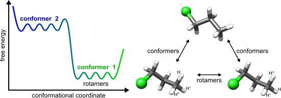
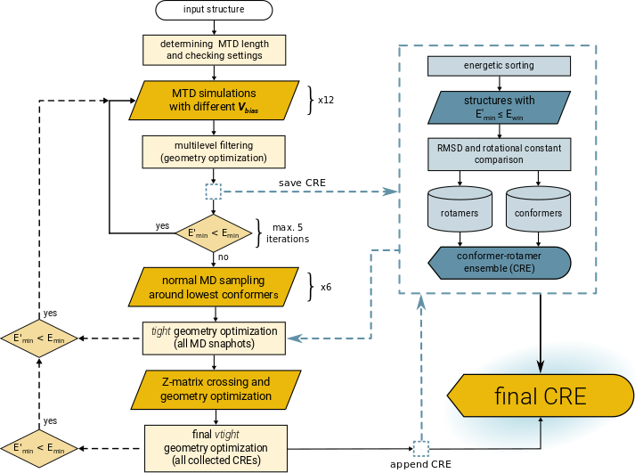
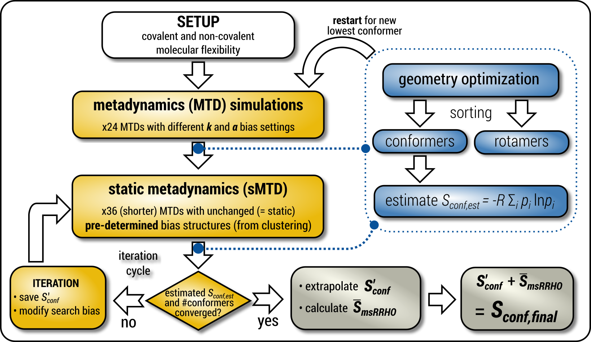

.. _crest:

----------------------------
Introduction to CREST
----------------------------

.. contents::

What is CREST ?
========================

``CREST`` is an utility/driver program for the ``xtb`` program.
Originally it was designed as conformer sampling program, hence the abbreviation **C**\onformer--**R**\otamer **E**\nsemble **S**\ampling **T**\ool, 
but now offers also some utility functions for calculations with the GFN\ `n`--xTB methods.
Generally the program functions as an IO based OMP scheduler (i.e., calculations are performed by the xtb program) and tool for the creation and analysation of structure ensembles.

The key procedure implemented in ``CREST`` is a conformational search workflow abbreviated as iMTD-GC. 
The iMTD-GC workflow generates conformer/rotamer ensembles (CREs) by extensive metadynamic sampling (MTD) based on, with an additional genetic z-matrix crossing (GC) step at the end.
Other standalone functionalities that are included in ``CREST`` are parallel optimization and screening functions for GFN\ `n`--xTB, 
the function to sort (e.g. for NMR equivalencies) externally created ensembles, and some automated procedures for the protonation, deprotonation and tautomerization of structures.

The main publication for the ``CREST`` program can be found at `Phys. Chem. Chem. Phys., 2020, 22, 7169-7192 <https://pubs.rsc.org/en/content/articlelanding/2020/CP/C9CP06869D>`_.
   

Conformers and Rotamers
=================================

The thermally accessible ensemble of minimum-energy structures generally consists of conformers as well as rotamers, and hence can be called a conformer/rotamer ensemble (CRE). 
Many physical observables are obtained as time average over the different low energy conformations of a molecule.
Hence, in computational chemistry, it can be important to perform calculations on the favored conformation or an ensemble of conformations. 
Some examples for macroscopic observables that are depending on the conformation are pKa values, CD spectra, NMR spectra, IR spectra, etc.. 
While calculations have generally only to be performed for different conformers (each having a distinct energy minimum, see figure below), 
rotamers can become important, e.g., for the calculation of NMR spectra where they represent the rapid (sub-experiment time scale) nuclei
interchange leading to an average of NMR parameters.

Rotamers also contribute substantially to the molecular entropy and the completeness of the overall CRE.
This can be assessed by a maximized entropy :math:`S_{CR}` according to the standard thermodynamic expressions

.. math::
   S_{CR} \approx R \sum^{CRE}_{i=1} p_i \log p_i~,

where :math:`R` is the molar gas constant and the sum runs over all populations :math:`p_i` of all species with energy :math:`\Delta E_i` at temperature :math:`T`, given as

.. math::
   p_i = \frac{\exp(-\Delta E_i / RT)}{\sum^{CRE}_{j=1}\exp(-\Delta E_j /RT)}~.

The ensemble entropy :math:`S_{CR}` is also linked to the ensemble free energy (at :math:`T =298` K) :math:`G_{CR}=H-TS_{CR}`, which has to be minimized for a complete CRE.

In practice we use three descriptors to distinguish between conformers and rotamers: The energy, the rotational constant of the molecule and the RMSD between two molecules. 
If two structures have completely different energies they are conformers. If they have the same energy (within a chosen threshold) they could be either two different 
conformers with similar energies, two rotamers of the same molecule or a duplicate of the same rotamer. In the first case (two conformers with similar energies) the RMSD will 
be high and the rotational constant will be different. For two rotamers the RMSD will be high, but the rotational constant is the same (within a chosen threshold). 
Enantiomers (mirror image molecules) are a special case of rotamers matching the same criterium. Only for duplicates of the same rotamer (that have to be sorted out) 
the RMSD,the rotational constants, and the energies will be the same.

Conformational Search Algorithms
================================

iMTD-GC Algorithm
------------------
The iMTD-GC workflow was designed to find low lying conformers more efficiently and more safely than the older MF-MD-GC algorithm (first algorithm in the original version of the program). 
Furthermore this new algorithm is more robust and generally applicable than more complicated schemes since it does not require any pre-definition of special system coordinates.
iMTD-GC is rooted in the basic idea to combine GFN\ *n*--xTB calculations with root-mean-square-deviation (RMSD) based meta-dynamics (see section :ref:`mtd`). 
In practice a history-dependent biasing potential is applied, where the collective variables (CVs) for the meta-dynamics are previous minima on the PES, expressed as RMSD between the structures.
The biasing contribution is given by Gaussian-type potential as

.. math::
   V_{bias} = \sum^n_i k_i \exp ( -\alpha \Delta_i^2)~,

where the RMSD entera as collective variables :math:`\Delta_i`, :math:`n` is the number of reference structures, :math:`k_i` are the pushing strengths and the parameter :math:`\alpha` determines the potentials' shape. 
From this energy expression atomic forces are derived that enter as additional forces in the MTD simulations (in the context of meta-dynamics also sometimes refered to as *guiding forces*).
Since the addition of each bias Gaussian drives the structure further away from previous geometries this allows otherwise unlikely high-barrier crossings where all atoms collectively explore huge regions of the potential energy surface.

Genetic Z-matrix crossing (GC) is related to the concept of genetic algorithms in such
that structural elements present only in already generated structures are projected onto
a reference to create new structures.
By repeating the crossing procedures structural elements that appear more frequently would be inherited more often, being responsible for the 'genetic' character of this approach.
Internal (Z-matrix, :math:`R`) coordinates are employed and a new structure is generated by taking the differences to the reference :math:`R_{ref}` over all internal coordinates
(i.e., bond length, bond angles, an dihedral angles) according to

.. math::
   R_{new} = R_{ref} + R_{i} - R_{j}~,

where :math:`R_i` and :math:`R_j` label the pairs and :math:`R_{new}` is the generated new structure, which is subjected
to a full geometry optimization. 
In this way, structural differences, e.g. a methyl group rotation, relative to :math:`R_{ref}` present only
in :math:`R_i` and :math:`R_j` are combined in the resulting new conformer/rotamer.
The ensemble can be improved regarding the rotamers efficiently by the Z-matrix crossing.
This effect is best visible for acyclic chains with a number of rotateable bonds, e.g., alkanes, but in principle it also works for more complicated cases, such as macrocyclic systems.

In practice the MTD simulation length is determined automatically by a flexibility measure of the molecule (typically :math:`t = 0.3-0.4 \times N` ps per MTD). 
Several independent MTDs (at 300 K) are performed with different setings for :math:`\alpha` (in Bohr\ :math:`^{-1}`) and :math:`k_i/N` (in :math:`mE_h`). 
This has to be done since each molecule in principle requires a unique set of optimal :math:`\alpha` and :math:`k` and thus a variety of parameters ensures that the algorithm is perfroming well for all types of molecules.
The snapshots are geometry optimized in a multi-level, three-step-filtering procedure
by firstly applying two loose threshold settings followed by very tightly converged optimization and energy windows of 15, 10, and 6 kcal/mol, respectively.
After the second step of this filtering also some short regular MD simulations are performed on the 6 lowermost conformers (at different temperatures 400 and 500 K),
which is done to A) get rotamers and B) more extensively sample around these minima on the PSE ( *i.e.*, find low-barrier conformers missed by the high-energy MTD treatment).
In the last step the GC procedure is performed to further complete the CRE. The number of generated structures in this step is limited to :math:`min(3000,t\times50)` in order to limit the computational cost.
Furthermore a two-step-filtering procedure is used to optimize the generated geometries, similar to the three-step-filtering before.

The algorithm is iterative, i.e., if a new lower conformer is found at any point during the sampling the procedure is restarted with this conformer as an input. 
All CREs that are found within the iterations are included in the conformer/rotamer ranking process.
The iMTD-GC worflow is outlined graphically in the figure below.

iMTD-sMTD and extended entropy calculations
-------------------------------------------

Following ``CREST`` version 2.11 a new variant of the previous algorithm is introduced, called iMTD-sMTD.
The important new part of this algorithm are socalled static metadynamics simulations (sMTD), which are
practically more similar to umbrella sampling or basing-hopping algorithms.
Here, in each sMTD previously found conformers are added via :math:`V_{bias}` as a global potential and,
opposed to the iMTD workflow, are not updated with new structures during the simulation.
Several iterations of sMTD are executed until convergence is achived with regards to the ensemble entropy
and number of conformers in the ensemble. After each sMTD iteration new bias structures for the potential are
identified using a PCA and k-Means ensemble clustering approach with dihedral angles as descriptors.
The iMTD-sMTD workflow is outlined in the figure below.

This algorithm can also be used not only for ensemble generation, but also provides the capability to determine a
converged conformational entropy. After convergence this requires only two additional steps (outlined as the gray
boxes in the figure), which are an extrapolation of the entropy based on the iterations of sMTD-iMTD and
an averaged thermostatistical contribution :math:`\overline{S}_{msRRHO}`.

.. note:: The iMTD-sMTD workflow is more costly than iMTD-GC and hence NOT the default runtype of ``CREST``. 
          The workflow can be used for conformational searches with the command ``--v4`` or for entropy 
          calculations with the keyword ``--entropy``.

