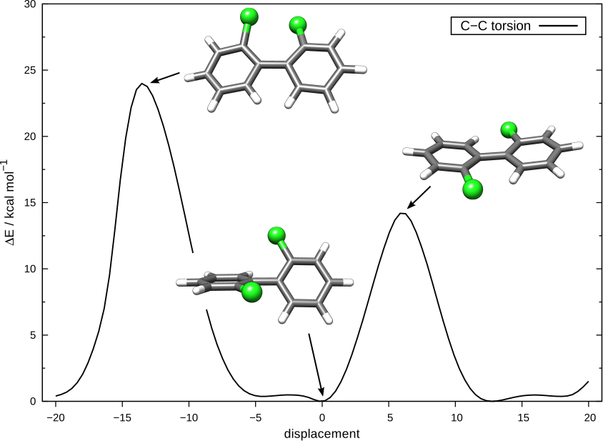
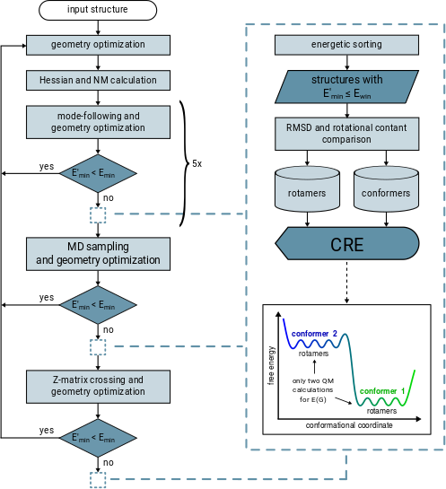

.. _crest:

----------------------------
Introduction to CREST
----------------------------

.. contents::

What is CREST ?
========================

``CREST`` is an utility/driver program for the ``xtb`` program.
Originally it was designed as conformer samling program, hence the abbreviation **C**\onformer--**R**\otamer **E**\nsemble **S**\ampling **T**\ool, 
but now offers also some utility functions for calculations with the GFN\ `n`--xTB methods.
The key procedures implemented in ``CREST`` are two different conformational search workflows abbreviated as MF-MD-GC (V1) and MTD-GC (V2). 
The older of these procedures, MF-MD-GC, combines a mode following (MF), molecular dynamics sampling (MD), and genetic z-matrix
crossing (GC) approach for the generation of conformer/rotamer ensembles (CREs).
The newer workflow, MTD-GC, makes use of extensive metadynamic sampling (MTD), with an additional GC step at the end.
Of the two algorithms, MTD-GC showed significant improvements while being slighlty more expensive compared to MF-MD-GC for large cases.
Other functionalities that are included in ``CREST`` are parallel optimization (MDOPT) and screening (SCREEN) functions for GFN\ `n`--xTB, 
a Z-matrix sorting function (ZSORT) and a function to sort (e.g. for NMR equivalencies) externally created CREs (CREGEN).
Following verison 2.7 of ``CREST``, the program also includes some automated procedures for the protonation, deprotonation and tautomerization of structures.

   

Conformers and Rotamers
=================================

The thermally accessible ensemble of minimum-energy structures generally consists of conformers as well as rotamers, and hence can be called a conformer/rotamer ensemble (CRE). 
Many physical observables are obtained as time average over the different low energy conformations of a molecule.
Hence, in computational chemistry, it can be important to perform calculations on the favored conformation or an ensemble of conformations. 
Some examples for macroscopic observables that are depending on the conformation are pKa values, CD spectra, NMR spectra, IR spectra, etc.. 
While calculations have generally only to be performed for different conformers (each having a distinct energy minimum, see figure below), 
rotamers can become important, e.g., for the calculation of NMR spectra where they represent the rapid (sub-experiment time scale) nuclei
interchange leading to an average of NMR parameters.

.. figure:: ../figures/cre-pes.png
   :scale: 100 %
   :alt: cre-pes

Rotamers also contribute substantially to the molecular entropy and the completeness of the overall CRE.
This can be assessed by a maximized entropy :math:`S_{CR}` according to the standard thermodynamic expressions

.. math::
   S_{CR} = R \sum^{CRE}_{i=1} p_i \log p_i~,

where :math:`R` is the molar gas constant and the sum runs over all populations :math:`p_i` of all species with energy :math:`\Delta E_i` at temperature :math:`T`, given as

.. math::
   p_i = \frac{\exp(-\Delta E_i / RT)}{\sum^{CRE}_{j=1}\exp(-\Delta E_j /RT)}~.

The ensemble entropy :math:`S_{CR}` is also linked to the ensemble free energy (at :math:`T =298` K) :math:`G_{CR} = -T S_{CR}`, which has to be minimized for a complete CRE.

In practice we use three descriptors to distinguish between conformers and rotamers: The energy, the rotational constant of the molecule and the RMSD between two molecules. 
If two structures have completely different energies they are conformers. If they have the same energy (within a chosen threshold) they could be either two different 
conformers with similar energies, two rotamers of the same molecule or a duplicate of the same rotamer. In the first case (two conformers with similar energies) the RMSD will 
be high and the rotational constant will be different. For two rotamers the RMSD will be high, but the rotational constant is the same (within a chosen threshold). 
Enantiomers (mirror image molecules) are a special case of rotamers matching the same criterium. Only for duplicates of the same rotamer (that have to be sorted out) 
the RMSD,the rotational constants, and the energies will be the same.

Conformational Search Algorithms
================================

MF-MD-GC (V1)
-------------

The MF-MD-GC workflow is a composite procedure consisting out of mode following, molecular dynamics
sampling and  genetic z-matrix crossing.
The idea here is to combine different approaches of conformer sampling to obtain good and complete CREs.
Low-lying, thermally accessible conformers and rotamers can be obtained from normal modes (NMs)
oder localized modes (LMs) by creating a one-dimensional PES by displacement along the 
respective low-frequency modes and determining the minima on this PES. 
This MF is a physically plausible approach for conformer sampling, since the transition pathways 
of one conformer into another is always connected to the natural movement of the molecule, i.e., the modes. 
If new, lower lying conformers are found in one of the modefollowing steps the procedure is iteratively restarted
with these conformers, which can be seen as some kind of variational approach to finding new conformations.

Molecular dynamics sampling (MD) is a common approach to the generation of conformations.
Here a short MD simulation is conducted and snapshots are equidistantly taken from the trajectory,
which are then surpassed to a geometry optimization.
For the MF-MD-GC workflow it was shown that not many new conformers are generated in this step. 
It is however crucial to the generation of rotamers. 
Since the time scales of small rotations that lead to new rotamers (e.g. phenyl- and methyl-group rotations)
are typically much shorter than the total MD simulation time, a single MD at higher temperature (400 K) showed
to be sufficient for this step.

Genetic Z-matrix crossing (GC) is related to the concept of genetic algorithms in such
that structural elements present only in already generated structures are projected onto
a reference to create new structures.
By repeating the crossing procedures structural elements that appear more frequently would be inherited more often, being responsible for the 'genetic' character of this approach.
Internal (Z-matrix, :math:`R`) coordinates are employed and a new structure is generated by taking the differences to the reference :math:`R_{ref}` over all internal coordinates
(i.e., bond length, bond angles, an dihedral angles) according to

.. math::
   R_{new} = R_{ref} + R_{i} - R_{j}~,

where :math:`R_i` and :math:`R_j` label the pairs and :math:`R_{new}` is the generated new structure, which is subjected
to a full geometry optimization. 
In this way, structural differences, e.g. a methyl group rotation, relative to :math:`R_{ref}` present only
in :math:`R_i` and :math:`R_j` are combined in the resulting new conformer/rotamer.

The whole workflow is sketched in the figure below. 
Each run is started off with a hessian calculation to get the normal and localized modes for the  modefollowing. 
MF is then performed up to 5 times with different settings for the number of points on the mode, step width between points on the mode and mode update factors. 
Should a better conformer be found between any of these steps, the procedure is restarted.
After the MF a single MD simulation is performed to get the rotamer degeneracies.
In the last step the GC is performed with the CRE that was found up to this point.

MTD-GC (V2) / iMTD-GC (V2i)
---------------------------
The MTD-GC workflow was designed to find low lying conformers more efficiently and more safely than the older MF-MD-GC algorithm. 
Furthermore this new algorithm is more robust and general applicable than more complicated schemes since it does not require any pre-definition of special system coordinates.
MTD-GC is rooted in the basic idea to combine GFN\ *n*--xTB calculations with root-mean-square-deviation (RMSD) based meta-dynamics (see section :ref:`mtd`). 
In practice a history-dependent biasing potential is applied, where the collective variables (CVs) for the meta-dynamics are previous minima on the PES, expressed as RMSD between the structures.
The biasing contribution is given by Gaussian-type potential as

.. math::
   V_{bias} = \sum^n_i k_i \exp ( -\alpha \Delta_i^2)~,

where the RMSD entera as collective variables :math:`\Delta_i`, :math:`n` is the number of reference structures, :math:`k_i` are the pushing strengths and the parameter :math:`\alpha` determines the potentials' shape. 
From this energy expression atomic forces are derived that enter as additional forces in the MTD simulations (in the context of meta-dynamics also sometimes refered to as *guiding forces*).
Since the addition of each bias Gaussian drives the structure further away from previous geometries this allows otherwise unlikely high-barrier crossings where all atoms collectively explore huge regions of the potential energy surface.

The GC was included in the MTD-GC procedure for the same reasons it was included in the MF-MD-GC workflow.
The ensemble can be improved regarding the rotamers efficiently by the Z-matrix crossing.
This effect is best visible for acyclic chains with a number of rotateable bonds, e.g., alkanes, but in principle it also works for more complicated cases, such as macrocyclic systems.

In practice the MTD simulation length is determined automatically by a flexibility measure of the molecule (typically :math:`t = 0.3-0.4 \times N` ps per MTD). 
Several independent MTDs (at 300 K) are performed with different setings for :math:`\alpha` (in Bohr\ :math:`^{-1}`) and :math:`k_i/N` (in :math:`mE_h`). 
This has to be done since each molecule in principle requires a unique set of optimal :math:`\alpha` and :math:`k` and thus a variety of parameters ensures that the algorithm is perfroming well for all types of molecules.
The snapshots are geometry optimized in a multi-level, three-step-filtering procedure
by firstly applying two loose threshold settings followed by very tightly converged optimization and energy windows of 15, 10, and 6 kcal/mol, respectively.
After the second step of this filtering also some short regular MD simulations are performed on the 6 lowermost conformers (at different temperatures 400 and 500 K),
which is done to A) get rotamers and B) more extensively sample around these minima on the PSE ( *i.e.*, find low-barrier conformers missed by the high-energy MTD treatment).
In the last step the GC procedure is performed to further complete the CRE. The number of generated structures in this step is limited to :math:`min(3000,t\times50)` in order to limit the computational cost.
Furthermore a two-step-filtering procedure is used to optimize the generated geometries, similar to the three-step-filtering before.

.. note:: The new MTD-GC algorithm is much better than the MF-MF-GC workflow in regards of finding low-energy conformations and complete CREs and as such replaces it as default runtype of ``CREST``.
          Additionally it is much more streamlined from the technical point of view and its implementation makes full use of OMP parallelization (parallelization on a single computer/CPU node).

Following version 2.6 of  ``CREST`` an iterative version of the MTD-GC workflow (called iMTD-GC) is the default runtype. 
In this slightly different scheme a fewer number of MTDs is conducted, but if a new lower conformer is found the procedure is restarted with this conformer as an input. 
The process is also restarted if a better conformer is found after the normal MD sampling around the lowest conformers or the GC.
Compared to the regular MTD-GC workflow the optimization thresholds are set differently.
Hence, for typical drug sized molecules the total CPU time of the iMTD-GC workflow is approximately the same as with MTD-GC, while better CREs are produced.
All CREs that are found within the iterations are included in the conformer/rotamer ranking process.
The iMTD-GC worflow is outlined graphically in the figure below.

.. figure:: ../figures/crest-v2i.png
   :scale: 90 %
   :alt: cre-pes

