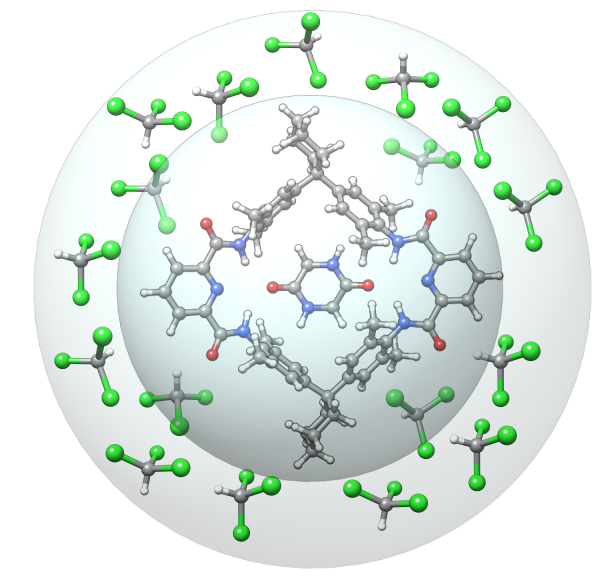
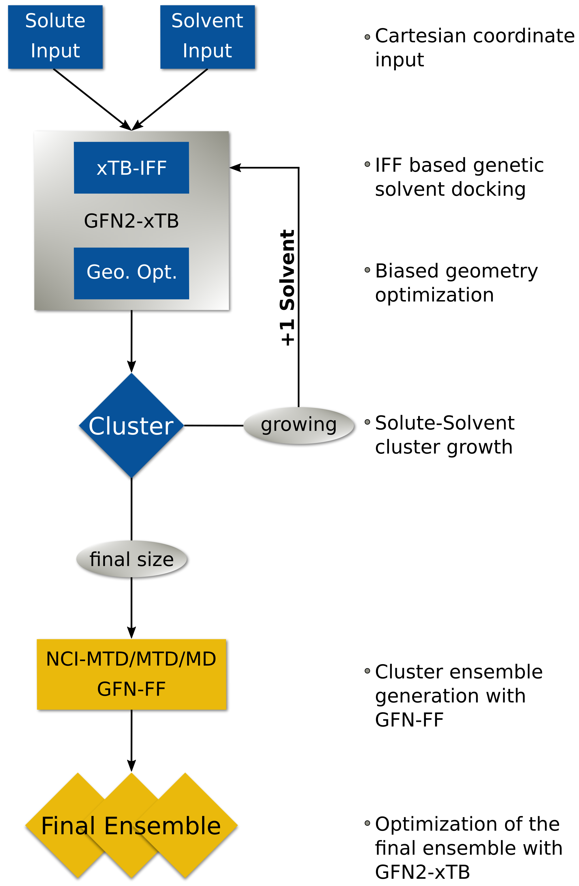
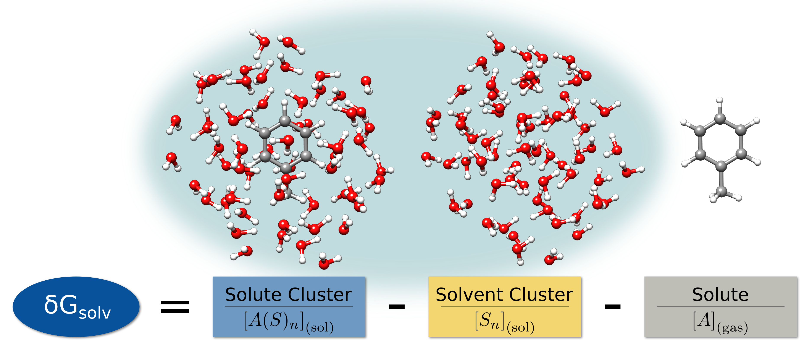
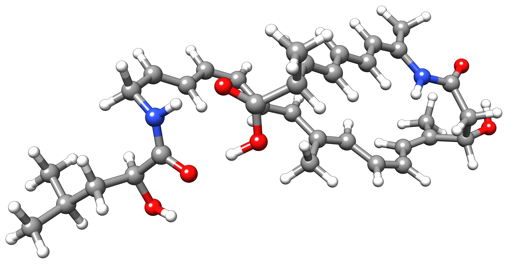
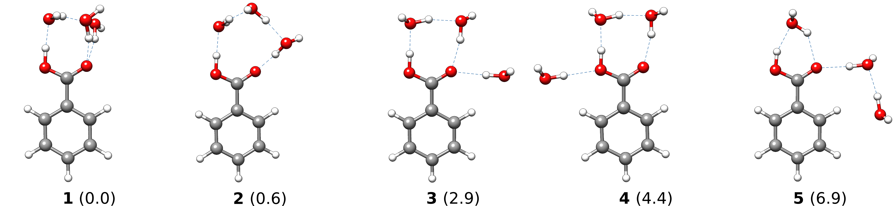
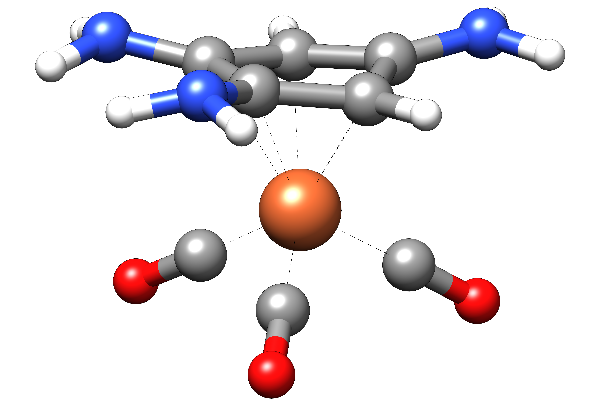
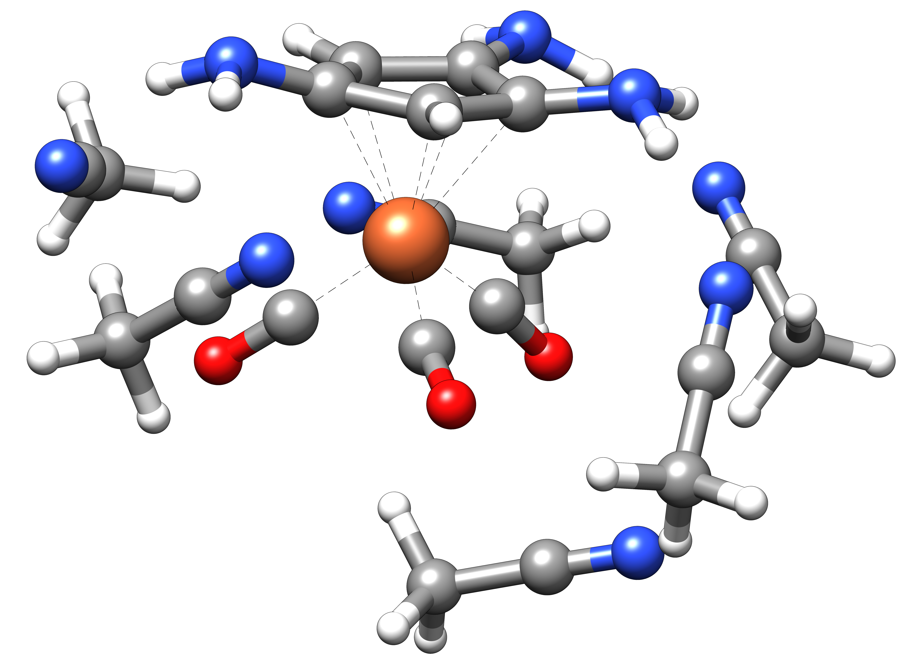

.. _crestqcg:

----------------------
Quantum Cluster Growth
----------------------

.. contents::

What is QCG?
============

Quantum Cluster Growth is a utility/driver extension of ``CREST`` for the ``xtb`` and ``xtb-IFF`` program. It is designed to automatically add explicit solvent molecules to a solute, to generate an ensemble of the resulting cluster, and to compute solvation free energies in an explicit fashion. Thereby, almost any solute--solvent combination can be used, including open-shell and charged solutes.

The key procedure is the automated addition of solvent molecules around the solute, mainly done by a screening of docking positions, using the ``xtb-IFF``, and ``xtb`` geometry optimizations. A second step includes the ensemble generation, which can be done either with single a MD/MTD simulation or the NCI-MTD workflow of ``CREST``. The solvation free energy can additionally be computed by generating a reference ensemble.

.. note:: Currently, a version of ``xtb-IFF`` and ``xtb`` has to be installed and to be accessible by calling *xtb* and *xtbiff*. Statically linked binaries of ``xtb-IFF`` can be found `here <https://github.com/grimme-lab/xtbiff/releases/tag/v1.1>`_ and for ``xtb`` they can be found at the `latest release page <https://github.com/grimme-lab/xtb/releases/latest>`_. A future release of ``xtb`` will make the use of ``xtb-IFF`` optional.

Automated Grow Algorithm and Ensemble Generation
""""""""""""""""""""""""""""""""""""""""""""""""
The automated grow algorithm starts with input coordinates provided by the user. Also, additional information like the charge and the number of unpaired electrons of the solute can be given, as well as the number of solvent molecules that should be added.
As performing an unbiased docking of the solvent would lead to solvent clustering, two wall potentials are applied. 

   Schematic depiction of the inner and outer wall potentials.

The inner one causes the solute to stay in the center, while the outer one prevents the solvent molecules from clustering and causes the solvent to surround the solute.
Having the prerequisites set, first an ``xtb-IFF`` docking of a solute and solvent molecule is performed under application of the wall potentials. Second, a geometry optimization is done with ``xtb``. These two steps repeat until the user-defined number of solvents is added.

   QCG Algorithm for the ensemble genereation.

.. note:: Without setting a number of solvents that should be added, QCG will add solvent molecules until the interaction energy converges. As this is often difficult, it might occur that the program will not stop adding solvents. Therefore, it is highly recommended to always define a number of solvent molecules that should be added.

The ensemble generation will also be performed with the wall potentials. It can be done with just an MD or MTD simulation and optimizing the snapshot geometries. Anyway, the NCI-MTD run-type is recommended and set as default because it explores the conformational space the most. It can be further enhanced by increasing the MTD time during this run-type or by decreasing the sampling frequency of snapshots.

Solvation Free Energy
"""""""""""""""""""""
The solvation free energy can also be computed with QCG in a supermolecular approach. To do so, a reference ensemble has to be generated first. By default, this is done with the Cut-Freeze-Fill (CFF) algorithm. It removes the solute from the highest populated clusters of the solute--solvent ensemble and fills the remaining cavity with solvents. Afterward, frequency calculations are performed for the solute--solvent and the reference ensembles, as well as the solute. These give rise to thermocorrections. After scaling the translational and rotational entropy and taking the conformational entropy into account, the free energies result. Substracting the free energy of the reference ensemble and the solute from the solute--solvent ensemble, yields finally the solvation free energy.

   Supermolecular computation of the solvation free energy in QCG.

.. note:: The scaling factor for the translational and rotational entropy are empirically determined for all solvents. As this depends on the kind of solvent, it might be necessary to adjust this parameter. The printout always contains solvation free energies for different scaling factors, while the final result is given for the chosen scaling factor (default 0.75).

QCG Flags
=========

The QCG extension of ``CREST`` is usually invoked via the command line. To do so, two files containing solute and solvent coordinates have to be provided that can be in any format supported by ``CREST``. To activate QCG, use a call similar to 

.. code:: bash

   > crest [SOLUTE] -qcg [SOLVENT] [OPTIONS]

The general and technical options of ``CREST`` also apply for the QCG run-type ( :ref:`crestcmd`). Take care to always set the number of cores with ``--T <INT>``.

Algorithms
""""""""""

.. list-table::
    :widths: 40 30 90
    :header-rows: 1

    * - Algorithm
      - Flag
      - Description
    * - Grow [default]
      - ``--grow``
      - Use only the grow algorithm without ensemble generation
    * - Ensemble 
      - ``--ensemble``
      - Use the grow algorithm with a subsequent ensemble generation
    * - Solvation Free Energy
      - ``--gsolv``
      - Generates a reference ensemble and computes the solvation free energy 

      
Growth
""""""

.. list-table::
    :widths: 30 100
    :header-rows: 1

    * - Flag
      - Description
    * - ``--nsolv <INT>``
      - Number of solvents that should be added
    * - ``--nopreopt``
      - Does not perform a GFN2-xTB preoptimization of the input structures
    * - ``--keepdir``
      - Saves the tmp folders
    * - ``--gfn1``
      - Use GFN1-xTB for geometry optimization during the Grow algorithm
    * - ``--gfn2``
      - Use GFN2-xTB for geometry optimization during the Grow algorithm ``[DEFAULT]``
    * - ``--gff, --gfnff``
      - Use GFN-FF for geometry optimization during the Grow algorithm
    * - ``--samerand``
      - Use the same random number for the xTB-IFF runs
    * - ``--chrg <INT>``
      - Set the charge for the solute and creates .CHRG file
    * - ``--uhf <INT>``
      - Set the number of unpaired electrons for the solute and creates .UHF file
    * - ``--wscal <REAL>``
      - Set the scaling factor for the outer wall potential. The default is 1.0 except for water
    * - ``--fixsolute``
      - Fix the solute during the grow process (automatically done for water as solvent)
    * - ``--nofix``
      - No fixing of the solute during the grow process (fixing is only applied for water as solvent file)

Ensemble Generation
"""""""""""""""""""

The defaults of the NCI-MTD run-type in QCG are the same as in the stand-alone use.

.. list-table::
    :widths: 30 100
    :header-rows: 1

    * - Flag
      - Description
    * - ``--ncimtd``
      - Perform an ensemble generation with the NCI-MTD run-type ``[DEFAULT]``
    * - ``--mtd``
      - Perform an ensemble generation with a single MTD simulation
    * - ``--md``
      - Perform an ensemble generation with a single MD simulation
    * - ``--enslvl gfn1``
      - Use GFN1-xTB for M(T)D simulation and geometry optimizations during the ensemble generation
    * - ``--enslvl gfn2``
      - Use GFN2-xTB for M(T)D simulation and geometry optimizations during the ensemble generation. ``[DEFAULT]`` in case of a single MD and MTD simulation.
    * - ``--enslvl gff, -- enslvl gfnff``
      - Use GFN-FF for M(T)D simulation and geometry optimizations during the ensemble generation ``[DEFAULT]`` in case of the NCI-MTD run-type
    * - ``--len <REAL>, --mdlen <REAL>, --mdtime <REAL>``
      - Set the M(T)D length
    * - ``--mddump <INT>``
      - Set the dumping frequency of the M(T)D simulations
    * - ``--tstep <INT>``
      - Set the M(T)D time step in fs
    * - ``--vbdump``
      - Set the dumping frequency in which a new reference structure is taken for the bias potential
    * - ``--norotmd``
      - Turn off the additional MDs on the lowest conformers after the MTD simulations in the NCI-MTD run-type
    * - ``--tnmd <REAL>``
      - Set the temperature for the additional MDs in the NCI-MTD run-type
    * - ``--mreset <INT>``
      - Maximum number of MTD restarts of the NCI-MTD run-type

Solvation Free Energy
"""""""""""""""""""""

.. list-table::
    :widths: 30 100
    :header-rows: 1

    * - Flag
      - Description
    * - ``--nocff``
      - Generate the reference ensemble with the same method the solute--solvent ensemble was generated instead of the CFF algorithm
    * - ``--esolv``
      - Compute only the pure solvation energy without frequency calculations
    * - ``--nclus``
      - Set the number of solute--solvent clusters to take further into account. The highest populated ones are considered. If not set, a number is determined according to the population distribution (maximal 10).
    * - ``--freqlvl gfn1``
      - Use GFN1-xTB for frequency calculations
    * - ``--freqlvl gfn2``
      - Use GFN2-xTB for frequency calculations
    * - ``--freqlvl gff, -- freqlvl gfnff``
      - Use GFN-FF for frequency calculations ``[Default]``     
    * - ``--freqscal <REAL>``
      - Set a scaling factor for the translational and rotational entropy. Only for printout. ``[Default]`` is 0.75

      
Example Applications
====================

Building up Solvent Shells and using them for a Subsequent MD Simulation
""""""""""""""""""""""""""""""""""""""""""""""""""""""""""""""""""""""""

Explicitly modeled solvent molecules can lead to different properties of the solute compared to implicit solvent models. Thus, it might be necessary to check on this, for example, for geometries and IR spectra.

   Most stable gas-phase structure of Bacillaene with GFN-FF.

Let's assume we have bacillaene and want to grow a cluster of 100 water molecules around it. Afterward, we perform an MD simulation to investigate the geometry in solution. To do so, we provide input coordinates of the solute ``bacillaene.xyz`` and of a water molecule ``water.xyz``. As we do not have much time, GFN-FF is also used during the growth algorithm. We call ``CREST`` and activate the QCG algorithm with the following command.

.. tabbed:: command

   .. code:: bash

      crest bacillaene.xyz --qcg water.xyz --nsolv 100 --gfnff --T 12 --alpb water --nofix > crest.out

.. tabbed:: bacillaene.xyz

   .. code:: sh
        
            90

       C         -5.3127996594       -2.4157946011       -0.5090291244
       C         -6.6369198591       -2.2744765141       -0.3505867691
       C         -4.5376337067       -1.9989947690       -1.6511538708
       C         -7.4911082799       -1.4906802100       -1.3353795445
       C         -7.3417027536       -2.8130153570        0.8534300295
       C         -6.9820968905       -0.0260037238       -1.4231824713
       C         -3.2303223550       -1.6498120479       -1.6254976982
       C         -2.4648530707       -1.4782784301       -0.4345685359
       C         -1.1490119425       -1.1466912716       -0.3267799699
       C         -0.2345729980       -0.9625082034       -1.4997955626
       C         -0.6049768456       -0.9722141905        0.9890332154
       C          0.6701604636       -0.6330961686        1.2870390935
       C          1.1341096011       -0.4761647542        2.6269132552
       C          2.3830259753       -0.1235992724        3.0110310022
       C          3.4734843635        0.1679005598        2.1268262297
       C          4.6931387856        0.5393278145        2.5267510375
       C          5.8304304131        0.8677548326        1.6003866159
       N          5.4283570547        0.8855111783        0.2104033711
       C          5.3166273681       -0.1533114661       -0.6067536733
       C          6.0134079054       -1.4661798013       -0.2726105716
       O          4.7074640990       -0.0705419639       -1.6861449989
       C          7.5144666461       -1.3152943375       -0.5941160582
       O          5.4313708211       -2.5035661443       -1.0272412069
       C         -6.7935147347        0.4641208344       -0.0003944175
       O         -7.7403733383        0.5228053447        0.7742620645
       N         -5.5106869286        0.7636403711        0.3110847277
       C         -4.9463300150        1.1535464336        1.5274406520
       C         -3.6739854047        1.6059179412        1.5754484283
       C         -5.7878061510        1.0225637475        2.7522984886
       C         -2.7844664843        1.8243840709        0.4767015254
       C         -1.5364316121        2.3145689941        0.6208013650
       C         -0.6655220004        2.5888732490       -0.4843830298
       C          0.5487325406        3.1343609346       -0.3631391694
       C          8.3298335983       -2.5431938358       -0.1704211284
       C          9.6891088069       -2.5276652589       -0.8678074623
       C          8.5197655075       -2.5906603796        1.3443209467
       O         -8.8586444577       -1.4991160896       -1.0023350180
       C          1.4399210852        3.4740558350       -1.5251049648
       C          2.6756050844        2.6104389356       -1.3716483915
       C          1.8111558123        4.9585806785       -1.5160495647
       O          2.6206023923        1.5056225590       -2.0814961045
       O          3.6041031244        2.8850885925       -0.6340527724
       H         -4.7625204190       -2.9056795986        0.2836333196
       H         -5.0509303359       -2.0042601899       -2.6049219243
       H         -7.4349047919       -1.9513459821       -2.3302603369
       H         -6.6760991929       -3.4329009729        1.4477280383
       H         -8.2048607459       -3.4019112683        0.5445011777
       H         -7.7116749441       -1.9955343308        1.4750390520
       H         -6.0619084015        0.0254594956       -1.9985287387
       H         -7.7560134130        0.5683074568       -1.9132455671
       H         -2.7489218428       -1.4394091975       -2.5706796840
       H         -3.0129717265       -1.5960544885        0.4909743144
       H         -0.7561184183       -1.0725573851       -2.4442035526
       H          0.5638309381       -1.7039098370       -1.4666980415
       H          0.2258577807        0.0242190429       -1.4708519245
       H         -1.2956296326       -1.1246557687        1.8098949728
       H          1.3745898015       -0.4696821456        0.4862918222
       H          0.3981454779       -0.6600516684        3.4004310551
       H          2.5974468939       -0.0405121044        4.0685973172
       H          3.2726215465        0.0815655312        1.0682418239
       H          4.9262739703        0.6324234323        3.5775689496
       H          6.6468639108        0.1562857796        1.7478921113
       H          6.2119507967        1.8653636049        1.8407595221
       H          4.8859889259        1.7105149385       -0.0683642472
       H          5.8575220450       -1.7269366655        0.7774134480
       H          7.6007536957       -1.1797242272       -1.6752148153
       H          7.9082834268       -0.4205120198       -0.1104506371
       H          5.0955504465       -2.0978322698       -1.8442489323
       H         -4.8389468734        0.6790182836       -0.4409166158
       H         -3.2785159256        1.8587339956        2.5484209564
       H         -5.2246095910        1.3178627663        3.6320617997
       H         -6.1254267820       -0.0065165747        2.8692478768
       H         -6.6790660370        1.6429351108        2.6701403518
       H         -3.1292138183        1.6120944762       -0.5273979730
       H         -1.1579767117        2.5402684410        1.6084450304
       H         -1.0491040613        2.3573854617       -1.4703055793
       H          0.9505481083        3.3742128511        0.6120025660
       H          7.7785462919       -3.4349097892       -0.4874864977
       H          9.5694109024       -2.5429149313       -1.9488155636
       H         10.2730806739       -3.3975457026       -0.5768929878
       H         10.2450015890       -1.6328073712       -0.5947376585
       H          9.0991604017       -3.4685164813        1.6200641190
       H          7.5644928769       -2.6459407744        1.8604244387
       H          9.0545665098       -1.7068730142        1.6874964687
       H         -8.9584252351       -0.9401749581       -0.2142721535
       H          0.9490038267        3.1991238510       -2.4619332618
       H          2.4126870178        5.2036544364       -2.3883354398
       H          2.3855713372        5.1906177538       -0.6223783473
       H          0.9080079216        5.5625777336       -1.5263116425
       H          3.4359643823        0.9211814126       -1.9665264904

.. tabbed:: water.xyz

   .. code:: sh
   
        3

       O         -0.1918040235        1.3862489483        0.0047370042
       H          0.7660977787        1.3911615443       -0.0141642652
       H         -0.4927337474        1.6150799341       -0.8756928250

 
.. tabbed:: crest.out

   .. code:: sh 
                    
                ==============================================
                |                                            |
                |                 C R E S T                  |
                |                                            |
                |  Conformer-Rotamer Ensemble Sampling Tool  |
                |          based on the GFN methods          |
                |             P.Pracht, S.Grimme             |
                |          Universitaet Bonn, MCTC           |
                ==============================================
                Version 2.11, Mon 19. Apr 11:43:20 CEST 2021
            Using the xTB program. Compatible with xTB version 6.4.0
            
            Cite work conducted with this code as

            P. Pracht, F. Bohle, S. Grimme, PCCP, 2020, 22, 7169-7192.

            and  S. Grimme, JCTC, 2019, 15, 2847-2862.
            
            with help from:
            C.Bannwarth, F.Bohle, S.Ehlert, S.Grimme,
            C. Plett, P.Pracht, S. Spicher
            
            This program is distributed in the hope that it will be useful,
            but WITHOUT ANY WARRANTY; without even the implied warranty of
            MERCHANTABILITY or FITNESS FOR A PARTICULAR PURPOSE.

            Command line input:
            > crest bacillaene.xyz -qcg water.xyz -gfnff -nsolv 100 -T 20 -grow -alpb water -nofix

            Solute-file: bacillaene.xyz
            Solvent-file: water.xyz
            -gfnff : Use of GFN-FF requested.
            -T 20 (CPUs/Threads selected)
            Use of GFN-FF for ensemble search requested.
            Use of GFN-FF for frequency computation requested.
            -mdtime 10 (MD length in ps)
            --alpb water : implicit solvation
            
            ========================================
            |           ----------------           |
            |                 Q C G                |
            |           ----------------           |
            |        Quantum Cluster Growth        |
            |       University of Bonn, MCTC       |
            ========================================
            S. Grimme, S. Spicher, C.Plett, unpublished.
            
            
            =========================================
            |   quantum cluster growth: INPUT       |
            =========================================
            
            QCG: Only Cluster Generation
            
            input parameters     
            solute                 : bacillaene.xyz
            charge                 : 0
            uhf                    : 0
            solvent                : water.xyz
            # of solvents to add   : 100
            # of cluster generated : 4
            # of CPUs used         : 20
            Solvation model        : water               
            xtb opt level          : normal
            System temperature [K] : 298.0
            RRHO scaling factor    : 0.75
            
            Solute geometry
            molecular radius (Bohr**1):   11.20
            molecular area   (Bohr**2): 2554.19
            molecular volume (Bohr**3): 5887.65
            Solvent geometry
            molecular radius (Bohr**1):    3.88
            molecular area   (Bohr**2):  194.90
            molecular volume (Bohr**3):  244.27
            
            radius of solute    :    18.06
            radius of solvent   :     6.25
            
            =========================================
            |            Preoptimization            |
            =========================================
            
            -------------------------
            xTB Geometry Optimization
            -------------------------
            Geometry successfully optimized.
            Generating LMOs for solute
            Total Energy of solute:    -127.4297277 Eh
            
            -------------------------
            xTB Geometry Optimization
            -------------------------
            Geometry successfully optimized.
            Generating LMOs for solvent
            Total energy of solvent:     -5.0703134 Eh
            
            ________________________________________________________________________
            
            __________________     Solute Cluster Generation   _____________________
            
            ________________________________________________________________________
            
            
            =========================================
            |   quantum cluster growth: GROW        |
            =========================================
            
            Solute:
                unit ellipsoid axis a,b,c     :   0.428   0.289   0.283
            Solvent:
                unit ellipsoid axis a,b,c     :   0.384   0.323   0.292
            
            solvent anisotropy  :     1.130
            solute anisotropy   :     1.197
            roff inner wall     :     6.997
            solute max dist     :    39.969
            solvent max dist    :     7.298
            inner unit axis     :     0.528     0.241     0.231
            inner ellipsoid/Bohr:    36.893    16.810    16.173
            outer ellipsoid/Bohr:    28.654    19.342    18.972
            
            Size  E /Eh       De/kcal   Detot/kcal  Density   Efix         R   av/act. Surface   Opt
            1   -132.538524  -24.15    -24.15      1.115    -13.744      0.0   0.0    6017.1   normal
            2   -137.624631   -9.91    -34.06      1.117    -14.046      9.9   8.9    6188.1   normal
            3   -142.708487   -8.50    -42.56      1.120    -14.343      9.4   8.8    6350.0   normal
            4   -147.796548  -11.14    -53.69      1.119    -14.634      9.2  14.3    6536.7   normal
            [...]
            100  -636.352408   -7.47   *******      1.198    -32.223     14.2  14.9   22281.9   normal
            Final gfn2 optimization
            
            Growth finished after 100 solvents added
            Results can be found in grow directory
            Energy list on file <qcg_energy.dat>
            Interaction energy on file <qcg_conv.dat>
            Growing process on <qcg_grow.xyz>
            Final geometry after grow in <cluster.coord> and <cluster.xyz>
            Potentials and geometry written in <cluster_cavity.coord> and <twopot_cavity.coord>
            
            -----------------
            Wall Time Summary
            -----------------
                            Grow wall time :         0h :34m :32s
            --------------------
            Overall wall time  : 0h :34m :32s
            
            CREST terminated normally.
        

QCG automatically detects water as a solvent. This will cause the outer wall potential to be scaled to smaller sizes. Additionally, the solute will be fixed during the growth (also only in case of water). Bacillaene has a variety of different conformations and we want to consider the response of the intramolecular geometry upon addition of water. Thus, the ``--nofix`` flag was provided.

.. note:: Fixing the solute during the growth will increase the cluster quality, especially for water. It is only the ``default`` for water as solvent and can be switched off with ``--nofix``. For other solvents, the solute can be fixed also by using the keyword ``--fixsolute``.

Notice that we also choose the ALPB water model to get energies including an additional implicit solvation model around the cluster. 
The resulting cluster can be found in the ``grow`` directory as ``cluster.xyz`` file. Additionally, each step is written to ``qcg_grow.xyz``. 

As we want to perform an MD simulation on this structure without dissociating the cluster, we also need the wall potentials found in the ``wall_potential`` file. This can be renamed to ``.xcontrol`` and directly used as an input for ``xtb`` to perform the constrained MD simulation. 

.. note:: Other constraints set by the user will also be written in this file and thus used by xtb if not removed.

Ensemble Generation and Microsolvation
""""""""""""""""""""""""""""""""""""""

Creating ensembles of generated clusters is important for various reasons. For example, the conformational space is explored during the used MD and MTD simulations so that new energy minima are usually found. Additionally, many problems require the weighting of different populated structures and the inclusion of the conformational entropy.
As an example, a microsolvation approach is considered, but also large ensembles with multiple solvent shells can be generated similarly. As typically only a few solvents are added for this, the conformational space is rather small and it is possible to find relatively complete ensembles within a reasonable computational time. Now we want to add three water molecules to benzoic acid. For this, we again provide solute as well as solvent coordinates and call for the ensemble generation.

.. tip:: For larger clusters, the conformational space will increase. Therefore, the MTD time should be increased or the sampling frequency should be decreased. Using only one MD or MTD simulation will usually yield a much more incomplete ensemble.

.. tabbed:: command

   .. code:: bash

      crest benzoic_acid.xyz --qcg water.xyz --nsolv 3 --T 12 --ensemble --mdtime 50 --alpb water --wscal 1.0 --nofix > crest.out

.. tabbed:: benzoiic_acid.xyz

   .. code:: sh
        
        15

        H    -5.151895     0.608937     0.184841
        C    -4.075803     0.560948     0.103703
        C    -3.304923     1.648961     0.482499
        H    -3.781062     2.542533     0.858155
        C    -1.927760     1.593624     0.380574
        H    -1.316613     2.433539     0.671921
        C    -1.315885     0.440886    -0.104813
        C     0.159025     0.350784    -0.229059
        O     0.718993    -0.633914    -0.685096
        O     0.806733     1.411370     0.189344
        C    -2.093917    -0.650077    -0.484577
        H    -1.601704    -1.534740    -0.859582
        C    -3.469918    -0.588324    -0.379395
        H    -4.072688    -1.434587    -0.673879
        H     1.807623     1.318950     0.057503
        
.. tabbed:: water.coord

   .. code:: sh
   
        $coord
            -0.36245704029697        2.61963060973384        0.00895163975603      O 
             1.44771485215846        2.62891406998886       -0.02676657950467      H 
            -0.93113174846333        3.05205846171614       -1.65481945499110      H 
        $end

.. tabbed:: crest.out

   .. code:: sh
            
            
                ==============================================
                |                                            |
                |                 C R E S T                  |
                |                                            |
                |  Conformer-Rotamer Ensemble Sampling Tool  |
                |          based on the GFN methods          |
                |             P.Pracht, S.Grimme             |
                |          Universitaet Bonn, MCTC           |
                ==============================================
                Version 2.11.1, Mon 16. Aug 09:59:32 CEST 2021
            Using the xTB program. Compatible with xTB version 6.4.0
            
            Cite work conducted with this code as

            P. Pracht, F. Bohle, S. Grimme, PCCP, 2020, 22, 7169-7192.

            and  S. Grimme, JCTC, 2019, 15, 2847-2862.
            
            with help from:
            C.Bannwarth, F.Bohle, S.Ehlert, S.Grimme,
            C. Plett, P.Pracht, S. Spicher
            
            This program is distributed in the hope that it will be useful,
            but WITHOUT ANY WARRANTY; without even the implied warranty of
            MERCHANTABILITY or FITNESS FOR A PARTICULAR PURPOSE.

            Command line input:
            > crest benzoic_acid.xyz --qcg water.coord --nsolv 3 -T 12 -ensemble -mdtime 50 --alpb water --wscal 1.0 --nofix

            Solute-file: benzoic_acid.xyz
            Solvent-file: water.coord
            -T 12 (CPUs/Threads selected)
            -mdtime 50 (MD length in ps)
            --alpb water : implicit solvation
            
            ========================================
            |           ----------------           |
            |                 Q C G                |
            |           ----------------           |
            |        Quantum Cluster Growth        |
            |       University of Bonn, MCTC       |
            ========================================
            S. Grimme, S. Spicher, unpublished.
            
            
            =========================================
            |   quantum cluster growth: INPUT       |
            =========================================
            
            QCG: Cluster + Ensemble Generation
            Ensemble generated via CREST
            
            input parameters     
            solute                 : benzoic_acid.xyz
            charge                 : 0
            uhf                    : 0
            solvent                : water.coord
            # of solvents to add   : 3
            Cluster generated that are above 10 % populated 
            # of CPUs used         : 12
            Solvation model        : water               
            xtb opt level          : normal
            System temperature [K] : 298.0
            RRHO scaling factor    : 0.75
            
            Solute geometry
            molecular radius (Bohr**1):    6.57
            molecular area   (Bohr**2):  635.98
            molecular volume (Bohr**3): 1188.36
            Solvent geometry
            molecular radius (Bohr**1):    3.88
            molecular area   (Bohr**2):  194.90
            molecular volume (Bohr**3):  244.27
            
            radius of solute    :    10.59
            radius of solvent   :     6.25
            
            =========================================
            |            Preoptimization            |
            =========================================
            
            -------------------------
            xTB Geometry Optimization
            -------------------------
            Geometry successfully optimized.
            Generating LMOs for solute
            Total Energy of solute:     -26.1730317 Eh
            
            -------------------------
            xTB Geometry Optimization
            -------------------------
            Geometry successfully optimized.
            Generating LMOs for solvent
            Total energy of solvent:     -5.0705444 Eh
             
            ________________________________________________________________________
            
            __________________     Solute Cluster Generation   _____________________
            
            ________________________________________________________________________
            
            
            =========================================
            |   quantum cluster growth: GROW        |
            =========================================
            
            Solute:
                unit ellipsoid axis a,b,c     :   0.408   0.306   0.286
            Solvent:
                unit ellipsoid axis a,b,c     :   0.386   0.322   0.292
            
            solvent anisotropy  :     1.133
            solute anisotropy   :     1.169
            roff inner wall     :     1.388
            solute max dist     :    17.497
            solvent max dist    :     7.283
            inner unit axis     :     0.487     0.274     0.239
            inner ellipsoid/Bohr:    14.890     8.363     7.292
            outer ellipsoid/Bohr:    14.686    11.006    10.277
            
            Size  E /Eh       De/kcal   Detot/kcal  Density   Efix         R   av/act. Surface   Opt
                1   -31.277550  -21.32    -21.32      1.155     -7.372      0.0   0.0    1359.9   normal
                2   -36.366081  -11.29    -32.61      1.143     -7.936      9.0   7.9    1551.0   normal
                3   -41.458471  -13.71    -46.31      1.148     -8.463      9.1  10.0    1720.2   normal
            
            Growth finished after 3 solvents added
            Results can be found in grow directory
            Energy list on file <qcg_energy.dat>
            Interaction energy on file <qcg_conv.dat>
            Growing process on <qcg_grow.xyz>
            Final geometry after grow in <cluster.coord> and <cluster.xyz>
            Potentials and geometry written in <cluster_cavity.coord> and <twopot_cavity.coord>
            
            =========================================
            |   quantum cluster growth: ENSEMBLE    |
            =========================================
            
            Method for ensemble search:--gff               
            Starting ensemble cluster generation by CREST routine
            
            ------------------------------------------------
            Generating MTD length from a flexibility measure
            ------------------------------------------------
            System flexiblity is set to 1.0 for NCI mode
            flexibility measure :   1.000
            t(MTD) / ps set by command line  :    50.0
            t(MTD) / ps    :    50.0
            Σ(t(MTD)) / ps :   600.0 (12 MTDs)
            
            -------------------------------------
            Starting a trial MTD to test settings
            -------------------------------------
            Estimated runtime for one MTD (50.0 ps) on a single thread: 1 min 15 sec
            Estimated runtime for a batch of 12 MTDs on 12 threads: 1 min 15 sec
            
            list of Vbias parameters applied:
            $metadyn    0.00125   1.000
            $metadyn    0.00083   1.000
            $metadyn    0.00056   1.000
            $metadyn    0.00125   0.667
            $metadyn    0.00083   0.667
            $metadyn    0.00056   0.667
            $metadyn    0.00125   0.444
            $metadyn    0.00083   0.444
            $metadyn    0.00056   0.444
            $metadyn    0.00125   0.296
            $metadyn    0.00083   0.296
            $metadyn    0.00056   0.296
            
            *******************************************************************************************
            **                        N E W    I T E R A T I O N    C Y C L E                        **
            *******************************************************************************************
            
            ========================================
                        MTD Iteration  1
            ========================================
            
                ========================================
                |         Meta-MD (MTD) Sampling       |
                ========================================
            
            Starting Meta-MD   1 with the settings:
                MD time /ps        :    50.0
                dt /fs             :     1.5
                dumpstep(trj) /fs  :     200
                dumpstep(Vbias)/ps :     1.0
                Vbias factor k /Eh :  0.0300
                Vbias exp α /bohr⁻²:    1.00
            Starting Meta-MD   2 with the settings:
                MD time /ps        :    50.0
                dt /fs             :     1.5
                dumpstep(trj) /fs  :     200
                dumpstep(Vbias)/ps :     1.0
                Vbias factor k /Eh :  0.0200
                Vbias exp α /bohr⁻²:    1.00
            Starting Meta-MD   3 with the settings:
                MD time /ps        :    50.0
                dt /fs             :     1.5
                dumpstep(trj) /fs  :     200
                dumpstep(Vbias)/ps :     1.0
                Vbias factor k /Eh :  0.0133
                Vbias exp α /bohr⁻²:    1.00
            Starting Meta-MD   4 with the settings:
                MD time /ps        :    50.0
                dt /fs             :     1.5
                dumpstep(trj) /fs  :     200
                dumpstep(Vbias)/ps :     1.0
                Vbias factor k /Eh :  0.0300
                Vbias exp α /bohr⁻²:    0.67
            Starting Meta-MD   5 with the settings:
                MD time /ps        :    50.0
                dt /fs             :     1.5
                dumpstep(trj) /fs  :     200
                dumpstep(Vbias)/ps :     1.0
                Vbias factor k /Eh :  0.0200
                Vbias exp α /bohr⁻²:    0.67
            Starting Meta-MD   6 with the settings:
                MD time /ps        :    50.0
                dt /fs             :     1.5
                dumpstep(trj) /fs  :     200
                dumpstep(Vbias)/ps :     1.0
                Vbias factor k /Eh :  0.0133
                Vbias exp α /bohr⁻²:    0.67
            Starting Meta-MD   7 with the settings:
                MD time /ps        :    50.0
                dt /fs             :     1.5
                dumpstep(trj) /fs  :     200
                dumpstep(Vbias)/ps :     1.0
                Vbias factor k /Eh :  0.0300
                Vbias exp α /bohr⁻²:    0.44
            Starting Meta-MD   8 with the settings:
                MD time /ps        :    50.0
                dt /fs             :     1.5
                dumpstep(trj) /fs  :     200
                dumpstep(Vbias)/ps :     1.0
                Vbias factor k /Eh :  0.0200
                Vbias exp α /bohr⁻²:    0.44
            Starting Meta-MD   9 with the settings:
                MD time /ps        :    50.0
                dt /fs             :     1.5
                dumpstep(trj) /fs  :     200
                dumpstep(Vbias)/ps :     1.0
                Vbias factor k /Eh :  0.0133
                Vbias exp α /bohr⁻²:    0.44
            Starting Meta-MD  12 with the settings:
                MD time /ps        :    50.0
                dt /fs             :     1.5
                dumpstep(trj) /fs  :     200
                dumpstep(Vbias)/ps :     1.0
                Vbias factor k /Eh :  0.0133
                Vbias exp α /bohr⁻²:    0.30
            Starting Meta-MD  11 with the settings:
                MD time /ps        :    50.0
                dt /fs             :     1.5
                dumpstep(trj) /fs  :     200
                dumpstep(Vbias)/ps :     1.0
                Vbias factor k /Eh :  0.0200
                Vbias exp α /bohr⁻²:    0.30
            Starting Meta-MD  10 with the settings:
                MD time /ps        :    50.0
                dt /fs             :     1.5
                dumpstep(trj) /fs  :     200
                dumpstep(Vbias)/ps :     1.0
                Vbias factor k /Eh :  0.0300
                Vbias exp α /bohr⁻²:    0.30
            *Meta-MTD 8 finished*
            *Meta-MTD 3 finished*
            *Meta-MTD 5 finished*
            *Meta-MTD 6 finished*
            *Meta-MTD 4 finished*
            *Meta-MTD 2 finished*
            *Meta-MTD 1 finished*
            *Meta-MTD 10 finished*
            *Meta-MTD 12 finished*
            *Meta-MTD 9 finished*
            *Meta-MTD 11 finished*
            *Meta-MTD 7 finished*
            
            -----------------------
            Multilevel Optimization
            -----------------------
            
            -------------------------
            1. crude pre-optimization
            -------------------------
            Optimizing all 3000 structures from file "crest_rotamers_0.xyz" ...
            1 [...] 3000
            done.
            input  file name : crest_rotamers_1.xyz
            output file name : crest_rotamers_2.xyz
            reference state Etot :  -4.01804455000000     
            3000 structures remain within     6.00 kcal/mol window
            
            
            ========================================
                        MTD Iteration  2
            ========================================
            
                ========================================
                |         Meta-MD (MTD) Sampling       |
                ========================================
            
            Starting Meta-MD   1 with the settings:
                MD time /ps        :    50.0
                dt /fs             :     1.5
                dumpstep(trj) /fs  :     200
                dumpstep(Vbias)/ps :     1.0
                Vbias factor k /Eh :  0.0300
                Vbias exp α /bohr⁻²:    1.00
            [...]
            Starting Meta-MD   9 with the settings:
                MD time /ps        :    50.0
                dt /fs             :     1.5
                dumpstep(trj) /fs  :     200
                dumpstep(Vbias)/ps :     1.0
                Vbias factor k /Eh :  0.0133
                Vbias exp α /bohr⁻²:    0.44
            *Meta-MTD 3 finished*
            *Meta-MTD 9 finished*
            *Meta-MTD 7 finished*
            *Meta-MTD 5 finished*
            *Meta-MTD 1 finished*
            *Meta-MTD 2 finished*
            *Meta-MTD 6 finished*
            *Meta-MTD 10 finished*
            *Meta-MTD 4 finished*
            *Meta-MTD 8 finished*
            
            -----------------------
            Multilevel Optimization
            -----------------------
            
            -------------------------
            1. crude pre-optimization
            -------------------------
            Optimizing all 2500 structures from file "crest_rotamers_0.xyz" ...
            1 [...] 2500
            done.
            input  file name : crest_rotamers_1.xyz
            output file name : crest_rotamers_2.xyz
            reference state Etot :  -4.01784771000000     
            2500 structures remain within     6.00 kcal/mol window
            
            ========================================
                        MTD Iterations done         
            ========================================
            Collecting ensmbles.
            running RMSDs...
            done.
            E lowest :    -4.01804
            142 structures remain within     3.00 kcal/mol window
            
            -----------------------------------------------
            Additional regular MDs on lowest 3 conformer(s)
            -----------------------------------------------
            Starting MD   1 with the settings:
                MD time /ps        :    25.0
                MD Temperature /K  :   400.0
                dt /fs             :     1.5
                dumpstep(trj) /fs  :     200
            [...]
            Starting MD   6 with the settings:
                MD time /ps        :    25.0
                MD Temperature /K  :   500.0
                dt /fs             :     1.5
                dumpstep(trj) /fs  :     200
            *MD 4 finished*
            *MD 1 finished*
            *MD 2 finished*
            *MD 6 finished*
            *MD 3 finished*
            *MD 5 finished*
            Appending file crest_rotamers_1.xyz with new structures
            
            --------------------------------------------
            Ensemble optimization with normal thresholds
            --------------------------------------------
            Optimizing all 892 structures from file "crest_rotamers_1.xyz" ...
            1 [...] 892
            done.
            input  file name : crest_rotamers_2.xyz
            output file name : crest_rotamers_3.xyz
            reference state Etot :  -4.01951159000000     
            892 structures remain within     3.00 kcal/mol window
            
            ...............................................
            A new lower conformer was found!
            Improved by    0.00147 Eh or    0.92058kcal/mol
            ...............................................
            
            *******************************************************************************************
            **                        N E W    I T E R A T I O N    C Y C L E                        **
            *******************************************************************************************
            
            ========================================
                        MTD Iteration  1
            ========================================
            
                ========================================
                |         Meta-MD (MTD) Sampling       |
                ========================================
            
            Starting Meta-MD   1 with the settings:
                MD time /ps        :    50.0
                dt /fs             :     1.5
                dumpstep(trj) /fs  :     200
                dumpstep(Vbias)/ps :     1.0
                Vbias factor k /Eh :  0.0300
                Vbias exp α /bohr⁻²:    1.00
            [...]
            Starting Meta-MD   9 with the settings:
                MD time /ps        :    50.0
                dt /fs             :     1.5
                dumpstep(trj) /fs  :     200
                dumpstep(Vbias)/ps :     1.0
                Vbias factor k /Eh :  0.0133
                Vbias exp α /bohr⁻²:    0.44
            *Meta-MTD 3 finished*
            *Meta-MTD 7 finished*
            *Meta-MTD 5 finished*
            *Meta-MTD 4 finished*
            *Meta-MTD 1 finished*
            *Meta-MTD 8 finished*
            *Meta-MTD 2 finished*
            *Meta-MTD 6 finished*
            *Meta-MTD 9 finished*
            *Meta-MTD 10 finished*
            
            -----------------------
            Multilevel Optimization
            -----------------------
            
            -------------------------
            1. crude pre-optimization
            -------------------------
            Optimizing all 2500 structures from file "crest_rotamers_0.xyz" ...
            1 [...] 2500
            done.
            input  file name : crest_rotamers_1.xyz
            output file name : crest_rotamers_2.xyz
            reference state Etot :  -4.01859099000000     
            2500 structures remain within     6.00 kcal/mol window
            
            ========================================
                        MTD Iterations done         
            ========================================
            Collecting ensmbles.
            running RMSDs...
            done.
            E lowest :    -4.01859
            77 structures remain within     3.00 kcal/mol window
            
            -----------------------------------------------
            Additional regular MDs on lowest 3 conformer(s)
            -----------------------------------------------
            Starting MD   1 with the settings:
                MD time /ps        :    25.0
                MD Temperature /K  :   400.0
                dt /fs             :     1.5
                dumpstep(trj) /fs  :     200
            [...]
            Starting MD   6 with the settings:
                MD time /ps        :    25.0
                MD Temperature /K  :   500.0
                dt /fs             :     1.5
                dumpstep(trj) /fs  :     200
            *MD 5 finished*
            *MD 6 finished*
            *MD 4 finished*
            *MD 2 finished*
            *MD 1 finished*
            *MD 3 finished*
            Appending file crest_rotamers_1.xyz with new structures
            
            --------------------------------------------
            Ensemble optimization with normal thresholds
            --------------------------------------------
            Optimizing all 827 structures from file "crest_rotamers_1.xyz" ...
            1 [...] 827
            done.
            input  file name : crest_rotamers_2.xyz
            output file name : crest_rotamers_3.xyz
            reference state Etot :  -4.01950240000000     
            827 structures remain within     3.00 kcal/mol window
            
            
            
            ================================================
            |           Final Geometry Optimization        |
            ================================================
            --------------------------------------------
            Ensemble optimization with normal thresholds
            --------------------------------------------
            Optimizing all 827 structures from file "crest_rotamers_3.xyz" ...
            1 [...] 827
            done.
            input  file name : crest_rotamers_4.xyz
            output file name : crest_rotamers_5.xyz
            reference state Etot :  -4.01950637000000     
            827 structures remain within     3.00 kcal/mol window
            
            GFN2-xTB optimization
            --------------------------------------------
            Ensemble optimization with normal thresholds
            --------------------------------------------
            Optimizing all 827 structures from file "crest_rotamers_5.xyz" ...
            1 [..] 827
            done.
            
            -------------------------------------------
            Ensemble optimization with tight thresholds
            -------------------------------------------
            Optimizing all 827 structures from file "crest_rotamers_6.xyz" ...
            1 [...] 827
            done.
            
            
            Single point computation with GBSA model
            827 jobs to do.
            
            done.
            
            Cluster   E /Eh        Density  Efix       R   av/act. Surface   Opt
                1       -41.458562   1.139    0.000     9.6   8.3      935.1   tight
            [...]
            827       -41.446970   1.121    0.000     6.5   7.9      926.7   tight
            
            Conformers taken: 10
            
            ------------------------------------------------------------------------
            ------------------------------------------------------------------------
            Boltz. averaged energy of final cluster:
                G /Eh     :  -41.46409513
                T*S /kcal :  -1.364
            
            Ensemble generation finished.
            Results can be found in ensemble directory
            Lowest energy conformer on file <crest_best.xyz>
            List of full ensemble on file <full_ensemble.xyz>
            List of used ensemble on file <final_ensemble.xyz>
            Thermodynamical data on file <thermo_data>
            Population of full ensemble on file <full_population.dat>
            Population on file <population.dat>
            
            -----------------
            Wall Time Summary
            -----------------
                        test MD wall time :         0h : 0m : 0s
                            MTD wall time :         0h : 0m :40s
                multilevel OPT wall time :         0h : 2m :23s
                            MD wall time :         0h : 5m :56s
            --------------------
            Overall wall time  : 0h : 9m : 8s
            
            CREST terminated normally.   
            

To make sure that we have a reasonable ensemble and energy minima, the MTD time was set to 50 ps. The ALPB solvent model was used to have a better energy ranking of the ensemble structures. It is only applied during final single-point computations. As the solvent is water, we used the ``--nofix`` flag so that the solute is not fixed during the Growth. Also, the scaling factor for the outer wall potential was set to 1.0.

.. note:: If water is used as a solvent input coordinate, special settings are applied during the cluster growth. The solute will be fixed in space and the outer wall potential will be adjusted to a smaller size. This safeguards reasonable structures during the growth process if complete solvent shells are desired. This causes the solvent to be added as close as possible to the origin, which is of course not always good for microsolvation. Therefore, the wall potential is set to larger values.

The result will be an ensemble, written to ``full_ensemble.xyz``, the energetically lowest structure to ``crest_best.xyz``, and a population of the clusters to ``full_population.dat``.

   Selected structures of the resulting ensemble with their relative energies in kcal/mol.

Constraining the Solute
"""""""""""""""""""""""

Sometimes GFN2-xTB or GFN-FF geometry optimizations might distort DFT optimized structures. To prevent this, it is possible to constrain the solute geometry by providing an ``.xcontrol`` file. 

.. note:: Constraining the solute with ``$fix`` will only work for the Growth, but not for the ensemble generations as it is not possible in ``xtb`` to fix atoms during M(T)Ds. Alternatively, the solute can be fixed with ``--fixsolute`` during the grow algorithm. This will not apply for the preoptimization.

Additionally, the charge can be set by the ``.CHRG`` file and the number of unpaired electrons by the ``.UHF`` file. The format has to be the same as for ``xtb`` or ``CREST``. Alternatively, they can be evoked with the flags ``--chrg <INT>`` or ``--uhf <INT>`` that will create the respective files.

.. note:: If one of these files is present in the folder while calling ``CREST``, they will be read automatically. So make sure that only the files are present that are required.

As an example, transition metal complexes tend to deform. One of them is shown in the following.

   DFT optimized structure.

Now we want to constrain the ligands and to generate an ensemble. To do so, we provide the following ``.xcontrol`` file that constrains all bonds between the iron (16), the carbon atoms of the ring (atoms 3,4,6,7,8), and the CO ligands (atoms 17-22).

.. code:: sh

   $constrain
     atoms: 3,4,6-8,16,17-22
   $end

Having a folder with this file named ``.xcontrol``, the solute coordinates ``solute.xyz``, and the solvent coordinates ``solvent.xyz`` present, the ensemble is now generated for example with 

.. tabbed:: command

   .. code:: bash

      crest solute.xyz --qcg solvent.xyz --nsolv 6 --T 12 --ensemble --gbsa h2o --mdtime 50 --mddump 200 > crest.out

.. tabbed:: solute.xyz

   .. code:: sh
        
           23
          
          N          1.3802608000       -0.0318528000        0.0463356000
          N         -0.4099459000       -2.4279732000       -0.4426793000
          C         -0.8233287000       -1.1730691000       -0.1562094000
          C          0.0282237000       -0.0329935000        0.0761397000
          N         -3.1128965000        1.1237167000        1.4357707000
          C         -0.8148438000        1.0531548000        0.5128170000
          C         -2.1758731000       -0.7690355000        0.1411386000
          C         -2.1257237000        0.5229799000        0.7675646000
          H         -0.4572325000        2.0269118000        0.8223111000
          H         -4.0464379000        0.7439366000        1.3737637000
          H         -3.0303702000        2.1068597000        1.6506659000
          H         -1.1169391000       -3.0848452000       -0.7424315000
          H          0.4822106000       -2.5429436000       -0.9026828000
          H          1.8456312000       -0.7155480000       -0.5345244000
          H          1.8360609000        0.8698550000        0.0667192000
          H         -3.0359762000       -1.4262449000        0.1182750000
          Fe        -1.5405186000        0.5270943000       -1.3978036000
          C         -1.8580173000       -0.6232521000       -2.7083661000
          C         -2.9303295000        1.6215990000       -1.6740517000
          C         -0.3124958000        1.4435812000       -2.2886848000
          O          0.5082387000        2.0393586000       -2.8321404000
          O         -2.0651590000       -1.4011695000       -3.5304385000
          O         -3.8189784000        2.3247399000       -1.8686288000

.. tabbed:: solvent.xyz

   .. code:: sh

            6
          
          C         -5.1936370000        1.8144547000       -0.0000255000
          C         -3.7637653000        1.6301290000       -0.0000193000
          H         -5.5336302000        2.0849167000        0.9967301000
          H         -5.6871686000        0.8944148000       -0.3037251000
          H         -5.4665453000        2.6066235000       -0.6930206000
          N         -2.6155337000        1.4820613000        0.0000603000

Two ensembles will result (a complete one as ``full_ensemble.xyz`` and a one with the highest populated clusters ``final_ensemble.xyz``) with a solute structure that has the same Fe-C structure as the ``solute.xyz`` file.

   A selected structure from the ``full_ensemble.xyz``.

.. warning:: If the solute is constrained completely, the preoptimization of the solute will fail. Therefore, the preoptimization should be switched off with ``--nopreopt``.

Solvation Free Energies
"""""""""""""""""""""""

The solvation free energy can be computed for any solute-solvent combination. Again, only input geometries are required. 
Let's consider 1-pentanol in benzene. We provide the input coordinates ``pentanol.xyz`` and ``benzene.xyz``. The following call will yield the solvation free energy.

.. tabbed:: command

   .. code:: bash

      crest pentanol.xyz --qcg benzene.coord --nsolv 25 --T 12 --gsolv --nclus 4 --fscal 0.65 --gbsa benzene > crest.out

.. tabbed:: pentanol.xyz

   .. code:: sh
        
           18
          
          C          1.1956067224        0.3810439760        0.2749699821
          C          2.6993267582        0.1988054806        0.4398058012
          C          3.3048739621       -0.5930561241       -0.7170407712
          C          4.8104223372       -0.7810968097       -0.5556226318
          C          5.4141490570       -1.5692919510       -1.7184358828
          O          6.7925871816       -1.8090235819       -1.5591217978
          H          0.7847307317        0.9460737154        1.1083269558
          H          0.6967141904       -0.5847813396        0.2356859339
          H          0.9746565928        0.9171147501       -0.6455272552
          H          2.9009463902       -0.3234896023        1.3776341886
          H          3.1790981167        1.1786519338        0.4972352731
          H          3.1045811920       -0.0710584163       -1.6560239285
          H          2.8240160617       -1.5719984791       -0.7751608993
          H          5.0195701758       -1.3132022816        0.3749761863
          H          5.2956555541        0.1982438034       -0.4961001357
          H          5.2241018357       -1.0388860571       -2.6640512701
          H          4.9541986817       -2.5581683607       -1.7828096756
          H          7.2421309110       -0.9635515651       -1.4497510164

.. tabbed:: benzene.coord

   .. code:: sh

        $coord
          -13.87039726485370    2.82210248171752   -0.00000000000001      c
          -12.01481772929320    4.66684409238559    0.00000000000005      c
          -13.20059388975830    0.29275302437682   -0.00000000000006      c
          -15.84108693251735    3.35633820529181    0.00000000000002      h
          -9.48943548457286     3.98223577676367   -0.00000000000002      c
          -12.53750229368448    6.64062893972117    0.00000000000005      h
          -10.67521101562521   -0.39185500509649    0.00000000000005      c
          -14.64860105080699   -1.14679576913850   -0.00000000000008      h
          -8.81963207801176     1.45288625624259    0.00000000000002      c
          -8.04142898121708     5.42178558198453   -0.00000000000009      h
          -6.84894223900865     0.91865045782779   -0.00000000000001      h
          -10.15253022931515   -2.36564093901184    0.00000000000007      h
        $end
        

.. tabbed:: crest.out

   .. code:: sh 
           
                ==============================================
                |                                            |
                |                 C R E S T                  |
                |                                            |
                |  Conformer-Rotamer Ensemble Sampling Tool  |
                |          based on the GFN methods          |
                |             P.Pracht, S.Grimme             |
                |          Universitaet Bonn, MCTC           |
                ==============================================
                Version 2.11, Mon 19. Apr 11:43:20 CEST 2021
           Using the xTB program. Compatible with xTB version 6.4.0
          
            Cite work conducted with this code as

            P. Pracht, F. Bohle, S. Grimme, PCCP, 2020, 22, 7169-7192.

            and  S. Grimme, JCTC, 2019, 15, 2847-2862.
          
            with help from:
            C.Bannwarth, F.Bohle, S.Ehlert, S.Grimme,
            C. Plett, P.Pracht, S. Spicher
          
            This program is distributed in the hope that it will be useful,
            but WITHOUT ANY WARRANTY; without even the implied warranty of
            MERCHANTABILITY or FITNESS FOR A PARTICULAR PURPOSE.

          Command line input:
          > crest pentanol.xyz --qcg benzene.coord -nsolv 25 -T 12 -gsolv -nclus 4 -fscal 0.65 -gbsa benzene

          Solute-file: pentanol.xyz
          Solvent-file: benzene.coord
           -T 12 (CPUs/Threads selected)
           Use of GFN-FF for ensemble search requested.
           Use of GFN-FF for frequency computation requested.
           --gbsa benzene : implicit solvation
           -mdtime 10 (MD length in ps)
          
           ========================================
           |           ----------------           |
           |                 Q C G                |
           |           ----------------           |
           |        Quantum Cluster Growth        |
           |       University of Bonn, MCTC       |
           ========================================
            S. Grimme, S. Spicher, C.Plett, unpublished.
          
          
           =========================================
           |   quantum cluster growth: INPUT       |
           =========================================
          
           QCG: Calculation of delta G_solv
           Ensemble generated via CREST
          
           input parameters     
           solute                 : pentanol.xyz
           charge                 : 0
           uhf                    : 0
           solvent                : benzene.coord
           # of solvents to add   : 25
           # of cluster generated : 4
           # of CPUs used         : 12
           Solvation model        : benzene             
           xtb opt level          : normal
           System temperature [K] : 298.0
           RRHO scaling factor    : 0.65
          
          Solute geometry
           molecular radius (Bohr**1):    6.52
           molecular area   (Bohr**2):  651.12
           molecular volume (Bohr**3): 1159.46
          Solvent geometry
           molecular radius (Bohr**1):    6.06
           molecular area   (Bohr**2):  516.08
           molecular volume (Bohr**3):  931.74
          
           radius of solute    :    10.51
           radius of solvent   :     9.77
          
           =========================================
           |            Preoptimization            |
           =========================================
          
          -------------------------
          xTB Geometry Optimization
          -------------------------
          Geometry successfully optimized.
          Generating LMOs for solute
           Total Energy of solute:     -20.8872146 Eh
          
          -------------------------
          xTB Geometry Optimization
          -------------------------
          Geometry successfully optimized.
          Generating LMOs for solvent
           Total energy of solvent:    -15.8796407 Eh
          
           ________________________________________________________________________
          
           __________________     Solute Cluster Generation   _____________________
          
           ________________________________________________________________________
          
          
           =========================================
           |   quantum cluster growth: GROW        |
           =========================================
           [...] 

           =========================================
           |   quantum cluster growth: ENSEMBLE    |
           =========================================
           [...]

           ________________________________________________________________________
          
           _________________     Solvent Cluster Generation   _____________________
          
           ________________________________________________________________________
          
          Method for CFF: GFN2-xTB
          
           =========================================
           |   quantum cluster growth: CFF         |
           =========================================
          
           CUT-FREEZE-FILL Algorithm to generate reference solvent cluster
           now adding solvents to fill cluster...
           Size  Cluster   E /Eh        De/kcal   Detot/kcal  Opt
           ------------------------------------------------------------------------
           adding solvent is repulsive for cluster: 1
           previous cluster taken...
           26       2   -413.211286     -2.24       -2.24    tight
           26       3   -413.210426     -3.44       -3.44    tight
           26       4   -413.216554     -7.37       -7.37    tight
           ------------------------------------------------------------------------
           volume filled
           Starting optimizations + SP  of structures
           4 jobs to do.
          
           done.
          
           Cluster   E /Eh        Density  Efix       R   av/act. Surface   Opt
             1      -397.332086   1.067    0.000     0.0   0.0     5955.5   tight
             2      -397.318544   1.060    0.000     0.0   0.0     6373.5   tight
             3      -397.317717   1.057    0.000     0.0   0.0     6591.9   tight
             4      -397.323610   1.058    0.000     0.0   0.0     6433.2   tight
          
           ------------------------------------------------------------------------
           ------------------------------------------------------------------------
           Boltz. averaged energy of final cluster:
                G /Eh     : -397.33208567
                T*S /kcal :  -0.001
          
           Solvent cluster generation finished.
           Results can be found in solvent_cluster directory
           Structures on file <crest_ensemble.xyz>
           Energies on file <cluster_energy.dat>
           Population on file <population.dat>
          
           =========================================
           |   quantum cluster growth: ESOLV       |
           |                                       |
           |           -10.21 kcal/mol             |
           =========================================
          
           =========================================
           |          Frequency evaluation         |
           =========================================
          
          Method for CFF: GFN-FF
            SOLUTE MOLECULE
           Starting reoptimizations + Frequency computation of ensemble
           1 jobs to do.
          
           done.
            SOLUTE CLUSTER
           Starting reoptimizations + Frequency computation of ensemble
           4 jobs to do.
          
           done.
            SOLVENT CLUSTER
           Starting reoptimizations + Frequency computation of ensemble
           4 jobs to do.
          
           done.
          
            Solute Gas properties
           #       H(T)       SVIB      SROT       STRA      G(T)
                [kcal/mol]    [      cal/mol/K        ]    [kcal/mol]
           --------------------------------------------------------
               108.59     20.37     27.20     39.32     82.68
          
            Solute cluster properties
           #       H(T)       SVIB      SROT       STRA      G(T)
                [kcal/mol]    [      cal/mol/K        ]    [kcal/mol]
           --------------------------------------------------------
           1     1794.49    762.14     44.60     48.69   1539.44
           2     1794.49    763.02     44.55     48.69   1539.19
           3     1794.21    766.70     44.64     48.69   1537.80
           4     1794.06    761.65     44.61     48.69   1539.16
          
            Solvent cluster properties
           #       H(T)       SVIB      SROT       STRA      G(T)
                [kcal/mol]    [      cal/mol/K        ]    [kcal/mol]
           --------------------------------------------------------
           1     1683.97    718.09     44.20     48.55   1442.21
           2     1683.88    721.14     44.26     48.55   1441.20
           3     1683.17    730.73     44.55     48.55   1437.54
           4     1683.61    722.85     44.32     48.55   1440.40
          
          
           ________________________________________________________________________
          
           _________________________     Evaluation    ____________________________
          
           ________________________________________________________________________
          
          
           -----------------------------------------------------
           Gsolv and Hsolv ref. state: [1 M gas/solution] 
           G_solv (incl.RRHO)      =    3.65 kcal/mol
           H_solv (incl.RRHO)      =   -7.64 kcal/mol
           -----------------------------------------------------
          
           -----------------------------------------------------
           Gsolv and Hsolv ref. state: [1 M gas/solution] 
           G_solv (incl.RRHO)      =    1.75 kcal/mol
           H_solv (incl.RRHO)      =   -9.54 kcal/mol
           -----------------------------------------------------
          
           -----------------------------------------------------
           Solvation free energies with scaled translational
           and rotational degrees of freedom: Gsolv (scaling)
                   >>    -16.93 (0.05)    <<
                   >>    -15.95 (0.10)    <<
                   >>    -14.97 (0.15)    <<
                   >>    -13.98 (0.20)    <<
                   >>    -13.00 (0.25)    <<
                   >>    -12.01 (0.30)    <<
                   >>    -11.03 (0.35)    <<
                   >>    -10.05 (0.40)    <<
                   >>     -9.06 (0.45)    <<
                   >>     -8.08 (0.50)    <<
                   >>     -7.10 (0.55)    <<
                   >>     -6.11 (0.60)    <<
                   >>     -5.13 (0.65)    <<
                   >>     -4.15 (0.70)    <<
                   >>     -3.16 (0.75)    <<
                   >>     -2.18 (0.80)    <<
                   >>     -1.20 (0.85)    <<
                   >>     -0.21 (0.90)    <<
                   >>      0.77 (0.95)    <<
                   >>      1.75 (1.00)    <<
           -----------------------------------------------------
          
           ==================================================
           |  Gsolv with SCALED RRHO contributions: 0.75    |
           |  [1 bar gas/ 1 M solution]                     |
           |                                                |
           |  G_solv (incl.RRHO)+dV(T)=   -5.13 kcal/mol    |
           ==================================================
          
          
          -----------------
          Wall Time Summary
          -----------------
                      test MD wall time :         0h : 0m :13s
                          MTD wall time :         0h :39m : 3s
               multilevel OPT wall time :         0h :46m :35s
                           MD wall time :         5h :23m :24s
                          CFF wall time :         0h :16m : 7s
                  Frequencies wall time :         0h : 1m :48s
         --------------------
         Overall wall time  : 7h : 7m :12s
          
          CREST terminated normally.                   

The call will cause the grow algorithm to start with subsequent ensemble generation. In addition to the solute-solvent ensemble also a pure solvent ensemble will be created from the solute-solvent ensemble. These reference clusters can be found in the folder ``solvent_ensemble``.

The number of clusters that are considered for the solvation free energy were set to 4 with ``--nclus 4``. This reduces the computational costs as only four reference clusters are computed and only 4 frequency calculations are performed per ensemble. Therefore, only the 4 energetically best clusters are written to ``final_ensemble.xyz``.

.. note:: The reference ensemble is created per default with the CFF algorithm. This can be switched off by providing ``--nocff``. Then, the second ensemble is generated similar to the solute-solvent cluster but without the solvent. However, this procedure is usually computationally more demanding and yields worse results. Therefore, it is recommended to always use the CFF algorithm.

The solvation free energy for pyridine in benzene at the given scaling factor will be printed. Additionally, the results for some other scaling factors are also shown.

.. tip:: The scaling factor of the translational and rotational entropy is empirically determined to be 0.75. As different solvents will quench these parts differently, also the scaling factor has to be adjusted. For example, 0.65 yielded better solvation free energies in case of benzene as solvent.

.. hint:: As finding an almost complete ensemble for a cluster containing many molecules is only feasible with a large computational effort, QCG suffers from a statistical error. As this is often no problem for many uses of the ensemble, the solvation free energy is in a way sensitive to the completeness. It is recommended to repeat the solvation free energy computation at least 5 times to reduce this uncertainty.

Restarting Computations
"""""""""""""""""""""""

QCG has a restart functionality. If, for example, a ``grow`` directory is present from a previous QCG calculation, it will be read automatically. If the solute and solvent geometry, as well as the number of solvent molecules to add, match the cluster found in the directory, QCG will skip the grow algorithm and start with the ensemble search.

.. warning:: Be very careful. If the number of solvents to add is larger than the solvent molecules of the cluster in the grow directory, it will be deleted, as well as all other results files. Also, if directories are present that are a step further than the keyword, they will also be deleted. For example, using ``--grow`` in a directory where an ensemble folder is placed, will cause it to be deleted.

As an example, we again use benzoic acid from the previous example and add 30 water molecules with QCG

   .. code:: bash

      crest benzoic_acid.xyz --qcg water.xyz --nsolv 30 --T 12 --alpb water > crest.out

The resulting cluster looks good and we decide to generate an ensemble out of it. Using just the normal ``CREST`` NCI-MTD would yield a non-physical structure as the inner wall potential is missing. The hydrophilic moiety of the solute would thus move to the outer wall. Hence, we need to re-activate QCG. To do so, we have just to go into the directory we called QCG the last time and execute 

   .. code:: bash

     crest benzoic_acid.xyz --qcg water.xyz --nsolv 30 --T 12 --alpb water --ensemble > crest.out

.. tip:: Important is that the input structures and the number of solvent given after ``--nsolv`` are matching the data in the ``grow`` directory. All other settings can be changed. Also, a solvation free energy computation can be done by substituting ``--ensemble`` by ``--gsolv``.

QCG will read the cluster in the grow directory and start directly with the ensemble generation. After this, we can restart again with

   .. code:: bash

      crest benzoic_acid.xyz --qcg water.xyz --nsolv 30 --T 12 --alpb water --gsolv > crest.out

      
This will yield the solvation free energies.
