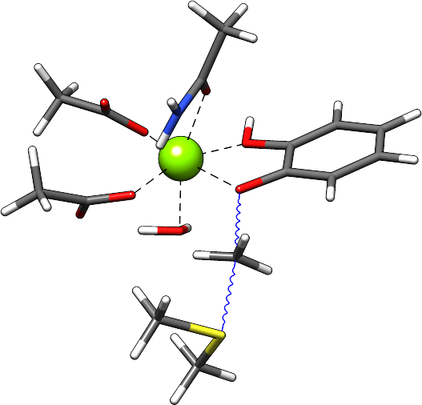

.. _crestxmpl:

--------------------------------------------------
Example applications
--------------------------------------------------

.. panels::
   :column: + text-center

   .. image:: ../figures/alagly.png
      :width: 75%
      :alt: alagly

   +++

   .. link-button:: imtd-gc
      :type: ref
      :text: iMTD-GC conformational search
      :classes: btn-block stretched-link
   
   ---
   
   .. image:: ../figures/wclustpot.png
      :width: 50%
      :alt: imtd-gc

   +++

   .. link-button:: sampling-nci
      :type: ref
      :text: Sampling with NCI mode
      :classes: btn-block stretched-link
      
   ---
   :column: + col-lg-12 p-2
   
   .. image:: ../figures/alaglyprot.png
      :width: 100%
      :alt: alaglyprot

   +++

   .. link-button:: protonation-site-screening
      :type: ref
      :text: Protonation site screening
      :classes: btn-block stretched-link
      
   ---
   :column: + text-center
   
   .. image:: ../figures/alaglydep.png
      :width: 75%

   +++

   .. link-button:: deprotonation-site-screening
      :type: ref
      :text: Deprotonation site screening
      :classes: btn-block stretched-link
      
   ---
   
   .. image:: ../figures/crest_ts.png
      :width: 65%

   +++

   .. link-button:: conformers-ts
      :type: ref
      :text: Conformers of transition-states
      :classes: btn-block stretched-link
   
   ---
   
   .. image:: ../figures/crest_cuvaline.png
      :width: 65%

   +++

   .. link-button:: conformers-metal-organic
      :type: ref
      :text: Metal-organic systems
      :classes: btn-block stretched-link

   ---
   
   .. image:: ../figures/crest_surface.png
      :width: 65%

   +++

   .. link-button:: conformers-tyrosine-graphene
      :type: ref
      :text: Tyrosine on graphene surface
      :classes: btn-block stretched-link

.. contents::

.. _imtd-gc:

iMTD-GC conformational search
=============================

The default application of ``CREST`` is the iMTD-GC conformational search as described in the :ref:`crest`.
In the following, a standard production run with this workflow is shown for the alanineglycine molecule.

.. figure:: ../figures/alagly.png
   :scale: 35 %
   :align: center
   :alt: alagly
   
   Input structure of the alanineglycine molecule.

Let's assume that we are interested in the conformations of Ala-Gly at the GFN2-xTB level with GBSA implicit solvation
for water, and that we are using 4 CPUs.
Then, the command to invoke the conformational search would be:

.. tabbed:: command

    .. code:: sh
	
	  crest struc.xyz -gfn2 -g h2o -T 4

.. tabbed:: struc.xyz

    .. code:: sh

        20
                                           
      C     2.081440     0.615100    -0.508430
      C     2.742230     1.824030    -1.200820
      N     4.117790     1.799870    -1.190410
      C     4.943570     2.827040    -1.822060
      C     6.440080     2.569360    -1.637600
      O     7.351600     3.252270    -2.069090
      N     0.610100     0.695090    -0.538780
      O     2.095560     2.724940    -1.739670
      O     6.705220     1.463410    -0.897460
      H     0.303080     1.426060     0.103770
      H     0.338420     1.050680    -1.460480
      C     2.488753    -0.593400    -1.198448
      H     2.416500     0.557400     0.532050
      H     4.614100     1.081980    -0.670550
      H     4.699850     3.794460    -1.373720
      H     4.722890     2.844690    -2.894180
      H     7.687400     1.448620    -0.860340
      H     2.029201    -1.457008    -0.719999
      H     2.170233    -0.542411    -2.238576
      H     3.572730    -0.688405    -1.154998
	  
.. tabbed:: output

    .. code:: sh	  
 
                ==============================================
                |                                            |
                |                 C R E S T                  |
                |                                            |
                |  Conformer-Rotamer Ensemble Sampling Tool  |
                |          based on the GFN methods          |
                |             P.Pracht, S.Grimme             |
                |          Universitaet Bonn, MCTC           |
                ==============================================
                Version 2.11, Tue 13. Jul 16:11:14 CEST 2021
            Using the xTB program. Compatible with xTB version 6.4.0
            
            Cite work conducted with this code as

            P. Pracht, F. Bohle, S. Grimme, PCCP, 2020, 22, 7169-7192.

            and  S. Grimme, JCTC, 2019, 15, 2847-2862.
            
            with help from:
            C.Bannwarth, F.Bohle, S.Ehlert, S.Grimme,
            P.Pracht, S. Spicher
            
            This program is distributed in the hope that it will be useful,
            but WITHOUT ANY WARRANTY; without even the implied warranty of
            MERCHANTABILITY or FITNESS FOR A PARTICULAR PURPOSE.

            Command line input:
            > crest struc.xyz -gfn2 -g h2o -T 4

            -gfn2 : Use of GFN2-xTB requested.
            --gbsa h2o : implicit solvation
            -T 4 (CPUs/Threads selected)
            
            -------------------------
            xTB Geometry Optimization
            -------------------------
            Geometry successfully optimized.
            
            ------------------------------------------------
            Generating MTD length from a flexibility measure
            ------------------------------------------------
            Calculating WBOs... done.
            Calculating NCI flexibility... done.
                covalent flexibility measure :   0.450
            non-covalent flexibility measure :   0.823
            flexibility measure :   0.501
            t(MTD) / ps    :     5.0
            Σ(t(MTD)) / ps :    70.0 (14 MTDs)
            
            -------------------------------------
            Starting a trial MTD to test settings
            -------------------------------------
            Estimated runtime for one MTD (5.0 ps) on a single thread: 19 sec
            Estimated runtime for a batch of 14 MTDs on 4 threads: 1 min 15 sec
            
            list of Vbias parameters applied:
            $metadyn    0.00300   1.300
            $metadyn    0.00150   1.300
            $metadyn    0.00075   1.300
            $metadyn    0.00300   0.780
            $metadyn    0.00150   0.780
            $metadyn    0.00075   0.780
            $metadyn    0.00300   0.468
            $metadyn    0.00150   0.468
            $metadyn    0.00075   0.468
            $metadyn    0.00300   0.281
            $metadyn    0.00150   0.281
            $metadyn    0.00075   0.281
            $metadyn    0.00100   0.100
            $metadyn    0.00500   0.800
            
            *******************************************************************************************
            **                        N E W    I T E R A T I O N    C Y C L E                        **
            *******************************************************************************************
            
            ========================================
                        MTD Iteration  1
            ========================================
            
                ========================================
                |         Meta-MD (MTD) Sampling       |
                ========================================
            
            <.......>
            
            -----------------------
            Multilevel Optimization
            -----------------------
            
            -------------------------
            1. crude pre-optimization
            -------------------------
            Optimizing all 686 structures from file "crest_rotamers_0.xyz" ...
            <.......>
            done.
            running RMSDs...
            done.
            E lowest :   -33.87998
            654 structures remain within    12.00 kcal/mol window
            
            -------------------------------------
            2. optimization with tight thresholds
            -------------------------------------
            Optimizing all 655 structures from file "crest_rotamers_1.xyz" ...
            <.......>
            done.
            running RMSDs...
            done.
            E lowest :   -33.88023
            119 structures remain within     6.00 kcal/mol window
            
            
            ========================================
                        MTD Iteration  2
            ========================================
            <.......>
            <.......>
            
            ========================================
                        MTD Iterations done         
            ========================================
            Collecting ensmbles.
            running RMSDs...
            done.
            E lowest :   -33.88023
            146 structures remain within     6.00 kcal/mol window
            
            -----------------------------------------------
            Additional regular MDs on lowest 4 conformer(s)
            -----------------------------------------------
            <.......>
            Appending file crest_rotamers_1.xyz with new structures
            
            -------------------------------------------
            Ensemble optimization with tight thresholds
            -------------------------------------------
            Optimizing all 338 structures from file "crest_rotamers_1.xyz" ...
            <.......>
            done.
            running RMSDs...
            done.
            E lowest :   -33.88023
            159 structures remain within     6.00 kcal/mol window
            
            
                ========================================
                |        Structure Crossing (GC)       |
                ========================================
            =============================
            # threads =           4
            =============================
            input  file name : crest_rotamers_3.xyz
            number of atoms                :    20
            number of points on xyz files  :   159
            conformer energy window  /kcal :    6.00
            CN per atom difference cut-off :  0.3000
            RMSD threshold                 :  0.2500
            max. # of generated structures : 250
            reading xyz file ...
            # in E window                159
            generating pairs ...       12719
            66.0 % done
            generated pairs           :       10762
            number of clash discarded :        1799
            average rmsd w.r.t input  : 2.82636
            sd of ensemble            : 0.63885
            number of new structures      :          98
            removed identical structures  :         402
            <.......>
            <.......>
            
            
            ================================================
            |           Final Geometry Optimization        |
            ================================================
            ------------------------------------------------
            Ensemble optimization with very tight thresholds
            ------------------------------------------------
            Optimizing all 170 structures from file "crest_rotamers_4.xyz" ...
            <.......>
            done.
            running RMSDs...
            done.
            E lowest :   -33.88023
            147 structures remain within     6.00 kcal/mol window
            
            input  file name : crest_rotamers_5.xyz
            output file name : crest_rotamers_6.xyz
            number of atoms                :   20
            number of points on xyz files  :   170
            RMSD threshold                 :   0.1250
            Bconst threshold               :   0.0100
            population threshold           :   0.0500
            conformer energy window  /kcal :   6.0000
            # fragment in coord            :     1
            # bonds in reference structure :    19
            number of reliable points      :   170
            reference state Etot :  -33.8802280500000
            number of doubles removed by rot/RMSD         :          23
            total number unique points considered further :         147
                Erel/kcal        Etot weight/tot  conformer     set   degen     origin
                1   0.000   -33.88023    0.04207    0.25214       1       6     gc
                2   0.000   -33.88023    0.04204                                mtd1
                3   0.001   -33.88023    0.04203                                mtd9
                4   0.001   -33.88023    0.04200                                gc
                5   0.001   -33.88023    0.04200                                mtd3
                6   0.001   -33.88023    0.04200                                mtd9
                7   0.050   -33.88015    0.03865    0.19312       2       5     mtd3
                8   0.050   -33.88015    0.03864                                mtd14
                9   0.051   -33.88015    0.03862                                mtd10
                10   0.051   -33.88015    0.03861                                md5
                11   0.051   -33.88015    0.03860                                mtd9
                12   0.476   -33.87947    0.01884    0.09414       3       5     md6
                13   0.476   -33.87947    0.01884                                mtd12
                14   ...
                15   ...

            <.......>
                        
            T /K                                  :   298.15
            E lowest                              :   -33.88023
            ensemble average energy (kcal)        :    0.550
            ensemble entropy (J/mol K, cal/mol K) :   34.054    8.139
            ensemble free energy (kcal/mol)       :   -2.427
            population of lowest in %             :   25.214
            number of unique conformers for further calc           61
            list of relative energies saved as "crest.energies"
            
            <.......>
            
            CREST terminated normally.

         

.. tip:: It usually is wise to preoptimze your input structure with ``xtb`` at the same level on which
         the conformational search shall be conducted. Since the input structure is taken as a reference
         for several sanity checks within the *CREGEN* routine, such as unchanging coordination numbers
         of the atoms, providing a structure on the same level of theory is recommended.

The program call first creates a ``coord`` file from the given input structure and sorts the z-matrix (*ZSORT*).
Then the length of the MTD simulation is determined and the algorithm is started.

The production run yields 147 structures of Ala-Gly, distributed over 61 different conformers within 6 kcal/mol above the 
lowest conformer that was found at the GFN2-xTB level.

.. figure:: ../figures/alaglyconfs.png
   :scale: 25 %
   :align: center
   :alt: alaglyconf
   
   Three lowest conformers of alanineglycine generated by CREST at the GFN2-xTB level.

The final ensemble of all the found conformers is written to an ensemble file in the Xmol format called ``crest_conformers.xyz``.
The corresponding CRE, i.e., the ensemble containing also the rotamers is written to the file ``crest_rotamers.xyz``.

.. _crestsortingcre:

Sorting an ensemble
===================

The *CREGEN* routine that is used within the conformational search can also be used as a standalone tool by including the ``-cregen`` flag:

.. code:: bash
   
      crest struc.xyz -cregen ensemble.xyz

Here ``ensemble.xyz`` is the ensemble file that contains all the structures in the Xmol format.

.. note:: It is required to present a single reference structure (``struc.xyz`` in the example above) of the molecule to check for
          CN clashes. Also, all structures in the ensemble must have the same atom order.

Comparing two ensembles
=======================

Two ensembles generated on different levels of theory can be compared with the ``-compare`` option.
Let's assume that there are two ensembles ``v1.xyz``, generated with the MF-MD-GC procedure and ``v2.xyz``,
generated with the default iMTD-GC workflow.
To compare the 5 lowest conformers of each ensemble simply call:

.. tabbed:: command

    .. code:: sh
  
        crest struc.xyz -compare v1.xyz v2.xyz -maxcomp 5

.. tabbed:: output

    .. code:: sh

               ==============================================
               |                                            |
               |                 C R E S T                  |
               |                                            |
               |  Conformer-Rotamer Ensemble Sampling Tool  |
               |        based on the GFN-xTB method         |
               |             S.Grimme, P.Pracht             |
               |          Universitaet Bonn, MCTC           |
               ==============================================
               Version 2.7, Thu 27. Jun 13:41:37 CEST 2019
               Using the GFN-xTB code.
               Compatible with XTB version 6.1 and later.
        
         ---------------------
         Sorting file <v1.xyz>
         ---------------------
         running RMSDs... done.
          File <v1.xyz> contains 240 conformers.
          The 5 lowest conformers will be taken for the comparison:
          conformer  #rotamers
                1          1
                2          5
                3          3
                4          1
                5          2
        
         ---------------------
         Sorting file <v2.xyz>
         ---------------------
         running RMSDs... done.
          File <v2.xyz> contains 51 conformers.
          The 5 lowest conformers will be taken for the comparison:
          conformer  #rotamers
                1          6
                2          4
                3          3
                4          6
                5          4
        
         -----------------------
         Comparing the Ensembles
         -----------------------
         Calculating RMSDs between conformers... done.
         RMSD threshold:  0.1250 Å
        
         RMSD matrix:
          conformer          1          2          3          4          5
             1         0.01727    1.44147    1.56327    0.81845    0.83933
             2         0.00791    1.43084    1.56995    0.79512    0.83992
             3         1.43350    0.01254    0.80724    1.58138    1.59243
             4         0.12794    1.40597    1.54663    0.89315    0.83634
             5         0.14626    1.51398    1.56167    0.68473    0.88006
        
         --------------------------------
         Correlation between Conformers :
         --------------------------------
            #     Ensemble A             #    Ensemble B
                                         5     -33.87887
                                         4     -33.87937
                                         3     -33.87947
            5      -33.88008
            4      -33.88011
            3      -33.88017   <---->    2     -33.88016
            2      -33.88023   <---->    1     -33.88023
            1      -33.88023
        
         -----------------
         Wall Time Summary
         -----------------
        --------------------
        Overall wall time  : 0h : 0m : 0s
        
         CREST terminated normally.

From  the output it can be seen that there is a correlation between the lowest conformers,
i.e., the lowest conformers were found by both workflows.
As the display options in the terminal are limited, an additional file called ``rmsdmatch.dat`` is written,
from which the exact correlation between the conformers of the two ensembles can be read.
If, for example, two different levels of theory are used and the energies of the molecules in both ensembles
are too different, then the output will not be of much use and one must refer to the ``rmsdmatch.dat`` file.

.. tabbed:: rmsdmatch.dat

    .. code:: sh
    
           1     1
           2     1
           3     2

Each line in this file consists of only two values *a* and *b* which denote that conformer *a* from ensemble *A* matches
conformer *b* from ensemble *B*.
In the example case shown above, the MF-MD-GC produced the lowest conformer twice, which both naturally match conformer 1 from
the iMTD-GC procedure. The second conformer is also the same in both ensembles.

.. note:: For a successful comparison, both ensembles **must** have the same number of atoms with the same
          atom order in each structure. Furthermore, the ensembles should be full CREs, i.e., rotamers should be present.

Constrained conformational sampling
===================================

.. warning:: The following application is still under development and should be considered
          an experimental feature.

It is possible to include additional constraints to all ``xtb`` calculations 
that are conducted by ``CREST``. To do this, one has to create a file called
``.constrains`` (or ``.xcontrol``, both are valid) in the working directory, which contains the constraints
in the exact same syntax as used by ``xtb`` (see section :ref:`detailed-input`).
Constraints that are included via the ``.constrains`` file will be included in *ALL* calculations
of the conformer search run.
To circumvent name conventions, a constrainment file under an arbitrary name can directly be provided
by the ``-cinp <FILE>`` option.
Since this can overwrite settings created by ``CREST`` it should only be used very cautiously!

The main application for the additional constraints is the constrainment (fixing) of atoms,
which could for example be used to sample only conformations for parts of a molecule.
Another use could be the sampling of conformers for the transition state of a reaction.

To fix atoms, it is also recommended to use a reference input file additionally to the 
normal structure input file, which is done with the argument ``reference=FILE`` in the ``.xcontrol`` file.
Furthermore, fixed atoms should not be included in the RMSD of the MTD collective variables.

The content of the ``.xcontrol`` file for fixing atoms should look like the following example:

.. tabbed:: .xcontrol

    .. code:: sh
    
        $constrain
          atoms: 4,8,10,12            # atoms 4, 8, 10 and 12 of some example molecule shall be constrained
          force constant=0.5
          reference=coord.original    # name of the reference file (just a copy of the input coord-file)
        $metadyn
          atoms: 1-3,5-7,9,11         # atoms *included* to RMSD in the MTD (typically NOT the constrained atoms)
        $end

This should ensure correct constrainment (as far as possible) in the MTD, as well as in the GFN\ *n*-xTB geometry
optimization within a ``CREST`` run.

It is also possible to let ``CREST`` generate such a file automatically.
To do this, the list of atoms has to be provided with the flag ``--constrain <atom list>``, i.e.,

.. code:: bash

    crest struc.xyz --constrain <atom list>

which will **not** start any calculation but instead write a file ``.xcontrol.sample`` that could subsequentially be used.
Furthermore, the file ``coord.ref`` will be created. (e.g. for a molecule with 65 atoms):

.. tabbed:: command

    .. code:: sh

        crest struc.xyz --constrain 1,2,3,10-13

.. tabbed:: output

    .. code:: sh

            
                ==============================================
                |                                            |
                |                 C R E S T                  |
                |                                            |
                |  Conformer-Rotamer Ensemble Sampling Tool  |
                |          based on the GFN methods          |
                |             P.Pracht, S.Grimme             |
                |          Universitaet Bonn, MCTC           |
                ==============================================
                Version 2.11, Tue 13. Jul 16:11:14 CEST 2021
            Using the xTB program. Compatible with xTB version 6.4.0
            
            Cite work conducted with this code as

            P. Pracht, F. Bohle, S. Grimme, PCCP, 2020, 22, 7169-7192.

            and  S. Grimme, JCTC, 2019, 15, 2847-2862.
            
            with help from:
            C.Bannwarth, F.Bohle, S.Ehlert, S.Grimme,
            P.Pracht, S. Spicher
            
            This program is distributed in the hope that it will be useful,
            but WITHOUT ANY WARRANTY; without even the implied warranty of
            MERCHANTABILITY or FITNESS FOR A PARTICULAR PURPOSE.

            Command line input:
            > crest struc.xyz --constrain 1,2,3,10-13

            Input list of atoms: 1,2,3,10-13
            7 of 20 atoms will be constrained.
            A reference coord file coord.ref was created.
            The following will be written to <.xcontrol.sample>:

            > $constrain
            >   atoms: 1-3,10-13
            >   force constant=0.5
            >   reference=coord.ref
            > $metadyn
            >   atoms: 4-9,14-20
            > $end    

    

.. note:: Important: <atom list> must not contain any blanks and atoms must be separated by comma. Ranges (e.g. 10-13) are allowed.

.. _sampling-nci:

Sampling of noncovalent complexes and aggregates (NCI mode)
===========================================================

A specialized application of ``CREST`` is the sampling of aggregates (also referred to as NCI mode).
The idea here is to find different conformations of noncovalently bound complexes in which the 
arrangement of the fragments is of interest.
The application can be called by:

.. code:: bash

        crest struc.xyz -nci

The procedure and output is essentially the same as a normal iMTD-GC production run, but with reduced settings
(less MTDs, different :math:`k` and :math:`\alpha`), and no genetic structure crossing.
What is different, however, is that first an ellipsoid wall potential is created and added to the meta-dynamics.
A nice example for this application are small molecular clusters, e.g. (H\ :sub:`2`\ O)\ :sub:`6`.
The ellipsoid potential that is automatically determined for the input cluster is visualized in the figure below.

.. figure:: ../figures/wclustpot.png
   :scale: 30 %
   :align: center
   :alt: wclustpot
   
   Visualization of an ellipsoid potential around (H\ :sub:`2`\ O)\ :sub:`6` cluster.

The ellipsoid potential is required in the MTDs to counteract the bias potential, which would simply lead to a
dissociation of the NCI complex after a few picoseconds (due to the maximization of the RMSD).
In the subsequent geometry optimization, however, the surrounding potential must not be present since the bias potential
is also not there and the structure would be artificially compressed by the ellipsoid. Hence it is automatically removed in 
the geometry optimizations

.. note:: The ellipsoid potential can be scaled by the factor *REAL*  with the flag ``-wscal REAL``.

Many new clusters are generated even for small NCI complexes, typically much more than conformers are generated for a single medium-sized molecule.
In general, the task of finding new low lying aggregates is much more challenging than finding (only) conformers, since each fragment of
the complex could also have several different low lying conformations.
For the (H\ :sub:`2`\ O)\ :sub:`6` cluster 3 examples are shown in the figure below. Note that all three structures are also part of the
well-established WATER27 benchmark set, but were generated automatically by ``CREST`` from a single input structure. In total 69 different clusters were
found of which only 3 are shown.

.. figure:: ../figures/wclust1.png
   :scale: 30 %
   :align: center
   :alt: wclust1
   
   Three automatically generated structures for a (H\ :sub:`2`\ O)\ :sub:`6` cluster.

Molecular prototropy screening
==============================

.. _protonation-site-screening:

Protonation site screening
--------------------------
The screening for possible protonation sites, i.e., for the different protomers of a molecule is possible
by using a localized molecular orbital LMO approach. Herein, first the :math:`\pi`- and LP-centers are determined by a GFNn-xTB
calculation, and then all possible input structures are generated where a proton is placed at one of these centers.
This procedure was first described in `J. Comput. Chem. 2017, 38, 2618–2631 <https://doi.org/10.1002/jcc.24922>`_.

The example calculation is performed for alanineglycine, in the gas phase, with the command

.. tabbed:: command

    .. code:: sh

        crest struc.xyz -protonate

.. tabbed:: output

    .. code:: sh

 
                ==============================================
                |                                            |
                |                 C R E S T                  |
                |                                            |
                |  Conformer-Rotamer Ensemble Sampling Tool  |
                |          based on the GFN methods          |
                |             P.Pracht, S.Grimme             |
                |          Universitaet Bonn, MCTC           |
                ==============================================
                Version 2.11, Tue 13. Jul 16:11:14 CEST 2021
            Using the xTB program. Compatible with xTB version 6.4.0
            
            <.......>
                    __________________________________________
                |                                          |
                |       automated protonation script       |
                |__________________________________________|
                
            <.......>
            
            LMO calculation ... done.
            
            -----------------------
            Multilevel Optimization
            -----------------------
            -------------------------
            1. crude pre-optimization
            -------------------------
            Optimizing all 13 structures from file "protonate_0.xyz" ...
            1 2 3 4 5 6 7 8 9 10 11 12 13
            done.
            12 structures remain within    90.00 kcal/mol window
            
            ---------------------
            2. loose optimization
            ---------------------
            Optimizing all 12 structures from file "protonate_1.xyz" ...
            1 2 3 4 5 6 7 8 9 10 11 12
            done.
            12 structures remain within    60.00 kcal/mol window
            
            --------------------------------------------
            3. optimization with user-defined thresholds
            --------------------------------------------
            Optimizing all 12 structures from file "protonate_2.xyz" ...
            1 2 3 4 5 6 7 8 9 10 11 12
            done.
            9 structures remain within    30.00 kcal/mol window
            
            ===================================================
            Identifying topologically equivalent structures:
            Equivalent to 2. structure: 7 structure(s).
            Done.
            Appending file <protonated.xyz> with structures.
            
            Initial 9 structures from file protonate_3.xyz have
            been reduced to 3 topologically unique structures.
            
            ===================================================
            ============= ordered structure list ==============
            ===================================================
            written to file <protonated.xyz>
            
            structure    ΔE(kcal/mol)   Etot(Eh)
                1            0.00        -33.953296
                2            2.33        -33.949576
                3           28.73        -33.907516
            
            
            -----------------
            Wall Time Summary
            -----------------
                    LMO calc. wall time :         0h : 0m : 0s
                multilevel OPT wall time :         0h : 0m :10s
            --------------------
            Overall wall time  : 0h : 0m :10s
            
            CREST terminated normally.

As one can see from the output, three possible protomers of alanineglycine were found at the GFN2-xTB level (within the default
30 kcal/mol energy window around the most stable protomer). This ensemble of structures is written to a file called
``protomers.xyz``.
The first (lowest) protomer created by ``CREST`` for this molecule includes a ring-closure, apparently caused by the addition of the proton.
This nicely demonstrates the ability of our approach to form and break new bonds.
The three protomers are shown in the figure below.

.. figure:: ../figures/alaglyprot.png
   :scale: 20 %
   :align: center
   :alt: alaglyprot
   
   Three lowest protomers of alanineglycine generated by CREST at the GFN2-xTB level.

.. _deprotonation-site-screening:

Deprotonation site screening
----------------------------

The general approach to find deprotonation sites at a GFN level is much more simple than finding protonation sites.
For each hydrogen atom in the structure a new (deprotonated) reference structure is created and optimized in a multilevel
approach.
The commandline argument to invoke this search is listed below. For the example of alanineglycine, again three structures are obtained and written to a file called ``deprotonated.xyz``. However, two of the three structures have much higher energies and therefore mainly the lowest deprotomer should be considered.

.. tabbed:: command

    .. code:: sh

        crest struc.xyz -deprotonate

.. tabbed:: output

    .. code:: sh
        
        <.......>
        <.......>
        
        ===================================================
        ============= ordered structure list ==============
        ===================================================
        written to file <deprotonated.xyz>
        
        structure    ΔE(kcal/mol)   Etot(Eh)
            1            0.00        -33.597012
            2           24.18        -33.558474
            3           24.44        -33.558057
        
        <.......>
        <.......>

.. figure:: ../figures/alaglydep.png
   :scale: 25 %
   :align: center
   :alt: alaglydeprot
   
   Lowest deprotomer of alanineglycine at the GFN2-xTB level. The deprotonation happens at the carboxyl group.

Tautomerization screening
-------------------------

The last application of the different prototropy screening protocols is an automatized tautomerization tool, which utilizes
both the protonation and deprotonation procedures presented in the previous two subsections.
By first protonating a molecule and then deprotonating the resulting protomers at all postions, prototropic tautomers
relative to the initial input structure can be found.
A single cycle of this protonation/deprotonation in principle yields all tautomers with a single hydrogen permutation relative to the input.
If a higher number of hydrogen permutations is required, the procedure can simply be repeated with the created tautomers, i.e., tautomers with
two or more hydrogen atom permutations are generated.
From experience, however, it is generally sufficient to repeat this protonation/deprotonation cycle twice (which is the default in ``CREST``),
in order to get the relevant *low energy* tautomers.
The approach was first described in `J. Comput.-Aided Mol. Des. 2018, 32, 1139-1149 <https://doi.org/10.1007/s10822-018-0145-7>`_.
The tautomerization search can be conducted by the command below. The output is generated for alanineglycine.

.. tabbed:: command

    .. code:: sh
   
        crest struc.xyz -tautomerize
        
.. tabbed:: output

    .. code:: sh
    
                
                ==============================================
                |                                            |
                |                 C R E S T                  |
                |                                            |
                |  Conformer-Rotamer Ensemble Sampling Tool  |
                |          based on the GFN methods          |
                |             P.Pracht, S.Grimme             |
                |          Universitaet Bonn, MCTC           |
                ==============================================
                Version 2.11, Tue 13. Jul 16:11:14 CEST 2021
            Using the xTB program. Compatible with xTB version 6.4.0
            
            <.......> 
                    __________________________________________
                |                                          |
                |     automated tautomerization script     |
                |__________________________________________|

            <.......> 
            
            ******************************************************************************************
            **                   P R O T O N A T I O N   C Y C L E     1 of 2                       **
            ******************************************************************************************
            
            LMO calculation ... done.
            -----------------------
            Multilevel Optimization
            -----------------------
            <.......> 
            ===================================================
            Identifying topologically equivalent structures:
            <.......> 
            Appending file <protonated.xyz> with structures.
            
            Initial 10 structures from file protonate_2.xyz have
            been reduced to 3 topologically unique structures.
            ===================================================
            ============= ordered structure list ==============
            ===================================================
            written to file <protonated.xyz>

            structure    ΔE(kcal/mol)   Etot(Eh)
                1            0.00        -33.952363
                2            1.84        -33.949433
                3           28.36        -33.907162
            
            ******************************************************************************************
            **                 D E P R O T O N A T I O N   C Y C L E     1 of 2                     **
            ******************************************************************************************
            -----------------------
            Multilevel Optimization
            -----------------------
            <.......> 
            ===================================================
            Identifying topologically equivalent structures:
            <.......> 
            Appending file <deprotonated.xyz> with structures.
            
            Initial 25 structures from file deprotonate_2.xyz have
            been reduced to 8 topologically unique structures.
            ===================================================
            ============= ordered structure list ==============
            ===================================================
            written to file <deprotonated.xyz>

            structure    ΔE(kcal/mol)   Etot(Eh)
            <.......> 
            
            ******************************************************************************************
            **                   P R O T O N A T I O N   C Y C L E     2 of 2                       **
            ******************************************************************************************
            Calculating LMOs for all structures in file <tautomerize_1.xyz>
            <.......> 
            Collecting generated protomers ... done.
            
            -----------------------
            Multilevel Optimization
            -----------------------
            <.......>
            ===================================================
            Identifying topologically equivalent structures:
            <.......>
            Appending file <protonated.xyz> with structures.
            
            Initial 48 structures from file protonate_1.xyz have
            been reduced to 13 topologically unique structures.
            ===================================================
            ============= ordered structure list ==============
            ===================================================
            written to file <protonated.xyz>

            structure    ΔE(kcal/mol)   Etot(Eh)
            <.......>
            
            ******************************************************************************************
            **                 D E P R O T O N A T I O N   C Y C L E     2 of 2                     **
            ******************************************************************************************
            -----------------------
            Multilevel Optimization
            -----------------------
            <.......>
            ===================================================
            Identifying topologically equivalent structures:
            <.......>
            Appending file <deprotonated.xyz> with structures.
            
            Initial 77 structures from file deprotonate_2.xyz have
            been reduced to 17 topologically unique structures.
            ===================================================
            ============= ordered structure list ==============
            ===================================================
            written to file <deprotonated.xyz>

            structure    ΔE(kcal/mol)   Etot(Eh)
            <.......>
            
            ******************************************************************************************
            **                              T A U T O M E R I Z E                                   **
            ******************************************************************************************
            ---------------------------
            Final Geometry Optimization
            ---------------------------
            <.......>
            ===================================================
            Identifying topologically equivalent structures:
            Done.
            Appending file <tautomers.xyz> with structures.
            
            All initial 17 structures from file tautomerize_4.xyz are unique.
            
            ===================================================
            ============= ordered structure list ==============
            ===================================================
            written to file <tautomers.xyz>
            
            structure    ΔE(kcal/mol)   Etot(Eh)
                1            0.00        -33.864123
                2            2.45        -33.860219
                3            3.73        -33.858179
                4            3.73        -33.858178
                5            8.64        -33.850359
                6            9.27        -33.849346
                7           10.00        -33.848191
                8           10.47        -33.847445
                9           10.47        -33.847445
            10           16.83        -33.837299
            11           19.94        -33.832349
            12           20.44        -33.831554
            13           22.07        -33.828957
            14           25.37        -33.823693
            15           26.19        -33.822393
            16           27.88        -33.819698
            17           28.93        -33.818019
            
            
            -----------------
            Wall Time Summary
            -----------------
                    LMO calc. wall time :         0h : 0m : 0s
                multilevel OPT wall time :         0h : 1m :30s
            --------------------
            Overall wall time  : 0h : 1m :30s
            
            CREST terminated normally.

.. tip:: The number of protonation/deprotonation cycles can be adjusted with the flag ``-iter INT``, where *INT* is the number of cycles.

As can be seen from the output, the entire procedure is constructed from the protonation and deprotonation site screening routines.
The first protonation step yields the same three protomers that are also obtained by the standalone application, which are then
automatically deprotonated. Two protonation/deprotonation cycles are performed.
The final tautomer ensemble consists of 17 structures (within 30 kcal/mol) and is written to the file ``tautomers.xyz``.

Property calculations on final ensemble
=======================================

It is possible to (automatically) perform further calculations on the final conformer ensemble
by the usage of the ``-prop`` option:

.. code:: bash

        crest [input] [options] -prop [property option]

Currently, there are only a few options available but we plan to implement more.

A useful type of this mode is e.g. the reoptimization of the conformer ensemble with
very tight convergence thresholds. In combination with crude conformational search settings
such as ``-quick``, ``-squick`` or ``-mquick`` this helps to ensure the ensemble convergence,
i.e., the minimization of artificial structural differences for the same conformer due to
too loose geometry optimizations.
This reoptimization can be requested by

.. code:: bash
    
    crest coord -mquick -prop reopt

Updated geometries will generally be written to a new ensemble file called ``crest_property.xyz``.

Another useful runtype of this mode is the calculation of frequencies and reweighting
of the conformers on the resulting free energies. E.g.:

.. code:: bash

    crest coord -prop hess

The property mode can also directly be applied to a given ensemble:

.. code:: bash

    crest -forall <ensemble>.xyz -prop [property option]

Dry run to check settings prior to calculations
===============================================

A dry run can be performed by ``CREST`` to verify the settings that would be applied in the
calculation. To do this, simply add the ``-dry`` flag to the cmd-input line.

.. code:: bash

    crest [input] [options] -dry

With this option nothing will actually be calculated but instead, the settings are printed.
E.g. for some random setting:

.. tabbed:: command

    .. code:: sh
    
    	crest coord -ewin 3.2 -temp 999 -gfn1 -nozs -chrg 1 -cinp .xcontrol.sample -dry 
    
.. tabbed:: output

    .. code:: sh

            <....>
            <....>
            
            ******************************************************************************************
            **                                  D R Y    R U N                                      **
            ******************************************************************************************
            Dry run was requested.
            Running CREST with the chosen cmd arguments will result in the following settings:

            Input file : coord

            Job type :
            1.  Conformational search via the iMTD-GC algo

            Job settings
            sort Z-matrix        :      F

            CRE settings
            energy window         (-ewin) :    3.2000
            RMSD threshold        (-rthr) :    0.1250
            energy threshold      (-ethr) :    0.0500
            rot. const. threshold (-bthr) :      0.01
            T (for boltz. weight) (-temp) :    999.00

            General MD/MTD settings
            simulation length [ps]    (-len) : <system dependent>
            time step [fs]          (-tstep) :       5.0
            shake mode              (-shake) :         2
            MTD temperature [K]    (-mdtemp) :    300.00
            trj dump step  [fs]    (-mddump) :       100
            MTD Vbias dump [ps]    (-vbdump) :       1.0

            XTB settings
            binary name        (-xnam) : xtb
                binary: "xtb"
                status: present
                path  : /home/thomas/bin/xtb
            GFN method         (-gfn)  : --gfn1
            (final) opt level  (-opt)  : 2
            Molecular charge   (-chrg) : 1

            Technical settings
            working directory : /tmp1/thomas/
            CPUs (threads)     (-T) : 4

Examples from the paper: Automated exploration of the low-energy chemical space with fast quantum chemical methods 
==================================================================================================================

.. _conformers-ts:

Conformers of transition-states
-------------------------------

At first, a transition-state (TS) has to be localized. Then the TS mode has to be identified 
and reasonable constraints have to be applied to freeze this mode during the CREST run.
Choosing suitable constraints is the responsibility of the user.

   
   Transition state of the active site of the COMT enzyme. TS mode highlighted 
   in blue. (Mg2+ in green, sulfur in yellow).

In this example, a methyl group is transferred onto the catechol molecule. To preserve the TS vibrational mode the atoms which are dominantly contributing to this mode are fixed.
In this case, the carbon (36) of the methyl group being transferred, the sulfur (37) of the
*S*-adenosyl- L -methionine (SAM) and the oxygen (35) of the catechol group are constrained.
For running the TS conformational search only these atoms have to be constrained. 
But to retain the surrounding enzyme environment additionally the distances of all ligands 
to the magnesium cation and the amide magnesium water angle were constrained. 
As stated before all atoms with constraints have to be removed from the list of 
atoms which are used in the metadynamics simulation.

.. tabbed:: command

    .. code:: sh
    
        crest coord -cinp .constraintinp -g methanol > crest.out 
        
.. tabbed:: .constrains

    .. code:: sh

        $constrain
        atoms: 35-37
        force constant=0.5
        reference=coord.ref
        distance: 10, 1, auto
        distance: 2, 1, auto
        distance: 11, 1, auto
        distance: 14, 1, auto
        distance: 9, 1, auto
        angle: 9, 1, 11, 180
        $metadyn
        atoms: 3-8,12-13,15-34,38-53 
        $end

.. tabbed:: coord.ref

    .. code:: sh

        $coord
            -2.57480197685137   -0.38573933229522    0.86228536590435      Mg
            -5.87996595426622   -1.46598597135567   -1.00931632324148      O
            -5.79755045954234    1.88737481602186    1.36486580018227      O
            -6.93504356011937    0.41703174067196   -0.07677235660280      C
            -9.68583177367761    0.93957235453071   -0.70260934507636      C
            -9.88785370898918    2.90051382662291   -1.27585066001173      H
            -10.31204304615949  -0.31693795001232   -2.19707799857187      H
            -10.81224558069477   0.63532604630470    0.98871505743889      H
            -1.35732893615725    2.84149984259631    3.74273757259152      O
            -1.31788637685368    1.88478932440519   -1.80336662588251      O
            -1.03506712269361   -3.09136305475668   -1.65209468828016      O
            -3.01034174150676    3.35231258504990    4.30691490291278      H
            -0.64007292100150    4.31049584542225    2.93186531615926      H
            -3.02042382593105   -2.69109360436689    3.78441246580865      O
            -0.67413309122153   -2.78784634989936    4.10013037720282      C
             0.80704125300360   -1.59087682326574    2.72475235410942      O
             0.37030033373577   -4.45667671167827    6.17913372417457      C
             1.65729077111170   -3.36053569450090    7.34278701173010      H
            -1.17079464125707   -5.18933342363882    7.31676317209597      H
             1.41212360996512   -6.00880794547076    5.32805483610633      H
            -0.04610218809699    0.99217247488345   -2.84947633284740      H
            -0.58166801572397    4.35407649708453   -2.13719082516246      C
             1.69930763718877    4.60968100984284   -3.53188509022323      C
            -1.89895861199073    6.41295502711680   -1.26089925937752      C
             2.61815567802848    7.04758861150735   -3.94211016089909      C
            -0.94293511850593    8.82264113991643   -1.71734825726509      C
            -3.65794447068903    6.13213826999732   -0.25859371242962      H
             1.29133066638906    9.11831895867148   -3.04019344765619      C
             4.35136261809131    7.29515670682662   -4.99253235854911      H
            -1.96139641783255   10.45433175989920   -1.03894063047482      H
             2.01793975704253   10.99527109251927   -3.38477251662235      H
             5.63677744964081   -0.19526366812337   -3.54734464996746      H
             3.55857435122244    0.44545364581733   -0.79647639427433      H
             6.02794370271953    2.75567866080431   -1.74563412676399      H
             2.74773927853638    2.50310064429053   -4.32763740793204      O
             5.16232303152189    0.93488296527549   -1.93713143185301      C
             7.77908129622702   -0.95480533027442    0.60724611364076      S
             6.20470140355368   -3.99408071134196    0.68137239550646      C
             7.00770708640275   -5.10883646299712    2.20213746286551      H
             4.19551348270129   -3.68373090740626    0.97362752914345      H
             6.54643468112530   -4.90904155689111   -1.11917138292065      H
             6.61325357496481    0.34737209228094    3.55003016825311      C
             7.52593267335208   -0.62757026577676    5.10500275305939      H
             7.10342021330197    2.33658535430792    3.58672294810726      H
             4.57513571292400    0.10172782556556    3.62256009227771      H
            -1.61022171124489   -5.31411191371024   -2.02789529853598      C
            -3.17527947979499   -6.57718946281529   -0.51674594958634      N
            -3.77763814894346   -8.33207207055257   -0.93763600526181      H
            -4.05833804986482   -5.57635320116590    0.85099090510650      H
            -0.47266612030322   -6.78426594278943   -4.18601622917577      C
             0.51805850799787   -8.43374379675092   -3.46937160488911      H
            -1.96305386150678   -7.41025810365247   -5.45278966275112      H
             0.83013814067146   -5.58152886274452   -5.21822759129119      H
        $end

The TS conformer search yields 141 conformers within 6 kcal/mol. On these conformers,
Hessians have to be calculated to ensure that the transition-state mode is preserved.
Those conformers with preserved mode can be optimized into the TS and the true TSs
have to be confirmed by again a hessian calculation (only one imaginary mode). 
During the optimization, some conformers can become identical or rotamers of each other.
To this end all optimized geometries are appended and sorted with the cregen sorting routine.

.. code:: bash

    cat TSconf*.xyz >> allts.xyz

    crest coord -cregen allts.xyz -ewin 30 > sorting.out

   
   Transition state conformers of the active site of the COMT enzyme.
   (Mg2+ in green, sulfur in yellow, water oxygen in blue). Hydrogen atoms are omitted for clarity.

Now after sorting only 91 unique TS conformers are obtained within an energy window of 6.1 kcal/mol.
This procedure can in principle be refined at DFT level.

.. _conformers-metal-organic:

Conformers of metal-organic systems
-----------------------------------

* `trans`-Cu(II)(L-valine)2

Calculation of `trans`-Cu(II)(L-valine)2 conformers in the gas phase.

   
.. tabbed:: command

    .. code:: sh
    
        crest coord -nci > crest.out

.. tabbed:: coord

    .. code:: sh

        $coord
         -0.002022192318         -0.000684522852          1.349121896005     CU
          2.028671941135          2.818125977315          1.174767316951     O
          4.406562542342          2.529552834523          0.838287117696     C
          5.900488893190          4.242544277537          0.591753944418     O
          5.382406579092         -0.254197829091          0.699650595616     C
          3.456927714843         -1.958681435237          1.737975874213     N
          3.442953703137         -3.661542617496          0.846227450863     H
          3.710547158869         -2.249430796311          3.618554595139     H
          7.133224715719         -0.349791899055          1.804782999185     H
          6.007018333138         -0.877714812490         -2.069473442827     C
          7.266213509953         -3.466799912264         -2.312238367182     C
          8.881995597301         -3.618089140164         -1.050454618739     H
          7.930334466002         -3.738254167109         -4.236839656939     H
          5.952357752542         -4.994107920656         -1.890594175637     H
          3.663534173447         -0.712885768717         -3.746419767180     C
          4.156219468360         -1.164942859389         -5.689573088070     H
          2.890265219159          1.189883399588         -3.704912704715     H
          2.203522204085         -2.025873622846         -3.126878925482     H
          7.355957431563          0.567207315613         -2.680683804317     H
         -2.033163868813         -2.819780021566          1.179505209377     O
         -4.409877555278         -2.530551975348          0.835068556898     C
         -5.903043316660         -4.243023566156          0.580387940800     O
         -5.384798675016          0.253509426488          0.697143335052     C
         -3.461334991004          1.955672873602          1.742931448447     N
         -3.448757571238          3.662158486139          0.858135081470     H
         -3.716247763220          2.238184300034          3.624611253622     H
         -7.138671974341          0.348502264395          1.797538738740     H
         -6.001307995929          0.880859137312         -2.072901114603     C
         -7.255902292489          3.472119634743         -2.316426880308     C
         -7.917767124579          3.744910887179         -4.241612390481     H
         -5.939710712311          4.997073845686         -1.893506102537     H
         -8.872648523224          3.626011270865         -1.056195385178     H
         -3.653380600330          0.714736239795         -3.743504646086     C
         -2.884657484645         -1.189944325855         -3.704494974332     H
         -2.192229886598          2.022965931298         -3.116395721134     H
         -4.139423979729          1.172691111744         -5.686934420106     H
         -7.350580840264         -0.561585906341         -2.689213500551     H
        $end

.. tabbed:: output

    .. code:: sh        

        
              ==============================================
              |                                            |
              |                 C R E S T                  |
              |                                            |
              |  Conformer-Rotamer Ensemble Sampling Tool  |
              |          based on the GFN methods          |
              |             P.Pracht, S.Grimme             |
              |          Universitaet Bonn, MCTC           |
              ==============================================
              Version 2.11, Tue 13. Jul 16:11:14 CEST 2021
         Using the xTB program. Compatible with xTB version 6.4.0
         
       <.......>
       
       T /K                                  :   298.15
       E lowest                              :   -57.69401
       ensemble average energy (kcal)        :    0.430
       ensemble entropy (J/mol K, cal/mol K) :   45.253   10.816
       ensemble free energy (kcal/mol)       :   -3.225
       population of lowest in %             :    7.134
        number of unique conformers for further calc           52
        list of relative energies saved as "crest.energies"
        
        -----------------
        Wall Time Summary
        -----------------
                    test MD wall time :         0h : 0m : 5s
                        MTD wall time :         0h :15m :51s
             multilevel OPT wall time :         0h :49m :17s
       --------------------
       Overall wall time  : 1h : 6m :47s
        
        CREST terminated normally.

        
        
Results in 52 conformers within an energy window of 6 kcal/mol.

* [Pt(COMe)2(2-py)3COH] conformers in methanol.

.. tabbed:: command

    .. code:: sh
    
       crest coord -g methanol -ewin 10 > crest.out
       
.. tabbed:: coord

    .. code:: sh
    
         $coord
             1.48235976014562      0.32575477023909      0.83983586742930      pt
             4.37233116325056     -2.04701937728251      0.66066526359202       c
             5.11582123352082     -2.89977152283009     -1.35531347223172       o
             5.60331010456907     -2.97886601012202      3.10440618630801       c
             5.11582123352082     -1.79782119213888      4.71363082065877       h
             4.96457322302306     -4.90914755554552      3.43123243126445       h
             7.64542186308448     -3.03767428737742      2.85382472163511       h
             3.90413261656682      3.15849014823120      0.32067896584616       c
             3.77547628198769      4.50973504009881     -1.55263489557537       o
             5.78086877201500      3.82467530185737      2.40255812110202       c
             6.44902868945004      5.75938447561023      2.16769917785472       h
             4.93481948506077      3.56859662386391      4.26032709535443       h
             7.38167845589603      2.54234683232997      2.24297074917982       h
            -1.45880054444693     -2.37015120764916      1.99982157738756       n
            -1.37380633216814     -3.71993156176379      4.12084829921227       c
            -3.47313332880892     -4.91477704969539      5.12088380983082       c
            -5.76730431783315     -4.67836853101913      3.87619679514437       c
            -5.86160354159028     -3.26072055256804      1.67926544374004       c
            -3.65812239940936     -2.14869231241016      0.79621720883004       c
            -3.66283159693252     -0.54983471562441     -1.60480456492594       c
            -1.36490194262998     -1.28858913220566     -3.20027766220770       c
            -1.32606807059918     -3.74293708770554     -3.74494019740640       n
             0.45445456851927     -4.60152659727760     -5.28248940926294       c
             2.25936790283487     -3.06404352583571     -6.38168829870466       c
             2.17878809080250     -0.49502320914006     -5.86813254537940       c
             0.32467195716495      0.43733364975533     -4.26146660021256       c
             0.14833216307473      2.45190076015779     -3.96574713712955       h
             3.52744783732032      0.78490530819858     -6.70693851206628       h
             3.68438581320421     -3.84772429150018     -7.60737222739882       h
             0.39857914622211     -6.61487483432435     -5.63264243360372       h
            -5.86517134452916     -0.98949461824931     -3.04219073283502       o
            -5.69660399402350     -2.62769064394335     -3.83817172589844       h
            -3.63492223167593      2.20020246734036     -0.78356738209650       c
            -1.79344269668899      2.91320936536104      0.78584828153889       n
            -1.75920841806563      5.28509912105245      1.61658700736449       c
            -3.54797404257573      7.05739011313605      0.91252418313075       c
            -5.45207721188036      6.32967358689699     -0.73330822586627       c
            -5.50553000527517      3.85501674464698     -1.58299523562631       c
            -6.94955289136293      3.18275045232518     -2.84989409127871       h
            -6.87435123990475      7.65734792470912     -1.34159783995923       h
            -3.43966438926938      8.95769115346132      1.63587922145511       h
            -0.24274666012596      5.76489302728759      2.90140613593504       h
            -7.59878342212486     -2.99720202278941      0.64743151148342       h
            -7.44966324325272     -5.57429713925087      4.59918333687282       h
            -3.30863455866736     -5.99888080678762      6.83682316863177       h
             0.45096235462570     -3.84321729467325      5.03295296314152       h
         $end

.. tabbed:: output

    .. code:: sh        

        
              ==============================================
              |                                            |
              |                 C R E S T                  |
              |                                            |
              |  Conformer-Rotamer Ensemble Sampling Tool  |
              |          based on the GFN methods          |
              |             P.Pracht, S.Grimme             |
              |          Universitaet Bonn, MCTC           |
              ==============================================
              Version 2.11, Tue 13. Jul 16:11:14 CEST 2021
         Using the xTB program. Compatible with xTB version 6.4.0
         
       <.......>
       
       T /K                                  :   298.15
       E lowest                              :   -78.08070
       ensemble average energy (kcal)        :    0.551
       ensemble entropy (J/mol K, cal/mol K) :   37.238    8.900
       ensemble free energy (kcal/mol)       :   -2.654
       population of lowest in %             :   43.032
        number of unique conformers for further calc           43
        list of relative energies saved as "crest.energies"
        
        -----------------
        Wall Time Summary
        -----------------
                    test MD wall time :         0h : 0m :11s
                        MTD wall time :         0h :24m : 9s
             multilevel OPT wall time :         0h :55m : 9s
                         MD wall time :         0h :13m :46s
                         GC wall time :         0h : 0m :14s
       --------------------
       Overall wall time  : 1h :36m :42s
        
        CREST terminated normally.

The search for the Pt-complex conformers results in 43 conformers within an energy
window of 10 kcal/mol. 

.. _conformers-tyrosine-graphene:

Conformational search of tyrosine on a graphene surface
-------------------------------------------------------

To sample a tyrosine molecule at a graphene surface, the graphene sheet has to be constrained.
All atoms in the graphene layer are constrained and removed from the metadynamics list.

.. tabbed:: command

    .. code:: sh
   
        crest coord -v3 -T 40 -subrmsd -nozs -shake 0 -tstep 1 > crest.out

.. tabbed:: .constrains

    .. code:: sh

        $constrain
            atoms: 1-252
            force constant=0.5
            reference=coord.input-original
            $metadyn
            atoms: 253-276
        $end
        
.. tabbed:: coord.input-original

    .. code:: sh

         $coord
             25.57030991921202   -1.29059115296523   -0.00598160501741      C
             25.57044241258889    1.28341269512943   -0.00397025649369      C
             23.26056590790795    2.70217665940709   -0.00029100251731      C
             23.24029402398585    5.32779404644931    0.00100734191172      C
             20.94157103860908    6.71653777403401    0.00350095166658      C
             20.91152361664611    9.36664222799565    0.00390218154564      C
             18.62125921494789   10.73533662251798    0.00644642379287      C
             18.58134086796354   13.40310199790359    0.00577252431633      C
             16.30144187186615   14.75441822463413    0.00911453357094      C
             16.24838174294015   17.43954219647988    0.00645557179198      C
             13.98481323267349   18.77014376357869    0.00996412506652      C
             13.91132086532623   21.47993962309619    0.00398308521361      C
             11.68223395792687   22.76705405593083    0.00667868517840      C
             23.23975279130400   -5.33474095446540   -0.00731302769541      C
             23.26029458648507   -2.70912180306862   -0.00467349937707      C
             20.93174016704535   -1.33727196043975   -0.00133108922934      C
             20.93188342707722    1.33055529046503    0.00081585427198      C
             18.61221093462830    2.68271748197896    0.00282646704916      C
             18.60800793365893    5.36022077189572    0.00464910445605      C
             16.29058723267624    6.70694827919018    0.00657403025646      C
             16.28436011426403    9.38628406493185    0.00875170443409      C
             13.96723583506467   10.73158318782874    0.01208246556117      C
             13.95992943220878   13.41187709257133    0.01391081920492      C
             11.64338138388279   14.75451471117306    0.01811199832376      C
             11.63248103339880   17.43948496412882    0.01741770073639      C
             9.32215273401024    18.77351998648383    0.02061202665840      C
             9.29861569072829    21.47602775444658    0.01579094470882      C
             7.01463133268908    22.77127484019967    0.01713945360400      C
             20.91057452024432   -9.37335860619177   -0.00926090528278      C
             20.94088299656363   -6.72324817926078   -0.00658702044546      C
             18.60745075594095   -5.36670680488450   -0.00374295822885      C
             18.61193643260484   -2.68920008796749   -0.00153341601501      C
             16.28742192884590   -1.34235637938395   -0.00078002692156      C
             16.28757499289433    1.33609346344897    0.00147976178734      C
             13.96434116375503    2.68237236768262    0.00076404228717      C
             13.96287174466134    5.36168711625019    0.00444321914007      C
             11.64121337713845    6.70589478724923    0.00506279531532      C
             11.63822495880011    9.38856356746231    0.01140806380708      C
             9.31876144361668    10.72973740054357    0.01538062834809      C
             9.31472052037413    13.41484574971875    0.02046267069700      C
             6.99521035114103    14.75419616780989    0.02462006312471      C
             6.99130768004798    17.44070137881147    0.02532754092530      C
             4.67042012951467    18.77581140475820    0.02736696446206      C
             4.66258399962784    21.47489924179938    0.02293852266839      C
             2.35249685077769    22.77391798267787    0.02212621551956      C
             18.57998109654765  -13.40958568048023   -0.01028264322867      C
             18.62015473984217  -10.74181472085148   -0.00815563904508      C
             16.28339497432454   -9.39252741923171   -0.00521520823422      C
             16.28988963380622   -6.71318737538808   -0.00404056626572      C
             13.96230713311354   -5.36770826591533   -0.00442097129394      C
             13.96405926362842   -2.68839552363364   -0.00377125200632      C
             11.63966160646814   -1.34407984382584   -0.00904818073003      C
             11.63980125609782    1.33828860894632   -0.00694514984261      C
             9.31718204611965     2.68076977770467   -0.01577395709023      C
             9.31651311270946     5.36383477266664   -0.00518866604770      C
             6.99345645543046     6.70626536261829   -0.00580602080543      C
             6.99238975005242     9.38889650419404    0.01018123529597      C
             4.66942445816832    10.73022469984729    0.01596892428477      C
             4.66767523754332    13.41536689488851    0.02498093342981      C
             2.34659451442003    14.75374729750557    0.02932151339149      C
             2.34541319267838    17.44224899252958    0.03052836779358      C
             0.02192747834666    18.77650769724976    0.03128547441315      C
             0.02204581702233    21.47485010389652    0.02595882570531      C
             -2.30827777761409   22.77415959011223    0.02256838460730      C
             16.24661075554111  -17.44578823181741   -0.01013734215265      C
             16.29993060120758  -14.76066846818401   -0.00812704005076      C
             13.95855696550417  -13.41788125850394   -0.00444039516866      C
             13.96612442985704  -10.73758744438051   -0.00414530231920      C
             11.63725550740641   -9.39433325364823   -0.00401359135821      C
             11.64051700131476   -6.71165587242432   -0.00602746222362      C
             9.31595899918277    -5.36940309841218   -0.01310009453262      C
             9.31693993550326    -2.68633606543353   -0.01891241488459      C
             6.99250858337540    -1.34364841298911   -0.04053087185396      C
             6.99262614528279     1.33843607842166   -0.04039634224145      C
             4.66829807447026     2.68060255606494   -0.05849331187865      C
             4.66838077810071     5.36444295219266   -0.02946711255395      C
             2.34546795808210     6.70546777798594   -0.02011056812930      C
             2.34548672067421     9.39005944206936    0.00792927448916      C
             0.02151160692621    10.73096229461900    0.01836028425584      C
             0.02166355850542    13.41525943333584    0.02919214654642      C
             -2.30314738868724   14.75399842979222    0.03371873327606      C
             -2.30170671357899   17.44247566484074    0.03391819200193      C
             -4.62657873721502   18.77628435247385    0.03298595758151      C
             -4.61848784408495   21.47537522910175    0.02560169171120      C
             -6.97041113719043   22.77198785523224    0.01911534529519      C
             13.90914113254730  -21.48594598108393   -0.01033584558689      C
             13.98290020369888  -18.77616131023010   -0.00756967293109      C
             11.63069926259142  -17.44525404116543   -0.00301796684893      C
             11.64186594877656  -14.76028958926714   -0.00225240122053      C
             9.31334018064636   -13.42037835388799   -0.00050064690806      C
             9.31765144447383   -10.73527777129347   -0.00273906743608      C
             6.99141240533732    -9.39419601810598   -0.00610150867183      C
             6.99273536257410    -6.71153949160536   -0.01572184076338      C
             4.66777019559512    -5.36946863827436   -0.03472958133329      C
             4.66784980463537    -2.68568430403884   -0.05767595376480      C
             2.34451914565195    -1.34413003433670   -0.08972846459708      C
             2.34456672574876     1.33936603534043   -0.08992506624553      C
             0.02090811162037     2.68094549890774   -0.08525730399650      C
             0.02111281557256     5.36367785785738   -0.04218166058112      C
             -2.30319003521588    6.70557418244421   -0.01593859385830      C
             -2.30260481415700    9.39011489524983    0.01310861544943      C
             -4.62640274973063   10.73069866586899    0.02658914458233      C
             -4.62436575510021   13.41584995240830    0.03462561586354      C
             -6.95176077190229   14.75491657239231    0.03775667851738      C
             -6.94759324240958   17.44141219089441    0.03541282761784      C
             -9.27832130444150   18.77446705578989    0.03155385525560      C
             -9.25452218190166   21.47696510552652    0.02154959462713      C
             -11.63802237495646  22.76822838541283    0.01080138060727      C
             11.67992598947008  -22.77283570051328   -0.00834317870550      C
             9.29642984746100   -21.48156460163871   -0.00342311682088      C
             9.32023206578185   -18.77906553363732   -0.00092512411397      C
             6.98952062190846   -17.44599854678769    0.00224945815385      C
             6.99369455574676   -14.75950793677676    0.00199456075935      C
             4.66628544326049   -13.42042472957629    0.00282443615400      C
             4.66831941671158   -10.73531049956183   -0.00294605654817      C
             2.34450022003777    -9.39484861167554   -0.00889347428569      C
             2.34477736575761    -6.71029850254746   -0.03096748479269      C
             0.02065664441757    -5.36823814102908   -0.05222779425988      C
             0.02061674289975    -2.68553888940278   -0.08961100122795      C
             -2.30299554292030   -1.34344598487105   -0.09950976794014      C
             -2.30319722664585    1.33939473396005   -0.09532505353303      C
             -4.62645210980409    2.68061978914947   -0.05798804837452      C
             -4.62592518953837    5.36451283149119   -0.02208304225800      C
             -6.95072782946171    6.70669485989158    0.00967601306812      C
             -6.94947330532319    9.38953936851952    0.02696512792323      C
             -9.27574242491885   10.73068901863044    0.03718718622128      C
             -9.27141379657199   13.41578622554120    0.03931193737819      C
             -11.59995375468507  14.75568934423370    0.03834655662908      C
             -11.58877757429171  17.44065888647631    0.03293785817032      C
             -13.94098976946021  18.77156069186492    0.02430444214536      C
             -13.86724120028323  21.48133630468718    0.01214297052796      C
             7.01231720722008   -22.77658999388850   -0.00234006341816      C
             4.66040268911371   -21.47996607848377    0.00149181176170      C
             4.66849920833472   -18.78088401746963    0.00410568098744      C
             2.34362579491293   -17.44706779691327    0.00732146583161      C
             2.34509777768419   -14.75858471586755    0.00661811589677      C
             0.02028392358822   -13.41983766357279    0.00843653412321      C
             0.02050662171032   -10.73558661940989    0.00002898659539      C
             -2.30349117838812   -9.39454231555052   -0.00245205581730      C
             -2.30350991959969   -6.71005844253269   -0.02941602752182      C
             -4.62622443840555   -5.36874676215761   -0.03339361896089      C
             -4.62650481553786   -2.68454342562240   -0.06664464865120      C
             -6.95049914154748   -1.34244318587018   -0.04326062400016      C
             -6.95043569298580    1.33935803756183   -0.03810525832948      C
             -9.27475807064032    2.68135774100712    0.00335843660259      C
             -9.27401005373146    5.36440016522786    0.01761393597950      C
             -11.59852572618544   6.70690244044816    0.03545842727655      C
             -11.59534413604804   9.38968030507132    0.03945412688912      C
             -13.92419966778032  10.73297991596710    0.04141994881670      C
             -13.91662865975980  13.41327668844807    0.03865675473779      C
             -16.25801492154542  14.75606396381730    0.03212117250559      C
             -16.20469944992586  17.44118390075484    0.02432958007744      C
             2.35018218883491   -22.77875927049968    0.00177025449622      C
             0.01987365230978   -21.47944426320008    0.00582018048558      C
             0.02001514518240   -18.78110077644122    0.00951761696719      C
             -2.30348552201410  -17.44684739525803    0.01399120066082      C
             -2.30461353415774  -14.75835890311153    0.01424018027431      C
             -4.62571600918362  -13.42006557474089    0.01863831011682      C
             -4.62736764715428  -10.73491602361514    0.01242098980902      C
             -6.95038079336808   -9.39373307092231    0.01680334148863      C
             -6.95133308962210   -6.71090031366241    0.00090380868302      C
             -9.27476524646564   -5.36821742065988    0.01178030625457      C
             -9.27533339671593   -2.68485353973606   -0.00231033496080      C
             -11.59787360651856  -1.34260534045207    0.02135506170263      C
             -11.59745068752896   1.33955735868324    0.02298651955359      C
             -13.92192257973364   2.68366014719780    0.03914165233406      C
             -13.92036096657948   5.36302236813028    0.04064385266738      C
             -16.24792328251901   6.70855282514918    0.04361821519152      C
             -16.24147615250140   9.38790299655651    0.04161076998710      C
             -18.57822844610177  10.73719689983221    0.03625356987397      C
             -18.53806361254074  13.40498631180656    0.03100025552110      C
             -2.31058909069799  -22.77851489196588    0.00552566327906      C
             -4.62065998803817  -21.47950499237132    0.01061383324781      C
             -4.62847939659439  -18.78039935958115    0.01618656929276      C
             -6.94935175726657  -17.44533609515958    0.02166057473898      C
             -6.95323753497934  -14.75880755480980    0.02432822026320      C
             -9.27274948273296  -13.41953395570261    0.02963035564454      C
             -9.27686319578444  -10.73443895850859    0.02914501084637      C
             -11.59630964771310  -9.39323418985186    0.03451459485246      C
             -11.59946809810477  -6.71055013917522    0.03159344355187      C
             -13.92101574291149  -5.36619421682606    0.03877005441630      C
             -13.92224827824791  -2.68683178017577    0.03806483594756      C
             -16.24563331495017  -1.34066372310614    0.04454000279460      C
             -16.24540018531201   1.33774736765144    0.04479708191013      C
             -18.56997383701733   2.68456696734425    0.04538882450699      C
             -18.56551946921603   5.36209334622057    0.04362492655707      C
             -20.89893941447967   6.71862640748693    0.03789971221054      C
             -20.86865960792762   9.36876159820730    0.03406103920853      C
             -6.97271504105007  -22.77586361153682    0.00935838286716      C
             -9.25669092524713  -21.48062873166514    0.01464909085110      C
             -9.28021281259710  -18.77810879610820    0.02202485039542      C
             -11.59052242604395 -17.44410052767191    0.02647854971243      C
             -11.60145002198461 -14.75911576806898    0.03137927696694      C
             -13.91795480666969 -13.41649851415307    0.03453120183778      C
             -13.92534496735509 -10.73623164754813    0.03777440130243      C
             -16.24240899490235  -9.39087823040052    0.03971902111664      C
             -16.24866335594347  -6.71158439878077    0.04219316440738      C
             -18.56607436613115  -5.36482318773708    0.04295591350027      C
             -18.57022407662064  -2.68731099765057    0.04509190423409      C
             -20.88994797246661  -1.33517424888670    0.04277804898084      C
             -20.88978625036696   1.33266943321888    0.04291787852488      C
             -23.21836627451592   2.70450487214013    0.03585894903904      C
             -23.19782862886721   5.33013495599820    0.03371371345388      C
             -11.64032273972809 -22.77163940053880    0.01115915464150      C
             -13.86940415391146 -21.48452960645214    0.01502776534082      C
             -13.94287827178937 -18.77473621915132    0.02304401301909      C
             -16.20643726826264 -17.44413581852868    0.02513847957228      C
             -16.25951045997595 -14.75902200044161    0.03084954628687      C
             -18.53937846949824 -13.40770271952225    0.03099249125201      C
             -18.57933718203032 -10.73994015797348    0.03538752690595      C
             -20.86957513685626  -9.37125530274323    0.03362309165171      C
             -20.89962154329600  -6.72113971988435    0.03730374506769      C
             -23.19836258846670  -5.33240814471403    0.03315712568452      C
             -23.21862068513432  -2.70678194350826    0.03552676773095      C
             -25.52851798119108  -1.28802447569940    0.02763182281201      C
             -25.52838492985103   1.28598364520524    0.02783532490532      C
             -11.59074743477874  24.77707891388043   -0.00207055884898      H
             -15.63049848787903  22.44499757871727    0.00040984411316      H
             -6.94540308066862   24.77708272726263    0.00778537837072      H
             -2.30018429394712   24.77698701522986    0.01354554184229      H
             2.34460212475362    24.77675298120243    0.01498054648190      H
             6.98981614929314    24.77638545989041    0.01047133295866      H
             11.63514864567720   24.77592617817733   -0.00059419108331      H
             15.67467228639966   22.44343307339889   -0.00554839493035      H
             17.99735162326968   18.42044292331396   -0.00133080202233      H
             20.31987807861223   14.39752412025016    0.00075767028149      H
             22.64207342343833   10.37489654749990    0.00121543673874      H
             24.96436574768334    6.35183557721443   -0.00080698816161      H
             27.28664220260683    2.32861760145338   -0.00578136872665      H
             27.28640564820459   -2.33596160759935   -0.00960137478787      H
             24.96372431773274   -6.35894471080062   -0.01081022165272      H
             20.31841982060585  -14.40417747214308   -0.01437162003127      H
             17.99548415384761  -18.42686695608501   -0.01481741044382      H
             15.67240208823021  -22.44961809552324   -0.01504494465218      H
             11.63264076908928  -24.78170207940770   -0.01131205807999      H
             6.98729771174079   -24.78169513478053   -0.00554121039303      H
             2.34207629593072   -24.78159117862833   -0.00244471816236      H
             -6.94792388368438  -24.78097008369372    0.00143591870114      H
             -11.59325572303425 -24.78050549978877    0.00307183887738      H
             -15.63277675112430 -22.44801045279661    0.01025313002253      H
             -17.95542715007054 -18.42502506940531    0.01944418368576      H
             -20.27793013719592 -14.40211610810697    0.02412835896849      H
             -22.60012212260829 -10.37950550619836    0.02541308819108      H
             -27.24471355908722  -2.33322146149556    0.01842467584446      H
             -24.92180552809367   6.35433430909949    0.02483191147934      H
             -20.27650298380673  14.39957792447903    0.02231622153851      H
             -17.95357304495687  18.42225756406583    0.01417966865466      H
             22.64102523397671  -10.38177606637344   -0.01282653219870      H
             -2.30271237654611  -24.78134786444018   -0.00066468432950      H
             -24.92242630623978  -6.35644775444972    0.02400571974929      H
             -22.59910878260334  10.37717801353707    0.02571014278132      H
             -27.24448188791929   2.33134552584358    0.01877626642906      H
             4.27571474378505    -1.92854948200207    9.94745802440185      N
             4.85863257632589    -1.86976812841619   11.77386435287947      H
             2.41997661925239    -2.42173187608252    9.97254129755107      H
             4.53188129867197     0.54201882289930    8.80305477310553      C
             3.10180400437508     2.58147803262171   10.25033240656862      C
             1.70252284002797     2.17538275447565   11.99395863899712      O
             3.59502480456652     4.91081582322646    9.40273172353399      O
             2.64101197107364     6.15144169604561   10.36051515045620      H
             6.53940694073007     1.05972961089276    8.80707208579245      H
             3.60684313919014     0.48755395354171    6.03553367623200      C
             0.79623558975634     0.11581314423023    5.88366583446487      C
             -0.24093223813749   -2.29403771457139    5.84928985318257      C
             -2.83094211079699   -2.64168158463332    5.81583719831421      C
             -4.43914545143533   -0.56757465165303    5.80885193908835      C
             -3.41896413800189    1.85508153404960    5.82002566936256      C
             -0.83164012890154    2.17804731008809    5.85479160455166      C
             -0.06058114066044    4.06926172450655    5.83858398852997      H
             -4.68432097650001    3.45280350209968    5.79576231758199      H
             -6.99839493428426   -0.81481618645066    5.77227418763592      O
             -7.44727356719986   -2.58190479542918    5.74085372355529      H
             -3.61086295708159   -4.53297500622820    5.78522163995966      H
             0.99207739459520    -3.92144387056497    5.83721740609899      H
             4.58691246909114    -1.06321033030212    5.09739729211277      H
             4.13984012793008     2.26724282543661    5.14389351386854      H
             $end

    # for convergence reasons the md settings were adjusted.
    # the file .constrains is found automatically

Preparing a Nanoreactor calculation for ``xtb``
================================================

This is the current workaround for the nanoreactor procedure described in `JCTC, 2019, 15, 2847-2862 <https://pubs.acs.org/doi/abs/10.1021/acs.jctc.9b00143>`_.
Currently, there isn't an automated procedure for the reactor, but the workarounds can already be used with the crest 2.11 version. 
The important things here are mainly a definition of metadynamics parameters and the `logfermi potential <https://xtb-docs.readthedocs.io/en/latest/xcontrol.html?highlight=logfermi#different-potential-shapes>`_ used for external compression of the system.
There are 3 steps/commands to it (assuming a given input structure is provided as ``start.xyz``):

1.    Generate nano-reactor settings with the command ``crest start.xyz --reactor --genpot <density> --genmtd <sim.length>`` which will produce a file called ``rcontrol`` containing the correct xtb constraints. ``<density>`` can be the required nano-reactor density in g/cm³ like in the JCTC paper, ``<sim.length>`` is the metadynamics length in ps. All other settings, e.g. k and α for the metadynamics, must be directly edited in the ``rcontrol`` file. This requires some trial and error but the JCTC paper is generally a good guideline, too.

2.    Run the metadynamics with the generated settings using xtb simply with the command ``xtb start.xyz --gfn 2 --md --input rcontrol``. The trajectory is saved as ``xtb.trj``.

3.    To so some (simple) fragment analyzation of ``xtb.trj`` use ``crest coord --reactor --fragopt``. This will extract all fragments from the trajectory based on neighbor lists, optimize their geometry with xtb and sort them.

