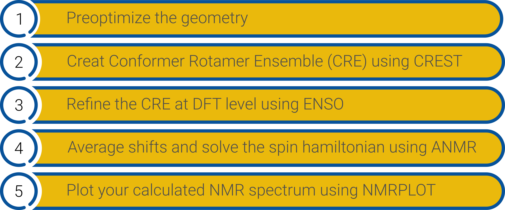
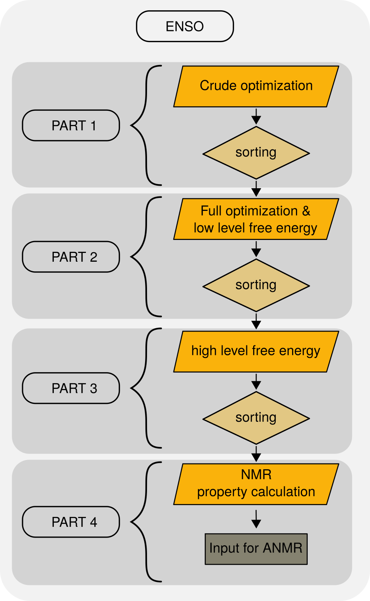

.. _enso:

--------------------
Introduction to ENSO
--------------------

.. contents::

What is *ENSO* ?
================

`enso` is a utility program to create and refine Conformer, Rotamer-Ensembles and 
finally prepare all files necessary to generate NMR spectra using the `anmr` program. 
`enso` and additional necessary resources can be found at 
`Github ENSO <https://github.com/grimme-lab/enso/releases/latest>`_ and 
`Github Cefine <https://github.com/grimme-lab/cefine/releases/latest>`_.  

The Workflow to get the final spectrum is detailed in the following graphic.

	NMR spectrum calculation workflow.

Short summary
=============

The `enso` program is designed to rerank the Conformer Rotamer Ensemble (CRE) 
generated by `CREST` (Conformer Rotamer Ensemble Search Tool) at DFT level and 
perform subsequent NMR-property calculations. `enso` interfaces to different QM-CODES 
(`TURBOMOLE`, `ORCA`, `xtb`) and processes the data. 
The *ENSO* is subdivided into four parts. 

   *ENSO* flowchart.

In *part1* crude optimizations are performed at DFT level. Because of crude thresholds
only a very small number of optimization cycles are perfomed at DFT level, 
and the upside is that bondlength are more or less correct. 
All geometries with a corresponding DFT energy below an energy thresold (*thr-part1*) 
are considered for the full optimization in *part2*.

In *part2* the structures are fully optimized at DFT level. On these optimized 
geometries solvation contributions and thermostatistical contributions to free energy
are calculated. The free energy is obtained as the sum of the 'low-level'
DFT energy :math:`E`, :math:`G_{RRHO}` (thermostatistical contribution to free energy) and 
:math:`δG_{solv}` (optional solvation contribution to free energy). Using a second 
threshold (this time a free energy based threshold) only conformers with a free energy 
below the threshold are considered for the final free energy evaluation in *part3*. 

In *part3* the 'high-level' free energy calculations are performed by calculating 
high level DFT single-point energies and recalculating the free energy. At this stage 
Boltzmann weights for the remaining conformers are calculated. All conformers with a 
Boltzmann contribution below 1% are neglected and the Bolzmann weights are recalculated. 
The Boltzmann weights are summed up to 98% and all conformers within these 98% are 
considered for the NMR property calculations.

In *part4* the couplings and shieldings calculations are performed. Additionally 
all information which is required by `anmr` is written by the `enso`. 

After refining the *CREST*-ensemble at DFT level and performing the NMR property 
calculations, `anmr` correctly averages the shifts and solves the spin hamiltonian 
for the final spectrum generation.
Then `anmr` generates a file 'anmr.dat' which can be plotted to visualize the final spectrum. 

Getting started
===============

To perform an *ENSO* calculation first run:

.. code:: sh

   ./enso.py [-options]

This generates a 'flags.dat' configuration file which stores most information 
relevant to *ENSO*.

.. code:: sh
    
    vim flags.dat # adjust and save the settings in the configuration file to your needs.
 
After adjusting the settings in the 'flags.dat', the input can be automatically 
checked (for typos and setting-combinations) by `enso`. This way settings or 
combinations of settings which are not possible are detected before you actually 
start the program.
The check is performed with:

.. code:: sh
   
   ./enso.py --checkinput
   
When the input is correct the program can be started by typing:

.. code:: sh
   
   export PYTHONUNBUFFERED=1
   ./enso.py --run > enso.out 2> enso.error &

To save the output of `enso` it is necessary to pipe the output into a file.
Using this `export PYTHONUNBUFFERED=1` the progress of the calculations can be 
tracked immediatly and the user doesn't need to wait until the python buffer is 
written to the file. For the program to work correctly the information of the 
absolute paths to the programs employed in ``ENSO`` has to be available in the 
global configuration file *.ensorc*.

