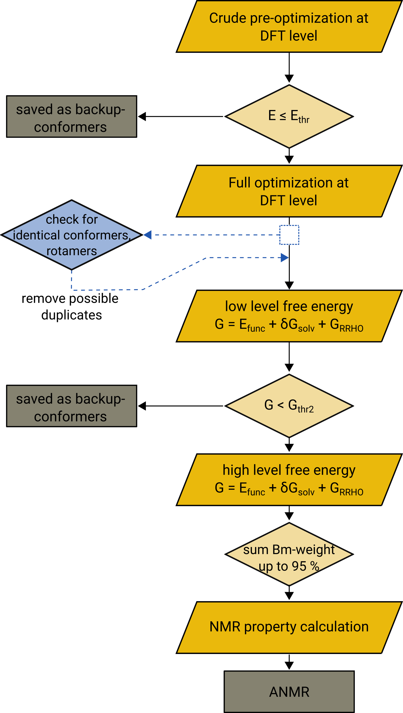

===============
Setting up ENSO
===============

.. contents::

Setup
=====

Make sure that python3 is installed on your system. Place the program *enso.py* 
in your /home/$USER/bin/ folder and add this folder to your PATH. Make the python 
program executable:

.. code:: sh
   
   > chmod u+x /home/$USER/bin/enso.py

To setup ``ENSO`` place your global configuration file *.ensorc* in your /home/$USER folder. 
If you should not have a global configuration file, you can create it by running:

.. code-block:: sh

    > enso.py -write_ensorc 

This creates the file *ensorc_new* which you then have to move to your home directory 
and adjust to your needs:

.. code-block:: sh

    > mv ensorc_new ~/.ensorc

It is mandatory for `enso` to find the correct paths to your programs within your 
global configuration file *.ensorc*:

.. code-block:: text
  
    > cat ~/.ensorc
    .ENSORC
  
    ORCA: /tmp1/orca_4_2_1_linux_x86-64_openmpi216 # here the binary must not be included
    ORCA version: 4.2.1
    GFN-xTB: /home/path-to/bin/xtb              #here the binary has to be included into the path
    CREST: /home/path-to/bin/crest              #here the binary has to be included into the path
    mpshift: /home/path-to/bin/mpshift         #here the binary has to be included into the path
    escf: /home/path-to/bin/escf               #here the binary has to be included into the path
  
    #COSMO-RS
    ctd = BP_TZVP_C30_1601.ctd cdir = "/software/cluster/COSMOthermX16/COSMOtherm/  CTDATA-FILES"   ldir = "/software/cluster/COSMOthermX16/COSMOtherm/CTDATA-FILES"
    cosmothermversion: 16    # 16, 17, 18
  
    $ENDPROGRAMS

    #NMR data
    reference for 1H: TMS                      # ('TMS',) 
    reference for 13C: TMS                     # ('TMS',) 
    reference for 19F: CFCl3                   # ('CFCl3',) 
    reference for 31P: TMP                     # ('TMP', 'PH3') 
    reference for 29Si: TMS                    # ('TMS',) 
    1H active: on                              # ('on', 'off') 
    13C active: off                            # ('on', 'off') 
    19F active: off                            # ('on', 'off') 
    31P active: off                            # ('on', 'off') 
    29Si active: off                           # ('on', 'off') 
    resonance frequency: None                  # MHz number of your experimental spectrometer 
    nconf: all                                 # ('all', 'number e.g. 10') 
    charge: 0                                  # number e.g. 0 
    unpaired: 0                                # number e.g. 0 
    solvent: gas                               # (acetone, acetonitrile, chcl3, ch2cl2, dmso, h2o, methanol, thf, toluene, gas)
    prog: None                                 # ('tm', 'orca') 
    ancopt: on                                 # ('on', 'off') 
    prog_rrho: xtb                             # ('xtb', 'prog', 'off') 
    gfn_version: gfn2                          # ('gfn1', 'gfn2') 
    temperature: 298.15                        # temperature in K e.g. 298.15 
    prog3: prog                                # ('tm', 'orca', 'prog') 
    prog4: prog                                # ('tm', 'orca', 'prog') 
    part1: on                                  # ('on', 'off') 
    part2: on                                  # ('on', 'off') 
    part3: on                                  # ('on', 'off') 
    part4: on                                  # ('on', 'off') 
    boltzmann: off                             # ('on', 'off') 
    backup: off                                # ('on', 'off') 
    func: pbeh-3c                              # ('pbeh-3c', 'b97-3c', 'tpss') 
    func3: pw6b95                              # ('pw6b95', 'wb97x', 'dsd-blyp') 
    basis3: def2-TZVPP                         # (several basis sets are possible)
    funcJ: pbe0                                # ('tpss', 'pbe0') 
    basisJ: def2-TZVP                          # (several basis sets are possible)
    funcS: pbe0                                # ('tpss', 'pbe0', 'dsd-blyp') 
    basisS: def2-TZVP                          # (several basis sets are possible)
    couplings: on                              # ('on', 'off') 
    shieldings: on                             # ('on', 'off') 
    part1_threshold: 4.0                       # number e.g. 4.0 
    part2_threshold: 2.0                       # number e.g. 2.0 
    sm: default                                # ('cosmo', 'dcosmors', 'cpcm', 'smd') 
    smgsolv2: sm                               # ('sm', 'cosmors', 'gbsa_gsolv') 
    sm3: default                               # ('cosmors', 'smd', 'gbsa_gsolv') 
    sm4: default                               # ('cosmo', 'cpcm', 'smd') 
    check: on                                  # ('on', 'off') 
    crestcheck: off                            # ('on', 'off') 
    maxthreads: 1                              # number e.g. 2 
    omp: 1                                     # number e.g. 4 

Requirements
============

``ENSO`` requires:

* Python3

External programs which are required:

* `xtb` program  version 6.2 or above
* `crest` version 2.6.2 or above
* in case of COSMO-RS:

  - `cefine`
  - the TURBOMOLE program package
  - `cosmotherm`

* in case of TURBOMOLE

  - `cefine`
  - the TURBOMOLE program package

* in case of ORCA

  - ORCA4.1 or above

For the final spectrum generation:

* `anmr` version 3.5 or above
* `nmrplot.py`  (needs python3, numpy, matplotlib)
* or any other plotting tool (e.g. GNUPLOT)

Detailed information
====================

   *ENSO* detailed flowchart.

Files written by `enso`:
==========================

========================  ===========
Files/Folders             Information
========================  ===========
flags.dat                 | The ENSO-run is started from the settings written in this file 
enso.json                 | All information on the conformers is stored in this file 
                          | (e.g. energy, boltzmann weight ...)
populated-conf-part3.xyz  | File containing the geometries of all conformers 
                          | remaining in the refined ensemble with energy and 
                          | free energy information (thif file was previously called:
                          | 'trj-part3.xyz'
conformer_rotamer_check/  | Folder in which the optimized ensemble (part2) is checked for 
                          | rotamers or identical conformers
anmr_enso                 | File needed by ANMR, containing the Boltzmann weight, free energy
                          | contribution, conformer-folder information
.anmrrc                   | File needed by ANMR, constaining the reference shieldings, which 
                          | nuclei are active, which program package was used for the 
                          | NMR property calculations
.ensorc                   | Global configuration file where the user can adjust
                          | default settings for all ENSO-runs.
                          | and all absolute PATHS to the external programs are stored.
CONF#                     | folder for conformer # where all calculations concerning
                          | this conformer are performed
========================  ===========

.. _flags_settings:

Settings in .ensorc and flags.dat
=================================

=================== ================
flags               explaination
=================== ================
nconf               | number of conformers considered in this ENSO-run, 
                    | taken from the *crest_conformers.xyz* file 
                    | [e.g. 10 or all]
charge              | molecular charge 
unpaired            | number of unpaired electrons
solvent             | solvents that are available: gas (if no solvent is required),
                    | [options: gas, acetone, acetonitrile, chcl3, ch2cl2, dmso, h2o, 
                    | methanol, thf, toluene]
prog                | program- used for calculating part 1 and part 2
                    | [options: tm or orca]
ancopt              | if choosen the ANCOPT (Aproximate normal coordinates optimizer) 
                    | implemented in ``xtb`` is employed as driver for *prog* 
                    | (ORCA, TURBOMOLE) [options: on, off]
prog_rrho           | chooses which program is employed for the hessian calculation: either 
                    | GFNn-xTB or the program package choosen by *prog*, our recommendation is 
                    | to use GFNn-xTB! In the case that the sorting of the conformers
                    | is supposed to be only based on the energy and not enthalpy the
                    | thermostatistical correction calculations can be turned off and the
                    | sorting is performed only based on energy (then use prog_rrho: off).
                    | [options: prog, xtb, off]
gfn_version         | If prog_rrho is set to ``xtb`` then you can choose which GFNn-xTB version
                    | should be used. We recommend using *GFN2-xTB* with the keyword *gfn2*
                    | [options: gfn1, gfn2]
prog3               | The program package for calculating high-level free energies can 
                    | be choosen independent of `prog` [options: prog, tm, orca]
prog4               | The program package for calculating NMR properties can be choosen 
                    | independent of the program package chosen for part 1-3. 
                    | [options: prog, tm, orca]
part1               | Turn the crude optimization (Part1) on or off, [options: on, off]
part2               | Turn the full optimization and low level free energy calculation 
                    | (Part2) on or off [options: on, off]
part3               | Turn the high level free energy calculation on or off (Part3) 
                    | [options: on, off]
part4               | Turn the NMR property calculation (Part4) on or off, [options: on, off]
boltzmann           | Option to recalculate the boltzmann weight from the data written in 
                    | *enso.json*. [options: on, off]
backup              | Option to include conformers which were sorted out either in Part1 or
                    | Part2, because they were above the sorting threshold. This option can be
                    | used after a previous enso-calculation. It can be the case, that conformers 
                    | are missing in the final spectrum (because they are high lying in energy at
                    | GFNn-xTB level). The 'backup' flag  provides an automated way to include 
                    | conformers which were just above the respective sorting threshold (in part1 
                    | or part2) within the (free) energy window of threshold + 2 kcal/mol. If turned
                    | on in the second run, these higher lying conformers will be optimized and  
                    | analyzed in the sorting procedure. [options: on, off]
                    | an example is given in :ref:`example <backup>` 
func                | density functional employed in *Part1* and *Part2* (crude and full optimization),
                    | [options: pbeh-3c, b97-3c, tpss (*tpss* is only the keyword, used is the 
                    | functional/basis/dispersion correction combination: TPSS-D3/def2-TZVP)]
func3               | density functional for calculating the high level single-point for the high 
                    | level free energy evaluation in *Part3*, [options: pw6b95, wb97x, dsd-blyp] 
                    | (Not all functionals are available in each program package (ORCA, TURBOMOLE)!
basis3              | Basis set used for calculating the high level single-point in Part3. 
                    | (Be sure that the basis set exists (typos can lead to crashing single-point 
                    | calculations). There are more possibilities than mentioned in options, but they
                    | can not be checked!
                    | [options: SVP, SV(P), TZVP, TZVPP, QZVP, QZVPP, def2-SV(P), def2-SVP, def2-TZVP, 
                    | def2-TZVPP, def-SVP, def-SV(P), def2-QZVP, DZ, QZV, cc-pVDZ, cc-pVTZ, cc-pVQZ,
                    | cc-pV5Z, aug-cc-pVDZ, aug-cc-pVTZ, aug-cc-pVQZ, aug-cc-pV5Z, def2-QZVPP]
couplings           | Option to calculate coupling constants *J* in Part4 or not (e.g. if you  
                    | would want to calculate only shieldings in Part4)
                    | [options: on, off]
funcJ               | density functional used to calculate the couplings in the NMR property  
                    | calculation = *Part4*  [options: pbe0, tpss]
basisJ              | basis set employed in the calculations of the couplings *J* in *Part4*. 
                    | [options: e.g. def2-TZVP]
shieldings          | Options to calculate shielding constants *S* in *Part4* or not (e.g. if 
                    | you would want to calculate only couplings)
                    | [options: on, off]
funcS               | density functional used to calculate the shieldings in the NMR property 
                    | calculation = *Part4* [options: pbe0, tpss]
basisS              | basis set employed in the calculations of the shieldings *S* in *Part4*.
                    | [options: e.g. def2-TZVP]
part1_threshold     | All conformers below this threshold (in kcal/mol) are considered for
                    | the full optimization in Part2.
                    | Conformers within threshold > Econf < (threshold + 2 kcal/mol)  
                    | are noted as backup conformers (which can be recalculated if the refined  
                    | ensemble is missing some conformers). In *Part1* all conformers above  
                    | (threshold + 2 kcal/mol) are dismissed. Our recommendation is to 
                    | set this threshold to 4.0 kcal/mol. 
part2_threshold     | All conformers below this threshold (in kcal/mol) are considered for the  
                    | high level free energy calculation in *Part3*. Conformers within 
                    | threshold > Econf < (threshold + 2 kcal/mol) are noted as backup conformers.
                    | In *Part2* all conformers above (threshold + 2 kcal/mol) are dismissed. Our  
                    | recommendation is to set this threshold to 2.0 kcal/mol.
sm                  | Solvation model employed for the optimization in *Part1* und *Part2*. 
                    | Not all solvation models are available in each program package 
                    | (ORCA,TURBOMOLE). In order to use the solvation model a *solvent* has 
                    | to be specified! [options: cosmo, dcosmors, cpcm, smd]
smgsolv2            | In *Part2* first the full optimization is performed using the solvent 
                    | model specified in *sm*. Then the low level free energy calculation is
                    | performed (still *Part2*) and to calculate the solvation contribution 
                    | to free energy (:math:`G_{solv}`) another solvation model can be choosen. 
                    | This makes sence, if this solvation model is then used in the high level
                    | free energy calculation *Part3* too. [options: sm, cosmors]
sm3                 | solvation model employed in the high level free energy calculation *Part3*. 
                    | we recommend to use the same solvation model as in *smgsolv2*. 
                    | [options: cosmors, dcosmors, smd].
sm4                 | solvation model employed in the NMR property calculation in *Part4*. 
                    | [options: cosmo, cpcm, smd, dcosmors]
check               | Option to terminate the ENSO-run if too many calculations/preparation 
                    | steps fail. [options: on, off]
crestcheck          | The conformers  could become identical or rotamers of each other  
                    | during the full DFT optimization (*Part2*). Therefore we use ``CREST`` 
                    | to identify identical conformers or rotamers. The *crestcheck* option  
                    | (on) can automatically remove identical conformers and rotamers. 
                    | If it is set to off, the check is still run but the user is only informed
                    | and has to remove the conformers manually after inspection.
                    | Our recommendation is to sort out conformers manually (option: off)
                    | since the sorting alogrithm is threshold based. [options: on, off]
maxthreads          | Number of threads the ENSO program can use. 
                    | (maxthreads * omp = number of cores)
                    | e.g. the maximal number of calculations that can run in parallel.
                    | Make sure that the number of cores does not exceed your machine
                    | specification.
omp                 | Number of cores each thread (set with *maxthreads*)
                    | has available. e.g. maxthreads = 2 and omp = 3 would use two threads 
                    | using each three cores, the total number of cores in use would be six. 
reference for 1H    | Reference for calculating the shifts of your 1H spectrum.
                    | This is written to the file .anmrrc. [options: TMS]
reference for 13C   | Reference for calculating the 13C shifts of your spectrum.
                    | This information is written to the file .anmrrc. [options: TMS]
1H active           | Calculate NMR properties for the 1H nuclei. [options: on, off]
13C active          | Calculate NMR properties for the 13C nuclei [options: on, off]
19F active          | Calculate NMR properties for the 19F nuclei [options: on, off]
31P active          | Calculate NMR properties for the 31P nuclei [options: on, off]
29Si active         | Calculate NMR properties for the 29Si nuclei [options: on, off]
resonance frequency | Frequency of your simulated NMR spectrometer
                    | (the spectrometer you are comparing against. 
temperature         | Temperature in Kelvin for thermostatistical and Boltzmann weight
                    | evaluation.
=================== ================

NMR-property calculations
=========================

Information about the basis sets employed (default) for NMR property calculations:

* def2-TZVP (TURBOMOLE and ORCA)

For user convenience shielding constants of the reference molecules (TMS (Tetramethylsilane), CFCl3, PH3, TMP 
(Trimethylphosphine oxide)) were precalculated and stored within the `enso` program. 
The reference shielding values are used in the `anmr`
program to calculate the shifts and the reference values are written to the file *.anmrrc*.

To be consistent with your calculation, the reference shielding values were calculated on the
reference molecules with many possible geometry-optimization-settings eg. {TURBOMOLE/ORCA, PBEh-3c /
TPSS-D3/def2-TZVP / B97-3c, (gas phase or solvent)}. The shieldings were then calculated either with
TPSS or PBE0 and depending on ORCA (gas or SMD and def2-TZVP basis set) or TURBOMOLE (gas or
DCOSMO-RS with the def2-TZVP basis set). At the end of part4 the file *.anmrrc* is written into the
calculation folder and stores the reference shielding values of your settings for the subsequent
*ANMR* calculation.

.. note:: The `enso` program only writes the reference shielding values to the file '.anmrrc' but 
      does not do anything with it. Hence, no results of `enso` are influenced 
      by a non-matching reference value. If you want to change the reference shielding values, 
      you can simply modify the file '.anmrrc' manually before calling the `anmr` program. 

Procedure for generating the refrence shielding constants:
Geometry optimization with of the reference molecule with PBEh-3c/B97-3c/TPSS-D3/def2-TZVP + implicit solvation model 
(either SMD or DCOSMO-RS). NMR shielding constant calculation with the respective functional and the def2-TZVP basis set 
(again with implicit solvation model).

Tetramethylsilane:

.. code:: bash

    > cat coord
    $coord
     2.05833045453195     -2.05833045453195      2.05833045453195  c
     3.27901073396930     -3.27901073396930      0.93023223253204  h
     3.27901073396930     -0.93023223253204      3.27901073396930  h
     0.93023223253204     -3.27901073396930      3.27901073396930  h
    -0.00000000000000      0.00000000000000      0.00000000000000  si 
    -2.05833045453195      2.05833045453195      2.05833045453195  c
    -3.27901073396930      3.27901073396930      0.93023223253204  h
    -0.93023223253204      3.27901073396930      3.27901073396930  h
    -3.27901073396930      0.93023223253204      3.27901073396930  h
     2.05833045453195      2.05833045453195     -2.05833045453195  c
     0.93023223253204      3.27901073396930     -3.27901073396930  h
     3.27901073396930      0.93023223253204     -3.27901073396930  h
     3.27901073396930      3.27901073396930     -0.93023223253204  h
    -2.05833045453195     -2.05833045453195     -2.05833045453195  c
    -3.27901073396930     -3.27901073396930     -0.93023223253204  h
    -3.27901073396930     -0.93023223253204     -3.27901073396930  h
    -0.93023223253204     -3.27901073396930     -3.27901073396930  h
    $end

PH3:

.. code:: bash

    > cat coord
    $coord
     0.00000000000000      0.00000000000000      1.08780842165939  p
     1.12108786201329      1.94178113675579     -0.36261095596909  h
     1.12108786201329     -1.94178113675579     -0.36261095596909  h
    -2.24217572402658      0.00000000000000     -0.36261095596909  h
    $end

TMP = Trimethylphosphine oxide:

.. code:: bash

    > cat coord
    $coord
     2.10707881159693     -2.37905657209703     -0.95048934768032       c
    -0.00002761513490     -0.00001720463363      0.42981024146152       p
     0.00022116674358     -0.00003978704989      3.20441724940919       o
    -3.11402725504898     -0.63518697865997     -0.95026063129186       c
    -4.41578089847492      0.80223353974588     -0.26675109605744       h
    -3.74806612133726     -2.46831651344230     -0.26795802048584       h
    -3.07053848205114     -0.62555829073221     -3.00039235368914       h
     1.00685206250598      3.01430306976026     -0.95039040993479       c
     2.90134987179607      3.42432987586201     -0.26440712265899       h
    -0.26551500181645      4.47957166601373     -0.27057128439357       h
     0.99633316768277      2.97084963842055     -3.00047015163533       h
     4.01209383139734     -2.01044112204817     -0.27010522766248       h
     1.51433033394466     -4.22477273833643     -0.26505344320048       h
     2.07522150306901     -2.34774660838157     -3.00060121737073       h
    $end

CFCl3:

.. code:: bash

    > cat coord
    $coord
     0.00000038126763   -0.00000000884504    0.13419916242803      c 
     0.00000870296281    0.00000001369727    2.66116007348966      f 
     3.17274491422955   -0.00000000906271   -0.93176725824334      cl
    -1.58637567202181   -2.74767202581384   -0.93179226251812      cl
    -1.58637568491745    2.74767203002431   -0.93179224376158      cl
    $end