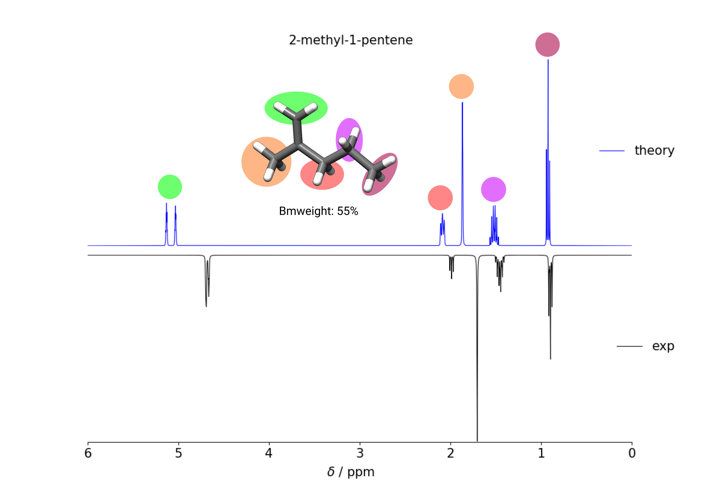

 
=====
Usage
=====

cis-4-hexen-1-ol
================

Example of calculating the 1H-NMR spectrum of cis-4-hexen-1-ol in CHCl3 at 400 MHz.

.. code:: bash

    > cat coord
    $coord
           -4.5787202885           -0.8553740252            1.3686940377   C 
           -3.4023148672           -0.1930996279           -1.1104654057   C 
           -1.3502307141            1.1896725766           -1.5219716436   C 
            0.3006494795            2.4620980359            0.3955352829   C 
            0.2362191223            4.5001215909            0.0503890823   H 
            3.0642161355            1.6025835718            0.2096773622   C 
            3.4178595291           -1.1774351958            0.9222138508   C 
            2.5415191057           -2.8708599609           -0.9480135970   O 
            0.8099880164           -2.4078504756           -1.3346662145   H 
            5.4277591776           -1.6058314070            1.1410607567   H 
            2.4658368243           -1.5681688895            2.7281288136   H 
            4.2123967195            2.7454371194            1.4856132673   H 
            3.7614131313            1.8836292778           -1.7127605110   H 
           -0.3830548458            2.1258051759            2.3091187341   H 
           -0.7518930894            1.4941446048           -3.4579714157   H 
           -4.3910561682           -0.9675515200           -2.7291675973   H 
           -3.5318795176           -0.1003881407            2.9630921609   H 
           -6.5027613245           -0.1227486813            1.4413316443   H 
           -4.6902514935           -2.9039535570            1.5605291206   H 
  $end

   
   Input structure.

Start with your (at best already optimized) input structure and create the conformers and rotamers for the ``ENSO`` and ``ANMR`` calculation.

.. code:: bash

    > crest coord -gfn2 -g chcl3 -T 4 -nmr > crest.out

In our case ``CREST`` found 51 conformers within an energy window of 6 kcal/mol. We then create a new folder for the ``ENSO`` reranking and copy the necessary files:

.. code-block:: sh

    mkdir enso
    cp crest_conformers.xyz coord anmr_nucinfo anmr_rotamer enso/
    cd enso/

``ENSO`` requires only the file crest_conformers.xyz, but ``ANMR`` needs the last three files.
In the new folder we create the file flags.dat and adapt it to our choosing. Here we want to calculate everything with TURBOMOLE using PBEh-3c and DCOSMO-RS for geometry optimization:

.. code-block:: bash

    enso.py --solvent chcl3 --program tm --programpart4 tm --gfnversion gfn2 
        --ancoptoptimization on --functional pbeh-3c --solventmodel dcosmors

.. tip:: You don't need to give all information using the commandline input and can simply run enso.py without any arguments. This will create the file *flags.dat*      and you can change all information there. But using the commandline input reassures that you don't have any typos.

.. code-block:: text

    > cat flag.dat
    
    FLAGS
    nconf: all                                 # all or integer between 0 and total number of conformers
    charge: 0                                  # integer
    unpaired: 0                                # integer
    solvent: chcl3                             # acetone, chcl3, ch2cl2, dmso, h2o, methanol, thf, toluene, gas 
    prog: tm                                   # tm, orca
    ancopt: on                                 # on, off
    prog_rrho: xtb                             # xtb, prog
    gfn_version: gfn2                          # gfn1, gfn2
    temperature: 298.15                        # in Kelvin
    prog3: tm                                  # tm, orca, prog
    prog4: tm                                  # prog, tm, orca
    part1: on                                  # on, off
    part2: on                                  # on, off
    part3: on                                  # on, off
    part4: on                                  # on, off
    boltzmann: off                             # on, off
    backup: off                                # on, off
    func: pbeh-3c                              # pbeh-3c, b97-3c, tpss 
    func3: pw6b95                              # pw6b95, wb97x, dsd-blyp 
    basis3: def2-TZVPP                         #  
    couplings: on                              # on, off
    funcJ: pbe0                                # tpss, pbe0 
    basisJ: default                            #  
    shieldings: on                             # on, off
    funcS: pbe0                                # tpss, pbe0 
    basisS: default                            # 
    part1_threshold: 4.0                       # integer or real number
    part2_threshold: 2.0                       # integer or real number
    sm: dcosmors                               # cosmo, dcosmors, cpcm, smd
    smgsolv2: sm                               # sm, cosmors
    sm3: dcosmors                              # dcosmors, cosmors, smd
    sm4: cosmo                                 # cosmo, cpcm, smd
    check: on                                  # on, off
    crestcheck: off                            # on, off
    maxthreads: 1                              # integer larger than 0
    omp: 4                                     # integer larger than 0
    reference for 1H: TMS                      # TMS, DSS
    reference for 13C: TMS                     # TMS, DSS
    1H active: on                              # on, off
    13C active: off                            # on, off
    19F active: off                            # on, off
    31P active: off                            # on, off
    resonance frequency: 400                   # integer
    end

Information on each setting can be found in :ref:`flags_settings`. Once you have adapted your *flags.dat* file we can run an input check, testing if the information in flags.dat is correct (no typos and settings combinations are ok {eg. TURBOMOLE doesn't work with the solvent model SMD}). To do so run:

.. code-block:: text

    > enso.py --checkinput

         __________________________________________________
        |                                                  |
        |                                                  |
        |                       ENSO -                     |
        |         energetic sorting of CREST CRE           |
        |          for automated NMR calculations          |
        |             University of Bonn, MCTC             |
        |                    July 2018                     |
        |                   version 1.26                   |
        |  F. Bohle, K. Schmitz, J. Pisarek and S. Grimme  |
        |                                                  |
        |__________________________________________________|

    .ensorc is taken from: /home/bohle/.ensorc
    Reading absolute paths of programs employed in ENSO.

    The following pathways were read in:
        ORCA:    /tmp1/orca_4_1_0_linux_x86-64_openmpi215
        GFN-xTB: /home/abt-grimme/AK-bin/xtb
        CREST:   /home/bohle/bin/crest
        mpshift: /home/bohle/bin/xmpshift
        escf:    /home/bohle/bin/xescf
        Set up of COSMO-RS:
            ctd = BP_TZVP_C30_1601.ctd
            cdir = "/software/cluster/COSMOthermX16/COSMOtherm/CTDATA-FILES"
            ldir = "/software/cluster/COSMOthermX16/COSMOtherm/CTDATA-FILES"
        Using /software/cluster/COSMOthermX16/COSMOtherm/DATABASE-COSMO/BP-TZVP-COSMO
        as path to the COSMO-RS DATABASE.

    Reading user set defaults.
    Using conformers from file crest_conformers.xyz.
    Using cefine from /home/bohle/bin/cefine
    PARNODES for TM or COSMO-RS calculation was set to 4

    -----------------------------------------------------------
     PARAMETERS
    -----------------------------------------------------------

    number of atoms in system:                                     19
    number of conformers:                                          51
    charge:                                                        0
    unpaired:                                                      0
    solvent:                                                       chcl3
    program for part1 and part2:                                   tm
    program for part 3:                                            tm
    program for part 4:                                            tm
    using ANCOPT implemented in GFN-xTB for the optimization:      on
    program for RRHO in part 2 and part 3:                         xtb
    temperature:                                                   298.15
    GFN-xTB version for RRHO in part 2 and part 3:                 gfn2
    part 1:                                                        on
    part 2:                                                        on
    part 3:                                                        on
    part 4:                                                        on
    only boltzmann population:                                     off
    calculate backup conformers:                                   off
    functional for part 1 and 2:                                   pbeh-3c
    functional for part 3:                                         pw6b95
    basis set for part 3:                                          def2-TZVPP
    calculate couplings:                                           on
    functional for coupling calculation:                           pbe0
    basis set for coupling calculation:                            def2-TZVP
    calculate shieldings:                                          on
    functional for shielding calculation:                          pbe0
    basis set for shielding calculation:                           def2-TZVP
    threshold for part 1:                                          4.0 kcal/mol
    threshold for part 2:                                          2.0 kcal/mol
    solvent model for part 1 and part 2:                           dcosmors
    solvent model for Gsolv contribution of part 2:                sm
    solvent model for part 3:                                      dcosmors
    solvent model for part 4:                                      cosmo
    cautious checking for error and failed calculations:           on
    checking the DFT-ensemble using CREST:                         off
    maxthreads:                                                    1
    omp:                                                           4
    calculating spectra for:                                       1H
    reference for 1H:                                              TMS
    reference for 13C:                                             TMS
    reference for 19F:                                             CFCl3
    reference for 31P:                                             TMP
    resonance frequency:                                           400

    END of parameters
    Input check is finished. The ENSO program can be executed with the flag -run.

Please read possible errors at the beginning of the output carefully, they will hint if your external programs are set up correctly. If you run the ``ENSO`` calculation on a cluster, make sure that all programs are setup correctly in your jobscript.

Before starting the ``ENSO`` calculation, we have to set the number of threads (=*maxthreads*) (individual calculations e.g. single-points) and number of cores each thread should have (=*omp*). The total number of cores (*maxthreads* * *omp*) available on your computer is not to be exceeded! These settings can be written to the global configuration file (if you calculate always on the same machines) or can be adapted for the individual calculation in the local configuration file *flags.dat*.

Now enso can be run with:

.. code:: sh

    > enso.py -run > enso.out 2> error.enso &

In the following, only parts of the output are shown to highlight important information. During this run in *part1* (crude optimization) 49 conformers are within an energy threshold of 4 kcal/mol. These conformers are considered for the full optimization in part2. The two remaining conformers are between 4 and 6 kcal/mol and are considered as 'backup-confomers'. Information of backup conformers is stored in the file enso.json. Since the potential hypersurface between GFNn-xTB and DFT needs not to be parallel, in some cases conformers can be high lying at GFNn-xTB level and low lying at DFT level. To have an automated way of including conformers which would otherwise be disgarded, the 'backup' function is introduced and can be activated (after the first enso-run, if it is apparent that dominant conformers are missing) in the local configuration file *flags.dat*.

In *part2* first the full DFT optimization is performed and thermostatistical and solvation contributions are calculated to obtain low-level free energies. All conformers below a free energy threshold of 2 kcal/mol are considered further. In this run 35 conformers are considered for part3 and 14 conformers are marked as backup conformers of *part2*. After the full optimization at DFT level it is possible that some conformers could have become rotamers or identical conformers. This would influence the Boltzmann weights and increase computational cost unnecessary. To identify them the ``CREST`` program is called:

.. code-block:: text

    Checking if conformers became rotamers of each other during the DFT-optimization.
    The check is performed in the directory conformer_rotamer_check.
    Calling CREST to identify rotamers.

    WARNING: The following conformers are identified as rotamers or identical.
    WARNING: They are NOT sorted out since crestcheck is switched off.
    CONFA  E(A):       G(A):<--> CONFB  E(B):       G(B):
    CONF6  -310.39382  0.43 <--> CONF16 -310.39386  0.34
    CONF20 -310.39317  0.50 <--> CONF17 -310.39321  0.96
    CONF39 -310.39260  1.08 <--> CONF38 -310.39269  0.96
    CONF46 -310.39195  1.70 <--> CONF13 -310.39196  2.03

Since the crestcheck flag is switched off, the conformers are not automatically sorted out and the user has to visually inspect the molecules and sort the conformers as described in :ref:`ensosortout`.

In *part3* high level DFT single-points are calculated on the 35 conformers passed from *part2*. The boltzmann weights are calculated and 24 conformers are considered for the NMR property calculations in *part4*. The file 'trj-part3.xyz' is written at the end of *part3* and contains all populated conformers. The file 'anmr_enso' is written which is read from ``ANMR`` and informs it on which conformers are populated (Boltzmann weights). 

In *part4* the couplings and shielding calculations were performed. Finally the file .anmrrc file is written.

At the very end ENSO checks if possible rotamers of each other are in the populated ensemble and notifies the user:

.. code:: text
    
    writing .anmrrc
    Results are written to enso.json.
    ***---------------------------------------------------------***
    Printing most relevant errors again, just for user convenience:
    Possible rotamers of each other still in final ensemble: CONF39 <--> CONF38. Please check by hand!
    Possible rotamers of each other still in final ensemble: CONF20 <--> CONF17. Please check by hand!
    Possible rotamers of each other still in final ensemble: CONF6  <--> CONF16. Please check by hand!
    ***---------------------------------------------------------***

     END of part4.

    -----------------------------------------------------------

    ENSO all done!

After inspecting the conformers CONF39 is removed from the ensemble (details on how to do that are shown in :ref:`ensosortout`), because I considered it to be identical to CONF38. After removing the identical conformer we can restart enso.

.. code:: sh

    > enso.py -run > enso.out 2> error.enso &

This time enso will read all necessary information from the file enso.json and operate with this data. At the end of part3 the Boltzmann weight is recalculated and two conformers are now additionally populated. For them couplings and shieldings are calculated in *part4*. All files for ``ANMR`` are updated.

Now all information is present and ``ANMR`` can be called to calculate the full NMR spectrum:

.. code:: sh

    > anmr > anmr.out 2> error.anmr &

.. code-block:: none

           +--------------------------------------+
           |              A N M R                 |
           |             S. Grimme                |
           |      Universitaet Bonn, MCTC         |
           |             1989-2019                |
           |            version 3.5               |
           |     Sat Feb  9 06:41:57 CET 2019     |
           +--------------------------------------+
           Based on a TurboPascal program written  
           in 1989 which was translated to F90 in  
           2005 and re-activated in 2017.          
           Please cite work employing this code as:
           ANMR Ver. 3.5: An automatic, QC based
           coupled NMR spectra simulation program.
           S. Grimme, Universitaet Bonn, 2019
           S. Grimme, C. Bannwarth, S. Dohm, A. Hansen
           J. Pisarek, P. Pracht, J. Seibert, F. Neese
           Angew. Chem. Int. Ed. 2017, 56, 14763-14769.
           DOI:10.1002/anie.201708266               
     
     
     =============================
        # OMP threads =           1
     =============================
     reading <.anmrrc> for standard data
     Read TM from anmrrc
               1   31.7860000000000       0.000000000000000E+000           1
               6   189.674000000000       0.000000000000000E+000           0
               9   182.570000000000       0.000000000000000E+000           0
              15   291.900000000000       0.000000000000000E+000           0
    1H resonance frequency (-mf <real>)    :  400.00
    line width             (-lw <real>)    :    1.00
    number of all conformers               :25
    remove J couplings to OH groups        : T
    maximum spin system size in a fragment :14
    fragmentation type (0=none,1=at,2=mol) : 2
    chemical shift scalings a,b            :    1.00    0.00
    spin-spin coupling scal factor         :    1.07
    plot offset                            :    0.00
    Active nuclei                          :H 
    ...
    SKIPPING A LOT OF OUTPUT
    ...
                === FRAGMENTED SYSTEM ===
     ====================================================
          solving (J/sigma) averaged spin Hamiltonian
     ====================================================
              spinsystem            1  with            9  spins
              1024 product functions    12 Mt blocks, largest is    210
      1(   1)  2(   9)  3(  37)  4(  93)  5( 162)  6( 210)  7( 210)  8( 162)  9(  93) 10(  37) 11(   9) 12(   1) 
    first maxtrix multiply,  sparsity in %    99.536 ...
    second maxtrix multiply, sparsity in %    94.781 ...
               512 product functions    10 Mt blocks, largest is    126
      1(   1)  2(   9)  3(  36)  4(  84)  5( 126)  6( 126)  7(  84)  8(  36)  9(   9) 10(   1) 
    first maxtrix multiply,  sparsity in %    99.121 ...
    second maxtrix multiply, sparsity in %    91.919 ...
     done.
           12436  non-zero transitions.
     spectrum on <anmr.dat>
     Range (delta in ppm)   0.437872924804687        7.03675048828125     
     Range (delta in Hz)     175.149169921875        2814.70019531250     
     Min/max Int.      )    4.171584807901128E-003
     computing spectrum ...
     done.
     writing output file ...
     done.
     All done.

After ``ANMR`` finished computing, the file anmr.dat is written and it contains the spectrum (intensity vs shift) the user can plot:

.. code:: sh
    
    > nmrplot.py -i anmr.dat exp.dat -start 0 -end 6.5 -o 1Hspectrum -orientation 1 -1

   
   1H NMR spectrum of *cis*-4-hexen-1-ol in chloroform at 400 MHz, comparing calculated and experimental spectrum. Exp taken from [SDBSWeb : https://sdbs.db.aist.go.jp (National Institute of Advanced Industrial Science and Technology,16-10-2019) (SDBSNo. 11748)].

2-methyl-1-pentene
==================

Example of calculating the 1H-NMR spectrum of 2-methyl-1-pentene in CHCl3 at 400 MHz.

.. code:: sh
    
    > cat coord
    $coord
               -5.1134989926            0.0445408597            0.0007215195   C 
               -2.3988260553            0.1202192416            0.9598504570   C 
               -2.0426150350            1.9467776447            1.8509773297   H 
               -0.4955528936           -0.3025973506           -1.1852527430   C 
                2.1853738985           -0.2583887206           -0.2367582425   C 
                3.4286190716           -2.3618737092            0.3005853656   C 
                2.5901373582           -4.2004809628            0.0485727882   H 
                5.3374488734           -2.3390838060            1.0097369787   H 
                3.3398174602            2.3079102171            0.0825121447   C 
                5.2234930962            2.1788391495            0.8913733279   H 
                2.1708137054            3.4751040066            1.3098219746   H 
                3.4682822356            3.2543034689           -1.7427970988   H 
               -0.7536049204            1.1708293724           -2.6081830586   H 
               -0.8901990516           -2.1258718566           -2.0673390015   H 
               -2.1284937554           -1.3401645088            2.3937954454   H 
               -6.4334377217            0.3509962700            1.5473865797   H 
               -5.4204111085            1.5054637513           -1.4143993805   H 
               -5.5276306722           -1.7796998127           -0.8540259276   H 
    $end

.. figure:: ../../figures/enso/enso_2-methly1pentene.png
   :scale: 35 %
   :align: center
   :alt: structure
   
   Input structure.

Start with your (at best already optimized) input structure and create the conformers and rotamers for the ``ENSO`` and ``ANMR`` calculation.

.. code:: bash

    > crest coord -gfn2 -g chcl3 -T 4 -nmr > crest.out

In our case ``CREST`` found 6 conformers within an energy window of 6 kcal/mol. We then create a new folder for the ``ENSO`` reranking and copy the necessary files:

.. code-block:: sh

    mkdir enso
    cp crest_conformers.xyz coord anmr_nucinfo anmr_rotamer enso/
    cd enso/

``ENSO`` requires only the file crest_conformers.xyz, but ``ANMR`` needs the last three files.
In the new folder we create the file flags.dat and adapt it to our choosing. Here we want to calculate everything with ORCA using PBEh-3c and SMD for geometry optimization:

.. code-block:: bash

    enso.py --solvent chcl3 --program orca --programpart4 orca --gfnversion gfn2 
        --ancoptoptimization on --functional pbeh-3c --solventmodel smd

.. code-block:: text

    > cat flag.dat
    
    FLAGS
    nconf: all                                 # all or integer between 0 and total number of conformers
    charge: 0                                  # integer
    unpaired: 0                                # integer
    solvent: chcl3                             # acetone, chcl3, ch2cl2, dmso, h2o, methanol, thf, toluene, gas 
    prog: orca                                 # tm, orca
    ancopt: on                                 # on, off
    prog_rrho: xtb                             # xtb, prog
    gfn_version: gfn2                          # gfn1, gfn2
    temperature: 298.15                        # in Kelvin
    prog3: prog                                # tm, orca, prog
    prog4: prog                                # prog, tm, orca
    part1: on                                  # on, off
    part2: on                                  # on, off
    part3: on                                  # on, off
    part4: on                                  # on, off
    boltzmann: off                             # on, off
    backup: off                                # on, off
    func: pbeh-3c                              # pbeh-3c, b97-3c, tpss 
    func3: pw6b95                              # pw6b95, wb97x, dsd-blyp 
    basis3: def2-TZVPP                         #  
    couplings: on                              # on, off
    funcJ: pbe0                                # tpss, pbe0 
    basisJ: default                            #  
    shieldings: on                             # on, off
    funcS: pbe0                                # tpss, pbe0 
    basisS: default                            # 
    part1_threshold: 4.0                       # integer or real number
    part2_threshold: 2.0                       # integer or real number
    sm: smd                                    # cosmo, dcosmors, cpcm, smd
    smgsolv2: sm                               # sm, cosmors
    sm3: smd                                   # dcosmors, cosmors, smd
    sm4: cpcm                                  # cosmo, cpcm, smd
    check: on                                  # on, off
    crestcheck: off                            # on, off
    maxthreads: 3                              # integer larger than 0
    omp: 4                                     # integer larger than 0
    reference for 1H: TMS                      # TMS, DSS
    reference for 13C: TMS                     # TMS, DSS
    1H active: on                              # on, off
    13C active: off                            # on, off
    19F active: off                            # on, off
    31P active: off                            # on, off
    resonance frequency: 400                   # integer
    end

After ``ANMR`` finished computing, the file anmr.dat is written and it contains the spectrum (intensity vs shift) the user can plot:

.. code:: sh
    
    > nmrplot.py -i anmr.dat exp.dat -start 0 -end 6 -o 1Hspectrum -orientation 1 -1

   
   1H NMR spectrum of 2-methly-1-pentene in chloroform at 400 MHz, comparing calculated and experimental spectrum. Exp taken from [SDBSWeb : https://sdbs.db.aist.go.jp (National Institute of Advanced Industrial Science and Technology,16-10-2019) (SDBSNo. 225)].

Manually restarting calculations and modifying enso.json
========================================================

In the event that an optimization failes, ``ENSO`` discardes the geometry and will not try to reoptimize the structure. The user can optimize the geometry manually and add the information on convergence (success) and energy (at the same level as all other calculations) to the file enso.json. When restarting ``ENSO`` the information on the conformers of the previous run is read from the file *enso.json* and the manually corrected conformer is further evaluated within the ongoing enso-run.

Here we show an example on how to manually restart an optimization (part1):

.. code:: text
    
   'In case of ORCA using the ANCOPT optimizer implemented in xtb:'

   write the geometry in form of a coord file and add at the end of the file:
   $external
       orca input file = inp
   $end

   The file 'inp' contains the input for the ORCA program eg.:

   %MaxCore 8000                                          
   ! def2-mSVP pbeh-3c grid4
   !ENGRAD
   !     smallprint printgap noloewdin
   %output
          print[P_BondOrder_M] 1
          print[P_Mayer] 1
          print[P_basis] 2
   end
   %pal
       nprocs 7
   end
   %cpcm
    smd     true
    smdsolvent "chloroform"
   end
   * xyzfile 0 1 inp.xyz

   Then convert the tmole coord file into an xmol file (required by the ORCA input):
   > t2x coord > inp.xyz
   and then run xtb as driver for ORCA:

   > xtb coord --opt crude --orca > opt-part1.out

   after convergence convert the optimized geometry back to the coord file!

If the optimization is converged the information has to be written to the enso.json file (to be on the save side, first make a copy of your enso.json file).
*enso.json* contains data on each conformer in the following form:

.. code:: text

    "plain_uncalculated_CONF": 
    {
        "crude_opt": "not_calculated",
        "energy_crude_opt": null,
        "backup_for_part2": false,
        "consider_for_part2": true,
        "opt": "not_calculated",
        "energy_opt": null,
        "backup_for_part3": false,
        "sp_part2": "not_calculated",
        "energy_sp_part2": null,
        "consider_for_part3": true,
        "sp_part3": "calculated",
        "energy_sp_part3": null,
        "cosmo-rs": "not_calculated",
        "energy_cosmo-rs": null,
        "gbsa_gsolv": "not_calculated",
        "energy_gbsa_gsolv": null,
        "rrho": "calculated",
        "energy_rrho": null,
        "symmetry": "c1",
        "consider_for_part4": true,
        "1H_J": "not_calculated",
        "1H_S": "not_calculated",
        "13C_J": "not_calculated",
        "13C_S": "not_calculated",
        "19F_J": "not_calculated",
        "19F_S": "not_calculated",
        "31P_J": "not_calculated",
        "31P_S": "not_calculated"
        "removed_by_user": false
    },
    "CONF1-example": 
    {
        "crude_opt": "calculated",
        "energy_crude_opt": -1034.78500028827,
        "backup_for_part2": false,
        "consider_for_part2": true,
        "opt": "calculated",
        "energy_opt": -1034.786028019303,
        "backup_for_part3": true,
        "sp_part2": "calculated",
        "energy_sp_part2": -1034.76193327809,
        "consider_for_part3": false,
        "sp_part3": "not_calculated",
        "energy_sp_part3": null,
        "cosmo-rs": "calculated",
        "energy_cosmo-rs": -0.028947468366750467,
        "gbsa_gsolv": "not_calculated",
        "energy_gbsa_gsolv": null,
        "rrho": "calculated",
        "energy_rrho": 0.369622527533,
        "symmetry": "c1",
        "consider_for_part4": false,
        "1H_J": "not_calculated",
        "1H_S": "not_calculated",
        "13C_J": "not_calculated",
        "13C_S": "not_calculated",
        "19F_J": "not_calculated",
        "19F_S": "not_calculated",
        "31P_J": "not_calculated",
        "31P_S": "not_calculated",
        "removed_by_user": false
    },

Now to change the information on the converged crude optimization (for the conformer CONFX), you have to change:

.. code::
    
    crude_opt: calculated
    energy_crude_opt: eg: -1034.780801227157

Using the updated information, restart your enso-run and the program will automatically evaluate how to proceed with the new information(e.g. sort out this conformer or calculate a full optimization...). You can restart your ENSO-run with:

.. code:: sh

   > enso.py -run > enso.out 2> error.enso &

.. note:: This procedure is not limited to optimizations, but every failed 
    calculation can be manually performed. Then the result has to be written to the file *enso.json* in the same manner. Then ``ENSO`` can restart on the introduced information.

.. _ensosortout:

Sorting out rotamers at DFT level detected by CREST
===================================================

In *part2* the conformers are fully optimized at DFT level. It is possible that during optimization conformers can become rotamers or identical. To identify these the ``CREST`` program is called. If rotamers are found, then ``ENSO`` can sort them out if the *crestcheck* flag is set. Or the user is simply informed on the possible existence of these conformers and has to visually inspect the geometries, decide and adjust the necessary information in the file *enso.json* (which we recommend).
Here we show which entries to change in the file *enso.json*:

.. note:: CREST evaluates conformers to be rotamers or identical based on thresholds concerning
          the electronic energy, rotational constant and RMSD on the geometries. Visual inspection of
          possible conformers is encouraged for molecules which show very similar conformers.

To sort out conformers, change the flag *consider_for_part3* to false:

.. code-block:: text

    "CONFX":
    {...
    "consider_for_part2": false,
    "consider_for_part3": false,
    "consider_for_part4": false,
    ...}

    Then set part 1 off within the file 'flags.dat'! 
    Otherwise consider_for_part_2 will be reset to true ...

Or you can simply set:

.. code-block:: text

    "CONFX":
    {...
    "removed_by_user": true,
    ...}

This will sort out the conformer.

