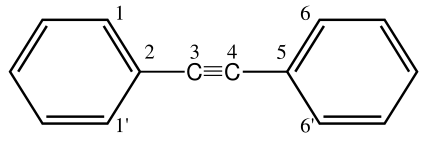

.. _gfnff:

----------------------------
GFN-Force-Field (GFN-FF)
----------------------------

.. contents::

Introducing GFN-FF
========================
``GFN-FF`` is a completely automated partially polarizable generic force-field for the accurate description of 
structures and dynamics of large molecules across the periodic table. This method combines force-field speed 
with almost quantum mechanical accuracy.
The main publication for ``GFN-FF`` can be found at: `Angewandte Chemie <https://onlinelibrary.wiley.com/doi/abs/10.1002/anie.202004239>`_.

.. figure:: ../figures/gfnff.jpg
   :scale: 25 %
   :alt: gfnff
   

Theoretical background
=================================

The latest progress in the field of semi-empirical methods, regarding the evolution of GFN1, GFN2 and GFN0-xTB, inspired the development of a generic force-field. 
The main focus of this GFN force-field (GFN-FF) is directed towards the description of bio-macromolecular systems such as (metallo-) proteins, supramolecular assemblies 
and metal-organic frameworks. 
It is intended for usage as a versatile tool for drug design in life sciences and structure screening in various fields of chemistry.
Therefore, GFN-FF introduces an approximation to the remaining quantum mechanics in GFN0-xTB by replacing the extended Hückel theory with molecular mechanical bond stretch, 
bond angle angle and torsion angle terms for the description of covalent bonds. 
To remain accurate in the description of conjugated systems, GFN-FF retains an iterative Hückel scheme for a selected set of atoms. 
The resulting bond orders obtained by a Hückel calculation have an influence on force constants and energy-relevant parameters of the system.
To yield accurate results the FF parameters are fitted to reproduce B97-3c minimum geometries and frequencies. 
Thereby a strictly global and element-specific parameter strategy is applied and no element pair-specific parameters are employed.
Special attention is paid to the simple application. As input only Cartesian coordinates and elemental composition are required from which fully automatically all potential energy terms are constructed.
The total GFN-FF energy expression is given by

.. math::
   E_{GFN-FF} = E_{cov} + E_{NCI},

where :math:`E_{cov}` refers to the bonded FF energy and :math:`E_{NCI}` describes the intra- and intermolecular noncovalent interactions.
In the covalent part, interactions are described by asymptotically correct (dissociative) bonding, angular and torsional terms. 
Repulsive terms are added for bonded and non-bonded interactions separately. 
Additionally, a three-body correction to the nuclear repulsion is added, that extends beyond the sum of pair-wise interactions.

.. math::
   E_{intra} = E_{bond} + E_{bend} + E_{tors} + E_{rep}^{bond} + E_{abc}^{bond}

In the non-covalent part, electrostatic interactions are described by an electronegativity equilibrium (EEQ) model. 
It is employed to calculate the isotropic electrostatic energy and atomic partial charges. 
Overall GFN-FF uses two sets of EEQ charges. One set depends on the standard geometry, whereas another set of charges is exclusively topology-based, introducing partial polarizability to the FF method.
Dispersion interactions are taken into account by a topology-based version of the D4 scheme, in which the dispersion coefficients are scaled by atomic charges instead of atomic polarizabilities.
For the description of hydrogen and halogen bonds, additional charge-scaled H- and X- bond corrections are applied to yield the right binding motifs.

.. math::
   E_{NCI} = E_{IES} + E_{disp} + E_{HB} + E_{XB} + E_{rep}^{NCI}

GFN-FF reaches quadratic scaling in terms of energy and gradient calculation, whereas all GFN-xTB methods show cubic scaling with respect to the number of atoms.
It is the computationally most efficient member of the GFN family.

How to use it
============================
GFN-FF is implemented in the ``xtb`` program. It extends the portfolio of different GFN parametrizations by a non-electronic variant. GFN-FF is applied with the keyword ``--gfnff`` as shown in the example below.

.. code:: bash

  > xtb --gfnff <geometry> [options]

Thus, the usage is in line with its semiempirical QM siblings and (almost) the same options are available. Only the request for electronic structure properties will be ignored since those are not available at the force-field level of theory. With GFN-FF you can perform single-point calculations, geometry optimizations, frequency calculations and molecular dynamics simulations, just to mention the most prominent run types. A GFN-FF calculation is indicated in the output by:

.. code:: bash

   ------------------------------------------------- 
  |                   G F N - F F                   |
  |          A general generic force-field          |
  |                  Version 1.0.1                  | 
   ------------------------------------------------- 

Additional torsion potential for diphenylacetylene-like systems
----------------------------------------------------------------

An additional torsion potential for rotations around triple-bonded carbons is added to the GFN-FF total energy. The potential is calculated according to 

.. math::
  E_\text{cctors} = -\frac{E_\text{ref}}{2} \cdot \cos (2 \cdot \phi ) + \frac{E_\text{ref}}{2}

using the reference energy :math:`E_\text{ref}` from a DLPNO-CCSD(T)/CBS calculation on diphenylacetylene for a 90° dihedral angle :math:`\phi` compared to 0°. Below, diphenylacetylene is depicted without hydrogen atoms, to explain when the potential is applied. 

The potential is applied under the following conditions: Atoms three and four must be carbons with a triple bond between them (distance smaller than 2.37 Bohr) and have exactly one other bond partner each. Atoms two and five must be carbons. At least one of the atoms one or one prime and six or six prime must be an sp2 hybridized carbon. In the case that there are multiple choices for atoms 1 and 6 the latter is chosen according to the sorting in the input file. The dihedral angle is then calculated between atoms one, two, five and six. 

GFN-FF specific settings
============================

``xtb`` is a semiempirical extended tight-binding program package and its default values are chosen to yield robust and accurate results for all GFN-xTB methods. GFN-FF represents the first non-electronic variant and thus it should come as no surprise, that some of the default values do not work with a generic force-field. Settings that deviate from the defaults are discussed below.

Parallelization
-------------------

The ``xtb`` program uses OMP parallelization. To calculate larger systems an appropriate OMP stack size must be provided. Since the system size may easily exceed 5000 atoms in force-field calculations, a large number should be chosen. Otherwise, you may encounter a segmentation fault. For 5000 atoms you may choose:

.. code:: bash

  > export OMP_STACKSIZE=5G
  
As a rule of thumb, add 1G for every additional 1000 atoms. 
  
MD Simulations
------------------

For molecular dynamics simulations, the default time step of 4 ps is not stable in GFN-FF. Below you can find our recommended settings for a stable MD run.

.. code:: bash

   $md
     step=2.0
     hmass=4.0
     shake=0
   $end

GFN-FF specific input
============================

``xtb`` accepts various input formats. Especially the possibility to directly read ``pdb`` files as input might be something you want to use in combination with GFN-FF. If the pdb file includes charge information, ``xtb`` reads this information, determines the overall charge of the system automatically and applies this charge constraint per residue. There is no need to further specify the total charge of the system. The following output is generated.

.. code:: bash

   charge from pdb residues: <integer>

Use of additional charge information
-------------------------------------

In GFN-FF the computed atomic charges from the EEQ model may be improved by constraints if additional information about the charge distribution in the system is known. There are two further ways to incorporate this information besides using a pdb file. If the system consists of more than one NCI fragment, the charges per fragment can be written by the user into a specific file
(named ``.CHRG``) and will be constrained accordingly in the EEQ model, thus preventing artificial charge transfer between the NCI fragments. If a GFN-xTB calculation is performed in advance, the written file ``charges`` is read by the program and the corresponding QM charges are used to constrain the values on the molecular fragments.

Periodic Boundary Conditions
============================

The GFN-FF can process periodic boundary conditions, allowing the optimization of three-dimensional unit cells. A reparameterized version for molecular crystals can be called with the ``--mcgfnff`` keyword. The adjustments to the electrostatic, intermolecular dispersion, hydrogen bond, and non-covalent repulsion potential often increase the accuracy with respect to the structure and energy. An example calculation is given below for a unit cell containing four benzene molecules.

.. tab-set::
   .. tab-item:: command
  
      .. code:: sh
  
         xtb benzene.coord --gfnff
  
   .. tab-item:: benzene.coord
  
      .. code:: sh
  
         $coord
             7.10986726811546E+00    1.39803317039751E+01    9.79695027924021E+00      C
             7.11375821259805E+00    8.76795203096078E+00    3.36407395831929E+00      C
             8.60482372324771E+00    5.13823133707231E+00    1.25907033747429E+01      C
             9.75112376027930E+00    7.53368379774428E+00    1.25988946977277E+01      C
             5.96704128865761E+00    6.37267695865231E+00    3.35549866706958E+00      C
             9.00267279659253E+00    9.34854414468852E+00    1.58886068020756E+00      C
             6.71563121464733E+00    4.55781661170807E+00    1.56671851026428E+00      C
             2.01592612889045E+00    1.34582777502016E+01    1.56454269009644E+00      C
             1.36276161633625E+01    5.11410651963663E-01    1.59001258500230E+00      C
             2.76479397948607E+00    1.52711868251473E+01    3.35524268822630E+00      C
             1.28790262373728E+01    1.64375153151443E+01    1.25977427929330E+01      C
             1.62071733930167E+00    5.14124693925177E+00    9.79797419461331E+00      C
             1.27150507198922E-01    8.76741986587029E+00    6.22310165885711E+00      C
             2.76687841403031E+00    7.53687678828724E+00    9.78696710435249E+00      C
             1.28772197274344E+01    6.37179001683482E+00    6.23423673853957E+00      C
             2.01689886501110E+00    9.34978586323301E+00    7.99677906390919E+00      C
             1.27706356410721E-01    1.40413533010183E+01    1.25881435863102E+01      C
             1.61946667857512E+00    1.76671714509098E+01    3.36548184195730E+00      C
             8.99919873901879E+00    1.33969013764314E+01    8.02314488476650E+00      C
             5.96523477871927E+00    1.63766711064646E+01    9.78632715724430E+00      C
             9.74959517494686E+00    1.52094556746502E+01    6.23270086547992E+00      C
             8.60482372324771E+00    1.76057950771396E+01    6.22182176464074E+00      C
             6.71535329004143E+00    4.50389054920479E-01    7.99562715911445E+00      C
             1.36270603141507E+01    4.55888094188905E+00    8.02442477898288E+00      C
             1.12337125704490E+01    7.97130089049293E+00    1.12071377268419E+01      H
             5.79806312827085E+00    2.31828852255051E+00    7.97514885165245E+00      H
             9.14344160948052E+00    3.72249480799774E+00    1.11681009532424E+01      H
             6.57555721327409E+00    1.01835111716719E+01    4.78718833750633E+00      H
             4.24696590274695E+00    1.48321506254907E+01    4.74712764853380E+00      H
             1.27099091146831E+01    2.37913273123019E+00    1.60972295593447E+00      H
             2.93391110217578E+00    1.15907330592985E+01    1.54457634032100E+00      H
             1.13967153518090E+01    1.68763741264374E+01    1.12061138114688E+01      H
             4.48473040309378E+00    5.93505986590366E+00    4.74751161679871E+00      H
             2.15975211244333E+00    3.72728429381217E+00    1.12222404785951E+01      H
             5.79667350524135E+00    2.69080408589553E+00    1.54803205470521E+00      H
             9.92149154369556E+00    1.12155566705011E+01    1.60729115692336E+00      H
             1.34851798028391E+01    1.26270358788517E+01    1.11638773023284E+01      H
             1.13944919549618E+01    5.93293120554168E+00    4.84311971476190E+00      H
             4.25002307341184E+00    7.97555821121688E+00    1.11778281492869E+01      H
             1.27082415670477E+01    2.69186841607651E+00    8.04490308644487E+00      H
             2.93557864981118E+00    1.12169757774090E+01    7.97591678818228E+00      H
             6.56985975885316E+00    1.25663690585355E+01    1.12210885738004E+01      H
             9.14510915711592E+00    1.28092137281638E+00    4.79793944892387E+00      H
             1.12321839851166E+01    1.47700646982665E+01    4.84171183112389E+00      H
             4.48153427012594E+00    1.68157073061212E+01    1.11765482550705E+01      H
             9.91718371230412E+00    1.15293566855284E+01    8.04375118165014E+00      H
             1.34839291421126E+01    1.01815598996734E+01    4.79909135371861E+00      H
             2.15794560250498E+00    1.34247513495005E+00    4.79000410478235E+00      H
         $periodic 3
         $lattice bohr
             13.89623029496416    0.00000000000000    0.00000000000000
              0.00000000000000   17.73883634976286    0.00000000000000
              0.00000000000000    0.00000000000000   12.79894216374709
         $end
  
   .. tab-item:: output
  
      .. code:: sh
  
         :::::::::::::::::::::::::::::::::::::::::::::::::::::
         ::                     SUMMARY                     ::
         :::::::::::::::::::::::::::::::::::::::::::::::::::::
         :: total energy              -9.522300429916 Eh    ::
         :: gradient norm              0.083513313043 Eh/a0 ::
         ::.................................................::
         :: bond energy               -9.912614118262 Eh    ::
         :: angle energy               0.000109071765 Eh    ::
         :: torsion energy             0.000120628823 Eh    ::
         :: repulsion energy           0.540632558040 Eh    ::
         :: electrostat energy        -0.018671598408 Eh    ::
         :: dispersion energy         -0.102359487957 Eh    ::
         :: HB energy                 -0.015730852142 Eh    ::
         :: XB energy                  0.000000000000 Eh    ::
         :: bonded atm energy         -0.013786631774 Eh    ::
         :: external energy            0.000000000000 Eh    ::
         :: add. restraining           0.000000000000 Eh    ::
         :: total charge              -0.000000000000 e     ::
         :::::::::::::::::::::::::::::::::::::::::::::::::::::
         
          -------------------------------------------------
         |                Property Printout                |
          -------------------------------------------------
         Periodic properties
         
          -------------------------------------------------
         | TOTAL ENERGY               -9.522300429916 Eh   |
         | GRADIENT NORM               0.083513313043 Eh/α |
          -------------------------------------------------

If an optimization is performed with the ``--opt`` keyword, the trajectory is written to a file named `xtboptlog.cif`. The CIF format is used to concatenate the periodic strucures in one file. Here, the corresponding energies are included as a comment line at the beginning of each data entry in the CIF file. The potential energy surface (PES) of the force-field with periodic boundary conditions is very rough and can sometimes lead to convergence issues. Two features have been implemented to allow optimization despite challenging potential energy surfaces. First, the calculated displacement of the LBFGS optimizer is damped depending on the optimization step and second, if the final structure of an optimization does not have the lowest energy, the structure with the lowest energy is written to a file named `xtbopt_emin.coord`. Due to the initial damping, restarting the calculation with the lowest energy structure can allow passing a difficult point in the PES.

2D to 3D structure converter
============================

``xtb`` feaetures a 2D to 3D structure converter for ``sdf`` files. If a two-dimensional sdf file input is passed to ``xtb`` and a GFN2-xTB single point calculation is requested, it will automatically perform a combination of GFN-FF optimization and molecular dynamics steps to generate a three-dimensional structure, on which the GFN2-xtB calculation is performed.

.. code:: bash

  > xtb 2d_input.sdf --gfn 2 --sp
  
The keyword ``--gfnff`` is not needed here. The start of the structure conversion is indicated in the output by,

.. code:: bash

   ------------------------------------------------- 
  |                     2D => 3D                    |
  |          A structure converter based on         |
  |                   G F N - F F                   |
   ------------------------------------------------- 

and the successful conversion is confirmed by:

.. code:: bash
   
   ------------------------------------------------- 
  |           2D => 3D conversion done!             |
   -------------------------------------------------
   converted geometry written to: gfnff_convert.sdf

GNF-FF specific output
====================== 

Topology file
-------------

``gfnff_topo``

   GFN-FF automatically generates a topology file upon first use on an input structure. 
   This file stores system-specific parameters, derived force constants, and the entire topological information. 
   If the force-field calculation is repeated, the topology file is read, which can speed up the calculation.  

.. code:: bash

   GFN-FF topology read from file successfully!

.. warning::
   Delete the topology file when there are significant structural changes to the system or when alterations are made to the code parameter.

``gfnff_adjacency``

   GFN-FF automatically generates a neighbor list file containing the atom indices of all neighbors for each atom.

``gfnff_lists.json``

   GFN-FF topology can be selectively written to a JSON file using the keyword ``--wrtopo [args]``. 
   **[args]** - comma-separated list of topological data:

      **nb**: neighbor list composed of the indices of neighboring atoms for every atom, as well as the total number of neighbors in the last entry. In contrast to the compact gfnff_adjacency, this list has always 20 entries per atom and includes the number of neighbors in the last entry.
   
      **bpair**: packed bond pair matrix filled with the number of bonds between atom pairs. A maximum of five bonds between atoms is considered, setting pairs with more bonds in between to this value. 
      
      **alist**: angle list with the sets of three bonded atoms forming an angle. 
   
      **blist**: bond list containing all bonded atoms. 
   
      **tlist**: torsion list with the sets of four bonded atoms forming a torsion angle and a torsion angle prefactor as the last entry. 
   
      **vbond, vangl, vtors**: bond, angle, torsion parameters, respectively. 
   
   Example:

.. tab-set:: 

   .. tab-item ::  command    

      .. code:: sh

         xtb --gfnff methionine.xyz --wrtopo nb,bpair,alist,blist,tlist,vtors,vbond,vangl 

   .. tab-item ::  methionine.xyz

       .. code:: sh

          23

          C     1.6161400    3.7269200    5.6749000 
          S     2.9683400    4.8443200    6.1703000 
          C     3.8734400    4.7727200    4.5802000 
          C     3.9410400    6.1686200    3.9510000 
          C     4.5947400    6.1846200    2.5463000 
          C     4.4632400    7.5907200    1.9543000 
          C     5.5898400    8.5315200    1.5624000 
          O     6.8719400    8.0387200    1.8415000 
          O     3.3290400    8.0102200    1.7756000 
          N     5.9829400    5.7196200    2.5996000 
          H     6.3400400    5.6459200    1.6195000 
          H     6.0219400    4.7426200    2.9630000 
          H     7.2762400    7.7642200    0.9767000 
          H     2.0212400    2.7359200    5.3807000 
          H     1.0175400    4.1846200    4.8597000 
          H     0.9502400    3.5698200    6.5478000 
          H     4.8798400    4.3588200    4.7904000 
          H     3.3699400    4.0842200    3.8688000 
          H     2.8943400    6.5330200    3.8527000 
          H     4.4883400    6.8567200    4.6325000 
          H     4.0262400    5.4945200    1.8822000 
          H     5.4882400    8.7853200    0.4803000 
          H     5.4691400    9.4827200    2.1225000 

   .. tab-item ::  output

       .. code:: sh

         {
            "nb":[
            [      2,     14,     15,     16,      0,      0,      0,      0,      0,      0,      0,      0,      0,      0,      0,      0,      0,      0,      0,      4],
            [      1,      3,      0,      0,      0,      0,      0,      0,      0,      0,      0,      0,      0,      0,      0,      0,      0,      0,      0,      2],
            [      2,      4,     17,     18,      0,      0,      0,      0,      0,      0,      0,      0,      0,      0,      0,      0,      0,      0,      0,      4],
            [      3,      5,     19,     20,      0,      0,      0,      0,      0,      0,      0,      0,      0,      0,      0,      0,      0,      0,      0,      4],
            [      4,      6,     10,     21,      0,      0,      0,      0,      0,      0,      0,      0,      0,      0,      0,      0,      0,      0,      0,      4],
            [      5,      7,      9,      0,      0,      0,      0,      0,      0,      0,      0,      0,      0,      0,      0,      0,      0,      0,      0,      3],
            [      6,      8,     22,     23,      0,      0,      0,      0,      0,      0,      0,      0,      0,      0,      0,      0,      0,      0,      0,      4],
            [      7,     13,      0,      0,      0,      0,      0,      0,      0,      0,      0,      0,      0,      0,      0,      0,      0,      0,      0,      2],
            [      6,      0,      0,      0,      0,      0,      0,      0,      0,      0,      0,      0,      0,      0,      0,      0,      0,      0,      0,      1],
            [      5,     11,     12,      0,      0,      0,      0,      0,      0,      0,      0,      0,      0,      0,      0,      0,      0,      0,      0,      3],
            [     10,      0,      0,      0,      0,      0,      0,      0,      0,      0,      0,      0,      0,      0,      0,      0,      0,      0,      0,      1],
            [     10,      0,      0,      0,      0,      0,      0,      0,      0,      0,      0,      0,      0,      0,      0,      0,      0,      0,      0,      1],
            [      8,      0,      0,      0,      0,      0,      0,      0,      0,      0,      0,      0,      0,      0,      0,      0,      0,      0,      0,      1],
            [      1,      0,      0,      0,      0,      0,      0,      0,      0,      0,      0,      0,      0,      0,      0,      0,      0,      0,      0,      1],
            [      1,      0,      0,      0,      0,      0,      0,      0,      0,      0,      0,      0,      0,      0,      0,      0,      0,      0,      0,      1],
            [      1,      0,      0,      0,      0,      0,      0,      0,      0,      0,      0,      0,      0,      0,      0,      0,      0,      0,      0,      1],
            [      3,      0,      0,      0,      0,      0,      0,      0,      0,      0,      0,      0,      0,      0,      0,      0,      0,      0,      0,      1],
            [      3,      0,      0,      0,      0,      0,      0,      0,      0,      0,      0,      0,      0,      0,      0,      0,      0,      0,      0,      1],
            [      4,      0,      0,      0,      0,      0,      0,      0,      0,      0,      0,      0,      0,      0,      0,      0,      0,      0,      0,      1],
            [      4,      0,      0,      0,      0,      0,      0,      0,      0,      0,      0,      0,      0,      0,      0,      0,      0,      0,      0,      1],
            [      5,      0,      0,      0,      0,      0,      0,      0,      0,      0,      0,      0,      0,      0,      0,      0,      0,      0,      0,      1],
            [      7,      0,      0,      0,      0,      0,      0,      0,      0,      0,      0,      0,      0,      0,      0,      0,      0,      0,      0,      1],
            [      7,      0,      0,      0,      0,      0,      0,      0,      0,      0,      0,      0,      0,      0,      0,      0,      0,      0,      0,      1]
            ],
            "bpair":[
                  0,      1,      0,      2,      1,      0,      3,      2,      1,      0,      5,      3,      2,      1,      0,      5,      5,      3,      2,      1,      0,      5,      5,      5,      3,      2,      1,      0,      5,      5,      5,      5,      3,      2,      1,      0,      5,      5,      5,      3,      2,      1,      2,      3,      0,      5,      5,      3,      2,      1,      2,      3,      5,      3,      0,      5,      5,      5,      3,      2,      3,      5,      5,      5,      1,      0,      5,      5,      5,      3,      2,      3,      5,      5,      5,      1,      2,      0,      5,      5,      5,      5,      5,      3,      2,      1,      5,      5,      5,      5,      0,      1,      2,      3,      5,      5,      5,      5,      5,      5,      5,      5,      5,      5,      0,      1,      2,      3,      5,      5,      5,      5,      5,      5,      5,      5,      5,      5,      2,      0,      1,      2,      3,      5,      5,      5,      5,      5,      5,      5,      5,      5,      5,      2,      2,      0,      3,      2,      1,      2,      3,      5,      5,      5,      5,      5,      5,      5,      5,      5,      5,      5,      0,      3,      2,      1,      2,      3,      5,      5,      5,      5,      5,      5,      5,      5,      5,      5,      5,      2,      0,      5,      3,      2,      1,      2,      3,      5,      5,      5,      3,      5,      5,      5,      5,      5,      5,      3,      3,      0,      5,      3,      2,      1,      2,      3,      5,      5,      5,      3,      5,      5,      5,      5,      5,      5,      3,      3,      2,      0,      5,      5,      3,      2,      1,      2,      3,      5,      3,      2,      3,      3,      5,      5,      5,      5,      5,      5,      3,      3,      0,      5,      5,      5,      5,      3,      2,      1,      2,      3,      5,      5,      5,      3,      5,      5,      5,      5,      5,      5,      5,      5,      0,      5,      5,      5,      5,      3,      2,      1,      2,      3,      5,      5,      5,      3,      5,      5,      5,      5,      5,      5,      5,      5,      2,      0   ],
            "alist":[
            [       1,      14,       2],
            [       1,      15,       2],
            [       1,      15,      14],
            [       1,      16,       2],
            [       1,      16,      14],
            [       1,      16,      15],
            [       2,       3,       1],
            [       3,       4,       2],
            [       3,      17,       2],
            [       3,      17,       4],
            [       3,      18,       2],
            [       3,      18,       4],
            [       3,      18,      17],
            [       4,       5,       3],
            [       4,      19,       3],
            [       4,      19,       5],
            [       4,      20,       3],
            [       4,      20,       5],
            [       4,      20,      19],
            [       5,       6,       4],
            [       5,      10,       4],
            [       5,      10,       6],
            [       5,      21,       4],
            [       5,      21,       6],
            [       5,      21,      10],
            [       6,       7,       5],
            [       6,       9,       5],
            [       6,       9,       7],
            [       7,       8,       6],
            [       7,      22,       6],
            [       7,      22,       8],
            [       7,      23,       6],
            [       7,      23,       8],
            [       7,      23,      22],
            [       8,      13,       7],
            [      10,      11,       5],
            [      10,      12,       5],
            [      10,      12,      11]
            ],
            "blist":[
            [       2,       1],
            [       3,       2],
            [       4,       3],
            [       5,       4],
            [       6,       5],
            [       7,       6],
            [       8,       7],
            [       9,       6],
            [      10,       5],
            [      11,      10],
            [      12,      10],
            [      13,       8],
            [      14,       1],
            [      15,       1],
            [      16,       1],
            [      17,       3],
            [      18,       3],
            [      19,       4],
            [      20,       4],
            [      21,       5],
            [      22,       7],
            [      23,       7]
            ],
            "tlist":[
            [      14,       2,       1,       3,       3],
            [      15,       2,       1,       3,       3],
            [      16,       2,       1,       3,       3],
            [       1,       3,       2,       4,       3],
            [       1,       3,       2,       4,       1],
            [       1,       3,       2,      17,       3],
            [       1,       3,       2,      18,       3],
            [       2,       4,       3,       5,       3],
            [       2,       4,       3,       5,       1],
            [      17,       4,       3,       5,       3],
            [      18,       4,       3,       5,       3],
            [       2,       4,       3,      19,       3],
            [      17,       4,       3,      19,       3],
            [      18,       4,       3,      19,       3],
            [       2,       4,       3,      20,       3],
            [      17,       4,       3,      20,       3],
            [      18,       4,       3,      20,       3],
            [       3,       5,       4,       6,       3],
            [      19,       5,       4,       6,       3],
            [      20,       5,       4,       6,       3],
            [       3,       5,       4,      10,       3],
            [       3,       5,       4,      10,       1],
            [      19,       5,       4,      10,       3],
            [      20,       5,       4,      10,       3],
            [       3,       5,       4,      21,       3],
            [      19,       5,       4,      21,       3],
            [      20,       5,       4,      21,       3],
            [       4,       6,       5,       7,       3],
            [      10,       6,       5,       7,       3],
            [      21,       6,       5,       7,       3],
            [       4,       6,       5,       9,       3],
            [      10,       6,       5,       9,       3],
            [      21,       6,       5,       9,       3],
            [       5,       7,       6,       8,       3],
            [       9,       7,       6,       8,       3],
            [       5,       7,       6,      22,       3],
            [       9,       7,       6,      22,       3],
            [       5,       7,       6,      23,       3],
            [       9,       7,       6,      23,       3],
            [       6,       8,       7,      13,       3],
            [      22,       8,       7,      13,       3],
            [      23,       8,       7,      13,       3],
            [       4,      10,       5,      11,       3],
            [       6,      10,       5,      11,       3],
            [      21,      10,       5,      11,       3],
            [       4,      10,       5,      12,       3],
            [       6,      10,       5,      12,       3],
            [      21,      10,       5,      12,       3],
            [       6,       9,       7,       5,       0],
            [      10,      12,      11,       5,      -1]
            ],
            "vtors":[
            [        3.141592653589793,        0.118386604068957],
            [        3.141592653589793,        0.118386604068957],
            [        3.141592653589793,        0.118386604068957],
            [        3.141592653589793,        0.076976005023595],
            [        3.141592653589793,       -0.069278404521235],
            [        3.141592653589793,        0.114204638622952],
            [        3.141592653589793,        0.114204638622952],
            [        3.141592653589793,        0.072738354750599],
            [        3.141592653589793,       -0.065464519275539],
            [        3.141592653589793,        0.140686351535105],
            [        3.141592653589793,        0.140686351535105],
            [        3.141592653589793,        0.107917493454928],
            [        3.141592653589793,        0.208727822797810],
            [        3.141592653589793,        0.208727822797810],
            [        3.141592653589793,        0.107917493454928],
            [        3.141592653589793,        0.208727822797810],
            [        3.141592653589793,        0.208727822797810],
            [        3.141592653589793,        0.096670154428164],
            [        3.141592653589793,        0.143423655835469],
            [        3.141592653589793,        0.143423655835469],
            [        3.141592653589793,        0.039382001805517],
            [        3.141592653589793,       -0.035443801624965],
            [        3.141592653589793,        0.058428691941974],
            [        3.141592653589793,        0.058428691941974],
            [        3.141592653589793,        0.137761976556490],
            [        3.141592653589793,        0.204389104680023],
            [        3.141592653589793,        0.204389104680023],
            [        3.141592653589793,        0.058204814188074],
            [        3.141592653589793,        0.024686283129367],
            [        3.141592653589793,        0.086354959164580],
            [        3.141592653589793,        0.078881875373477],
            [        3.141592653589793,        0.033456000786343],
            [        3.141592653589793,        0.117032263082078],
            [        3.141592653589793,        0.076710273966552],
            [        3.141592653589793,        0.103961336451352],
            [        3.141592653589793,        0.092535374976494],
            [        3.141592653589793,        0.125408250474742],
            [        3.141592653589793,        0.092535374976494],
            [        3.141592653589793,        0.125408250474742],
            [        3.141592653589793,        0.186253915770626],
            [        3.141592653589793,        0.265425329355552],
            [        3.141592653589793,        0.265425329355552],
            [        3.141592653589793,        0.132817434288604],
            [        3.141592653589793,        0.138275905010317],
            [        3.141592653589793,        0.197053186653533],
            [        3.141592653589793,        0.132817434288604],
            [        3.141592653589793,        0.138275905010317],
            [        3.141592653589793,        0.197053186653533],
            [        0.000000000000000,       31.992304703128671],
            [        1.396263401595464,        2.400000000000000]
            ],
            "vbond":[
            [       -0.110000000000000,        0.467899259009000,       -0.112215986839532],
            [       -0.110000000000000,        0.467899259009000,       -0.112851087553402],
            [       -0.110000000000000,        0.467792780000000,       -0.150438734862904],
            [       -0.110000000000000,        0.467792780000000,       -0.154170276474606],
            [       -0.110000000000000,        0.475292448176000,       -0.160210176201971],
            [       -0.110000000000000,        0.475292448176000,       -0.160171412041268],
            [       -0.110000000000000,        0.561506138921000,       -0.136837663693344],
            [       -0.322487948010800,        0.584232406121000,       -0.285054206400398],
            [       -0.110000000000000,        0.496199013401000,       -0.152975058069485],
            [       -0.182000000000000,        0.551272323056000,       -0.175937864842309],
            [       -0.182000000000000,        0.551272323056000,       -0.175937864842309],
            [       -0.182000000000000,        0.649706251376000,       -0.138077009113789],
            [       -0.182000000000000,        0.482285756225000,       -0.167943800868609],
            [       -0.182000000000000,        0.482285756225000,       -0.167943800868609],
            [       -0.182000000000000,        0.482285756225000,       -0.167943800868609],
            [       -0.182000000000000,        0.482285756225000,       -0.166952944346268],
            [       -0.182000000000000,        0.482285756225000,       -0.166952944346268],
            [       -0.182000000000000,        0.482285756225000,       -0.167671071232576],
            [       -0.182000000000000,        0.482285756225000,       -0.167671071232576],
            [       -0.182000000000000,        0.482285756225000,       -0.161689434312679],
            [       -0.182000000000000,        0.482285756225000,       -0.161120558946464],
            [       -0.182000000000000,        0.482285756225000,       -0.161120558946464]
            ],
            "vangl":[
            [        1.911135530933791,        0.200778114133477],
            [        1.911135530933791,        0.200778114133477],
            [        1.895427567665842,        0.208204952873680],
            [        1.911135530933791,        0.200778114133477],
            [        1.895427567665842,        0.208204952873680],
            [        1.895427567665842,        0.208204952873680],
            [        1.553343034274953,        0.182883959629499],
            [        1.911135530933791,        0.243354063736497],
            [        1.911135530933791,        0.200742258301133],
            [        1.911135530933791,        0.251234156795870],
            [        1.911135530933791,        0.200742258301133],
            [        1.911135530933791,        0.251234156795870],
            [        1.895427567665842,        0.208435528613969],
            [        1.911135530933791,        0.304181363605821],
            [        1.911135530933791,        0.251145411902355],
            [        1.911135530933791,        0.250829369984220],
            [        1.911135530933791,        0.251145411902355],
            [        1.911135530933791,        0.250829369984220],
            [        1.895427567665842,        0.208288109961894],
            [        1.911135530933791,        0.304861560227867],
            [        1.911135530933791,        0.304313734371915],
            [        1.911135530933791,        0.305384647135346],
            [        1.911135530933791,        0.251387506989717],
            [        1.911135530933791,        0.252265268996720],
            [        1.911135530933791,        0.251816667453799],
            [        2.094395102393195,        0.246255994720080],
            [        2.094395102393195,        0.180087663620925],
            [        2.094395102393195,        0.180453005836934],
            [        1.893682238413847,        0.325682889245059],
            [        1.911135530933791,        0.253033590008831],
            [        1.893682238413847,        0.268303564511390],
            [        1.911135530933791,        0.253033590008831],
            [        1.893682238413847,        0.268303564511390],
            [        1.895427567665842,        0.209663659187475],
            [        1.823869068334074,        0.324258070921634],
            [        1.815142422074103,        0.179091512984941],
            [        1.815142422074103,        0.179091512984941],
            [        1.815142422074103,        0.189219815802861]
            ],
            "program call": "../build/xtb --gfnff methionine.xyz --wrtopo nb,bpair,alist,blist,tlist,vtors,vbond,vangl",
            "method": "GFN-FF",
            "xtb version": "6.4.1 (546be4a)"
         }

Charge file
-----------

``gfnff_charges``
   GFN-FF automatically saves EEQ charges in a separate file after calculation.

.. note::
   As previously mentioned, within GFN-FF, there are two sets of intrinsically used EEQ charges. 
   Here, only geometry-dependent variant will be printed.

