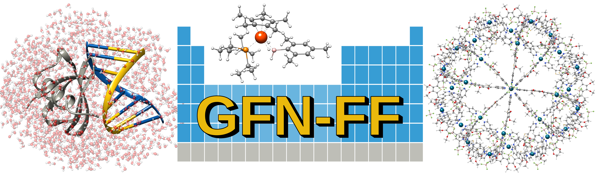

.. _gfnff:

----------------------------
GFN-Force-Field (GFN-FF)
----------------------------

.. contents::

Introducing GFN-FF
========================
``GFN-FF`` is a completely automated partially polarizable generic force-field for the accurate description of 
structures and dynamics of large molecules across the periodic table. This method combines force-field speed 
with almost quantum mechanical accuracy.
The main publication for ``GFN-FF`` can be found at: `Angewandte Chemie <https://onlinelibrary.wiley.com/doi/abs/10.1002/anie.202004239>`_.

   

Theoretical Background
=================================

The latest progress in the field of semi empirical methods, regarding the evolution of GFN1, GFN2 and GFN0-xTB, inspired the development of a generic force-field. 
The main focus of this GFN force-field (GFN-FF) is directed towards the description of bio-macromolecular systems such as (metallo-) proteins, supramolecular assemblies 
and metal-organic frameworks. 
It is intended for the usage as a versatile tool for drug design in life sciences and structure screening in various fields of chemistry.
Therefore, GFN-FF introduces an approximation to the remaining quantum mechanics in GFN0-xTB by replacing the extended Hückel theory by molecular mechanical bond strech, 
bond angle angle and torsion angle terms for the description of covalent bonds. 
To remain accurate in the description of conjugated systems, GFN-FF retains an iterative Hückel scheme for a selected set of atoms. 
The resulting bond orders obtained by a Hückel calculation have an influence on force constants and energy relevant parameters of the system.
To yield accurate results the FF parameters are fitted to reproduce B97-3c minimum geometries and frequencies. 
Thereby a strictly global and element specific parameter strategy is applied and no element pair specific parameters are employed.
This approach is a unique feature of all GFN methods and differs strongly from the parameterization strategies of other FFs. 
Special attention is paid to the simple application. As input only Cartesian coordinates and elemental composition are required from which fully automatically all potential energy terms are constructed.
The total GFN-FF energy expression is given by

.. math::
   E_{GFN-FF} = E_{cov} + E_{NCI},

where :math:`E_{cov}` refers to the bonded FF energy and :math:`E_{NCI}` describes the intra- and intermolecular noncovalent interactions.
In the covalent part interactions are described by asymptotically correct (dissociative) bonding, angular and torsional terms. 
Repulsive terms are added for bonded and non-bonded interactions separately. 
Additionally a three-body correction to the nuclear repulsion is added, that extends beyond the sum of pair-wise interactions.

.. math::
   E_{intra} = E_{bond} + E_{bend} + E_{tors} + E_{rep}^{bond} + E_{abc}^{bond}

In the noncovalent part, electrostatic interactions are described by an electronegativity equilibrium (EEQ) model. 
It is employed to calculate the isotropic electrostatic energy and atomic partial charges. 
Overall GFN-FF uses two sets of EEQ charges. One set depends on the standard geometry, whereas another set of charges is exclusively topology based, introducing partial polarizability to the FF method.
Dispersion interactions are taken into account by a topology based version of the D4 scheme, in which the dispersion coefficients are scaled by atomic charges instead of atomic polarizabilities.
Within the absence of electrons and without the QM information of occupied orbitals, the correct description of hydrogen and halogen bonds is challenging.
Therefore additional charge scaled H- and X- bond corrections are applied to yield the right binding motifs.

.. math::
   E_{NCI} = E_{IES} + E_{disp} + E_{HB} + E_{XB} + E_{rep}^{NCI}

GFN-FF reaches quadratic scaling in terms of energy and gradient calculation, whereas all GFN-xTB methods show cubic scaling with respect to the number of atoms.
It is the computationally most efficient member of the GFN family.
