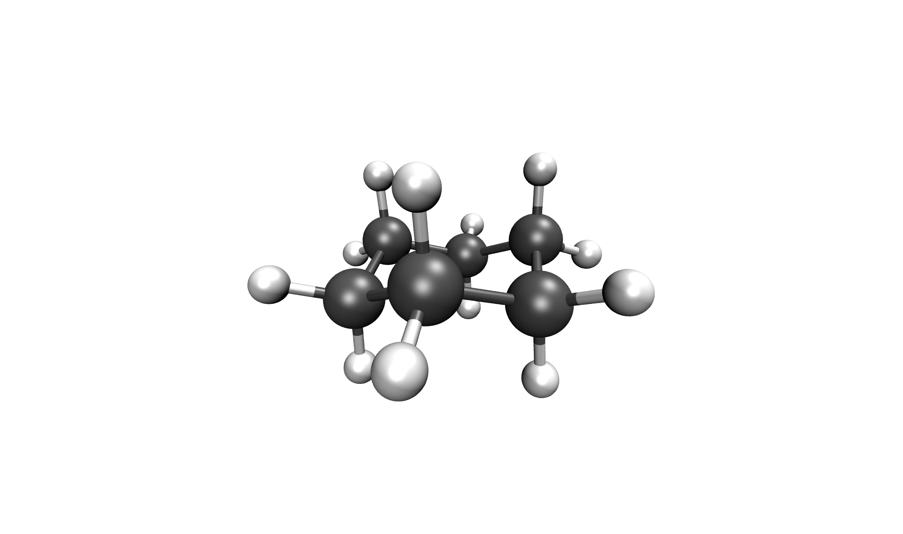
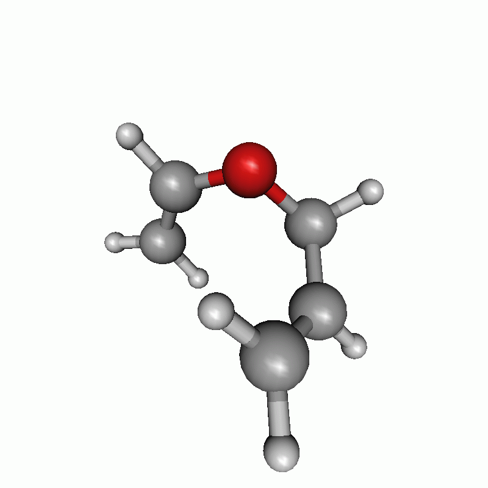
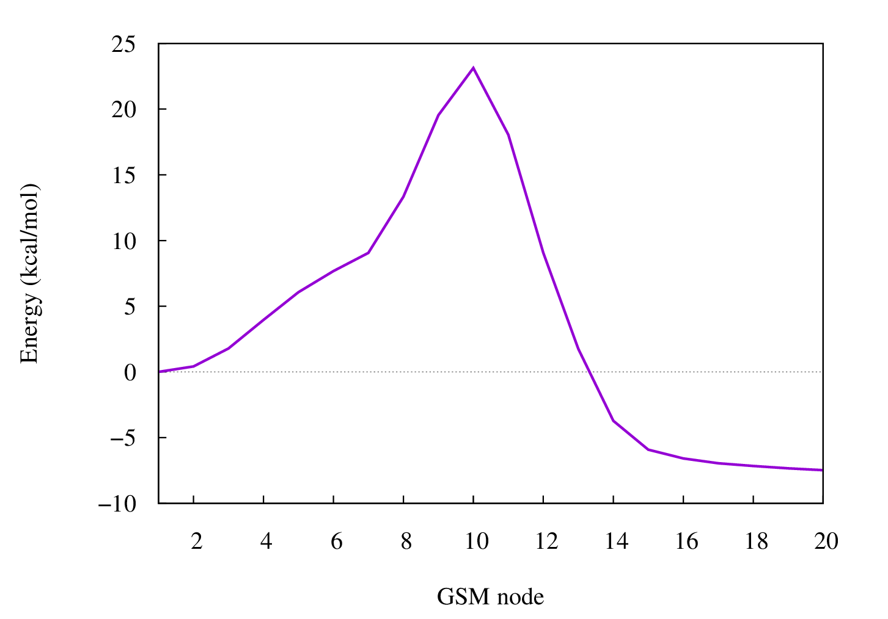
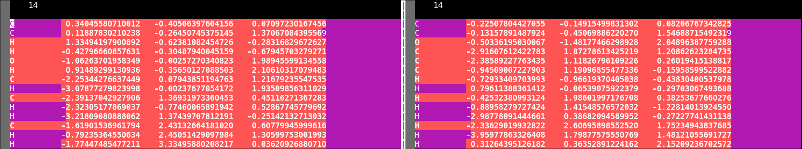
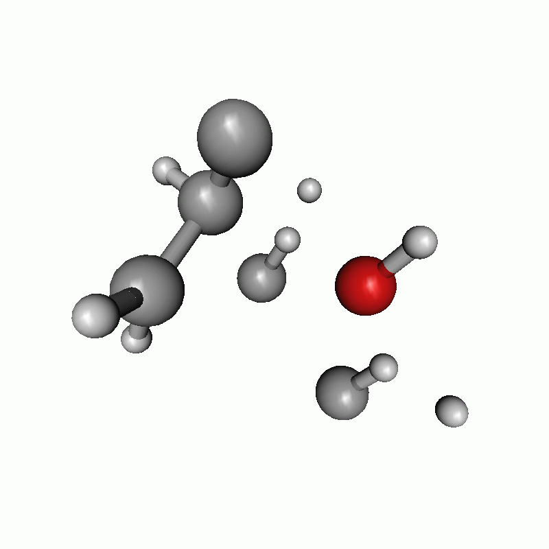
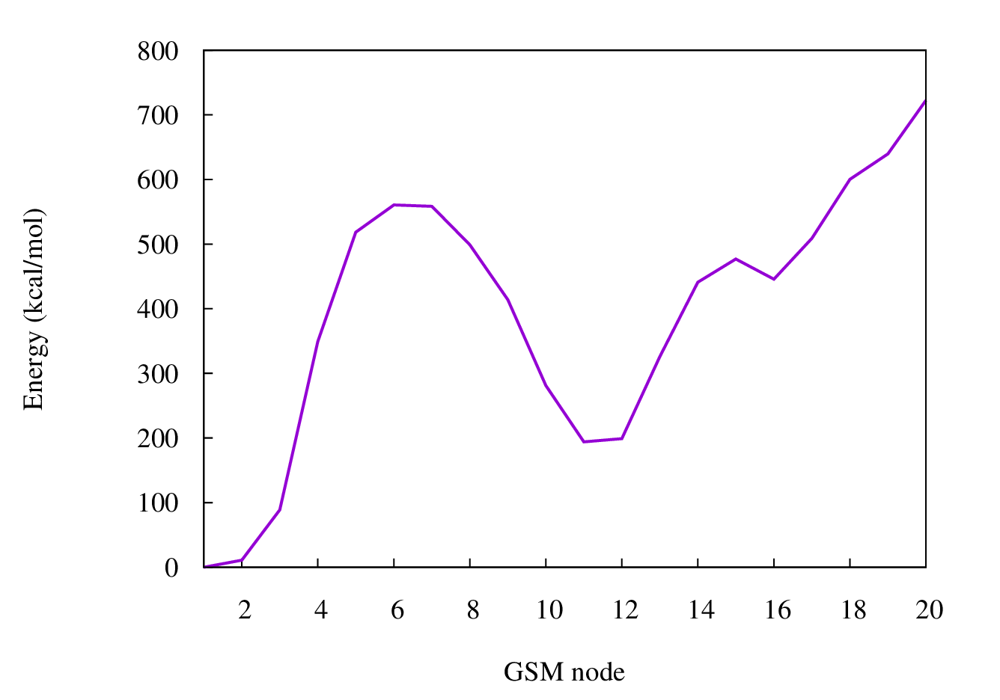

 .. _gsm:

-----------------------
Growing String Method
-----------------------

.. contents::

.. note::
   
   ``gsm`` is not developed in our group but in the *ZimmermanGroup*, therefore this tutorial and the useage of GSM is without warranty of completness or correctness.
   ``gsm`` is not able to communicate with ``xtb``, therefore a fake ``orca`` output is created using the ``xtb`` values.
   To run a ``gsm`` calculation, the following programs / files are needed.
     1) gsm.orca          *in any valid path, e.g. your bin*
     2) inpfileq          *in the directory, where you want to execute your calculation*
     3) modified ograd    *in the directory, where you want to execute your calculation*
     4) tm2orca.py        *in any valid path, e.g. your bin*
   Those are distributed from our fork of ``gsm`` `here <https://github.com/grimme-lab/molecularGSM/releases/tag/rev1>`_ for your convenience.
   For further information and a detailed description on ``gsm``, see `ZimmermanGroup`_ and their `orca`_ interface.

.. _ZimmermanGroup: https://github.com/ZimmermanGroup/molecularGSM/wiki
.. _orca: https://zimmermangroup.github.io/molecularGSM/classORCA.html

Input
======

``gsm`` is a method to find a reaction path and a transition state. In the following, we are going to work with the Double-Ended Growing String Method (DE-GSM), therefore a converged start and end structure is needed. The atomic order needs to be the same in both files, otherwise the ``gsm`` calculation will not give the transition state you are looking for.

In your current working directory *cwd/* you need to have the files *inpfileq* and *ograd*, and the directory *scratch/*. In *scratch/*, all files created and needed during the calculation are saved, but in the beginning, there is only one file in *scratch/*, named *initial0000.xyz*. The file *initial0000.xyz* contains the start and the end structure in any valid Xmol format. With the *inpfileq* the user is able to set specific parameters for the ``gsm`` calculation, whereas the *ograd* wraps ``xtb`` and converts input and output for ``gsm``. This is necessary, as ``gsm`` can read ``orca`` output but not ``xtb`` output. To use ``gsm`` with ``xtb``, we therefore have to fake an ``orca`` output, which is done using the ``tm2orca.py`` script. 

.. code:: bash

    > cd cwd/
    > ls
    inpfileq    ograd*    scratch/

Inversion
==========

This example deals with the inversion of cyclohexane from the chair to the boat conformation. Firstly, you need a converged starting structure *start.xyz*. You therefore have to build your molecule using a smiles string, ``avogadro`` or any other graphical program of your choice. Afterwards you have to execute a quick geometry optimization (e.g. with ``xtb``) and copy the obtained converged structure back in your *cwd/*.

.. code:: bash

    > xtb unconverged.xyz --opt
    > cp xtbopt.xyz ../start.xyz

Obviously, the xtb calculation can be done using all flags explained in this documentation, e.g. *--chrg*, *--uhf*, *--alpb* and so on.
The same has to be done with the end structure. It is advisable to take the optimized start structure and change, whatever you want to change, using a graphical program, which **does not** change your atomic order, e.g. ``avogadro``, as a change in the atomic order will definitively cause problems during the DE-GSM calculation!

Before you can start the calculation, a couple of other things have to be done. First, you have to generate your *initial0000.xyz*.

.. code:: bash

    > cat start.xyz end.xyz > scratch/initial0000.xyz
    > cat scratch/initial0000.xyz
    18
     
    C         0.72407050811334    1.25235108200516   -0.24338094705465
    C        -0.72343762657313    1.25319617766380    0.23929059852918
    C        -1.44731174776017   -0.00012207898744   -0.24387881064420
    C        -0.72448059275055   -1.25351379257321    0.24067027167326
    C         0.72302665800789   -1.25441395902634   -0.24200633751896
    C         1.44695184726671   -0.00106936630608    0.24102971332150
    H         0.74079379322633    1.27977999101331   -1.33568337236737
    H         1.23911262989111    2.14407418287692    0.12103331256485
    H        -1.23773720847930    2.14497568327721   -0.12601425207736
    H        -0.74014360366626    1.28171032471934    1.33155904823478
    H        -2.47725186596728    0.00050340452584    0.12007291068245
    H        -1.47894487592394   -0.00071222738449   -1.33620018565333
    H        -0.74120355748858   -1.28080687484113    1.33297520098609
    H        -1.23953398541620   -2.14527362819323   -0.12363941525185
    H         1.23731965319244   -2.14616191699557    0.12338823394548
    H         0.73972201150389   -1.28305135703018   -1.33427294070718
    H         1.47879051289637   -0.00048052377193    1.33334318895494
    H         2.47682744992731   -0.00169512097196   -0.12311621761763
    18
     
    C         0.73801367871811    1.26986541848913   -0.29891956390957
    C        -0.72425034407001    1.23660126909089    0.13751131482082
    C        -1.44534047314084   -0.03177648038732   -0.35671028842475
    C        -0.51312926640361   -0.95386524177349   -1.13921033932034
    C         0.73874270548611   -1.27320174695686   -0.32527750643084
    C         1.46163460859193    0.00218599807452    0.14815613748902
    H         0.80167461165837    1.37397900540374   -1.38290508569736
    H         1.22823701649042    2.14109015941832    0.14110672721895
    H        -1.22954714616749    2.12895335124983   -0.23651035666162
    H        -0.75981821609326    1.27774751863575    1.22804091215143
    H        -1.84194534594910   -0.58465393222957    0.49789315375467
    H        -2.29332568018213    0.23757670740058   -0.98938629993452
    H        -1.03732116020641   -1.88207230826469   -1.37787118249708
    H        -0.23326413070136   -0.48637114937456   -2.08427188018927
    H         0.44512664267991   -1.87161892139158    0.54024210888424
    H         1.41101252131720   -1.88609677273023   -0.92920597460851
    H         1.52271848431407    0.00555688995561    1.23838178865502
    H         2.48432149365809    0.02132023538992   -0.23310366530028

Then you have to modify your *inpfileq*. Normally, all default values can be used, and you only have to care about the last two entries *TS_FINAL_TYPE* and *NNODES*. *TS_FINAL_TYPE* can be *0* or *1*. *0* means no bond breaking and is used for this inversion, whereas you have to use *1* for a bond breaking. If you use the wrong setting here, so in this case *1* for the inversion of cyclohexane, ``gsm`` tries to break a bond leading to a wrong path. *NNODES* is the maximum number of nodes for the DE-GSM calculation and should be set to at least 15 for ``xtb``.

.. code:: bash

    TS_FINAL_TYPE           0      # 0=No bond breaking, 1=breaking of bond
    NNODES                  15     # including endpoints

Last, you have to modify the ``xtb`` call in *ograd\**. The *$ofile.xyz* as well as the *--grad* flag are necessary, but you can modify e.g. your charge or alpb flag. In the case of cyclohexane, the charge is 0 and for simplifications I just calculate it in gasphase, therefore no ALPB is used.

.. code:: bash

    xtb $ofile.xyz --grad --chrg 0 > $ofile.xtbout

Now, you have done everything to start the calculation.

.. code:: bash

    > gsm.orca

After the calculation, the two most important files are the reaction path in your *cwd/*, called *stringfile.xyz0000*, and the transition state in *scratch/tsq0000.xyz*, both in a valid Xmol format. The reaction path of the Inversion of cyclohexane can be seen below.

   Inversion of cyclohexane

.. figure:: ../figures/cyclohexane_conv.png
   :scale: 50 %
   :alt: cyclohexane

   Energy diagram of the inversion of cyclohexane

Bond breaking
===============

The next example is a simple Claisen rearrangement of an allyl vinyl ether and consequently includes a bond breaking and building. The *initial0000.xyz* is build as described above by writing the converged start and end structure one after the other.

.. code:: bash

    > cat start.xyz end.xyz > scratch/initial0000.xyz
    > cat scratch/initial0000.xyz
    14
     
    C       0.33830681      -0.40028145       0.06863012
    C       0.10595161      -0.26718767       1.36421188
    H       1.33077226      -0.61906183      -0.27493881
    H      -0.42216146      -0.28728678      -0.68244497
    O      -1.06599246      -0.01419187       2.00107453
    H       0.89080386      -0.36692363       2.10223944
    C      -2.24339525       0.08535540       1.21865884
    H      -3.06296651       0.00347496       1.94095352
    C      -2.38810216       1.37002374       0.45318426
    H      -2.30704191      -0.76808842       0.53050462
    H      -3.21531691       1.36845744      -0.24273208
    C      -1.61866094       2.43160218       0.59926563
    H      -0.79697159       2.43969569       1.29630648
    H      -1.77723230       3.33005423       0.02997950
    14
    
    C       0.05083404       0.47756955       0.03067754 
    C       0.22099793      -0.53384083       1.12248949 
    H       1.00063556       0.99546491      -0.11008883 
    H      -0.23550427      -0.01507412      -0.90051555 
    O      -0.06214314      -1.70052772       1.01406801 
    H       0.61484477      -0.11647527       2.06863484 
    C      -3.09105601       0.69502179       1.56213016 
    H      -4.07672239       0.25168355       1.53446340 
    C      -2.38605593       0.89986170       0.46164886 
    H      -2.72406577       0.97143579       2.54163695 
    H      -2.77578741       0.61350077      -0.51143129 
    C      -1.01585926       1.51412664       0.44531292 
    H      -0.76139644       1.92312285       1.42742393 
    H      -0.99072867       2.32977240      -0.28155745 

Next, the *inpfileq* is modified. As we are now dealing with a bond breaking, the *TS_FINAL_TYPE* has to be adapted. The *NNODES* is also changed to a higher value to give a more detailed reaction path. This is not necessary and was just done to play a bit with the settings. 

.. code:: bash

    TS_FINAL_TYPE           1      # 0=No bond breaking, 1=breaking of bond
    NNODES                  20     # including endpoints

At the end, the *ograd\** has to be modified. As Claisen rearrangements are often done in polar solvents, the calculcation was done using *ALPB(water)*.

.. code:: bash

    xtb $ofile.xyz --grad --chrg 0 --alpb h2o > $ofile.xtbout
    tm2orca.py $basename

Now, the ``gsm`` calculation is done

.. code:: bash

    > gsm.orca

The reaction path as well as the energy diagram are given below.

   Reaction path of a claisen rearrangement

   Energy diagram of a claisen reaction

Wrong atomic order
===================

The following is an example that shows how important a proper atom order is. It deals with the same Claisen rearrangement as shown above, but with a different atom order in the start and end structure file, as shown below.

   vimdiff of different atomic order in the start (left) and end (right) file

Except for the different atom order the same as above was done. Both structures are written to the *initial0000.xyz* in the *scratch/** directory. In the inpfileq the *TS_FINAL_TYPE* is *1*, and the *NNODES* is set to *20*. The ``xtb`` call in *ograd\** is given below:

.. code:: bash

    xtb $ofile.xyz --grad --chrg 0 --alpb h2o > $ofile.xtbout

Now ``gsm`` is just started as already shown.

.. code:: bash

    > gsm.orca

The resulting path as well as the energy diagram is shown below.

   Reaction path of a claisen rearrangement with wrong atom order

   Example of an energy diagram of a wrong reaction path

