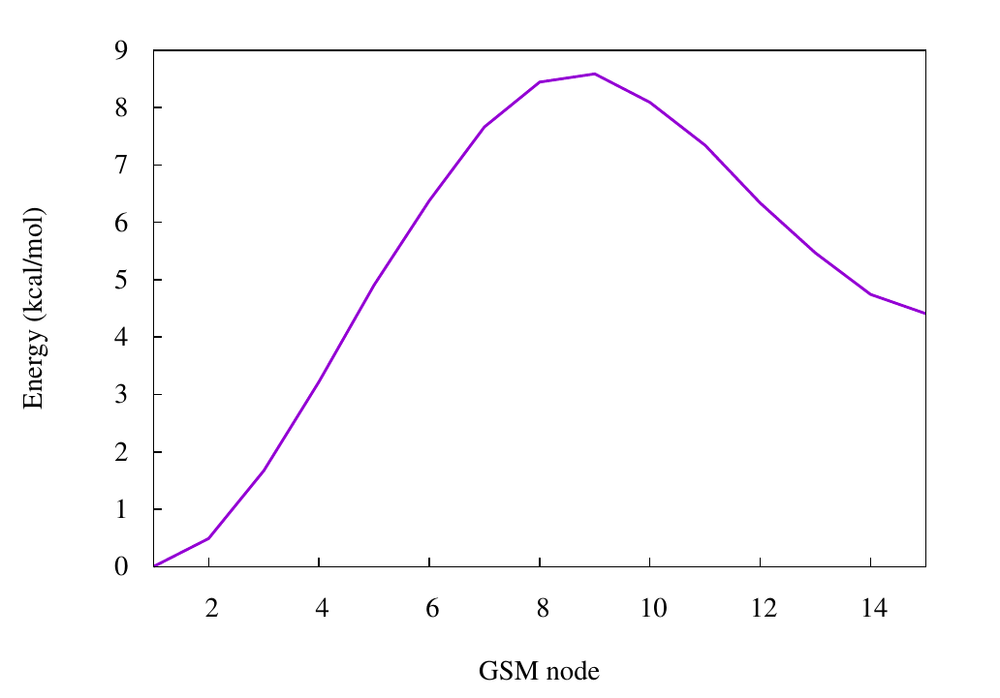

 .. _gsm:

-----------------------
Growing String Method
-----------------------

.. contents::

.. note:: ``GSM`` is not developed in our group but in the *ZimmermanGroup*, therefore this tutorial and the useage of GSM is without warranty of completness or correctness. We are using version *5e12e14d30faaf084b47bc491d62e49a81dad3b2* of ``GSM``. ``GSM`` is not able to communiacte with ``xtb``, therefore a fake ``orca`` output is created using the ``xtb`` values. To run a GSM calculation, the following programs are needed. All of them are available upon personal request. 
   1) gsm.orca          *in any valid path, e.g. your bin*
   2) inpfileq          *in the directory, where you want to execute your calculation*
   3) modified ograd    *in the directory, where you want to execute your calculation*
   4) tm2orca.py        *in any valid path, e.g. your bin* 
   For further information and a detailed description on ``GSM``, see `ZimmermanGroup`_ and their `orca`_ interface.

.. _ZimmermanGroup: https://github.com/ZimmermanGroup/molecularGSM/wiki 
.. _orca: https://zimmermangroup.github.io/molecularGSM/classORCA.html

Input
======

``GSM`` is a method to find a reaction path and a transition state. In the following, we are going to work with the Double-ended Growing String Method (DE-GSM), therefore a converged start and end structure is needed. The atomic order needs to be the same in both files otherwise the ``GSM`` calculation won't give the transition state you are looking for. 

Let's first have a look at the structure needed. The files are explained later in detail. Let's call the directory, where you want to execute your calculations, *cwd/* (current working directory). In *cwd/* you need to have the directory *scratch/*. Here, all files created and needed during the calculation are saved, but in the beginning, there is only one file in *scratch/*, named *initial0000.xyz*. The file *initial0000.xyz* contains the start and the end structure in any valid Xmol format. The next two files needed are in the directory, where you want to carry out your calculation. Both are available upon personal request or from the *ZimmermanGroup* (see links attached). With the *inpfileq* the user is able to set specific parameters for the ``GSM`` calculation, whereas the *ograd* allows the ``GSM`` to communicate with ``orca`` (??????????). This is necessary, as ``GSM`` can read ``orca`` output but not ``xtb`` output. To use ``GSM`` with ``xtb``, we therefore have to fake an ``orca`` output, which is done using the ``tm2orca`` script. Furthermore, you need two directories, where you optimize your start and end structure, namley *start/* and *end/*. 

.. code:: bash

    > cd cwd/
    > ls 
    end/    inpfileq    ograd*    scratch/    start/

Inversion
==========

This example deals with the inversion of cyclohexane from the chair to the boat conformation. Firstly, you need a converged starting structure *start.xyz*. You therefore have to build your molecule in *start/*, where you build your molecule using a smiles string, ``avogadro`` or any other graphical program of your choice. Afterwards you have to execute a quick geometry optimization (e.g. with ``xtb``) and copy the obtained converged structure back in your *cwd/*. 

.. code:: bash
    
    > cd start/
    > obabel -ismi unconverged.smi --gen3d -oxyz -O unconverged.xyz
    > xtb unconverged.xyz --opt 
    > cat xtbopt.xyz
    18
            -19.19539921
    C           0.72843434470456    1.25982478073651   -0.24012456780476
    C          -0.72777610989508    1.26067546579378    0.23600481175104
    C          -1.45606227367562   -0.00012407730597   -0.24050672835883
    C          -0.72883134272817   -1.26099459852248    0.23739090970526
    C           0.72737798955291   -1.26188502513029   -0.23874262122560
    C           1.45568794883483   -0.00106824921650    0.23769683369676
    H           0.75509375057143    1.30484737240468   -1.33473424471687
    H           1.24080411887910    2.14749990671418    0.14406690070669
    H          -1.23941415236514    2.14836879734283   -0.14911579915314
    H          -0.75440938068291    1.30686679161267    1.33056700638662
    H          -2.48123885422840    0.00052444409439    0.14306417819097
    H          -1.50769808223365   -0.00069664832176   -1.33514006744289
    H          -0.75548303390087   -1.30594264398711    1.33200209562400
    H          -1.24120585934463   -2.14869071264549   -0.14673782557395
    H           1.23901244269262   -2.14956140418753    0.14642959499471
    H           0.75401085032508   -1.30814283105027   -1.33330389699568
    H           1.50743880779513   -0.00049661774011    1.33233065893244
    H           2.48082883569879   -0.00171475059154   -0.14597723871678
    > cp xtbopt.xyz ../start.xyz
    
    
Obviously, the xtb calculation can be done using all flags explained in this documentation, e.g. *--chrg*, *--uhf*, *--gbsa* and so on. 
The same has to be done with the end structure. It is advisable to take the optimized start structure and change, whatever you want to change, using a graphical program, which **does not** change your atomic order, e.g. ``avogadro``, as a change in the atomic order will definitively cause problems during the ``GSM`` calculation!

Before you can start the calculation, a couple of other things have to be done. First, you have to generate your *initial0000.xyz*.

.. code:: bash

    > cat start.xyz end.xyz > scratch/initial0000.xyz
    > cat scratch/initial0000.xyz
    18

    C       0.72843434       1.25982478      -0.24012457 
    C      -0.72777611       1.26067547       0.23600481 
    C      -1.45606227      -0.00012408      -0.24050673 
    C      -0.72883134      -1.26099460       0.23739091 
    C       0.72737799      -1.26188503      -0.23874262 
    C       1.45568795      -0.00106825       0.23769683 
    H       0.75509375       1.30484737      -1.33473424 
    H       1.24080412       2.14749991       0.14406690 
    H      -1.23941415       2.14836880      -0.14911580 
    H      -0.75440938       1.30686679       1.33056701 
    H      -2.48123885       0.00052444       0.14306418 
    H      -1.50769808      -0.00069665      -1.33514007 
    H      -0.75548303      -1.30594264       1.33200210 
    H      -1.24120586      -2.14869071      -0.14673783 
    H       1.23901244      -2.14956140       0.14642959 
    H       0.75401085      -1.30814283      -1.33330390 
    H       1.50743881      -0.00049662       1.33233066 
    H       2.48082884      -0.00171475      -0.14597724 
    18

    C       0.68592691       1.18699523      -0.37166504 
    C      -0.71247366       1.28972619       0.24465681 
    C      -1.48633392      -0.04257838       0.16798353 
    C      -0.66602811      -1.15671938      -0.49020173 
    C       0.70236292      -1.30691892       0.18101114 
    C       1.47637829       0.02635865       0.24044092 
    H       0.60640049       1.05375726      -1.45578749 
    H       1.22625770       2.12231496      -0.19521334 
    H      -1.27113983       2.07536249      -0.27327708 
    H      -0.61522611       1.59591566       1.29152994 
    H      -1.76777815      -0.35941636       1.17752955 
    H      -2.41311298       0.09662737      -0.39787855 
    H      -1.21246851      -2.10086604      -0.40890220 
    H      -0.53654748      -0.94345183      -1.55627453 
    H       0.55794260      -1.69125734       1.19609431 
    H       1.28612751      -2.05224384      -0.36883693 
    H       1.70740394       0.26751591       1.28322280 
    H       2.42887838      -0.07183163      -0.28926209

Then you have to modify your *inpfileq*. Normally, all default values can be used, and you only have to care about the last two entries *TS_FINAL_TYPE* and *NNODES*. *TS_FINAL_TYPE* can be *0* or *1*. *0* means no bond breaking and is used for a inversion, whereas you have to use *1* for a bond breaking. If you use the wrong setting here, so e.g. *1* for the inversion of cyclohexane, ``GSM`` tries to break a bond leading to a wrong path. *NNODES* is the maximum number of nodes for the ``GSM`` calculation and should be set to 15 for ``xtb``. 

.. code:: bash

    TS_FINAL_TYPE           0      # any/delta bond: 0/1
    NNODES                  15     # including endpoints

Last, you have to modify the ``xtb`` call in *ograd\**. The *$ofile.xyz* as well as the *--grad* flag are necessary, but you have to modify e.g. your charge or gbsa flag. In the case of cyclohexane, the charge is 0 and for simplifications I just calculate it in gasphase, therefore no gbsa is used. 

.. code:: bash 

    xtb $ofile.xyz --grad --chrg 0 > $ofile.xtbout

Now, you have done everything to start the calculation.

.. code:: bash

    > gsm.orca
    
After the calculation, the two most important files are the reaction path in your *cwd/*, called *stringfile.xyz0000*, and the transition state in *scratch/tsq0000.xyz*, both in a valid Xmol format. The reaction path of the Inversion of cyclohexane can be seen below. 
    
.. figure:: ../figures/cyclohexane.gif
   :scale: 25 %
   :alt: cyclohexane
   
   Inversion of cyclohexane

   
   Energy diagram of the inversion of cyclohexane
   

Bond breaking
===============

The next example is a simple Claisen rearrangement of an allyl vinyl ether and consequently includes a bond breaking and building. The *initial0000.xyz* is build as described above by writing the converged start and end structure on after the other. 

.. code:: bash

    > cat start.xyz end.xyz > scratch/initial0000.xyz
    > cat scratch/initial0000.xyz
    14

    C       0.34045581      -0.40506398       0.07097230 
    C       0.11887830      -0.26450745       1.37067084 
    H       1.33494198      -0.62381082      -0.28316830 
    H      -0.42796661      -0.30487940      -0.67945703 
    O      -1.06263702      -0.00257270       1.98945599 
    H       0.91489299      -0.35650127       2.10610317 
    C      -2.25344277       0.07943851       1.21679236 
    H      -2.32305178      -0.77460066       0.52867746
    C      -2.39137043       1.36931973       0.45116271
    H      -3.07877280      -0.00237677       1.93509856
    H      -3.21809081       1.37439708      -0.25142133 
    C      -1.61901537       2.43132664       0.60779946 
    H      -0.79235365       2.45051429       1.30599753                                                                                                                        
    H      -1.77447485       3.33495880       0.03620927                                                                                                                        
    14                                                                                                                                                                          
                                                                                                                                                                                
    C       0.05083404       0.47756955       0.03067754                                                                                                                        
    C       0.22099793      -0.53384083       1.12248949                                                                                                                        
    H       1.00063556       0.99546491      -0.11008883                                                                                                                        
    H      -0.23550427      -0.01507412      -0.90051555                                                                                                                        
    O      -0.06214314      -1.70052772       1.01406801 
    H       0.61484477      -0.11647527       2.06863484 
    C      -3.09105601       0.69502179       1.56213016 
    H      -4.07672239       0.25168355       1.53446340 
    C      -2.38605593       0.89986170       0.46164886 
    H      -2.72406577       0.97143579       2.54163695 
    H      -2.77578741       0.61350077      -0.51143129 
    C      -1.01585926       1.51412664       0.44531292 
    H      -0.76139644       1.92312285       1.42742393 
    H      -0.99072867       2.32977240      -0.28155745

Next, the *inpfileq* is modified. As we are now dealing with a bond breaking, the *TS_FINAL_TYPE* has to be adapted. The *NNODES* is also changed to a higher value to give a more detailed reaction path. This is not necessary and was just done for a nicer movie and a nicer energy diagram. 

.. code:: bash
    
    TS_FINAL_TYPE           1      # any/delta bond: 0/1
    NNODES                  20     # including endpoints
    
    
At the end, the *ograd\** has to be modified. As Claisen rearrangements are often done in polar solvents, and a water / ethanol mixture accelerates the reaction, the calculcation was done using *gbsa(water)*. 

.. code:: bash 

    xtb $ofile.xyz --grad --chrg 0 --gbsa h2o > $ofile.xtbout
    tm2orca.py $basename

Now, the ``gsm`` calculation is done

.. code:: bash

    >gsm.orca 

The reaction path as well as the energy diagram are given below. 

   
.. figure:: ../figures/claisen.gif
   :scale: 25 %
   :alt: claisen

   Reaction path of a claisen rearrangement
   
.. figure:: ../figures/claisen_conv.png
   :scale: 25 %
   :alt: claisen_conv
   
   Energy diagram of a wrong reaction path 

Wrong atomic order
===================

The following is an example that shows how important a proper atom order is. It deals with the same Claisen rearrangement as shown above, but with a different atom order in the start and end structure file, as shown below. 

.. figure:: ../figures/vimdiffstartend.png
   :scale: 25 %
   :alt: vimdiffstartend
   
   vimdiff of different atomic order in the start (left) and end (right) file
   
Except for the different atom order the same as above was done. Both structures are written to the *initial0000.xyz* in the *scratch/** directory. In the inpfileq the *TS_FINAL_TYPE* is *1*, and the *NNODES* is set to *20*. The ``xtb`` call in *ograd\** is given below:

.. code:: bash

    xtb $ofile.xyz --grad --chrg 0 --gbsa h2o > $ofile.xtbout

Now ``gsm`` is just started as already shown.

.. code:: bash

    > gsm.orca
    
The resulting path as well as the energy diagram is shown below. 

   
.. figure:: ../figures/wrongclaisen.gif
   :scale: 25 %
   :alt: wrongclaisen

   Reaction path of a claisen rearrangement with wrong atom order 
   
.. figure:: ../figures/wrongclaisen_conv.png
   :scale: 25 %
   :alt: wrongclaisen_conv
   
   Example of an energy diagram of a wrong reaction path 
   

