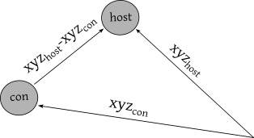
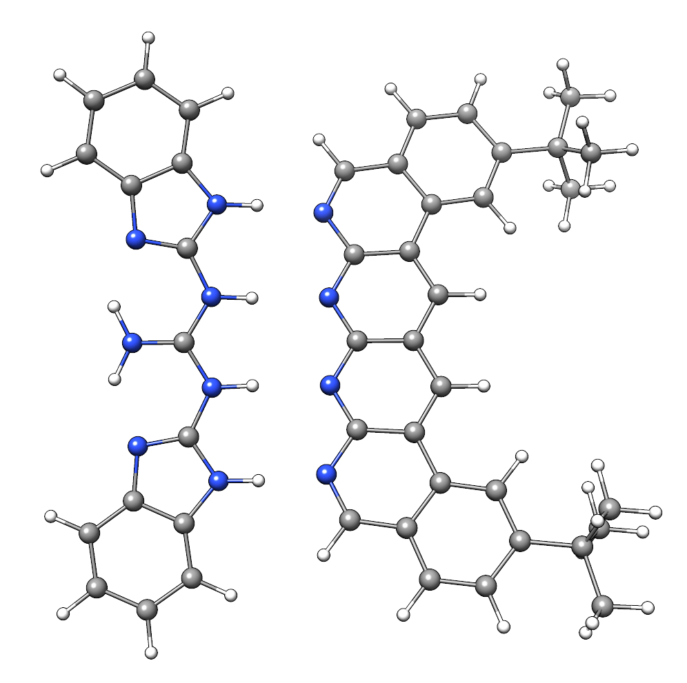

.. _oniom:

-------
 ONIOM
-------

This guide is aimed to give a general overview of the ONIOM implementation within the ``xtb`` program package.

.. note::
   This feature is only present in version 6.6 and newer or in the current bleeding-edge version.

.. contents::

General description
===================

The ONIOM scheme is a multiscale calculation approach used to treat large molecular systems efficiently. A detailed review of the ONIOM scheme and its possible applications can be found at: `Chung2015 <https://pubs.acs.org/doi/10.1021/cr5004419>`_.

The total two-layer ONIOM energy is defined as

.. math::
   E_{oniom} = E_{whole, low} - E_{model, low} + E_{model ,high},

where :math:`E_{whole, low}` and :math:`E_{model, low}` terms are the single-point energies calculated at a low-level of theory of the whole system and a specific system cutoff (called henceforward 'inner region'). :math:`E_{model, high}` denotes the single-point energy of the inner region at a higher level of theory. The idea is to combine the different theory levels in a subtractive manner to compromise accuracy and speed.

Input
=====

To perform an ONIOM calculation with ``xtb`` the ``--oniom`` option is used. The inner region has to be defined by providing the atom numbers contained in it and two calculation methods (``high:low``) can be chosen. The ONIOM calculation is then invoked by callinig:

.. code:: sh
   
   > xtb <geometry_file> --oniom [high]:[low] [inner_region]

.. note::
        If ``high:low`` are not provided, the ``gfn2:gfnff`` combination is used.

Methods
-------

* **gfnff, gfn1, gfn2**

These methods are available in the ``xtb``  and can be utilized both as high and low-level approaches in the ONIOM framework.

.. important::

   The ONIOM routine includes but is not limited to the ``xtb`` functionality. To expand the range of the available methods, the external ``ORCA`` and ``TURBOMOLE`` software packages can be employed. This is done by the addition of the corresponding binary path in the environment variable ``$PATH``.  

   The best way to configure the external settings for the xtb run is to use `xcontrol <https://github.com/grimme-lab/xtb/blob/main/man/xcontrol.7.adoc>`_ instructions.

* **orca**

If ``ORCA`` should be employed, an `orca input <https://www.orcasoftware.de/tutorials_orca/first_steps/input_output.html>`_ has to be provided to run calculations. An additional instruction file like ``xcontrol`` allows to specify the user-supplied orca input by adding the follwing lines:

.. code:: none
   
   $external
      orca input file=<filename>

or to provide only calculation method:

.. code:: none
   
   $external
      orca input string=<method>

If no input is specified, ``xtb`` writes an orca input with the default settings (*B97-3c*).

* **turbomole**

``Turbomole`` also uses its format to perform calculations, defined by the ``control`` file. 
Initially, the ``xtb`` searches for the ``control`` file in the user's calculation directory, and if no file is present, writes it with some default settings (*B97-3c*).

.. note::
   
   Currently, it is possible to use ``ORCA``/``TURBOMOLE`` only as the **high** level embedding.

Inner region
------------

To perform the ONIOM calculations with ``xtb`` one has to specify the ``inner_region_cutoff`` which is provided either directly as comma-separated indices ("1,3-5,9,10"), or via a file with the same content (or each index on a separate line).

If covalent bonds are cut between the inner region and the rest of the system, ONIOM handles the resulting boundary through Hydrogen Linked Atoms (LAs):

.. tabbed:: inner region
   
   .. figure:: ../figures/ohne.png

.. tabbed:: inner region with LAs
   
   .. figure:: ../figures/mit.png

The positions for LAs are determined by the positions of the cleaved atoms:

.. math::
   [xyz]_{LA} = [xyz]_{con} +([xyz]_{host} - [xyz]_{con}) * k

where :math:`[xyz]_{con}` and :math:`[xyz]_{host}` are coordinates of connector atom (stays in the inner region) and host atom (replaced by LA), :math:`k` is a fixed scaling factor.

| 
To distinguish between different bonds the topology information from the ``low`` level method is used. 

.. warning:: 

   It is strongly recommended to cut only **single bonds**.
   When using the GFN-FF as a low-level method, one has to be very careful with the inner region specification. The topology data of the GFN-FF does not allow for an accurate distinction between single and higher-order bonds.

Functionality
=============

flags
-----

\--chrg 'int:int':
   extension of the classical ``--chrg`` flag, with added charges for **inner:whole** regions. If only one value is given, it is used for the whole system. If not specified, the ``xtb`` determine the **inner** region charge automatically.

\--cut:
   write the geometry of the specified inner region without performing any calculations. Note that hydrogen-linked atoms are not present, due to the absence of the Wiberg bond orders. In addition, this procedure can be used to test the abovementioned automatic inner region charge determination.

\--ceasefiles:
   extension of the original flag, with instructions for the ``xtb`` to delete all external files from ``ORCA``/``TURBOMOLE`` (except for ``*.inp`` and ``control`` files) 
   

xcontrol
--------

In addition to the above-mentioned ``xcontrol`` instructions deeper control over the ONIOM routine is available via the ``$oniom`` group block.

*inner logs=[bool]*
   print high- and low-level optimization trajectory for the model system (``high.inner_region.log`` and ``low.inner_region.log``). 

*derived k=[bool]*
   k is a scaling factor for the LAs coordinates, which by default is constant. This instruction allows it to be dynamically assigned in dependence on the distance between the connector and host atoms.

*silent=[bool]*
   redirecting the output of the external programs into files.

Example:  S30L-23
=================

As a showcase host-guest complex number 23 from `S30L benchmark <https://pubs.acs.org/doi/full/10.1021/acs.jctc.5b00296>`_ is chosen. 

This system consists of 2 NCI-bound fragments: 1-62 and 63-98, the latter having +1 charge. To test the automatic charge identification routine:

.. tabbed:: cml input

   .. code-block:: none
      
      > xtb input.xyz --oniom orca:gfn2 1-62 --chrg +1 --cut

.. tabbed:: input.xyz
   
   .. code-block:: none

      98
      
      C     0.7800079    6.8678780    5.5368969 
      C    -0.7524620   -6.8540954    5.5601280 
      C    -1.8617928   -4.6117174    5.6477616 
      C     0.6504601   -4.7941213    5.7959390 
      C     1.8907976    4.6261439    5.6192277 
      C    -0.6200120    4.8079116    5.7907513 
      C    -0.6206618   -5.3815968    5.1397097 
      C     0.6446437    5.3943761    5.1211667 
      C    -0.0083487   -0.0004324   -0.3233281 
      C     0.0816478    2.3154959   -0.3654186 
      C    -0.1026742   -2.3162587   -0.3590787 
      C    -0.2959652   -3.7207698    1.6988510 
      C     0.2900184    3.7253335    1.6873006 
      C    -0.1686909   -2.4104886    1.0817263 
      C     0.1605795    2.4132860    1.0744672 
      C     0.3073296    4.8471713    0.8195874 
      C    -0.3253307   -4.8444637    0.8338615 
      C     0.5276492    5.2249147    3.6051512 
      C    -0.5183472   -5.2156660    3.6222398 
      C    -0.0021327    0.0013275    1.1173800 
      C    -0.3936683   -3.9343044    3.0790781 
      C     0.4013815    3.9420198    3.0659794 
      C     0.1802918    4.6204737   -0.5828574 
      C    -0.2109397   -4.6213534   -0.5702540 
      C    -0.0947791   -1.2261541    1.7924088 
      C     0.0957022    1.2304873    1.7885605 
      C     0.5422958    6.3241699    2.7203124 
      C    -0.5452450   -6.3167433    2.7399789 
      C     0.4338755    6.1417501    1.3535797 
      C    -0.4505106   -6.1375070    1.3718405 
      N     0.0116094    1.1544899   -1.0315142 
      N    -0.0353108   -1.1570386   -1.0285348 
      N     0.0706724    3.4479104   -1.1540574 
      N    -0.1024078   -3.4505370   -1.1451747 
      H    -0.3766699   -3.0846938    3.7536939 
      H     0.3946574    3.0937118    3.7424387 
      H     0.6402108    7.3293416    3.1126263 
      H    -0.6416612   -7.3208096    3.1354374 
      H    -0.1065165   -1.2240152    2.8785113 
      H     0.1173973    1.2309738    2.8745222 
      H     0.4453140    6.9962771    0.6820918 
      H    -0.4716396   -6.9933848    0.7023244 
      H    -0.2080001   -5.4867763   -1.2347620 
      H     0.1678296    5.4843584   -1.2492380 
      H    -0.8214158   -6.9116715    6.6504902 
      H     0.8607175    6.9279102    6.6263141 
      H    -0.7372921    3.7424986    5.5676570 
      H     1.8239111    3.5571595    5.3925453 
      H    -1.7966759   -3.5433842    5.4175217 
      H     0.7662278   -3.7292650    5.5694116 
      H    -1.6551297   -7.3154982    5.1456164 
      H     0.1168724   -7.4441425    5.2509428 
      H     1.6777844    7.3288991    5.1115045 
      H    -0.0930120    7.4567246    5.2359300 
      H     2.8023074    5.0177240    5.1566686 
      H    -1.5202507    5.3298528    5.4510796 
      H    -2.7778232   -5.0041987    5.1950003 
      H     1.5472087   -5.3172918    5.4490088 
      H    -1.9411358   -4.7181202    6.7344847 
      H     0.5868113   -4.9026714    6.8834941 
      H    -0.5461631    4.9189786    6.8774015 
      H     1.9805730    4.7354338    6.7048538 
      C    -0.4488171    2.3665805   -4.6544687 
      C     0.4333778   -2.3789163   -4.6469142 
      C    -0.7917246    3.9457007   -6.0685007 
      C     0.7866666   -3.9602320   -6.0559302 
      C    -0.7915911    4.5371499   -4.7810591 
      C     0.7743565   -4.5501742   -4.7678612 
      N    -0.5769336    3.4887852   -3.8927405 
      N     0.5526308   -3.5004778   -3.8828746 
      N    -0.2162293    1.1365996   -4.0461490 
      N     0.1977398   -1.1476848   -4.0424055 
      C    -0.0069054   -0.0062888   -4.7519033 
      C     1.1701962   -6.6894301   -5.7142314 
      C    -1.1806924    6.6749532   -5.7335372 
      C    -1.1835769    6.0993249   -7.0168863 
      C     1.1847144   -6.1154023   -6.9982147 
      C     0.9956430   -4.7491407   -7.1892085 
      C    -0.9916821    4.7329808   -7.2045356 
      C    -0.9861523    5.9032143   -4.5891788 
      C     0.9658492   -5.9162071   -4.5726041 
      N    -0.0024966   -0.0075912   -6.0685751 
      N    -0.5736206    2.5723997   -5.9542885 
      N     0.5690957   -2.5866178   -5.9453246 
      H    -0.1946193    0.9005726   -6.5259354 
      H     0.1937665   -0.9163433   -6.5228612 
      H     0.1239780   -1.1213863   -3.0079656 
      H    -0.1481455    1.1124645   -3.0112686 
      H    -0.3819862    3.5198035   -2.8723700 
      H     0.3536032   -3.5294854   -2.8634564 
      H    -1.3407700    6.7384801   -7.8800928 
      H     1.3486405   -6.7558037   -7.8592332 
      H     1.3243264   -7.7589379   -5.6100014 
      H    -1.3357299    7.7446004   -5.6320230 
      H     1.0094379   -4.3072917   -8.1801901 
      H    -0.9964687    4.2898655   -8.1950479 
      H     0.9656238   -6.3638842   -3.5831368 
      H    -0.9956242    6.3520069   -3.6002631

.. tabbed:: output

   .. code-block:: none

                 -------------------------------------------------
                |                Calculation Setup                |
                 -------------------------------------------------

                program call               : xtb input.xyz --oniom orca:gfn2 1-62 --chrg +1 --cut
                hostname                   : albert
                coordinate file            : input.xyz
                omp threads                :                    16

         ID    Z sym.   atoms
          1    6 C      1-30, 63-68, 73-81
          2    7 N      31-34, 69-72, 82-84
          3    1 H      35-62, 85-98

        ... skip ...
        ------------------------------------------------------------------------
        |                        INNER REGION CHARGE =  0                      |
        ------------------------------------------------------------------------

      normal termination of xtb

To start single-point calculation with the user-defined orca input file: 

1) specify orca input and add its name in the xcontrol file:

.. tabbed:: orca.inp

   .. code-block:: none
      :emphasize-lines: 2

         ! r2SCAN-3c
         ! engrad
         * xyzfile 0 1 some.xyz
      
.. tabbed:: xcontrol
   
   .. code-block:: none

      $external
         orca input file=orca.inp 
      $end

Please use the ``engrad`` keyword to allow ``xtb`` to read the ``ORCA`` output. The inner region is automatically written in the ``some.xyz`` file.

2) start ``xtb`` run:

.. code-block:: none
      
   > xtb input.xyz --oniom orca:gfn2 1-62 --chrg +1 --input xcontrol

The final ``xtb`` output for the given example is divided into 3 parts with the ONIOM results printed in the property printout section:

.. code-block:: none
   :emphasize-lines: 30-31
   
      ------------------------------------------------------------------------

           Singlepoint calculation of whole system with low-level method

      ------------------------------------------------------------------------
      
      ... skip ...

      ------------------------------------------------------------------------

           Singlepoint calculation of inner region with low-level method

      ------------------------------------------------------------------------
      
      ... skip ...

      ------------------------------------------------------------------------

           Singlepoint calculation of inner region with high-level method

      ------------------------------------------------------------------------  

      ... skip ...
      
                -------------------------------------------------
               |                Property Printout                |
                -------------------------------------------------

                 -------------------------------------------------
                | TOTAL ENERGY            -1438.298999659396 Eh   |
                | GRADIENT NORM               0.045824034529 Eh/α |
                 -------------------------------------------------
