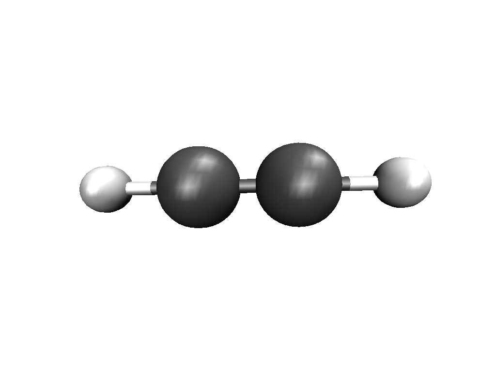
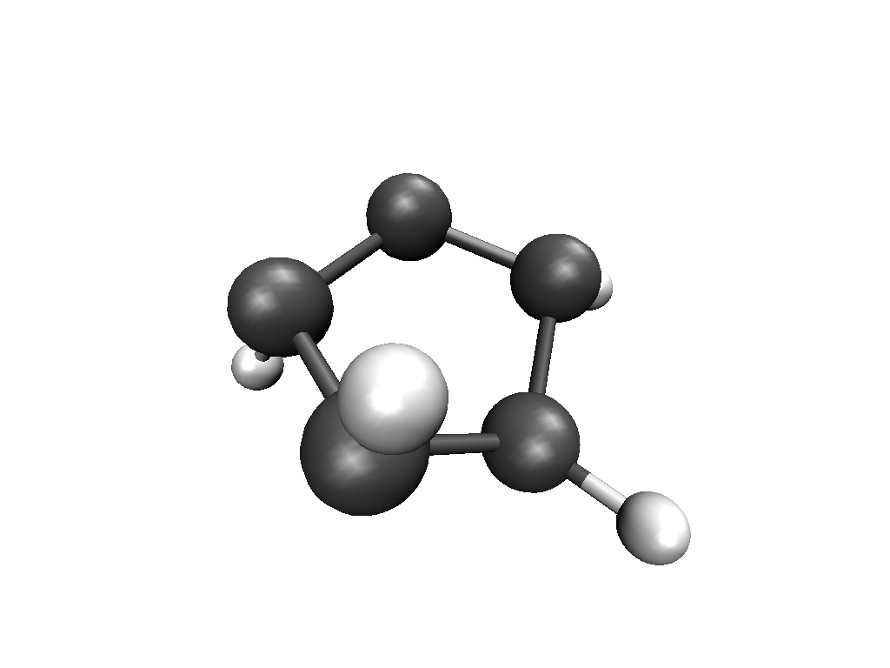
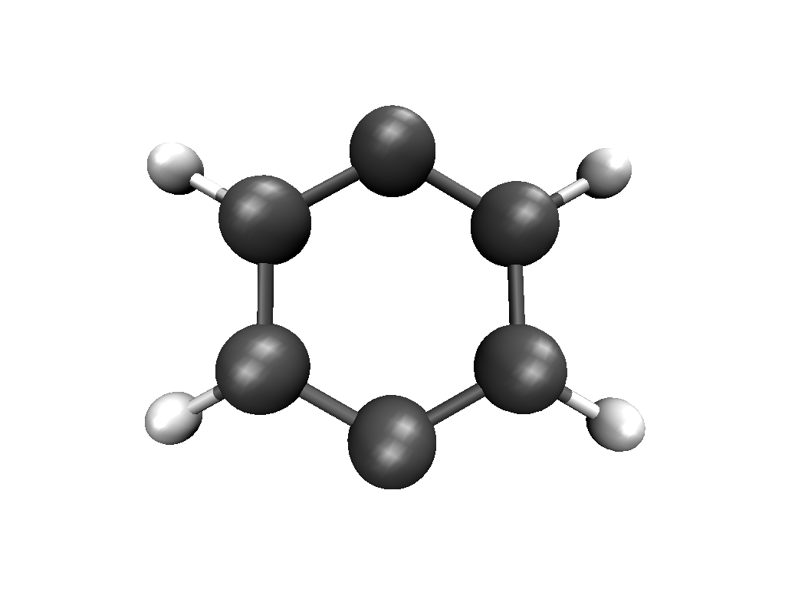
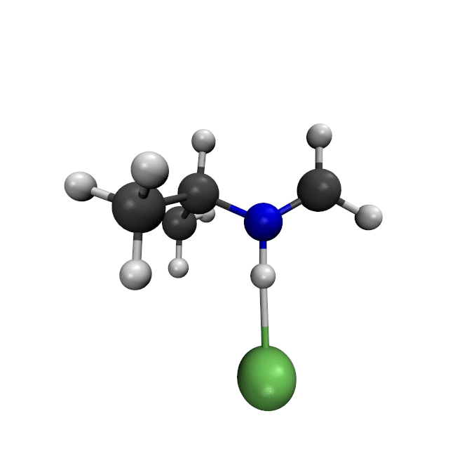
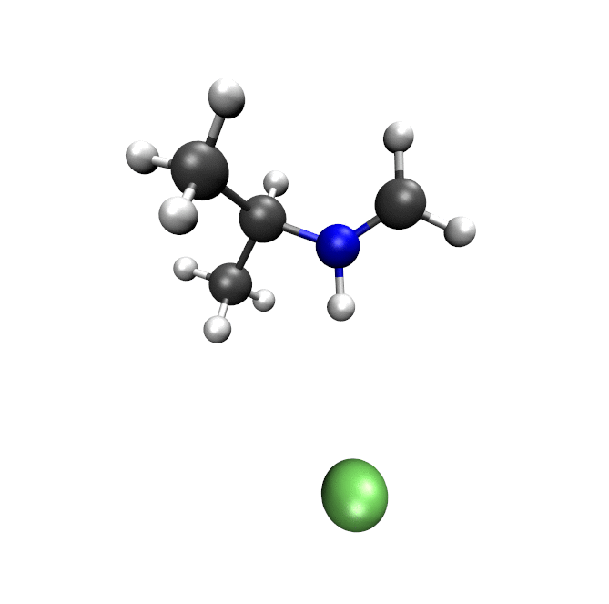

.. _geometry optimization:

---------------------
Geometry Optimization
---------------------

The basics of calculating geometry optimizations with ``xtb`` are presented in this chapter.
Please check out the chapter :ref:`sp` for options that are not optimization-specific, as the charge or the number of SCF iterations, for example. Solvation can be included easily by using ALPB. For this approach, please read the chapter :ref:`gbsa`.

.. contents::

Optimization levels
====================

``xtb`` has a build-in geometry optimizer called approximate normal coordinate rational function optimizer (ANCopt) which uses a Lindh-type model Hessian to generate an approximate normal coordinate system. It is activated by the flag ``--opt [level]``. The following levels are available:

+---------+----------+--------------+----------+
|  level  | Econv/Eh | Gconv/Eh·α⁻¹ | Accuracy |
+=========+==========+==============+==========+
| crude   | 5 × 10⁻⁴ | 1 × 10⁻²     | 3.00     |
+---------+----------+--------------+----------+
| sloppy  | 1 × 10⁻⁴ | 6 × 10⁻³     | 3.00     |
+---------+----------+--------------+----------+
| loose   | 5 × 10⁻⁵ | 4 × 10⁻³     | 2.00     |
+---------+----------+--------------+----------+
| lax     | 2 × 10⁻⁵ | 2 × 10⁻³     | 2.00     |
+---------+----------+--------------+----------+
| normal  | 5 × 10⁻⁶ | 1 × 10⁻³     | 1.00     |
+---------+----------+--------------+----------+
| tight   | 1 × 10⁻⁶ | 8 × 10⁻⁴     | 0.20     |
+---------+----------+--------------+----------+
| vtight  | 1 × 10⁻⁷ | 2 × 10⁻⁴     | 0.05     |
+---------+----------+--------------+----------+
| extreme | 5 × 10⁻⁸ | 5 × 10⁻⁵     | 0.01     |
+---------+----------+--------------+----------+

Here, energy convergence (Econv) is the allowed change in the total energy at convergence and the gradient convergence (Gconv) the allowed change in the gradient norm at convergence. The accuracy
is handed to the singlepoint calculations for integral cutoffs and self consistent field convergence criteria. It is adjusted to fit the geometry convergence thresholds automatically.
The maximal number of optimization cycles can be defined by using the flag ``--cycles integer``. By default, the optimization level 'normal' is used.
The maximum number of optimization cycles is usually automatically determined at runtime from the total degrees of freedoms and is at least 200 and at most 10000.

Running a geometry optimization
=================================

Example 1: ethyne
------------------

Input structures in *TURBOMOLE* (coord) or Xmol coordinates can be optimized. An example xyz input for ethyne is (e.g. inp.xyz):

.. code:: text

   4

   H  0.00  0.00  0.00
   C  0.00  0.00  1.00
   C  0.00  0.00  2.00
   H  0.00  0.00  3.00

For running the geometry optimization using the defaults, call

.. code:: bash

   > xtb inp.xyz --opt

A singlepoint calculation is performed. Then, the optimization setup is printed:

.. code-block:: text

	      -----------------------------------------------------------
	     |                   =====================                   |
	     |                        A N C O P T                        |
	     |                   =====================                   |
	     |               Approximate Normal Coordinate               |
	     |                Rational Function Optimizer                |
	      -----------------------------------------------------------

		  ...................................................
		  :                      SETUP                      :
		  :.................................................:
		  :   optimization level            normal          :
		  :   max. optcycles                   200          :
		  :   ANC micro-cycles                  20          :
		  :   degrees of freedom                 7          :
		  :.................................................:
		  :   RF solver                      spevx          :
		  :   input Hessian                  false          :
		  :   write xtbopt.log                true          :
		  :   linear (good luck)              true          :
		  :   energy convergence         0.5000000E-05 Eh   :
		  :   grad. convergence          0.1000000E-02 Eh/α :
		  :   maximium RF displ.         1.0000000          :
		  :   Hlow (freq-cutoff)         0.2000000E-01      :
		  :   Hmax (freq-cutoff)         5.0000000          :
		  :   S6 in model hess.         20.0000000          :
		  ...................................................

This is followed by the printout of the optimization cycles. Here every 20 cycles
the ANC coordinate system will be reset and an additional short summary
block regarding the progress in the last few cycles will be shown.

.. code-block:: text

	........................................................................
	.............................. CYCLE    1 ..............................
	........................................................................
	   1     -5.5172337 -0.551723E+01  0.160E-07   11.16       0.0  T
	   2     -5.5172337 -0.266454E-14  0.611E-08   11.16  100000.0  T
	   3     -5.5172337  0.177636E-14  0.173E-08   11.16  100000.0  T
	     SCC iter.                  ...        0 min,  0.000 sec
	     gradient                   ...        0 min,  0.000 sec
	 * total energy  :    -5.0806015 Eh     change        0.8185541E-10 Eh
	   gradient norm :     1.0710691 Eh/α   predicted     0.0000000E+00 (-100.00%)
	   displ. norm   :     0.4065773 α      lambda       -0.3521146E+00
	   maximum displ.:     0.3123635 α      in ANC's #3, #7, #4, ...

	........................................................................
	.............................. CYCLE    2 ..............................
	........................................................................

.. tip:: you can find information about the accuracy of the BFGS model of the PES
         at each optimization step and the error between predicted and actual
         change in energy.

.. note:: the displacement summary at each step refers always to the *next* optimization cycle.

The convergence of the geometry optimization is confirmed by the printout

.. code:: bash

	   *** GEOMETRY OPTIMIZATION CONVERGED AFTER 6 ITERATIONS ***

Afterwards, a final singlepoint calculation is performed (including a property printout). The total energy and the name of the file containing the optimized coordinates are printed at the end of the output:

.. code:: text

	optimized geometry written to: xtbopt.xyz

		   -------------------------------------------------
		  | TOTAL ENERGY               -5.206771946579 Eh   |
		  | GRADIENT NORM               0.000476954973 Eh/α |
		  | HOMO-LUMO GAP               7.289739001449 eV   |
		   -------------------------------------------------

.. note:: The input coordinates are not overwritten by ``xtb``. The optimized geometry can be found either in the file ``xtbopt.xyz``  or ``xtbopt.coord`` depending on the format of the input.

The file ``xtbopt.xyz`` for this example looks like:

.. code:: bash

	4
	 SCF done         -5.206771946579          0.000476954973
	H           0.00000000000000   -0.00000000000000   -0.14662251809779
	C          -0.00000000000000    0.00000000000000    0.90317992211836
	C          -0.00000000000000    0.00000000000000    2.09682010367354
	H          -0.00000000000000    0.00000000000000    3.14662249230588

Further, a trajectory of the geometry optimization written in Xmol format (even if the input was a ``coord`` file) is written to the file ``xtbopt.log``.

Example 2: cyclopentadienyl anion
------------------------------------

The second example is a geometry optimization of Cp⁻. The input coordinates are far from a planar structure and are given in *TURBOMOLE* format as ``coord`` file.

.. code:: text

	$coord
	    0.00000000000000      0.00000000000000      0.00000000000000       c
	    0.00000000000000      0.00000000000000      2.92151660144120       c
	    2.85226569757548      0.00000000000000      3.55384920112287       c
	    3.90292319184177      2.03158598395524      1.73614809006603       c
	    2.27186844120391      1.64373103353725     -0.65644172568502       c
	   -0.86886206083043      1.75686326793472      3.63081207733690       h
	    3.11610359107057      0.44206741371820      5.57363951455663       h
	    5.95582339684982      1.75824654746399      1.50061262486316       h
	    3.42008871625882      0.73590659929899     -2.14036617906866       h
	    0.31080892625410     -1.94044071311390     -0.69474836412474       h
	$end

Now, the optimization level ``tight`` and a maximal number of 50 optimization cycles is chosen. This is done for teaching purposes only.

.. code:: bash

   > xtb coord --opt tight --cycles 50 --charge -1

The ANCopt setup is adjusted as follows:

.. code-block:: text
   :emphasize-lines: 13,14

		  ...................................................
		  :                      SETUP                      :
		  :.................................................:
		  :   optimization level             tight          :
		  :   max. optcycles                    50          :
		  :   ANC micro-cycles                  20          :
		  :   degrees of freedom                24          :
		  :.................................................:
		  :   RF solver                      spevx          :
		  :   input Hessian                  false          :
		  :   write xtbopt.log                true          :
		  :   linear?                        false          :
		  :   energy convergence         0.1000000E-05 Eh   :
		  :   grad. convergence          0.8000000E-03 Eh/α :
		  :   maximium RF displ.         1.0000000          :
		  :   Hlow (freq-cutoff)         0.2000000E-01      :
		  :   Hmax (freq-cutoff)         5.0000000          :
		  :   S6 in model hess.         20.0000000          :
		  ...................................................

The geometry optimization is converged after 22 iterations. The optimized coordinates are written to the file ``xtbopt.coord``.

.. code:: bash

	$coord
	    0.44060377782450   -0.01412168126920    0.18353526062450      C
	    0.29759594746033    0.20416120151187    2.80401943168676      C
	    2.63965610517835    1.02998458234760    3.68100113536889      C
	    4.22999047646770    1.32233523397087    1.60243655937779      C
	    2.87122906158385    0.67587612191465   -0.55901104575941      C
	   -1.35063621036312   -0.20020256016136    3.96194626998985      H
	    3.13809669169362    1.38388424380555    5.64254720998168      H
	    6.18714478782806    1.94516496134903    1.65710127132652      H
	    3.58252077369211    0.70464340056577   -2.48621742790732      H
	   -1.07518151114132   -0.62376537124033   -1.06233682418088      H
	$end

Example 3: *p*-benzyne in toluene
------------------------------------

As third example, the geometry optimization of *p*-benzyne in the triplet state solved in toluene is presented. The following input structure saved as inp.xyz is utilized:

.. code:: text

	   10

	 C     0.000000     0.000000     0.000000
	 C     0.000000     0.000000     1.400000
	 C     1.212436     0.000000     2.100000
	 C     2.424871     0.000000     1.400000
	 C     2.424871     0.000000     0.000000
	 C     1.207822    -0.105671    -0.700000
	 H    -0.910967     0.244093     1.944500
	 H     1.219600     0.163768     3.176592
	 H     3.367973     0.000000    -0.544500
	 H     1.207822    -0.105671    -1.789000

The number of unpaired electrons (uhf) and the solvent have to be specified. Further, the optimization level 'loose' is chosen here for teaching purposes.

.. code:: bash

   > xtb inp.xyz --opt loose --alpb toluene --uhf 2

The thresholds corresponding to the optimization level 'loose' can be found in the ANCopt setup.

.. code-block:: text
   :emphasize-lines: 13,14

		  ...................................................
		  :                      SETUP                      :
		  :.................................................:
		  :   optimization level             loose          :
		  :   max. optcycles                   200          :
		  :   ANC micro-cycles                  20          :
		  :   degrees of freedom                24          :
		  :.................................................:
		  :   RF solver                      spevx          :
		  :   input Hessian                  false          :
		  :   write xtbopt.log                true          :
		  :   linear?                        false          :
		  :   energy convergence         0.5000000E-04 Eh   :
		  :   grad. convergence          0.4000000E-02 Eh/α :
		  :   maximium RF displ.         1.0000000          :
		  :   Hlow (freq-cutoff)         0.2000000E-01      :
		  :   Hmax (freq-cutoff)         5.0000000          :
		  :   S6 in model hess.         20.0000000          :
		  ...................................................

The geometry optimization converges after five iterations, resulting in the following coordinates (written to the file ``xtbopt.xyz``):

.. code:: text

	10
	 SCF done        -14.662320537665          0.001879475862            ! total energy in Eh and gradient norm in Eh/α
	C           0.07867071152305    0.00730041248664    0.04608303752229
	C           0.00150775744363    0.08123575674794    1.41160138347040
	C           1.21188251791186    0.08194614686924    2.10875452439614
	C           2.35260556407908    0.02986595253321    1.35144422933203
	C           2.43040668441166   -0.03018610417618   -0.01499810496837
	C           1.21898702608881   -0.05479836016580   -0.71052501252580
	H          -0.94612623103426    0.13538712165891    1.93110285483949
	H           1.23696707333528    0.12186857053414    3.18813400290200
	H           3.37737604916301   -0.05932253738648   -0.53517807393770
	H           1.19215084707789   -0.11677795910162   -1.78882684103049

Convergence problems
======================

The failure of the geometry convergence is indicated by the printout

.. code:: bash

   *** FAILED TO CONVERGE GEOMETRY OPTIMIZATION IN 500 ITERATIONS ***

Additionally, the empty file ``NOT_CONVERGED`` is written. If convergence problems in the SCC occur, it is recommended to start with *GFN0-xTB* which does not have to perform SCC iterations. Then the geometry optimization can be improved using *GFN2-xTB*.
It can occur sometimes that a geometry does not converge correctly or at all if the calculation is carried out in the gas phase. It is recommended to use ALPB in this cases. An example for the difference made by using ALPB during the geometry optimization can be seen below. If the system is optimized in chloroform, the chloride anion coordinates the cation while the neutral compounds are formed in the gas phase.

   optimized in the gasphase

   optimized in chloroform

Optimization Engines
====================

.. note:: feature implemented in version 6.1.4

``xtb`` offers different optimizers which can be switched using the detailed
input with

.. code:: text

    $opt
        engine=<name>

possible optimizers are

Approximate Normal Coordinate Rational Function optimizer (ANCopt)
    - ``engine=rf`` (default)
    - rational function for optimal step
    - BFGS update of Hessian
    - approximate normal coordinate system

L-BFGS Approximate Normal Coordinate optimizer (L-ANCopt)
    - ``engine=lbfgs``
    - L-BFGS step and update of Hessian
    - approximate normal coordinate system

Fast Inertial Relaxation Engine (FIRE)
    - ``engine=inertial``
    - MD propagation with preconditioning
    - BFGS update of Hessian
    - cartesian coordinate system
