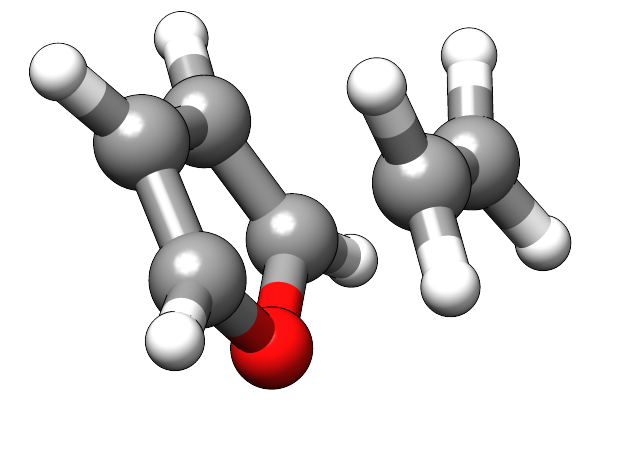

.. _path:

-----------------------
 Reaction Path Methods
-----------------------

.. important::

   This guide refers to the meta-dynamics reaction path finder.
   While this approach is simpler and usually faster than nugded elastic
   band (NEB) methods or growing string methods (GSM) it might not be
   as reliable for more difficult reaction paths.

   See the :ref:`gsm` guide for details on alternative reaction path finders.

.. contents::

Setting up the Path Input
=========================

The meta-dynamics reaction path finder is based on a simple metadynamics bias
potential adding a repulsive potential on the reactant structure and an
attractive potential on the product structure.
If the potential is chosen correctly a straight-forward geometry optimization
should yield the reaction path between reactant and product.

The main difficulty lies in the choice of the correct repulsive and attractive
potential to avoid artificial local minima that will stop the optimization.
To overcome this issue the meta-dynamics reaction path finder will run several
combinations of potential shapes to obtain the reaction path.

A usual invokation of the path finder is given here

.. code-block:: none

   xtb start.xyz --path end.xyz --input path.inp

For this guide we will use the GFN2-xTB since we want to form bonds.

If you want to use GFN-FF, keep in mind, that the GFN-FF can only break bonds,
dissociation reactions will therefore usually work fine, while association
reactions are likely to fail, as the topology is generated for the reactant
geometry.
If you want to model an association try to swap reactant and product and model
the respective dissociation instead or use a quantum mechanical method like
GFN2-xTB instead.

The recommended settings for running the pathfinder can be somewhat system
dependent, a good starting point is this set of values:

.. code-block:: none
   :caption: path.inp

   $path
      nrun=1
      npoint=25
      anopt=10
      kpush=0.003
      kpull=-0.015
      ppull=0.05
      alp=1.2
   $end

Example Run
-----------

A possible input for a Diels-Alder reaction is given here.
The starting structure for this example

.. code-block:: none
   :caption: start.xyz

   15
    
   C   -1.05403119  -0.85921125  -1.07844148
   O   -0.74716995  -1.59204846   0.00037929
   C    1.91999122   0.31825506  -0.65929558
   C   -1.56348463   0.34378897  -0.70923752
   C   -1.05432765  -0.85883374   1.07895685
   C    1.92016161   0.31774885   0.65905212
   C   -1.56373749   0.34366980   0.70888173
   H   -0.86626022  -1.30691107  -2.03849048
   H    2.21980037  -0.54462844  -1.23619995
   H    1.61547946   1.18008308  -1.23636699
   H   -1.89753571   1.13638114  -1.35561033
   H   -0.86679445  -1.30614725   2.03907198
   H    2.21960266  -0.54586684   1.23524723
   H    1.61610877   1.17913244   1.23678680
   H   -1.89780281   1.13623322   1.35526633

The product structure given here

.. code-block:: none
   :caption: end.xyz

   15
    
   C   -0.33650300  -0.52567500  -1.05221900
   O   -0.49920800  -1.44888700   0.00032300
   C    1.08232400   0.03657400  -0.76729600
   C   -1.29917500   0.57935400  -0.66347200
   C   -0.33671300  -0.52527900   1.05252700
   C    1.08262000   0.03575900   0.76715400
   C   -1.29967800   0.57933100   0.66328300
   H   -0.47204500  -0.99959700  -2.02194900
   H    1.84062900  -0.63339500  -1.16910900
   H    1.22478200   1.02637400  -1.19722100
   H   -1.79017300   1.24152200  -1.35666900
   H   -0.47213100  -0.99881000   2.02246200
   H    1.84129300  -0.63425300   1.16825900
   H    1.22479600   1.02528600   1.19777000
   H   -1.79081700   1.24169700   1.35615700

Running the calculation should yield an output similar to this

.. code-block:: none
   :emphasize-lines: 35

              ------------------------------------------------- 
             |                     P A T H                     |
             |            RMSD-Push/Pull Path Finder           |
              ------------------------------------------------- 
    reading reference structures from end.xyz ...
   reactant product RMSD :    1.010
   initial k push/pull (in code xNat) :    0.003   -0.015
   initial Gaussian width (1/Bohr)    :    1.200
   # refinement runs                  :   1
   # of 'an'-optimization steps       :  10
   # optlevel                         :   0
    
   degenerate system : F 0.260023 0.367379
    24 # points, run   1 for k push/pull/alpha :   0.003  -0.015   1.200      prod-ed RMSD:   0.018
    23 # points, run   2 for k push/pull/alpha :   0.003  -0.013   1.200      prod-ed RMSD:   0.017
    
    path trials (see xtbpath_*.xyz), energies in kcal/mol
   run 1  barrier: 116.09  dE: -25.06  product-end path RMSD:   0.018
   run 2  barrier:  12.52  dE: -25.08  product-end path RMSD:   0.017
   path  2 taken with   23 points.
   screening points ...
   start path on file xtbpath_0.xyz                                                                   
   refinement cycle   1
    optimizing points            2  ...
    optimizing points           10  ...
    optimizing points           20  ...
    
   forward  barrier (kcal)  :    12.420
   backward barrier (kcal)  :    37.497
   reaction energy  (kcal)  :   -25.076
   opt. pull strength       :     0.050
   norm(g) at est. TS, point: 0.01615  11
    
   terminated because max. # cycles reached
   estimated TS on file xtbpath_ts.xyz                                                                  
   path data (pmode=approx. path mode):
   point     drms     energy pmode ovlp pmode grad
      2     0.000    -0.025     0.996  -0.00004
      3     0.066     0.177     0.999   0.00032
      4     0.134     0.570     0.999   0.00062
      5     0.202     1.146     0.999   0.00092
      6     0.269     1.984     0.999   0.00137
      7     0.334     3.094     0.997   0.00179
      8     0.400     4.629     0.995   0.00245
      9     0.466     6.516     0.982   0.00303
     10     0.532     8.988     0.900   0.00373
     11     0.603    12.420     0.939   0.00374
     12     0.700   -12.104     0.772  -0.01147
     13     0.927   -17.963     0.806  -0.01343
     14     0.974   -21.578     0.948  -0.00871
     15     1.018   -23.406     0.612  -0.00549
     16     1.053   -24.364     0.207  -0.00297
     17     1.088   -24.348    -0.080   0.00006
     18     1.117   -24.149    -0.414   0.00084
     19     1.142   -24.574    -0.534  -0.00194
     20     1.165   -24.941    -0.212  -0.00168
     21     1.189   -24.865    -0.748   0.00043
     22     1.208   -25.100    -0.450  -0.00123
     23     1.228   -25.076     0.077   0.00031

The final transition state guess can be found in ``xtbpath_ts.xyz``, depicted here:

