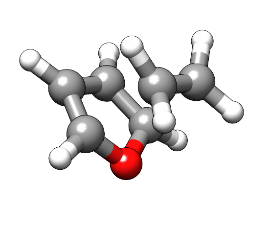

.. _path:

-----------------------
 Reaction Path Methods
-----------------------

.. important::

   This guide refers to the meta-dynamics reaction path finder.
   While this approach is simpler and usually faster than nugded elastic
   band (NEB) methods or growing string methods (GSM) it might not be
   as reliable for more difficult reaction paths.

   See the :ref:`gsm` guide for details on alternative reaction path finders.

.. contents::

Setting up the Path Input
=========================

The meta-dynamics reaction path finder is based on a simple metadynamics bias
potential adding a repulsive potential on the reactant structure and an
attractive potential on the product structure.
If the potential is chosen correctly a straight-forward geometry optimization
should yield the reaction path between reactant and product.

The main difficulty lies in the choice of the correct repulsive and attractive
potential to avoid artificial local minima that will stop the optimization.
To overcome this issue the meta-dynamics reaction path finder will run several
combinations of potential shapes to obtain the reaction path.

A usual invokation of the path finder is given here

.. code-block:: none

   xtb --gfnff start.xyz --path end.xyz --input path.inp

For this guide we will use the GFN-FF as it is fast and the path generation
therefore near instant. Keep in mind, that the GFN-FF can only break bonds,
dissociation reactions will therefore usually work fine, while association
reactions are likely to fail, as the topology is generated for the reactant
geometry.
If you want to model an association try to swap reactant and product and model
the respective dissociation instead or use a quantum mechanical method like
GFN2-xTB instead.

The recommended settings for running the pathfinder can be somewhat system
dependent, a good starting point is this set of values:

.. code-block:: none
   :caption: path.inp

   $path
      nrun=1
      npoint=25
      anopt=10
      kpush=0.003
      kpull=-0.015
      ppull=0.05
      alp=1.2
   $end

Example Run
-----------

A possible input for a Diels-Alder reaction is given here.
The starting structure for this example

.. code-block:: none
   :caption: start.xyz

   15
    
   C   -1.05403119  -0.85921125  -1.07844148
   O   -0.74716995  -1.59204846   0.00037929
   C    1.91999122   0.31825506  -0.65929558
   C   -1.56348463   0.34378897  -0.70923752
   C   -1.05432765  -0.85883374   1.07895685
   C    1.92016161   0.31774885   0.65905212
   C   -1.56373749   0.34366980   0.70888173
   H   -0.86626022  -1.30691107  -2.03849048
   H    2.21980037  -0.54462844  -1.23619995
   H    1.61547946   1.18008308  -1.23636699
   H   -1.89753571   1.13638114  -1.35561033
   H   -0.86679445  -1.30614725   2.03907198
   H    2.21960266  -0.54586684   1.23524723
   H    1.61610877   1.17913244   1.23678680
   H   -1.89780281   1.13623322   1.35526633

The product structure given here

.. code-block:: none
   :caption: end.xyz

   15
    
   C   -0.33650300  -0.52567500  -1.05221900
   O   -0.49920800  -1.44888700   0.00032300
   C    1.08232400   0.03657400  -0.76729600
   C   -1.29917500   0.57935400  -0.66347200
   C   -0.33671300  -0.52527900   1.05252700
   C    1.08262000   0.03575900   0.76715400
   C   -1.29967800   0.57933100   0.66328300
   H   -0.47204500  -0.99959700  -2.02194900
   H    1.84062900  -0.63339500  -1.16910900
   H    1.22478200   1.02637400  -1.19722100
   H   -1.79017300   1.24152200  -1.35666900
   H   -0.47213100  -0.99881000   2.02246200
   H    1.84129300  -0.63425300   1.16825900
   H    1.22479600   1.02528600   1.19777000
   H   -1.79081700   1.24169700   1.35615700

Running the calculation should yield an output similar to this

.. code-block:: none
   :emphasize-lines: 46

              ------------------------------------------------- 
             |                     P A T H                     |
             |            RMSD-Push/Pull Path Finder           |
              ------------------------------------------------- 
    reading reference structures from end.xyz ...
   reactant product RMSD :    1.010
   initial k push/pull (in code xNat) :    0.003   -0.015
   initial Gaussian width (1/Bohr)    :    1.200
   # refinement runs                  :   1
   # of 'an'-optimization steps       :  10
   # optlevel                         :   0
    
   degenerate system : F 0.260023 0.367379
    18 # points, run   1 for k push/pull/alpha :   0.003  -0.015   1.200      prod-ed RMSD:   0.403
    18 # points, run   2 for k push/pull/alpha :   0.005  -0.022   1.200      prod-ed RMSD:   0.345
    19 # points, run   3 for k push/pull/alpha :   0.007  -0.034   1.200      prod-ed RMSD:   0.295
    21 # points, run   4 for k push/pull/alpha :   0.010  -0.051   1.200      prod-ed RMSD:   0.255
    35 # points, run   5 for k push/pull/alpha :   0.015  -0.076   1.200      prod-ed RMSD:   0.219
    42 # points, run   6 for k push/pull/alpha :   0.023  -0.114   1.200      prod-ed RMSD:   0.185
    17 # points, run   1 for k push/pull/alpha :   0.003  -0.015   1.000      prod-ed RMSD:   0.421
    
    path trials (see xtbpath_*.xyz), energies in kcal/mol
   run 1  barrier:  17.97  dE:  17.18  product-end path RMSD:   0.403
   run 2  barrier:  26.58  dE:  26.36  product-end path RMSD:   0.345
   run 3  barrier:  36.99  dE:  36.74  product-end path RMSD:   0.295
   run 4  barrier:  49.35  dE:  47.69  product-end path RMSD:   0.255
   run 5  barrier:  65.06  dE:  60.90  product-end path RMSD:   0.219
   run 6  barrier:  93.33  dE:  77.75  product-end path RMSD:   0.185
   run 7  barrier:  15.73  dE:  14.87  product-end path RMSD:   0.421
   path  6 taken with   42 points.
   screening points ...
   new # points : 22
   start path on file xtbpath_0.xyz                                                                   
   refinement cycle   1
    optimizing points            2  ...
    optimizing points           10  ...
    optimizing points           20  ...
    
   forward  barrier (kcal)  :    77.745
   backward barrier (kcal)  :     0.000
   reaction energy  (kcal)  :    77.745
   opt. pull strength       :     0.050
   norm(g) at est. TS, point: 0.08064  19
    
   terminated because max. # cycles reached
   estimated TS on file xtbpath_ts.xyz                                                                  
   path data (pmode=approx. path mode):
   point     drms     energy pmode ovlp pmode grad
      2     0.000    -1.590     0.930  -0.00220
      3     0.077    -1.349     0.991   0.00036
      4     0.149    -0.939     1.000   0.00061
      5     0.220    -0.326     1.000   0.00092
      6     0.291     0.560     0.991   0.00133
      7     0.362     1.726     0.915   0.00180
      8     0.430     3.244     0.937   0.00250
      9     0.495     5.181     0.987   0.00316
     10     0.560     7.641     0.940   0.00405
     11     0.625    10.590     0.807   0.00458
     12     0.693    14.099     0.532   0.00641
     13     0.751    17.975     0.642   0.00698
     14     0.810    22.543    -0.007   0.01109
     15     0.854    25.963    -0.046   0.00673
     16     0.908    25.377    -0.247  -0.00139
     17     0.953    27.441    -0.029   0.00435
     18     1.003    29.220    -0.562   0.00370
     19     1.054    31.613    -0.361   0.00535
     20     1.102    27.815    -0.402  -0.00793
     21     1.153    28.778    -0.094   0.00283
     22     1.189    77.745     0.304   0.03345   

The final transition state guess can be found in ``xtbpath_ts.xyz``, depicted here:

