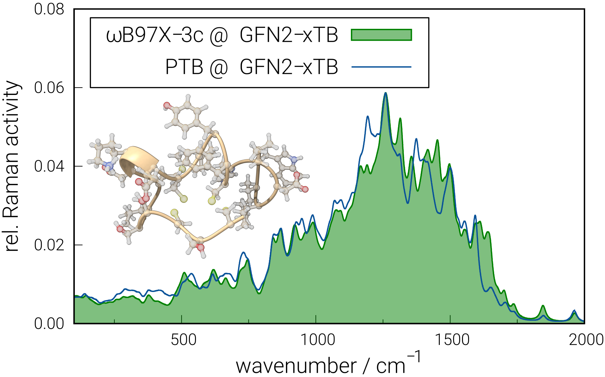
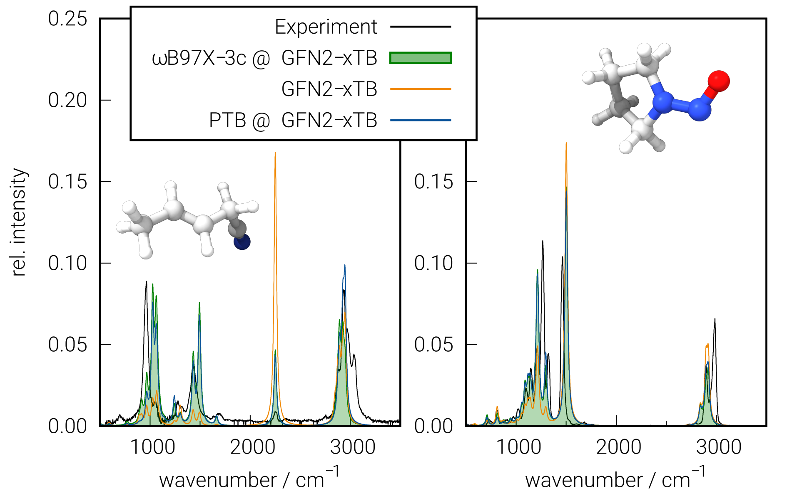

.. _ptb:

-------
 PTB
-------

Introducing PTB
========================
``PTB`` stands for density (**P**) tight-binding (**TB**), a method that emulates the density matrix of a :math:`{\omega}`\ B97X-3c range-separated hybrid DFT calculation (see also below).

   .. figure:: ../figures/ptb_cover_image.png
      :align: center

PTB can be used out-of-the-box to various electronic structure properties for molecules composed of all spd-block elements up to *Z=86*.
The key improvement is the substitution of commonly used minimal atomic orbital basis sets with an extended and properly polarized basis set (vDZP).
Its main purpose is to provide extremely fast the one-particle electronic density matrix **P** and derived properties, such as atomic charges, shell populations, dipole moments, and geometric derivatives as well as static dipole polarizabilities.
For a wide range of molecules from various chemical compound classes (organic, inorganic, transition metal complexes, clusters, and aggregates), including multiple anions/cations, excellent agreement between PTB and :math:`{\omega}`\ B97X-3c computed properties is obtained.
Typical RMSDs are 0.02 e\ :sup:`-` for atomic charges or shell populations, with deviations of approximately 5% to 10% for dipole moments and polarizabilities.
Artificial charge transfer, such as in zwitterions, or SCF convergence issues in electronically challenging small-gap systems is largely avoided, which also results from the applied non-iterative, two-step diagonalization scheme.
No energy expression is available currently, and the entire development was focused on reproducing the DFT density matrix and some of its response features as accurately as possible.

PTB has been published in `The Journal of Chemical Physics <https://doi.org/10.1063/5.0137838>`_:

      Grimme, S.; Müller, M.; Hansen, A. A Non-Self-Consistent Tight-Binding Electronic Structure Potential in a Polarized Double-ζ Basis Set for All *spd*-Block Elements up to *Z* = 86. *J. Chem. Phys.* 2023, **158** (12), 124111. DOI: `10.1063/5.0137838 <https://doi.org/10.1063/5.0137838>`_

For further information on :math:`{\omega}`\ B97X-3c, see:
`Müller, M.; Hansen, A.; Grimme, S. J. Chem. Phys. 2023, 158 (1), 014103
<https://doi.org/10.1063/5.0133026>`_.

Basic usage
============================
PTB is implemented in the ``xtb`` program.
It extends the portfolio of the package by the non-self-consistent density tight-binding method PTB. It is invoked with the keyword ``--ptb`` as shown in the example below.

.. tab-set:: 

   .. tab-item:: CLI input

      .. code-block:: none

         > xtb coord.xyz --ptb --json

   .. tab-item:: coord.xyz

      .. figure:: ../figures/benzene_dimer.png
         :width: 75%
         :alt: A cofacial NCI complex of benzene and nitrobenzene for testing PTB.

         A cofacial NCI complex of benzene and nitrobenzene for testing PTB.

      .. code-block:: none

         26

         C         -1.20618        0.69599        1.75211
         C         -1.20379       -0.70017        1.75215
         C          0.00616       -1.39690        1.75210
         C          1.21824       -0.70002        1.75171
         C          1.23033        0.70989        1.75117
         C          0.00125        1.40067        1.75172
         H          2.14504       -1.25925        1.74975
         H         -0.02278        2.48280        1.74976
         H         -2.14520        1.23405        1.75041
         H         -2.14028       -1.24255        1.75044
         H          0.00554       -2.47919        1.75040
         C         -1.21072        0.69984       -1.75114
         C         -1.21074       -0.69902       -1.75149
         C          0.00072       -1.39843       -1.75114
         C          1.21220       -0.69897       -1.75037
         C          1.21222        0.69988       -1.74995
         C          0.00077        1.39929       -1.75036
         H          2.14941       -1.24008       -1.74839
         H          2.14945        1.24099       -1.74755
         H          0.00077        2.48148       -1.74837
         H         -2.14799        1.24091       -1.74971
         H         -2.14800       -1.24014       -1.75028
         H          0.00066       -2.48066       -1.74972
         N          2.46723        1.42685        1.74737
         O          2.47280        2.62117        1.74468
         O          3.50640        0.83800        1.74471

   .. tab-item:: Standard output

      .. code-block:: none

                    -------------------------------------------------
                   |                      P T B                      |
                    -------------------------------------------------

                 Reference                      10.1063/5.0137838

          @@@@@@@@@@@@@@@@@@@@@@@@@@@@@
          @,,,,,,,,,,,,,,,,,,,,,,,,,,,,@@
          @,,,,,,,,,,,,,,,,,,,,,,,,,,,,,,,,@
          @,,,,,,,,,,,,,,,,,,,,,,,,,,,,,,,,,*
          @,,,,,,,,@///////////////#,,,,,,,,,@
          @,,,,,,,,@/////////////////,,,,,,,,(
          @,,,,,,,,@/////////////////,,,,,,,,(
          @,,,,,,,,@/////////////////,,,,,,,,(
          @,,,,,,,,@/////////////////,,,,,,,,(
          @,,,,,,,,@/////////////////,,,,,,,,(
          @,,,,,,,,@/////////////////,,,,,,,,(
          @,,,,,,,,@////////////////@,,,,,,,,@
          @,,,,,,,,,,,,,,,,,,,,,,,,,,,,,,,,,,%   @@@@@@@@@@@@@@@@@@   @@@@@@@@@@@@@@
          @,,,,,,,,,,,,,,,,,,,,,,,,,,,,,,,,&////@,,,,,,,,,,,,,,,,,///@,,,,,,,,,,,,,,@
          @,,,,,,,,,,,,,,,,,,,,,,,,,,,,,@///////@,,,,,,,,,,,,,,,,,,//@,,,,,,,,,,,,,,,,@
          @,,,,,,,,@///////////////////////////////////@,,,#/////////@,,,@////////*,,,@
          @,,,,,,,,@/////////@ ////////////////////////@,,,#/////////@,,,@////////*,,,@
          @,,,,,,,,@///// %@@  ( @@@ (@ @@@ @//////////@,,,#/////////@,,,@////////*,,,@
          @,,,,,,,,@////( @//@ ( @@@ @@ @//.@//////////@,,,#/////////@,,,,,,,,,,,,,,,*
          @,,,,,,,,@///// @//@ ( @////@ @//.@//////////@,,,#/////////@,,,,,,,,,,,,,,,,@
          @,,,,,,,,@//////@@@@@/(@@@@/@@@//@@//////////@,,,#/////////@,,,@////////(,,,,@
          @,,,,,,,,@///////////#@@/ @//////////////////@,,,#/////////@,,,@/////////,,,,@
          @,,,,,,,,@//// .@@/(/# @@ @@/@ /// @/////////@,,,#/////////@,,,@/////////,,,,@
          @,,,,,,,,@////%    @/# @/ @//@ /// @/////////@,,,#/////////@,,,@////////@,,,,@
          @,,,,,,,,@////////@ /# @/ @//@ /// @/////////@,,,#/////////@,,,,,,,,,,,,,,,,@
          &@@@@@@@@@/////@@@@//(@@/#@@(/#@@@ @
                                       @@@ @

                   ...................................................
                   :                      SETUP                      :
                   :.................................................:
                   :  # atomic orbitals                 250          :
                   :  # shells                          108          :
                   :  # electrons                        76          :
                   :  # open shells                       0          :
                   :  max. iterations                     2          :
                   :  Hamiltonian                       PTB          :
                   :  PC potential                    false          :
                   :  electronic temp.          300.0000000     K    :
                   :  -> integral cutoff          0.2500000E+02      :
                   :  verbosity level                     2          :
                   ...................................................

                   --- Calculation progress: ---
                       1st iteration...
                       2nd iteration...
                   --- Two-step SCF done. ---

                    -------------------------------------------------
                   |                Property Printout                |
                    -------------------------------------------------

             * Orbital Energies and Occupations

                  #    Occupation            Energy/Eh            Energy/eV
               -------------------------------------------------------------
                  1        2.0000           -1.4335353             -39.0085
                ...           ...                  ...                  ...
                 26        2.0000           -0.5045711             -13.7301
                 27        2.0000           -0.5040396             -13.7156
                 28        2.0000           -0.4808924             -13.0857
                 29        2.0000           -0.4722708             -12.8511
                 30        2.0000           -0.4561747             -12.4131
                 31        2.0000           -0.4557899             -12.4027
                 32        2.0000           -0.4309614             -11.7271
                 33        2.0000           -0.4259563             -11.5909
                 34        2.0000           -0.4044794             -11.0064
                 35        2.0000           -0.3964229             -10.7872
                 36        2.0000           -0.3947316             -10.7412
                 37        2.0000           -0.3670100              -9.9869
                 38        2.0000           -0.3665408              -9.9741 (HOMO)
                 39                         -0.0239028              -0.6504 (LUMO)
                 40                          0.0361502               0.9837
                 41                          0.0638157               1.7365
                 42                          0.0661394               1.7997
                 43                          0.1022883               2.7834
                 44                          0.1226305               3.3369
                 45                          0.1550123               4.2181
                 46                          0.2012073               5.4751
                 47                          0.2105286               5.7288
                 48                          0.2372001               6.4545
                 49                          0.2389287               6.5016
                ...                                ...                  ...
                250                       1880.0926856           51159.9260
               -------------------------------------------------------------
                           HL-Gap            0.3426379 Eh            9.3237 eV
                      Fermi-level            0.0000000 Eh            0.0000 eV

             * Atomic partial charges (q)     Shell populations (p)
             ------------------------------------------------------------------------------------
               #  sym   q                     1          2          3          4          5
             ------------------------------------------------------------------------------------
               1  C    -0.02580               0.56624    0.25826    2.14868    0.77647    0.27615
               2  C    -0.01955               0.56946    0.25888    2.13958    0.76848    0.28315
               3  C    -0.02579               0.56627    0.25829    2.14863    0.77652    0.27608
               4  C    -0.00674               0.57136    0.26101    2.13410    0.76488    0.27539
               5  C    -0.01140               0.56315    0.24359    2.13512    0.71189    0.35765
               6  C    -0.00687               0.57136    0.26099    2.13427    0.76482    0.27544
               7  H     0.05450               0.66023    0.14231    0.14297
               8  H     0.05446               0.66025    0.14231    0.14298
               9  H     0.05064               0.66417    0.14119    0.14400
              10  H     0.04931               0.66558    0.14146    0.14366
              11  H     0.05064               0.66417    0.14120    0.14399
              12  C    -0.04504               0.56668    0.25975    2.14638    0.78730    0.28493
              13  C    -0.04650               0.56670    0.25972    2.14711    0.78765    0.28531
              14  C    -0.04508               0.56668    0.25975    2.14641    0.78730    0.28493
              15  C    -0.03969               0.56642    0.25979    2.14367    0.78616    0.28365
              16  C    -0.03467               0.56633    0.25982    2.14085    0.78496    0.28271
              17  C    -0.03968               0.56643    0.25979    2.14367    0.78616    0.28363
              18  H     0.04302               0.66835    0.14362    0.14502
              19  H     0.04581               0.66728    0.14289    0.14402
              20  H     0.04301               0.66836    0.14361    0.14502
              21  H     0.04078               0.66938    0.14399    0.14585
              22  H     0.04037               0.66955    0.14405    0.14602
              23  H     0.04076               0.66940    0.14399    0.14585
              24  N     0.09115               0.72096    0.24406    2.47323    0.78151    0.68909
              25  O    -0.12891               1.16607    0.40893    3.39118    1.05904    0.10369
              26  O    -0.12874               1.16608    0.40896    3.39091    1.05912    0.10367
             ------------------------------------------------------------------------------------
               total:   0.00000

         Wiberg/Mayer (AO) data.
         largest (>0.10) Wiberg bond orders for each atom

          ---------------------------------------------------------------------------
              #   Z sym  total        # sym  WBO       # sym  WBO       # sym  WBO
          ---------------------------------------------------------------------------
              1   6 C    3.965 --     6 C    1.445     2 C    1.429     9 H    0.989
              2   6 C    3.977 --     1 C    1.429     3 C    1.429    10 H    0.993
              3   6 C    3.965 --     4 C    1.445     2 C    1.429    11 H    0.989
              4   6 C    3.967 --     3 C    1.445     5 C    1.403     7 H    0.982
              5   6 C    4.006 --     4 C    1.403     6 C    1.403    24 N    1.052
              6   6 C    3.967 --     1 C    1.445     5 C    1.403     8 H    0.982
              7   1 H    1.016 --     4 C    0.982
              8   1 H    1.016 --     6 C    0.982
              9   1 H    1.035 --     1 C    0.989
             10   1 H    1.038 --     2 C    0.993
             11   1 H    1.035 --     3 C    0.989
             12   6 C    3.992 --    13 C    1.441    17 C    1.440    21 H    0.993
             13   6 C    3.994 --    12 C    1.441    14 C    1.441    22 H    0.994
             14   6 C    3.992 --    13 C    1.441    15 C    1.440    23 H    0.993
             15   6 C    3.987 --    14 C    1.440    16 C    1.439    18 H    0.991
             16   6 C    3.980 --    15 C    1.439    17 C    1.439    19 H    0.988
             17   6 C    3.987 --    12 C    1.440    16 C    1.439    20 H    0.991
             18   1 H    1.038 --    15 C    0.991
             19   1 H    1.033 --    16 C    0.988
             20   1 H    1.038 --    17 C    0.991
             21   1 H    1.041 --    12 C    0.993
             22   1 H    1.042 --    13 C    0.994
             23   1 H    1.041 --    14 C    0.993
             24   7 N    4.311 --    26 O    1.621    25 O    1.621     5 C    1.052
             25   8 O    1.880 --    24 N    1.621    26 O    0.198
             26   8 O    1.880 --    24 N    1.621    25 O    0.198
          ---------------------------------------------------------------------------

         Topologies differ in total number of bonds
         Writing topology from bond orders to xtbtopo.mol

          --------------------------------------
             Molecular dipole moment (a.u.)
             X        Y        Z
          --------------------------------------
            -1.6560  -0.9605   0.0032
          --------------------------------------
             Total dipole moment (a.u. / Debye):
             1.9144   4.8658

          --------------------------------------
             Molecular quadrupole tensor: (a.u.)
                  X         Y         Z
             X   -4.6099
             Y  -18.7964    6.5225
             Z  -17.6585  -10.2393   -1.9126

   .. tab-item:: JSON output

      .. code-block:: none

         {
            "total energy":           0.00000000,
            "HOMO-LUMO gap / eV":           9.32365300,
            "electronic energy":           0.00000000,
            "dipole / a.u.": [    -1.65595034,    -0.96050070,     0.00324936],
            "partial charges": [
                -0.02580418,
                -0.01955062,
                -0.02578955,
                -0.00673978,
                -0.01139657,
                -0.00687004,
                 0.05449601,
                 0.05446298,
                 0.05064076,
                 0.04930957,
                 0.05064248,
                -0.04504331,
                -0.04650347,
                -0.04507944,
                -0.03968609,
                -0.03467388,
                -0.03967838,
                 0.04301740,
                 0.04581142,
                 0.04301236,
                 0.04078359,
                 0.04037447,
                 0.04075952,
                 0.09114600,
                -0.12890616,
                -0.12873510],
            "shell charges": [
            [    -0.00957618,    -0.00706229,    -0.04112235,    -0.01900655,     0.05096319],
            [    -0.01279822,    -0.00767786,    -0.03201783,    -0.01101893,     0.04396222],
            [    -0.00960229,    -0.00708624,    -0.04107428,    -0.01905729,     0.05103056],
            [    -0.01469682,    -0.00980551,    -0.02654501,    -0.00741039,     0.05171796],
            [    -0.00648151,     0.00761632,    -0.02756281,     0.04557390,    -0.03054247],
            [    -0.01469601,    -0.00978240,    -0.02671271,    -0.00735074,     0.05167182],
            [     0.03241257,    -0.00070811,     0.02279154],
            [     0.03239064,    -0.00070551,     0.02277785],
            [     0.02847477,     0.00040602,     0.02175998],
            [     0.02706603,     0.00014321,     0.02210034],
            [     0.02847696,     0.00040179,     0.02176373],
            [    -0.01001242,    -0.00854798,    -0.03882204,    -0.02983659,     0.04217572],
            [    -0.01003868,    -0.00851992,    -0.03955334,    -0.03018934,     0.04179781],
            [    -0.01001808,    -0.00854912,    -0.03885175,    -0.02983662,     0.04217614],
            [    -0.00975838,    -0.00858791,    -0.03610517,    -0.02869582,     0.04346118],
            [    -0.00966665,    -0.00861631,    -0.03329379,    -0.02749367,     0.04439655],
            [    -0.00976372,    -0.00858896,    -0.03610916,    -0.02869079,     0.04347425],
            [     0.02429422,    -0.00201553,     0.02073871],
            [     0.02536325,    -0.00128692,     0.02173510],
            [     0.02428199,    -0.00201121,     0.02074158],
            [     0.02325873,    -0.00238696,     0.01991182],
            [     0.02308916,    -0.00245145,     0.01973676],
            [     0.02324259,    -0.00239520,     0.01991213],
            [     0.07527729,     0.07343734,     0.26312472,     0.19945280,    -0.52014616],
            [    -0.08146427,    -0.02758942,    -0.06355142,     0.07033950,    -0.02664057],
            [    -0.08147586,    -0.02761816,    -0.06328206,     0.07026077,    -0.02661980]],
            "bond orders": [
         ,
            [     1,    2,  1.4289],
            [     1,    4,  0.0771],
            [     1,    6,  1.4452],
            [     1,    9,  0.9892],
            [     1,   11,  0.0135],
            [     2,    3,  1.4289],
            [     2,    5,  0.0709],
            [     2,    7,  0.0135],
            [     2,    8,  0.0135],
            [     2,   10,  0.9926],
            [     3,    4,  1.4452],
            [     3,    6,  0.0771],
            [     3,    9,  0.0135],
            [     3,   11,  0.9892],
            [     4,    5,  1.4031],
            [     4,    7,  0.9819],
            [     4,    8,  0.0135],
            [     4,   10,  0.0135],
            [     4,   25,  0.0298],
            [     5,    6,  1.4030],
            [     5,    9,  0.0133],
            [     5,   11,  0.0133],
            [     5,   24,  1.0518],
            [     5,   25,  0.0195],
            [     5,   26,  0.0195],
            [     6,    7,  0.0135],
            [     6,    8,  0.9819],
            [     6,   10,  0.0135],
            [     6,   26,  0.0298],
            [    12,   13,  1.4414],
            [    12,   15,  0.0823],
            [    12,   17,  1.4404],
            [    12,   19,  0.0136],
            [    12,   21,  0.9934],
            [    12,   23,  0.0138],
            [    13,   14,  1.4414],
            [    13,   16,  0.0823],
            [    13,   18,  0.0137],
            [    13,   20,  0.0137],
            [    13,   22,  0.9937],
            [    14,   15,  1.4405],
            [    14,   17,  0.0823],
            [    14,   19,  0.0136],
            [    14,   21,  0.0138],
            [    14,   23,  0.9934],
            [    15,   16,  1.4389],
            [    15,   18,  0.9908],
            [    15,   20,  0.0137],
            [    15,   22,  0.0138],
            [    16,   17,  1.4389],
            [    16,   19,  0.9881],
            [    16,   21,  0.0138],
            [    16,   23,  0.0138],
            [    17,   18,  0.0137],
            [    17,   20,  0.9908],
            [    17,   22,  0.0138],
            [    24,   25,  1.6205],
            [    24,   26,  1.6207],
            [    25,   26,  0.1977]],
            "atomic dipole moments": [
            [     0.17817237,    -0.08486467,    -0.04392900],
            [     0.14540861,     0.08417827,    -0.04278264],
            [     0.01511332,     0.19675971,    -0.04389043],
            [    -0.13312254,     0.12935626,    -0.04018292],
            [     0.19288286,     0.11173317,    -0.03496594],
            [     0.04602572,    -0.17971285,    -0.04021404],
            [     0.20153653,    -0.11378295,     0.01052811],
            [     0.00160042,     0.23134930,     0.01053943],
            [    -0.21014330,     0.11689540,     0.01051611],
            [    -0.20767197,    -0.12027608,     0.01047094],
            [    -0.00330039,    -0.24047911,     0.01050497],
            [     0.14364790,    -0.09442200,     0.04646228],
            [     0.14775082,     0.08525506,     0.04574296],
            [    -0.00988717,     0.17152388,     0.04651218],
            [    -0.16085752,     0.07853975,     0.04618875],
            [    -0.15928291,    -0.09201357,     0.04788960],
            [    -0.01237952,    -0.17861850,     0.04614049],
            [     0.20393913,    -0.11931464,    -0.00923317],
            [     0.20084041,     0.11598812,    -0.00705150],
            [    -0.00132604,     0.23622454,    -0.00922251],
            [    -0.20820109,     0.11939647,    -0.00910789],
            [    -0.20838147,    -0.12034087,    -0.00917493],
            [    -0.00072895,    -0.23997078,    -0.00911999],
            [     0.08511339,     0.04958329,    -0.01580055],
            [     0.02008492,    -0.59870284,     0.00147451],
            [    -0.50942425,     0.31508169,     0.00145541]],
            "atomic quadrupole moments": [
            [    -0.23483260,     0.35458689,     0.08721839,     0.00404713,    -0.00221582,     0.14761421],
            [    -0.31404269,    -0.32538294,     0.07534445,    -0.00036567,    -0.00033284,     0.23869824],
            [     0.32466627,     0.04769748,    -0.47213648,     0.00021495,     0.00440101,     0.14747021],
            [    -0.20137605,     0.26534859,    -0.05158060,     0.00369766,     0.01287493,     0.25295665],
            [     0.07557700,     0.10609333,    -0.02576532,     0.01046279,     0.00595898,    -0.04981168],
            [     0.14900317,     0.06774764,    -0.40152994,     0.01311216,    -0.00339044,     0.25252677],
            [     0.01254889,     0.09029415,     0.04976636,    -0.02624647,     0.01511978,    -0.06231526],
            [     0.11602428,     0.02847786,    -0.05355800,     0.00002533,    -0.03028812,    -0.06246627],
            [    -0.02997061,     0.08898874,     0.07958685,     0.02520322,    -0.01434626,    -0.04961624],
            [    -0.02365008,    -0.08660731,     0.07219455,     0.02550166,     0.01477689,    -0.04854447],
            [     0.12662694,    -0.00399738,    -0.07710619,     0.00009921,     0.02900232,    -0.04952076],
            [    -0.30006940,     0.30202639,     0.09376142,    -0.00114705,     0.00264928,     0.20630798],
            [    -0.28880250,    -0.30941643,     0.08581319,     0.00000131,    -0.00012030,     0.20298930],
            [     0.26998302,    -0.01227972,    -0.47633316,     0.00185920,    -0.00253625,     0.20635014],
            [    -0.27412905,     0.31742810,     0.07440885,     0.00468830,     0.00165078,     0.19972020],
            [    -0.28631949,    -0.30807791,     0.08539979,     0.01417986,     0.00809755,     0.20091970],
            [     0.27510342,     0.01535060,    -0.47444771,     0.00389347,     0.00302610,     0.19934429],
            [    -0.02455963,     0.08953758,     0.07142463,     0.01809144,    -0.01319294,    -0.04686500],
            [    -0.02258736,    -0.08556863,     0.07278918,     0.01619300,     0.00935858,    -0.05020182],
            [     0.12238760,     0.00168068,    -0.07550214,    -0.00241218,     0.02224940,    -0.04688547],
            [    -0.03381135,     0.09231522,     0.07534668,    -0.02181480,     0.01271313,    -0.04153533],
            [    -0.03241315,    -0.09470785,     0.07339190,    -0.02201384,    -0.01270961,    -0.04097875],
            [     0.12541539,    -0.00265213,    -0.08381623,     0.00011766,    -0.02524766,    -0.04159916],
            [    -0.02351376,    -0.17170182,     0.20003381,     0.02815354,     0.01628303,    -0.17652005],
            [    -0.68178231,    -0.07559419,     1.00107233,    -0.00398393,    -0.00629851,    -0.31929002],
            [     0.52214226,    -0.59650562,    -0.20281034,    -0.00741448,    -0.00034301,    -0.31933192]],
            "number of molecular orbitals": 250,
            "number of electrons": 76,
            "number of unpaired electrons": 0,
            "orbital energies / eV": [
               -39.00848045,
               -30.92408173,
               -29.27753379,
               -27.99909431,
               -25.90152418,
               -24.80824514,
               -23.90248768,
               -23.87258388,
               -23.05138303,
               -20.97789424,
               -20.48867211,
               -20.12048257,
               -20.11544364,
               -18.76695942,
               -17.47736764,
               -17.34381024,
               -17.20541071,
               -17.07185189,
               -16.08872553,
               -15.84927455,
               -15.84807800,
               -15.65614615,
               -15.21613067,
               -14.56330637,
               -14.54742452,
               -13.73007911,
               -13.71561491,
               -13.08574752,
               -12.85114162,
               -12.41314585,
               -12.40267379,
               -11.72705663,
               -11.59086129,
               -11.00644510,
               -10.78721567,
               -10.74119348,
                -9.98685133,
                -9.97408150,
                -0.65042850,
                 0.98369714,
                 1.73651469,
                 1.79974353,
                 2.78340727,
                 3.33694685,
                 4.21809892,
                 5.47513054],
            "fractional occupation": [
                 2.00000000,
                 2.00000000,
                 2.00000000,
                 2.00000000,
                 2.00000000,
                 2.00000000,
                 2.00000000,
                 2.00000000,
                 2.00000000,
                 2.00000000,
                 2.00000000,
                 2.00000000,
                 2.00000000,
                 2.00000000,
                 2.00000000,
                 2.00000000,
                 2.00000000,
                 2.00000000,
                 2.00000000,
                 2.00000000,
                 2.00000000,
                 2.00000000,
                 2.00000000,
                 2.00000000,
                 2.00000000,
                 2.00000000,
                 2.00000000,
                 2.00000000,
                 2.00000000,
                 2.00000000,
                 2.00000000,
                 2.00000000,
                 2.00000000,
                 2.00000000,
                 2.00000000,
                 2.00000000,
                 2.00000000,
                 2.00000000,
                 0.00000000,
                 0.00000000,
                 0.00000000,
                 0.00000000,
                 0.00000000,
                 0.00000000,
                 0.00000000,
                 0.00000000],
            "program call": "xtb_dev benzene_dimer.xyz --ptb --json",
            "method": "PTB",
            "xtb version": "6.7.1 (1779d8a)"
         }

The output as well as the ``JSON`` file contain the following properties:

- orbital energies and occupations
- atomic partial charges
- shell populations
- Wiberg bond orders
- molecular dipole moment
- molecular quadrupole tensor

Vibrational spectroscopy
============================

Infrared and Raman intensity calculations for vibrational spectroscopy are additional applications of PTB.
An example is the spectrum of endothelin (1EDN).

   In all spectra, the notation "Method\ **X** [Method\ **Y**]" indicates that frequencies were computed with Method\ **Y** and intensities with Method\ **X**.
   Within ``xtb``, this procedure is fully automated and requires no additional user input when using the CLI command below.

   Raman activities of the polypeptide endothelin (327 atoms) computed by :math:`{\omega}`\ B97X-3c [GFN2-xTB] and PTB [GFN2-xTB].
   The notation indicates that intensities were calculated with PTB or :math:`{\omega}`\ B97X-3c, while frequencies were computed with GFN2-xTB.
   In this example, Raman activities instead of Raman scattering cross-sections (= intensities) are plotted.

.. note::
   Vibrational frequencies are not available with PTB! Instead, mixed GFN\ *n*-xTB and PTB spectra can be calculated.

The following example shows the output of a vibrational spectrum calculation utilizing GFN2-xTB frequencies and PTB intensities.
 
.. tab-set::

   .. tab-item:: CLI input

      .. code-block:: none

         > xtb coord.xyz --ptb --hess --raman

   .. tab-item:: coord.xyz

      .. code-block:: none

         12

         C         -1.21072        0.69984       -1.75114
         C         -1.21074       -0.69902       -1.75149
         C          0.00072       -1.39843       -1.75114
         C          1.21220       -0.69897       -1.75037
         C          1.21222        0.69988       -1.74995
         C          0.00077        1.39929       -1.75036
         H          2.14941       -1.24008       -1.74839
         H          2.14945        1.24099       -1.74755
         H          0.00077        2.48148       -1.74837
         H         -2.14799        1.24091       -1.74971
         H         -2.14800       -1.24014       -1.75028
         H          0.00066       -2.48066       -1.74972

   .. tab-item:: vibspectrum

      .. code-block:: none

         $vibrational spectrum
         #  mode     symmetry     wave number   IR intensity   Raman activity   Raman scatt. cross-section   selection rules
         #                           (cm⁻¹)      (km*mol⁻¹)      (Å⁴*amu⁻¹)             (Ų*sr⁻¹)              IR     RAMAN
              1                      -0.00         0.00000         0.00000             0.00000E+00              -       - 
              2                      -0.00         0.00000         0.00000             0.00000E+00              -       - 
              3                      -0.00         0.00000         0.00000             0.00000E+00              -       - 
              4                      -0.00         0.00000         0.00000             0.00000E+00              -       - 
              5                       0.00         0.00000         0.00000             0.00000E+00              -       - 
              6                       0.00         0.00000         0.00000             0.00000E+00              -       - 
              7        a            396.50         0.00000         0.00000             0.18961E-20             NO      NO 
              8        a            396.53         0.00000         0.00000             0.33360E-20             NO      NO 
              9        a            579.98         0.00000         1.54626             0.20949E-14             NO      YES
             10        a            580.02         0.00000         1.54429             0.20921E-14             NO      YES
             11        a            670.85         0.00000         0.00000             0.12043E-21             NO      NO 
             12        a            701.48       126.55730         0.00015             0.16106E-18             YES     NO 
             13        a            893.74         0.00061         0.23750             0.18585E-15             NO      YES
             14        a            893.79         0.00069         0.23627             0.18488E-15             NO      YES
             15        a            930.33         0.00000         0.00004             0.29258E-19             NO      NO 
             16        a            930.39         0.00001         0.00004             0.31197E-19             NO      NO 
             17        a            935.21         0.00000         0.00000             0.39056E-21             NO      NO 
             18        a            954.09         0.00000         0.00000             0.18351E-22             NO      NO 
             19        a           1025.26         0.00007        79.02989             0.52065E-13             NO      YES
             20        a           1070.03        15.31859         0.00001             0.35843E-20             YES     NO 
             21        a           1070.11        15.26901         0.00001             0.40505E-20             YES     NO 
             22        a           1170.72         0.00001         0.00004             0.21074E-19             NO      NO 
             23        a           1186.56         0.00000         9.41232             0.51526E-14             NO      YES
             24        a           1186.60         0.00000         9.41073             0.51516E-14             NO      YES
             25        a           1233.84         0.00001         0.00000             0.93316E-21             NO      NO 
             26        a           1305.43         0.00000         0.00001             0.72249E-20             NO      NO 
             27        a           1431.72        18.20659         0.00001             0.28783E-20             YES     NO 
             28        a           1431.79        18.18773         0.00001             0.28429E-20             YES     NO 
             29        a           1542.28         0.00000        10.20802             0.39632E-14             NO      YES
             30        a           1542.41         0.00000        10.21628             0.39659E-14             NO      YES
             31        a           3048.92         0.00061         0.17889             0.24697E-16             NO      YES
             32        a           3052.31         0.00041        85.12880             0.11730E-13             NO      YES
             33        a           3052.40         0.00541        85.28612             0.11751E-13             NO      YES
             34        a           3063.56        22.28601         0.13306             0.18217E-16             YES     YES
             35        a           3063.68        22.38385         0.02186             0.29920E-17             YES     YES
             36        a           3071.51         0.00809       358.17986             0.48815E-13             NO      YES
         $end

In the shown example, omitting the ``--raman`` flag would result in a pure IR spectrum calculation (examples below).
Similar to the basic usage example, also here, ``--json`` can be used to obtain the output (all components of the vibrational spectrum) in ``JSON`` format.

   IR spectra of 3-pentenenitrile and 1-nitrosopyrrolidine.
   The experimental gas phase spectra and the spectra calculated with :math:`{\omega}`\ B97X-3c [GFN2-xTB], full GFN2-xTB, and PTB [GFN2-xTB] are shown.