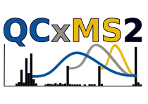

-----------------------
Introduction to QCxMS2
-----------------------

What is *QCxMS2* ?
==================

`QCxMS2` is a quantum chemical (**QC**) based program that enables users to calculate mass spectra (**MS**) 
using automated reaction network discovery. The program is designed to simulate the fragmentation of molecules. 
It is the successor of the QCxMS program, in which fragmentation reactions are simulated via Born-Oppenheimer Molecular Dynamics (**MD**).
The different MS methods of the program are described in short below. A full list of :ref:`qcxms2relatedrefs` is provided elsewhere.

The **QCxMS2** program is available and free-of-charge at the QCxMS2 `GitHub page <https://github.com/grimme-lab/QCxMS2/releases/>`_

MS methods available
====================

Electron Ionization
-------------------

The program was originally developed to calculate Electron Ionization (**EI**) mass spectra, in which a (typically
70 eV) electron beam is focused on a molecule in order to create an *open-shell* radical ion (uneven number of valence electrons). 
This process not only ionizes the molecule, but simultaneously increases the internal energy of the species, which 
in turn leads to bond breaking, fragmentation, rearrangement, etc of the ion. A more detailed description can be 
found in the `original publication`_. 

.. _original publication: https://doi.org/10.26434/chemrxiv-2025-277zm

Dissociative Electron Attachment
--------------------------------

In contrast to the positive ions created by the EI process, the Dissociative Electron Attachment (**DEA**) ionizes the 
molecule under study by adding an electron. This creates a negatively charged ion (*open-shell* ion).

.. note::
    The DEA mode is not yet tested for QCxMS2 but works technically. It should therefore be used with caution.
    The negative ions have to be described by using DFT and diffuse basis functions which increases the computational costs
    significantely.

Collision Induced Dissociation
------------------------------

Ionization of molecules can be done by (de)protonation, *e.g.*, by the popular electrospray ionization (ESI) method. 
This ionization process produces *closed-shell* ions (even number of valence electrons) and is softer than the EI or DEA methods.
It is often implemented by (de-)protonation of the molecule under study, leading to positivly or negativly charged
molecular ions. The following Collision Induced Dissociation (**CID**) leads to a spectrum normally under lower energy conditions than in 
the other MS methods. 

.. note::
    A special CID mode is not yet implemented for QCxMS2. However, the EI mode can be used to simulate CID spectra.
    However, special settings for the energy distribution (probably lower than the default settings for EI-MS) 
    should be tested to reproduce experimental spectra.
    Investigations on the ability of QCxMS2 to simulate CID spectra are ongoing. For now, we recommend to use the
    predecessor QCxMS :ref:`qcxms` for CID simulations.