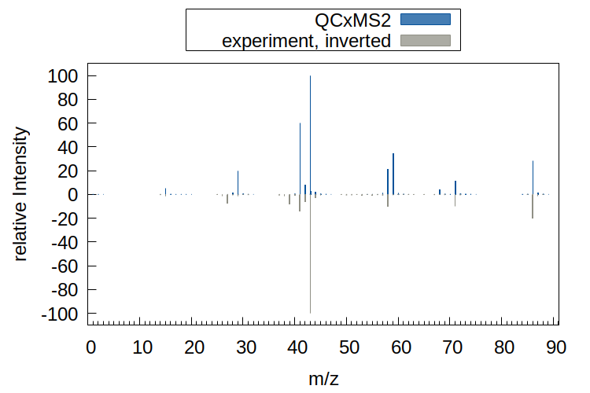

.. _qcxms2_example:

--------------
Example Usage
--------------

``QCxMS2`` is usually invoked via command line, and requires only a coordinate input file in xyz file format.

.. code::

   qcxms2 [INPUT] [OPTIONS]

.. note:: Especially for larger molecules, the conformation of the input molecule can have a significan impact on the generated reaction network.
   It is recommended to use a conformational search tool to generate a set of conformers at the respective charge of the QCxMS2 calculation 
   and use the most stable one as input for QCxMS2.
   Using `crest <https://github.com/crest-lab/crest>`_ is recommended for this. 

    

The default settings provided in QCxMS2 are a good starting point for the calculations.
The default setting is performing an `EI`_ calculation.
To change the behavior of the program, keywords have to be provided via command line flags.

.. note::
  The default values are **not always** giving the best results, but are set to cover the majority of systems.  
  Molecules have different characteristics that can significantely influence the outcome. 
  Changing the input settings can improve upon the final result, e.g. decreasing the molecular ion peak abundance or
  producing more low *m/z* fragments.

For more details on the different settings that can be set in a QCxMS2 calculation, see section :ref:`qcxms2_run`.   

EI - positive Ion Electron Ionization
-------------------------------------
.. _EI:

Calculation of the electron ionization mass spectrum (EI-MS) is the default setting of QCxMS2. In this example,
we compute the EI-MS at 70 eV for 2-pentanone.
We use 16 CPU cores (``-T 16``) to speed up the calculation. Geometries, reaction barriers and energies and Ionizaion potentials are calculated
at the GFN2-xTB level of theory.

First we generate the input molecule in xyz format and search for the most stable conformer at the charge of the calculation.

 .. code::

      crest in.xyz -T 16 --chrg 1

      cp crest_best.xyz in.xyz  

   
The QCxMS2 calculation is then started with the following command:

.. tab-set::

    .. tab-item:: command

        .. code:: bash

            qcxms2 in.xyz -T 16  
    
    .. tab-item:: input

        .. code:: text

         16
          energy: -19.369243382271 gnorm: 0.000059854204 xtb: 6.7.1 (c3cfd38)
         C           -2.29405560010000       -0.27259858260000       -0.04531328360000
         C           -0.85954151760000        0.13277118300000        0.03148097580000
         H            2.24425572750000        0.53480936730000        1.23713232400000
         H            2.96327249650000        0.83035531710000       -0.38177427930000
         H            1.31387583970000        1.35087511890000       -0.01066709370000
         H           -2.93292965850000        0.59208722380000        0.12637019020000
         H           -2.48111111390000       -0.64731393490000       -1.05423159230000
         H           -2.52058929890000       -1.07062880960000        0.65758710200000
         C            0.10120807380000       -1.03484257470000        0.26200375960000
         H            1.40410160480000       -0.72810178930000       -1.43884752540000
         O           -0.47850220350000        1.26211030440000       -0.06582215180000
         C            1.45928778880000       -0.72962759280000       -0.34614099520000
         H            0.16276621020000       -1.12030023870000        1.35329069430000
         H           -0.32390361780000       -1.95834270590000       -0.12964936090000
         C            2.06708660020000        0.54100991220000        0.16232423460000
         H            2.11763590860000       -1.57227915380000       -0.08124961590000

    .. tab-item:: output

        .. code:: text

               -----------------------------------------------------------      
               |                   =====================                   |     
               |                   =       QCxMS2      =                   |     
               |                   =====================                   |     
               |                      J. Gorges                            |     
               |                      S. Grimme                            |     
               |          Mulliken Center for Theoretical Chemistry        |     
               |                    University of Bonn                     |     
                -----------------------------------------------------------      
          
             * QCxMS2 version 1.0.0 (24729a4) compiled by 'gorges@joey' on 2025-01-20
             QCxMS2 is free software: you can redistribute it and/or modify it under
             the terms of the GNU Lesser General Public License as published by
             the Free Software Foundation, either version 3 of the License, or
             (at your option) any later version.
             
             QCxMS2 is distributed in the hope that it will be useful,
             but WITHOUT ANY WARRANTY; without even the implied warranty of
             MERCHANTABILITY or FITNESS FOR A PARTICULAR PURPOSE.  See the
             GNU Lesser General Public License for more details.
             
          
           Command line input:
           > qcxms2 in.xyz -T 16
          
          input file given: in.xyz
          Settings:
          ************************************************************
                      + Positive Ion mode +
          IEE distribution: poisson                                                                         
          width of IEE distribution (eimpw) is:  0.10
          energy per atom (ieeatm) is:  0.80 eV
          eimp0 is: 70.00 eV
           spectral mode: EI-MS
          QM methods used:
            Level for geometry optimizations and path searches: gfn2
            Level for reaction energy and barrier calculations: gfn2
            Level for IP prescreening: gfn2
           Runtime settings used:
           Number of cores used: 16
           Number of allowed subsequent fragmentations: 6
           Intensity threshold for further fragmentation: 1.00%
          ************************************************************
           External programs used:
          /home/mctc/software/xtb_qcxms2/6.7.1_dev/bin/xtb
          /home/mctc/software/crest_qcxms2/3.0.2_dev/bin/crest
          /home/mctc/software/orca/6.0.1/orca
          xtb path set for orca: /home/mctc/software/xtb_qcxms2/6.7.1_dev/bin/xtb
          /home/mctc/software/mambaforge3/23.11.0/envs/qcxms2/bin/molbar
          /home/mctc/software/mambaforge3/23.11.0/envs/qcxms2/bin/geodesic_interpolate
          
          
           Optimizing starting structure at the gfn2 level
           Compute IP at level gfn2
           1 2 
          
          IP of input molecule is    13.057 eV
           Average temperature set to        3536  K
           Generate energy distribution for IEE
           Poisson distribution to approximate IEE
          
           --------------------------------
           | Starting first fragmentation |
           --------------------------------
          
          Generate new fragments with CREST within energy window of    885.53 kcal/mol
           crestcall is: 
           crest infrag.xyz --msreact --mslargeprint --msnbonds 3 --chrg 1 --uhf 1 --T 16 
           --gfn2 --ewin  885.52508 --msnshifts 0 --msnshifts2 0 --msattrh --msmolbar --ms
           input crestms.inp > msreact.out 2>cresterror.out
                    26 
            new fragment pairs 'pairs.xyz' and 'isomers.xyz' were generated and written to
            pXX directories
                    26  fragment structures fragment.xyz were written to pXXfX directories
          Time spent for MSREACT calculation:       35.1s
           Generated fragments were read from msreact.out
           Number of generated fragments and isomers is          24          14
           starting           14  GFN-FF optimizations in parallel before topology check
           1 2 3 4 5 6 7 8 9 10 11 12 13 14 
          
           starting           14  topo calculations in parallel:
           1 2 3 4 5 6 7 8 9 10 11 12 13 14 
           Check product topology after optimization
           1 2 3 4 5 6 7 8 9 10 11 12 13 14 
           p16 is a duplicate of p15
                    16  is a duplicate of           15
          
           remaining number of products is:           25
           starting           40 gfn2 optimizations in parallel
           1 2 3 4 5 6 7 8 9 10 11 12 13 14 15 16 17 18 19 20 21 22 23 24 25 26 27 28 29 30 31 32 33 34 35 36 37 38 39 40 
           starting            0 gfn2restarted optimizations in parallel
          
           remaining number of products is:           25
           Computing statistical charges via Delta SCF procedure
           starting           48 gfn2 calculations in parallel
           1 2 3 4 5 6 7 8 9 10 11 12 13 14 15 16 17 18 19 20 21 22 23 24 25 26 27 28 29 30 31 32 33 34 35 36 37 38 39 40 41 42 43 44 45 46 47 48 
           starting            0 gfn2restart IP calculations in parallel
          
           remaining number of products is:           25
          Time spent for IP calculation:        0.6s
          
           Optimizing products at assigned charge
           starting           13 gfn2 optimizations in parallel
           1 2 3 4 5 6 7 8 9 10 11 12 13 
           starting            0 gfn2 restarted optimizations in parallel
           Check product topology after optimization
           1 2 3 4 5 6 7 8 9 10 11 12 13 
                     9  is a duplicate of            0
          
          
           remaining number of products is:           24
           Computing reaction energy of fragmentation
           Starting           12  fragment pair calculations in parallel at gfn2 level
           1 2 3 4 5 6 7 8 9 10 11 12 
           Starting            0  restart product calculations in parallel at gfn2 level
          
           Starting           36  SPH calculations in parallel at gfn2 level
           1 2 3 4 5 6 7 8 9 10 11 12 13 14 15 16 17 18 19 20 21 22 23 24 25 26 27 28 29 30 31 32 33 34 35 36 
           Starting            0  restart SPH calculations in parallel at gfn2 level
          
           Sorting out fragmentpairs which are too high in energy
          Internal energy of H-diss to fragpair p11 scaled with 0.50
          Internal energy of H-diss to fragpair p20 scaled with 0.50
          Internal energy of H-diss to fragpair p22 scaled with 0.50
          Internal energy of H-diss to fragpair p24 scaled with 0.50
           remaining number of products is:           24
           from           24  fragment pairs           24  are left after sorting step
           Remaining Pairs:          24
           Search for transition states for          24  pairs
           1 2 3 4 5 6 7 8 9 10 11 12 13 14 15 16 17 18 19 20 21 22 23 24 
           Starting           24  neb transition state searches
           1 2 3 4 5 6 7 8 9 10 11 12 13 14 15 16 17 18 19 20 21 22 23 24 
          Time spent for path search and barrier calculation:      313.5s
           Retry NEB searches for            1  pairs
           1 
           WARNING: more than one maximum in path, but we take highest one
           WARNING: more than one maximum in path, but we take highest one
           WARNING: more than one maximum in path, but we take highest one
           WARNING: more than one maximum in path, but we take highest one
           WARNING: more than one maximum in path, but we take highest one
           WARNING: more than one maximum in path, but we take highest one
           WARNING: more than one maximum in path, but we take highest one
           WARNING: more than one maximum in path, but we take highest one
           WARNING: more than one maximum in path, but we take highest one
           WARNING: more than one maximum in path, but we take highest one
           WARNING: more than one maximum in path, but we take highest one
           WARNING: more than one maximum in path, but we take highest one
           WARNING: more than one maximum in path, but we take highest one
           WARNING: more than one maximum in path, but we take highest one
           WARNING: more than one maximum in path, but we take highest one
           WARNING: more than one maximum in path, but we take highest one
           WARNING: more than one maximum in path, but we take highest one
           WARNING: more than one maximum in path, but we take highest one
           remaining number of products is:           24
           Number of succesfull ts searches is           24
           Starting           24  gfn2 First Hessian calculations
           1 2 3 4 5 6 7 8 9 10 11 12 13 14 15 16 17 18 19 20 21 22 23 24 
           Identifying IRC mode
           IRC MODE found! mode            1  with   -866.777500000000     
           Identifying IRC mode
           IRC MODE found! mode            1  with   -1902.34670000000     
           Identifying IRC mode
           IRC MODE found! mode            1  with   -1759.99720000000     
           Identifying IRC mode
           IRC MODE found! mode            1  with   -558.713100000000     
           Identifying IRC mode
           IRC MODE found! mode            1  with   -1023.87980000000     
           Identifying IRC mode
           have to continue search
           IRC MODE found! mode            2  with   -182.698800000000     
           Identifying IRC mode
           IRC MODE found! mode            1  with   -1107.70280000000     
           Identifying IRC mode
           IRC MODE found! mode            1  with   -1154.44550000000     
           Identifying IRC mode
           have to continue search
           IRC MODE found! mode            2  with   -121.474800000000     
           Identifying IRC mode
           IRC MODE found! mode            1  with   -970.919900000000     
           Identifying IRC mode
           IRC MODE found! mode            1  with   -198.722800000000     
           Identifying IRC mode
           IRC MODE found! mode            1  with   -142.899000000000     
           Identifying IRC mode
           IRC MODE found! mode            1  with   -823.333400000000     
           Identifying IRC mode
           IRC MODE found! mode            1  with   -879.723200000000     
           Identifying IRC mode
           IRC MODE found! mode            1  with   -943.845600000000     
           Identifying IRC mode
           IRC MODE found! mode            1  with   -161.584500000000     
           Identifying IRC mode
           have to continue search
           IRC MODE found! mode            2  with   -58.9807000000000     
           Identifying IRC mode
           IRC MODE found! mode            1  with   -114.434500000000     
           Identifying IRC mode
           IRC MODE found! mode            1  with   -483.636100000000     
           Identifying IRC mode
           IRC MODE found! mode            1  with   -324.575400000000     
           Identifying IRC mode
           have to continue search
           IRC MODE found! mode            2  with   -137.692900000000     
           Identifying IRC mode
           have to continue search
           IRC MODE found! mode            2  with   -81.1523000000000     
           Identifying IRC mode
           IRC MODE found! mode            1  with   -841.678000000000     
           Identifying IRC mode
           have to continue search
           IRC MODE found! mode            2  with   -493.165900000000     
          
           Starting           24  gfn2 TS optimizations
           1 2 3 4 5 6 7 8 9 10 11 12 13 14 15 16 17 18 19 20 21 22 23 24 
           Warning! THE OPTIMIZATION HAS CONVERGED not found in orca.out
           calculations failed in:
           current working directory is/tmp1/gorges/7867629/default/p6/ts
           TS Optimization not converged we have to take last point of path as ts and ircm
           odeis set to 0
           Warning! THE OPTIMIZATION HAS CONVERGED not found in orca.out
           calculations failed in:
           current working directory is/tmp1/gorges/7867629/default/p12/ts
           TS Optimization not converged we have to take last point of path as ts and ircm
           odeis set to 0
           Warning! THE OPTIMIZATION HAS CONVERGED not found in orca.out
           calculations failed in:
           current working directory is/tmp1/gorges/7867629/default/p13/ts
           TS Optimization not converged we have to take last point of path as ts and ircm
           odeis set to 0
           Warning! THE OPTIMIZATION HAS CONVERGED not found in orca.out
           calculations failed in:
           current working directory is/tmp1/gorges/7867629/default/p19/ts
           TS Optimization not converged we have to take last point of path as ts and ircm
           odeis set to 0
           Warning! THE OPTIMIZATION HAS CONVERGED not found in orca.out
           calculations failed in:
           current working directory is/tmp1/gorges/7867629/default/p20/ts
           TS Optimization not converged we have to take last point of path as ts and ircm
           odeis set to 0
           Warning! THE OPTIMIZATION HAS CONVERGED not found in orca.out
           calculations failed in:
           current working directory is/tmp1/gorges/7867629/default/p21/ts
           TS Optimization not converged we have to take last point of path as ts and ircm
           odeis set to 0
           Warning! THE OPTIMIZATION HAS CONVERGED not found in orca.out
           calculations failed in:
           current working directory is/tmp1/gorges/7867629/default/p22/ts
           TS Optimization not converged we have to take last point of path as ts and ircm
           odeis set to 0
           Warning! THE OPTIMIZATION HAS CONVERGED not found in orca.out
           calculations failed in:
           current working directory is/tmp1/gorges/7867629/default/p23/ts
           TS Optimization not converged we have to take last point of path as ts and ircm
           odeis set to 0
           Warning! THE OPTIMIZATION HAS CONVERGED not found in orca.out
           calculations failed in:
           current working directory is/tmp1/gorges/7867629/default/p24/ts
           TS Optimization not converged we have to take last point of path as ts and ircm
           odeis set to 0
          
           Starting           15  gfn2 Hessian calculations
           1 2 3 4 5 6 7 8 9 10 11 12 13 14 15 
           Identifying IRC mode
           IRC MODE found! mode            1  with   -987.927800000000     
           Identifying IRC mode
           IRC MODE found! mode            1  with   -1522.46650000000     
           Identifying IRC mode
           IRC MODE found! mode            1  with   -1836.45200000000     
           Identifying IRC mode
           IRC MODE found! mode            1  with   -687.254000000000     
           Identifying IRC mode
           no suitable IRC mode found within first 9 frequencies for
           current working directory is/tmp1/gorges/7867629/default/p5/ts/hess2
           No imaginary mode found,  we just take highest point on reaction path as transi
           tion state
           Identifying IRC mode
           IRC MODE found! mode            1  with   -659.967900000000     
           Identifying IRC mode
           IRC MODE found! mode            1  with   -965.347300000000     
           Identifying IRC mode
           IRC MODE found! mode            1  with   -75.7530000000000     
           Identifying IRC mode
           IRC MODE found! mode            1  with   -987.788300000000     
           Identifying IRC mode
           IRC MODE found! mode            1  with   -892.303800000000     
           Identifying IRC mode
           IRC MODE found! mode            1  with   -592.919800000000     
           Identifying IRC mode
           have to continue search
           no suitable IRC mode found within first 9 frequencies for
           current working directory is/tmp1/gorges/7867629/default/p17/ts/hess2
           No imaginary mode found,  we just take highest point on reaction path as transi
           tion state
           Identifying IRC mode
           IRC MODE found! mode            1  with   -75.0823000000000     
           Identifying IRC mode
           IRC MODE found! mode            1  with   -996.699600000000     
           Identifying IRC mode
           IRC MODE found! mode            1  with   -444.997900000000     
          
           Starting           24  gfn2 Singlepoint calculations on TS
           1 2 3 4 5 6 7 8 9 10 11 12 13 14 15 16 17 18 19 20 21 22 23 24 
          
           Starting           24  bhess calculations on TS structures
           1 2 3 4 5 6 7 8 9 10 11 12 13 14 15 16 17 18 19 20 21 22 23 24 
          
           npairs are          24
          
           ----------------------------------------------------------------------
           |Initializing the Monte Carlo Simulation to calculate all intensities|
           ----------------------------------------------------------------------
          
          Eyring equation is used to compute rate constants, with mRRHO-cutoff: 0.00 cm-1
          sum of half lifes of prior reactions is:   0.00E+00 s
          Scaling of IEE for H-dissociation is0.50
          time of flight is   0.50E-04 s
           Reading barriers and frequencies
           reaction | barrier/kcal/mol | barrier/eV | irc mode /cm -1
            p1      41.2       1.79     -987.9
            p2      41.7       1.81    -1522.5
            p3      51.4       2.23    -1836.5
            p4      58.5       2.54     -687.3
            p5      22.8       0.99     -493.2
            p6      43.3       1.88        0.0
            p7      56.4       2.45     -660.0
            p8      33.7       1.46     -965.3
            p10      54.2       2.35      -75.8
            p11      41.2       1.79     -987.8
            p12      41.6       1.80        0.0
            p13      44.4       1.92        0.0
            p14      29.2       1.27     -892.3
            p15      49.4       2.14     -592.9
            p17      68.7       2.98        0.0
            p18      54.1       2.35      -75.1
            p19      69.2       3.00        0.0
            p20      95.2       4.13        0.0
            p21     136.9       5.94        0.0
            p22      67.4       2.92        0.0
            p23      80.0       3.47        0.0
            p24     116.8       5.06        0.0
            p25      83.9       3.64     -996.7
            p26     120.4       5.22     -445.0
          Internal energy of H-diss to fragpair p11 scaled with 0.50
          Internal energy of H-diss to fragpair p20 scaled with 0.50
          Internal energy of H-diss to fragpair p22 scaled with 0.50
          Internal energy of H-diss to fragpair p24 scaled with 0.50
           Compute Isomer equilibrium
          Intensity of initial peak was      100.0%
          Intensity of initial peak is now       96.3%
           Compute fragmentation branching ratios
          Intensity of initial peak was       96.3%
          Intensity of initial peak is now        7.8%
          
           ---------------------------------
           |Monte Carlo simulation finished|
           ---------------------------------
          
           Writing fragments and isomers to file fragments
           Important fragments are: 
           dir | mass | sumformula | rel. I / %
                                      p5     86.132  H10C5O1         3.3
           p12f1     58.079  H6C3O1        23.7
           p13f1     43.045  H3C2O1        20.7
           p18f2     71.098  H7C4O1         9.5
           p23f1     71.098  H7C4O1         1.3
           p25f1     59.087  H7C3O1        31.5
          
           --------------------------------------------------
           |Starting fragmentation            2  for           36  fragments
           --------------------------------------------------
          
          Fragment p1 is not fragmented further due to too low propability (0.0)
          Fragment p2 is not fragmented further due to too low propability (0.2)
          Fragment p3 is not fragmented further due to too low propability (0.0)
          Fragment p4 is not fragmented further due to too low propability (0.1)
           ------------------------------------
           | Starting fragmentation of: p5
           ------------------------------------
           Average temperature set to        3536  K
          Generate new fragments with CREST within energy window of    873.17 kcal/mol
           crestcall is: 
           crest infrag.xyz --msreact --mslargeprint --msnbonds 3 --chrg 1 --uhf 1 --T 16 
           --gfn2 --ewin  873.16902 --msnshifts 0 --msnshifts2 0 --msattrh --msmolbar --ms
           input crestms.inp > msreact.out 2>cresterror.out
                    24 
            new fragment pairs 'pairs.xyz' and 'isomers.xyz' were generated and written to
            pXX directories
                    24  fragment structures fragment.xyz were written to pXXfX directories
          Time spent for MSREACT calculation:        7.2s
           Generated fragments were read from msreact.out
           Number of generated fragments and isomers is          26          11
           starting           11  GFN-FF optimizations in parallel before topology check
           1 2 3 4 5 6 7 8 9 10 11 
          
           starting           11  topo calculations in parallel:
           1 2 3 4 5 6 7 8 9 10 11 
           Check product topology after optimization
           1 2 3 4 5 6 7 8 9 10 11 
           p5 is a duplicate of p3
                     5  is a duplicate of            3
           p7 is a duplicate of p6
                     7  is a duplicate of            6
          
           remaining number of products is:           22
           starting           42 gfn2 optimizations in parallel
           1 2 3 4 5 6 7 8 9 10 11 12 13 14 15 16 17 18 19 20 21 22 23 24 25 26 27 28 29 30 31 32 33 34 35 36 37 38 39 40 41 42 
           starting            0 gfn2restarted optimizations in parallel
           fragment p13f2
            dissociated upon charged optimization, take neutrally charged geometry instead
          
           remaining number of products is:           22
           Computing statistical charges via Delta SCF procedure
           starting           52 gfn2 calculations in parallel
           1 2 3 4 5 6 7 8 9 10 11 12 13 14 15 16 17 18 19 20 21 22 23 24 25 26 27 28 29 30 31 32 33 34 35 36 37 38 39 40 41 42 43 44 45 46 47 48 49 50 51 52 
           starting            0 gfn2restart IP calculations in parallel
          
           remaining number of products is:           22
          Time spent for IP calculation:        0.6s
          
           Optimizing products at assigned charge
           starting            9 gfn2 optimizations in parallel
           1 2 3 4 5 6 7 8 9 
           starting            0 gfn2 restarted optimizations in parallel
           Check product topology after optimization
           1 2 3 4 5 6 7 8 9 
                    21  is a duplicate of            0
          
          
           remaining number of products is:           21
           Computing reaction energy of fragmentation
           Starting            8  fragment pair calculations in parallel at gfn2 level
           1 2 3 4 5 6 7 8 
           Starting            0  restart product calculations in parallel at gfn2 level
          
           Starting           34  SPH calculations in parallel at gfn2 level
           1 2 3 4 5 6 7 8 9 10 11 12 13 14 15 16 17 18 19 20 21 22 23 24 25 26 27 28 29 30 31 32 33 34 
           Starting            0  restart SPH calculations in parallel at gfn2 level
          
           Sorting out fragmentpairs which are too high in energy
          Internal energy of H-diss to fragpair p11 scaled with 0.50
          Internal energy of H-diss to fragpair p13 scaled with 0.50
          Internal energy of H-diss to fragpair p15 scaled with 0.50
          Internal energy of H-diss to fragpair p17 scaled with 0.50
          Internal energy of H-diss to fragpair p20 scaled with 0.50
          Internal energy of H-diss to fragpair p22 scaled with 0.50
           remaining number of products is:           21
           from           21  fragment pairs           21  are left after sorting step
           Remaining Pairs:          21
           Search for transition states for          21  pairs
           1 2 3 4 5 6 7 8 9 10 11 12 13 14 15 16 17 18 19 20 21 
           Starting           21  neb transition state searches
           1 2 3 4 5 6 7 8 9 10 11 12 13 14 15 16 17 18 19 20 21 
          Time spent for path search and barrier calculation:       96.5s
           Retry NEB searches for            0  pairs
           WARNING: more than one maximum in path, but we take highest one
           WARNING: more than one maximum in path, but we take highest one
           WARNING: more than one maximum in path, but we take highest one
           WARNING: more than one maximum in path, but we take highest one
           WARNING: more than one maximum in path, but we take highest one
           WARNING: more than one maximum in path, but we take highest one
           remaining number of products is:           21
           Number of succesfull ts searches is           21
           Starting           21  gfn2 First Hessian calculations
           1 2 3 4 5 6 7 8 9 10 11 12 13 14 15 16 17 18 19 20 21 
           Identifying IRC mode
           IRC MODE found! mode            1  with   -1210.20580000000     
           Identifying IRC mode
           IRC MODE found! mode            1  with   -1460.26880000000     
           Identifying IRC mode
           IRC MODE found! mode            1  with   -940.511100000000     
           Identifying IRC mode
           IRC MODE found! mode            1  with   -347.891600000000     
           Identifying IRC mode
           IRC MODE found! mode            1  with   -580.295200000000     
           Identifying IRC mode
           IRC MODE found! mode            1  with   -1014.34130000000     
           Identifying IRC mode
           IRC MODE found! mode            1  with   -482.207800000000     
           Identifying IRC mode
           IRC MODE found! mode            1  with   -1275.54930000000     
           Identifying IRC mode
           IRC MODE found! mode            1  with   -646.413300000000     
           Identifying IRC mode
           IRC MODE found! mode            1  with   -605.868600000000     
           Identifying IRC mode
           have to continue search
           have to continue search
           have to continue search
           have to continue search
           no suitable IRC mode found within first 9 frequencies for
           current working directory is/tmp1/gorges/7867629/default/p5/p13/ts/hess
           No imaginary mode found, we have to take end as ts ircmode set to 0
           Identifying IRC mode
           have to continue search
           have to continue search
           have to continue search
           no suitable IRC mode found within first 9 frequencies for
           current working directory is/tmp1/gorges/7867629/default/p5/p14/ts/hess
           No imaginary mode found, we have to take end as ts ircmode set to 0
           Identifying IRC mode
           IRC MODE found! mode            1  with   -834.547100000000     
           Identifying IRC mode
           IRC MODE found! mode            1  with   -94.2849000000000     
           Identifying IRC mode
           IRC MODE found! mode            1  with   -370.390300000000     
           Identifying IRC mode
           IRC MODE found! mode            1  with   -695.121500000000     
           Identifying IRC mode
           IRC MODE found! mode            1  with   -269.517600000000     
           Identifying IRC mode
           IRC MODE found! mode            1  with   -372.566200000000     
           Identifying IRC mode
           have to continue search
           IRC MODE found! mode            2  with   -108.673800000000     
           Identifying IRC mode
           IRC MODE found! mode            1  with   -714.465200000000     
           Identifying IRC mode
           IRC MODE found! mode            1  with   -152.468700000000     
          
           Starting           19  gfn2 TS optimizations
           1 2 3 4 5 6 7 8 9 10 11 12 13 14 15 16 17 18 19 
           Warning! THE OPTIMIZATION HAS CONVERGED not found in orca.out
           calculations failed in:
           current working directory is/tmp1/gorges/7867629/default/p5/p16/ts
           TS Optimization not converged we have to take last point of path as ts and ircm
           odeis set to 0
           Warning! THE OPTIMIZATION HAS CONVERGED not found in orca.out
           calculations failed in:
           current working directory is/tmp1/gorges/7867629/default/p5/p17/ts
           TS Optimization not converged we have to take last point of path as ts and ircm
           odeis set to 0
           Warning! THE OPTIMIZATION HAS CONVERGED not found in orca.out
           calculations failed in:
           current working directory is/tmp1/gorges/7867629/default/p5/p19/ts
           TS Optimization not converged we have to take last point of path as ts and ircm
           odeis set to 0
           Warning! THE OPTIMIZATION HAS CONVERGED not found in orca.out
           calculations failed in:
           current working directory is/tmp1/gorges/7867629/default/p5/p20/ts
           TS Optimization not converged we have to take last point of path as ts and ircm
           odeis set to 0
           Warning! THE OPTIMIZATION HAS CONVERGED not found in orca.out
           calculations failed in:
           current working directory is/tmp1/gorges/7867629/default/p5/p22/ts
           TS Optimization not converged we have to take last point of path as ts and ircm
           odeis set to 0
           Warning! THE OPTIMIZATION HAS CONVERGED not found in orca.out
           calculations failed in:
           current working directory is/tmp1/gorges/7867629/default/p5/p24/ts
           TS Optimization not converged we have to take last point of path as ts and ircm
           odeis set to 0
          
           Starting           13  gfn2 Hessian calculations
           1 2 3 4 5 6 7 8 9 10 11 12 13 
           Identifying IRC mode
           IRC MODE found! mode            1  with   -1026.72200000000     
           Identifying IRC mode
           IRC MODE found! mode            1  with   -1776.93200000000     
           Identifying IRC mode
           IRC MODE found! mode            1  with   -1002.78810000000     
           Identifying IRC mode
           have to continue search
           no suitable IRC mode found within first 9 frequencies for
           current working directory is/tmp1/gorges/7867629/default/p5/p4/ts/hess2
           No imaginary mode found,  we just take highest point on reaction path as transi
           tion state
           Identifying IRC mode
           IRC MODE found! mode            1  with   -813.291800000000     
           Identifying IRC mode
           have to continue search
           no suitable IRC mode found within first 9 frequencies for
           current working directory is/tmp1/gorges/7867629/default/p5/p8/ts/hess2
           No imaginary mode found,  we just take highest point on reaction path as transi
           tion state
           Identifying IRC mode
           IRC MODE found! mode            1  with   -570.226800000000     
           Identifying IRC mode
           IRC MODE found! mode            1  with   -1191.59080000000     
           Identifying IRC mode
           have to continue search
           no suitable IRC mode found within first 9 frequencies for
           current working directory is/tmp1/gorges/7867629/default/p5/p11/ts/hess2
           No imaginary mode found,  we just take highest point on reaction path as transi
           tion state
           Identifying IRC mode
           have to continue search
           no suitable IRC mode found within first 9 frequencies for
           current working directory is/tmp1/gorges/7867629/default/p5/p12/ts/hess2
           No imaginary mode found,  we just take highest point on reaction path as transi
           tion state
           Identifying IRC mode
           IRC MODE found! mode            1  with   -247.232700000000     
           Identifying IRC mode
           have to continue search
           have to continue search
           no suitable IRC mode found within first 9 frequencies for
           current working directory is/tmp1/gorges/7867629/default/p5/p18/ts/hess2
           No imaginary mode found,  we just take highest point on reaction path as transi
           tion state
           Identifying IRC mode
           IRC MODE found! mode            1  with   -56.4974000000000     
          
           Starting           21  gfn2 Singlepoint calculations on TS
           1 2 3 4 5 6 7 8 9 10 11 12 13 14 15 16 17 18 19 20 21 
          
           Starting           21  bhess calculations on TS structures
           1 2 3 4 5 6 7 8 9 10 11 12 13 14 15 16 17 18 19 20 21 
          
           npairs are          21
          
           ----------------------------------------------------------------------
           |Initializing the Monte Carlo Simulation to calculate all intensities|
           ----------------------------------------------------------------------
          
          Eyring equation is used to compute rate constants, with mRRHO-cutoff: 0.00 cm-1
          sum of half lifes of prior reactions is:   0.15E-12 s
          Scaling of IEE for H-dissociation is0.50
          time of flight is   0.50E-04 s
           Reading barriers and frequencies
           reaction | barrier/kcal/mol | barrier/eV | irc mode /cm -1
            p1      10.2       0.44    -1026.7
            p2      39.0       1.69    -1776.9
            p3      13.0       0.56    -1002.8
            p4      41.3       1.79     -152.5
            p6      19.6       0.85     -813.3
            p8      50.1       2.17     -152.5
            p9      35.1       1.52     -570.2
            p10      39.3       1.70    -1191.6
            p11      44.2       1.92     -152.5
            p12      14.9       0.65     -152.5
            p13      41.8       1.81        0.0
            p14      55.7       2.42        0.0
            p15      45.2       1.96     -247.2
            p16      51.5       2.23        0.0
            p17      61.0       2.64        0.0
            p18      94.5       4.10        0.0
            p19     106.8       4.63        0.0
            p20      68.8       2.98        0.0
            p21      72.0       3.12      -56.5
            p22     109.6       4.75        0.0
            p24      98.7       4.28        0.0
          Internal energy of H-diss to fragpair p11 scaled with 0.50
          Internal energy of H-diss to fragpair p13 scaled with 0.50
          Internal energy of H-diss to fragpair p15 scaled with 0.50
          Internal energy of H-diss to fragpair p17 scaled with 0.50
          Internal energy of H-diss to fragpair p20 scaled with 0.50
          Internal energy of H-diss to fragpair p22 scaled with 0.50
           Compute Isomer equilibrium
          Intensity of initial peak was        3.3%
          Intensity of initial peak is now        0.7%
           Compute fragmentation branching ratios
          Intensity of initial peak was        0.7%
          Intensity of initial peak is now        0.1%
          
           ---------------------------------
           |Monte Carlo simulation finished|
           ---------------------------------
          
           Writing fragments and isomers to file fragments
           Important fragments are: 
           dir | mass | sumformula | rel. I / %
                                   p5p12     86.132  H10C5O1         1.6
           newly generated products:           34  total number of products is now: 
                    70
          Fragment p6 is not fragmented further due to too low propability (0.0)
          Fragment p7 is not fragmented further due to too low propability (0.0)
          Fragment p8 is not fragmented further due to too low propability (0.1)
          Fragment p10 is not fragmented further due to too low propability (0.1)
          Fragment p11f1 is not fragmented further due to too low propability (0.0)
          Fragment p11f2 is not fragmented further due to too low propability (0.0)
           ------------------------------------
           | Starting fragmentation of: p12f1
           ------------------------------------
           Average temperature set to        3868  K
          Generate new fragments with CREST within energy window of    836.51 kcal/mol
           crestcall is: 
           crest infrag.xyz --msreact --mslargeprint --msnbonds 3 --chrg 1 --uhf 1 --T 16 
           --gfn2 --ewin  836.50872 --msnshifts 0 --msnshifts2 0 --msattrh --msmolbar --ms
           input crestms.inp > msreact.out 2>cresterror.out
                    15 
            new fragment pairs 'pairs.xyz' and 'isomers.xyz' were generated and written to
            pXX directories
                    15  fragment structures fragment.xyz were written to pXXfX directories
          Time spent for MSREACT calculation:        5.0s
           Generated fragments were read from msreact.out
           Number of generated fragments and isomers is          20           5
           starting            5  GFN-FF optimizations in parallel before topology check
           1 2 3 4 5 
          
           starting            5  topo calculations in parallel:
           1 2 3 4 5 
           Check product topology after optimization
           1 2 3 4 5 
          
           remaining number of products is:           15
           starting           32 gfn2 optimizations in parallel
           1 2 3 4 5 6 7 8 9 10 11 12 13 14 15 16 17 18 19 20 21 22 23 24 25 26 27 28 29 30 31 32 
           starting            0 gfn2restarted optimizations in parallel
          
           remaining number of products is:           15
           Computing statistical charges via Delta SCF procedure
           starting           40 gfn2 calculations in parallel
           1 2 3 4 5 6 7 8 9 10 11 12 13 14 15 16 17 18 19 20 21 22 23 24 25 26 27 28 29 30 31 32 33 34 35 36 37 38 39 40 
           starting            0 gfn2restart IP calculations in parallel
          
           remaining number of products is:           15
          Time spent for IP calculation:        0.5s
          
           Optimizing products at assigned charge
           starting            5 gfn2 optimizations in parallel
           1 2 3 4 5 
           starting            0 gfn2 restarted optimizations in parallel
           Check product topology after optimization
           1 2 3 4 5 
                     8  is a duplicate of            0
           p9 is a duplicate of p2
                     9  is a duplicate of            2
          
          
           remaining number of products is:           13
           Computing reaction energy of fragmentation
           Starting            3  fragment pair calculations in parallel at gfn2 level
           1 2 3 
           Starting            0  restart product calculations in parallel at gfn2 level
          
           Starting           23  SPH calculations in parallel at gfn2 level
           1 2 3 4 5 6 7 8 9 10 11 12 13 14 15 16 17 18 19 20 21 22 23 
           Starting            0  restart SPH calculations in parallel at gfn2 level
          
           Sorting out fragmentpairs which are too high in energy
          Internal energy of H-diss to fragpair p11 scaled with 0.50
          Internal energy of H-diss to fragpair p12 scaled with 0.50
          Internal energy of H-diss to fragpair p13 scaled with 0.50
          Internal energy of H-diss to fragpair p14 scaled with 0.50
           remaining number of products is:           13
           from           13  fragment pairs           13  are left after sorting step
           Remaining Pairs:          13
           Search for transition states for          13  pairs
           1 2 3 4 5 6 7 8 9 10 11 12 13 
           Starting           13  neb transition state searches
           1 2 3 4 5 6 7 8 9 10 11 12 13 
          Time spent for path search and barrier calculation:      195.4s
           Retry NEB searches for            4  pairs
           1 2 3 4 
           WARNING: more than one maximum in path, but we take highest one
           WARNING: more than one maximum in path, but we take highest one
           WARNING: no stringfile found, search was not succesfull
           current working directory is/tmp1/gorges/7867629/default/p12f1/p6
           WARNING: more than one maximum in path, but we take highest one
           WARNING: more than one maximum in path, but we take highest one
           WARNING: more than one maximum in path, but we take highest one
           WARNING: no stringfile found, search was not succesfull
           current working directory is/tmp1/gorges/7867629/default/p12f1/p6
           calculation failed, retrying with different settings
           WARNING: more than one maximum in path, but we take highest one
           Retry transition state searches for            1  pairs
           1 
           WARNING: more than one maximum in path, but we take highest one
           WARNING: more than one maximum in path, but we take highest one
           WARNING: more than one maximum in path, but we take highest one
           remaining number of products is:           13
           Number of succesfull ts searches is           13
           Starting           13  gfn2 First Hessian calculations
           1 2 3 4 5 6 7 8 9 10 11 12 13 
           Identifying IRC mode
           IRC MODE found! mode            1  with   -1260.09740000000     
           Identifying IRC mode
           IRC MODE found! mode            1  with   -1773.60280000000     
           Identifying IRC mode
           IRC MODE found! mode            1  with   -1595.62160000000     
           Identifying IRC mode
           IRC MODE found! mode            1  with   -1607.50760000000     
           Identifying IRC mode
           IRC MODE found! mode            1  with   -247.037700000000     
           Identifying IRC mode
           IRC MODE found! mode            1  with   -741.141000000000     
           Identifying IRC mode
           IRC MODE found! mode            1  with   -189.193300000000     
           Identifying IRC mode
           have to continue search
           IRC MODE found! mode            2  with   -163.366300000000     
           Identifying IRC mode
           IRC MODE found! mode            1  with   -425.412200000000     
           Identifying IRC mode
           have to continue search
           IRC MODE found! mode            2  with   -422.755100000000     
           Identifying IRC mode
           have to continue search
           no suitable IRC mode found within first 9 frequencies for
           current working directory is/tmp1/gorges/7867629/default/p12f1/p13/ts/hess
           No imaginary mode found, we have to take end as ts ircmode set to 0
           Identifying IRC mode
           IRC MODE found! mode            1  with   -578.035900000000     
           Identifying IRC mode
           have to continue search
           have to continue search
           have to continue search
           IRC MODE found! mode            4  with   -32.3568000000000     
          
           Starting           12  gfn2 TS optimizations
           1 2 3 4 5 6 7 8 9 10 11 12 
           Warning! THE OPTIMIZATION HAS CONVERGED not found in orca.out
           calculations failed in:
           current working directory is/tmp1/gorges/7867629/default/p12f1/p12/ts
           TS Optimization not converged we have to take last point of path as ts and ircm
           odeis set to 0
           Warning! THE OPTIMIZATION HAS CONVERGED not found in orca.out
           calculations failed in:
           current working directory is/tmp1/gorges/7867629/default/p12f1/p14/ts
           TS Optimization not converged we have to take last point of path as ts and ircm
           odeis set to 0
           Warning! THE OPTIMIZATION HAS CONVERGED not found in orca.out
           calculations failed in:
           current working directory is/tmp1/gorges/7867629/default/p12f1/p15/ts
           TS Optimization not converged we have to take last point of path as ts and ircm
           odeis set to 0
          
           Starting            9  gfn2 Hessian calculations
           1 2 3 4 5 6 7 8 9 
           Warning! Zero point energy                ... not found in orca.out
           calculations failed in:
           current working directory is/tmp1/gorges/7867629/default/p12f1/p7/ts/hess2
           Warning! Zero point energy                ... not found in orca.out
           calculations failed in:
           current working directory is/tmp1/gorges/7867629/default/p12f1/p7/ts/hess2
           calculation failed, retrying with different settings
           1 
           Identifying IRC mode
           IRC MODE found! mode            1  with   -1179.98630000000     
           Identifying IRC mode
           IRC MODE found! mode            1  with   -1584.34520000000     
           Identifying IRC mode
           IRC MODE found! mode            1  with   -1517.52200000000     
           Identifying IRC mode
           IRC MODE found! mode            1  with   -1509.58200000000     
           Identifying IRC mode
           IRC MODE found! mode            1  with   -87.2040000000000     
           Identifying IRC mode
           IRC MODE found! mode            1  with   -1515.64170000000     
          file orca.g98.out does not exist!
           ERROR: Could not find orca.g98.out, Hessian calculation failed
           current working directory is/tmp1/gorges/7867629/default/p12f1/p7/ts/hess2
           No imaginary mode found,  we just take highest point on reaction path as transi
           tion state
           Identifying IRC mode
           IRC MODE found! mode            1  with   -105.332700000000     
           Identifying IRC mode
           IRC MODE found! mode            1  with   -288.967500000000     
          
           Starting           13  gfn2 Singlepoint calculations on TS
           1 2 3 4 5 6 7 8 9 10 11 12 13 
          
           Starting           13  bhess calculations on TS structures
           1 2 3 4 5 6 7 8 9 10 11 12 13 
          
           npairs are          13
          
           ----------------------------------------------------------------------
           |Initializing the Monte Carlo Simulation to calculate all intensities|
           ----------------------------------------------------------------------
          
          Eyring equation is used to compute rate constants, with mRRHO-cutoff: 0.00 cm-1
          sum of half lifes of prior reactions is:   0.40E-12 s
          Scaling of IEE for H-dissociation is0.50
          time of flight is   0.50E-04 s
           Reading barriers and frequencies
           reaction | barrier/kcal/mol | barrier/eV | irc mode /cm -1
            p1      43.2       1.87    -1180.0
            p2      40.0       1.74    -1584.3
            p3      46.6       2.02    -1517.5
            p4      60.3       2.62    -1509.6
            p5      61.6       2.67      -87.2
            p6      46.4       2.01    -1515.6
            p7      44.0       1.91      -32.4
            p10      61.6       2.67     -105.3
            p11      77.5       3.36     -289.0
            p12      95.9       4.16        0.0
            p13     101.5       4.40        0.0
            p14      99.9       4.33        0.0
            p15     142.5       6.18        0.0
          Internal energy of H-diss to fragpair p11 scaled with 0.50
          Internal energy of H-diss to fragpair p12 scaled with 0.50
          Internal energy of H-diss to fragpair p13 scaled with 0.50
          Internal energy of H-diss to fragpair p14 scaled with 0.50
          energy is scaled according to proportion of atom with other fragment with0.62
           Compute Isomer equilibrium
          Intensity of initial peak was       23.7%
          Intensity of initial peak is now       23.7%
           Compute fragmentation branching ratios
          Intensity of initial peak was       23.7%
          Intensity of initial peak is now        7.1%
          
           ---------------------------------
           |Monte Carlo simulation finished|
           ---------------------------------
          
           Writing fragments and isomers to file fragments
           Important fragments are: 
           dir | mass | sumformula | rel. I / %
           p12f1p7f1     43.045  H3C2O1        15.5
           newly generated products:           23  total number of products is now: 
                    93
          Fragment p12f2 is not fragmented further due to too low propability (0.3)
           ------------------------------------
           | Starting fragmentation of: p13f1
           ------------------------------------
           Average temperature set to        4641  K
          Generate new fragments with CREST within energy window of    825.06 kcal/mol
           crestcall is: 
           crest infrag.xyz --msreact --mslargeprint --msnbonds 3 --chrg 1 --uhf 0 --T 16 
           --gfn2 --ewin  825.05704 --msnshifts 0 --msnshifts2 0 --msattrh --msmolbar --ms
           input crestms.inp > msreact.out 2>cresterror.out
                     4 
            new fragment pairs 'pairs.xyz' and 'isomers.xyz' were generated and written to
            pXX directories
                     4  fragment structures fragment.xyz were written to pXXfX directories
          Time spent for MSREACT calculation:        4.0s
           Generated fragments were read from msreact.out
           Number of generated fragments and isomers is           6           1
           starting            1  GFN-FF optimizations in parallel before topology check
           1 
          
           starting            1  topo calculations in parallel:
           1 
           Check product topology after optimization
           1 
          
           remaining number of products is:            4
           starting            8 gfn2 optimizations in parallel
           1 2 3 4 5 6 7 8 
           starting            0 gfn2restarted optimizations in parallel
          
           remaining number of products is:            4
           Computing statistical charges via Delta SCF procedure
           starting           12 gfn2 calculations in parallel
           1 2 3 4 5 6 7 8 9 10 11 12 
           starting            0 gfn2restart IP calculations in parallel
          
           remaining number of products is:            4
          Time spent for IP calculation:        0.2s
          
           Optimizing products at assigned charge
           starting            1 gfn2 optimizations in parallel
           1 
           starting            0 gfn2 restarted optimizations in parallel
           Check product topology after optimization
           1 
          
          
           remaining number of products is:            4
           Computing reaction energy of fragmentation
           Starting            1  fragment pair calculations in parallel at gfn2 level
           1 
           Starting            0  restart product calculations in parallel at gfn2 level
          
           Starting            7  SPH calculations in parallel at gfn2 level
           1 2 3 4 5 6 7 
           Starting            0  restart SPH calculations in parallel at gfn2 level
          
           Sorting out fragmentpairs which are too high in energy
          Internal energy of H-diss to fragpair p2 scaled with 0.50
           fragment pair p4  is sorted out with an reaction energy of 304.2 kcal/mol ( 13.2 eV)
           remaining number of products is:            3
           from            4  fragment pairs            3  are left after sorting step
           Remaining Pairs:           3
           Search for transition states for           3  pairs
           1 2 3 
           Starting            3  neb transition state searches
           1 2 3 
          Time spent for path search and barrier calculation:        8.2s
           Retry NEB searches for            1  pairs
           1 
           calculation failed, retrying with different settings
           Retry NEB again at 5000 K searches for            1  pairs
           1 
           remaining number of products is:            3
           Number of succesfull ts searches is            3
           Starting            3  gfn2 First Hessian calculations
           1 2 3 
           Identifying IRC mode
           IRC MODE found! mode            1  with   -1749.71680000000     
           Identifying IRC mode
           IRC MODE found! mode            1  with   -443.793500000000     
           Identifying IRC mode
           IRC MODE found! mode            1  with   -204.775200000000     
          
           Starting            3  gfn2 TS optimizations
           1 2 3 
          
           Starting            3  gfn2 Hessian calculations
           1 2 3 
           Warning! Zero point energy                ... not found in orca.out
           calculations failed in:
           current working directory is/tmp1/gorges/7867629/default/p13f1/p3/ts/hess2
           Warning! Zero point energy                ... not found in orca.out
           calculations failed in:
           current working directory is/tmp1/gorges/7867629/default/p13f1/p3/ts/hess2
           calculation failed, retrying with different settings
           1 
           Identifying IRC mode
           IRC MODE found! mode            1  with   -1668.21630000000     
           Identifying IRC mode
           IRC MODE found! mode            1  with   -396.390700000000     
          file orca.g98.out does not exist!
           ERROR: Could not find orca.g98.out, Hessian calculation failed
           current working directory is/tmp1/gorges/7867629/default/p13f1/p3/ts/hess2
           No imaginary mode found,  we just take highest point on reaction path as transi
           tion state
          
           Starting            3  gfn2 Singlepoint calculations on TS
           1 2 3 
          
           Starting            3  bhess calculations on TS structures
           1 2 3 
          
           npairs are           3
          
           ----------------------------------------------------------------------
           |Initializing the Monte Carlo Simulation to calculate all intensities|
           ----------------------------------------------------------------------
          
          Eyring equation is used to compute rate constants, with mRRHO-cutoff: 0.00 cm-1
          sum of half lifes of prior reactions is:   0.43E-12 s
          Scaling of IEE for H-dissociation is0.50
          time of flight is   0.50E-04 s
           Reading barriers and frequencies
           reaction | barrier/kcal/mol | barrier/eV | irc mode /cm -1
            p1      81.4       3.53    -1668.2
            p2      96.5       4.19     -396.4
            p3     114.9       4.98     -204.8
          Internal energy of H-diss to fragpair p2 scaled with 0.50
          energy is scaled according to proportion of atom with other fragment with0.38
           Compute Isomer equilibrium
          Intensity of initial peak was       20.7%
          Intensity of initial peak is now       18.0%
           Compute fragmentation branching ratios
          Intensity of initial peak was       18.0%
          Intensity of initial peak is now       16.9%
          
           ---------------------------------
           |Monte Carlo simulation finished|
           ---------------------------------
          
           Writing fragments and isomers to file fragments
           Important fragments are: 
           dir | mass | sumformula | rel. I / %
                                 p13f1p1     43.045  H3C2O1         2.7
           p13f1p3f1     15.035  H3C1         1.2
           newly generated products:            5  total number of products is now: 
                    98
          Fragment p13f2 is not fragmented further due to too low propability (0.7)
          Fragment p14 is not fragmented further due to too low propability (0.0)
          Fragment p15 is not fragmented further due to too low propability (0.0)
          Fragment p17 is not fragmented further due to too low propability (0.0)
          Fragment p18f1 is not fragmented further due to too low propability (0.0)
           ------------------------------------
           | Starting fragmentation of: p18f2
           ------------------------------------
           Average temperature set to        3713  K
          Generate new fragments with CREST within energy window of    826.09 kcal/mol
           crestcall is: 
           crest infrag.xyz --msreact --mslargeprint --msnbonds 3 --chrg 1 --uhf 0 --T 16 
           --gfn2 --ewin  826.08991 --msnshifts 0 --msnshifts2 0 --msattrh --msmolbar --ms
           input crestms.inp > msreact.out 2>cresterror.out
                    13 
            new fragment pairs 'pairs.xyz' and 'isomers.xyz' were generated and written to
            pXX directories
                    13  fragment structures fragment.xyz were written to pXXfX directories
          Time spent for MSREACT calculation:        5.1s
           Generated fragments were read from msreact.out
           Number of generated fragments and isomers is          12           7
           starting            7  GFN-FF optimizations in parallel before topology check
           1 2 3 4 5 6 7 
          
           starting            7  topo calculations in parallel:
           1 2 3 4 5 6 7 
           Check product topology after optimization
           1 2 3 4 5 6 7 
          
           remaining number of products is:           13
           starting           18 gfn2 optimizations in parallel
           1 2 3 4 5 6 7 8 9 10 11 12 13 14 15 16 17 18 
           starting            0 gfn2restarted optimizations in parallel
           fragment p13f1
            dissociated upon neutrally charged optimization, take charged geometry instead
          
           remaining number of products is:           13
           Computing statistical charges via Delta SCF procedure
           starting           24 gfn2 calculations in parallel
           1 2 3 4 5 6 7 8 9 10 11 12 13 14 15 16 17 18 19 20 21 22 23 24 
           starting            0 gfn2restart IP calculations in parallel
          
           remaining number of products is:           13
          Time spent for IP calculation:        0.3s
          
           Optimizing products at assigned charge
           starting            7 gfn2 optimizations in parallel
           1 2 3 4 5 6 7 
           starting            0 gfn2 restarted optimizations in parallel
           Check product topology after optimization
           1 2 3 4 5 6 7 
                     6  is a duplicate of            0
          
          
           remaining number of products is:           12
           Computing reaction energy of fragmentation
           Starting            6  fragment pair calculations in parallel at gfn2 level
           1 2 3 4 5 6 
           Starting            0  restart product calculations in parallel at gfn2 level
          
           Starting           18  SPH calculations in parallel at gfn2 level
           1 2 3 4 5 6 7 8 9 10 11 12 13 14 15 16 17 18 
           Starting            0  restart SPH calculations in parallel at gfn2 level
          
           Sorting out fragmentpairs which are too high in energy
          Internal energy of H-diss to fragpair p8 scaled with 0.50
          Internal energy of H-diss to fragpair p11 scaled with 0.50
          Internal energy of H-diss to fragpair p13 scaled with 0.50
           remaining number of products is:           12
           from           12  fragment pairs           12  are left after sorting step
           Remaining Pairs:          12
           Search for transition states for          12  pairs
           1 2 3 4 5 6 7 8 9 10 11 12 
           Starting           12  neb transition state searches
           1 2 3 4 5 6 7 8 9 10 11 12 
          Time spent for path search and barrier calculation:      157.7s
           Retry NEB searches for            1  pairs
           1 
           WARNING: more than one maximum in path, but we take highest one
           WARNING: more than one maximum in path, but we take highest one
           WARNING: more than one maximum in path, but we take highest one
           WARNING: more than one maximum in path, but we take highest one
           WARNING: more than one maximum in path, but we take highest one
           WARNING: more than one maximum in path, but we take highest one
           remaining number of products is:           12
           Number of succesfull ts searches is           12
           Starting           12  gfn2 First Hessian calculations
           1 2 3 4 5 6 7 8 9 10 11 12 
           Identifying IRC mode
           IRC MODE found! mode            1  with   -1175.41170000000     
           Identifying IRC mode
           IRC MODE found! mode            1  with   -705.872500000000     
           Identifying IRC mode
           IRC MODE found! mode            1  with   -549.624500000000     
           Identifying IRC mode
           have to continue search
           IRC MODE found! mode            2  with   -82.6147000000000     
           Identifying IRC mode
           IRC MODE found! mode            1  with   -324.533300000000     
           Identifying IRC mode
           IRC MODE found! mode            1  with   -397.404900000000     
           Identifying IRC mode
           IRC MODE found! mode            1  with   -303.929100000000     
           Identifying IRC mode
           IRC MODE found! mode            1  with   -1071.84980000000     
           Identifying IRC mode
           have to continue search
           have to continue search
           have to continue search
           IRC MODE found! mode            4  with   -34.6903000000000     
           Identifying IRC mode
           IRC MODE found! mode            1  with   -466.400900000000     
           Identifying IRC mode
           have to continue search
           IRC MODE found! mode            2  with   -70.2625000000000     
           Identifying IRC mode
           IRC MODE found! mode            1  with   -328.903100000000     
          
           Starting           12  gfn2 TS optimizations
           1 2 3 4 5 6 7 8 9 10 11 12 
           Warning! THE OPTIMIZATION HAS CONVERGED not found in orca.out
           calculations failed in:
           current working directory is/tmp1/gorges/7867629/default/p18f2/p4/ts
           TS Optimization not converged we have to take last point of path as ts and ircm
           odeis set to 0
           Warning! THE OPTIMIZATION HAS CONVERGED not found in orca.out
           calculations failed in:
           current working directory is/tmp1/gorges/7867629/default/p18f2/p5/ts
           TS Optimization not converged we have to take last point of path as ts and ircm
           odeis set to 0
           Warning! THE OPTIMIZATION HAS CONVERGED not found in orca.out
           calculations failed in:
           current working directory is/tmp1/gorges/7867629/default/p18f2/p10/ts
           TS Optimization not converged we have to take last point of path as ts and ircm
           odeis set to 0
           Warning! THE OPTIMIZATION HAS CONVERGED not found in orca.out
           calculations failed in:
           current working directory is/tmp1/gorges/7867629/default/p18f2/p11/ts
           TS Optimization not converged we have to take last point of path as ts and ircm
           odeis set to 0
           Warning! THE OPTIMIZATION HAS CONVERGED not found in orca.out
           calculations failed in:
           current working directory is/tmp1/gorges/7867629/default/p18f2/p12/ts
           TS Optimization not converged we have to take last point of path as ts and ircm
           odeis set to 0
          
           Starting            7  gfn2 Hessian calculations
           1 2 3 4 5 6 7 
           Identifying IRC mode
           IRC MODE found! mode            1  with   -1907.00130000000     
           Identifying IRC mode
           IRC MODE found! mode            1  with   -637.614700000000     
           Identifying IRC mode
           have to continue search
           no suitable IRC mode found within first 9 frequencies for
           current working directory is/tmp1/gorges/7867629/default/p18f2/p3/ts/hess2
           No imaginary mode found,  we just take highest point on reaction path as transi
           tion state
           Identifying IRC mode
           IRC MODE found! mode            1  with   -970.551900000000     
           Identifying IRC mode
           IRC MODE found! mode            1  with   -289.619500000000     
           Identifying IRC mode
           have to continue search
           IRC MODE found! mode            2  with   -9.49530000000000     
           Identifying IRC mode
           IRC MODE found! mode            1  with   -236.381200000000     
          
           Starting           12  gfn2 Singlepoint calculations on TS
           1 2 3 4 5 6 7 8 9 10 11 12 
          
           Starting           12  bhess calculations on TS structures
           1 2 3 4 5 6 7 8 9 10 11 12 
          
           npairs are          12
          
           ----------------------------------------------------------------------
           |Initializing the Monte Carlo Simulation to calculate all intensities|
           ----------------------------------------------------------------------
          
          Eyring equation is used to compute rate constants, with mRRHO-cutoff: 0.00 cm-1
          sum of half lifes of prior reactions is:   0.69E-12 s
          Scaling of IEE for H-dissociation is0.50
          time of flight is   0.50E-04 s
           Reading barriers and frequencies
           reaction | barrier/kcal/mol | barrier/eV | irc mode /cm -1
            p1      73.0       3.16    -1907.0
            p2      41.7       1.81     -637.6
            p3      44.3       1.92     -328.9
            p4      50.9       2.21        0.0
            p5      53.1       2.30        0.0
            p7      64.7       2.81     -970.6
            p8      82.0       3.56     -289.6
            p9      95.5       4.14       -9.5
            p10      73.2       3.18        0.0
            p11     109.9       4.76        0.0
            p12     112.0       4.86        0.0
            p13     112.9       4.90     -236.4
          Internal energy of H-diss to fragpair p8 scaled with 0.50
          Internal energy of H-diss to fragpair p11 scaled with 0.50
          Internal energy of H-diss to fragpair p13 scaled with 0.50
          energy is scaled according to proportion of atom with other fragment with0.75
           Compute Isomer equilibrium
          Intensity of initial peak was        9.5%
          Intensity of initial peak is now        9.5%
           Compute fragmentation branching ratios
          Intensity of initial peak was        9.5%
          Intensity of initial peak is now        2.9%
          
           ---------------------------------
           |Monte Carlo simulation finished|
           ---------------------------------
          
           Writing fragments and isomers to file fragments
           Important fragments are: 
           dir | mass | sumformula | rel. I / %
           p18f2p4f2     29.061  H5C2         6.5
           newly generated products:           18  total number of products is now: 
                   116
          Fragment p19f1 is not fragmented further due to too low propability (0.5)
          Fragment p19f2 is not fragmented further due to too low propability (0.0)
          Fragment p20f1 is not fragmented further due to too low propability (0.0)
          Fragment p20f2 is not fragmented further due to too low propability (0.0)
          Fragment p21f1 is not fragmented further due to too low propability (0.0)
          Fragment p21f2 is not fragmented further due to too low propability (0.2)
          Fragment p22f1 is not fragmented further due to too low propability (0.0)
          Fragment p22f2 is not fragmented further due to too low propability (0.0)
           ------------------------------------
           | Starting fragmentation of: p23f1
           ------------------------------------
           Average temperature set to        3713  K
          Generate new fragments with CREST within energy window of    800.68 kcal/mol
           crestcall is: 
           crest infrag.xyz --msreact --mslargeprint --msnbonds 3 --chrg 1 --uhf 0 --T 16 
           --gfn2 --ewin  800.68292 --msnshifts 0 --msnshifts2 0 --msattrh --msmolbar --ms
           input crestms.inp > msreact.out 2>cresterror.out
                    14 
            new fragment pairs 'pairs.xyz' and 'isomers.xyz' were generated and written to
            pXX directories
                    14  fragment structures fragment.xyz were written to pXXfX directories
          Time spent for MSREACT calculation:        5.2s
           Generated fragments were read from msreact.out
           Number of generated fragments and isomers is          12           8
           starting            8  GFN-FF optimizations in parallel before topology check
           1 2 3 4 5 6 7 8 
          
           starting            8  topo calculations in parallel:
           1 2 3 4 5 6 7 8 
           Check product topology after optimization
           1 2 3 4 5 6 7 8 
          
           remaining number of products is:           14
           starting           20 gfn2 optimizations in parallel
           1 2 3 4 5 6 7 8 9 10 11 12 13 14 15 16 17 18 19 20 
           starting            0 gfn2restarted optimizations in parallel
          
           remaining number of products is:           14
           Computing statistical charges via Delta SCF procedure
           starting           24 gfn2 calculations in parallel
           1 2 3 4 5 6 7 8 9 10 11 12 13 14 15 16 17 18 19 20 21 22 23 24 
           starting            0 gfn2restart IP calculations in parallel
          
           remaining number of products is:           14
          Time spent for IP calculation:        0.3s
          
           Optimizing products at assigned charge
           starting            8 gfn2 optimizations in parallel
           1 2 3 4 5 6 7 8 
           starting            0 gfn2 restarted optimizations in parallel
           Check product topology after optimization
           1 2 3 4 5 6 7 8 
          
          
           remaining number of products is:           14
           Computing reaction energy of fragmentation
           Starting            8  fragment pair calculations in parallel at gfn2 level
           1 2 3 4 5 6 7 8 
           Starting            0  restart product calculations in parallel at gfn2 level
          
           Starting           20  SPH calculations in parallel at gfn2 level
           1 2 3 4 5 6 7 8 9 10 11 12 13 14 15 16 17 18 19 20 
           Starting            0  restart SPH calculations in parallel at gfn2 level
          
           Sorting out fragmentpairs which are too high in energy
          Internal energy of H-diss to fragpair p13 scaled with 0.50
          Internal energy of H-diss to fragpair p14 scaled with 0.50
           remaining number of products is:           14
           from           14  fragment pairs           14  are left after sorting step
           Remaining Pairs:          14
           Search for transition states for          14  pairs
           1 2 3 4 5 6 7 8 9 10 11 12 13 14 
           Starting           14  neb transition state searches
           1 2 3 4 5 6 7 8 9 10 11 12 13 14 
          Time spent for path search and barrier calculation:      101.9s
           Retry NEB searches for            3  pairs
           1 2 3 
           WARNING: more than one maximum in path, but we take highest one
           WARNING: more than one maximum in path, but we take highest one
           WARNING: no stringfile found, search was not succesfull
           current working directory is/tmp1/gorges/7867629/default/p23f1/p10
           WARNING: no stringfile found, search was not succesfull
           current working directory is/tmp1/gorges/7867629/default/p23f1/p12
           WARNING: more than one maximum in path, but we take highest one
           WARNING: more than one maximum in path, but we take highest one
           WARNING: no stringfile found, search was not succesfull
           current working directory is/tmp1/gorges/7867629/default/p23f1/p10
           calculation failed, retrying with different settings
           WARNING: no stringfile found, search was not succesfull
           current working directory is/tmp1/gorges/7867629/default/p23f1/p12
           calculation failed, retrying with different settings
           Retry transition state searches for            2  pairs
           1 2 
           WARNING: more than one maximum in path, but we take highest one
           WARNING: more than one maximum in path, but we take highest one
           WARNING: more than one maximum in path, but we take highest one
           WARNING: more than one maximum in path, but we take highest one
           remaining number of products is:           14
           Number of succesfull ts searches is           14
           Starting           14  gfn2 First Hessian calculations
           1 2 3 4 5 6 7 8 9 10 11 12 13 14 
           Warning! Zero point energy                ... not found in orca.out
           calculations failed in:
           current working directory is/tmp1/gorges/7867629/default/p23f1/p12/ts/hess
           Warning! Zero point energy                ... not found in orca.out
           calculations failed in:
           current working directory is/tmp1/gorges/7867629/default/p23f1/p12/ts/hess
           calculation failed, retrying with different settings
           1 
           Identifying IRC mode
           IRC MODE found! mode            1  with   -1818.05050000000     
           Identifying IRC mode
           IRC MODE found! mode            1  with   -1040.12920000000     
           Identifying IRC mode
           IRC MODE found! mode            1  with   -871.481800000000     
           Identifying IRC mode
           IRC MODE found! mode            1  with   -850.702200000000     
           Identifying IRC mode
           IRC MODE found! mode            1  with   -2114.81270000000     
           Identifying IRC mode
           IRC MODE found! mode            1  with   -931.858000000000     
           Identifying IRC mode
           IRC MODE found! mode            1  with   -1850.36200000000     
           Identifying IRC mode
           IRC MODE found! mode            1  with   -677.431300000000     
           Identifying IRC mode
           IRC MODE found! mode            1  with   -1794.67650000000     
           Identifying IRC mode
           IRC MODE found! mode            1  with   -638.250200000000     
           Identifying IRC mode
           have to continue search
           have to continue search
           have to continue search
           IRC MODE found! mode            4  with   -64.2539000000000     
           Warning! Zero point energy                ... not found in orca.out
           calculations failed in:
           current working directory is/tmp1/gorges/7867629/default/p23f1/p12/ts/hess
           TS Hessian calculation failed, we have to take end as ts ircmode set to 0
           Identifying IRC mode
           IRC MODE found! mode            1  with   -316.867200000000     
           Identifying IRC mode
           IRC MODE found! mode            1  with   -440.174200000000     
          
           Starting           13  gfn2 TS optimizations
           1 2 3 4 5 6 7 8 9 10 11 12 13 
           Warning! THE OPTIMIZATION HAS CONVERGED not found in orca.out
           calculations failed in:
           current working directory is/tmp1/gorges/7867629/default/p23f1/p1/ts
           TS Optimization not converged we have to take last point of path as ts and ircm
           odeis set to 0
           Warning! THE OPTIMIZATION HAS CONVERGED not found in orca.out
           calculations failed in:
           current working directory is/tmp1/gorges/7867629/default/p23f1/p8/ts
           TS Optimization not converged we have to take last point of path as ts and ircm
           odeis set to 0
           Warning! THE OPTIMIZATION HAS CONVERGED not found in orca.out
           calculations failed in:
           current working directory is/tmp1/gorges/7867629/default/p23f1/p11/ts
           TS Optimization not converged we have to take last point of path as ts and ircm
           odeis set to 0
           Warning! THE OPTIMIZATION HAS CONVERGED not found in orca.out
           calculations failed in:
           current working directory is/tmp1/gorges/7867629/default/p23f1/p13/ts
           TS Optimization not converged we have to take last point of path as ts and ircm
           odeis set to 0
          
           Starting            9  gfn2 Hessian calculations
           1 2 3 4 5 6 7 8 9 
           Identifying IRC mode
           IRC MODE found! mode            1  with   -908.820700000000     
           Identifying IRC mode
           IRC MODE found! mode            1  with   -1307.70680000000     
           Identifying IRC mode
           IRC MODE found! mode            1  with   -719.745100000000     
           Identifying IRC mode
           IRC MODE found! mode            1  with   -2048.21270000000     
           Identifying IRC mode
           IRC MODE found! mode            1  with   -721.599700000000     
           Identifying IRC mode
           IRC MODE found! mode            1  with   -857.423300000000     
           Identifying IRC mode
           IRC MODE found! mode            1  with   -1451.18170000000     
           Identifying IRC mode
           IRC MODE found! mode            1  with   -148.280000000000     
           Identifying IRC mode
           IRC MODE found! mode            1  with   -287.183600000000     
          
           Starting           14  gfn2 Singlepoint calculations on TS
           1 2 3 4 5 6 7 8 9 10 11 12 13 14 
           Warning! | TOTAL ENERGY not found in xtb.outcalculations failed in:
           current working directory is/tmp1/gorges/7867629/default/p23f1/p12/ts
           Warning! | TOTAL ENERGY not found in xtb.outcalculations failed in:
           current working directory is/tmp1/gorges/7867629/default/p23f1/p12/ts
           calculation failed, retrying with different settings
           Restarting            1  gfn2 singlepoint calculations on TS
           1 
          
           Starting           14  bhess calculations on TS structures
           1 2 3 4 5 6 7 8 9 10 11 12 13 14 
           Warning! zero point energy not found in xtb.outcalculations failed in:
           current working directory is/tmp1/gorges/7867629/default/p23f1/p12/ts/bhess
           calculation failed, retrying with different settings
           Restarting            1  failed bhess calculations on TS structures
           1 
          
           npairs are          14
          
           ----------------------------------------------------------------------
           |Initializing the Monte Carlo Simulation to calculate all intensities|
           ----------------------------------------------------------------------
          
          Eyring equation is used to compute rate constants, with mRRHO-cutoff: 0.00 cm-1
          sum of half lifes of prior reactions is:   0.20E-10 s
          Scaling of IEE for H-dissociation is0.50
          time of flight is   0.50E-04 s
           Reading barriers and frequencies
           reaction | barrier/kcal/mol | barrier/eV | irc mode /cm -1
            p1      40.6       1.76        0.0
            p2      56.6       2.46     -908.8
            p3      16.0       0.69    -1307.7
            p4      15.4       0.67     -719.7
            p5      64.0       2.78    -2048.2
            p6      12.2       0.53     -721.6
            p7      32.5       1.41     -857.4
            p8      92.0       3.99        0.0
            p9      65.2       2.83    -1451.2
            p10      60.5       2.62     -148.3
            p11      68.9       2.99        0.0
            p12      40.9       1.77        0.0
            p13      72.4       3.14        0.0
            p14     120.8       5.24     -287.2
          Internal energy of H-diss to fragpair p13 scaled with 0.50
          Internal energy of H-diss to fragpair p14 scaled with 0.50
          energy is scaled according to proportion of atom with other fragment with0.75
           Compute Isomer equilibrium
          Intensity of initial peak was        1.3%
          Intensity of initial peak is now        0.9%
           Compute fragmentation branching ratios
          Intensity of initial peak was        0.9%
          Intensity of initial peak is now        0.4%
          
           ---------------------------------
           |Monte Carlo simulation finished|
           ---------------------------------
          
           Writing fragments and isomers to file fragments
           Important fragments are: 
           dir | mass | sumformula | rel. I / %
           newly generated products:           20  total number of products is now: 
                   136
          Fragment p23f2 is not fragmented further due to too low propability (0.0)
          Fragment p24f1 is not fragmented further due to too low propability (0.0)
          Fragment p24f2 is not fragmented further due to too low propability (0.0)
           ------------------------------------
           | Starting fragmentation of: p25f1
           ------------------------------------
           Average temperature set to        3782  K
          Generate new fragments with CREST within energy window of    821.79 kcal/mol
           crestcall is: 
           crest infrag.xyz --msreact --mslargeprint --msnbonds 3 --chrg 1 --uhf 0 --T 16 
           --gfn2 --ewin  821.78844 --msnshifts 0 --msnshifts2 0 --msattrh --msmolbar --ms
           input crestms.inp > msreact.out 2>cresterror.out
                     7 
            new fragment pairs 'pairs.xyz' and 'isomers.xyz' were generated and written to
            pXX directories
                     7  fragment structures fragment.xyz were written to pXXfX directories
          Time spent for MSREACT calculation:        5.1s
           Generated fragments were read from msreact.out
           Number of generated fragments and isomers is          10           2
           starting            2  GFN-FF optimizations in parallel before topology check
           1 2 
          
           starting            2  topo calculations in parallel:
           1 2 
           Check product topology after optimization
           1 2 
          
           remaining number of products is:            7
           starting           16 gfn2 optimizations in parallel
           1 2 3 4 5 6 7 8 9 10 11 12 13 14 15 16 
           starting            0 gfn2restarted optimizations in parallel
          
           remaining number of products is:            7
           Computing statistical charges via Delta SCF procedure
           starting           20 gfn2 calculations in parallel
           1 2 3 4 5 6 7 8 9 10 11 12 13 14 15 16 17 18 19 20 
           starting            0 gfn2restart IP calculations in parallel
          
           remaining number of products is:            7
          Time spent for IP calculation:        0.3s
          
           Optimizing products at assigned charge
           starting            2 gfn2 optimizations in parallel
           1 2 
           starting            0 gfn2 restarted optimizations in parallel
           Check product topology after optimization
           1 2 
          
          
           remaining number of products is:            7
           Computing reaction energy of fragmentation
           Starting            2  fragment pair calculations in parallel at gfn2 level
           1 2 
           Starting            0  restart product calculations in parallel at gfn2 level
          
           Starting           12  SPH calculations in parallel at gfn2 level
           1 2 3 4 5 6 7 8 9 10 11 12 
           Starting            0  restart SPH calculations in parallel at gfn2 level
          
           Sorting out fragmentpairs which are too high in energy
          Internal energy of H-diss to fragpair p5 scaled with 0.50
          Internal energy of H-diss to fragpair p6 scaled with 0.50
           remaining number of products is:            7
           from            7  fragment pairs            7  are left after sorting step
           Remaining Pairs:           7
           Search for transition states for           7  pairs
           1 2 3 4 5 6 7 
           Starting            7  neb transition state searches
           1 2 3 4 5 6 7 
          Time spent for path search and barrier calculation:       20.1s
           Retry NEB searches for            2  pairs
           1 2 
           remaining number of products is:            7
           Number of succesfull ts searches is            7
           Starting            7  gfn2 First Hessian calculations
           1 2 3 4 5 6 7 
           Identifying IRC mode
           IRC MODE found! mode            1  with   -432.694200000000     
           Identifying IRC mode
           IRC MODE found! mode            1  with   -452.880600000000     
           Identifying IRC mode
           IRC MODE found! mode            1  with   -1493.14100000000     
           Identifying IRC mode
           have to continue search
           IRC MODE found! mode            2  with   -33.6673000000000     
           Identifying IRC mode
           IRC MODE found! mode            1  with   -107.004100000000     
           Identifying IRC mode
           IRC MODE found! mode            1  with   -674.697700000000     
           Identifying IRC mode
           IRC MODE found! mode            1  with   -179.644600000000     
          
           Starting            7  gfn2 TS optimizations
           1 2 3 4 5 6 7 
           Warning! THE OPTIMIZATION HAS CONVERGED not found in orca.out
           calculations failed in:
           current working directory is/tmp1/gorges/7867629/default/p25f1/p4/ts
           TS Optimization not converged we have to take last point of path as ts and ircm
           odeis set to 0
           Warning! THE OPTIMIZATION HAS CONVERGED not found in orca.out
           calculations failed in:
           current working directory is/tmp1/gorges/7867629/default/p25f1/p5/ts
           TS Optimization not converged we have to take last point of path as ts and ircm
           odeis set to 0
          
           Starting            5  gfn2 Hessian calculations
           1 2 3 4 5 
           Identifying IRC mode
           have to continue search
           no suitable IRC mode found within first 9 frequencies for
           current working directory is/tmp1/gorges/7867629/default/p25f1/p1/ts/hess2
           No imaginary mode found,  we just take highest point on reaction path as transi
           tion state
           Identifying IRC mode
           IRC MODE found! mode            1  with   -1067.56080000000     
           Identifying IRC mode
           IRC MODE found! mode            1  with   -1462.86260000000     
           Identifying IRC mode
           IRC MODE found! mode            1  with   -1084.19550000000     
           Identifying IRC mode
           IRC MODE found! mode            1  with   -89.2705000000000     
          
           Starting            7  gfn2 Singlepoint calculations on TS
           1 2 3 4 5 6 7 
          
           Starting            7  bhess calculations on TS structures
           1 2 3 4 5 6 7 
          
           npairs are           7
          
           ----------------------------------------------------------------------
           |Initializing the Monte Carlo Simulation to calculate all intensities|
           ----------------------------------------------------------------------
          
          Eyring equation is used to compute rate constants, with mRRHO-cutoff: 0.00 cm-1
          sum of half lifes of prior reactions is:   0.12E-12 s
          Scaling of IEE for H-dissociation is0.50
          time of flight is   0.50E-04 s
           Reading barriers and frequencies
           reaction | barrier/kcal/mol | barrier/eV | irc mode /cm -1
            p1      56.7       2.46     -179.6
            p2      59.4       2.58    -1067.6
            p3      55.5       2.41    -1462.9
            p4      54.1       2.35        0.0
            p5     103.5       4.49        0.0
            p6      59.4       2.58    -1084.2
            p7     116.2       5.04      -89.3
          Internal energy of H-diss to fragpair p5 scaled with 0.50
          Internal energy of H-diss to fragpair p6 scaled with 0.50
          energy is scaled according to proportion of atom with other fragment with0.69
           Compute Isomer equilibrium
          Intensity of initial peak was       31.5%
          Intensity of initial peak is now       31.5%
           Compute fragmentation branching ratios
          Intensity of initial peak was       31.5%
          Intensity of initial peak is now       11.5%
          
           ---------------------------------
           |Monte Carlo simulation finished|
           ---------------------------------
          
           Writing fragments and isomers to file fragments
           Important fragments are: 
           dir | mass | sumformula | rel. I / %
           p25f1p4f1     41.072  H5C3        20.0
           newly generated products:           12  total number of products is now: 
                   148
          Fragment p25f2 is not fragmented further due to too low propability (0.0)
          Fragment p26f1 is not fragmented further due to too low propability (0.1)
          Fragment p26f2 is not fragmented further due to too low propability (0.0)
          
           --------------------------------------------------
           |Starting fragmentation            3  for          112  fragments
           --------------------------------------------------
          
          Fragment p5p1 is not fragmented further due to too low propability (0.9)
          Fragment p5p2 is not fragmented further due to too low propability (0.0)
          Fragment p5p3 is not fragmented further due to too low propability (0.1)
          Fragment p5p4 is not fragmented further due to too low propability (0.0)
          Fragment p5p6 is not fragmented further due to too low propability (0.0)
          Fragment p5p8f1 is not fragmented further due to too low propability (0.1)
          Fragment p5p8f2 is not fragmented further due to too low propability (0.0)
          Fragment p5p9 is not fragmented further due to too low propability (0.0)
          Fragment p5p10 is not fragmented further due to too low propability (0.0)
          Fragment p5p11f1 is not fragmented further due to too low propability (0.0)
          Fragment p5p11f2 is not fragmented further due to too low propability (0.0)
           ------------------------------------
           | Starting fragmentation of: p5p12
           ------------------------------------
           Average temperature set to        3536  K
          Generate new fragments with CREST within energy window of    885.53 kcal/mol
           crestcall is: 
           crest infrag.xyz --msreact --mslargeprint --msnbonds 3 --chrg 1 --uhf 1 --T 16 
           --gfn2 --ewin  885.52508 --msnshifts 0 --msnshifts2 0 --msattrh --msmolbar --ms
           input crestms.inp > msreact.out 2>cresterror.out
                    19 
            new fragment pairs 'pairs.xyz' and 'isomers.xyz' were generated and written to
            pXX directories
                    19  fragment structures fragment.xyz were written to pXXfX directories
          Time spent for MSREACT calculation:        7.2s
           Generated fragments were read from msreact.out
           Number of generated fragments and isomers is          26           6
           starting            6  GFN-FF optimizations in parallel before topology check
           1 2 3 4 5 6 
          
           starting            6  topo calculations in parallel:
           1 2 3 4 5 6 
           Check product topology after optimization
           1 2 3 4 5 6 
                     2 is a duplicate of its pre-precursor
            is a duplicate of its pre-precursor
          
           remaining number of products is:           18
           starting           42 gfn2 optimizations in parallel
           1 2 3 4 5 6 7 8 9 10 11 12 13 14 15 16 17 18 19 20 21 22 23 24 25 26 27 28 29 30 31 32 33 34 35 36 37 38 39 40 41 42 
           starting            0 gfn2restarted optimizations in parallel
          
           remaining number of products is:           18
           Computing statistical charges via Delta SCF procedure
           starting           52 gfn2 calculations in parallel
           1 2 3 4 5 6 7 8 9 10 11 12 13 14 15 16 17 18 19 20 21 22 23 24 25 26 27 28 29 30 31 32 33 34 35 36 37 38 39 40 41 42 43 44 45 46 47 48 49 50 51 52 
           starting            0 gfn2restart IP calculations in parallel
          
           remaining number of products is:           18
          Time spent for IP calculation:        0.7s
          
           Optimizing products at assigned charge
           starting            5 gfn2 optimizations in parallel
           1 2 3 4 5 
           starting            0 gfn2 restarted optimizations in parallel
           Check product topology after optimization
           1 2 3 4 5 
                     8  is a duplicate of            0
          
          
           remaining number of products is:           17
           Computing reaction energy of fragmentation
           Starting            4  fragment pair calculations in parallel at gfn2 level
           1 2 3 4 
           Starting            0  restart product calculations in parallel at gfn2 level
          
           Starting           30  SPH calculations in parallel at gfn2 level
           1 2 3 4 5 6 7 8 9 10 11 12 13 14 15 16 17 18 19 20 21 22 23 24 25 26 27 28 29 30 
           Starting            0  restart SPH calculations in parallel at gfn2 level
          
           Sorting out fragmentpairs which are too high in energy
          Internal energy of H-diss to fragpair p10 scaled with 0.50
          Internal energy of H-diss to fragpair p13 scaled with 0.50
          Internal energy of H-diss to fragpair p14 scaled with 0.50
          Internal energy of H-diss to fragpair p16 scaled with 0.50
          Internal energy of H-diss to fragpair p18 scaled with 0.50
           remaining number of products is:           17
           from           17  fragment pairs           17  are left after sorting step
           Remaining Pairs:          17
           Search for transition states for          17  pairs
           1 2 3 4 5 6 7 8 9 10 11 12 13 14 15 16 17 
           Starting           17  neb transition state searches
           1 2 3 4 5 6 7 8 9 10 11 12 13 14 15 16 17 
          Time spent for path search and barrier calculation:       70.0s
           Retry NEB searches for            1  pairs
           1 
           WARNING: no stringfile found, search was not succesfull
           current working directory is/tmp1/gorges/7867629/default/p5p12/p18
           WARNING: no stringfile found, search was not succesfull
           current working directory is/tmp1/gorges/7867629/default/p5p12/p18
           calculation failed, retrying with different settings
           Retry transition state searches for            1  pairs
           1 
           remaining number of products is:           17
           Number of succesfull ts searches is           17
           Starting           17  gfn2 First Hessian calculations
           1 2 3 4 5 6 7 8 9 10 11 12 13 14 15 16 17 
           Warning! Zero point energy                ... not found in orca.out
           calculations failed in:
           current working directory is/tmp1/gorges/7867629/default/p5p12/p18/ts/hess
           Warning! Zero point energy                ... not found in orca.out
           calculations failed in:
           current working directory is/tmp1/gorges/7867629/default/p5p12/p18/ts/hess
           calculation failed, retrying with different settings
           1 
           Identifying IRC mode
           IRC MODE found! mode            1  with   -209.147700000000     
           Identifying IRC mode
           IRC MODE found! mode            1  with   -345.006200000000     
           Identifying IRC mode
           IRC MODE found! mode            1  with   -139.042100000000     
           Identifying IRC mode
           no suitable IRC mode found within first 9 frequencies for
           current working directory is/tmp1/gorges/7867629/default/p5p12/p5/ts/hess
           No imaginary mode found, we have to take end as ts ircmode set to 0
           Identifying IRC mode
           IRC MODE found! mode            1  with   -363.306200000000     
           Identifying IRC mode
           have to continue search
           IRC MODE found! mode            2  with   -322.459300000000     
           Identifying IRC mode
           IRC MODE found! mode            1  with   -328.786600000000     
           Identifying IRC mode
           IRC MODE found! mode            1  with   -673.778300000000     
           Identifying IRC mode
           IRC MODE found! mode            1  with   -297.600400000000     
           Identifying IRC mode
           IRC MODE found! mode            1  with   -108.689600000000     
           Identifying IRC mode
           have to continue search
           IRC MODE found! mode            2  with   -37.4567000000000     
           Identifying IRC mode
           IRC MODE found! mode            1  with   -336.101600000000     
           Identifying IRC mode
           IRC MODE found! mode            1  with   -119.387500000000     
           Identifying IRC mode
           no suitable IRC mode found within first 9 frequencies for
           current working directory is/tmp1/gorges/7867629/default/p5p12/p16/ts/hess
           No imaginary mode found, we have to take end as ts ircmode set to 0
           Identifying IRC mode
           IRC MODE found! mode            1  with   -122.901700000000     
           Warning! Zero point energy                ... not found in orca.out
           calculations failed in:
           current working directory is/tmp1/gorges/7867629/default/p5p12/p18/ts/hess
           TS Hessian calculation failed, we have to take end as ts ircmode set to 0
           Identifying IRC mode
           have to continue search
           IRC MODE found! mode            2  with   -113.988200000000     
          
           Starting           14  gfn2 TS optimizations
           1 2 3 4 5 6 7 8 9 10 11 12 13 14 
           Warning! THE OPTIMIZATION HAS CONVERGED not found in orca.out
           calculations failed in:
           current working directory is/tmp1/gorges/7867629/default/p5p12/p6/ts
           TS Optimization not converged we have to take last point of path as ts and ircm
           odeis set to 0
           Warning! THE OPTIMIZATION HAS CONVERGED not found in orca.out
           calculations failed in:
           current working directory is/tmp1/gorges/7867629/default/p5p12/p7/ts
           TS Optimization not converged we have to take last point of path as ts and ircm
           odeis set to 0
           Warning! THE OPTIMIZATION HAS CONVERGED not found in orca.out
           calculations failed in:
           current working directory is/tmp1/gorges/7867629/default/p5p12/p10/ts
           TS Optimization not converged we have to take last point of path as ts and ircm
           odeis set to 0
           Warning! THE OPTIMIZATION HAS CONVERGED not found in orca.out
           calculations failed in:
           current working directory is/tmp1/gorges/7867629/default/p5p12/p14/ts
           TS Optimization not converged we have to take last point of path as ts and ircm
           odeis set to 0
           Warning! THE OPTIMIZATION HAS CONVERGED not found in orca.out
           calculations failed in:
           current working directory is/tmp1/gorges/7867629/default/p5p12/p19/ts
           TS Optimization not converged we have to take last point of path as ts and ircm
           odeis set to 0
          
           Starting            9  gfn2 Hessian calculations
           1 2 3 4 5 6 7 8 9 
           Identifying IRC mode
           IRC MODE found! mode            1  with   -266.167200000000     
           Identifying IRC mode
           have to continue search
           no suitable IRC mode found within first 9 frequencies for
           current working directory is/tmp1/gorges/7867629/default/p5p12/p3/ts/hess2
           No imaginary mode found,  we just take highest point on reaction path as transi
           tion state
           Identifying IRC mode
           IRC MODE found! mode            1  with   -510.631800000000     
           Identifying IRC mode
           IRC MODE found! mode            1  with   -685.323500000000     
           Identifying IRC mode
           IRC MODE found! mode            1  with   -357.970300000000     
           Identifying IRC mode
           IRC MODE found! mode            1  with   -53.5531000000000     
           Identifying IRC mode
           IRC MODE found! mode            1  with   -121.952500000000     
           Identifying IRC mode
           IRC MODE found! mode            1  with   -80.0307000000000     
           Identifying IRC mode
           IRC MODE found! mode            1  with   -32.7223000000000     
          
           Starting           17  gfn2 Singlepoint calculations on TS
           1 2 3 4 5 6 7 8 9 10 11 12 13 14 15 16 17 
           Warning! | TOTAL ENERGY not found in xtb.outcalculations failed in:
           current working directory is/tmp1/gorges/7867629/default/p5p12/p18/ts
           Warning! | TOTAL ENERGY not found in xtb.outcalculations failed in:
           current working directory is/tmp1/gorges/7867629/default/p5p12/p18/ts
           calculation failed, retrying with different settings
           Restarting            1  gfn2 singlepoint calculations on TS
           1 
          
           Starting           17  bhess calculations on TS structures
           1 2 3 4 5 6 7 8 9 10 11 12 13 14 15 16 17 
           Warning! zero point energy not found in xtb.outcalculations failed in:
           current working directory is/tmp1/gorges/7867629/default/p5p12/p18/ts/bhess
           calculation failed, retrying with different settings
           Restarting            1  failed bhess calculations on TS structures
           1 
          
           npairs are          17
          
           ----------------------------------------------------------------------
           |Initializing the Monte Carlo Simulation to calculate all intensities|
           ----------------------------------------------------------------------
          
          Eyring equation is used to compute rate constants, with mRRHO-cutoff: 0.00 cm-1
          sum of half lifes of prior reactions is:   0.22E-12 s
          Scaling of IEE for H-dissociation is0.50
          time of flight is   0.50E-04 s
           Reading barriers and frequencies
           reaction | barrier/kcal/mol | barrier/eV | irc mode /cm -1
            p1      50.4       2.19     -266.2
            p3      57.5       2.49     -114.0
            p4      25.1       1.09     -510.6
            p5      52.0       2.25        0.0
            p6      82.3       3.57        0.0
            p7      65.9       2.86        0.0
            p8      49.2       2.14     -685.3
            p10      65.6       2.84        0.0
            p11      60.0       2.60     -358.0
            p12      59.6       2.58      -53.6
            p13      59.3       2.57     -122.0
            p14      66.3       2.87        0.0
            p15      70.0       3.04      -80.0
            p16      74.8       3.24        0.0
            p17      84.1       3.65      -32.7
            p18      71.0       3.08        0.0
            p19      97.6       4.23        0.0
          Internal energy of H-diss to fragpair p10 scaled with 0.50
          Internal energy of H-diss to fragpair p13 scaled with 0.50
          Internal energy of H-diss to fragpair p14 scaled with 0.50
          Internal energy of H-diss to fragpair p16 scaled with 0.50
          Internal energy of H-diss to fragpair p18 scaled with 0.50
           Compute Isomer equilibrium
          Intensity of initial peak was        1.6%
          Intensity of initial peak is now        1.6%
           Compute fragmentation branching ratios
          Intensity of initial peak was        1.6%
          Intensity of initial peak is now        0.2%
          
           ---------------------------------
           |Monte Carlo simulation finished|
           ---------------------------------
          
           Writing fragments and isomers to file fragments
           Important fragments are: 
           dir | mass | sumformula | rel. I / %
           newly generated products:           30  total number of products is now: 
                   178
          Fragment p5p13f1 is not fragmented further due to too low propability (0.0)
          Fragment p5p13f2 is not fragmented further due to too low propability (0.0)
          Fragment p5p14f1 is not fragmented further due to too low propability (0.2)
          Fragment p5p14f2 is not fragmented further due to too low propability (0.0)
          Fragment p5p15f1 is not fragmented further due to too low propability (0.0)
          Fragment p5p15f2 is not fragmented further due to too low propability (0.0)
          Fragment p5p16f1 is not fragmented further due to too low propability (0.1)
          Fragment p5p16f2 is not fragmented further due to too low propability (0.0)
          Fragment p5p17f1 is not fragmented further due to too low propability (0.0)
          Fragment p5p17f2 is not fragmented further due to too low propability (0.0)
          Fragment p5p18f1 is not fragmented further due to too low propability (0.0)
          Fragment p5p18f2 is not fragmented further due to too low propability (0.0)
          Fragment p5p19f1 is not fragmented further due to too low propability (0.0)
          Fragment p5p19f2 is not fragmented further due to too low propability (0.0)
          Fragment p5p20f1 is not fragmented further due to too low propability (0.0)
          Fragment p5p20f2 is not fragmented further due to too low propability (0.0)
          Fragment p5p21f1 is not fragmented further due to too low propability (0.0)
          Fragment p5p21f2 is not fragmented further due to too low propability (0.0)
          Fragment p5p22f1 is not fragmented further due to too low propability (0.0)
          Fragment p5p22f2 is not fragmented further due to too low propability (0.0)
          Fragment p5p24f1 is not fragmented further due to too low propability (0.0)
          Fragment p5p24f2 is not fragmented further due to too low propability (0.0)
          Fragment p12f1p1 is not fragmented further due to too low propability (0.0)
          Fragment p12f1p2 is not fragmented further due to too low propability (0.0)
          Fragment p12f1p3 is not fragmented further due to too low propability (0.0)
          Fragment p12f1p4f1 is not fragmented further due to too low propability (0.0)
          Fragment p12f1p4f2 is not fragmented further due to too low propability (0.0)
          Fragment p12f1p5f1 is not fragmented further due to too low propability (0.0)
          Fragment p12f1p5f2 is not fragmented further due to too low propability (0.9)
          Fragment p12f1p6f1 is not fragmented further due to too low propability (0.0)
          Fragment p12f1p6f2 is not fragmented further due to too low propability (0.0)
           ------------------------------------
           | Starting fragmentation of: p12f1p7f1
           ------------------------------------
           Average temperature set to        4641  K
          Generate new fragments with CREST within energy window of    788.75 kcal/mol
           crestcall is: 
           crest infrag.xyz --msreact --mslargeprint --msnbonds 3 --chrg 1 --uhf 0 --T 16 
           --gfn2 --ewin  788.74865 --msnshifts 0 --msnshifts2 0 --msattrh --msmolbar --ms
           input crestms.inp > msreact.out 2>cresterror.out
                     4 
            new fragment pairs 'pairs.xyz' and 'isomers.xyz' were generated and written to
            pXX directories
                     4  fragment structures fragment.xyz were written to pXXfX directories
          Time spent for MSREACT calculation:        4.2s
           Generated fragments were read from msreact.out
           Number of generated fragments and isomers is           6           1
           starting            1  GFN-FF optimizations in parallel before topology check
           1 
          
           starting            1  topo calculations in parallel:
           1 
           Check product topology after optimization
           1 
          
           remaining number of products is:            4
           starting            8 gfn2 optimizations in parallel
           1 2 3 4 5 6 7 8 
           starting            0 gfn2restarted optimizations in parallel
          
           remaining number of products is:            4
           Computing statistical charges via Delta SCF procedure
           starting           12 gfn2 calculations in parallel
           1 2 3 4 5 6 7 8 9 10 11 12 
           starting            0 gfn2restart IP calculations in parallel
          
           remaining number of products is:            4
          Time spent for IP calculation:        0.2s
          
           Optimizing products at assigned charge
           starting            1 gfn2 optimizations in parallel
           1 
           starting            0 gfn2 restarted optimizations in parallel
           Check product topology after optimization
           1 
          
          
           remaining number of products is:            4
           Computing reaction energy of fragmentation
           Starting            1  fragment pair calculations in parallel at gfn2 level
           1 
           Starting            0  restart product calculations in parallel at gfn2 level
          
           Starting            7  SPH calculations in parallel at gfn2 level
           1 2 3 4 5 6 7 
           Starting            0  restart SPH calculations in parallel at gfn2 level
          
           Sorting out fragmentpairs which are too high in energy
          Internal energy of H-diss to fragpair p2 scaled with 0.50
           fragment pair p4  is sorted out with an reaction energy of 304.2 kcal/mol ( 13.2 eV)
           remaining number of products is:            3
           from            4  fragment pairs            3  are left after sorting step
           Remaining Pairs:           3
           Search for transition states for           3  pairs
           1 2 3 
           Starting            3  neb transition state searches
           1 2 3 
          Time spent for path search and barrier calculation:        6.1s
           Retry NEB searches for            2  pairs
           1 2 
           WARNING: no stringfile found, search was not succesfull
           current working directory is/tmp1/gorges/7867629/default/p12f1p7f1/p3
           WARNING: no stringfile found, search was not succesfull
           current working directory is/tmp1/gorges/7867629/default/p12f1p7f1/p3
           calculation failed, retrying with different settings
           Retry transition state searches for            1  pairs
           1 
           remaining number of products is:            3
           Number of succesfull ts searches is            3
           Starting            3  gfn2 First Hessian calculations
           1 2 3 
           Identifying IRC mode
           IRC MODE found! mode            1  with   -1763.32530000000     
           Identifying IRC mode
           IRC MODE found! mode            1  with   -454.834000000000     
           Identifying IRC mode
           IRC MODE found! mode            1  with   -214.434600000000     
          
           Starting            3  gfn2 TS optimizations
           1 2 3 
          
           Starting            3  gfn2 Hessian calculations
           1 2 3 
           Warning! Zero point energy                ... not found in orca.out
           calculations failed in:
           current working directory is/tmp1/gorges/7867629/default/p12f1p7f1/p3/ts/hess2
           Warning! Zero point energy                ... not found in orca.out
           calculations failed in:
           current working directory is/tmp1/gorges/7867629/default/p12f1p7f1/p3/ts/hess2
           calculation failed, retrying with different settings
           1 
           Identifying IRC mode
           IRC MODE found! mode            1  with   -1668.07740000000     
           Identifying IRC mode
           IRC MODE found! mode            1  with   -398.750600000000     
          file orca.g98.out does not exist!
           ERROR: Could not find orca.g98.out, Hessian calculation failed
           current working directory is/tmp1/gorges/7867629/default/p12f1p7f1/p3/ts/hess2
           No imaginary mode found,  we just take highest point on reaction path as transi
           tion state
          
           Starting            3  gfn2 Singlepoint calculations on TS
           1 2 3 
          
           Starting            3  bhess calculations on TS structures
           1 2 3 
          
           npairs are           3
          
           ----------------------------------------------------------------------
           |Initializing the Monte Carlo Simulation to calculate all intensities|
           ----------------------------------------------------------------------
          
          Eyring equation is used to compute rate constants, with mRRHO-cutoff: 0.00 cm-1
          sum of half lifes of prior reactions is:   0.66E-09 s
          Scaling of IEE for H-dissociation is0.50
          time of flight is   0.50E-04 s
           Reading barriers and frequencies
           reaction | barrier/kcal/mol | barrier/eV | irc mode /cm -1
            p1      81.4       3.53    -1668.1
            p2      96.5       4.19     -398.8
            p3     114.2       4.95     -214.4
          Internal energy of H-diss to fragpair p2 scaled with 0.50
          energy is scaled according to proportion of atom with other fragment with0.38
           Compute Isomer equilibrium
          Intensity of initial peak was       15.5%
          Intensity of initial peak is now       14.3%
           Compute fragmentation branching ratios
          Intensity of initial peak was       14.3%
          Intensity of initial peak is now       13.8%
          
           ---------------------------------
           |Monte Carlo simulation finished|
           ---------------------------------
          
           Writing fragments and isomers to file fragments
           Important fragments are: 
           dir | mass | sumformula | rel. I / %
                             p12f1p7f1p1     43.045  H3C2O1         1.2
           newly generated products:            5  total number of products is now: 
                   183
          Fragment p12f1p7f2 is not fragmented further due to too low propability (0.0)
          Fragment p12f1p10f1 is not fragmented further due to too low propability (0.0)
          Fragment p12f1p10f2 is not fragmented further due to too low propability (0.3)
          Fragment p12f1p11f1 is not fragmented further due to too low propability (0.0)
          Fragment p12f1p11f2 is not fragmented further due to too low propability (0.0)
          Fragment p12f1p12f1 is not fragmented further due to too low propability (0.0)
          Fragment p12f1p12f2 is not fragmented further due to too low propability (0.0)
          Fragment p12f1p13f1 is not fragmented further due to too low propability (0.0)
          Fragment p12f1p13f2 is not fragmented further due to too low propability (0.0)
          Fragment p12f1p14f1 is not fragmented further due to too low propability (0.0)
          Fragment p12f1p14f2 is not fragmented further due to too low propability (0.0)
          Fragment p12f1p15f1 is not fragmented further due to too low propability (0.0)
          Fragment p12f1p15f2 is not fragmented further due to too low propability (0.0)
           ------------------------------------
           | Starting fragmentation of: p13f1p1
           ------------------------------------
           Average temperature set to        4641  K
          Generate new fragments with CREST within energy window of    804.82 kcal/mol
           crestcall is: 
           crest infrag.xyz --msreact --mslargeprint --msnbonds 3 --chrg 1 --uhf 0 --T 16 
           --gfn2 --ewin  804.82056 --msnshifts 0 --msnshifts2 0 --msattrh --msmolbar --ms
           input crestms.inp > msreact.out 2>cresterror.out
                     7 
            new fragment pairs 'pairs.xyz' and 'isomers.xyz' were generated and written to
            pXX directories
                     7  fragment structures fragment.xyz were written to pXXfX directories
          Time spent for MSREACT calculation:        3.8s
           Generated fragments were read from msreact.out
           Number of generated fragments and isomers is           8           3
           starting            3  GFN-FF optimizations in parallel before topology check
           1 2 3 
          
           starting            3  topo calculations in parallel:
           1 2 3 
           Check product topology after optimization
           1 2 3 
                     1 is a duplicate of its pre-precursor
            is a duplicate of its pre-precursor
          
           remaining number of products is:            6
           starting           12 gfn2 optimizations in parallel
           1 2 3 4 5 6 7 8 9 10 11 12 
           starting            0 gfn2restarted optimizations in parallel
          
           remaining number of products is:            6
           Computing statistical charges via Delta SCF procedure
           starting           16 gfn2 calculations in parallel
           1 2 3 4 5 6 7 8 9 10 11 12 13 14 15 16 
           starting            0 gfn2restart IP calculations in parallel
          
           remaining number of products is:            6
          Time spent for IP calculation:        0.2s
          
           Optimizing products at assigned charge
           starting            2 gfn2 optimizations in parallel
           1 2 
           starting            0 gfn2 restarted optimizations in parallel
           Check product topology after optimization
           1 2 
                     2  is a duplicate of            0
          
          
           remaining number of products is:            5
           Computing reaction energy of fragmentation
           Starting            1  fragment pair calculations in parallel at gfn2 level
           1 
           Starting            0  restart product calculations in parallel at gfn2 level
          
           Starting            9  SPH calculations in parallel at gfn2 level
           1 2 3 4 5 6 7 8 9 
           Starting            0  restart SPH calculations in parallel at gfn2 level
          
           Sorting out fragmentpairs which are too high in energy
          Internal energy of H-diss to fragpair p4 scaled with 0.50
          Internal energy of H-diss to fragpair p5 scaled with 0.50
           fragment pair p7  is sorted out with an reaction energy of 219.3 kcal/mol (  9.5 eV)
           remaining number of products is:            4
           from            5  fragment pairs            4  are left after sorting step
           Remaining Pairs:           4
           Search for transition states for           4  pairs
           1 2 3 4 
           Starting            4  neb transition state searches
           1 2 3 4 
          Time spent for path search and barrier calculation:       12.0s
           Retry NEB searches for            1  pairs
           1 
           WARNING: no stringfile found, search was not succesfull
           current working directory is/tmp1/gorges/7867629/default/p13f1p1/p6
           WARNING: no stringfile found, search was not succesfull
           current working directory is/tmp1/gorges/7867629/default/p13f1p1/p6
           calculation failed, retrying with different settings
           Retry transition state searches for            1  pairs
           1 
           remaining number of products is:            4
           Number of succesfull ts searches is            4
           Starting            4  gfn2 First Hessian calculations
           1 2 3 4 
           Identifying IRC mode
           IRC MODE found! mode            1  with   -1204.35570000000     
           Identifying IRC mode
           IRC MODE found! mode            1  with   -399.192000000000     
           Identifying IRC mode
           IRC MODE found! mode            1  with   -441.425700000000     
           Identifying IRC mode
           have to continue search
           IRC MODE found! mode            2  with   -174.361100000000     
          
           Starting            4  gfn2 TS optimizations
           1 2 3 4 
           Warning! THE OPTIMIZATION HAS CONVERGED not found in orca.out
           calculations failed in:
           current working directory is/tmp1/gorges/7867629/default/p13f1p1/p6/ts
           TS Optimization not converged we have to take last point of path as ts and ircm
           odeis set to 0
          
           Starting            3  gfn2 Hessian calculations
           1 2 3 
           Identifying IRC mode
           IRC MODE found! mode            1  with   -1407.53330000000     
           Identifying IRC mode
           IRC MODE found! mode            1  with   -299.874200000000     
           Identifying IRC mode
           IRC MODE found! mode            1  with   -384.356800000000     
          
           Starting            4  gfn2 Singlepoint calculations on TS
           1 2 3 4 
          
           Starting            4  bhess calculations on TS structures
           1 2 3 4 
          
           npairs are           4
          
           ----------------------------------------------------------------------
           |Initializing the Monte Carlo Simulation to calculate all intensities|
           ----------------------------------------------------------------------
          
          Eyring equation is used to compute rate constants, with mRRHO-cutoff: 0.00 cm-1
          sum of half lifes of prior reactions is:   0.38E-08 s
          Scaling of IEE for H-dissociation is0.50
          time of flight is   0.50E-04 s
           Reading barriers and frequencies
           reaction | barrier/kcal/mol | barrier/eV | irc mode /cm -1
            p2      63.9       2.77    -1407.5
            p4      71.3       3.09     -299.9
            p5      97.1       4.21     -384.4
            p6     173.9       7.54        0.0
          Internal energy of H-diss to fragpair p4 scaled with 0.50
          Internal energy of H-diss to fragpair p5 scaled with 0.50
           Compute Isomer equilibrium
          Intensity of initial peak was        2.7%
          Intensity of initial peak is now        2.5%
           Compute fragmentation branching ratios
          Intensity of initial peak was        2.5%
          Intensity of initial peak is now        0.7%
          
           ---------------------------------
           |Monte Carlo simulation finished|
           ---------------------------------
          
           Writing fragments and isomers to file fragments
           Important fragments are: 
           dir | mass | sumformula | rel. I / %
           newly generated products:            7  total number of products is now: 
                   190
          Fragment p13f1p2f1 is not fragmented further due to too low propability (0.0)
          Fragment p13f1p2f2 is not fragmented further due to too low propability (0.0)
           ------------------------------------
           | Starting fragmentation of: p13f1p3f1
           ------------------------------------
           Average temperature set to        6189  K
          Generate new fragments with CREST within energy window of    689.64 kcal/mol
           crestcall is: 
           crest infrag.xyz --msreact --mslargeprint --msnbonds 3 --chrg 1 --uhf 0 --T 16 
           --gfn2 --ewin  689.63522 --msnshifts 0 --msnshifts2 0 --msattrh --msmolbar --ms
           input crestms.inp > msreact.out 2>cresterror.out
                     0 
            new fragment pairs 'pairs.xyz' and 'isomers.xyz' were generated and written to
            pXX directories
                     0  fragment structures fragment.xyz were written to pXXfX directories
          Time spent for MSREACT calculation:        3.3s
           Generated fragments were read from msreact.out
           Number of generated fragments and isomers is           0           0
           starting            0  GFN-FF optimizations in parallel before topology check
           starting            0  topo calculations in parallel:
           Check product topology after optimization
           no products left
           starting            0 gfn2 optimizations in parallel
           starting            0 gfn2restarted optimizations in parallel
           no products left
           Computing statistical charges via Delta SCF procedure
           starting            0 gfn2 calculations in parallel
           starting            0 gfn2restart IP calculations in parallel
           no products left
          Time spent for IP calculation:        0.0s
          
           Optimizing products at assigned charge
           starting            0 gfn2 optimizations in parallel
           starting            0 gfn2 restarted optimizations in parallel
           Check product topology after optimization
           no products left
           Computing reaction energy of fragmentation
           Starting            0  fragment pair calculations in parallel at gfn2 level
           Starting            0  restart product calculations in parallel at gfn2 level
           Starting            0  SPH calculations in parallel at gfn2 level
           Starting            0  restart SPH calculations in parallel at gfn2 level
           Sorting out fragmentpairs which are too high in energy
           tav is much to large, something went wrong, set it to 0
           no products left
           from            0  fragment pairs            0  are left after sorting step
           Remaining Pairs:           0
           No fragments left
           newly generated products:            0  total number of products is now: 
                   190
          Fragment p13f1p3f2 is not fragmented further due to too low propability (0.0)
          Fragment p18f2p1 is not fragmented further due to too low propability (0.0)
          Fragment p18f2p2 is not fragmented further due to too low propability (0.0)
          Fragment p18f2p3 is not fragmented further due to too low propability (0.0)
          Fragment p18f2p4f1 is not fragmented further due to too low propability (0.0)
           ------------------------------------
           | Starting fragmentation of: p18f2p4f2
           ------------------------------------
           Average temperature set to        4332  K
          Generate new fragments with CREST within energy window of    764.63 kcal/mol
           crestcall is: 
           crest infrag.xyz --msreact --mslargeprint --msnbonds 3 --chrg 1 --uhf 0 --T 16 
           --gfn2 --ewin  764.63086 --msnshifts 0 --msnshifts2 0 --msattrh --msmolbar --ms
           input crestms.inp > msreact.out 2>cresterror.out
                     4 
            new fragment pairs 'pairs.xyz' and 'isomers.xyz' were generated and written to
            pXX directories
                     4  fragment structures fragment.xyz were written to pXXfX directories
          Time spent for MSREACT calculation:        4.0s
           Generated fragments were read from msreact.out
           Number of generated fragments and isomers is           6           1
           starting            1  GFN-FF optimizations in parallel before topology check
           1 
          
           starting            1  topo calculations in parallel:
           1 
           Check product topology after optimization
           1 
          
           remaining number of products is:            4
           starting            8 gfn2 optimizations in parallel
           1 2 3 4 5 6 7 8 
           starting            0 gfn2restarted optimizations in parallel
          
           remaining number of products is:            4
           Computing statistical charges via Delta SCF procedure
           starting           12 gfn2 calculations in parallel
           1 2 3 4 5 6 7 8 9 10 11 12 
           starting            0 gfn2restart IP calculations in parallel
          
           remaining number of products is:            4
          Time spent for IP calculation:        0.2s
          
           Optimizing products at assigned charge
           starting            1 gfn2 optimizations in parallel
           1 
           starting            0 gfn2 restarted optimizations in parallel
           Check product topology after optimization
           1 
                     2  is a duplicate of            0
          
          
           remaining number of products is:            3
           Computing reaction energy of fragmentation
           Starting            0  fragment pair calculations in parallel at gfn2 level
           Starting            0  restart product calculations in parallel at gfn2 level
           Starting            6  SPH calculations in parallel at gfn2 level
           1 2 3 4 5 6 
           Starting            0  restart SPH calculations in parallel at gfn2 level
           Sorting out fragmentpairs which are too high in energy
          Internal energy of H-diss to fragpair p1 scaled with 0.50
          Internal energy of H-diss to fragpair p3 scaled with 0.50
           fragment pair p4  is sorted out with an reaction energy of 173.8 kcal/mol (  7.5 eV)
           remaining number of products is:            2
           from            3  fragment pairs            2  are left after sorting step
           Remaining Pairs:           2
           Search for transition states for           2  pairs
           1 2 
           Starting            2  neb transition state searches
           1 2 
          Time spent for path search and barrier calculation:        3.0s
           Retry NEB searches for            1  pairs
           1 
           remaining number of products is:            2
           Number of succesfull ts searches is            2
           Starting            2  gfn2 First Hessian calculations
           1 2 
           Identifying IRC mode
           IRC MODE found! mode            1  with   -446.877800000000     
           Identifying IRC mode
           have to continue search
           IRC MODE found! mode            2  with   -35.3065000000000     
          
           Starting            2  gfn2 TS optimizations
           1 2 
           Warning! THE OPTIMIZATION HAS CONVERGED not found in orca.out
           calculations failed in:
           current working directory is/tmp1/gorges/7867629/default/p18f2p4f2/p3/ts
           TS Optimization not converged we have to take last point of path as ts and ircm
           odeis set to 0
          
           Starting            1  gfn2 Hessian calculations
           1 
           Identifying IRC mode
           IRC MODE found! mode            1  with   -355.178100000000     
          
           Starting            2  gfn2 Singlepoint calculations on TS
           1 2 
          
           Starting            2  bhess calculations on TS structures
           1 2 
          
           npairs are           2
          
           ----------------------------------------------------------------------
           |Initializing the Monte Carlo Simulation to calculate all intensities|
           ----------------------------------------------------------------------
          
          Eyring equation is used to compute rate constants, with mRRHO-cutoff: 0.00 cm-1
          sum of half lifes of prior reactions is:   0.29E-09 s
          Scaling of IEE for H-dissociation is0.50
          time of flight is   0.50E-04 s
           Reading barriers and frequencies
           reaction | barrier/kcal/mol | barrier/eV | irc mode /cm -1
            p1      75.0       3.25     -355.2
            p3     116.9       5.07        0.0
          Internal energy of H-diss to fragpair p1 scaled with 0.50
          Internal energy of H-diss to fragpair p3 scaled with 0.50
          energy is scaled according to proportion of atom with other fragment with0.44
           Compute Isomer equilibrium
          Intensity of initial peak was        6.5%
          Intensity of initial peak is now        6.5%
           Compute fragmentation branching ratios
          Intensity of initial peak was        6.5%
          Intensity of initial peak is now        6.5%
          
           ---------------------------------
           |Monte Carlo simulation finished|
           ---------------------------------
          
           Writing fragments and isomers to file fragments
           Important fragments are: 
           dir | mass | sumformula | rel. I / %
           newly generated products:            4  total number of products is now: 
                   194
          Fragment p18f2p5 is not fragmented further due to too low propability (0.0)
          Fragment p18f2p7 is not fragmented further due to too low propability (0.0)
          Fragment p18f2p8f1 is not fragmented further due to too low propability (0.0)
          Fragment p18f2p8f2 is not fragmented further due to too low propability (0.0)
          Fragment p18f2p9 is not fragmented further due to too low propability (0.0)
          Fragment p18f2p10f1 is not fragmented further due to too low propability (0.0)
          Fragment p18f2p10f2 is not fragmented further due to too low propability (0.1)
          Fragment p18f2p11f1 is not fragmented further due to too low propability (0.0)
          Fragment p18f2p11f2 is not fragmented further due to too low propability (0.0)
          Fragment p18f2p12f1 is not fragmented further due to too low propability (0.0)
          Fragment p18f2p12f2 is not fragmented further due to too low propability (0.0)
          Fragment p18f2p13f1 is not fragmented further due to too low propability (0.0)
          Fragment p18f2p13f2 is not fragmented further due to too low propability (0.0)
          Fragment p23f1p1 is not fragmented further due to too low propability (0.0)
          Fragment p23f1p2 is not fragmented further due to too low propability (0.0)
          Fragment p23f1p3 is not fragmented further due to too low propability (0.1)
          Fragment p23f1p4 is not fragmented further due to too low propability (0.0)
          Fragment p23f1p5 is not fragmented further due to too low propability (0.0)
          Fragment p23f1p6 is not fragmented further due to too low propability (0.2)
          Fragment p23f1p7 is not fragmented further due to too low propability (0.0)
          Fragment p23f1p8 is not fragmented further due to too low propability (0.0)
          Fragment p23f1p9f1 is not fragmented further due to too low propability (0.0)
          Fragment p23f1p9f2 is not fragmented further due to too low propability (0.0)
          Fragment p23f1p10f1 is not fragmented further due to too low propability (0.0)
          Fragment p23f1p10f2 is not fragmented further due to too low propability (0.0)
          Fragment p23f1p11f1 is not fragmented further due to too low propability (0.0)
          Fragment p23f1p11f2 is not fragmented further due to too low propability (0.0)
          Fragment p23f1p12f1 is not fragmented further due to too low propability (0.5)
          Fragment p23f1p12f2 is not fragmented further due to too low propability (0.0)
          Fragment p23f1p13f1 is not fragmented further due to too low propability (0.0)
          Fragment p23f1p13f2 is not fragmented further due to too low propability (0.0)
          Fragment p23f1p14f1 is not fragmented further due to too low propability (0.0)
          Fragment p23f1p14f2 is not fragmented further due to too low propability (0.0)
          Fragment p25f1p1 is not fragmented further due to too low propability (0.0)
          Fragment p25f1p2f1 is not fragmented further due to too low propability (0.0)
          Fragment p25f1p2f2 is not fragmented further due to too low propability (0.0)
          Fragment p25f1p3 is not fragmented further due to too low propability (0.0)
           ------------------------------------
           | Starting fragmentation of: p25f1p4f1
           ------------------------------------
           Average temperature set to        4126  K
          Generate new fragments with CREST within energy window of    764.41 kcal/mol
           crestcall is: 
           crest infrag.xyz --msreact --mslargeprint --msnbonds 3 --chrg 1 --uhf 0 --T 16 
           --gfn2 --ewin  764.40995 --msnshifts 0 --msnshifts2 0 --msattrh --msmolbar --ms
           input crestms.inp > msreact.out 2>cresterror.out
                     7 
            new fragment pairs 'pairs.xyz' and 'isomers.xyz' were generated and written to
            pXX directories
                     7  fragment structures fragment.xyz were written to pXXfX directories
          Time spent for MSREACT calculation:        4.2s
           Generated fragments were read from msreact.out
           Number of generated fragments and isomers is           8           3
           starting            3  GFN-FF optimizations in parallel before topology check
           1 2 3 
          
           starting            3  topo calculations in parallel:
           1 2 3 
           Check product topology after optimization
           1 2 3 
          
           remaining number of products is:            7
           starting           12 gfn2 optimizations in parallel
           1 2 3 4 5 6 7 8 9 10 11 12 
           starting            0 gfn2restarted optimizations in parallel
          
           remaining number of products is:            7
           Computing statistical charges via Delta SCF procedure
           starting           16 gfn2 calculations in parallel
           1 2 3 4 5 6 7 8 9 10 11 12 13 14 15 16 
           starting            0 gfn2restart IP calculations in parallel
          
           remaining number of products is:            7
          Time spent for IP calculation:        0.2s
          
           Optimizing products at assigned charge
           starting            3 gfn2 optimizations in parallel
           1 2 3 
           starting            0 gfn2 restarted optimizations in parallel
           Check product topology after optimization
           1 2 3 
                     2  is a duplicate of            0
          
          
           remaining number of products is:            6
           Computing reaction energy of fragmentation
           Starting            2  fragment pair calculations in parallel at gfn2 level
           1 2 
           Starting            0  restart product calculations in parallel at gfn2 level
          
           Starting           10  SPH calculations in parallel at gfn2 level
           1 2 3 4 5 6 7 8 9 10 
           Starting            0  restart SPH calculations in parallel at gfn2 level
          
           Sorting out fragmentpairs which are too high in energy
          Internal energy of H-diss to fragpair p4 scaled with 0.50
          Internal energy of H-diss to fragpair p5 scaled with 0.50
           fragment pair p6  is sorted out with an reaction energy of 172.0 kcal/mol (  7.5 eV)
           fragment pair p7  is sorted out with an reaction energy of 214.3 kcal/mol (  9.3 eV)
           remaining number of products is:            4
           from            6  fragment pairs            4  are left after sorting step
           Remaining Pairs:           4
           Search for transition states for           4  pairs
           1 2 3 4 
           Starting            4  neb transition state searches
           1 2 3 4 
          Time spent for path search and barrier calculation:        9.5s
           Retry NEB searches for            2  pairs
           1 2 
           WARNING: no stringfile found, search was not succesfull
           current working directory is/tmp1/gorges/7867629/default/p25f1p4f1/p4
           WARNING: no stringfile found, search was not succesfull
           current working directory is/tmp1/gorges/7867629/default/p25f1p4f1/p5
           WARNING: no stringfile found, search was not succesfull
           current working directory is/tmp1/gorges/7867629/default/p25f1p4f1/p4
           calculation failed, retrying with different settings
           WARNING: no stringfile found, search was not succesfull
           current working directory is/tmp1/gorges/7867629/default/p25f1p4f1/p5
           calculation failed, retrying with different settings
           Retry transition state searches for            2  pairs
           1 2 
           remaining number of products is:            4
           Number of succesfull ts searches is            4
           Starting            4  gfn2 First Hessian calculations
           1 2 3 4 
           Identifying IRC mode
           IRC MODE found! mode            1  with   -793.674000000000     
           Identifying IRC mode
           IRC MODE found! mode            1  with   -766.325900000000     
           Identifying IRC mode
           IRC MODE found! mode            1  with   -698.907000000000     
           Identifying IRC mode
           IRC MODE found! mode            1  with   -699.415300000000     
          
           Starting            4  gfn2 TS optimizations
           1 2 3 4 
          
           Starting            4  gfn2 Hessian calculations
           1 2 3 4 
           Identifying IRC mode
           IRC MODE found! mode            1  with   -704.460300000000     
           Identifying IRC mode
           IRC MODE found! mode            1  with   -720.480800000000     
           Identifying IRC mode
           IRC MODE found! mode            1  with   -350.278500000000     
           Identifying IRC mode
           IRC MODE found! mode            1  with   -336.502100000000     
          
           Starting            4  gfn2 Singlepoint calculations on TS
           1 2 3 4 
          
           Starting            4  bhess calculations on TS structures
           1 2 3 4 
          
           npairs are           4
          
           ----------------------------------------------------------------------
           |Initializing the Monte Carlo Simulation to calculate all intensities|
           ----------------------------------------------------------------------
          
          Eyring equation is used to compute rate constants, with mRRHO-cutoff: 0.00 cm-1
          sum of half lifes of prior reactions is:   0.15E-08 s
          Scaling of IEE for H-dissociation is0.50
          time of flight is   0.50E-04 s
           Reading barriers and frequencies
           reaction | barrier/kcal/mol | barrier/eV | irc mode /cm -1
            p1      24.7       1.07     -704.5
            p3      41.4       1.80     -720.5
            p4      90.5       3.93     -350.3
            p5      87.6       3.80     -336.5
          Internal energy of H-diss to fragpair p4 scaled with 0.50
          Internal energy of H-diss to fragpair p5 scaled with 0.50
          energy is scaled according to proportion of atom with other fragment with0.50
           Compute Isomer equilibrium
          Intensity of initial peak was       20.0%
          Intensity of initial peak is now       20.0%
           Compute fragmentation branching ratios
          Intensity of initial peak was       20.0%
          Intensity of initial peak is now       19.9%
          
           ---------------------------------
           |Monte Carlo simulation finished|
           ---------------------------------
          
           Writing fragments and isomers to file fragments
           Important fragments are: 
           dir | mass | sumformula | rel. I / %
           newly generated products:            6  total number of products is now: 
                   200
          Fragment p25f1p4f2 is not fragmented further due to too low propability (0.0)
          Fragment p25f1p5f1 is not fragmented further due to too low propability (0.0)
          Fragment p25f1p5f2 is not fragmented further due to too low propability (0.0)
          Fragment p25f1p6f1 is not fragmented further due to too low propability (0.0)
          Fragment p25f1p6f2 is not fragmented further due to too low propability (0.0)
          Fragment p25f1p7f1 is not fragmented further due to too low propability (0.0)
          Fragment p25f1p7f2 is not fragmented further due to too low propability (0.0)
          
           --------------------------------------------------
           |Starting fragmentation            4  for           52  fragments
           --------------------------------------------------
          
          Fragment p5p12p1 is not fragmented further due to too low propability (0.0)
          Fragment p5p12p3 is not fragmented further due to too low propability (0.0)
          Fragment p5p12p4 is not fragmented further due to too low propability (0.0)
          Fragment p5p12p5f1 is not fragmented further due to too low propability (0.1)
          Fragment p5p12p5f2 is not fragmented further due to too low propability (0.0)
          Fragment p5p12p6f1 is not fragmented further due to too low propability (0.1)
          Fragment p5p12p6f2 is not fragmented further due to too low propability (0.0)
          Fragment p5p12p7f1 is not fragmented further due to too low propability (0.0)
          Fragment p5p12p7f2 is not fragmented further due to too low propability (0.0)
          Fragment p5p12p8 is not fragmented further due to too low propability (0.0)
          Fragment p5p12p10f1 is not fragmented further due to too low propability (0.0)
          Fragment p5p12p10f2 is not fragmented further due to too low propability (0.0)
          Fragment p5p12p11f1 is not fragmented further due to too low propability (0.9)
          Fragment p5p12p11f2 is not fragmented further due to too low propability (0.0)
          Fragment p5p12p12f1 is not fragmented further due to too low propability (0.3)
          Fragment p5p12p12f2 is not fragmented further due to too low propability (0.0)
          Fragment p5p12p13f1 is not fragmented further due to too low propability (0.0)
          Fragment p5p12p13f2 is not fragmented further due to too low propability (0.0)
          Fragment p5p12p14f1 is not fragmented further due to too low propability (0.0)
          Fragment p5p12p14f2 is not fragmented further due to too low propability (0.0)
          Fragment p5p12p15f1 is not fragmented further due to too low propability (0.0)
          Fragment p5p12p15f2 is not fragmented further due to too low propability (0.0)
          Fragment p5p12p16f1 is not fragmented further due to too low propability (0.0)
          Fragment p5p12p16f2 is not fragmented further due to too low propability (0.0)
          Fragment p5p12p17f1 is not fragmented further due to too low propability (0.0)
          Fragment p5p12p17f2 is not fragmented further due to too low propability (0.0)
          Fragment p5p12p18f1 is not fragmented further due to too low propability (0.0)
          Fragment p5p12p18f2 is not fragmented further due to too low propability (0.0)
          Fragment p5p12p19f1 is not fragmented further due to too low propability (0.0)
          Fragment p5p12p19f2 is not fragmented further due to too low propability (0.0)
           ------------------------------------
           | Starting fragmentation of: p12f1p7f1p1
           ------------------------------------
           Average temperature set to        4641  K
          Generate new fragments with CREST within energy window of    768.51 kcal/mol
           crestcall is: 
           crest infrag.xyz --msreact --mslargeprint --msnbonds 3 --chrg 1 --uhf 0 --T 16 
           --gfn2 --ewin  768.51356 --msnshifts 0 --msnshifts2 0 --msattrh --msmolbar --ms
           input crestms.inp > msreact.out 2>cresterror.out
                     7 
            new fragment pairs 'pairs.xyz' and 'isomers.xyz' were generated and written to
            pXX directories
                     7  fragment structures fragment.xyz were written to pXXfX directories
          Time spent for MSREACT calculation:        4.0s
           Generated fragments were read from msreact.out
           Number of generated fragments and isomers is           8           3
           starting            3  GFN-FF optimizations in parallel before topology check
           1 2 3 
          
           starting            3  topo calculations in parallel:
           1 2 3 
           Check product topology after optimization
           1 2 3 
                     1 is a duplicate of its pre-precursor
            is a duplicate of its pre-precursor
          
           remaining number of products is:            6
           starting           12 gfn2 optimizations in parallel
           1 2 3 4 5 6 7 8 9 10 11 12 
           starting            0 gfn2restarted optimizations in parallel
          
           remaining number of products is:            6
           Computing statistical charges via Delta SCF procedure
           starting           16 gfn2 calculations in parallel
           1 2 3 4 5 6 7 8 9 10 11 12 13 14 15 16 
           starting            0 gfn2restart IP calculations in parallel
          
           remaining number of products is:            6
          Time spent for IP calculation:        0.2s
          
           Optimizing products at assigned charge
           starting            2 gfn2 optimizations in parallel
           1 2 
           starting            0 gfn2 restarted optimizations in parallel
           Check product topology after optimization
           1 2 
                     2  is a duplicate of            0
          
          
           remaining number of products is:            5
           Computing reaction energy of fragmentation
           Starting            1  fragment pair calculations in parallel at gfn2 level
           1 
           Starting            0  restart product calculations in parallel at gfn2 level
          
           Starting            9  SPH calculations in parallel at gfn2 level
           1 2 3 4 5 6 7 8 9 
           Starting            0  restart SPH calculations in parallel at gfn2 level
          
           Sorting out fragmentpairs which are too high in energy
          Internal energy of H-diss to fragpair p4 scaled with 0.50
          Internal energy of H-diss to fragpair p5 scaled with 0.50
           fragment pair p7  is sorted out with an reaction energy of 219.3 kcal/mol (  9.5 eV)
           remaining number of products is:            4
           from            5  fragment pairs            4  are left after sorting step
           Remaining Pairs:           4
           Search for transition states for           4  pairs
           1 2 3 4 
           Starting            4  neb transition state searches
           1 2 3 4 
          Time spent for path search and barrier calculation:        7.8s
           Retry NEB searches for            1  pairs
           1 
           WARNING: no stringfile found, search was not succesfull
           current working directory is/tmp1/gorges/7867629/default/p12f1p7f1p1/p6
           WARNING: no stringfile found, search was not succesfull
           current working directory is/tmp1/gorges/7867629/default/p12f1p7f1p1/p6
           calculation failed, retrying with different settings
           Retry transition state searches for            1  pairs
           1 
           remaining number of products is:            4
           Number of succesfull ts searches is            4
           Starting            4  gfn2 First Hessian calculations
           1 2 3 4 
           Identifying IRC mode
           IRC MODE found! mode            1  with   -1177.05010000000     
           Identifying IRC mode
           IRC MODE found! mode            1  with   -464.814500000000     
           Identifying IRC mode
           IRC MODE found! mode            1  with   -419.740100000000     
           Identifying IRC mode
           have to continue search
           IRC MODE found! mode            2  with   -171.108600000000     
          
           Starting            4  gfn2 TS optimizations
           1 2 3 4 
           Warning! THE OPTIMIZATION HAS CONVERGED not found in orca.out
           calculations failed in:
           current working directory is/tmp1/gorges/7867629/default/p12f1p7f1p1/p6/ts
           TS Optimization not converged we have to take last point of path as ts and ircm
           odeis set to 0
          
           Starting            3  gfn2 Hessian calculations
           1 2 3 
           Identifying IRC mode
           IRC MODE found! mode            1  with   -1406.91760000000     
           Identifying IRC mode
           IRC MODE found! mode            1  with   -299.377500000000     
           Identifying IRC mode
           IRC MODE found! mode            1  with   -384.575900000000     
          
           Starting            4  gfn2 Singlepoint calculations on TS
           1 2 3 4 
          
           Starting            4  bhess calculations on TS structures
           1 2 3 4 
          
           npairs are           4
          
           ----------------------------------------------------------------------
           |Initializing the Monte Carlo Simulation to calculate all intensities|
           ----------------------------------------------------------------------
          
          Eyring equation is used to compute rate constants, with mRRHO-cutoff: 0.00 cm-1
          sum of half lifes of prior reactions is:   0.54E-06 s
          Scaling of IEE for H-dissociation is0.50
          time of flight is   0.49E-04 s
           Reading barriers and frequencies
           reaction | barrier/kcal/mol | barrier/eV | irc mode /cm -1
            p2      63.9       2.77    -1406.9
            p4      71.3       3.09     -299.4
            p5      97.1       4.21     -384.6
            p6     173.6       7.53        0.0
          Internal energy of H-diss to fragpair p4 scaled with 0.50
          Internal energy of H-diss to fragpair p5 scaled with 0.50
           Compute Isomer equilibrium
          Intensity of initial peak was        1.2%
          Intensity of initial peak is now        1.2%
           Compute fragmentation branching ratios
          Intensity of initial peak was        1.2%
          Intensity of initial peak is now        0.4%
          
           ---------------------------------
           |Monte Carlo simulation finished|
           ---------------------------------
          
           Writing fragments and isomers to file fragments
           Important fragments are: 
           dir | mass | sumformula | rel. I / %
           newly generated products:            7  total number of products is now: 
                   207
          Fragment p12f1p7f1p2f1 is not fragmented further due to too low propability (0.0)
          Fragment p12f1p7f1p2f2 is not fragmented further due to too low propability (0.0)
          Fragment p12f1p7f1p3f1 is not fragmented further due to too low propability (0.4)
          Fragment p12f1p7f1p3f2 is not fragmented further due to too low propability (0.0)
          Fragment p13f1p1p2 is not fragmented further due to too low propability (0.1)
          Fragment p13f1p1p4f1 is not fragmented further due to too low propability (0.9)
          Fragment p13f1p1p4f2 is not fragmented further due to too low propability (0.0)
          Fragment p13f1p1p5f1 is not fragmented further due to too low propability (0.2)
          Fragment p13f1p1p5f2 is not fragmented further due to too low propability (0.0)
          Fragment p13f1p1p6f1 is not fragmented further due to too low propability (0.0)
          Fragment p13f1p1p6f2 is not fragmented further due to too low propability (0.7)
          Fragment p18f2p4f2p1f1 is not fragmented further due to too low propability (0.0)
          Fragment p18f2p4f2p1f2 is not fragmented further due to too low propability (0.0)
          Fragment p18f2p4f2p3f1 is not fragmented further due to too low propability (0.0)
          Fragment p18f2p4f2p3f2 is not fragmented further due to too low propability (0.0)
          Fragment p25f1p4f1p1 is not fragmented further due to too low propability (0.0)
          Fragment p25f1p4f1p3 is not fragmented further due to too low propability (0.0)
          Fragment p25f1p4f1p4f1 is not fragmented further due to too low propability (0.1)
          Fragment p25f1p4f1p4f2 is not fragmented further due to too low propability (0.0)
          Fragment p25f1p4f1p5f1 is not fragmented further due to too low propability (0.0)
          Fragment p25f1p4f1p5f2 is not fragmented further due to too low propability (0.0)
          
           --------------------------------------------------
           |Starting fragmentation            5  for            7  fragments
           --------------------------------------------------
          
          Fragment p12f1p7f1p1p2 is not fragmented further due to too low propability (0.0)
          Fragment p12f1p7f1p1p4f1 is not fragmented further due to too low propability (0.4)
          Fragment p12f1p7f1p1p4f2 is not fragmented further due to too low propability (0.0)
          Fragment p12f1p7f1p1p5f1 is not fragmented further due to too low propability (0.1)
          Fragment p12f1p7f1p1p5f2 is not fragmented further due to too low propability (0.0)
          Fragment p12f1p7f1p1p6f1 is not fragmented further due to too low propability (0.0)
          Fragment p12f1p7f1p1p6f2 is not fragmented further due to too low propability (0.2)
           No new fragments were generated
          
           -------------------------------------
           |Reaction network generation finished|
           -------------------------------------
          
           Normalize Intensities for all fragments
           Number of fragments is:          207
          
           Computed spectrum is written to peaks.dat and peaks.csv
           Important peaks (above 10 %)  are: 
           (m/z | intensity - normalized to 10000)
           29.039125      1975.4
           41.039125      5990.5
           43.018389     10000.0
           58.041864      2129.1
           59.049689      3447.3
           71.049689      1083.7
           86.073164      2801.8
          
           Writing all fragment intensities without isotope pattern to allpeaks.dat
           Important fragments (above 10 %)  are: 
           (fragment | m/z | intensity - normalized to 10000)
                          input structure   86.073164      3837.3
                                    p12f1   58.041864      3538.3
                                    p13f1   43.018389      8549.4
                                    p18f2   71.049689      1436.6
                                    p25f1   59.049689      5754.6
                                p12f1p7f1   43.018389      7001.3
                                p18f2p4f2   29.039125      3294.4
                                p25f1p4f1   41.039125     10000.0
          
           -----------------
           Wall Time Summary
           -----------------
               first fragmentation wall time :         0h : 6m :51s
             Fragmentation level 2 wall time :         0h :15m :47s
             Fragmentation level 3 wall time :         0h : 4m :31s
             Fragmentation level 4 wall time :         0h : 0m :32s
             Fragmentation level 5 wall time :         0h : 0m : 0s
          --------------------
          Overall wall time  : 0h :27m :43s
          
           QCxMS2 terminated normally.

    .. tab-item:: spectrum (peaks.csv)

        .. code:: text
         
                     
            1.00782500000000      ,   3.54023986610509     
            2.01410100000000      ,  2.124271368758087E-004
            2.01565000000000      ,  1.510101236010183E-006
            3.02192600000000      ,  3.322953797477602E-010
            14.0156500000000      ,  4.262834922092613E-002
            15.0190040000000      ,  4.479386520840423E-004
            15.0219260000000      ,  1.065631589381359E-005
            15.0234750000000      ,   491.944784934372     
            16.0268290000000      ,   5.26263436198465     
            16.0297510000000      ,  0.208839582262939     
            16.0313000000000      ,  0.619900387216992     
            17.0346540000000      ,  6.607089228131758E-003
            17.0375760000000      ,  3.259664473285532E-004
            18.0105640000000      ,  3.833000081928205E-004
            18.0409300000000      ,  2.507434140050467E-005
            19.0147810000000      ,  1.245516298288313E-007
            19.0168400000000      ,  7.897147639302775E-008
            20.0148090000000      ,  7.526114641805165E-007
            27.0234750000000      ,   1.23563167358444     
            27.9949140000000      ,  5.063150314414833E-002
            28.0268290000000      ,  2.594952813073624E-002
            28.0297510000000      ,  4.038836943088412E-004
            28.0313000000000      ,   121.558367824746     
            28.9982680000000      ,  5.406959333184353E-004
            28.9991310000000      ,  2.051976892966003E-005
            29.0027390000000      ,   276.699019658113     
            29.0301830000000      ,  1.514563853658155E-004
            29.0346540000000      ,   2.55305944632487     
            29.0375760000000      ,  5.216993384382967E-002
            29.0391250000000      ,   1975.37595188737     
            29.9991590000000      ,  1.046508207947613E-004
            30.0060930000000      ,   2.96024722174827     
            30.0069560000000      ,  8.409793317771892E-002
            30.0090150000000      ,  4.485223211592659E-002
            30.0380080000000      ,  1.490740455485626E-002
            30.0409300000000      ,  5.983002773145308E-006
            30.0424790000000      ,   42.1993973792333     
            30.0454010000000      ,   1.17108374647432     
            31.0025130000000      ,  2.051976892966003E-006
            31.0069840000000      ,  0.532620246178411     
            31.0458330000000      ,  0.363439793520277     
            32.0103380000000      ,  5.606529014490824E-003
            40.0313000000000      ,   37.6506121538535     
            41.0346540000000      ,   1.22591388529463     
            41.0375760000000      ,  1.752967510601747E-002
            41.0391250000000      ,   5990.52556966287     
            42.0105640000000      ,   759.021617052873     
            42.0380080000000      ,  1.277630663587563E-002
            42.0409300000000      ,  1.103925609094813E-003
            42.0424790000000      ,   196.575142815631     
            42.0454010000000      ,   3.59211047197095     
            42.0469500000000      ,   75.2245327403721     
            43.0139180000000      ,   16.2571574066349     
            43.0147810000000      ,  0.247208297296425     
            43.0168400000000      ,  0.202097467291991     
            43.0183890000000      ,   10000.0000000000     
            43.0458330000000      ,   2.22958587234355     
            43.0487550000000      ,  0.371597630369876     
            43.0503040000000      ,   2.40271233685203     
            43.0532260000000      ,  4.804832751150426E-002
            43.0547750000000      ,   255.333999402968     
            44.0148090000000      ,   1.46995235306703     
            44.0172720000000      ,  8.393853174297256E-002
            44.0181350000000      ,  4.581150232289419E-002
            44.0201940000000      ,  1.092364719436842E-002
            44.0217430000000      ,   218.421772722849     
            44.0226060000000      ,   4.71779061178641     
            44.0246650000000      ,   3.48650640316288     
            44.0262140000000      ,   126.954874359568     
            44.0536580000000      ,  1.893149634474956E-002
            44.0581290000000      ,   8.30298657401460     
            44.0610510000000      ,  0.211137617356099     
            45.0181630000000      ,  2.179849326863942E-002
            45.0226340000000      ,   21.0922546024020     
            45.0250970000000      ,  0.826571934097455     
            45.0259600000000      ,  0.204951969142402     
            45.0280190000000      ,  0.613322852591194     
            45.0295680000000      ,   2.77385568683869     
            45.0304310000000      ,  4.432803451288241E-002
            45.0324900000000      ,  5.467714145018298E-002
            45.0614830000000      ,  7.389816223406352E-002
            46.0259880000000      ,  0.210025012288287     
            46.0304590000000      ,  0.280905984671875     
            46.0329220000000      ,  1.045189174452091E-002
            46.0337850000000      ,  1.027848146989182E-005
            46.0358440000000      ,  7.797804882511111E-003
            46.0367070000000      ,  2.592415973190442E-003
            47.0338130000000      ,  5.225945872260453E-003
            53.0391250000000      ,  4.230125314567164E-003
            54.0424790000000      ,  1.834727609466497E-004
            54.0454010000000      ,  2.209450270875211E-006
            55.0458330000000      ,  2.916474388420945E-006
            55.0487550000000      ,  1.767560293864334E-007
            56.0262140000000      ,   1.12596710553260     
            57.0295680000000      ,  3.647574647749247E-002
            57.0304310000000      ,  5.830521777540366E-004
            57.0324900000000      ,  5.130859557917549E-004
            57.0340390000000      ,   146.384512643486     
            58.0304590000000      ,  2.192276334967795E-003
            58.0329220000000      ,  3.498313473781489E-004
            58.0337850000000      ,  2.332208812830464E-005
            58.0373930000000      ,   4.80959062943232     
            58.0382560000000      ,  5.158551468336160E-002
            58.0403150000000      ,  7.586104476987085E-002
            58.0418640000000      ,   2129.13572893409     
            59.0382840000000      ,  0.327719721360788     
            59.0407470000000      ,  5.461995667930854E-002
            59.0416100000000      ,  1.753813225719751E-010
            59.0436690000000      ,  9.103326183696903E-003
            59.0445320000000      ,  3.034441768930097E-003
            59.0452180000000      ,   70.1521862053974     
            59.0460810000000      ,  0.882433230482965     
            59.0481400000000      ,   1.19164446244334     
            59.0496890000000      ,   3447.26012880927     
            60.0416380000000      ,  6.068883888622838E-003
            60.0461090000000      ,   3.70604066053434     
            60.0485720000000      ,  0.662364221715470     
            60.0494350000000      ,  4.412164378836200E-002
            60.0514940000000      ,  0.220248811429450     
            60.0523570000000      ,  2.086563041390361E-008
            60.0530430000000      ,   113.594119667704     
            60.0539060000000      ,   1.42885689889754     
            60.0559650000000      ,   2.21472827126346     
            61.0494630000000      ,  8.842306436261037E-002
            61.0539340000000      ,   6.00119907933270     
            61.0563970000000      ,   1.07164264818240     
            61.0572600000000      ,  7.144284494487708E-002
            61.0593190000000      ,  0.357214224724385     
            62.0572880000000      ,  0.142885689889754     
            68.0626000000000      ,   374.006340710268     
            69.0659540000000      ,   20.0945918563419     
            69.0688760000000      ,  0.349531314725522     
            70.0418640000000      ,  3.165564501633224E-004
            70.0693080000000      ,  0.473954782556728     
            70.0722300000000      ,  3.159648035629131E-002
            71.0452180000000      ,  1.363184462909165E-005
            71.0460810000000      ,  1.241881155500218E-007
            71.0481400000000      ,  2.057211574281398E-007
            71.0496890000000      ,   1083.74730892848     
            72.0461090000000      ,  6.572673171157613E-007
            72.0485720000000      ,  2.436414280104883E-007
            72.0494350000000      ,  2.673112635827508E-009
            72.0514940000000      ,  6.755196130280508E-009
            72.0523570000000      ,  3.956109698463257E-009
            72.0530430000000      ,   46.3005266257240     
            72.0539060000000      ,  0.381264416345657     
            72.0559650000000      ,  0.975845973224385     
            72.0575140000000      ,   18.1692221593976     
            73.0494630000000      ,  2.862441145111278E-008
            73.0539340000000      ,   2.31023488527455     
            73.0563970000000      ,  0.839681434181100     
            73.0572600000000      ,  2.269409259256856E-002
            73.0593190000000      ,  3.177356002484847E-002
            73.0601820000000      ,  1.815435887642862E-002
            73.0608680000000      ,  0.791605138959847     
            73.0617310000000      ,  6.472961820297413E-003
            73.0637900000000      ,  1.979964805128204E-002
            74.0572880000000      ,  7.716174520998559E-002
            74.0617590000000      ,  3.464938408974357E-002
            74.0642220000000      ,  1.370744882137443E-002
            74.0650850000000      ,  3.807624518692257E-004
            74.0671440000000      ,  1.903812259346129E-003
            75.0651130000000      ,  3.807624518692257E-004
            84.0575140000000      ,   3.41065081887935     
            85.0608680000000      ,  0.183329519991580     
            85.0617310000000      ,  1.082654605095669E-003
            85.0637900000000      ,  3.392317923681128E-003
            85.0653390000000      ,   3.47799486933606     
            86.0617590000000      ,  6.062866040610927E-003
            86.0642220000000      ,  3.392317923681128E-003
            86.0671440000000      ,  2.887079016942668E-004
            86.0686930000000      ,  0.187166886980034     
            86.0695560000000      ,  1.249233262150080E-003
            86.0716150000000      ,  4.390172460056265E-003
            86.0731640000000      ,   2801.83751704970     
            87.0651130000000      ,  5.774158033885335E-004
            87.0675760000000      ,  7.217697542356669E-005
            87.0695840000000      ,  6.109762228592492E-003
            87.0720470000000      ,  3.685195461842396E-003
            87.0729100000000      ,  1.447447791506992E-004
            87.0749690000000      ,  3.669026448097248E-004
            87.0765180000000      ,   147.362219593464     
            87.0773810000000      ,  0.888795046525780     
            87.0794400000000      ,   3.61443329842251     
            88.0729380000000      ,  5.196888054008154E-004
            88.0754010000000      ,  8.254507931819439E-007
            88.0774090000000      ,   5.15501145954337     
            88.0798720000000      ,   3.19966220198260     
            88.0827940000000      ,  0.296265022693966     
            89.0807630000000      ,  0.296265022693966     

         
The ``peaks.csv`` file can be visualized using any suitable plotting tools. The spectrum shown here is 
plotted together with the experimental spectrum taken from the `NIST <https://webbook.nist.gov/cgi/cbook.cgi?ID=C107879&Mask=200#Mass-Spec>`_
database.

   
   Computed EI-MS spectrum of 2-pentanone using GFN2-xTB level of theory and inverted experimental spectrum.

For more details on visualization of spectra, see section :ref:`qcxms2_plot`.

