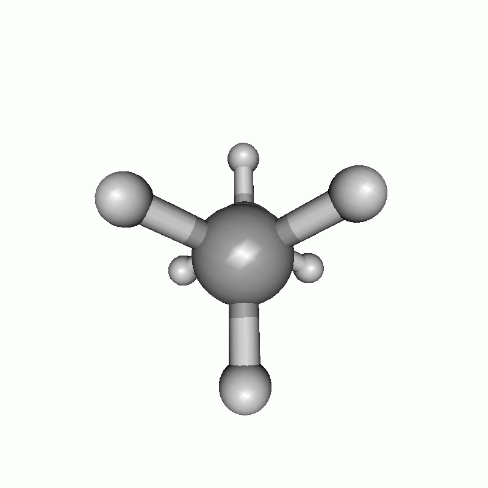
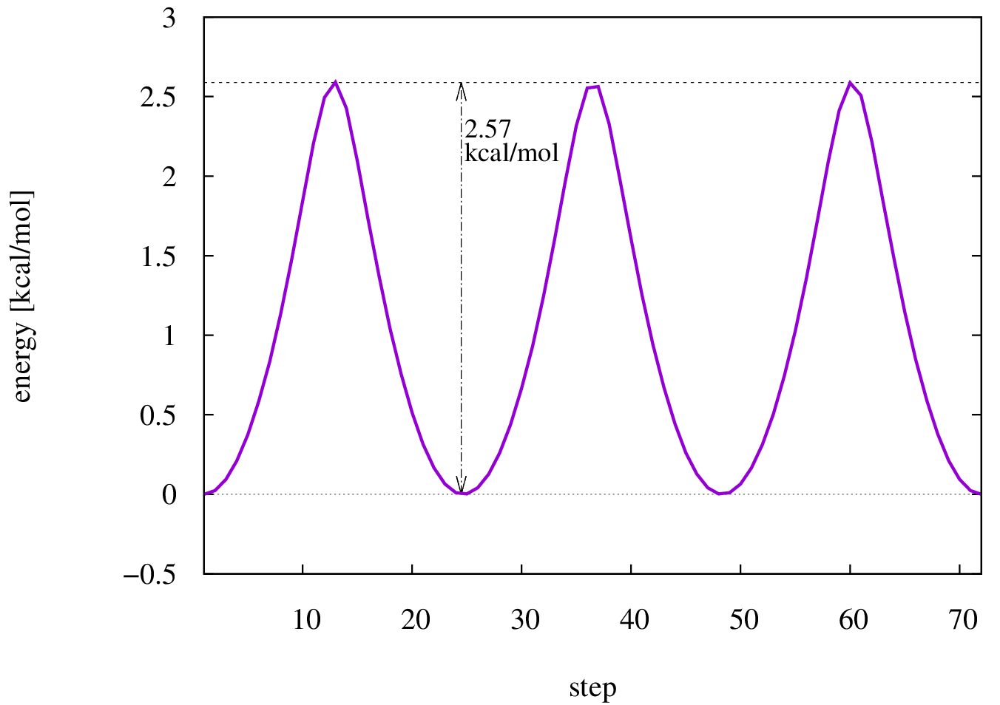
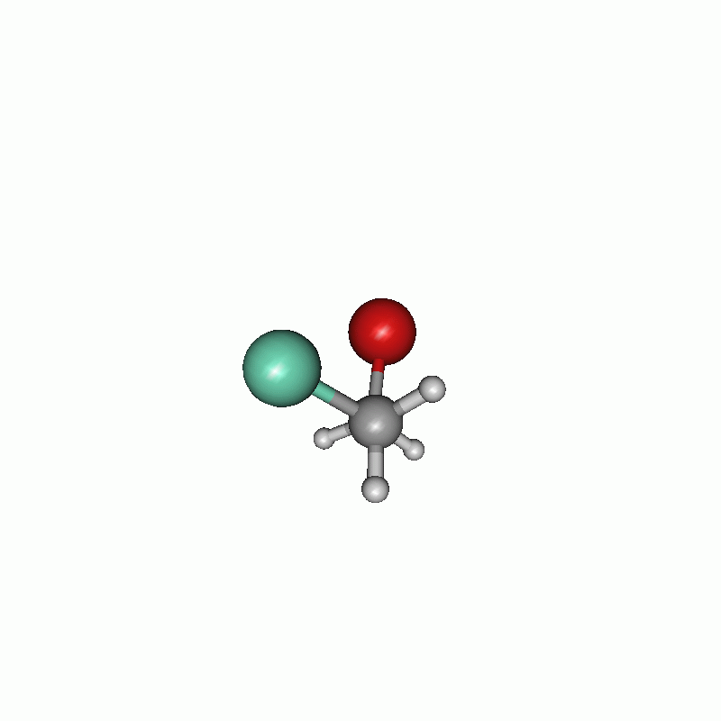
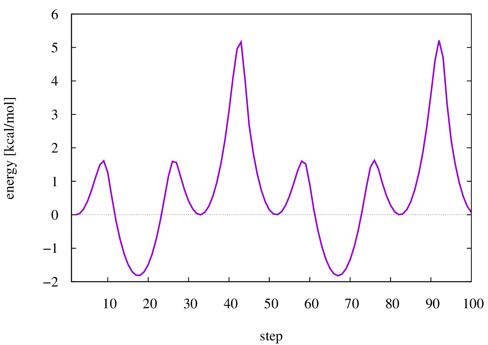
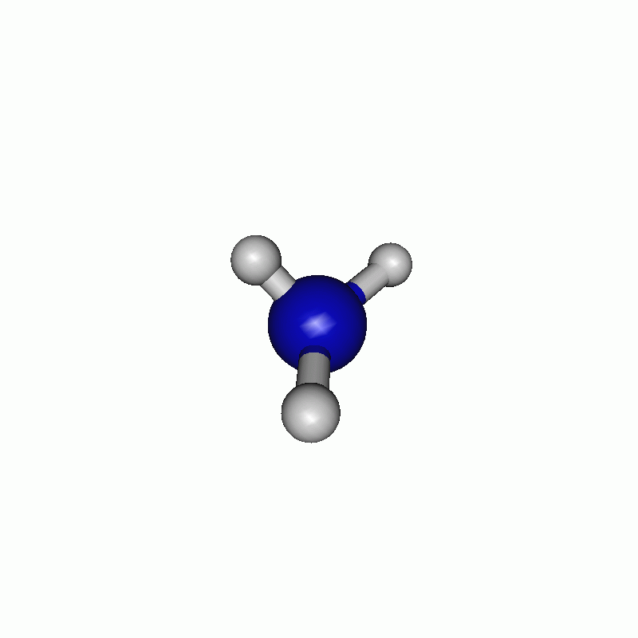
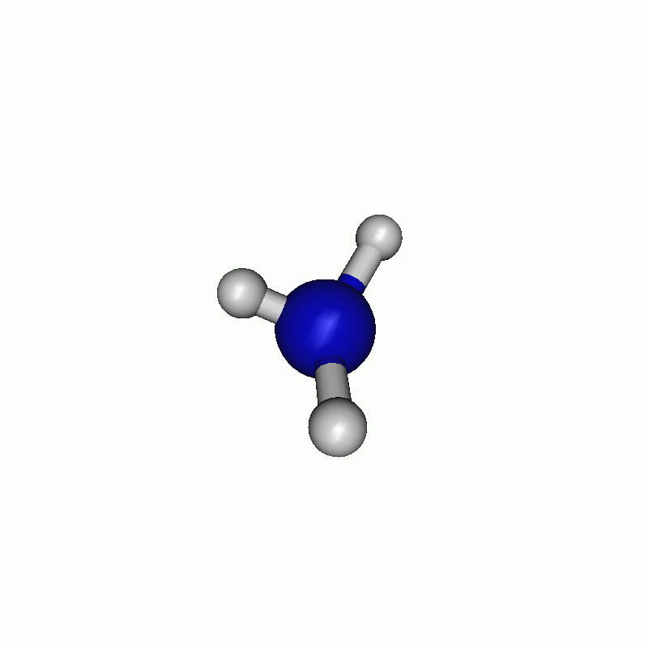

.. _scan:

--------------------------------------------------
Exploration of the potential energy surface (PES)
--------------------------------------------------

.. contents::

Input
======

``xtb`` can be used to scan the potential energy surface. It is possible to adjust distances as well as angles and the dihedral angles via the *xcontrol* file. To scan the potential energy surface, you first have to optimize your molecule. Then you have to find out the atom numbers you wish to constrain and write them to your *xcontrol* file (see examples later). There are two different ways to modify your *xcontrol*.

1) First constrain your geometry, using the *$constrain* block, then scanning using the *$scan* block.
2) Constrain and scan in one step, only using the *$scan* block.

Both will do exactly the same within your calculation. Lastly you have to run an optimization. 

.. note:: 

    ``xtb`` uses force constants to constrain the geometry. Therefore the geometry data you use for the scan can deviate from your given input during the optimization. It is **not** possible to scan the potential energy surface without doing an optimization. In consequence, it is always a relaxed surface scan. 

Dihedral angle scan
=====================

Ethane
-------

Let's start with an easy example. You all know the potential energy surface of a dihedral angle scan of ethane, so this is a good start to check, if you are doing everything right. The following is a converged ethane structure given as xyz file.

.. code:: bash

    > cat ethane.xyz
        8
            -7.46994680
    C          -0.01503441120750    0.04820403778911   -0.01075686629161
    H          -0.02618280545732    0.12324247717853    1.07751478989514
    H           1.02025706611374    0.10521724412205   -0.34995019287160
    H          -0.56108089374185    0.89840506905011   -0.42160774836772
    C          -0.65104926960692   -1.26213120711759   -0.46045958867132
    H          -1.67328207424848   -1.33815676349645   -0.08720971228148
    H          -0.67543548798470   -1.32088660386766   -1.54947400918083
    H          -0.08161812386697   -2.11204925365809   -0.08140067223057
    
To scan the dihedral angle I choose the atoms 1 (first carbon), 5 (second carbon), 4 (hydrogen at first carbon) and 8 (hydrogen at second carbon). The dihedral angle is therefore between 8, 5, 1, 4 or vice versa. Now you have to modify your *input*. As I already said, there are two different ways to scan the PES. 

1) Constrain and scan in two steps

.. code:: text

    > cat scan.inp
    $constrain
     force constant=0.05
     dihedral: 8,5,1,4,60.0
    $scan
     1: 60.0,420.0,72
    $end
     
The *\$constrain* will fix the *dihedral* between atom 8, 5, 1 and 4 to 60.0 degrees. It is also possible to change the force constant used to constrain the geometry. For further hints see chapter `Detailed Input: Fixing, Constraining and Confining - Constraining Potentials`__. Afterwards a scan is conducted with the 1. constraint (in this case the dihedral) from 60.0 to 420.0 degrees in 72 steps. 

__ https://xtb-docs.readthedocs.io/en/latest/xcontrol.html#constraining-potentials

2) The constraint can also be done on-the-fly

.. code:: text

    $constrain
     force constant=0.05
    $scan
     dihedral: 8,5,1,4,60.0; 60.0,420.0,72
    $end     

The part up to the semicolon (*dihedral: 8,5,1,4,60.0*) is passed to the *\$constrain* instruction and evaluated there, and afterwards a scan with this constraint is conducted from 60.0 to 420.0 degrees in 72 steps. 

Which methods you want to use is up to you, as they are doing exactly the same. 

Now you are ready to start the calculation.

.. code:: bash

    > xtb ethane.xyz --opt --input scan.inp
    
The calculation gives the usual files described in the other chapters, and an extra file called *xtbscan.log*. This is a file in XMol format, which can be read by e.g. ``molden``. All optimized structures of the scan and their energy are written to that file, so it contains in our case 72 structures, starting and ending like this: 

.. code:: bash
    
    > cat xtbscan.log
        8
    SCF done      -7.33636977
    C         -0.016167577954    0.046756019273   -0.010925351519
    H         -0.722837769279    0.635952345713    0.569507202626
    H          0.858799528033   -0.144587130449    0.606495402607
    H          0.295104980741    0.636307029349   -0.871373313682
    C         -0.649893664036   -1.261548762672   -0.459251334661
    H         -0.962364182156   -1.850869022139    0.400300369375
    H         -1.523304826531   -1.069936539515   -1.078572301721
    H          0.057237511182   -1.850228939559   -1.039524673024
        8
    SCF done      -7.33633301
    C         -0.014508419361    0.046085202187   -0.010980431860
    H         -0.712592003942    0.622234788963    0.592857532524
    H          0.875734542981   -0.143892036194    0.583801797058
    H          0.267743868859    0.650856540715   -0.870728921217
    C         -0.650432967813   -1.260775477944   -0.461051561431
    H         -0.987374035660   -1.836977921850    0.398253949047
    H         -1.507838805925   -1.070682914383   -1.102253264664
    H          0.065841820861   -1.865003181495   -1.013243099455
        8
    SCF done      -7.33622104
    C         -0.013197790454    0.045694504417   -0.011256531141
    H         -0.701582052023    0.608208846300    0.616415577820
    H          0.892470173219   -0.143385451024    0.559597860026
    H          0.239350600054    0.665739016442   -0.869355008077
    C         -0.650618419000   -1.260384104771   -0.462367255784
    H         -1.013262191587   -1.822961711987    0.395720305781
    H         -1.490594450886   -1.071189460974   -1.126101769970
    H          0.074008130676   -1.879876638403   -0.985997178655
    ...
    ...
    ...
        8
    SCF done      -7.33622017
    C         -0.013004744475    0.045540690542   -0.011114232961
    H          1.030144565230    0.090508635597   -0.314432978298
    H         -0.533071797992    0.894833527576   -0.449705894194
    H         -0.065637709250    0.143792574844    1.071609413617
    C         -0.651185106898   -1.260114193001   -0.462340695966
    H         -0.711362672977   -1.305688812601   -1.547024982931
    H         -0.064980472761   -2.109392137114   -0.117000615435
    H         -1.654328060878   -1.357635285842   -0.053334013833
        8
    SCF done      -7.33633308
    C         -0.014346704593    0.046121859404   -0.011308096497
    H          1.020906551190    0.102932886427   -0.339872745036
    H         -0.551739904813    0.895891227197   -0.426589805208
    H         -0.037115500933    0.129430347168    1.073605709020
    C         -0.650547319963   -1.260694835302   -0.461135641012
    H         -0.684295266226   -1.318119390348   -1.546743615925
    H         -0.080580374590   -2.110437772732   -0.091714398274
    H         -1.665707480072   -1.343279321813   -0.079585407068
        8
    SCF done      -7.33637035
    C         -0.015578067243    0.046627972173   -0.011197389104
    H          1.010992111828    0.115268321609   -0.364499843825
    H         -0.569593214036    0.896318028100   -0.403610362573
    H         -0.008392561436    0.115840454214    1.074947192037
    C         -0.650244617685   -1.261196821401   -0.459943193673
    H         -0.657767750171   -1.330468135987   -1.545565118941
    H         -0.096332291574   -2.110841034948   -0.067236403729
    H         -1.676509609683   -1.329703783762   -0.106238880192
        
The resulting scan as well as the resulting energy curve are shown.

   
   Dihedral scan of ethane.

   
   Energy diagram of the dihedral scan of ethane.

1-Bromo-2-chloroethane
-----------------------

``xtb`` is also able to constrain and scan at the same time. The optimized input structure in this case (the above named disubstituted ethane) is shown below.

.. code:: bash 

    > cat start.xyz
        8

    C           0.01774700194036    0.02394056724825    0.01171709768115
    H           0.02320553063247    0.04452098239361    1.10173147789467
    H           1.04534455713418    0.04827808072517   -0.35142167075981
    CL         -0.81853417509556    1.48223297221309   -0.57258786378603
    C          -0.70382290601220   -1.19970227294247   -0.49854993198382
    H          -1.73033497415121   -1.22321931753990   -0.13963544593745
    H          -0.70258146165504   -1.22676776606289   -1.58588899303155
    BR          0.20555042720700   -2.80743824603485    0.15129132992284

Now, the *input* can be modified. The modification shown below are only for training purposes, so they don't have to make any sense. 

.. code:: bash 

    $constrain
       distance: 1,5,auto
       dihedral: 8,5,1,4,60.0
    $scan
       2: 60.0,780.0,100
    $opt
       maxcycle=5
    $end

I chose to firstly set the constraints and then the scanning part. The constraints are written one after another. The first constraint keeps the distance of atom 1 and atom 5 (both carbons) to their actual value, whereas the second one constrains the dihedral angle of atoms 8, 5, 1 and 4 to 60.0°. In the scan block, the **second** constraint is changed from 60.0° to 780.0° in 100 steps. The maximum cycle of the optimization is set in the *\$opt* part to 5. Consequently the optimization has not much steps to shift the constrained atoms. All in all, the chosen settings results in the following.

   
   Scan of the dihedral angle between chloride and bromide of the disubstituted ethane.

   
   Energy diagram of the dihedral scan.
   

Angle and Distance scan
========================

Ammonia
--------

Concerted Scan
^^^^^^^^^^^^^^^^
       
It is of course also possible to scan along angle and distance. Therefore in the next example, the angle and the distance is scanned in one scan. If you want to scan all options simultaneously, you have to use the *mode=concerted* option in the *\$scan* block. It requires, that the number of steps in the scan is always the same, otherwise ``xtb`` will exit in error. 
The optimized input geometry is written below.

.. code:: bash

    > cat ammonia.xyz
    4
    
    N          -0.00990404770994   -0.01698500657667   -0.00712107610609
    H           0.00434306677482    0.00733732515324    1.00490910707310
    H           0.94901246801925    0.00720047578638   -0.33083175918033
    H          -0.46827248708413    0.82547620563705   -0.33095427178668
    
Now, the constraining and the scanning options are set in the input file.

.. code:: text 

    $constrain
       force constant=0.5
       distance: 1, 4, 0.5 
       angle: 2, 1, 3, 150.0
       dihedral: 2, 1, 3, 4, auto
    $scan
       mode=concerted
       # different steps for each constraint!
       1: 0.5, 1.4, 50
       2: 150.0, 90.0, 60
    $opt
       maxcycle=5
    $end

The constraint of the dihedral angle between all given atoms to their actual value was set, since otherwise the first optimization would lead to a planar molecule. As you can see, I chose *mode=concerted*, but different number of steps for the scan. Since a concerted scan can only performed if all scans are performed with the same number of steps, ``xtb`` should exits in error, of course it does printing the message:

.. code:: text 

    #ERROR! Wrong setup for concerted scan, aborting...

.. note:: A concerted scan can only carried out if all constraints are scanned with the same number of steps.

The correct input is given below.

.. code:: text 

    $constrain
       force constant=0.5
       distance: 1, 4, 0.5 
       angle: 2, 1, 3, 150.0
       dihedral: 2, 1, 3, 4, auto
    $scan
       mode=concerted
       1:   0.5,  1.4, 60
       2: 150.0, 90.0, 60
    $opt
       maxcycle=5
    $end

The resulting path can be seen in the following movie. 

.. note:: Nobody stops you from scanning the same constraint twice, this usually does not make much sense for concerted scans, but is not catched by the parser.
   
Sequential Scan
^^^^^^^^^^^^^^^
   
Another way to scan would be in *sequential* mode. ``xtb`` will then scan along all constraints one after the other, always leaving the last scanned constraint at it last value. An example *input* can look like this, using the ammonia example from above. 

.. code:: text 

    $constrain
       force constant=0.5
       distance: 1, 2, 0.5
       angle: 4, 1, 3, 140.0
       dihedral: 2, 1, 3, 4, auto
    $scan
       mode=sequential
       2: 140.0, 90.0, 40
       1: 0.5, 2.0, 60
    $opt
       maxcycle=5

The *mode=sequential* flag is the default value for scans, due to the nature of the scan different step sizes are possible here. 

.. note:: There is no multidimensional scan supported on purpose since they tend to be expensive on high-dimensional potential energy surfaces and are difficult to visualize. But they can be easily constructed, by repeatly scanning the same constraint.

I chose to firstly scan along the angle and then along the distance. The resulting path can be seen below.

.. tip::

    If your resulting path oscillates at some point, try to increase the number of maximum cycles *maxcycle* in your *\$opt* block. Sometimes ``xtb`` just needs more steps to properly converge your structure. 
