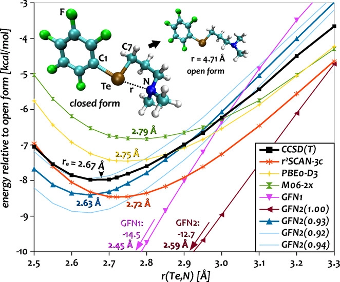

.. _sp:

----------------------------
Singlepoint Calculations
----------------------------

.. contents::

.. note:: Generally, a singlepoint calculation will be carried out automatically before every other calculation done with ``xtb``.

Input
========================

To start a singlepoint calculation with ``xtb`` only a molecular geometry is needed. ``xtb`` supports the ``TURBOMOLE`` coordinates (.coord/.tmol), any valid Xmol (e.g. .xyz), mol files (.mol), Structure-Data files (.sdf), Protein Database Files (.pdb), Vasp's POSCAR and CONTCAR files (.poscar/.contcar/.vasp) and DFTB+ genFormat files (.gen).
For a detailed overview over all geometry input formats see :ref:`geometry`

Example ``TURBOMOLE`` input coordinates for H\ :sub:`2`\ O (*e.g.* ``coord``):

.. code:: bash

   $coord
      0.00000000000000      0.00000000000000     -0.73578586109551      o
      1.44183152868459      0.00000000000000      0.36789293054775      h
     -1.44183152868459      0.00000000000000      0.36789293054775      h
   $end

Example Xmol input coordinates for H\ :sub:`2`\ O (*e.g.* ``h2o.xyz``):

.. code:: bash

   3
   Comment Line
   O     0.0000000    0.0000000   -0.3893611
   H     0.7629844    0.0000000    0.1946806
   H    -0.7629844    0.0000000    0.1946806

Example SDF input for H\ :sub:`2`\ O (*e.g.* ``h2o.sdf``)

.. code:: bash

   Water
     xtb     11041909383D
   Comment line
     3  2  0     0  0            999 V2000
      -0.2191   -0.3098    0.0000  O  0  0  0  0  0  0  0  0  0  0  0  0
       0.7400   -0.2909   -0.0000  H  0  0  0  0  0  0  0  0  0  0  0  0
      -0.5210    0.6007    0.0000  H  0  0  0  0  0  0  0  0  0  0  0  0
     1  2  1  0  0  0  0
     1  3  1  0  0  0  0
   M  END
   > <Formula>
   H2 O

   > <Mw>
   18.01528

   > <SMILES>
   O([H])[H]

   > <CSID>
   937

   $$$$

.. note:: To use input coordinates in SDF format the .sdf suffix is required.

Charge and Multiplicity
=================================

By default ``xtb`` will search for ``.CHRG`` and ``.UHF`` files which contain the molecular charge
and the number of unpaired electrons as an integer, respectively.

Example ``.CHRG`` file for a molecule with a molecular charge of +1:

.. code:: bash

   > cat .CHRG
   1

Example ``.CHRG`` file for a molecule with a molecular charge of -2:

.. code:: bash

   > cat .CHRG
   -2

Example ``.UHF`` file for a molecule with two unpaired electrons:

.. code:: bash

   > cat .UHF
   2

The molecular charge can also be specified directly from the command line:

.. code:: sh

  > xtb coord --chrg <INTEGER>

which is equivalent to

.. code:: sh

  > echo <INTEGER> > .CHRG && xtb coord

This also works for the unpaired electrons as in

.. code:: sh

  > xtb coord --uhf <INTEGER>

being equivalent to

.. code:: sh

  > echo <INTEGER> > .UHF && xtb molecule.xyz

Example for a +1 charged molecule with 2 unpaired electrons:

.. code:: bash

  > xtb --chrg 1 --uhf 2

.. note:: The molecular charge or number of unpaired electrons specified from the command line will override specifications provided by ``.CHRG``, ``.UHF`` and the ``xcontrol`` input!

The imported specifications are documented in the output file in the *Calculation Setup* section.

.. code-block:: none
   :emphasize-lines: 11,12

           -------------------------------------------------
          |                Calculation Setup                |
           -------------------------------------------------

          program call               : xtb molecule.xyz
          hostname                   : user
          coordinate file            : molecule.xyz
          omp threads                :                     4
          number of atoms            :                     3
          number of electrons        :                     7
          charge                     :                     1    # Specified molecular charge
          spin                       :                   1.0    # Total spin from number of unpaired electrons (S=2*0.5=1)
          first test random number   :      0.54680533077496

.. note:: Note that the position of the input coordinates is totally unaffected
          by any command-line arguments, if you are not sure, whether ``xtb`` tries
          to interpret your filename as flag use ``--`` to stop the parsing
          as command-line options for all following arguments.

          .. code:: sh

            > xtb -- -oh.xyz

To select the parametrization of the xTB method you can currently choose
from four different geometry, frequency and non-covalent interactions (GFN)
parametrizations/methods, which differ mostly in the cost--accuracy ratio,

.. code:: sh

  > xtb --gfn 0 coord
  > xtb --gfn 1 coord
  > xtb --gfn 2 coord
  > xtb --gfnff coord

GFN2-xTB is the default parametrization. Also
available are GFN1-xTB, GFN0-xTB (Notice: separate parameter file necessary!) as well as the GFN-FF force-field.

Accuracy and Iterations
=======================

Accuracy
--------

The accuracy of the xTB calculation can be adjusted by the commandline option
``--acc``. The accuracy determines the integral screening thresholds and the
SCC convergence criteria and can be adjusted continuous in a range from
0.0001 to 1000, where tighter criteria are set for lower values of accuracy.
To change the calculation accuracy call ``xtb`` with

.. code:: sh

  > xtb coord --acc <REAL>

By default the accuracy multiplier is set to 1, for a few accuracy settings
the resulting numerical thresholds are shown below:

+--------------------------------+------------+------------+------------+
| Accuracy                       |         30 |          1 |        0.2 |
+================================+============+============+============+
| Integral cutoff                |       20.0 |       25.0 |       32.0 |
+--------------------------------+------------+------------+------------+
| Integral neglect               | 3.0 · 10⁻⁷ | 1.0 · 10⁻⁸ | 2.0 · 10⁻⁹ |
+--------------------------------+------------+------------+------------+
| SCC convergence / E\ :sub:`h`\ | 3.0 · 10⁻⁵ | 1.0 · 10⁻⁶ | 2.0 · 10⁻⁷ |
+--------------------------------+------------+------------+------------+
| Wavefunction convergence / e   | 3.0 · 10⁻³ | 1.0 · 10⁻⁴ | 2.0 · 10⁻⁵ |
+--------------------------------+------------+------------+------------+

.. note:: The wavefunction convergence in GFN2-xTB is chosen automatically
          a bit tighter than for GFN1-xTB.

Iterations
----------

The number of iterations allowed for the SCC calculation can be adjusted from the command line:

.. code:: sh

  > xtb coord --iterations <INTEGER>

The default number of iterations in the SCC is set to 250.

Fermi-smearing
==============

The electronic temperature :math:`T_{el}` is used as an adjustable parameter, employing so-called Fermi
smearing to achieve fractional occupations for systems with almost degenerate orbital levels.
This is mainly used to take static correlation into account or to e.g. investigate thermally forbidden reaction pathways.

:math:`T_{el}` enters the GFNn-xTB Hamiltonian as

.. math::

   G_{fermi} = -T_{el}S_{el}

and the orbital occupations for a spin orbital :math:`\psi_{i}` are given by

.. math::

   n_{i}(T_{el})=\frac{1}{exp[(\epsilon _{i}- \epsilon _{F})/(k_{B}T_{el})]+1}

The default electronic temperature is :math:`T_{el}` = 300 K.

:math:`T_{el}` can be adjusted by the command line:

.. code:: sh

  > xtb --etemp <REAL> molecule.xyz

The specified electronic temperature is documented in the output file in the *Self-Consistent Charge Iterations* section

.. code-block:: none
   :emphasize-lines: 17

           -------------------------------------------------
          |        Self-Consistent Charge Iterations        |
           -------------------------------------------------

          ...................................................
          :                      SETUP                      :
          :.................................................:
          :  # basis functions                  12          :
          :  # atomic orbitals                  12          :
          :  # shells                            8          :
          :  # electrons                        16          :
          :  max. iterations                   250          :
          :  Hamiltonian                  GFN2-xTB          :
          :  restarted?                      false          :
          :  GBSA solvation                  false          :
          :  PC potential                    false          :
          :  electronic temp.         5000.0000000     K    :
          :  accuracy                    1.0000000          :
          :  -> integral cutoff          0.2500000E+02      :
          :  -> integral neglect         0.1000000E-07      :
          :  -> SCF convergence          0.1000000E-05 Eh   :
          :  -> wf. convergence          0.1000000E-03 e    :
          :  Broyden damping             0.4000000          :
          ...................................................

.. note:: Sometimes you may face difficulties converging the self consistent
          charge iterations. In this case increasing the electronic temperature
          and restarting at the converged calculation with normal temperature can help.

          .. code:: sh

            > xtb coord --etemp 1000.0 && xtb coord --restart

Vertical Ionization Potentials and Electron Affinities
======================================================

``xtb`` can be used to calculate vertical ionization potentials (IP) and electron affinities (EA) applying
a specially reparameterized GFN1-xTB version. The special purpose parameters are documented in the ``.param_ipea.xtb``
parameter file.

The vertical ionization potential or electron affinity is obtained as the energy difference between the corresponding
molecule groundstate and its ionized species in the same geometry.

.. math::
   IP_{v} = E(M^{n+1})-E(M^{n})

.. math::
   EA_{v} = E(M^{n-1})-E(M^{n})

.. note::  The sign of the IP and EA can differ in the literature due to different definitions.

The vertical IP and EA calculations can be evoked from the command line either separately or combined.

.. code:: sh

  > xtb coord --vip

.. code:: sh

  > xtb coord --vea

.. code:: sh

  > xtb coord --vipea

.. note:: It is recommended to optimize the molecule geometry prior to the vipea calculation.

          .. code:: sh

            > xtb coord --opt && xtb xtbopt.coord --vipea

The calculated IP and/or EA are then corrected empirically, both the empirical shift and the final IP and/or EA are documented
in the output in the *vertical delta SCC IP calculation* and *vertical delta SCC EA calculation* sections.

Example output for the optimized Water molecule:

.. code-block:: none
   :emphasize-lines: 24,49

              -------------------------------------------------
             |        vertical delta SCC IP calculation        |
              -------------------------------------------------

              *** removed SETUP and SCC details for clarity ***

            :::::::::::::::::::::::::::::::::::::::::::::::::::::
            ::                     SUMMARY                     ::
            :::::::::::::::::::::::::::::::::::::::::::::::::::::
            :: total energy               -5.141603209729 Eh   ::
            :: gradient norm               0.051348781702 Eh/α ::
            :: HOMO-LUMO gap               6.668725933430 eV   ::
            ::.................................................::
            :: SCC energy                 -5.189558706232 Eh   ::
            :: -> electrostatic            0.159050410368 Eh   ::
            :: repulsion energy            0.048093066315 Eh   ::
            :: dispersion energy          -0.000137569813 Eh   ::
            :: halogen bond corr.          0.000000000000 Eh   ::
            :: add. restraining            0.000000000000 Eh   ::
            :::::::::::::::::::::::::::::::::::::::::::::::::::::

   ------------------------------------------------------------------------
   empirical IP shift (eV):    4.8455        # Empirical shift
   delta SCC IP (eV):   13.7897              # Finally calculated vertical IP (Exp.: 12.6 eV)
   ------------------------------------------------------------------------
              -------------------------------------------------
             |        vertical delta SCC EA calculation        |
              -------------------------------------------------

              *** removed SETUP and SCC details for clarity ***

            :::::::::::::::::::::::::::::::::::::::::::::::::::::
            ::                     SUMMARY                     ::
            :::::::::::::::::::::::::::::::::::::::::::::::::::::
            :: total energy               -5.929826433613 Eh   ::
            :: gradient norm               0.016238133270 Eh/α ::
            :: HOMO-LUMO gap               7.760066297206 eV   ::
            ::.................................................::
            :: SCC energy                 -5.977781930116 Eh   ::
            :: -> electrostatic            0.169754616317 Eh   ::
            :: repulsion energy            0.048093066315 Eh   ::
            :: dispersion energy          -0.000137569813 Eh   ::
            :: halogen bond corr.          0.000000000000 Eh   ::
            :: add. restraining            0.000000000000 Eh   ::
            :::::::::::::::::::::::::::::::::::::::::::::::::::::

   ------------------------------------------------------------------------
   empirical EA shift (eV):    4.8455     # Empirical shift
   delta SCC EA (eV):   -2.0320           # Finally calculated vertical EA
   ------------------------------------------------------------------------

Global Electrophilicity Index
=============================

``xtb`` can be used for direct calculation of Global Electrophilicity Indexes (GEI) that can be used to estimate the electrophilicity or Lewis acidity of various compounds from vertical IPs and EAs. In  ``xtb`` the GEI is defined as:

.. math::
   GEI = \frac{(IP+EA)^{2}}{8(IP-EA)}

The GEI calculation can be evoked from the command line:

.. code:: sh

  > xtb coord --vomega

The calculated GEI is documented in the output after the *vertical delta SCC EA calculation* section

.. code:: bash

   ------------------------------------------------------------------------
   Calculation of global electrophilicity index (IP+EA)²/(8·(IP-EA))
   Global electrophilicity index (eV):    1.0923   #GEI for water
   ------------------------------------------------------------------------

Fukui Index
===========

The Fukui indexes or condensed Fukui function can be calculated to estimate the most electrophilic or nucleophilic sites of a molecule.

.. math::
   f(r) = \frac{\delta p(r)}{\delta N_{electron}}

The two finite representations of the Fukui function are defined as

.. math::
   f_{+}(r) = \rho_{N+1}(r)-\rho_{N}(r)

representing the electrophilicity (susceptibility of an nucleophilic attack) of an atom in a molecule with N electrons and

.. math::
   f_{-}(r) = \rho_{N}(r)-\rho_{N-1}(r)

representing the nucleophilicity (susceptibility of an electrophilic attack) of an atom.

The radical attack susceptibility is described by

.. math::
   f_{0}(r) = 0.5(\rho_{N+1}(r)-\rho_{N-1}(r))

.. note::   As the Fukui indexes depend on occupation numbers and population analysis (see :ref:`properties`), they
            are sensitive toward basis set changes. Therefore Fukui indexes should not be recognized as absolute numbers but as
            relative parameters in the same system.

A Fukui index calculation can be evoked from the command line:

.. code:: sh

  > xtb coord --vfukui

The calculated Fukui indexes are documented in the *Fukui index Calculation* section of the output.

Example: BF\ :sub:`3`\
---------------------------------

.. code-block:: none

 Fukui index Calculation
    1    -15.6291014 -0.156291E+02  0.835E+00   13.96       0.0  T
    2    -15.6761217 -0.470203E-01  0.533E+00   13.46       1.0  T
    3    -15.6768113 -0.689578E-03  0.156E+00   13.00       1.0  T
    4    -15.6769156 -0.104364E-03  0.175E-01   12.86       1.0  T
    5    -15.6769184 -0.275858E-05  0.213E-02   12.90       2.3  T
    6    -15.6769197 -0.132996E-05  0.325E-03   12.91      15.4  T
    7    -15.6769197  0.872775E-08  0.253E-03   12.91      19.8  T
    8    -15.6769197 -0.144533E-07  0.264E-05   12.91    1896.8  T
    9    -15.6769197 -0.126121E-11  0.650E-06   12.91    7694.1  T
      SCC iter.                  ...        0 min,  0.001 sec
      gradient                   ...        0 min,  0.000 sec
    1    -14.9103537 -0.149104E+02  0.313E+00    8.30       0.0  T
    2    -14.9107747 -0.421013E-03  0.195E+00    8.21       1.0  T
    3    -14.9108376 -0.628755E-04  0.217E-01    8.29       1.0  T
    4    -14.9108954 -0.578357E-04  0.166E-01    8.21       1.0  T
    5    -14.9003399  0.105555E-01  0.141E+00    8.21       1.0  T
    6    -14.9108133 -0.104734E-01  0.172E-01    8.22       1.0  T
    7    -14.9109267 -0.113342E-03  0.872E-02    8.22       1.0  T
    8    -14.9109654 -0.387429E-04  0.200E-02    8.23       2.5  T
    9    -14.9109672 -0.181816E-05  0.417E-03    8.24      12.0  T
   10    -14.9109673 -0.412949E-07  0.111E-03    8.23      45.1  T
   11    -14.9109673 -0.551257E-08  0.351E-04    8.23     142.6  T
   12    -14.9109673 -0.493735E-09  0.682E-05    8.23     733.6  T
      SCC iter.                  ...        0 min,  0.001 sec
      gradient                   ...        0 min,  0.000 sec

      #       f(+)     f(-)     f(0)    #Fukui indexes
      1 B    -0.300    0.005   -0.148
      2 F    -0.233   -0.335   -0.284
      3 F    -0.233   -0.335   -0.284
      4 F    -0.233   -0.335   -0.284

The Fukui indexes for BF\ :sub:`3`\  indicate the most negative f(+) value and a positive value for f(-) at the boron atom. Thus, a nucleophilic attack can be expected at the boron atom.

H\ :sub:`0`\  Tuning
====================

For special cases it can be beneficial to tune the H\ :sub:`0`\  Hamiltonian by modifying the atom-pairwise parameters. In order to do this, create a copy of the parameter file ``$XTBPATH/param_gfn2-xtb.txt`` with a different name and add atom pairs to the ``$pairpar`` block in the copy according to the example below.

.. code-block:: bash
   :caption: Example entry for a nitrogen-tellurium pair

   $pairpar
     7  52  0.93
   $end

The first two numbers express atomic numbers followed by the H\ :sub:`0`\ -scaling factor. The default value for the scaling of each pair is 1.00 but certain pairs may already be changed in the file.

The new parameter file can then be imported with the commandline call:

.. code:: sh

   xtb coord --vparam <PARAMETER_FILE>

.. note::   The whole content of the parameter file ``param_gfn2-xtb.txt`` is required to perform a calculation. A file containing only the ``$pairpar`` block is not sufficient. 
.. warning:: Please do not change the original ``param_gfn2-xtb.txt`` file. Otherwise, global parameters are changed.

Example: Application on Te-N Interactions
-----------------------------------------

One example of the H\ :sub:`0`\  tuning can be found at `Angew. Chemie Int. Ed., 2021 <https://doi.org/10.1002/anie.202102679>`_. Here, the GFN2 Hamiltonian for the Te-N interaction was calibrated against numerically converged DLPNO-CCSD(T1) results in a potential-energy surface scan.

