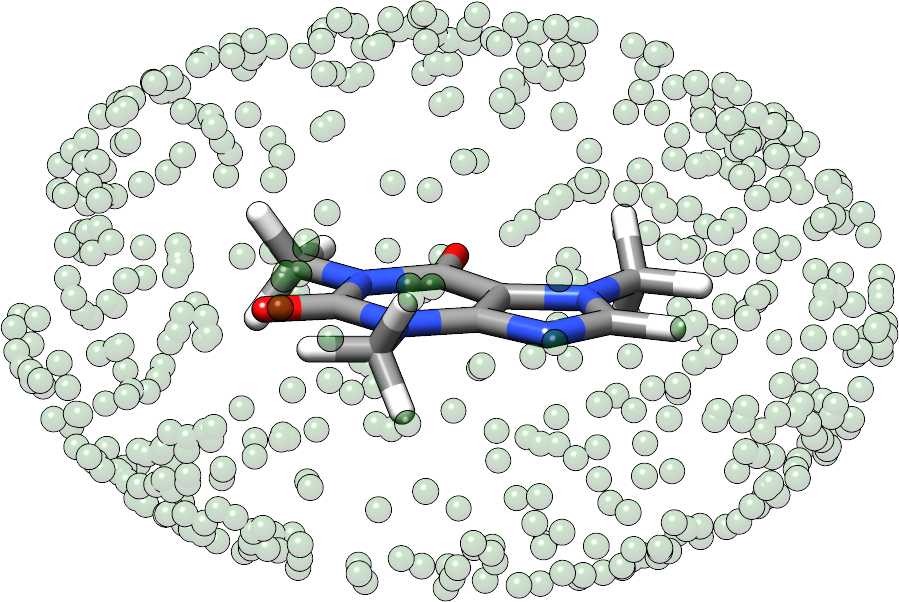

.. _detailed-input:

----------------
 Detailed Input
----------------

.. contents::

The ``xcontrol`` instruction set is inspired by the Turbomole ``control``
file syntax. I decided to call it ``xcontrol`` instructions back than,
but here we will just call it (detailed) input for convenience.

.. note:: The parser implemented is more general and limited by
          arbitrary choice to this syntax. At some point more common
          formats like JSON, YAML or XML might become available
          as alternative input formats.

To read an input file called ``xtb.inp`` use

.. code:: bash

  > xtb --input xtb.inp coord

In the detailed input you have control about almost very global
variable in the program, some instructions even check your input, but
most of the time you should know what you are doing.
Developed as a feature for developers, this is incredible powerful
and naturally way to complicated for the average application.
So in most cases you can safely rely on the internal defaults or
the shipped global configuration file (should usually be the same).

I will walk you through some selected instructions you might find useful
for your application.

.. contents::

Fixing, Constraining and Confining
==================================

In ``xtb`` different concepts of constraints are implemented,
so you should know which tool is best for you problem before you
start writing the detailed input.

Exact Fixing
------------

In the *exact fixing* approach the Cartesian position of the selected
atom is fixed in space by setting its gradient to zero and the degrees
of freedom are removed from the optimization procedure and therefore
the atoms stay in place in geometry optimizations.

For dynamics this exact fixing is *automatically deactivated*, since it
usually leads to instabilities in the simulation.

To activate the exact fixing for atoms 1--10 and atom 12 as well as for
all oxygen atoms, add

.. code::

  $fix
     atoms: 1-10,12
     elements: O
  $end

to your detailed input, the atoms keyword refers to the numbering
of the individual atoms in your input geometry.

Constraining Potentials
-----------------------

Almost absolute control about anything in your system is archived
by applying *constraining potentials*. First of all the constraining
potentials offer a weaker version of the exact fixing, which is
invoked by the same syntax in the ``$contrain`` data group as

.. code::

  $constrain
     atoms: 11
     elements: C,N,8
  $end

the program will not attempt to hold the Cartesian positions constant,
but the distances between all selected atoms, here number 11 and all
carbon, nitrogen and oxygen. For each atom pair a harmonic potential
is generated to hold the distances at roughly the starting value, this even
works without problems in dynamics.

To constrain the atoms more tightly the force constant can be adjusted

.. code::

  $constrain
     force constant=1.0
  $end

this variable goes directly into the constraining procedure and is given in
Hartree, for very high force constants this becomes equivalent to the exact fixing.
Note the difference in the syntax as you are required to use an equal-sign
instead of a colon, as you are modifying a global variable.

It is also possible to constrain selected internal coordinates, possible
are distances, angles and dihedral angles as done here

.. code::

  $constrain
     distance: 1, 2, 2.5
     angle: 5, 7, 8, 120
     dihedral: 3, 4, 1, 7, auto
  $end

Distance constraints are given in Ångström, while angle constraints are given
in degrees.
The distances are defined by two atom number referring to the order in
your coordinate input, angles are defined by three atom numbers and
dihedral angles by four atoms, in any case the atoms do not have to
be connected by bonds. The last argument is always the value which should
be used in the constraining potential as reference, if you decide to
use the current value ``auto`` can be passed. The constraints will be
printed to the screen (the newer implementation may require the verbose mode,
to trigger the printout of the constraint summary).

If you are not quite sure which distances or angles you want to constrain,
run

.. code:: bash

  > cat geosum.inp
  $write
     distances=true
     angles=true
     torsions=true
  $end
  > xtb --define --verbose --input geosum.inp coord

and have a look at the geometry summary for your molecule. The ``$write``
data group toggles the printout in the property section and also some
printouts in the input section.

Confining in a Cavity
---------------------

If you are running dynamics for systems that are non-covalently bound,
you may encounter dissociation in the dynamics. If you want to
study the bound complex, you can try to *confine* the simulation
in a little sphere, which keeps the molecules from escaping.
The detailed input looks like

.. code::

  $cma
  $wall
     potential=logfermi
     sphere: auto, all
  $end

You can be more precise on the radius by giving the value in bohr instead
of ``auto``. I personally recommend to use the logfermi potential, since it
is best suited for confinements, but yet not the default.

.. note:: When using a confining potential for confining you should make
          sure the origin is close to the center of geometry or center of mass
          of the molecule,
          since all confining potentials are centered at the origin (0,0,0),
          which is rather a limitation of the current input than the underlying
          implementation.
          To avoid problems with misplaced confining potentials the ``$cma``
          logical instruction should be included to shift the molecule back
          to the center of mass and align it to its principal axes of inertia.

**Example for using wall potentials:**

.. code::
   
   > cat wall.inp

   $chrg -1
   $spin 0
   $wall
      elipsoid: 13.5,11.1,8.6,all
   $end

   xtb input-geometry.xyz --input constrain.inp --sp > sp.out                                                                                                                                                    

   The influence of the elipsoidal potential on the caffeine molecule in a single-point calculation is listed in the 'SUMMARY' output block. For visualization purposes the transparent-green dots are placed on 
the surface of the potential.

Absolute Control
================

As I promised you can control almost everything, the ``xcontrol(7)`` man page
is a good starting point to get accquinted with the detailed input. This
proses the usual hinderance of actually reading the documenation
(since you are here, you are already above average, thumbs up).

A practical alternative is to just dump the complete internal settings
of the program to an input file and start playing around with it.
To do so, run

.. code:: bash

   > xtb --input default.inp --define --copy coord

The file ``default.inp`` has not to be present when starting the program
in ``--copy`` mode, since the ``default.inp`` will be generated for you.
The ``--define`` flags makes sure that the program only checks your setup
and does not perform any calculation on the input coordinates.

Have a look at the first lines of ``default.inp``:

.. code::

   $cmd xtb --input default.inp --define --copy coord
   $date 2019/03/05 at 08:50:26.651
   $chrg 0
   $spin 0
   ...

This is actually the command you used in the first place to invoke the
program, next you find the timestamp when the program was started and
then systemspecific information about charge and spinstate of your system,
this is what I understand as a self-documenting program run.
``$cmd`` and ``$date`` are cosmetic features and will never influence
any calculation if included in the detailed input, but I figured that
they might become handy if you look back into your calculations when
putting together the manuscript or taking over a project from your,
now graduated, fellow coworker.

The rest of the file represent every accessable variable documented
in the ``xcontrol(7)`` man page with its current setting, this should be
quite a lot. So lets focus say on the ``$wall`` group:

.. code::

   ...
   $wall
      potential=polynomial
      alpha=30
      beta=6.000000000000000
      temp=300.0000000000000
      autoscale=1.000000000000000
      axisshift=3.500000000000000
   ...

The default potential is a ``polynomial`` one, you want to change this to
the ``logfermi`` potential. ``alpha`` is only needed for the ``polynomial``
potential, we use ``beta`` and ``temp`` in our potential.
The steepness of our potential can be adjusted by modifying the value
of ``beta``, since our potential is multiplied with the thermic energy
we can scale it by increasing it temperature in ``temp``.
``autoscale`` is a factor the automatic determined sphere axes are
multiplied with, a default of 1.0 seems resonable here, but sometimes
we need more space or want to squeeze everything a bit together.
We can also adjust the constant shift value used in the generation
of the automatic axes, but on a second thought this value might be
just fine, so we do not modify ``axisshift`` today.

This is an awful lot of information in a small block and quite essential
for your calculation using a confining potential, all details on this
can be found in ``xcontrol(7)`` man page at the group instruction
of interest.

.. tip:: If you are happy with all this setting you can just use this file as
         your ``.xtbrc`` and place it somewhere in your ``XTBPATH``.
