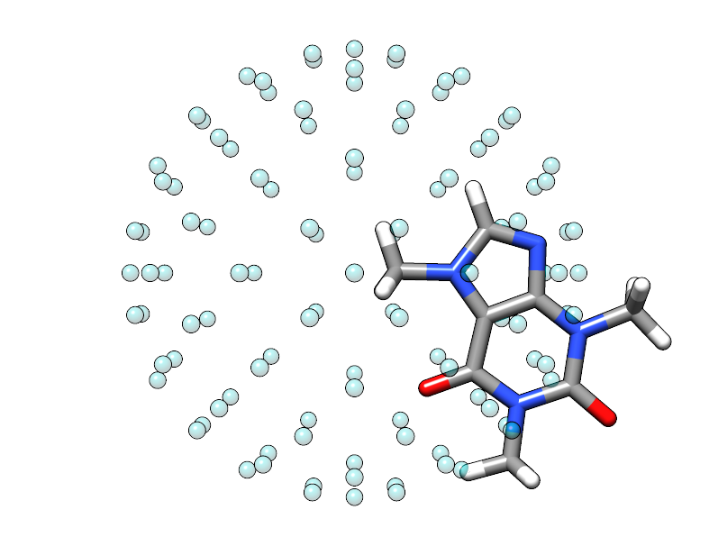
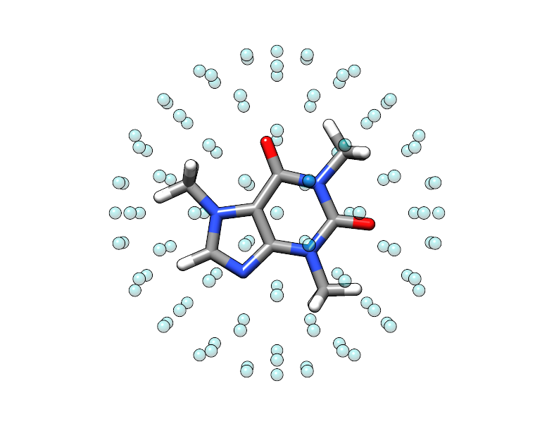
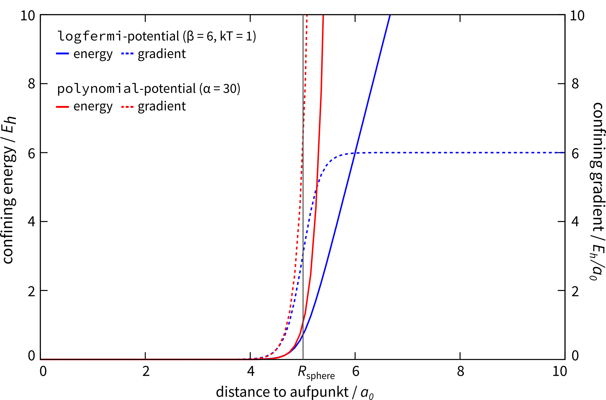
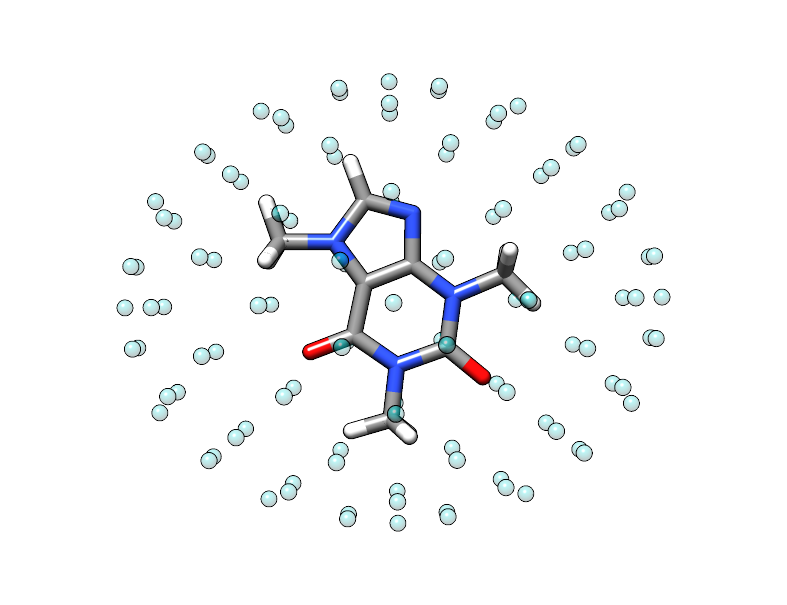

.. _detailed-input:

----------------
 Detailed Input
----------------

The ``xcontrol`` instruction set is inspired by the Turbomole ``control``
file syntax. I decided to call it ``xcontrol`` instructions back than,
but here we will just call it (detailed) input for convenience.
The man page can be found `here <https://github.com/grimme-lab/xtb/blob/master/man/xcontrol.7.adoc>`_.

.. note:: The parser implemented is more general and limited by
          arbitrary choice to this syntax. At some point more common
          formats like JSON, YAML or XML might become available
          as alternative input formats.

To read an input file called ``xtb.inp`` use

.. code:: bash

  > xtb --input xtb.inp coord

In the detailed input you have control about almost very global
variable in the program, some instructions even check your input, but
most of the time you should know what you are doing.
Developed as a feature for developers, this is incredible powerful
and naturally way to complicated for the average application.
So in most cases you can safely rely on the internal defaults or
the shipped global configuration file (should usually be the same).

I will walk you through some selected instructions you might find useful
for your application.

.. contents::

Fixing, Constraining and Confining
==================================

In ``xtb`` different concepts of constraints are implemented,
so you should know which tool is best for you problem before you
start writing the detailed input.

We will go through this sections using the caffeine molecule

.. code-block:: none

   24

   C          1.07317        0.04885       -0.07573
   N          2.51365        0.01256       -0.07580
   C          3.35199        1.09592       -0.07533
   N          4.61898        0.73028       -0.07549
   C          4.57907       -0.63144       -0.07531
   C          3.30131       -1.10256       -0.07524
   C          2.98068       -2.48687       -0.07377
   O          1.82530       -2.90038       -0.07577
   N          4.11440       -3.30433       -0.06936
   C          5.45174       -2.85618       -0.07235
   O          6.38934       -3.65965       -0.07232
   N          5.66240       -1.47682       -0.07487
   C          7.00947       -0.93648       -0.07524
   C          3.92063       -4.74093       -0.06158
   H          0.73398        1.08786       -0.07503
   H          0.71239       -0.45698        0.82335
   H          0.71240       -0.45580       -0.97549
   H          2.99301        2.11762       -0.07478
   H          7.76531       -1.72634       -0.07591
   H          7.14864       -0.32182        0.81969
   H          7.14802       -0.32076       -0.96953
   H          2.86501       -5.02316       -0.05833
   H          4.40233       -5.15920        0.82837
   H          4.40017       -5.16929       -0.94780

Exact Fixing
------------

In the *exact fixing* approach the Cartesian position of the selected
atom is fixed in space by setting its gradient to zero and the degrees
of freedom are removed from the optimization procedure and therefore
the atoms stay in place in geometry optimizations.

For dynamics this exact fixing is *automatically deactivated*, since it
usually leads to instabilities in the simulation.

To activate the exact fixing for atoms 1--10 and atom 12 as well as for
all oxygen atoms, add

.. code:: text

  $fix
     atoms: 1-10,12
     elements: O
  $end

to your detailed input, the atoms keyword refers to the numbering
of the individual atoms in your input geometry.
With this input the verbose output will show a short summary of the
fixed atoms:

.. code-block:: text
   :emphasize-lines: 15,19

              -------------------------------------------------
             |                   Fixed Atoms                   |
              -------------------------------------------------

    * 13 fixed atom positions, i.e. in gradient

        #   Z                                   position/Å
        1   6 C      1.0731700     0.0488500    -0.0757300
        2   7 N      2.5136500     0.0125600    -0.0758000
        3   6 C      3.3519900     1.0959200    -0.0753300
        4   7 N      4.6189800     0.7302800    -0.0754900
        5   6 C      4.5790700    -0.6314400    -0.0753100
        6   6 C      3.3013100    -1.1025600    -0.0752400
        7   6 C      2.9806800    -2.4868700    -0.0737700
        8   8 O      1.8253000    -2.9003800    -0.0757700
        9   7 N      4.1144000    -3.3043300    -0.0693600
       10   6 C      5.4517400    -2.8561800    -0.0723500
       12   7 N      5.6624000    -1.4768200    -0.0748700
        8   8 O      1.8253000    -2.9003800    -0.0757700
       11   8 O      6.3893400    -3.6596500    -0.0723200

.. note::

   Since version 6.3 the input is sorted and duplicates are removed automatically.

Constraining Potentials
-----------------------

Almost absolute control about anything in your system is archived
by applying *constraining potentials*. First of all the constraining
potentials offer a weaker version of the exact fixing, which is
invoked by the same syntax in the ``$constrain`` data group as

.. code:: text

  $constrain
     atoms: 11
     elements: C,N,8
  $end

the program will not attempt to hold the Cartesian positions constant,
but the distances between all selected atoms, here number 11 and all
carbon, nitrogen and oxygen. For each atom pair a harmonic potential
is generated to hold the distances at roughly the starting value, this even
works without problems in dynamics.

For your caffeine molecule this results in a problem, which can easily be
spotted in the verbose output of the constraints summary.

.. code-block:: text
   :emphasize-lines: 9,23

              -------------------------------------------------
             |                   Constraints                   |
              -------------------------------------------------

    * 15 constrained atom positions
      positions referring to input geometry

        #   Z                                   position/Å      displ./Å
       11   8 O      6.3577347    -3.6327225    -0.0684681     0.0000000
        1   6 C      1.0687445     0.0520162    -0.0755782     0.0000000
        3   6 C      3.3535252     1.0744217    -0.0774722     0.0000000
        5   6 C      4.5969189    -0.6303196    -0.0745855     0.0000000
        6   6 C      3.2896462    -1.0950551    -0.0735452     0.0000000
        7   6 C      2.9629004    -2.4886091    -0.0702591     0.0000000
       10   6 C      5.4425717    -2.8389078    -0.0699228     0.0000000
       13   6 C      7.0086271    -0.9538835    -0.0749134     0.0000000
       14   6 C      3.9536622    -4.7147069    -0.0641970     0.0000000
        2   7 N      2.5030143     0.0336686    -0.0754494     0.0000000
        4   7 N      4.6213728     0.7205067    -0.0770658     0.0000000
        9   7 N      4.1215924    -3.2704219    -0.0683024     0.0000000
       12   7 N      5.6601563    -1.4769082    -0.0732293     0.0000000
        8   8 O      1.8493654    -2.9780046    -0.0690630     0.0000000
       11   8 O      6.3577347    -3.6327225    -0.0684681     0.0000000

        applying 105 atom pairwise harmonic potentials
          applied force constant per pair:     0.0035714
        effective force constant per atom:     0.0500000
            constraining energy/grad norm:     0.0000000     0.0000000

.. note::

   Since version 6.3 the input is sorted and duplicates are removed automatically.

Note that in some versions of ``xtb`` this leads to ``NaN`` for the
gradient, therefore double-check the constrained atom list for duplicates.

To constrain the atoms more tightly the force constant can be adjusted

.. code:: text

  $constrain
     force constant=1.0
  $end

this variable goes directly into the constraining procedure and is given in
atomic unites (Hartree/Bohr²), for very high force constants this becomes
equivalent to the exact fixing.
Note the difference in the syntax as you are required to use an equal-sign
instead of a colon, as you are modifying a global variable.

It is also possible to constrain selected internal coordinates, possible
are distances, angles and dihedral angles as done here

.. code:: text

  $constrain
     distance: 1, 2, 1.4
     angle: 5, 7, 8, auto
     dihedral: 3, 4, 1, 7, 180
  $end

.. note::

   This printout is not yet fully integrated in the released versions and
   might not work as expected.
   For the experimental constraining potentials supporting this features
   use the all-caps keyword variants (``DISTANCE``, ``ANGLE`` and ``DIHEDRAL``).
   Note that those are not available for the scan feature.

Distance constraints are given in Ångström, while angle constraints are given
in degrees.
The distances are defined by two atom number referring to the order in
your coordinate input, angles are defined by three atom numbers and
dihedral angles by four atoms, in any case the atoms do not have to
be connected by bonds. The last argument is always the value which should
be used in the constraining potential as reference, if you decide to
use the current value ``auto`` can be passed. The constraints will be
printed to the screen (the newer implementation may require the verbose mode,
to trigger the printout of the constraint summary), we check this setup
for the caffeine molecule

.. code-block:: text
   :emphasize-lines: 33

              -------------------------------------------------
             |                   Constraints                   |
              -------------------------------------------------

    * 1 constrained distance

        #   Z        #   Z                                     value/Å      actual/Å
        1   6 C      2   7 N                                 1.4000000     1.4409371

          constraining potential exponent:     2.0000000
         applied force constant per dist.:     0.0500000
        effective force constant per atom:     0.0250000
            constraining energy/grad norm:     0.0002992     0.0109403

    * 1 constrained angle

        #   Z        #   Z        #   Z                        value/°      actual/°
        5   6 C      7   6 C      8   8 O                  150.4357763   150.4357763

         applied force constant per angle:     0.0500000
        effective force constant per atom:     0.0166667
            constraining energy/grad norm:     0.0000000     0.0000000

    * 1 constrained dihedral angle

        #   Z        #   Z        #   Z        #   Z           value/°      actual/°
        3   6 C      4   7 N      1   6 C      7   6 C     180.0000000  -179.9396548

         applied force constant per angle:     0.0500000
        effective force constant per atom:     0.0125000
            constraining energy/grad norm:     0.0000000     0.0000629

        total constraint energy/grad norm:     0.0002993     0.0110032

You can find the constraint energy and gradient at the end of the summary,
check for unphysical high values of the energy and gradient here to verify
your constraint setup otherwise you might encounter strange behaviour in the
following optimization or dynamics to adhere this constraints.

If you are not quite sure which distances or angles you want to constrain,
run

.. code:: bash

  > cat geosum.inp
  $write
     distances=true
     angles=true
     torsions=true
  $end
  > xtb --define --verbose --input geosum.inp caffeine.xyz

and have a look at the geometry summary for your molecule. The ``$write``
data group toggles the printout in the property section and also some
printouts in the input section.

For caffeine the geometry summary including only the distances looks like this

.. code-block:: text

              -------------------------------------------------
             |                Geometry Summary                 |
              -------------------------------------------------

         molecular mass/u    :      194.1926000
      center of mass at/Å    :        4.0569420      -1.6298957      -0.0733327
     moments of inertia/u·Å² :        4.7317175E+02   7.1109348E+02   1.1745947E+03
   rotational constants/cm⁻¹ :        3.5626878E-02   2.3706633E-02   1.4351872E-02

    * 25 selected distances

        #   Z        #   Z                                     value/Å
        1   6 C      2   7 N                                 1.4409371
        2   7 N      3   6 C                                 1.3698478
        3   6 C      4   7 N                                 1.3186949
        4   7 N      5   6 C                                 1.3623047
        2   7 N      6   6 C                                 1.3652477
        5   6 C      6   6 C                                 1.3618461
        6   6 C      7   6 C                                 1.4209574
        7   6 C      8   8 O                                 1.2271501
        7   6 C      9   7 N                                 1.3977057
        9   7 N     10   6 C                                 1.4104346
       10   6 C     11   8 O                                 1.2347703
        5   6 C     12   7 N                                 1.3741439
       10   6 C     12   7 N                                 1.3953559
       12   7 N     13   6 C                                 1.4514011 (max)
        9   7 N     14   6 C                                 1.4496299
        1   6 C     15   1 H                                 1.0929740
        1   6 C     16   1 H                                 1.0928728
        1   6 C     17   1 H                                 1.0928837
        3   6 C     18   1 H                                 1.0829302 (min)
       13   6 C     19   1 H                                 1.0932399
       13   6 C     20   1 H                                 1.0945661
       13   6 C     21   1 H                                 1.0945601
       14   6 C     22   1 H                                 1.0927021
       14   6 C     23   1 H                                 1.0949866
       14   6 C     24   1 H                                 1.0949141

    * 4 distinct bonds (by element types)

      Z      Z             #   av. dist./Å        max./Å        min./Å
      1 H    6 C          10     1.0926630     1.0949866     1.0829302
      6 C    6 C           2     1.3914017     1.4209574     1.3618461
      6 C    7 N          11     1.3941548     1.4514011     1.3186949
      6 C    8 O           2     1.2309602     1.2347703     1.2271501

There is no electronic structure information used at this point but a
simple geometric model to select distances, which can get too few
or too many bonds or angles in this printout.

Confining in a Cavity
---------------------

If you are running dynamics for systems that are non-covalently bound,
you may encounter dissociation in the dynamics. If you want to
study the bound complex, you can try to *confine* the simulation
in a little sphere, which keeps the molecules from escaping.
The detailed input looks like

.. code:: text

  $wall
     potential=logfermi
     sphere: auto, all
  $end

You can be more precise on the radius by giving the value in Bohr instead
of ``auto``. The automatically determined radius is based on the largest
interatomic distance in the structure plus some offset.
The logfermi potential is best suited for confinements, but not yet the
default potential.

When using this input with the caffeine molecule the automatically
determined radius is about 5.6 Å, which should be large enough to contain
a molecule of its size.
At first it might be surprising to find that the confining energy
is about +84 kcal/mol, but we did we did not account for the placement of 
the molecule, relative to the center of potential within our chosen input.
Currently, the center point of the spherical logfermi potential
is set at the origin (0,0,0) and the center of mass of the caffeine molecule
is about 4.4 Å away from it, so our molecule is stuck halfway in the wall
we just created.

   The sphere used to construct the potential is represented by the
   transparent teal dots placed on a fine Lebedev grid.
   Visual inspection suggests that the potential is misplaced.

To cope with this we should put the center of mass of the caffeine molecule
at the origin, this can be done by adding the ``$cma`` instruction to the input
file, which shifts the coordinates with the center of mass and aligns
the molecule to its principal axes of inertia.

   The caffeine molecule is now shifted correctly inside the potential.
   The confining energy, for the correctly placed potential is now 0 kcal/mol.

.. note:: The center point for all wall potentials is always placed at the origin,
          which cannot be changed with the currently available input options.
          Therefore, we resort to modifying our input coordinates here.

Different Potential Shapes
~~~~~~~~~~~~~~~~~~~~~~~~~~

Currently two different potential shapes are implemented and can be
selected with the ``potential`` instruction.

The logfermi potential shape is given by the expression

.. math::
   V = \sum_\text{A} k_B T \log\Bigl\{1 + \exp\bigl[
   \beta(|\mathbf R_\text{A} - \mathbf O|- R_\text{sphere})\bigr] \Bigr\}

where
*k*\ :sub:`B` is the Boltzmann constant,
*T* is formally the temperature but can be used to scale
the strength of the potential (adjustable by ``temp=<real>``, within the ``$wall`` group),
*β* is the steepness of the potential (adjustable by ``beta=<real>``),
**R**\ :sub:`A` are the cartesian coordinates of atom A,
**O** is the origin (0,0,0) and
*R*\ :sub:`sphere` is the radius of the sphere used for confining.

The *default* potential shape is a simple polynomial to the power *α*
(adjustable by ``alpha=<int>``).
The formula that is evaluated in the program is

.. math::
   V = \sum_\text{A}
   \left(\frac{|\mathbf R_\text{A} - \mathbf O|}{R_\text{sphere}}\right)^\alpha

The main (dis)advantage of this shape is that the radius of the sphere
is a *relative* quantity compared to the size of the molecule.
The ``auto`` generator of the sphere radius takes this into account,
by rescaling the largest distance in the molecule instead of adding
a constant shift.
A clear disadvantage of this potential shape it that the gradient does
not vanish inside the sphere and can compress a molecule artificially.

   Available potential shapes with energy and gradient contribution.

Anisotropic Potentials
~~~~~~~~~~~~~~~~~~~~~~

For some molecules an isotropic spherical cavity is not suitable for confinement,
since the molecule might have a rod-like or oblate shape.
Instead of sphere we can use an ellipsoid to construct an anisotropic cavity,
there is no limitation for the potential shape since we use a simple rescaling
to introduce anisotropy.

The input file for an anisotropic potential would look like

.. code-block:: text

   $wall
      potential=logfermi
      ellipsoid: 13.5,11.1,8.6,all # values in Bohr
   $end

As for the isotropic one can use the ``auto`` keyword to replace any of the
the three radii with an automatically determined value.
The automatic determined value is the automatic isotropic sphere radius,
so letting all three values be autodetermined results in an isotropic potential.

As before, we have to deal with the issue that the center of mass of our caffeine
molecule and the origin do not coincident, this time we use a Python interpreter
with ASE support for this job

.. code-block:: python

   from ase.io import read, write
   mol = read('caffeine.xyz')
   mol.set_positions(mol.get_positions() - mol.get_center_of_mass())
   write('caffeine_shifted.xyz', mol)

Finally we can check ``xtb`` with the new coordinates and the above input file and
we find that the confining energy is zero in the initial geometry.

   Shifted caffeine molecule in an anisotropic potential,
   note that the structure is not rotated this time.

Using Multiple Potentials
~~~~~~~~~~~~~~~~~~~~~~~~~

Since version 6.0 an arbitrary number of wall potentials is supported.
Similar to the constraint keywords one could create multiple wall potentials
by repeating ``sphere`` and/or ``ellipsoid`` instructions like

.. code-block:: none

   $wall
      potential=logfermi
      sphere: auto, all
      ellipsoid: 13.5,11.1,8.6,all # values in Bohr
   $end

This could be used to confine different fragments in different sized spheres.
The only restriction is that the potential shape is global.

Absolute Control
================

As I promised you can control almost everything, the ``xcontrol(7)`` man page
is a good starting point to get acquainted with the detailed input. This
poses the usual hindrance of actually reading the documentation
(since you are here, you are already above average, thumbs up).

A practical alternative is to just dump the complete internal settings
of the program to an input file and start playing around with it.
To do so, run

.. code:: bash

   > xtb --input default.inp --define --copy coord

The file ``default.inp`` has not to be present when starting the program
in ``--copy`` mode, since the ``default.inp`` will be generated for you.
The ``--define`` flags makes sure that the program only checks your setup
and does not perform any calculation on the input coordinates.

Have a look at the first lines of ``default.inp``:

.. code:: text

   $cmd xtb --input default.inp --define --copy coord
   $date 2019/03/05 at 08:50:26.651
   $chrg 0
   $spin 0
   ...

This is actually the command you used in the first place to invoke the
program, next you find the timestamp when the program was started and
then system specific information about charge and spinstate of your system,
this is what I understand as a self-documenting program run.
``$cmd`` and ``$date`` are cosmetic features and will never influence
any calculation if included in the detailed input, but I figured that
they might become handy if you look back into your calculations when
putting together the manuscript or taking over a project from your,
now graduated, fellow coworker.

The rest of the file represent every accessible variable documented
in the ``xcontrol(7)`` man page with its current setting, this should be
quite a lot. So lets focus say on the ``$wall`` group:

.. code:: text

   ...
   $wall
      potential=polynomial
      alpha=30
      beta=6.000000000000000
      temp=300.0000000000000
      autoscale=1.000000000000000
      axisshift=3.500000000000000
   ...

The default potential is a ``polynomial`` one, you want to change this to
the ``logfermi`` potential. ``alpha`` is only needed for the ``polynomial``
potential, we use ``beta`` and ``temp`` in our potential.
The steepness of our potential can be adjusted by modifying the value
of ``beta``, since our potential is multiplied with the thermal energy
we can scale it by increasing it temperature in ``temp``.
``autoscale`` is a factor the automatic determined sphere axes are
multiplied with, a default of 1.0 seems reasonable here, but sometimes
we need more space or want to squeeze everything a bit together.
We can also adjust the constant shift value used in the generation
of the automatic axes, but on a second thought this value might be
just fine, so we do not modify ``axisshift`` today.

This is an awful lot of information in a small block and quite essential
for your calculation using a confining potential, all details on this
can be found in ``xcontrol(7)`` man page at the group instruction
of interest.

.. tip:: If you are happy with all this setting you can just use this file as
         your ``.xtbrc`` and place it somewhere in your ``XTBPATH``.

Global Configuration File
-------------------------

The global configuration file called ``.xtbrc`` has to be around somewhere
in your ``XTBPATH`` so ``xtb`` is able to find it and uses the very same
syntax as the detailed input. Every instruction (``key=value``) you can
use in your detailed input file can be present in your global configuration
file. System specific instructions (``key: value``) will not work, of course.
To check which ``.xtbrc`` is read, start the program in verbose mode and
check the *Calculation Setup* section in the output.

Rules for Control
=================

This section is intended to briefly explain the currently applied
rules to parse the detailed input file.

Every instruction is started by a flag (``$``) and terminated by the next flag.
An instruction is only valid if the flag is in the first letter, the
instruction name is the rest of the register (line).
A valid instruction opens its block with its own options, every option
is a key-value pair. Invalid instructions are ignored without further warning.

There are two kind of instructions, logical and groups.
Logical instructions toggle a specific operation and cannot contain a option
block while group instructions only open the option block without any
further actions.

Groups with the same name can occur multiple times and are merged before parsing.
There are two kind of options, ``key=value`` pairs set global variables and
can only be used *once*, they are locked at the *first encounter* of the key,
regardless of the value, in case an invalid value is given the default is used
as fallback and cannot be modified by subsequent options with the same key.

Options of the kind ``key: values,...`` can be present multiple times and
are handled differently depending on the context they are used in.
For example the ``atoms:`` instruction usually appends atoms to an list,
while ``distance:`` in ``$constrain`` applies a quadratic potential to
the atom pair specified.
