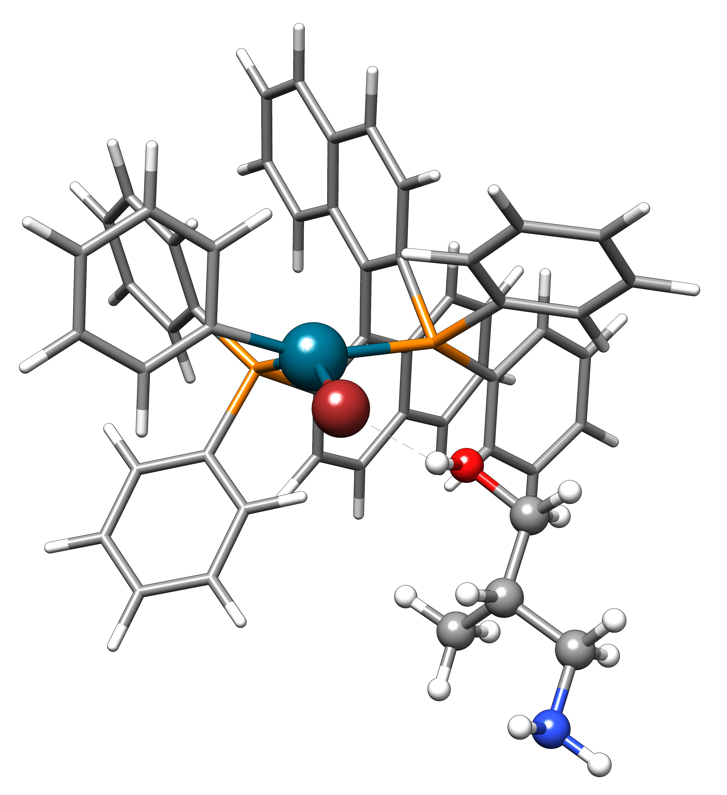
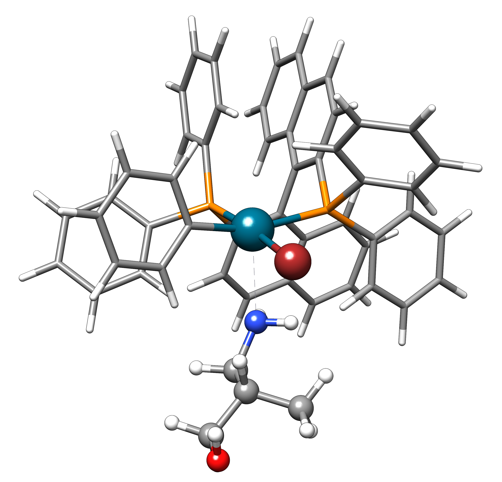

.. _xtb_docking:

-------------------------
 Docking Submodule (aISS)
-------------------------

.. note::
   This feature is only present in version 6.6 and newer.

The automated Interaction Site Screening (aISS) of the docking submodule allows the addition of any molecules to dimers and aggregates.
This is done via an interaction site screening and genetic optimization with the xTB-IFF energy,
followed by GFN geometry optimizations.
By default, only the 15 best structures are optimized, but also an ensemble generation is possible.

.. important::
   The screening is based on the rigid intermolecular force field xTB-IFF.
   Thus, changes in the intramolecular geometry are only considered upon geometry optimization.

To run the docking submodule use:

.. code-block:: text

   xtb dock [options] <geometry1> <geometry2> [options]

The geometry can be in any format accepted by ``xtb``. If a ``.CHRG`` or ``.UHF`` file is
present in the current directory, they are read automatically to obtain information about
the charges and number of unpaired electrons of molecules 1 and 2.
They have to contain three lines, starting with the total charge/uhf, followed by 
the charge/uhf of molecules 1 and 2.

Options
=======

--help
   Display the help window

--chrg1 INT
   Define charge for molecule 1

--chrg2 INT
   Define charge for molecule 2

--uhf1 INT
   Define the number of unpaired electrons for molecule 1

--uhf2 INT
   Define the number of unpaired electrons for molecule 2

-I, --input FILE
   Use FILE as an input source for ``xcontrol(7)`` instructions

--pocket
   Performs additionally a pocket search

--nostack
   Switch off the stack search

--noangular
   Switch off the angular search

--fast
   Fast mode for screening and genetic optimization

--atm
   Include ATM term for screening and optimization

--stepr REAL
   Radial step size

--stepa REAL
   Angular step size

--maxgen INT
   Number of cycles for genetic optimization

--maxparent INT
   Number of parents for genetic optimization
   
--nstack INT
   Number of gridpoints in one direction of the stack search

--nfinal INT
   Number of final optimizations

--ensemble
   Optimizes every structure with a negative xTB-IFF interaction energy and sorts out replicates to yield an NCI ensemble

--etemp REAL
   Electronic temperature (default = 300K)

--iterations INT
   Maximum iterations for SCF cycle

-a, --acc REAL
   Accuracy for SCC calculation, lower is better (default = 1.0)

--opt <level>
   Precision of the optimization. See :ref:`geometry` for available options

--cycles INT
   Maximum number of optimization cycles

--gfn2
   Perform final optimizations with GFN2-xTB (default)
 
--gfn1
   Perform final optimizations with GFN1-xTB

--gfnff
   Perform final optimizations with GFN-FF

--alpb [reference]
    analytical linearized Poisson-Boltzmann (ALPB) model,
    available solvents are *acetone*, *acetonitrile*, *aniline*, *benzaldehyde*,
    *benzene*, *ch2cl2*, *chcl3*, *cs2*, *dioxane*, *dmf*, *dmso*, *ether*,
    *ethylacetate*, *furane*, *hexadecane*, *hexane*, *methanol*, *nitromethane*,
    *octanol*, *woctanol*, *phenol*, *toluene*, *thf*, *water*.
    The solvent input is not case-sensitive.
    The Gsolv reference state can be chosen as *reference* or *bar1M* (default).

-g, --gbsa SOLVENT [reference]
    generalized born (GB) model with solvent accessible surface (SASA) model,
    available solvents are *acetone*, *acetonitrile*, *benzene* (only GFN1-xTB),
    *CH2Cl2*, *CHCl3*, *CS2*, *DMF* (only GFN2-xTB), *DMSO*, *ether*, *H2O*,
    *methanol*, *n-hexane* (only GFN2-xTB), *THF* and *toluene*.
    The solvent input is not case-sensitive.
    The Gsolv reference state can be chosen as *reference* or *bar1M* (default).

Detailed Input
==============

To read an input file called ``xtb.inp`` use

.. code:: bash

  > xtb --input xtb.inp coord

In the detailed input, you have control over almost every global
variable in the program, some instructions even check your input, but
most of the time you should know what you are doing.
So in most cases, you can safely rely on the internal defaults or
the shipped global configuration file (which should usually be the same).
For the final optimizations, many of the standard inputs of xtb will
work (:ref:`detailed-input`) like the constraining and fixing of atoms.

To define variables that belong to the energy screening and genetic
optimization, start a new block in the input file with ``$dock``.
An example might look like this:

.. code:: text

  $dock
     pocket
     maxparent = 63
     atm
  $end

Apart from the general variable, also the directed docking can be
activated with an input file. This allows the docking to user-defined 
regions of molecule 1. The default is an attractive potential for the
user-defined atoms, but also a repulsive potential for every other atom
can be used (only recommended for large interacting molecules).
An input file for the directed docking might look like this:

.. code:: text

  $directed
     attractive
     atoms: 1-5
     elements: N
  $end

Examples
========

In the following, two examples are shown of how to perform a docking calculation. 
First, we want to start a standard calculation with the following two coordinate inputs
and charges that are placed in a file named ``.CHRG`` in the current directory:

.. tabbed:: molecule1.xyz

   .. code:: sh

      26
      
       C         4.91530661517725    6.70283245094063    7.93716475951803
       C         4.70274443502525    6.57377729590493    9.29524339877115
       H         4.09102174399250    7.26033628697812    9.85619438676986
       C         5.30083332347772    5.50886296651214    9.95148435215316
       H         5.14950194396918    5.39341270236785   11.01271420108665
       C         6.07968625421465    4.60874288641406    9.24518865717228
       H         6.54677504050510    3.78278315133684    9.75767540823253
       C         6.25703022783366    4.75482454682128    7.88004220926858
       H         6.86007029320169    4.04168399010195    7.34301476032045
       C         5.66602589617880    5.80800301477451    7.18908033030661
       C         5.86757693738733    6.01057612526783    5.69193856008651
       C         7.08202831053878    6.91791330345741    5.48228665306979
       H         7.24115049352935    7.07340643740184    4.41937035609539
       H         7.97015992903950    6.46898272395727    5.91528468405366
       H         6.90905459937370    7.88538694516834    5.94891470399975
       C         6.00723529207749    4.69862546864148    4.92713759447965
       H         5.21841097621933    3.99954166143467    5.19740910959166
       H         6.96848369282735    4.23481873803338    5.12168284991214
       H         5.95419366234075    4.90262716196177    3.86004767791694
       C         3.64840129849507    9.67356063984810    8.63166910176501
       O         4.73243266730302    6.72691667725402    5.16545009366973
       H         4.06891690953035    6.10561213656021    4.82852948175645
       F         4.75466800938595    9.73439880907246    9.35215456436095
       F         2.67459899148865    9.19239065754443    9.38100275774183
       F         3.32953186458964   10.86751693409879    8.19537197705647
       I         4.01066059229276    8.37336628814393    6.88654737084331

.. tabbed:: molecule2.xyz

   .. code:: sh
        
      15
      
       C         1.69917908436396    3.16419000234708    5.71715609389680
       C         2.60797179763240    5.77666501630793    1.55859710223873
       N         3.04393410713759    4.87876887895570    4.08766375461315
       O         1.71709471089772    5.74460140297995    5.99119818311252
       O         0.49329287309353    4.87672637525144    4.06446686790556
       O         2.06112121487995    3.28932161619064    2.35293444108821
       O         4.39145876797790    4.00283070449141    2.20140862554339
       F         2.78451881723356    3.06550089656539    6.49714305953822
       F         0.63418103893843    3.02555503292592    6.52249893622828
       F         1.70857427523024    2.10779486104579    4.90543392667151
       F         1.42635733996611    6.33666447079787    1.81496418774220
       F         3.53272631929243    6.73443277485248    1.71239388025687
       F         2.60933613238697    5.44729166600378    0.25762027938529
       S         1.67585920791859    4.85884119332730    4.86637940756559
       S         3.05359431305024    4.27861510795718    2.63234125421372
      

.. tabbed:: .CHRG

   .. code:: sh

      0
      1
      -1

The program can then be invoked with:

.. code-block:: text

   xtb dock molecule1.xyz molecule2.xyz

It starts with a printout of the calculation setup:

.. code-block:: text

           -------------------------------------------------
          |                Calculation Setup                |
           -------------------------------------------------

          program call               : xtb dock molecule1.xyz molecule2.xyz
          omp threads                :                    12
          coordinate file A          : molecule1.xyz
          coordinate file B          : molecule2.xyz
          number of atoms A          :                    26
          number of atoms B          :                    15
          charge of molecule A       :                   1.0
          charge of molecule B       :                  -1.0
          spin of molecule A         :                     0
          spin of molecule B         :                     0
          first test random number   :      0.24945994848576

Here, you can check if your molecules, the charge and the spin are read correctly.
Next, the computation of electronic properties that are required for the xTB-IFF start:

.. code-block:: text

     Precomputation of electronic porperties
     For Molecule 1
     Successful
    System1: Nat:26 Nlmo:45
     For Molecule 2
     Successful
    System2: Nat:15 Nlmo:46
     LUMO energy 1 (read)           : -11.747
     HOMO energy 1 (read)           : -15.700
     LUMO energy 2 (read)           :  -1.118
     HOMO energy 2 (read)           :  -8.280

The HOMO and LUMO energies of both molecules are printed. Next, the screening starts:

.. code-block:: text

    ==============================================
    |         Starting Energy Screening          |
    ==============================================
    
     Fast Mode selected (recommended)
     If ATM term should be included, use -atm option.
    
    Method for final opts.    : gfn2
    # of genetic optimizations: 10
    # of parents              : 100
    # of final geo. opts.     : 15
    Rare gas grid step size   :    2.50
    ang step size /deg        :   45.00
    # angular grid points     : 512
    
    Performing stack search
    Performing angular search
    
    initialization done
     Total gfn2 energy molecule 1:   -48.6147678106
     Total gfn2 energy molecule 2:   -58.6279172500
    

A summary of the settings is printed and a single-point calculation for both molecules is performed.
The grid-based screening yields a set of starting structures with the best xTB-IFF interaction energies
printed:

.. code-block:: text

    -----------------------------
     Grid based energy screening 
    -----------------------------
    
     # probe RG points   :20384
     Best rare gas probe energy/kcal   :   -2.17
     +0.1 charged probe energy/kcal:    0.32
     -0.1 charged probe energy/kcal:  -10.05
    
      Starting stack search
      Grid points: 56000
      lowest found /kcal : -179.89
    
      Starting angular search
      Grid points:33792
    
      Interaction energy of lowest structures so far in kcal/mol:
          -223.79
          -179.89
          -157.28
          -127.74
          -119.84
          -100.97
           -75.50
           -73.99
           -71.16
           -68.25
 

The best structures are used for the genetic optimization algorithm that runs in multiple cycles.
The best and the average xTB-IFF interaction energies are printed for each cycle:

.. code-block:: text

    ------------------------------
    genetic optimization algorithm
    ------------------------------
      cycle  Eint/kcal/mol  average Eint
       1        -307.6        -77.2
       2        -347.8        -95.5
       3        -364.1       -120.1
       4        -364.1       -144.7
       5        -385.5       -156.3
       6        -385.5       -167.6
       7        -385.5       -178.6
       8        -395.3       -185.6
       9        -395.3       -197.5
       10        -395.3       -197.5

Lastly, the structures are optimized and the resulting GFN2-xTB interaction energies are printed:

.. code-block:: text

   Optimizing 15 best structures with gfn2
              1
              2
              3
              4
              5
              6
              7
              8
              9
             10
             11
             12
             13
             14
             15
    
      ---------------------------
         Interaction energies
      ---------------------------
      #   E_int (kcal/mol)
     1      -108.35
     2      -105.42
     3      -104.13
     4      -103.29
     5       -97.77
     6       -97.08
     7       -91.29
     8       -87.21
     9       -72.18
     10       -57.62
     11       -55.13
     12       -52.83
     13       -51.76
     14       -49.34
     15       -49.34

The second example is the use of the directed interaction site screening feature. For this, we have a look at the Buchwald-Hartwig amination and want to add an amine to the catalyst. The normal run-mode with

.. tabbed:: command

   .. code-block:: text

      xtb dock amine.xyz cat.xyz --alpb dmso

.. tabbed:: amine.xyz

   .. code:: sh

      17
      
      C         -3.83142        2.84076       -0.12858
      C         -2.71271        3.80734        0.30971
      H         -3.71462        1.86884        0.40191
      H         -3.75622        2.64976       -1.22212
      N         -5.15092        3.38956        0.17246
      C         -1.33694        3.16769        0.04220
      H         -1.25577        2.18168        0.55506
      O         -0.29754        4.00686        0.46991
      H         -1.20946        2.97517       -1.04499
      C         -2.83420        5.15491       -0.42082
      H         -2.80779        3.98502        1.40408
      H         -3.81369        5.63034       -0.20316
      H         -2.74149        5.01454       -1.51927
      H         -2.04024        5.85352       -0.08200
      H         -0.26205        3.93413        1.45941
      H         -5.25016        3.49470        1.20852
      H         -5.87559        2.70758       -0.14876

.. tabbed:: cat.xyz

   .. code:: sh

      91
      
      C         1.93043500098766    1.88705038720360    1.27636508509218
      C         1.97459955939123    0.74829779266863    0.44541875684329
      C         1.02990478561238   -0.25192813715073    0.61271403691281
      C         0.01601735664743   -0.12897843953165    1.59684329718372
      C         0.00486602136491    1.01110036222777    2.44153841945833
      C         0.97835673662409    2.01174361389064    2.24665778060226
      C        -0.97905754314325    1.11228749020351    3.44591237208907
      C        -1.91732132645756    0.13258429215518    3.60623449046156
      C        -1.91580023210662   -0.98853603691249    2.76273320705236
      C        -0.97388551841309   -1.11865256011331    1.78244381763454
      H         2.65978989329656    2.67284509679964    1.13525202046656
      P         3.40713569692185    0.45063598133824   -0.66730537531161
      H         0.96019342902486    2.88618786841156    2.88182270064755
      H        -0.97520803758161    1.98254339068831    4.08664095236231
      H        -2.66738870368542    0.21483103956499    4.37886209692111
      H        -2.66684386400195   -1.75316672163424    2.89574895976153
      H        -0.97655866734491   -1.98426023003818    1.13659299566919
      C         0.14526976821989   -1.59943917510233   -1.31351060703041
      C         1.07251821082195   -1.45287954419223   -0.25056729192353
      C         2.01675163349715   -2.43347387046616   -0.00496289247722
      P         3.16338763564251   -2.18383389437502    1.40106621266299
      C         2.09382972162840   -3.55943079098827   -0.84871958824212
      H         2.83641281317833   -4.31953291581165   -0.65217511543419
      C         1.24280991573976   -3.69290879737754   -1.90717437340130
      H         1.31553262831252   -4.55229356826996   -2.55820916660748
      C        -0.87091005687256   -0.65166269717626   -1.56151193975196
      H        -0.95748963139948    0.20553325193108   -0.91031863064544
      C        -1.73979297136593   -0.81645211711138   -2.60279427063404
      H        -2.51734053271247   -0.08796162352007   -2.77956466580218
      C        -1.62876259469206   -1.92603748517661   -3.45412086454612
      H        -2.31889204202597   -2.03459993938128   -4.27768220744122
      C        -0.65665910714600   -2.86135403786885   -3.23917435001203
      H        -0.56554282455158   -3.72146199672846   -3.88685605699420
      C         0.24636505357355   -2.72958028321865   -2.16482109262523
      H         5.04053258549462    1.95308963427405    1.04874130293099
      C         4.89299905597580    2.58285906489136    0.16680216541704
      C         4.10488718080303    2.11753771222348   -0.88819970805292
      C         3.97295738904971    2.88967645799337   -2.03513257239657
      H         3.39723484500199    2.52608137901539   -2.87409316269410
      C         4.59842473761614    4.12259113716083   -2.10916621820447
      H         4.49632983073021    4.71832348999157   -3.00459307720805
      C         5.36052464719349    4.58801603121167   -1.05134179967215
      H         5.85161053486878    5.54723300913738   -1.12057939847728
      C         5.51132642475435    3.81457877063409    0.08906544598702
      H         6.12430221283919    4.16423408293853    0.90645144171876
      H         4.02235854811705   -1.50514117966998   -2.62568631546343
      C         3.17171560446993   -0.95856763004698   -3.01734431858295
      C         2.63287562149439    0.08153169594252   -2.26955458530146
      C         1.54867283380819    0.80195882229825   -2.75892383744741
      H         1.12910258822322    1.60673248403452   -2.16984850528478
      C         1.01257926858250    0.47853247540941   -3.99057124693866
      H         0.17235393384064    1.03814430156328   -4.37523265288449
      C         1.54560532773241   -0.56581734842844   -4.72987768534842
      H         1.11691409607470   -0.81711771999023   -5.68872690644839
      C         2.62541313998850   -1.28431754891050   -4.24489077872467
      H         3.04105424986400   -2.09553801038726   -4.82408759676300
      H         1.33583677784850   -0.82873466427346    5.74959205741078
      C         1.26250407321549   -1.53427439323018    4.93563022334869
      C         0.29685622096144   -2.52577568384178    4.96085114639427
      H        -0.38313849657341   -2.59518745232414    5.79689008875041
      C         0.19668480503760   -3.42844758612526    3.91363117399716
      H        -0.55933008558367   -4.19984014517295    3.93572836724455
      C         1.05679203332485   -3.33904298939608    2.83622868708840
      H         0.97445240569863   -4.03019593470187    2.00770835752968
      C         2.03445785679514   -2.34902776756531    2.81406458864911
      C         2.13344773754576   -1.44693938519777    3.86489629972164
      H         2.89614915297169   -0.67987095722238    3.83313387572892
      H         3.25921334801924   -4.71335584827297    3.07226012100153
      C         4.00261823026728   -4.76527466002177    2.28923954719084
      C         4.13222360890273   -3.72488308629829    1.37980089608449
      C         5.12501838704103   -3.78362597909007    0.39615117544011
      H         5.25174418682844   -2.94381011451806   -0.29798750601985
      C         5.94979789753754   -4.88747721429718    0.30547426182948
      H         6.71495850178344   -4.92841143016068   -0.45555496637095
      C         5.80628422003005   -5.93092016593784    1.20919590786652
      H         6.45742194745829   -6.79014207166281    1.14714340803080
      C         4.84174527360330   -5.86441400163025    2.19959273526782
      H         4.74234127515449   -6.67004520297639    2.91238124196596
      Pd        4.78192197941655   -0.66933638538210    0.85762028033921
      Br        6.90486545126967   -0.17867263571098   -0.18326172511155
      H         7.37446354631147   -1.04019934049166    6.04329576704061
      C         6.91663995455383   -1.04349587877704    5.06457569303456
      C         6.05508853955129   -0.02279064401079    4.70077220142163
      H         5.83860591747490    0.78008768332450    5.39255355348365
      C         5.47218706806705   -0.03062310789953    3.44297757635991
      H         4.79334920330727    0.78885028511248    3.17067260451879
      C         5.74792721423441   -1.05736492435150    2.54875260346842
      C         6.62248653363798   -2.06747078693591    2.90806661030017
      H         6.87538232643100   -2.85581054435732    2.20921648721850
      C         7.20078991262123   -2.05881341616422    4.16869328286306
      H         7.88469613172747   -2.84885038665529    4.44540467384734

will yield a structure with the alcohol moiety bound to the catalyst:

Now, we want to add the amine selectively and thus provide the following ``xtb.inp`` input file:

   .. code:: sh

      $directed
         atoms: 5,16,17
      $end

and invoke ``xtb`` with 
 
  .. code:: sh
  
     xtb dock amine.xyz cat.xyz --alpb dmso --input xtb.inp

This will result to a structure where the amine moiety is bound to the catalyst, as proposed for the mechanism:

